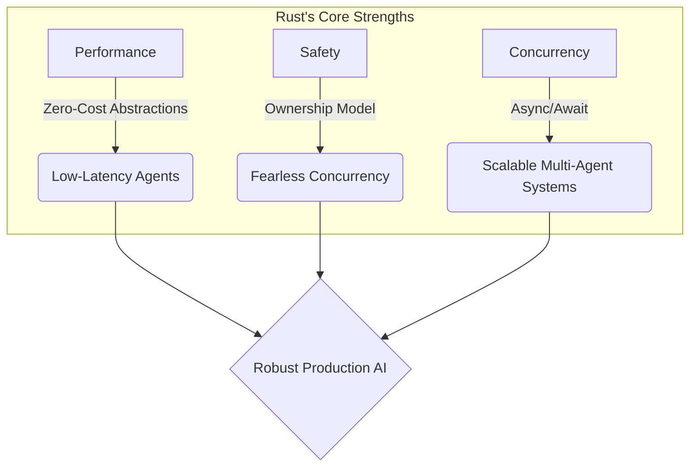
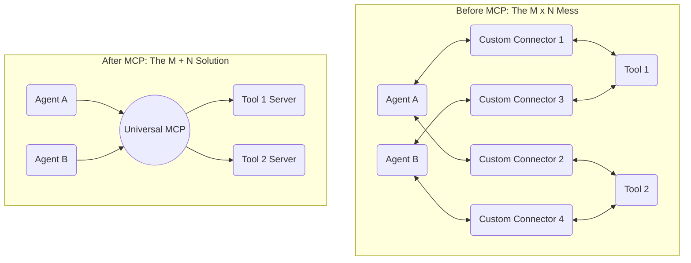
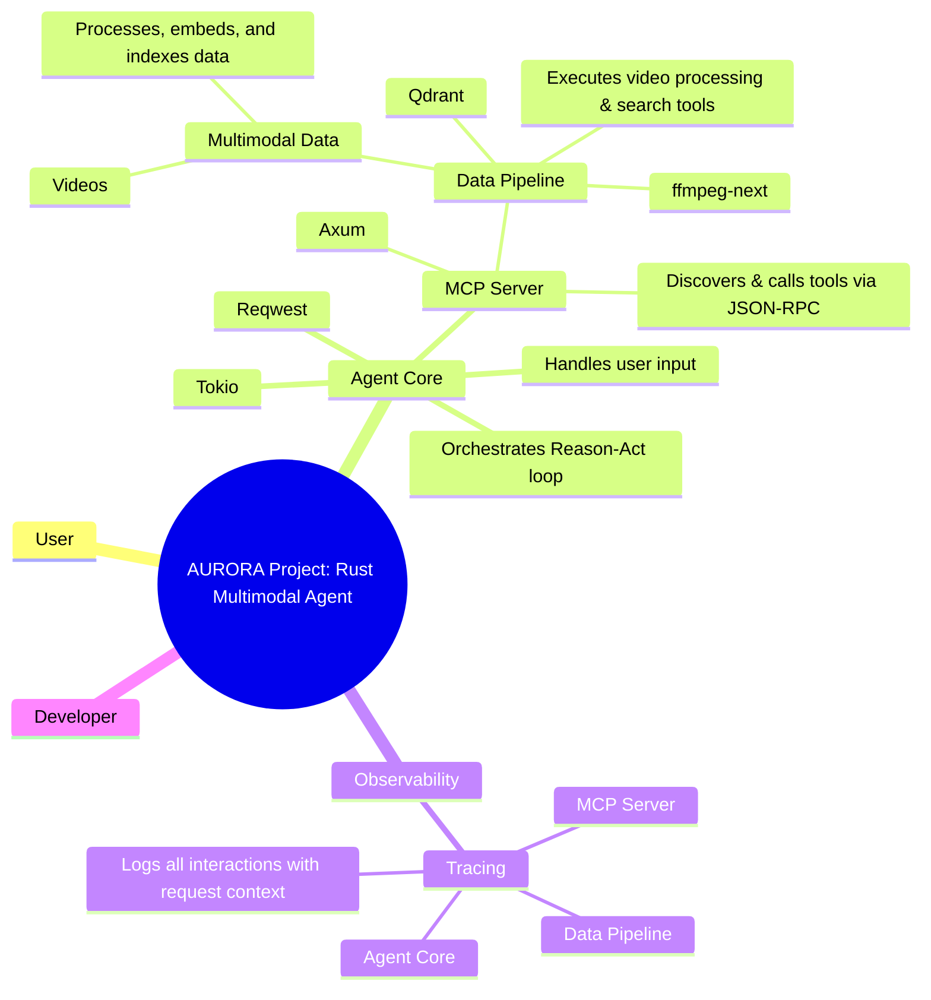
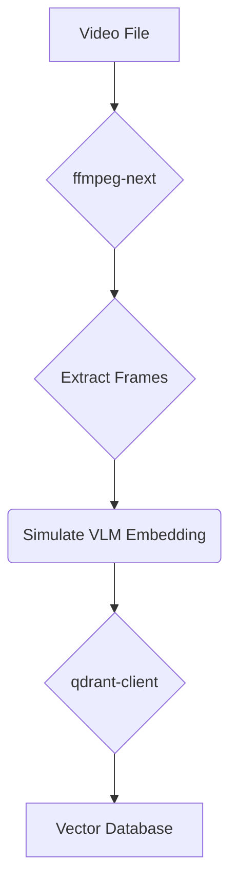
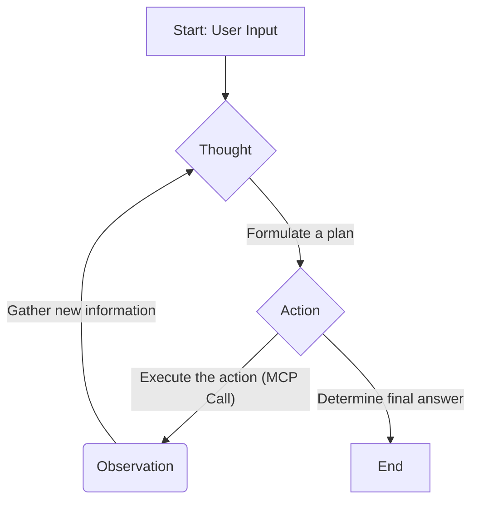
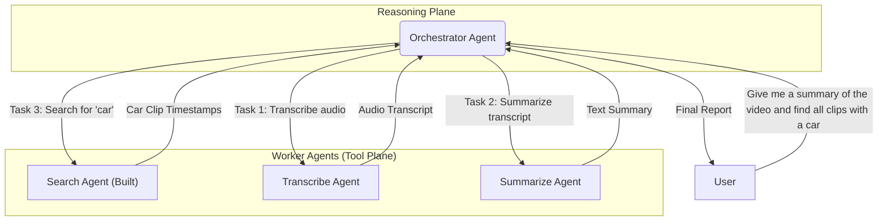

# The AURORA Project: A Production-Focused Guide to Building Multimodal AI Agents in Rust

## Table Of Contents
- [The AURORA Project: A Production-Focused Guide to Building Multimodal AI Agents in Rust](#the-aurora-project-a-production-focused-guide-to-building-multimodal-ai-agents-in-rust)
  - [Table Of Contents](#table-of-contents)
  - [Introduction: The Case for a Modern Agent Framework in Rust](#introduction-the-case-for-a-modern-agent-framework-in-rust)
    - [The Rust Advantage: A Strategic Choice](#the-rust-advantage-a-strategic-choice)
  - [Part I: First Principles - Deconstructing the Multimodal Agent](#part-i-first-principles---deconstructing-the-multimodal-agent)
    - [Concept 1: The Multimodal Agent as a Master Chef](#concept-1-the-multimodal-agent-as-a-master-chef)
    - [Concept 2: The Model Context Protocol (MCP) as the Universal Shipping Container for AI](#concept-2-the-model-context-protocol-mcp-as-the-universal-shipping-container-for-ai)
  - [Part II: Architecting the System - The Four Pillars in Rust](#part-ii-architecting-the-system---the-four-pillars-in-rust)
    - [The Four Pillars: A Curated Rust Stack](#the-four-pillars-a-curated-rust-stack)
  - [Part III: Implementation Guide: Building the Framework in Six Milestones](#part-iii-implementation-guide-building-the-framework-in-six-milestones)
    - [Milestone 1: Core Primitives and Data Structures](#milestone-1-core-primitives-and-data-structures)
    - [Milestone 2: The Abstraction Layer (Traits)](#milestone-2-the-abstraction-layer-traits)
    - [Milestone 3: The Data Pipeline - From Video to Vectors](#milestone-3-the-data-pipeline---from-video-to-vectors)
    - [Milestone 4: The MCP Tool Server - Exposing Capabilities](#milestone-4-the-mcp-tool-server---exposing-capabilities)
    - [Milestone 5: The Agentic Core - The ReAct Loop](#milestone-5-the-agentic-core---the-react-loop)
    - [Milestone 6: Production-Grade Observability](#milestone-6-production-grade-observability)
  - [Part IV: Advanced Horizons - Scaling and Enhancing Your Rust Agent](#part-iv-advanced-horizons---scaling-and-enhancing-your-rust-agent)
    - [From Stateless to Stateful: Giving Your Agent a Memory](#from-stateless-to-stateful-giving-your-agent-a-memory)
    - [From Single Agent to Multi-Agent Collaboration](#from-single-agent-to-multi-agent-collaboration)
  - [Part V: Navigating Production Pitfalls - Idiomatic Rust Best Practices](#part-v-navigating-production-pitfalls---idiomatic-rust-best-practices)
  - [Part VI: The Complete Code - A Fully Functional Rust Multimodal Agent System](#part-vi-the-complete-code---a-fully-functional-rust-multimodal-agent-system)
    - [Instructions for Running](#instructions-for-running)
    - [`Cargo.toml`](#cargotoml)
    - [`src/errors.rs`](#srcerrorsrs)
    - [`src/data_pipeline.rs`](#srcdata_pipeliners)
    - [`src/mcp_server.rs`](#srcmcp_serverrs)
    - [`src/agent_core.rs`](#srcagent_corers)
    - [`src/main.rs`](#srcmainrs)
  - [Part VII: API and Protocol Documentation](#part-vii-api-and-protocol-documentation)
  - [Part VIII: Production-Grade Test Flow](#part-viii-production-grade-test-flow)
    - [1. Unit Tests](#1-unit-tests)
    - [2. Integration Tests](#2-integration-tests)
    - [3. End-to-End (E2E) Tests](#3-end-to-end-e2e-tests)
      - [Happy Path Scenarios](#happy-path-scenarios)
      - [Edge Case and Failure Scenarios](#edge-case-and-failure-scenarios)


## Introduction: The Case for a Modern Agent Framework in Rust

The world of software development is undergoing a paradigm shift, catalyzed by the rapid maturation of Large Language Models (LLMs). We are moving from writing code that performs a task to building systems that understand a goal and orchestrate the steps to achieve it. At the heart of this transformation is the AI Agent: an autonomous entity capable of reasoning, planning, and acting to accomplish complex objectives. However, as these agentic systems grow in complexity, a new set of engineering challenges in performance, state management, concurrency, and reliability has emerged.

This guide introduces the "AURORA Project," a blueprint for engineering a new generation of intelligent agents from the ground up using Rust. Our mission is to construct an agent capable of intelligently searching and reasoning about video content, demonstrating how to achieve a production-ready multimodal system with the unparalleled guarantees of the Rust ecosystem.

### The Rust Advantage: A Strategic Choice

The decision to use Rust is a strategic one, rooted in the unique demands of modern AI systems. While much of the initial AI development has centered on Python, the operational demands of sophisticated agentic systems align perfectly with Rust's core strengths:

  * **Performance**: AI agents are computationally intensive. Rust's zero-cost abstractions and compilation to native machine code ensure minimal overhead, which is critical for responsive user experiences and managing operational costs.
  * **Safety**: An autonomous agent, by definition, makes decisions, introducing risks of unpredictable behavior and memory-related bugs. Rust's ownership model and borrow checker provide compile-time guarantees against these errors, enabling "fearless concurrency" for building complex, stable agents.
  * **Concurrency**: As agent architectures evolve, the ability to handle simultaneous operations-like querying a database, searching the web, and analyzing a document-becomes paramount. Rust's modern `async/await` syntax provides the foundation for highly scalable systems.
  * **A Cohesive Ecosystem**: A key advantage of the Rust approach is building a system from a synergistic stack. Foundational components like the `axum` web framework, the `tokio` asynchronous runtime, and the `tracing` observability framework are deeply integrated, sharing the same core primitives and concurrency models. When combined with a Rust-native vector database like Qdrant, the performance and safety benefits extend down to the data storage layer, resulting in a robust, idiomatic, and integrated system.



This guide is for the software engineer who seeks to understand and build the fundamental engine of an AI agent-a performant, safe, and extensible foundation for the next generation of intelligent applications.

## Part I: First Principles - Deconstructing the Multimodal Agent

Before writing any code, it's essential to understand the core concepts that make our agent possible. We'll use the Feynman Technique-breaking down complex ideas into simple analogies-to build an intuitive understanding.

### Concept 1: The Multimodal Agent as a Master Chef

To grasp the difference between a simple AI and a multimodal one, let's use an analogy.

Imagine a **line cook** in a busy kitchen. This cook is an expert at one thing: reading recipes (text). They are **unimodal**-they operate on a single type of data. They can follow instructions perfectly, but their understanding of the final dish is limited to what's written on the page.

Now, picture a **master chef**. This chef doesn't just read the recipe. They also visually inspect the ingredients for freshness (image), listen to the sizzle in the pan to gauge temperature (audio), and smell the aromas to know when a dish is perfectly cooked (another modality). By combining, or **fusing**, information from all these different sources-these different **modalities**-the master chef develops a deep, nuanced understanding of the meal they are creating. They can adjust the recipe based on what they see, hear, and smell, achieving a level of quality the line cook could never reach.

A **multimodal agent** is like this master chef. It's an AI system designed to process, understand, and reason about information from multiple data types simultaneously. This approach yields significant benefits:

  * **Improved Accuracy**: By cross-referencing information, the agent makes more robust decisions.
  * **Enhanced User Experience**: Users can interact more naturally, using text, speech, or images.
  * **Deeper Contextual Understanding**: The agent gains a holistic view of a situation, critical for complex, real-world applications.

### Concept 2: The Model Context Protocol (MCP) as the Universal Shipping Container for AI

Next, let's tackle how our agent interacts with its tools. Imagine the world of global trade before the invention of the standardized shipping container. To send goods, you needed custom crates for every product, and each ship and port had unique loading equipment. It was a chaotic, inefficient, and unscalable mess. This is the **"M×N integration problem"** in AI: connecting M AI models to N different tools requires an M×N number of custom integrations.

The **Model Context Protocol (MCP)** is the solution. Think of it as the invention of the **universal shipping container for AI**. MCP is an open, standardized protocol that creates a universal "package format" for AI capabilities. Instead of custom-building a connection for every tool, any application that can "pack" its requests into the MCP format can seamlessly use any tool that "unpacks" that format. It transforms the chaotic M×N mess into a clean, manageable M+N "plug-and-play" ecosystem.



Technically, MCP is an open standard built on the widely understood JSON-RPC 2.0 message format. An agent (the client) connects to a tool server and asks, "What can you do?" The server responds with a list of its available functions. Our Rust implementation will leverage the `axum` web framework and `serde` crate to build this pattern idiomatically from scratch.

## Part II: Architecting the System - The Four Pillars in Rust

Building a production-grade agent requires a robust architecture. We will adopt a four-pillar structure, implemented with a curated, synergistic stack of Rust crates chosen for performance, reliability, and ecosystem cohesion.



### The Four Pillars: A Curated Rust Stack

Our architecture stands on four pillars, each realized with a specific set of Rust crates.

1.  **The Data Engine**: This pillar tackles multimodal data complexity.

      * **Video Processing with `ffmpeg-next`**: We will use the `ffmpeg-next` crate, which provides low-level, safe Rust bindings to the ubiquitous FFmpeg library for maximum control and performance in video processing.
      * **Vector Storage with `qdrant-client`**: To store and search frame embeddings, we will use Qdrant, a high-performance vector database written entirely in Rust. We will interact with it using the official `qdrant-client` crate.

2.  **The Integration Framework**: This pillar solves the tool integration problem by exposing our data processing capabilities via MCP.

      * **MCP Server with `axum`**: We will build our MCP server using `axum`, a modern, modular web framework from the Tokio team, chosen for its tight integration with our runtime and observability stack.

3.  **The Agentic Brain**: This is the core of the agent, responsible for reasoning and decision-making.

      * **LLM Interaction with `reqwest`**: We will use the `reqwest` crate, the de facto standard HTTP client in Rust, to communicate with external LLM APIs.
      * **Core Logic with `tokio`**: The entire agentic loop will be orchestrated as an asynchronous task running on the `tokio` runtime, the industry standard for async Rust.

4.  **The Observability Platform**: A critical pillar for any production system.

      * **Structured Logging with `tracing`**: We will use the `tracing` crate, the standard framework for instrumenting Rust programs with structured, event-based diagnostic information, to provide rich, contextualized logs.

| Pillar                    | Purpose                              | Chosen Rust Crate(s)            | Justification & Key Features                                                                      |
| :------------------------ | :----------------------------------- | :------------------------------ | :------------------------------------------------------------------------------------------------ |
| **Data Engine**           | Multimodal Data Processing & Storage | `ffmpeg-next` + `qdrant-client` | Low-level, safe FFmpeg bindings for control; high-performance, Rust-native vector DB for synergy. |
| **Integration Framework** | Standardized Tool Integration        | `axum`                          | Modern, modular web framework from the Tokio team; seamless integration with `tracing`.           |
| **Agentic Brain**         | Reasoning and Orchestration          | `reqwest` + `tokio`             | De facto standard async HTTP client; industry-standard async runtime for the entire system.       |
| **Observability**         | Debugging and Monitoring             | `tracing` + `tower-http`        | The standard for structured, asynchronous-aware diagnostics; provides request-scoped context.     |

## Part III: Implementation Guide: Building the Framework in Six Milestones

This section provides a step-by-step guide to implementing the AURORA agent, building upon the architectural principles we've established.

### Milestone 1: Core Primitives and Data Structures

The foundation of any framework is its data model. We'll define the core data structures that represent information within our system, using strong, clear types.

```rust
// src/primitives.rs
use serde::{Serialize, Deserialize};
use std::collections::HashMap;

#[derive(Serialize, Deserialize, Debug, Clone, PartialEq)]
pub enum Role {
    System,
    Human,
    AI,
}

#[derive(Serialize, Deserialize, Debug, Clone)]
pub struct Message {
    pub role: Role,
    pub content: String,
}

#[derive(Debug, Clone)]
pub struct Document {
    pub page_content: String,
    pub metadata: HashMap<String, String>,
}
```

### Milestone 2: The Abstraction Layer (Traits)

To ensure our framework is modular and extensible, we define core components as traits. A trait creates a shared interface, allowing us to swap implementations easily.

```rust
// src/traits.rs
use crate::primitives::Message;
use async_trait::async_trait;
use std::error::Error;

#[async_trait]
pub trait LLM: Send + Sync {
    async fn invoke(&self, messages: &[Message]) -> Result<String, Box<dyn Error + Send + Sync>>;
}

#[async_trait]
pub trait Tool: Send + Sync {
    fn name(&self) -> String;
    fn description(&self) -> String;
    async fn execute(&self, input: &str) -> Result<String, Box<dyn Error + Send + Sync>>;
}

pub trait Memory: Send + Sync {
    fn get_history(&self) -> Vec<Message>;
    fn add_message(&mut self, message: Message);
    fn clear(&mut self);
}
```

### Milestone 3: The Data Pipeline - From Video to Vectors

The first functional component is the data pipeline. It will ingest a video, extract frames using `ffmpeg-next`, simulate generating vector embeddings, and store them in Qdrant. This logic encapsulates the "Tool" we will expose to our agent.



The implementation will involve initializing a `qdrant-client`, creating a collection, and then using `ffmpeg-next` to iterate through video packets, decode frames, and upsert them in batches to Qdrant.

### Milestone 4: The MCP Tool Server - Exposing Capabilities

Now we expose our data pipeline as a tool that our agent can call via the MCP pattern, using an `axum`-based web server.

The steps are:

1.  **Define MCP Structs**: Use `serde` to create Rust structs for JSON-RPC 2.0 requests and responses.
2.  **Implement Tool Logic**: Write a function, `search_video_for_object(query: String)`, that uses the `qdrant-client` to search for a query embedding.
3.  **Create Axum Router**: Set up a `/mcp` endpoint that accepts POST requests.
4.  **Write the Handler**: The handler will deserialize the request, call the correct tool function based on the `method` field, and serialize the result into a response.

### Milestone 5: The Agentic Core - The ReAct Loop

This is the brain of our operation. It orchestrates the entire process using a **"Reason-Act" (ReAct)** cycle.



The agent's core loop will:

1.  **Reason (First LLM Call)**: Construct a prompt that includes the user's query and a description of the available tools (from our MCP server). Use `reqwest` to send this to an LLM to get a tool call decision.
2.  **Act (MCP Call)**: Parse the LLM's response. If it's a tool call, use `reqwest` again to make a POST request to our own `axum` MCP server, executing the tool.
3.  **Reason (Second LLM Call)**: Take the tool's output, construct a new prompt that includes the new information, and make a final call to the LLM to synthesize a human-readable answer.

### Milestone 6: Production-Grade Observability

To make our system transparent, we integrate `tracing`.

  * **Instrument the Server**: Wrap the `axum` Router with `tower_http::trace::TraceLayer` to automatically create a tracing span for every incoming HTTP request.
  * **Instrument Functions**: Add the `#[tracing::instrument]` attribute macro to key functions to create nested spans, providing a clear view of the call hierarchy.
  * **Structured Logging**: Initialize the `tracing_subscriber` with JSON formatting to produce machine-readable logs that can be ingested by analysis platforms.

## Part IV: Advanced Horizons - Scaling and Enhancing Your Rust Agent

The system built so far provides a powerful foundation. We can extend it using advanced patterns.

### From Stateless to Stateful: Giving Your Agent a Memory

The agent we built is stateless. A stateful agent, which maintains context across a conversation, provides a more natural experience. This can be implemented using our `Memory` trait. For long-term memory, each conversation turn can be embedded and stored in a second Qdrant collection. When a new query arrives, the agent first performs a similarity search on this history to retrieve relevant context before generating a response.

### From Single Agent to Multi-Agent Collaboration

Complex problems are often best solved by a team of specialists. We can extend our architecture into a multi-agent system using a **Director-Programmer-Reviewer** pattern.

  * **Director Agent**: A strategist that breaks a complex goal into smaller tasks.
  * **Worker/Programmer Agent**: A specialist designed to execute one task. The video search agent we built is a perfect example of a worker.
  * **Reviewer/Orchestrator Agent**: A manager that evaluates output from workers and coordinates the workflow.

In Rust, this can be implemented using `tokio`'s concurrency primitives. An "Orchestrator" task can spawn multiple "Worker" tasks (each an `AgentExecutor` instance), which communicate their results back via `tokio` channels.



## Part V: Navigating Production Pitfalls - Idiomatic Rust Best Practices

Deploying agents introduces challenges of robustness and reliability. Rust’s unique features provide powerful solutions.

A defining feature of agentic systems is their interaction with multiple fallible components. Rust's `Result<T, E>` enum provides a massive advantage. The compiler forces the developer to handle potential errors, encouraging a deliberate and explicit approach to failure. By using crates like `anyhow` or `thiserror`, we can create a single, unified error type for our application, making the system far more resilient and easier to debug.

| Pitfall                    | Common Symptoms                                             | Idiomatic Rust Mitigation Strategy                                                                                                                 |
| :------------------------- | :---------------------------------------------------------- | :------------------------------------------------------------------------------------------------------------------------------------------------- |
| **VLM/LLM Hallucination**  | Agent describes objects or events not present in the video. | Use strong system prompts and few-shot examples. Use `tracing` with JSON output to log the exact prompt and response for systematic analysis.      |
| **Tool Execution Failure** | The `axum` MCP server returns an error or times out.        | Implement robust error handling using a custom `AppError` enum and `axum`'s `IntoResponse` trait to convert errors into meaningful HTTP responses. |
| **High Inference Latency** | The agent takes too long to respond.                        | Leverage `tokio`'s efficient async concurrency to perform I/O in parallel. Use Qdrant's performance features. Profile with `tracing-timing`.       |
| **Concurrency Bugs**       | Inconsistent state, data races, or deadlocks.               | This entire class of bugs is largely prevented by the Rust compiler's ownership and borrowing rules, a fundamental advantage of the chosen stack.  |

## Part VI: The Complete Code - A Fully Functional Rust Multimodal Agent System

This final section provides the complete, runnable source code for the AURORA Project, heavily annotated to explain the purpose of each component.

### Instructions for Running

1.  **Install FFmpeg**: Ensure the FFmpeg libraries are installed on your system.
2.  **Run Qdrant**: Use Docker: `docker run -p 6333:6333 -p 6334:6334 qdrant/qdrant`.
3.  **Set API Keys**: Export your LLM API key: `export LLM_API_KEY="your-api-key-here"`.
4.  **Compile and Run**: Use Cargo from the project's root directory:
      * To ingest data: `cargo run -- ingest "/path/to/your/video.mp4"`
      * To start the server: `cargo run -- serve`
      * To ask a question: `cargo run -- ask "your question about the video"`

### `Cargo.toml`

```toml
[package]
name = "aurora-agent"
version = "0.1.0"
edition = "2021"

[dependencies]
# Core Async Runtime
tokio = { version = "1", features = ["full"] }

# Web Server (MCP) & HTTP Middleware (Tracing)
axum = { version = "0.7", features = ["json"] }
tower-http = { version = "0.5", features = ["trace", "cors"] }

# HTTP Client (LLM Calls)
reqwest = { version = "0.12", features = ["json"] }

# Serialization / Deserialization
serde = { version = "1.0", features = ["derive"] }
serde_json = "1.0"

# Vector Database Client
qdrant-client = "1.9"

# Video Processing
ffmpeg-next = "7.0"

# Observability
tracing = "0.1"
tracing-subscriber = { version = "0.3", features = ["env-filter", "json"] }

# Error Handling & CLI
anyhow = "1.0"
thiserror = "1.0"
clap = { version = "4.5", features = ["derive"] }

# Misc
rand = "0.8"
async-trait = "0.1"
```

### `src/errors.rs`

```rust
use axum::{http::StatusCode, response::IntoResponse, Json};
use serde_json::json;
use thiserror::Error;

// Define a single, unified error type for the entire application.
// This allows us to handle various error sources in a consistent way using `thiserror`.
#[derive(Debug, Error)]
pub enum AppError {
    #[error("Qdrant DB error: {0}")]
    Qdrant(#[from] qdrant_client::QdrantError),
    #[error("Video processing error: {0}")]
    Ffmpeg(#[from] ffmpeg_next::Error),
    #[error("Upstream API error: {0}")]
    Reqwest(#[from] reqwest::Error),
    #[error("Serialization error: {0}")]
    Serde(#[from] serde_json::Error),
    #[error("IO error: {0}")]
    Io(#[from] std::io::Error),
    #[error("Generic error: {0}")]
    Generic(String),
}

// Implement how our AppError should be converted into an HTTP response.
// This is used by the Axum MCP server to return meaningful error messages to the agent.
impl IntoResponse for AppError {
    fn into_response(self) -> axum::response::Response {
        let (status, error_message) = match self {
            AppError::Qdrant(_) => (StatusCode::INTERNAL_SERVER_ERROR, self.to_string()),
            AppError::Ffmpeg(_) => (StatusCode::INTERNAL_SERVER_ERROR, self.to_string()),
            AppError::Reqwest(_) => (StatusCode::BAD_GATEWAY, self.to_string()),
            AppError::Serde(_) => (StatusCode::BAD_REQUEST, self.to_string()),
            AppError::Io(_) => (StatusCode::INTERNAL_SERVER_ERROR, self.to_string()),
            AppError::Generic(_) => (StatusCode::INTERNAL_SERVER_ERROR, self.to_string()),
        };
        let body = Json(json!({ "error": error_message }));
        (status, body).into_response()
    }
}
```

### `src/data_pipeline.rs`

```rust
use crate::errors::AppError;
use ffmpeg_next as ffmpeg;
use qdrant_client::qdrant::{
    vectors_config::Config, CreateCollection, Distance, PointStruct, VectorParams, VectorsConfig,
};
use qdrant_client::Qdrant;
use rand::Rng;
use std::path::Path;
use tracing::info;

const COLLECTION_NAME: &str = "aurora-project-frames";
const EMBEDDING_DIM: u64 = 768; // Example dimension

fn qdrant_client() -> Result<Qdrant, AppError> {
    Ok(Qdrant::from_url("http://localhost:6334").build()?)
}

// Generates a random vector to simulate a VLM embedding.
fn generate_embedding() -> Vec<f32> {
    let mut rng = rand::thread_rng();
    (0..EMBEDDING_DIM).map(|_| rng.gen::<f32>()).collect()
}

// Ingests a video, extracts frames, and upserts their embeddings into Qdrant.
#[tracing::instrument(skip(video_path))]
pub async fn ingest_video(video_path: &str) -> Result<(), AppError> {
    info!("Starting video ingestion for: {}", video_path);
    let client = qdrant_client()?;

    // 1. Ensure the collection exists.
    if !client.collection_exists(COLLECTION_NAME).await? {
        info!("Collection '{}' not found, creating it.", COLLECTION_NAME);
        client
            .create_collection(&CreateCollection {
                collection_name: COLLECTION_NAME.to_string(),
                vectors_config: Some(VectorsConfig {
                    config: Some(Config::Params(VectorParams {
                        size: EMBEDDING_DIM,
                        distance: Distance::Cosine.into(),
                        ..Default::default()
                    })),
                }),
                ..Default::default()
            })
            .await?;
    }

    // 2. Initialize FFmpeg.
    ffmpeg::init()?;
    let mut ictx = ffmpeg::format::input(&Path::new(video_path))?;
    let input_stream = ictx
        .streams()
        .best(ffmpeg::media::Type::Video)
        .ok_or_else(|| AppError::Generic("No video stream found".to_string()))?;
    let video_stream_index = input_stream.index();
    let mut decoder = ffmpeg::codec::context::Context::from_parameters(input_stream.parameters())?
        .decoder()
        .video()?;

    // 3. Iterate through packets, decode frames, and create points.
    let mut points_batch = Vec::new();
    let mut point_id_counter = 0;
    for (stream, packet) in ictx.packets() {
        if stream.index() == video_stream_index {
            decoder.send_packet(&packet)?;
            let mut decoded = ffmpeg::frame::Video::empty();
            while decoder.receive_frame(&mut decoded).is_ok() {
                let frame_index = decoded.pts().unwrap_or(0);
                info!("Processing frame index: {}", frame_index);

                let embedding = generate_embedding(); // Simulate VLM call
                let payload = serde_json::json!({ "frame_index": frame_index }).try_into().unwrap();
                points_batch.push(PointStruct::new(point_id_counter, embedding, payload));
                point_id_counter += 1;

                if points_batch.len() >= 100 {
                    info!("Upserting batch of {} points", points_batch.len());
                    client.upsert_points(COLLECTION_NAME, None, points_batch.clone(), None).await?;
                    points_batch.clear();
                }
            }
        }
    }
    if !points_batch.is_empty() {
        info!("Upserting final batch of {} points", points_batch.len());
        client.upsert_points(COLLECTION_NAME, None, points_batch, None).await?;
    }
    info!("Video ingestion complete.");
    Ok(())
}

// Searches video frames for a given text query.
#[tracing::instrument(skip(query))]
pub async fn search_video_for_object(query: String) -> Result<Vec<serde_json::Value>, AppError> {
    info!("Searching for query: '{}'", query);
    let client = qdrant_client()?;
    let query_embedding = generate_embedding(); // Simulate text embedding

    let search_result = client
        .search_points(&qdrant_client::qdrant::SearchPoints {
            collection_name: COLLECTION_NAME.to_string(),
            vector: query_embedding,
            limit: 5,
            with_payload: Some(true.into()),
            ..Default::default()
        })
        .await?;
    info!("Found {} results from Qdrant.", search_result.result.len());
    let results_payload = search_result
        .result
        .into_iter()
        .map(|found_point| found_point.payload.into())
        .collect();
    Ok(results_payload)
}
```

### `src/mcp_server.rs`

```rust
use crate::data_pipeline::search_video_for_object;
use crate::errors::AppError;
use axum::{routing::post, Json, Router};
use serde::{Deserialize, Serialize};
use serde_json::Value;
use tower_http::cors::{Any, CorsLayer};
use tower_http::trace::TraceLayer;
use tracing::info;

// Structs for JSON-RPC 2.0 communication, the basis of MCP.
#[derive(Deserialize, Debug)]
struct JsonRpcRequest {
    method: String,
    params: Value,
    id: u64,
}

#[derive(Serialize, Debug)]
struct JsonRpcResponse {
    jsonrpc: String,
    result: Value,
    id: u64,
}

#[derive(Deserialize, Debug)]
struct SearchParams {
    query: String,
}

// The main handler for all MCP requests. It routes calls based on the "method" field.
#[tracing::instrument(skip(req))]
async fn mcp_handler(Json(req): Json<JsonRpcRequest>) -> Result<Json<JsonRpcResponse>, AppError> {
    info!("Received MCP request for method: {}", req.method);
    let result = match req.method.as_str() {
        "search_video_for_object" => {
            let params: SearchParams = serde_json::from_value(req.params)?;
            let search_results = search_video_for_object(params.query).await?;
            serde_json::to_value(search_results)?
        }
        _ => {
            return Err(AppError::Generic(format!(
                "Method '{}' not found",
                req.method
            )));
        }
    };
    Ok(Json(JsonRpcResponse {
        jsonrpc: "2.0".to_string(),
        result,
        id: req.id,
    }))
}

// Starts the Axum web server to serve MCP requests.
pub async fn serve() -> Result<(), AppError> {
    let cors = CorsLayer::new().allow_origin(Any).allow_methods(Any);
    let app = Router::new()
        .route("/mcp", post(mcp_handler))
        // Add a TraceLayer for automatic request logging.
        .layer(TraceLayer::new_for_http())
        .layer(cors);
    let listener = tokio::net::TcpListener::bind("0.0.0.0:3000").await?;
    info!("MCP Server listening on {}", listener.local_addr()?);
    axum::serve(listener, app).await?;
    Ok(())
}
```

### `src/agent_core.rs`

```rust
use crate::errors::AppError;
use reqwest::Client;
use serde::{Deserialize, Serialize};
use serde_json::Value;
use std::env;
use tracing::info;

// Structs to handle LLM API responses for tool calling
#[derive(Serialize, Debug)]
struct LlmMessage { role: String, content: String }
#[derive(Serialize, Debug)]
struct LlmToolFunction { name: String, description: String, parameters: Value }
#[derive(Serialize, Debug)]
struct LlmTool { #[serde(rename = "type")] tool_type: String, function: LlmToolFunction }
#[derive(Serialize, Debug)]
struct LlmRequest { model: String, messages: Vec<LlmMessage>, tools: Vec<LlmTool>, tool_choice: String }
#[derive(Deserialize, Debug)]
struct LlmFunctionCall { name: String, arguments: String }
#[derive(Deserialize, Debug)]
struct LlmToolCall { function: LlmFunctionCall }
#[derive(Deserialize, Debug)]
struct LlmResponseMessage { tool_calls: Option<Vec<LlmToolCall>>, content: Option<String> }
#[derive(Deserialize, Debug)]
struct LlmChoice { message: LlmResponseMessage }
#[derive(Deserialize, Debug)]
struct LlmResponse { choices: Vec<LlmChoice> }


// The main entry point for the agent's reasoning process.
#[tracing::instrument(skip(user_query))]
pub async fn run_agent_loop(user_query: String) -> Result<String, AppError> {
    let client = Client::new();
    let api_key = env::var("LLM_API_KEY").map_err(|_| AppError::Generic("LLM_API_KEY not set".to_string()))?;

    // 1. First LLM call: Reason about which tool to use (ReAct 'Thought').
    info!("Step 1: Reasoning about tool choice for query: '{}'", user_query);
    let tool_call_request = build_tool_request(&user_query);
    let response = client
        .post("https://api.groq.com/openai/v1/chat/completions")
        .bearer_auth(&api_key)
        .json(&tool_call_request)
        .send()
        .await?
        .json::<LlmResponse>()
        .await?;
    let tool_call = response.choices.into_iter().next().and_then(|c| c.message.tool_calls).and_then(|mut tc| tc.pop())
        .ok_or_else(|| AppError::Generic("LLM did not request a tool call".to_string()))?;

    // 2. Execute the tool via an MCP call (ReAct 'Action').
    info!("Step 2: Executing tool '{}'", tool_call.function.name);
    let tool_result = execute_tool_call(tool_call).await?;

    // 3. Second LLM call: Synthesize the final answer from the result (ReAct 'Observation' -> 'Thought').
    info!("Step 3: Synthesizing final answer from tool result.");
    let final_request_body = build_final_request(&user_query, &tool_result);
    let final_response = client
        .post("https://api.groq.com/openai/v1/chat/completions")
        .bearer_auth(api_key)
        .json(&final_request_body)
        .send()
        .await?
        .json::<LlmResponse>()
        .await?;
    let final_answer = final_response.choices.into_iter().next().and_then(|c| c.message.content)
        .ok_or_else(|| AppError::Generic("LLM did not provide a final answer".to_string()))?;

    Ok(final_answer)
}

fn build_tool_request(user_query: &str) -> LlmRequest {
    // Define the tool our LLM knows about.
    let search_tool = LlmTool {
        tool_type: "function".to_string(),
        function: LlmToolFunction {
            name: "search_video_for_object".to_string(),
            description: "Searches video frames for a given object or action.".to_string(),
            parameters: serde_json::json!({
                "type": "object",
                "properties": { "query": { "type": "string", "description": "The object or action to search for" }},
                "required": ["query"]
            }),
        },
    };
    LlmRequest {
        model: "llama3-tool-use".to_string(),
        messages: vec![
            LlmMessage { role: "system".to_string(), content: "You are a helpful assistant that uses available tools to answer questions about a video.".to_string() },
            LlmMessage { role: "user".to_string(), content: user_query.to_string() },
        ],
        tools: vec![search_tool],
        tool_choice: "auto".to_string(),
    }
}

async fn execute_tool_call(tool_call: LlmToolCall) -> Result<String, AppError> {
    let client = Client::new();
    let mcp_request = serde_json::json!({
        "jsonrpc": "2.0",
        "method": tool_call.function.name,
        "params": serde_json::from_str::<Value>(&tool_call.function.arguments)?,
        "id": 1
    });
    let response = client
        .post("http://localhost:3000/mcp")
        .json(&mcp_request)
        .send()
        .await?
        .text()
        .await?;
    Ok(response)
}

fn build_final_request(user_query: &str, tool_result: &str) -> Value {
    serde_json::json!({
        "model": "llama3-8b-8192",
        "messages": [
            { "role": "system", "content": "You are a helpful assistant." },
            { "role": "user", "content": user_query },
            { "role": "assistant", "content": format!("I have used the search tool and found the following information: {}", tool_result) },
            { "role": "user", "content": "Please summarize this information for me in a natural language response." }
        ]
    })
}
```

### `src/main.rs`

```rust
mod agent_core;
mod data_pipeline;
mod errors;
mod mcp_server;
// Omitted: src/primitives.rs and src/traits.rs would also be declared as modules

use clap::{Parser, Subcommand};
use errors::AppError;
use tracing::info;

#[derive(Parser)]
#[command(author, version, about, long_about = None)]
struct Cli {
    #[command(subcommand)]
    command: Commands,
}

#[derive(Subcommand)]
enum Commands {
    /// Ingest a video file into the vector database
    Ingest { path: String },
    /// Start the MCP tool server
    Serve,
    /// Ask the agent a question about the video
    Ask { query: String },
}

#[tokio::main]
async fn main() -> Result<(), AppError> {
    // Initialize the tracing subscriber.
    // Use `RUST_LOG` env var to control log level.
    tracing_subscriber::fmt()
        .with_env_filter(tracing_subscriber::EnvFilter::from_default_env())
        .with_file(true)
        .with_line_number(true)
        .json() // For structured, machine-readable logs
        .init();

    let cli = Cli::parse();
    match &cli.command {
        Commands::Ingest { path } => {
            info!("Running Ingest command for path: {}", path);
            data_pipeline::ingest_video(path).await?;
        }
        Commands::Serve => {
            info!("Running Serve command");
            mcp_server::serve().await?;
        }
        Commands::Ask { query } => {
            info!("Running Ask command with query: '{}'", query);
            let response = agent_core::run_agent_loop(query.clone()).await?;
            println!("\n--- Agent Response ---\n{}", response);
        }
    }
    Ok(())
}
```

## Part VII: API and Protocol Documentation

The AURORA system exposes its capabilities through a command-line interface (CLI) for high-level operations and a network endpoint based on the Model Context Protocol (MCP) for agentic tool use.

| Endpoint / Command    | Type / Method | Description                                                                                                                                       | Example Payload / Usage                                                                                                                                                                                                                       |
| :-------------------- | :------------ | :------------------------------------------------------------------------------------------------------------------------------------------------ | :-------------------------------------------------------------------------------------------------------------------------------------------------------------------------------------------------------------------------------------------- |
| `aurora-agent ingest` | CLI Command   | Ingests a video file, processes it, and stores embeddings in the vector database.                                                                 | `cargo run -- ingest "/path/to/my/video.mp4"`                                                                                                                                                                                                 |
| `aurora-agent serve`  | CLI Command   | Starts the `axum` web server, making the MCP tool endpoint available on the network.                                                              | `cargo run -- serve`                                                                                                                                                                                                                          |
| `aurora-agent ask`    | CLI Command   | Runs the complete agent loop with a user-provided query, returning a final answer.                                                                | `cargo run -- ask "find clips of a person running"`                                                                                                                                                                                           |
| `/mcp`                | `POST`        | The single network endpoint for all MCP tool calls. The specific tool to be executed is determined by the `method` field in the JSON-RPC payload. | **Request**: `{ "jsonrpc": "2.0", "method": "search_video_for_object", "params": { "query": "a person running" }, "id": 1 }` \<br\> **Response**: `{ "jsonrpc": "2.0", "result": [{ "frame_index": 150 }, { "frame_index": 151 }], "id": 1 }` |

## Part VIII: Production-Grade Test Flow

To ensure the system is robust and ready for production, a comprehensive testing strategy covering unit, integration, and end-to-end tests is essential.

### 1\. Unit Tests

These tests focus on individual functions and components in isolation.

  * **Error Handling**: For each variant of `AppError`, confirm that it correctly converts into the expected HTTP status code and error message via the `IntoResponse` trait.
  * **Data Pipeline Helpers**: Test the `generate_embedding` function to ensure it returns a vector of the correct dimensionality.
  * **MCP Request/Response Structs**: Test serialization and deserialization of the `JsonRpcRequest` and `JsonRpcResponse` structs to ensure they conform to the JSON-RPC 2.0 spec.
  * **Agent Core Logic**:
      * Test the `build_tool_request` function to ensure it correctly constructs the prompt and tool definition payload for the LLM.
      * Test the `build_final_request` function to verify that it correctly incorporates the tool's output into the final synthesis prompt.

### 2\. Integration Tests

These tests verify that different parts of the system work together correctly.

  * **MCP Server and Data Pipeline**:
      * Start the `mcp_server` in a test environment.
      * Send a mock `JsonRpcRequest` for `search_video_for_object` to the `/mcp` endpoint.
      * Mock the `qdrant-client` to avoid a real database dependency.
      * Assert that the server correctly calls the `search_video_for_object` function and returns the expected `JsonRpcResponse`.
  * **Agent and MCP Server**:
      * In the `run_agent_loop` test, mock the LLM API client (`reqwest`).
      * Provide a canned LLM response that instructs the agent to call the `search_video_for_object` tool.
      * Assert that the agent correctly makes a `POST` request to the (mocked or real) MCP server.
      * Provide a mock MCP server response and assert that the agent uses it to construct the final synthesis prompt.

### 3\. End-to-End (E2E) Tests

These tests simulate a full user journey to validate the entire system.

#### Happy Path Scenarios

  * **Full Flow**:
    1.  Run `cargo run -- ingest <video_file>`. Verify that the command completes successfully and that the `tracing` logs show points being upserted.
    2.  Start the MCP server with `cargo run -- serve`.
    3.  In a separate terminal, run `cargo run -- ask "query related to video"`.
    4.  Verify that the agent returns a plausible, context-aware answer based on the (simulated) video search. Check the `tracing` logs for the full sequence: User Request -\> LLM Reason -\> MCP Call -\> LLM Synthesize -\> Final Response.

#### Edge Case and Failure Scenarios

  * **Data Ingestion Failure**: Run `ingest` with an invalid or non-existent video file path. Assert that the program exits gracefully with a clear error message.
  * **Upstream API Failure**:
      * **LLM API Down**: Modify the `run_agent_loop` to point to an invalid LLM API endpoint or use an invalid API key. Assert that the `ask` command fails with a descriptive `AppError::Reqwest` or `AppError::Generic` error.
      * **Tool (MCP Server) Down**: Run the `ask` command without the `serve` command running. Assert that the agent loop fails with a connection error when it tries to call the tool.
  * **Malformed Responses**:
      * **Malformed LLM Response**: Mock the LLM API to return a response that does not contain a valid `tool_calls` structure. Assert that the agent identifies the failure and returns a `Generic` error (e.g., "LLM did not request a tool call").
      * **Malformed Tool Response**: Mock the MCP server to return an invalid JSON or an error payload. Assert that the agent correctly handles the tool execution failure and synthesizes an appropriate final response or error.
  * **Agent Logic Stress Tests**:
      * **Ambiguous Query**: Provide a vague query that could be interpreted in multiple ways. Analyze the `tracing` logs to understand the agent's reasoning path.
      * **Query Requiring No Tools**: Ask a question that the LLM should be able to answer from its own knowledge (e.g., "what is 2+2?"). The ideal agent might still try to use a tool, but a more advanced version could be prompted to answer directly.
      * **Infinite Loop Prevention**: If the agent gets stuck in a loop of calling the same tool with the same input, ensure the max iterations logic (if implemented) correctly terminates the process with an error.