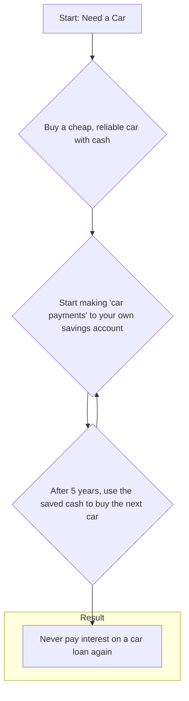
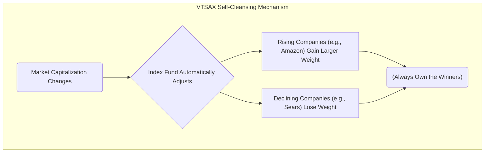
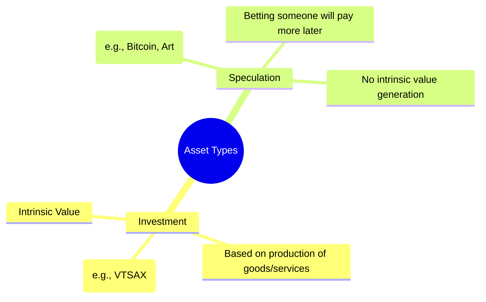
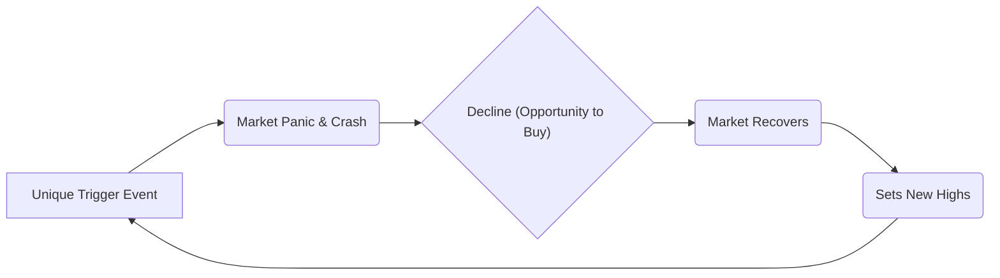
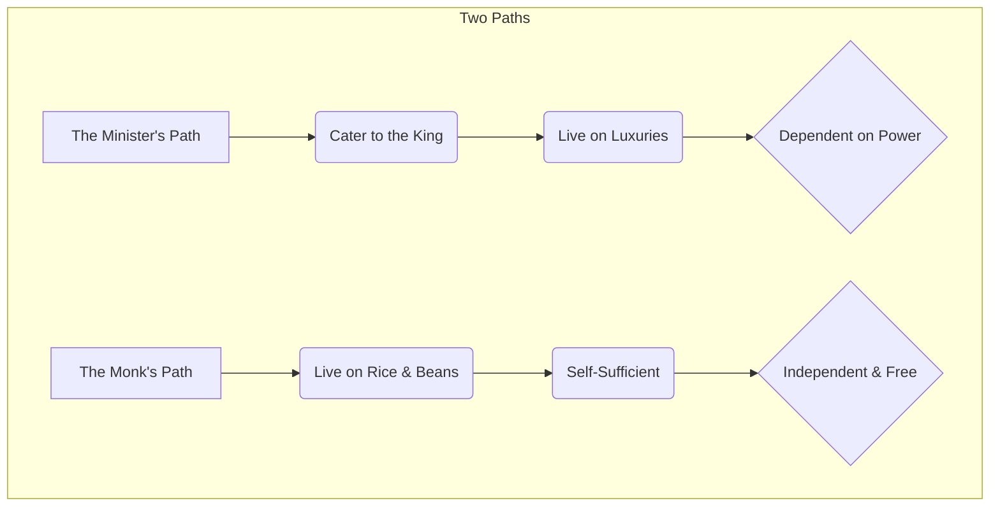

## Introduction to JL Collins and His Philosophy [00:00:00 - 01:18:00]

[](https://youtu.be/V360AygOv7A)

The host, Hasan Minhaj, contrasts the "financial grifters" prevalent on social media with the simple, effective advice of JL Collins, author of "The Simple Path to Wealth." He introduces Collins's three core principles for building wealth.

```mermaid
graph TD
    A[The Simple Path to Wealth] --> B{Rule 1: Spend Less Than You Earn};
    A --> C{Rule 2: Invest the Surplus};
    A --> D{Rule 3: Avoid Debt};
    C --> E[In a Broad-Based Index Fund, e.g., VTSAX];
````

  * Spend less than you earn.
  * Invest the surplus in an index fund.
  * Avoid debt.

## Personal Finance Journeys and Why Money is Difficult [01:27:00 - 03:32:00]

Minhaj shares a personal anecdote about keeping cash in shoeboxes, highlighting his past poor relationship with money. This led him to discover Collins's work. Collins explains that he originally wrote his book for his daughter and that many people find finance difficult because the financial industry intentionally makes it seem complicated.

## The Simplicity of Wealth and Resisting Grifting [03:32:00 - 05:14:00]

Minhaj questions why Collins has not created more products like courses or additional books, unlike many online personalities. Collins attributes his straightforward, single-book approach to the conscience his mother instilled in him, preventing him from engaging in "grifting."

## The Danger of Investing in a Single Company [05:14:00 - 08:01:00]

Collins recalls giving a talk at Google where he advised employees against holding a large portion of their wealth in Google stock. He emphasizes that all companies have a life cycle and will eventually fade. He uses the historical example of Sears, which was once as dominant as Amazon and Walmart combined but has since disappeared.

## The Psychology of Seeking Financial Advice [08:01:00 - 09:47:00]

Minhaj describes his initial skepticism and the extensive conversations he had with Collins to verify that his advice was genuine. He reflects on his own susceptibility to online "gurus and grifters" as a response to not having been given proper financial information earlier in life.

## Rule 1: Spend Less Than You Earn [09:47:00 - 15:04:00]

The first of Collins's three rules is discussed. Collins clarifies that this principle is not about deprivation but about making a conscious choice to spend money on what is most important to you, which for him was financial freedom. He acknowledges that most people will not follow this path, but emphasizes the importance of knowing this option exists.

## Defining Financial Independence and "F.U. Money" [15:04:00 - 18:24:00]

Collins provides his definitions for two key concepts:

  * **Financial Independence (FI):** The point at which the money generated by your investments is enough to cover all of your living expenses.
  * **F.U. Money:** The cushion of savings you acquire on the path to FI. It provides the economic power to make bold life choices, such as leaving a job you dislike.

<!-- end list -->

```mermaid
graph LR
    subgraph Journey to Freedom
        A(Start Saving) --> B(Build 'F.U. Money');
        B --> C{Make Bolder Choices};
        C --> D(Continue Investing);
        D --> E(Achieve Full Financial Independence);
    end
```

## Wealth Is Not Determined by Income Level [18:24:00 - 22:55:00]

Collins asserts that financial independence is not a specific dollar amount but is relative to an individual's lifestyle and spending. He provides the example of Mike Tyson, who earned hundreds of millions but went broke, and contrasts this with people from humble beginnings, like a migrant fruit picker, who achieved wealth by following his principles. He notes the diversity within the FI community in terms of age, race, occupation, and wealth.

## On Cars: Buying vs. Leasing [22:55:00 - 25:32:00]

Collins strongly advises against leasing a car or taking on a car payment while trying to build wealth. He shares his father's method:



  * Buy a cheap, reliable car ("shitbox") with cash.
  * Make a "car payment" to yourself into a savings account for the next five years.
  * Use that accumulated cash to buy your next car.
  * This cycle ensures you never pay interest on a depreciating asset.

## Rule 2: Investing in a Total Stock Market Index Fund [25:32:00 - 29:37:00]

Collins explains his second rule: invest the surplus money.

  * He specifically recommends VTSAX (Vanguard's Total Stock Market Index Fund).
  * This fund allows you to own a small piece of every publicly traded company in the United States (approximately 3,600 companies).
  * He credits Vanguard founder Jack Bogle, who created the first retail index fund in 1975 based on research showing that actively managed funds typically do not beat the market over the long term.

## Index Fund Performance vs. Individual Stock Picking [29:37:00 - 38:11:00]

Minhaj challenges the modest returns of an index fund compared to the massive gains of specific tech stocks like Nvidia. Collins counters that it is impossible to know in advance which individual stocks will achieve such returns. He points out that VTSAX has returned an average of 12.2% annually over the past 50 years, a period that included numerous market crashes and economic challenges. He emphasizes that compounding even a more conservative 8% return over time is an extraordinarily powerful wealth-building tool.

## The Self-Cleansing Nature of Index Funds [38:11:00 - 41:03:00]

Collins addresses the criticism that index funds like VTSAX are currently too heavily weighted in technology stocks. He explains this is a key feature, not a flaw.



  * The fund is "cap-weighted," meaning it automatically holds larger positions in the most valuable companies.
  * This creates a "self-cleansing" process where declining companies (like Sears) are naturally replaced by rising companies (like Amazon) without the investor needing to do anything.
  * This structure ensures you always own the market leaders, regardless of which sector is dominant at any given time.

## Bitcoin: Investment vs. Speculation [41:03:00 - 45:14:00]

Collins defines Bitcoin as a speculation, not an investment.



  * He argues it is too volatile to function as a currency.
  * Unlike an investment in a company that produces goods, services, and value, buying Bitcoin is a speculative bet that someone in the future will be willing to pay more for it.
  * An investment creates wealth, while a speculation relies on price appreciation alone.

## Handling Market Crashes and "This Time It's Different" [45:14:00 - 52:35:00]

Collins discusses the fear of market crashes. He asserts that major crashes are a normal, expected part of the investing process and have occurred multiple times in the last 50 years. Using the COVID-19 pandemic as a recent example, he refutes the "this time is different" mindset. While the trigger for a crash is always unique, he argues the market's pattern of panic, decline, and eventual recovery to new highs remains consistent. He advises structuring one's portfolio for the 99% probability that civilization will not end.



## The Impossibility of Timing the Market [52:35:00 - 54:06:00]

Minhaj asks about the strategy of "buying the dip" and selling at the peak. Collins dismisses this as impossible because one can never know for sure how low the bottom will be or how high the top will be. Attempting to time the market often results in missing the recovery, as many who waited during the swift COVID crash did.

## Why Your House is a Terrible Investment [54:06:00 - 56:42:00]

Collins states his position that a house should not be considered an investment.

  * He defines a primary residence as a lifestyle choice and a place to live.
  * He highlights the numerous, often forgotten costs of homeownership beyond the mortgage, including property taxes, maintenance, repairs, furniture, and appliances.
  * He advises that for someone whose primary goal is building wealth, renting and investing the difference (e.g., in VTSAX) is the more effective financial decision.

## The Parable of the Monk and the Minister [56:42:00 - 59:19:00]

Collins concludes the conversation by sharing a parable from his book. Two friends, a rich minister and a humble monk, meet. The minister says, "If you could learn to cater to the king, you wouldn't have to live on rice and beans." The monk replies, "If you could learn to live on rice and beans, you wouldn't have to cater to the king." Collins suggests that there is more power and life satisfaction in being closer to the monk's position of self-sufficiency.

