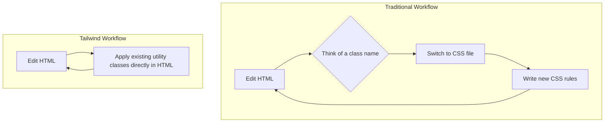
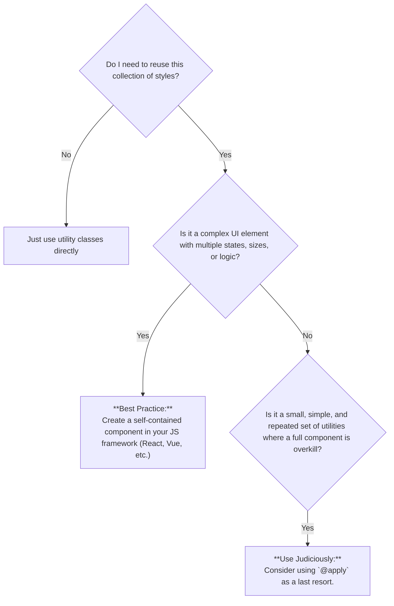
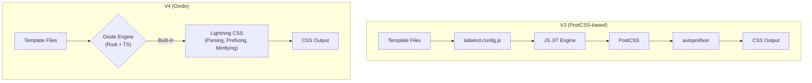
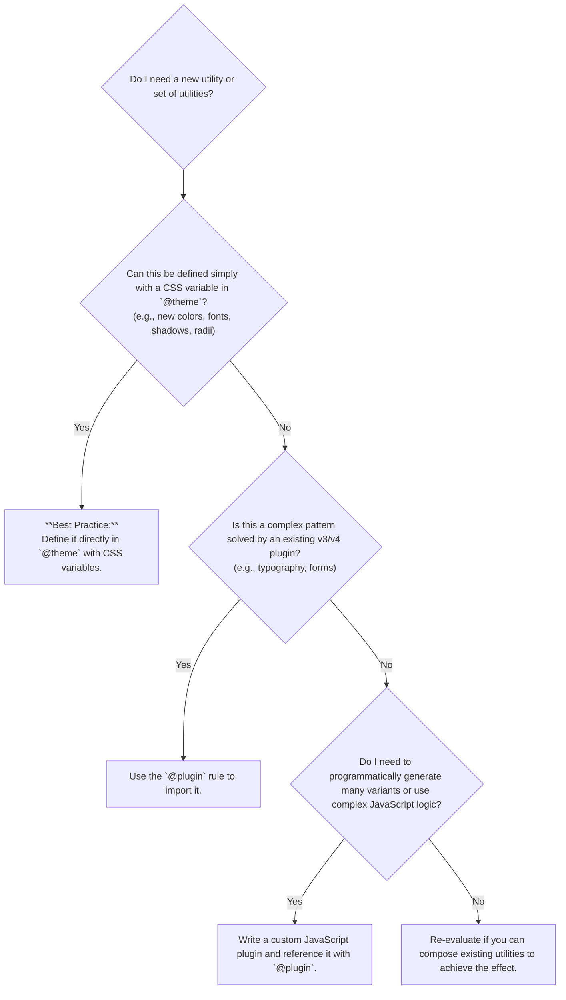

# The Complete Guide to Mastering Tailwind CSS: From Foundations to v4 Production Mastery

This comprehensive article covers Tailwind CSS from its core principles to the advanced features of version 4. It has been structured to facilitate deep learning by explaining concepts simply, exploring common points of confusion, and providing practical examples and patterns to solidify your understanding.

## Table of Contents

* [Part 0: Tailwind CSS 101 - The Utility-First Philosophy](#part-0-tailwind-css-101---the-utility-first-philosophy)
    * [Simple Explanation: What is Tailwind CSS?](#simple-explanation-what-is-tailwind-css)
    * [Identifying the Gaps: Common Questions and Concerns](#identifying-the-gaps-common-questions-and-concerns)
    * [Filling the Gaps: Core Principles and a New Workflow](#filling-the-gaps-core-principles-and-a-new-workflow)
    * [Refining Our Understanding: How It All Works](#refining-our-understanding-how-it-all-works)
* [Part 1: Advanced Tailwind CSS for Production-Ready Applications](#part-1-advanced-tailwind-css-for-production-ready-applications)
    * [Simple Explanation: Establishing a Scalable Design System](#simple-explanation-establishing-a-scalable-design-system)
    * [Identifying the Gaps: Abstracting Utilities for Maintainability](#identifying-the-gaps-abstracting-utilities-for-maintainability)
    * [Filling the Gaps: Patterns for Components and Theming](#filling-the-gaps-patterns-for-components-and-theming)
    * [Refining Our Understanding: Advanced Theming for Dark Mode](#refining-our-understanding-advanced-theming-for-dark-mode)
* [Part 2: The Foundational Shift in Tailwind CSS v4](#part-2-the-foundational-shift-in-tailwind-css-v4)
    * [Simple Explanation: Faster, Simpler, and More Powerful](#simple-explanation-faster-simpler-and-more-powerful)
    * [Identifying the Gaps: Why This Rewrite Was Necessary](#identifying-the-gaps-why-this-rewrite-was-necessary)
    * [Filling the Gaps: A Deep Dive into V4's Architecture](#filling-the-gaps-a-deep-dive-into-v4s-architecture)
    * [Refining Our Understanding: A Paradigm Shift](#refining-our-understanding-a-paradigm-shift)
* [Part 3: Extending Tailwind: The Evolved Plugin Ecosystem](#part-3-extending-tailwind-the-evolved-plugin-ecosystem)
    * [Simple Explanation: CSS-First Extensions](#simple-explanation-css-first-extensions)
    * [Identifying the Gaps: A New Way of Thinking About Plugins](#identifying-the-gaps-a-new-way-of-thinking-about-plugins)
    * [Filling the Gaps: Patterns for Extending Tailwind](#filling-the-gaps-patterns-for-extending-tailwind)
    * [Refining Our Understanding: The Future is Composable](#refining-our-understanding-the-future-is-composable)
* [Part 4: Integration and Migration Strategy](#part-4-integration-and-migration-strategy)
    * [Simple Explanation: Getting Started with V4](#simple-explanation-getting-started-with-v4)
    * [Identifying the Gaps: Potential Hurdles](#identifying-the-gaps-potential-hurdles)
    * [Filling the Gaps: A Practical Guide](#filling-the-gaps-a-practical-guide)
    * [Final Recommendation](#final-recommendation)

## Part 0: Tailwind CSS 101 - The Utility-First Philosophy

Before exploring the revolutionary advancements in Tailwind CSS v4, it is crucial to grasp the core philosophy that has established it as a dominant force in modern web development. This section provides a foundational introduction for newcomers and a deeper perspective for experienced users, covering what Tailwind is, the problems it solves, its fundamental mechanics, and a look at its most common utility classes.

### Simple Explanation: What is Tailwind CSS?

At its heart, **Tailwind CSS is a utility-first CSS framework**. Instead of giving you pre-built components like a "card" or a "button," it provides a complete set of tiny, single-purpose building blocks-called utility classes-that you compose directly in your HTML to create any design you can imagine.

Think of it like this:

  * **Traditional Frameworks (like Bootstrap)** are like buying a pre-built LEGO set. You get a fully-formed car or castle, which is fast to start with, but difficult to customize beyond its original design.
  * **Tailwind CSS** is like having an infinite box of individual LEGO bricks. You can build that same car or castle, but you can also build anything else by combining the bricks in unique ways.

Let's see what this looks like in practice.

| Traditional CSS | Tailwind CSS |
| :--- | :--- |
| **HTML:**\<br\>`html<br><button class="custom-blue-button">Click Me</button><br>`  | **HTML:**\<br\>`html<br><button class="bg-blue-500 text-white py-2 px-4 rounded">Click Me</button><br>`  |
| **CSS:**\<br\>`css<br>.custom-blue-button {<br>  background-color: #3b82f6;<br>  color: white;<br>  padding: 0.5rem 1rem;<br>  border-radius: 0.25rem;<br>}<br>`  | In Tailwind, there's no separate CSS file to write. Each class directly applies one style. |

### Identifying the Gaps: Common Questions and Concerns

If you're new to this approach, you might be thinking:

1.  *"Isn't putting all those classes in my HTML going to make it messy and unreadable?"*
2.  *"How is this better than just writing my own CSS? I'm still writing styles, just in a different place."*
3.  *"What happens if I need a very specific value, like `top: 23px`? Am I stuck with the pre-defined options?"*

These are valid questions that get to the heart of the utility-first trade-off. Let's explore them.

### Filling the Gaps: Core Principles and a New Workflow

The utility-first approach was designed specifically to solve common frustrations in web development.

#### Insight 1: It Eliminates "Death by a Thousand Class Names"

The hardest part of writing traditional CSS is often naming things. You end up with abstract, hard-to-maintain class names like `.article-sidebar-widget` or `.primary-button-with-icon-on-the-left`. Tailwind completely removes this cognitive load. You're not naming things; you're *describing* them with existing utilities.

#### Insight 2: It Supercharges Your Workflow

Styling directly in your markup eliminates the constant context-switching between HTML and CSS files, which dramatically speeds up development. This co-location of structure and styling is a core benefit.



#### Insight 3: It Enforces Unbreakable Consistency

Utilities are not random; they are derived from a configurable design system (the "theme"). Instead of using arbitrary "magic numbers" for spacing or colors, you choose from a predefined scale (e.g., `p-2`, `p-4`, `p-6`). This ensures visual consistency across your entire application by default.

#### Insight 4: It Produces Impossibly Small Production Files

This is a key advantage. During the build process, Tailwind scans your files and generates a CSS bundle containing *only the styles you've actually used*. All unused utilities are purged, resulting in a tiny production file, often under 10kB.

### Refining Our Understanding: How It All Works

Tailwind isn't just a static stylesheet; it integrates into your project's build process.

  * **Just-In-Time (JIT) Compilation**: The modern Tailwind engine uses a JIT compiler that scans your template files (HTML, JSX, etc.) and generates only the specific classes it finds, exactly when they are needed. This process is incredibly fast and efficient.
  * **Responsive by Design**: Following a mobile-first approach, utilities apply to all screen sizes by default. To apply a style to a larger screen, you prefix it with a breakpoint variant like `md:` or `lg:`.
      * **Annotated Example:** `<div class="w-1/2 lg:w-1/3">...</div>`
          * `w-1/2`: The element's width will be 50% on all screen sizes by default.
          * `lg:w-1/3`: *But* on large screens (1024px and up, by default) and wider, the width will change to 33.3%.
  * **State Variants**: You can style elements for different states like `hover`, `focus`, or `disabled` by prefixing utilities with state variants.
      * **Annotated Example:** `<button class="bg-blue-500 hover:bg-blue-700">...</button>`
          * `bg-blue-500`: The default background color.
          * `hover:bg-blue-700`: When a user hovers their mouse over this button, the background will change to a darker shade of blue.

-----

## Part 1: Advanced Tailwind CSS for Production-Ready Applications

Moving from basic usage to building scalable, maintainable, and production-ready applications requires a shift in thinking. This section covers the design patterns and best practices that senior-level developers use.

### Simple Explanation: Establishing a Scalable Design System

The foundation of any large, professional application is a well-defined design system. In Tailwind v4, you define this system directly in your CSS using the `@theme` directive, which makes it transparent and easy to maintain. The goal is to move from using generic utilities to using meaningful, purpose-driven "design tokens."

### Identifying the Gaps: Abstracting Utilities for Maintainability

As your application grows, a long string of utilities like `bg-blue-500 text-white font-bold py-2 px-4 rounded` can become repetitive and hard to manage. What if the client wants to change the primary button color? You'd have to find and replace that string everywhere. This is where abstraction becomes critical.

Key questions arise:

1.  *"What is a 'semantic token' and how does it help?"* 
2.  *"Should I use `@apply` to create component classes in my CSS, or should I build components in my JavaScript framework (like React or Vue)?"*
3.  *"How do I handle UI that needs to respond to its container's size, not just the whole screen?"*

### Filling the Gaps: Patterns for Components and Theming

#### Pattern 1: Use Semantic Tokens for a Theming Superpower

Instead of thinking in terms of specific colors like `blue-500`, a mature design system uses names that describe a color's *purpose*. This is called semantic token naming.

**Annotated Example: Defining Semantic Colors in v4**

```css
@theme {
  /* Define brand colors by their purpose, not their value. */
  --color-primary: hsl(221.2 83.2% 53.3%); /* Replaces 'blue-500' */  
  --color-destructive: hsl(0 84.2% 60.2%); /* Replaces 'red-600' */ 
  --color-background: hsl(0 0% 100%); /* Site background */ 
  --color-foreground: hsl(0 0% 3.9%); /* Main text color */ 
}
```

  * **The Payoff:** Now, you can use classes like `bg-primary` and `text-destructive`. If you need to change your primary brand color from blue to green, you only have to change *one line* in your CSS file. Every `bg-primary` instance across your entire application will update automatically. This makes rebranding or theming trivial.

#### Pattern 2: Component Encapsulation is the Gold Standard

For managing repeated UI elements, the best practice in modern frameworks like React or Vue is to encapsulate the styles within the component file itself. This keeps components self-contained, truly reusable, and easy to reason about.

**Annotated Example: A Reusable React Button Component**

```jsx
// React Button Component Example
const Button = ({ variant = 'primary', size = 'default', children }) => {
  // Base styles shared by all variants
  const baseStyles = 'inline-flex items-center justify-center rounded-md font-semibold focus:outline-none'; 

  // Styles specific to each variant
  const variantStyles = {
    primary: 'bg-primary text-primary-foreground hover:bg-primary/90', 
    destructive: 'bg-destructive text-destructive-foreground hover:bg-destructive/90', 
    outline: 'border border-input bg-background hover:bg-accent hover:text-accent-foreground', 
  };

  // Styles specific to each size
  const sizeStyles = {
    default: 'h-10 px-4 py-2', 
    sm: 'h-9 rounded-md px-3', 
    lg: 'h-11 rounded-md px-8', 
  };

  // Combine the styles based on props
  const className = `${baseStyles} ${variantStyles[variant]} ${sizeStyles[size]}`; 

  return <button className={className}>{children}</button>;
};
```

#### Heuristic: When (and When Not) to Use `@apply`

The `@apply` directive lets you extract a string of utilities into a new class in your CSS. While useful, it is often considered an anti-pattern if overused because it can reintroduce the problems of traditional CSS (like specificity conflicts and difficulty overriding styles).

**Decision Tree for Abstraction:**



#### Pattern 3: Use Container Queries for Truly Modular Components

Modern UIs demand more than just viewport-based breakpoints. **Container Queries**, a first-class feature in v4, allow a component to adapt its style based on the width of its *parent container*, not the entire viewport. This is the key to creating truly modular components that you can drop anywhere, confident that they will look great.

**Annotated Example: A Self-Adapting Card**

```html
<div class="w-full md:w-1/2 lg:w-1/3 p-4">
  <div class="@container rounded-lg border bg-card text-card-foreground shadow-sm">
    <div class="flex flex-col @lg:flex-row">
      
      <div class="p-4">
        <h3 class="text-lg font-bold">Title</h3>
        <p class="text-sm">This card's image and text will stack vertically in narrow containers but sit side-by-side in wider ones.</p>
      </div>
    </div>
  </div>
</div>
```

  * `@container`: This utility on the parent element tells Tailwind to watch its size.
  * `@lg:flex-row`: This class on the child element applies `flex-row` *only when the parent container* (not the viewport) is at least the `lg` breakpoint width (by default, 32rem).

### Refining Our Understanding: Advanced Theming for Dark Mode

V4 makes theming, especially dark mode, a pure-CSS concern handled elegantly with CSS variables. The strategy popularized by shadcn/ui is now a best practice for its interoperability.

**Annotated Example: A Robust Dark Mode Setup**

```css
/* 1. Define HSL color channels for light and dark themes in the base layer. */
@layer base {
  :root { /* Light mode (default) */
    --background: 0 0% 100%;
    --foreground: 0 0% 3.9%;
    /* ... other color channels */
  }

  .dark { /* Dark mode */
    --background: 0 0% 3.9%;
    --foreground: 0 0% 100%;
    /* ... other color channels */
  }
}

/* 2. Use those channels to create the final color variables in your theme. */
@theme inline {
  --color-background: hsl(var(--background));
  --color-foreground: hsl(var(--foreground));
  /* ... other semantic colors */
}
```

  * **How it works:** All you need is a tiny piece of JavaScript to toggle the `.dark` class on the `<html>` element. CSS does the rest. This separation of concerns is powerful: the theme is defined entirely in CSS, and the state is toggled by JS.
  * **Why HSL?** Defining colors as HSL channels (`0 0% 100%`) instead of hex codes makes them programmatically adjustable, which is a huge benefit for theming and tooling.

-----

## Part 2: The Foundational Shift in Tailwind CSS v4

Tailwind CSS v4 is not an incremental update; it's a ground-up rewrite. This part explores the two core changes that define this new version: the high-performance **Oxide engine** and the move to a **CSS-first configuration** model.

### Simple Explanation: Faster, Simpler, and More Powerful

Imagine your car's engine was replaced with a high-performance electric motor. It's faster, quieter, and more efficient. That's the **Oxide engine**. Now imagine the car's entire dashboard and control system, which was a complex mix of knobs and screens, was replaced by a single, intuitive interface. That's **CSS-first configuration**. These two changes work together to create a vastly superior developer experience.

### Identifying the Gaps: Why This Rewrite Was Necessary

1.  *"V3 felt fast enough. Why was a new engine needed?"*
2.  *"What is Rust, and why is it important for a CSS framework?"* 
3.  *"I liked my `tailwind.config.js` file. Why move everything into CSS?"* 

### Filling the Gaps: A Deep Dive into V4's Architecture

#### Deep Dive 1: The Oxide Engine & The Performance Revolution

The Oxide engine is a new compilation engine engineered for extreme speed.

  * **What is it?** A hybrid engine that uses the Rust programming language for performance-critical tasks (like scanning your files and finding classes) and TypeScript for parts that need to be extensible (like the plugin API). It also integrates Lightning CSS, a Rust-based tool, to handle all CSS processing (like prefixing and minifying) in a single, ultra-fast step.

  * **Why does it exist?** The v3 JIT compiler could experience noticeable delays in very large projects or when starting up the development server. The goal of Oxide was to make the development feedback loop feel absolutely instantaneous, no matter the project size.

  * **How does it work?**

      * **Unified Toolchain:** By bundling Lightning CSS, Oxide replaces several separate tools from the old ecosystem, such as `postcss-import` and `autoprefixer`. This simplifies your project setup and speeds up the build.
      * **Zero-Configuration Content Detection:** The engine is so fast that it can afford to scan your *entire project* for template files automatically. It intelligently ignores things like `node_modules` and files listed in `.gitignore`. This completely eliminates the need for the fragile and error-prone `content` array in your old config file.

**V3 vs. V4 Build Process**



#### Deep Dive 2: CSS-First Configuration & Theming

In v4, configuration moves out of a JavaScript file and directly into your main CSS file. This is the most significant workflow change.

  * **What is it?** A new paradigm where you customize Tailwind using CSS-native at-rules:

      * `@theme`: The new heart of your configuration, where you define your design system using standard CSS custom properties.
      * `@plugin`: A rule to load legacy JavaScript plugins for backward compatibility.
      * `@config`: An "escape hatch" that lets you point to an old `tailwind.config.js` file, designed to make migration easier.

  * **Why does it exist?**

    1.  **To Eliminate Context Switching:** Your design system now lives in the same file as your other CSS, reducing mental overhead.
    2.  **To Increase Interoperability:** By using standard CSS variables, your design tokens (like `--color-primary`) are now universally available to your own JavaScript, other libraries, or even other CSS files without any special importers.
    3.  **To Reduce Boilerplate:** The setup is much cleaner and less error-prone.

  * **How does it work?** This is an **architectural inversion**. Previously, the `tailwind.config.js` file was the source of truth that configured the engine. Now, your **CSS file is the source of truth**. The Oxide engine reads the CSS variables you define in the `@theme` block and uses them to generate all the corresponding utility classes.

    **Annotated Example: The Magic Connection**

    ```css
    @theme {
      /* By defining this single CSS variable... */
      --color-primary: oklch(65.74% 0.224 259.35);
    }
    ```

      * **...Tailwind's engine automatically generates:** `bg-primary`, `text-primary`, `border-primary`, `divide-primary`, `placeholder-primary`, and more. This direct link between CSS variables and utility classes is the core concept of v4's configuration.

### Refining Our Understanding: A Paradigm Shift

V4 represents a fundamental shift. The incredible speed of the Oxide engine enables a simpler, more powerful CSS-first configuration model. By making your CSS the single source of truth, Tailwind v4 aligns itself more closely with the future of the web platform, where CSS variables are a first-class citizen for creating dynamic and interoperable design systems.

-----

## Part 3: Extending Tailwind: The Evolved Plugin Ecosystem

With a solid understanding of v4's architecture, a natural question arises: "How do I extend Tailwind beyond its core utilities?" Plugins have always been the answer, but in v4, the approach has evolved to align with the new CSS-first philosophy.

### Simple Explanation: CSS-First Extensions

Sometimes, you need utilities that Tailwind doesn't provide out of the box, like custom text shadows or complex animation sequences. In v4, the primary way to "extend" Tailwind is by using the same tools you already know: **CSS variables inside the `@theme` block**. For more complex needs or for using plugins from the v3 era, a compatibility system exists to ensure you're never stuck.

### Identifying the Gaps: A New Way of Thinking About Plugins

1.  *"What happened to all the v3 plugins I relied on, like `@tailwindcss/typography`?"*
2.  *"Do I still need to write JavaScript to create custom utilities?"*
3.  *"When should I define something in `@theme` versus writing a full JavaScript plugin?"*

### Filling the Gaps: Patterns for Extending Tailwind

#### Pattern 1: The "CSS-Native Plugin"

For many use cases, you don't need a "plugin" at all. You can create your own utilities directly in your CSS. This is the preferred, most modern method.

**Annotated Example: Creating Custom `text-shadow` Utilities**

```css
@theme {
  /* Define text-shadow values using CSS variables */
  --text-shadow-sm: 1px 1px 2px rgb(0 0 0 / 0.1);
  --text-shadow-md: 2px 2px 4px rgb(0 0 0 / 0.2);
  --text-shadow-lg: 4px 4px 8px rgb(0 0 0 / 0.2);

  /* You can even compose them */
  --text-shadow-glow: 0 0 8px theme('colors.blue.400');
}
```

  * **The Magic:** Just by defining these `--text-shadow-*` variables, Tailwind v4 automatically creates `text-shadow-sm`, `text-shadow-md`, `text-shadow-lg`, and `text-shadow-glow` classes for you to use in your HTML. No JavaScript required.

#### Pattern 2: Using Legacy Plugins with `@plugin`

Tailwind v4 understands that the ecosystem needs time to adapt. For established v3 plugins that are written in JavaScript, you can use the `@plugin` rule as a bridge.

**Annotated Example: Adding the Official Forms Plugin**

```css
/* 1. Import the base Tailwind styles */
@import "tailwindcss";

/* 2. Import a legacy JS plugin using the @plugin rule */
@plugin "forms" from "@tailwindcss/forms";

/* ... your custom CSS and @theme block ... */
```

  * **Heuristic:** This is the correct way to integrate plugins that haven't been (or can't be) rewritten as pure CSS extensions. Always check the plugin's documentation for v4 compatibility. Many v3 plugins are now obsolete because their features have been integrated into the core framework (e.g., container queries).

#### Decision Tree: How to Extend Tailwind



### Refining Our Understanding: The Future is Composable

The v4 plugin system pushes developers toward a more platform-aligned, CSS-native approach. By encouraging you to build extensions with CSS custom properties first, it makes your design system more transparent and maintainable. The JavaScript plugin API remains a powerful tool for complex scenarios and backward compatibility, but it is no longer the default starting point. This composable, CSS-first extension model is a core tenet of building for the modern web with Tailwind v4.

-----

## Part 4: Integration and Migration Strategy

This final part addresses the practical realities of adopting Tailwind CSS v4, providing a clear guide for integrating it into new projects and migrating existing ones from v3.

### Simple Explanation: Getting Started with V4

For new projects, setting up Tailwind v4 is simpler and cleaner than ever before, thanks to the Oxide engine and improved framework integrations. For existing projects, migration is a significant but manageable process that involves running an upgrade tool and making some manual adjustments.

### Identifying the Gaps: Potential Hurdles

1.  *"What do you mean I don't need `postcss` or `autoprefixer` anymore?"* 
2.  *"Is there an automated tool to help me upgrade from v3?"* 
3.  *"What are the biggest 'gotchas' or breaking changes I need to watch out for?"*

### Filling the Gaps: A Practical Guide

#### Integration with a New Project (React + Vite Example)

Setting up a new project with the official `@tailwindcss/vite` plugin is remarkably streamlined.

1.  **Scaffold:** Create a new Vite + React project as you normally would.

2.  **Install:** Run `npm install -D tailwindcss @tailwindcss/vite`. Notice that `postcss` and `autoprefixer` are no longer direct dependencies, as their functionality is now built into Tailwind's engine.

3.  **Configure:** Add the Tailwind plugin to your `vite.config.js`. This is the only configuration file you need to touch.

    ```javascript
    // vite.config.js
    import { defineConfig } from 'vite'
    import react from '@vitejs/plugin-react'
    import tailwindcss from '@tailwindcss/vite' // <-- Import the plugin

    export default defineConfig({
      plugins: [react(), tailwindcss()], // <-- Add the plugin
    })
    ```

    This replaces the need for a separate `postcss.config.js` file.

4.  **Import:** In your main `index.css` file, replace the old `@tailwind` directives with a single import statement: `@import "tailwindcss";`.

That's it. This simplified process reflects v4's commitment to an excellent developer experience from the very first step.

#### A Strategic Guide to V3-to-V4 Migration

Migrating from v3 is a significant undertaking due to intentional breaking changes designed to improve the framework. Approach it methodically in phases on a dedicated `git` branch.

**Phase 1: Run the Automated Upgrade Tool** 

Start by running the official codemod tool provided by the Tailwind team:
`npx @tailwindcss/upgrade@next` 

This tool will handle the bulk of the tedious work:

  * Updates your `package.json` dependencies.
  * Migrates your `tailwind.config.js` logic into a new `@theme` block in your main CSS file.
  * Renames many deprecated utility classes to their new v4 equivalents.

**Phase 2: Perform Manual Cleanup and Configuration** 

The tool is powerful, but manual steps are critical.

1.  **Update Build Tooling (Most Important Step):**
      * For Vite, switch to the new `@tailwindcss/vite` plugin.
      * For other bundlers, update your PostCSS config to use `@tailwindcss/postcss`.
2.  **Remove Redundant Packages:** Uninstall `autoprefixer` and `postcss-import` from your project, as they are no longer needed.
3.  **Update CSS Entry Point:** Ensure your main CSS file uses `@import "tailwindcss";`.
4.  **Review Key Breaking Changes:** Manually audit your code for changes the tool might have missed. A common example is the `ring` utility, which now defaults to a `1px` width instead of `3px`.

**Phase 3: Conduct an Ecosystem Audit** 

This phase addresses the wider impact on your project's dependencies.

  * **Plugin Audit:** This is a major consideration. Go through your list of Tailwind plugins. Many may now be obsolete because their features are built into the v4 core. Others may not yet be compatible with v4. You will need to create a full audit and find replacements or alternative strategies.
  * **Browser Support:** V4 drops support for some older browsers because it relies on modern CSS features like `color-mix()`. Verify that your project's required browser support matrix is compatible with v4's baseline *before* you migrate.
  * **Third-Party Libraries:** Check if the component libraries you use (e.g., shadcn/ui, Headless UI, Flowbite) have their own specific v4 migration guides. They often have their own breaking changes and require extra steps to ensure compatibility.

### Final Recommendation

For new projects, Tailwind CSS v4 is the clear and definitive choice. The benefits in performance, developer experience, and power are immense. For existing projects, the migration is a significant renovation, not a simple paint job. However, it is an investment that pays off, resulting in a faster, more powerful, and more maintainable foundation that is truly built for the future of the web.