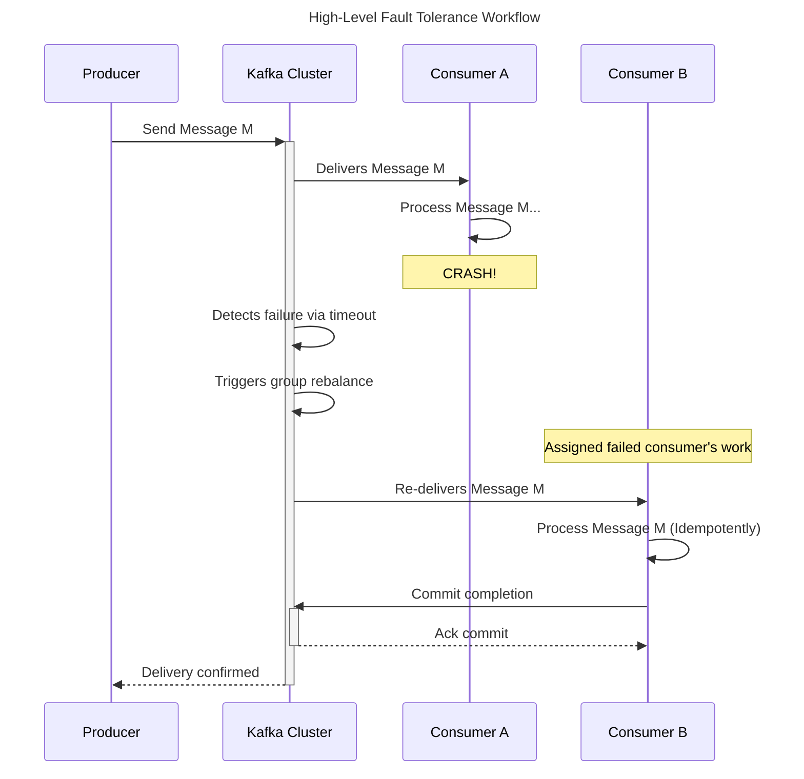
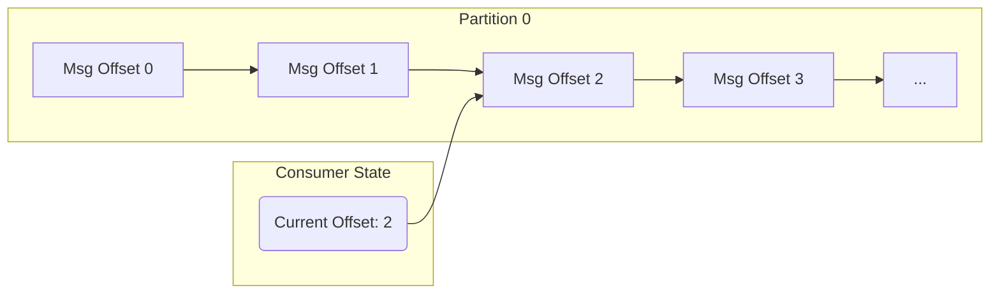
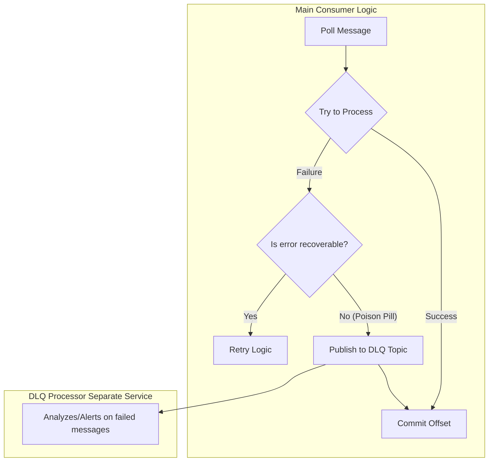
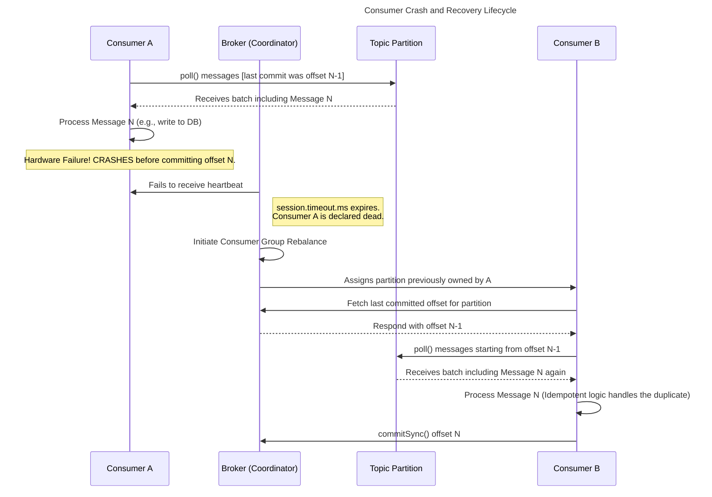

# Technical Deep Dive: Kafka Consumer Fault Tolerance and Rebalancing



This document provides a comprehensive technical overview of Kafka's consumer fault tolerance mechanism. It is designed for technical teams to build a deep, intuitive understanding of what happens when a consumer fails, why the system is designed this way, and how to build robust applications that handle these real-world scenarios gracefully.

## Table of Contents

1.  [**What: System Behavior on Consumer Failure**](#1-what-system-behavior-on-consumer-failure)
      * [Simple Explanation: The Core Promise](#simple-explanation-the-core-promise)
      * [Identifying the Gaps: Deeper Questions](#identifying-the-gaps-deeper-questions)
      * [Exploring and Filling the Gaps](#exploring-and-filling-the-gaps)
2.  [**Why: The Rationale for At-Least-Once Delivery**](#2-why-the-rationale-for-at-least-once-delivery)
      * [Simple Explanation: The Safest Bet](#simple-explanation-the-safest-bet)
      * [Identifying the Gaps: Deeper Questions](#identifying-the-gaps-deeper-questions-1)
      * [Exploring and Filling the Gaps](#exploring-and-filling-the-gaps-1)
3.  [**How: Implementation and Operational Considerations**](#3-how-implementation-and-operational-considerations)
      * [Simple Explanation: Tuning the Machine](#simple-explanation-tuning-the-machine)
      * [Identifying the Gaps: Deeper Questions](#identifying-the-gaps-deeper-questions-2)
      * [Exploring and Filling the Gaps](#exploring-and-filling-the-gaps-2)
4.  [**Scaling Consumers and Managing Throughput**](#4-scaling-consumers-and-managing-throughput)
      * [Simple Explanation: More Lanes, More Cars](#simple-explanation-more-lanes-more-cars)
      * [Identifying the Gaps: Deeper Questions](#identifying-the-gaps-deeper-questions-3)
      * [Exploring and Filling the Gaps](#exploring-and-filling-the-gaps-3)
5.  [**Mermaid Diagram: Consumer Crash & Recovery Workflow**](#5-mermaid-diagram-consumer-crash--recovery-workflow)
      * [Annotation](#annotation)
6.  [**Pseudocode: Robust Consumer Implementation**](#6-pseudocode-robust-consumer-implementation)
7.  [**Explanation: Tying It All Together**](#7-explanation-tying-it-all-together)


## 1\. What: System Behavior on Consumer Failure

### Simple Explanation: The Core Promise

At its heart, Kafka's behavior during a consumer failure is guided by a simple promise: **don't lose messages**. Imagine you have a checklist of tasks. If you're halfway through and suddenly disappear, you'd want your replacement to start from your last *confirmed* checkpoint, even if it means they might re-do the very last thing you were working on. Kafka operates on this same principle.

When a consumer process crashes or becomes unresponsive after processing a message but *before* confirming it's done (a process called "committing an offset"), the system ensures that message isn't lost. It does this by having another consumer re-process it.

### Identifying the Gaps: Deeper Questions

This simple explanation brings up some important questions:

  * What exactly is a "checkpoint"? How does Kafka track progress?
  * How does the system *know* a consumer has failed versus just being slow?
  * What does the recovery process actually look like?

### Exploring and Filling the Gaps

Let's break down the mechanics to answer these questions.

**1. The "Checklist": Offsets and Partitions**

Think of a Kafka topic "partition" as a long, ordered log file-like a giant checklist where each line has a unique number. This number is the **offset**.

  * **Insight:** The offset is the fundamental unit of progress in Kafka. It's not just an ID; it's a specific coordinate that tells a consumer exactly where it is in the data stream.

<!-- end list -->



  * *Annotation:* The consumer has successfully processed messages 0 and 1 and is currently processing message at offset 2. Its "checkpoint" is still at offset 1 until it confirms completion of 2.

**2. The "Confirmation": Committing Offsets**

A consumer confirms its progress by **committing an offset**. It essentially tells the Kafka cluster, "I have successfully processed all messages up to offset X." This commit is stored by Kafka in a special internal topic called `__consumer_offsets`.

**3. The "Heartbeat": Detecting Failure**

A consumer constantly sends tiny "I'm alive\!" messages, called **heartbeats**, to a central manager in the cluster known as the **Group Coordinator**. If the Coordinator doesn't hear a heartbeat within a configurable time (`session.timeout.ms`), it assumes the consumer has died.

**4. The "Recovery": Rebalancing**

Once a consumer is declared dead, the Coordinator initiates a **rebalance**. It's like a manager stopping the assembly line to reassign a fallen worker's station to someone else.

  * The partition(s) owned by the failed consumer are reassigned to a healthy consumer in the group.
  * The new consumer asks the Coordinator for the last *committed* offset for that partition.
  * Since the failed consumer never committed its in-progress work, the new consumer receives an earlier offset and begins processing messages that were already handled, leading to **at-least-once delivery**.

-----

## 2\. Why: The Rationale for At-Least-Once Delivery

### Simple Explanation: The Safest Bet

Why does Kafka default to this behavior? Because **Kafka would rather risk you getting the same email twice than let one important email disappear forever.** In the world of data, losing information is often far more catastrophic than processing it again.

### Identifying the Gaps: Deeper Questions

  * Is this always the right choice? Isn't processing data twice dangerous?
  * If this is a trade-off, what is the other side of the coin?
  * How can an application possibly handle getting the same instruction twice?

### Exploring and Filling the Gaps

**1. The Fundamental Trade-off: Shifting Complexity**

Kafka's design represents a deliberate trade-off. By guaranteeing at-least-once delivery, the core Kafka system remains simpler and more resilient. It shifts the complexity of handling duplicates to the application layer.

  * **Insight:** This is a powerful design choice. The application developer has the business context to know how to handle a duplicate, whereas the Kafka broker does not. Is it a bank transaction? A user profile update? A vote in a poll? Only the application knows the correct way to manage a replay.

**2. The Solution: The Idempotent Receiver Pattern**

To handle duplicates safely, applications must be **idempotent**. An idempotent operation is one that can be performed multiple times with the same result as if it were performed only once.

  * **Pattern:** This is known as the **Idempotent Receiver** pattern in enterprise integration. The consumer must be designed to recognize and discard messages it has already processed.

  * **Annotated Real-World Example (Banking):**

      * **A Non-Idempotent (DANGEROUS) Operation:**

        ```sql
        -- If this runs twice, the user is debited $20!
        UPDATE user_accounts SET balance = balance - 10 WHERE user_id = 'user-123';
        ```

      * **An Idempotent (SAFE) Operation:**

        ```sql
        -- The Kafka message contains a unique `transaction_id`.
        -- We use this ID as the primary key in our transactions table.
        INSERT INTO transactions (transaction_id, user_id, amount)
        VALUES ('unique-message-id-abc-789', 'user-123', -10);
        ```

      * *Annotation:* The first time this `INSERT` runs, it succeeds. The second time, the database's primary key constraint will reject the insert because `unique-message-id-abc-789` already exists. The state of the system remains correct, and the duplicate is safely ignored.

This pattern transforms the "at-least-once" delivery of Kafka into "effectively-once" processing within your application's domain.

-----

## 3\. How: Implementation and Operational Considerations

### Simple Explanation: Tuning the Machine

Knowing the "what" and "why" is half the battle. The "how" is about becoming a skilled operator. To build a truly resilient system, you need to tune Kafka's "knobs," design your code defensively, and plan for inevitable problems like malformed messages.

### Identifying the Gaps: Deeper Questions

  * How do I choose the right values for these timeout settings?
  * What's the most common "gotcha" that causes unexpected failures?
  * What's the professional way to handle commits and bad messages?

### Exploring and Filling the Gaps

**1. Tuning the "Liveness" Knobs**

Getting your configuration right is a balance between responsiveness and stability.

  * **`session.timeout.ms`**: How long to wait before declaring a consumer dead.
      * *Heuristic:* A value between 30,000 ms (30s) and 45,000 ms (45s) is a common, safe starting point. Too low, and network hiccups or application garbage collection (GC) pauses will trigger false alarms. Too high, and you'll have a longer outage during a real crash.
  * **`max.poll.interval.ms`**: **This is the most common cause of unexpected rebalances.** It's the maximum time your application can spend between `consumer.poll()` calls.
      * *Insight:* This isn't just about processing time. If you poll a batch of 500 records and each takes 10ms, your total processing time is 5 seconds. Your `max.poll.interval.ms` must be greater than this.
      * *Pattern (Decoupled Processing):* For long-running tasks, don't process them in the poll loop. Instead, hand them off to a separate thread pool (`ExecutorService`). Your poll loop's only job is to fetch data and hand it off, allowing it to call `poll()` frequently and stay "alive."

**2. The "Commit" Dance: `commitSync` vs. `commitAsync`**

With manual commits (`enable.auto.commit=false`), you have two primary methods:

  * **`commitSync`**: Blocks your application and retries until the commit succeeds or an unrecoverable error occurs. It's simpler and safer, but slower.

  * **`commitAsync`**: Sends the commit request and moves on immediately. It's much faster but requires a callback to handle failures.

  * **Annotated Scenario:**

      * `commitSync()`: "Wait here. I'm going to tell the manager we're done with this batch. I won't be back until I get a thumbs-up."
      * `commitAsync()`: "I've sent a text to the manager saying we're done. Let's start the next batch. My phone will buzz if the text didn't go through."

**3. The "Safety Net": The Dead Letter Queue (DLQ)**

A "poison pill" is a message that is malformed and will *always* cause your consumer to crash. Without a plan, this will block your partition forever. The **Dead Letter Queue** is the industry-standard pattern to solve this.



  * *Annotation:* The main consumer's job is to process valid data. When it encounters a message it can never process, its responsibility is to move it out of the way (to a DLQ) and continue, preventing a system-wide halt.

-----

## 4\. Scaling Consumers and Managing Throughput

### Simple Explanation: More Lanes, More Cars

Now that we know how a single consumer works and fails, how do we make it go faster? The simple idea is to add more consumers. However, there's a crucial rule: **you can't have more consumers in a group than you have partitions for a topic.**

Think of partitions as lanes on a highway and consumers as cars. You can have one car in each lane. Adding more cars than lanes just creates a traffic jam of idle cars waiting for a lane to open up.

### Identifying the Gaps: Deeper Questions

  * What does this relationship between consumers and partitions look like?
  * If I need more throughput, what should I do first?
  * Does the way I produce messages affect how they are consumed in parallel?

### Exploring and Filling the Gaps

**1. The Rule of Parallelism**

The partition is Kafka's unit of parallelism. A single partition can only be consumed by **at most one consumer** within a given consumer group at any given time.

  * **Heuristic:** To increase your consumption throughput, the first step is often to **increase the number of partitions** for your topic. Only then will adding more consumer instances have a beneficial effect.

  * **Visualization of Consumer-Partition Assignment:**

    ```mermaid
    ---
    config:
      layout: elk
    ---
    graph TD
        %% Scenario 1: Under-Provisioned Consumers
        subgraph Scenario_1["Scenario 1: Under-Provisioned Consumers"]
            P1["Partition 1"] --> C1["Consumer 1"]
            P2["Partition 2"] --> C1
            P3["Partition 3"] --> C2["Consumer 2"]
            P4["Partition 4"] --> C2
            note1(Note: Consumers are overloaded.)
            C2 --> note1
        end

        %% Scenario 2: Perfectly Balanced
        subgraph Scenario_2["Scenario 2: Perfectly Balanced"]
            P1b["Partition 1"] --> C1b["Consumer 1"]
            P2b["Partition 2"] --> C2b["Consumer 2"]
            P3b["Partition 3"] --> C3b["Consumer 3"]
            P4b["Partition 4"] --> C4b["Consumer 4"]
            note2(Note: Ideal 1:1 mapping.)
            C4b --> note2
        end

        %% Scenario 3: Over-Provisioned Consumers
        subgraph Scenario_3["Scenario 3: Over-Provisioned Consumers"]
            P1c["Partition 1"] --> C1c["Consumer 1"]
            P2c["Partition 2"] --> C2c["Consumer 2"]
            C3c["Consumer 3"] --> Idle1["(Idle)"]
            C4c["Consumer 4"] --> Idle2["(Idle)"]
            note3(Note: Consumers 3 & 4 are idle and wasteful.)
            Idle2 --> note3
        end
    ```

**2. The Impact of Message Keys**

When you produce a message to Kafka, you can optionally provide a **key**. Kafka guarantees that all messages with the same key will always be sent to the same partition.

  * **Insight:** This is incredibly powerful but also a critical scaling consideration.

      * **Benefit:** It guarantees strict ordering for all events related to a specific entity (e.g., all events for `user-123` are processed in order).
      * **Challenge:** If one key is responsible for a massive amount of traffic (a "hot key"), its corresponding partition can become a bottleneck, and the consumer processing that partition will be overloaded. No matter how many more consumers you add, they can't help with that specific partition.

  * **Pattern (Thoughtful Keying):** Choose a key that gives you a good distribution of data across partitions. `user_id` is often a good choice. Avoid keys that have low cardinality (e.g., `user_country`), as this could lead to a few very "hot" partitions.

-----

## 5\. Mermaid Diagram: Consumer Crash & Recovery Workflow

To solidify our understanding, this sequence diagram visualizes the entire failure and recovery lifecycle we've discussed.



  * **Annotation:** This diagram shows the flow of control. `Consumer A` does its work but fails silently. The `Broker (Coordinator)` is the active agent that detects this failure via the timeout and initiates the recovery by giving the work to `Consumer B`. `Consumer B`'s first action is to rewind to the last known good state, which inevitably leads to reprocessing.

-----

## 6\. Pseudocode: Robust Consumer Implementation

This pseudocode demonstrates a production-ready consumer loop that incorporates manual commits, DLQ handling, and a graceful shutdown mechanism.

```java
// ANNOTATED PSEUDOCODE FOR A ROBUST KAFKA CONSUMER

// Configuration: enable.auto.commit=false, set appropriate timeouts.
// KafkaConsumer<String, String> consumer = new KafkaConsumer<>(props);
// KafkaProducer<String, String> dlqProducer = new KafkaProducer<>(dlqProps);

// Pattern: Graceful Shutdown Hook. This handles external signals like Ctrl+C
// or signals from a deployment orchestrator (e.g., Kubernetes).
Runtime.getRuntime().addShutdownHook(new Thread(() -> {
    System.out.println("Shutdown signal received. Closing consumer gracefully...");
    // consumer.close() is idempotent and thread-safe. It handles committing
    // final offsets and leaving the group cleanly to trigger a fast rebalance.
    consumer.close();
}));

try {
    consumer.subscribe(Collections.singletonList("my-topic"));

    while (true) { // The main polling loop is the heart of the consumer.
        // Poll with a timeout. This is also when heartbeats are sent.
        ConsumerRecords<String, String> records = consumer.poll(Duration.ofMillis(500));

        if (records.isEmpty()) {
            continue; // Go back to polling if no records.
        }

        for (ConsumerRecord<String, String> record : records) {
            try {
                // 1. Core Business Logic: Pass the record to a dedicated processor.
                processRecord(record);

            } catch (UnrecoverableDataException e) {
                // 2. Handle Poison Pills via DLQ Pattern.
                // This is for data that is structurally invalid and can never be processed.
                System.err.printf("Unrecoverable error for message at offset %d. Sending to DLQ.\n", record.offset());
                // Send to a different topic for later analysis.
                dlqProducer.send(new ProducerRecord<>("my-topic-dlq", record.key(), record.value()));

            } catch (Exception e) {
                // 3. Handle Unexpected Errors.
                // For a truly fatal error, log it and allow the application to crash.
                // The shutdown hook won't run, but the rebalance mechanism will save us.
                System.err.println("Fatal processing error. Shutting down.");
                throw new RuntimeException("Fatal processing error, letting rebalance handle it", e);
            }
        }

        // 4. Commit offsets after the entire batch is successfully processed.
        // commitSync is chosen here for its simplicity and safety.
        // If this call fails, it will retry until it succeeds or throws a fatal error.
        consumer.commitSync();
    }
} finally {
    // The "belt and suspenders" close. This ensures that if the while(true) loop
    // is ever broken by an exception, we still attempt to close the consumer cleanly.
    consumer.close();
}
```

-----

## 7\. Explanation: Tying It All Together

So, what have we learned? Let's teach it back using our mailroom analogy.

We started with a simple idea: if a mailroom worker (a **Consumer**) faints while processing a letter (a **Message**), the manager (the **Group Coordinator**) makes another worker re-sort that pile of mail (**Partition**) to ensure nothing is lost. They know where to start because every worker, upon finishing a pile, updates a master company ledger (the committed **Offset** in the `__consumer_offsets` topic).

Then we realized this could lead to a letter being processed twice. So we taught our workers a new skill: **idempotency**. Before processing a registered letter, they first check a logbook to see if its tracking number has already been recorded. If it has, they shred the duplicate and move on. This is our **Idempotent Receiver Pattern**, using a unique message ID to prevent side effects.

We also made our mailroom more efficient and safer. We gave the manager a strict timeout for how long a worker can be silent before we assume they've fainted (`session.timeout.ms`). We told the workers they can't spend too long on any single batch of mail, or the manager will think they're asleep and take their work away (`max.poll.interval.ms`). And we gave them a special box, the **Dead Letter Queue**, for any mail that is so weirdly formatted it's impossible to process. Instead of fainting, they put it in the box and move on.

Finally, we looked at how to make the whole mailroom faster. We saw that the number of sorting stations (**Partitions**) limits how many workers we can have. To scale up, we first need to add more stations, then hire more workers. We also learned that if we label letters for a specific recipient (**Message Key**), they all have to go to the same station, which is great for keeping that recipient's mail in order but can create a bottleneck if that one recipient gets all the mail.

By understanding each of these layers-from the basic promise of "don't lose messages" to the advanced techniques for scaling and handling errors-we move from being simple Kafka users to being resilient system architects. We understand the "why" behind the "what," and we have the tools for "how" to master it.