# Learning Paths: Your Journey to Mastery

Welcome to a new approach to technical learning. Instead of one overwhelming journey, we've created **6 focused learning paths** that let you master specific domains at your own pace while maintaining the option to combine them for deeper expertise.

## Quick Start: Find Your Path

### 🦀 [The Rust Systems Engineer](./rust-systems-engineer.md)
**4-6 weeks** | Build high-performance, memory-safe systems from scratch  
*Perfect for: C++/Go developers wanting systems programming mastery*

### 🗄️ [The Database Architect](./database-architect.md) 
**3-4 weeks** | Master PostgreSQL from fundamentals to production clusters  
*Perfect for: Backend developers handling data-intensive applications*

### ⚛️ [The Modern Frontend Developer](./modern-frontend-developer.md)
**2-3 weeks** | Build type-safe, performant UIs with React + Tailwind  
*Perfect for: UI/UX developers wanting modern tooling mastery*

### 🤖 [The AI Engineer](./ai-engineer.md)
**6-8 weeks** | Build production-ready AI systems from LLMs to multimodal agents  
*Perfect for: Developers entering the AI/ML space*

### 🏗️ [The Infrastructure Engineer](./infrastructure-engineer.md)
**3-4 weeks** | Master fault-tolerant messaging and observability  
*Perfect for: DevOps engineers building scalable systems*

### 🎯 [The System Design Expert](./system-design-expert.md)
**2-3 weeks** | Master distributed patterns across multiple languages  
*Perfect for: Senior engineers and technical leads*

---

## The Path Selection Matrix

Not sure where to start? Use this decision tree:

```mermaid
flowchart TD
    Start([I want to learn...]) --> Choice{What's your main goal?}
    
    Choice -->|Build fast, safe systems| Systems[🦀 Rust Systems Engineer]
    Choice -->|Handle massive data| Database[🗄️ Database Architect] 
    Choice -->|Create great UIs| Frontend[⚛️ Frontend Developer]
    Choice -->|Build AI applications| AI[🤖 AI Engineer]
    Choice -->|Scale infrastructure| Infra[🏗️ Infrastructure Engineer]
    Choice -->|Design distributed systems| Design[🎯 System Design Expert]
    
    %% Styling
    style Start fill:#e1f5fe
    style Systems fill:#fff3e0
    style Database fill:#f3e5f5
    style Frontend fill:#e8f5e8
    style AI fill:#fff8e1
    style Infra fill:#fce4ec
    style Design fill:#e0f2f1
```

## Prerequisites & Dependencies

### Entry Level Paths (Start Here)
- **🗄️ Database Architect**: Basic SQL knowledge helpful
- **⚛️ Frontend Developer**: JavaScript fundamentals required
- **🎯 System Design Expert**: 2+ years development experience

### Intermediate Paths  
- **🦀 Rust Systems Engineer**: Any programming language background
- **🏗️ Infrastructure Engineer**: Basic Docker/Linux knowledge

### Advanced Paths
- **🤖 AI Engineer**: Python basics + one of the above paths recommended

---

## Powerful Path Combinations

### The Full-Stack Architect
**🦀 Rust Systems** → **🗄️ Database** → **⚛️ Frontend** (10-12 weeks)  
Build complete web applications with type safety end-to-end

### The AI Systems Engineer  
**🦀 Rust Systems** → **🗄️ Database** → **🤖 AI Engineer** (12-16 weeks)  
Build performant AI applications with robust data handling

### The Production Engineer
**🏗️ Infrastructure** → **🗄️ Database** → **🎯 System Design** (8-10 weeks)  
Master scalable, observable, fault-tolerant systems

### The Modern Web Developer
**⚛️ Frontend** → **🗄️ Database** → **🏗️ Infrastructure** (8-10 weeks)  
Full-stack web development with modern tooling

---

## Learning Philosophy: The Feynman Method

Each path follows the **Feynman Technique**:

1. **🎯 Learn the Concept** - Start with first principles
2. **🔍 Explain Simply** - Use analogies and plain language  
3. **🛠️ Apply Practically** - Build real projects
4. **🔄 Teach Others** - Share your understanding

### What Makes These Paths Different

- **Digestible**: 2-8 weeks instead of months
- **Practical**: Every concept includes hands-on projects
- **Focused**: Master one domain deeply before expanding
- **Connected**: Clear pathways between related skills
- **Proven**: Based on production patterns, not toy examples

---

## How to Use These Paths

### 1. **Choose Your Starting Path**
Use the decision matrix above or pick what excites you most

### 2. **Set Your Pace**  
- **Intensive**: 20+ hours/week (complete in minimum time)
- **Moderate**: 10-15 hours/week (1.5x the time estimate)
- **Casual**: 5-10 hours/week (2x the time estimate)

### 3. **Track Your Progress**
Each path includes:
- [ ] **Checkpoints**: Key milestones to validate understanding
- [ ] **Projects**: Hands-on deliverables for your portfolio
- [ ] **Assessments**: Self-tests to confirm mastery

### 4. **Plan Your Next Steps**
- **Specialize Deeper**: Explore advanced topics in your chosen domain
- **Expand Breadth**: Add complementary paths from the combinations above
- **Lead Others**: Mentor teammates through the same journey

---

## Success Stories & Community

### Expected Outcomes by Path

**🦀 Rust Systems Engineer**
- Build CLI tools, web servers, and system utilities
- Contribute to open-source Rust projects  
- Handle concurrent programming with confidence

**🗄️ Database Architect**  
- Design schema for complex applications
- Set up production PostgreSQL clusters
- Optimize queries and troubleshoot performance issues

**⚛️ Frontend Developer**
- Build responsive, accessible React applications
- Master modern styling with Tailwind CSS
- Implement complex state management patterns

**🤖 AI Engineer**
- Deploy production LLM applications
- Build custom AI agents and tools
- Reverse-engineer and adapt existing models

**🏗️ Infrastructure Engineer**
- Set up fault-tolerant messaging systems
- Build comprehensive monitoring and alerting
- Design systems that gracefully handle failures  

**🎯 System Design Expert**
- Architect distributed systems at scale
- Choose appropriate technologies for different use cases
- Lead technical decision-making for complex projects

---

## Getting Help & Contributing

### 📚 **Study Groups**
Join others following the same path in our community discussions

### 🐛 **Found an Issue?**  
Report problems or suggest improvements via GitHub issues

### 💡 **Contributing**
- Share your project implementations
- Suggest additional learning resources
- Help improve explanations and examples

### 🎯 **Feedback Loop**
Each path is continuously improved based on learner feedback and industry evolution

---

*Ready to begin? Pick your path above and start building your expertise today.*