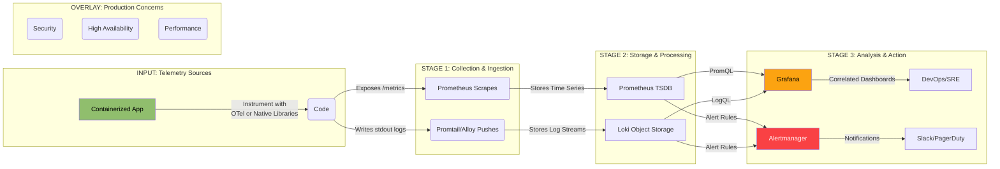
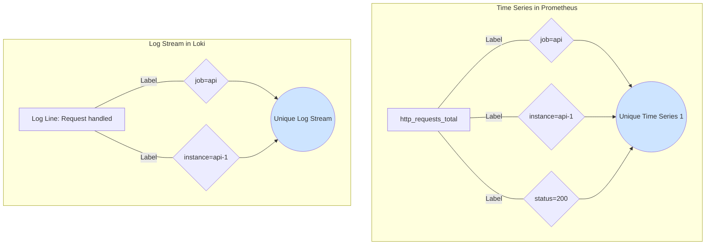
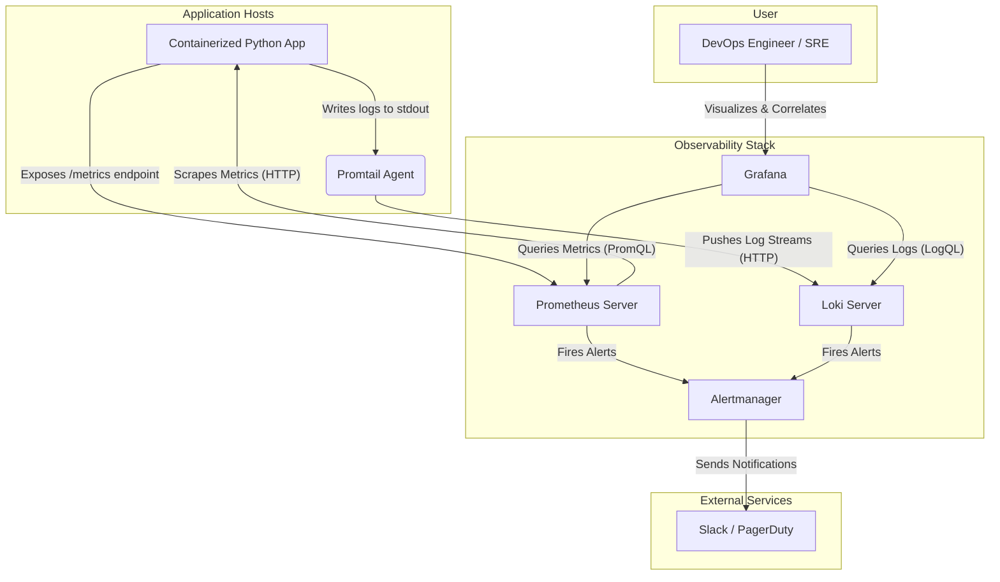
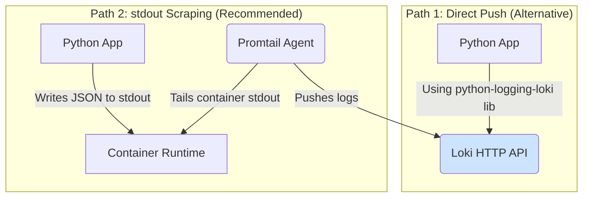
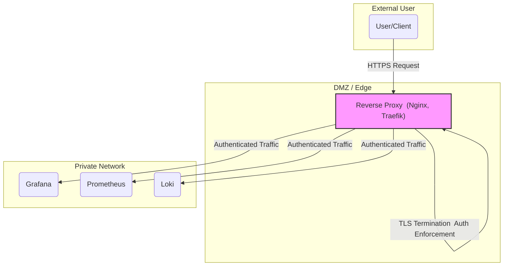
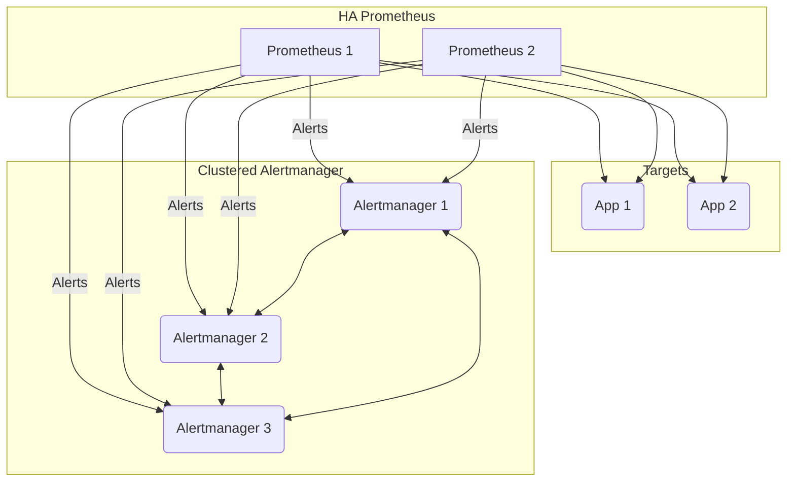
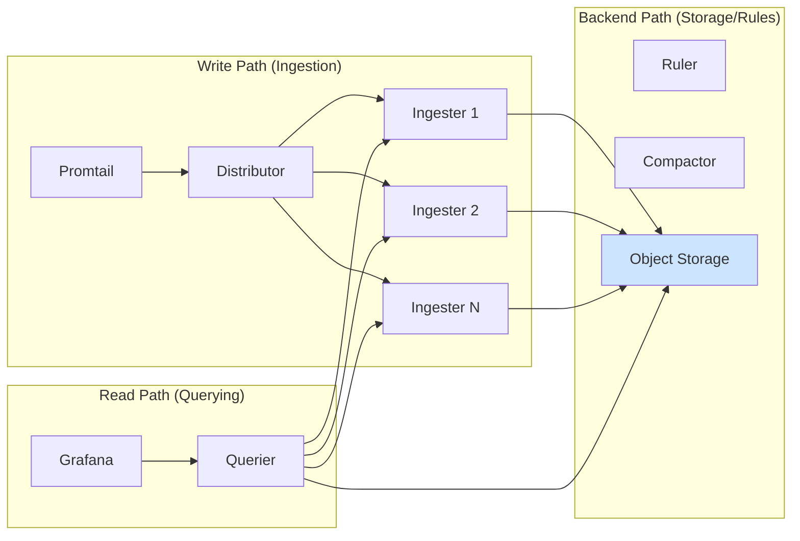
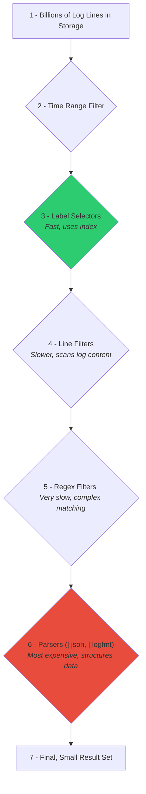
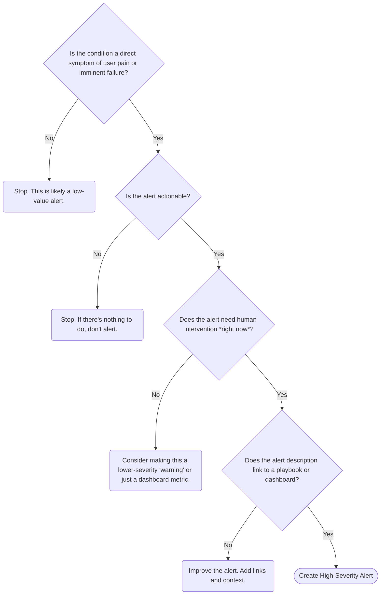
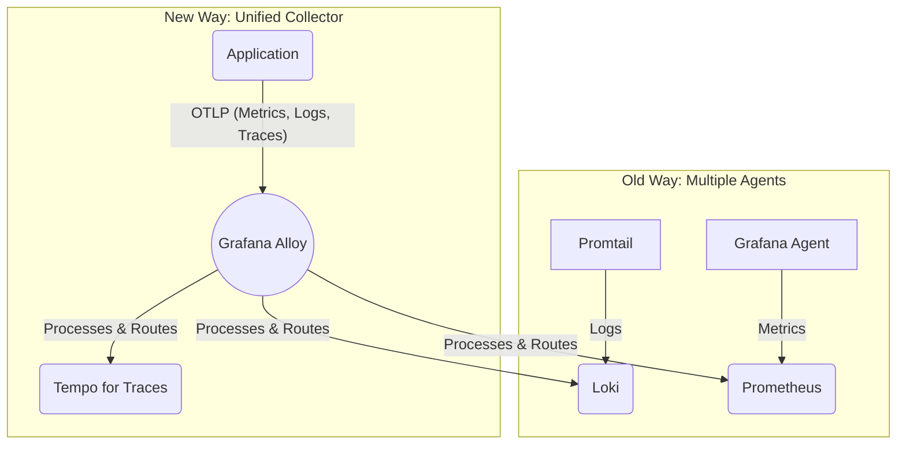

# A Comprehensive Guide to Production-Grade Monitoring with Grafana, Prometheus, and Loki



## Table of Contents

- [A Comprehensive Guide to Production-Grade Monitoring with Grafana, Prometheus, and Loki](#a-comprehensive-guide-to-production-grade-monitoring-with-grafana-prometheus-and-loki)
  - [Table of Contents](#table-of-contents)
  - [Part 1: The Modern Observability Stack: An Architectural Deep Dive](#part-1-the-modern-observability-stack-an-architectural-deep-dive)
    - [1.1 Introduction: The "PLG" Stack - A Unified, Cost-Effective Approach](#11-introduction-the-plg-stack---a-unified-cost-effective-approach)
    - [1.2 Component Architecture and Data Flow](#12-component-architecture-and-data-flow)
    - [1.3 Architectural Blueprint: Visualizing the Data Flow](#13-architectural-blueprint-visualizing-the-data-flow)
  - [Part 2: Practical Implementation: A Production-Ready Docker Compose Setup](#part-2-practical-implementation-a-production-ready-docker-compose-setup)
    - [2.1 Project Structure and Prerequisites](#21-project-structure-and-prerequisites)
    - [2.2 The Complete docker-compose.yml](#22-the-complete-docker-composeyml)
    - [2.3 Configuring Prometheus (`prometheus.yml` \& `app_alerts.yml`)](#23-configuring-prometheus-prometheusyml--app_alertsyml)
    - [2.4 Configuring Loki (`loki-config.yml`)](#24-configuring-loki-loki-configyml)
    - [2.5 Configuring Promtail (`promtail-config.yml`)](#25-configuring-promtail-promtail-configyml)
    - [2.6 Configuring Alertmanager (`alertmanager.yml`)](#26-configuring-alertmanager-alertmanageryml)
    - [2.7 Provisioning Grafana for Turnkey Operation](#27-provisioning-grafana-for-turnkey-operation)
  - [Part 3: Monitoring a Python Application: An End-to-End Example](#part-3-monitoring-a-python-application-an-end-to-end-example)
    - [3.1 The Sample Python Flask Application (`app.py`)](#31-the-sample-python-flask-application-apppy)
    - [3.2 Instrumenting for Metrics with `prometheus-client`](#32-instrumenting-for-metrics-with-prometheus-client)
    - [3.3 Instrumenting for Logs with `python-json-logger`](#33-instrumenting-for-logs-with-python-json-logger)
    - [3.4 Containerizing the Application (Dockerfile and `requirements.txt`)](#34-containerizing-the-application-dockerfile-and-requirementstxt)
    - [3.5 Launching and Verifying the Full Stack](#35-launching-and-verifying-the-full-stack)
  - [Part 4: From Setup to Production: Advanced Topics and Best Practices](#part-4-from-setup-to-production-advanced-topics-and-best-practices)
    - [4.1 Security Hardening: A Multi-Layered Approach](#41-security-hardening-a-multi-layered-approach)
    - [4.2 High Availability (HA) and Scalability](#42-high-availability-ha-and-scalability)
    - [4.3 Performance Optimization](#43-performance-optimization)
    - [4.4 Building an Integrated Dashboard](#44-building-an-integrated-dashboard)
    - [4.5 Alerting Philosophy: From Noise to Actionable Signals](#45-alerting-philosophy-from-noise-to-actionable-signals)
  - [Part 5: The Evolving Landscape: OpenTelemetry and Beyond](#part-5-the-evolving-landscape-opentelemetry-and-beyond)
    - [5.1 OpenTelemetry vs. Native Instrumentation: A Strategic Comparison](#51-opentelemetry-vs-native-instrumentation-a-strategic-comparison)
    - [5.2 The Role of the Collector: Grafana Alloy](#52-the-role-of-the-collector-grafana-alloy)
    - [5.3 Conclusion: Building a Future-Proof Observability Platform](#53-conclusion-building-a-future-proof-observability-platform)


## Part 1: The Modern Observability Stack: An Architectural Deep Dive

### 1.1 Introduction: The "PLG" Stack - A Unified, Cost-Effective Approach

In the landscape of modern software systems, particularly those built on microservices and containerized infrastructure, observability is not a luxury but a fundamental requirement.  The ability to understand the internal state of a system from its external outputs-metrics, logs, and traces-is paramount for maintaining reliability, performance, and a positive user experience.  This guide focuses on a powerful, open-source, and increasingly popular combination of tools for achieving comprehensive observability: Prometheus for metrics, Loki for logs, and Grafana for unified visualization and exploration.  This trio is often referred to as the "PLG" stack. 

The core components of this stack address the first two pillars of observability: 

  * **Prometheus:** A powerful, open-source time-series database and alerting platform that has become the de-facto standard for metrics collection in cloud-native environments.  It excels at capturing numerical data like request counts, latency, CPU usage, and memory consumption. 
  * **Grafana Loki:** A horizontally scalable, highly available, multi-tenant log aggregation system.  Crucially, Loki was designed to be cost-effective and easy to operate, drawing direct inspiration from Prometheus.  It handles the collection, storage, and querying of log data.
  * **Grafana:** An open-source interactive data-visualization platform that serves as the "single pane of glass" for the entire stack.  It allows users to create complex monitoring dashboards that pull data from multiple sources, including Prometheus and Loki, into a single, cohesive view. 

The primary value of the PLG stack lies not just in its individual components but in their synergistic integration.  It offers a cohesive and cost-effective alternative to other solutions, such as the ELK (Elasticsearch, Logstash, Kibana) stack, by adopting a different architectural philosophy. 

To master this stack, one must first understand its foundational design principle, which can be described as the **"Prometheus Philosophy."** 

Prometheus revolutionized metrics monitoring with its multi-dimensional, label-based data model.  Instead of treating metrics as simple hierarchical names (e.g., `servers.us-east-1.web-01.cpu.load_avg`), Prometheus identifies every time series with a metric name and a set of key-value pairs called **labels**.  This allows for powerful, flexible querying and aggregation. 

-----

**Analogy: The Label-Based Filing System**

Think of traditional metrics as a rigid set of nested folders on a computer. To find a specific file, you must know the exact path. If you want to see all files related to `web-01` across all regions, you have to search in many different places.

Prometheus, with its label model, is like a modern digital filing system. Every document has a name (the metric name) and a set of tags (labels). A metric might be `http_requests_total` with labels like `{region="us-east-1", server="web-01", path="/login", status="500"}`. Now, you can instantly find data by asking flexible questions:

  * "Show me all requests for `server="web-01"`"
  * "Show me all `500` errors across all regions"
  * "Show me all requests for the `/login` path, regardless of server"

-----

Loki explicitly applies this same model to logs.  This is the central architectural concept that distinguishes it from traditional logging systems.  Instead of performing full-text indexing on the entire content of every log message-a process that is resource-intensive and expensive-Loki indexes only a small, curated set of metadata labels for each log stream.  A log stream is simply a sequence of logs that share the same set of labels.  This approach dramatically reduces storage costs and simplifies operation, but it places a critical emphasis on a well-designed labeling strategy. 

To use the PLG stack effectively, an engineer must shift their mindset from thinking of logs as simple strings of text to viewing them as streams of events defined by a rich, queryable set of metadata. 



This shared philosophy is the "secret sauce" that enables the stack's most powerful feature: **seamless correlation between metrics and logs**.  This guide is built around mastering this philosophy, as it influences every subsequent step from application instrumentation to query performance tuning. 

### 1.2 Component Architecture and Data Flow

Understanding how each component interacts is essential for effective deployment and troubleshooting.  The PLG stack is composed of several distinct but interconnected services. 

  * **Prometheus:** At its core, Prometheus is a time-series database (TSDB) and an alerting platform.  It operates on a **pull model**, meaning it is configured to periodically scrape (or "pull") metrics from HTTP endpoints exposed by target applications, typically at the `/metrics` path.  This pull-based approach provides a clear mechanism for service discovery and health monitoring;  if a target cannot be scraped, it is considered down.  Prometheus stores this data locally and provides a powerful query language, PromQL, to analyze it. 

  * **Loki:** Loki is a log aggregation system designed for scalability and efficiency.  In direct contrast to Prometheus, it operates on a **push model**.  Agents deployed alongside applications are responsible for sending (or "pushing") log data to the Loki server.  Its defining feature is its indexing strategy. It does not perform full-text indexing on log content.  Instead, it only indexes the metadata labels associated with each log stream.  The raw log data is compressed into "chunks" and stored in a separate, low-cost object storage backend like Amazon S3, Google Cloud Storage, or even the local filesystem for smaller setups.  This separation of index and data is key to its cost-effectiveness. 

-----

**Pattern: The "Separate Index from Data" Principle**

Loki's efficiency comes from treating logs like a book.

  * **The Labels** are the book's *Index*. It's very small and tells you exactly which chapters (log streams) contain the information you're looking for (e.g., logs from `app="api"`).
  * **The Log Content** is the book's *Chapters*. This is the bulk of the data. It's compressed and stored cheaply.

When you query, Loki first looks at the tiny, fast index to find the right streams. Only then does it go and decompress the relevant chapters (chunks) to search their text. Traditional systems that index every word are like creating a separate, massive book that lists the location of every single word in the original book-it's very powerful but incredibly expensive to create and store.

-----

  * **Grafana:** Grafana is the primary user interface for the stack and does not store any metric or log data itself.  It functions as a visualization and query engine, connecting to Prometheus and Loki as distinct **data sources**.  Users can build dashboards with panels that query Prometheus using PromQL and other panels that query Loki using its own query language, LogQL.  Because of the shared labeling philosophy, these queries can be linked, allowing for powerful interactive analysis. 

  * **Promtail (The Log Collector):** Promtail is the agent that collects logs and pushes them to Loki.  It is designed to be lightweight and is typically deployed on every machine or as a DaemonSet in Kubernetes.  Its primary responsibilities are:

      * **Discovering** log sources (e.g., local files or Docker container logs). 
      * **Attaching** labels to the logs to create streams (e.g., `app="api"`, `level="error"`). 
      * **Pushing** the log streams to the Loki instance via its HTTP API. 
        \*It is important to note that Promtail is currently in a long-term support phase and is being succeeded by **Grafana Alloy**, a more comprehensive agent that unifies the collection of metrics, logs, and traces. 

  * **Alertmanager:** Alertmanager is a standalone service that handles alerts generated by Prometheus and Loki.  Prometheus and Loki's ruler component are responsible for evaluating alerting rules against their respective data.  When a rule's condition is met, an alert is fired and sent to Alertmanager.  Alertmanager then takes over, managing deduplication, grouping, silencing, and routing these alerts to the correct notification receivers, such as Slack, PagerDuty, or email.  This separation of concerns allows for sophisticated alert routing and notification logic independent of the monitoring systems themselves. 

The following table provides a quick-reference summary of each component's role. 

| Component          | Primary Role                  | Data Model                 | Collection Method                               | Key Functionality                                                           |
| :----------------- | :---------------------------- | :------------------------- | :---------------------------------------------- | :-------------------------------------------------------------------------- |
| **Grafana**        | Visualization & Exploration   | N/A (Queries data sources) | N/A                                             | Unified dashboards, querying, alerting UI, user management.                 |
| **Prometheus**     | Metrics Monitoring & Alerting | Time Series with Labels    | **Pull** (Scrapes /metrics endpoints)           | Time-series storage (TSDB), PromQL query language, rule evaluation.         |
| **Loki**           | Log Aggregation & Alerting    | Log Streams with Labels    | **Push** (Receives logs from agents)            | Metadata-only indexing, LogQL query language, chunked object storage.       |
| **Promtail/Alloy** | Log/Telemetry Collection      | N/A (Forwards data)        | **Push** (Sends data to Loki)                   | Service discovery, log tailing, label attachment, transformation pipelines. |
| **Alertmanager**   | Alert Routing & Notification  | N/A (Receives alerts)      | **Push** (Receives alerts from Prometheus/Loki) | Deduplication, grouping, silencing, inhibition, routing to receivers.       |

### 1.3 Architectural Blueprint: Visualizing the Data Flow

A high-level architectural diagram provides a crucial visual anchor for understanding how data flows through the entire system.



Imagine a containerized Python application. This application is the source of our telemetry data. 

1.  **Instrumentation:** The application code is instrumented to expose its key performance indicators (KPIs) as metrics on a `/metrics` endpoint.  Simultaneously, it writes structured logs (e.g., in JSON format) to its standard output (stdout). 
2.  **Metrics Collection:** The Prometheus server is configured to discover and scrape the Python application's `/metrics` endpoint on a regular interval (e.g., every 15 seconds).  It ingests these metrics, attaches labels like `job="python-app"` and `instance="container_id"`, and stores them in its time-series database. 
3.  **Log Collection:** The Promtail agent, running on the same Docker host, is configured to monitor the Docker daemon's logs.  It discovers the new Python application container, begins tailing its stdout stream, and attaches a similar set of labels (e.g., `container="python-app"`, `job="docker-logs"`).  It then pushes these labeled log streams to the Loki server. 
4.  **Alert Evaluation:**
      * Prometheus continuously evaluates its configured alerting rules (e.g., "alert if the 5-minute error rate exceeds 5%").  If a rule triggers, it sends an alert to Alertmanager. 
      * Loki's internal "ruler" component continuously evaluates its own rules against incoming log streams (e.g., "alert if more than 10 authentication failure logs are seen in 1 minute").  If triggered, it also sends an alert to Alertmanager. 
5.  **Notification:** Alertmanager receives alerts from both Prometheus and Loki.  It deduplicates and groups them (e.g., grouping 50 alerts from different instances of the same service into one notification) and forwards a single, consolidated notification to a configured channel, such as a Slack channel. 
6.  **Visualization and Correlation:** A DevOps engineer or SRE opens a Grafana dashboard.  This dashboard contains panels that query both Prometheus and Loki.  They see a graph from Prometheus showing a spike in the application's error rate.  Thanks to the power of correlated telemetry, they can seamlessly pivot to the logs.  The key here is the use of **shared labels**.  The same labels, such as `container="python-app"` and `instance="abc123"`, are present on both the metrics from Prometheus and the logs from Loki.  In Grafana, the user can click on the spike in the metrics graph, and a data link can automatically open the "Explore" view, pre-filtered to show logs from the *exact same container* at the *exact same time* as the metric spike.  This allows them to instantly see the specific error messages that caused the metric anomaly, dramatically reducing the Mean Time to Resolution (MTTR).  This tight integration, enabled by a shared labeling philosophy, is the stack's most compelling feature. 

## Part 2: Practical Implementation: A Production-Ready Docker Compose Setup

This section provides a complete, hands-on guide to deploying the entire PLG stack using Docker Compose.  While a true large-scale production environment would typically use a container orchestrator like Kubernetes with Helm charts, this Docker Compose setup serves as an invaluable tool for development, testing, and learning.  It is designed to be a functional model of a production architecture, demonstrating key principles like configuration-as-code, data persistence, and service separation, which are directly transferable to more complex deployment environments.  Many simplistic examples exist, but this guide aims to bridge the gap between a basic tutorial and a production-ready mindset. 

### 2.1 Project Structure and Prerequisites

A well-organized project structure is crucial for maintainability.  All configuration files will be managed on the host machine and mounted into their respective containers, adhering to the principles of configuration-as-code. 

**Prerequisites:** 

  * A recent version of Docker installed.
  * A recent version of Docker Compose installed.

**Project Directory Structure:** Create the following directory structure to house the configuration files and application code. 

```
monitoring-stack/
├── docker-compose.yml
├── python-app/
│   ├── app.py
│   ├── requirements.txt
│   └── Dockerfile
├── grafana/
│   ├── provisioning/
│   │   ├── datasources/
│   │   │   └── datasources.yml
│   │   └── dashboards/
│   │       ├── dashboard-provider.yml
│   │       └── python-app-dashboard.json
│   └── grafana.ini
├── prometheus/
│   ├── prometheus.yml
│   └── rules/
│       └── app_alerts.yml
├── loki/
│   └── loki-config.yml
├── promtail/
│   └── promtail-config.yml
└── alertmanager/
    └── alertmanager.yml
```


### 2.2 The Complete docker-compose.yml

This file is the heart of the deployment, defining every service, its configuration, networking, and data persistence strategy.  It synthesizes best practices from various sources to create a robust and understandable setup.

```yaml
# docker-compose.yml
version: '3.8'

volumes:
  prometheus_data: {}
  loki_data: {}
  grafana_data: {}

networks:
  monitoring-network:
    driver: bridge

services:
  prometheus:
    image: prom/prometheus:latest
    container_name: prometheus
    restart: unless-stopped
    volumes:
      - ./prometheus/:/etc/prometheus/
      - prometheus_data:/prometheus
    command:
      - '--config.file=/etc/prometheus/prometheus.yml'
      - '--storage.tsdb.path=/prometheus'
      - '--web.console.libraries=/usr/share/prometheus/console_libraries'
      - '--web.console.templates=/usr/share/prometheus/consoles'
      # Allows for hot-reloading of config via a POST request, useful for automation.
      - '--web.enable-lifecycle'
    ports:
      - "9090:9090"
    networks:
      - monitoring-network

  alertmanager:
    image: prom/alertmanager:latest
    container_name: alertmanager
    restart: unless-stopped
    volumes:
      - ./alertmanager/:/config/
    command:
      - '--config.file=/config/alertmanager.yml'
      - '--storage.path=/alertmanager'
    ports:
      - "9093:9093"
    networks:
      - monitoring-network

  loki:
    image: grafana/loki:latest
    container_name: loki
    restart: unless-stopped
    volumes:
      - ./loki/loki-config.yml:/etc/loki/config.yml
      - loki_data:/loki
    command: -config.file=/etc/loki/config.yml
    ports:
      - "3100:3100"
    networks:
      - monitoring-network

  promtail:
    image: grafana/promtail:latest
    container_name: promtail
    restart: unless-stopped
    volumes:
      - /var/run/docker.sock:/var/run/docker.sock:ro
      - ./promtail/promtail-config.yml:/etc/promtail/config.yml
      # Required for Promtail to find the container log files on the host.
      - /var/lib/docker/containers:/var/lib/docker/containers:ro
    command: -config.file=/etc/promtail/config.yml
    networks:
      - monitoring-network
    # Ensures Loki is running before Promtail starts, preventing initial push errors.
    depends_on:
      - loki

  grafana:
    image: grafana/grafana:latest
    container_name: grafana
    restart: unless-stopped
    volumes:
      - grafana_data:/var/lib/grafana
      - ./grafana/provisioning/:/etc/grafana/provisioning/
      - ./grafana/grafana.ini:/etc/grafana/grafana.ini
    environment:
      - GF_SECURITY_ADMIN_USER=admin
      - GF_SECURITY_ADMIN_PASSWORD=admin
      - GF_USERS_ALLOW_SIGN_UP=false
    ports:
      - "3000:3000"
    networks:
      - monitoring-network
    # Prevents Grafana from starting before its data sources are available.
    depends_on:
      - prometheus
      - loki

  python-app:
    build:
      context: ./python-app
      dockerfile: Dockerfile
    container_name: python-app
    restart: unless-stopped
    ports:
      - "8080:8080"
    networks:
      - monitoring-network

```


**Key Configuration Points:**

  * **Volumes:** Named volumes (`prometheus_data`, `loki_data`, `grafana_data`) are used to persist critical data even if the containers are removed and recreated.  This is essential for preventing data loss.
  * **Configuration Mounts:** Each service mounts its configuration directory or file from the host, enabling changes without rebuilding the image.  This embodies the "Configuration-as-Code" pattern.
  * **Networking:** A custom bridge network, `monitoring-network`, is defined. All services are attached to this network, allowing them to communicate with each other using their service names as hostnames (e.g., `prometheus` can reach `alertmanager` at `http://alertmanager:9093`). 
  * **Ports:** Ports are exposed to the host machine for user access (Grafana on 3000, Prometheus on 9090, etc.). 
  * **`depends_on`:** This directive helps control startup order. For example, Grafana depends on Prometheus and Loki to ensure its data sources are available when it starts, preventing initial "data source not found" errors in the UI. 

### 2.3 Configuring Prometheus (`prometheus.yml` & `app_alerts.yml`)

The `prometheus.yml` file instructs Prometheus on what to scrape, how often, and where to send alerts. 

```yaml
# prometheus/prometheus.yml
global:
  scrape_interval: 15s
  evaluation_interval: 15s

alerting:
  alertmanagers:
    - static_configs:
        - targets:
            # Use the service name and internal port defined in docker-compose
            - 'alertmanager:9093'

rule_files:
  # Load any .yml files from this directory for alert rules
  - '/etc/prometheus/rules/*.yml'

scrape_configs:
  - job_name: 'prometheus'
    static_configs:
      - targets: ['localhost:9090']

  - job_name: 'loki'
    static_configs:
      - targets: ['loki:3100']

  - job_name: 'promtail'
    # Promtail exposes its own metrics for monitoring the agent itself
    static_configs:
       - targets: ['promtail:9080']

  - job_name: 'python-app'
    static_configs:
      - targets: ['python-app:8080']
```


**Configuration Breakdown:**

  * **`global`:** Sets the default scrape and rule evaluation intervals to 15 seconds. 
  * **`alerting`:** Configures the connection to the Alertmanager service, using the service name `alertmanager` and its internal port 9093. 
  * **`rule_files`:** Tells Prometheus to load all YAML files from the `/etc/prometheus/rules/` directory.  This is where we will place our application-specific alert rules. 
  * **`scrape_configs`:** Defines the targets to be monitored.  Jobs are included for meta-monitoring (Prometheus, Loki, Promtail) and for our target `python-app`.  The targets are specified using the service names defined in `docker-compose.yml`. 

Next, create a sample alert rule file for the Python application. 

```yaml
# prometheus/rules/app_alerts.yml
groups:
  - name: PythonAppAlerts
    rules:
      - alert: HighErrorRate
        # PromQL expression to calculate the 5xx error rate over the last minute
        expr: sum(rate(http_requests_total{job="python-app", status=~"5.."}[1m])) / sum(rate(http_requests_total{job="python-app"}[1m])) > 0.05
        # Condition must be true for 1 minute before firing to avoid flapping
        for: 1m
        labels:
          severity: critical
        annotations:
          summary: "High HTTP 5xx error rate on {{ $labels.instance }}"
          description: "The error rate for the python-app on instance {{ $labels.instance }} has been over 5% for the last minute. Current value is {{ $value | humanizePercentage }}."
```


This rule calculates the rate of HTTP 5xx responses over a 1-minute window and fires an alert if it exceeds 5% for more than one minute. 

### 2.4 Configuring Loki (`loki-config.yml`)

This file configures Loki's storage, schema, and alerting ruler.  For this example, we use the filesystem for storage, but in a production environment, this should be replaced with an object store like S3. 

```yaml
# loki/loki-config.yml
auth_enabled: false

server:
  http_listen_port: 3100
  grpc_listen_port: 9096

common:
  instance_addr: 127.0.0.1
  path_prefix: /loki
  storage:
    filesystem:
      chunks_directory: /loki/chunks
      rules_directory: /loki/rules
  replication_factor: 1
  ring:
    kvstore:
      store: inmemory

schema_config:
  configs:
    - from: 2020-10-24
      # tsdb is the recommended, high-performance index type
      store: tsdb
      object_store: filesystem
      schema: v12
      index:
        prefix: index_
        period: 24h

# Configures Loki to evaluate its own alert rules
ruler:
  alertmanager_url: http://alertmanager:9093
```


**Configuration Breakdown:**

  * **`auth_enabled: false`:** Disables multi-tenancy for simplicity in this example.  In production, this should be `true` and secured.
  * **`storage`:** Configured to use the local filesystem within the `loki_data` volume.  A production guide would emphasize replacing `filesystem` with a scalable object store configuration (e.g., `s3`, `gcs`). 
  * **`schema_config`:** Defines the storage schema. We use `tsdb`, the recommended, modern, and performant index type that was originally developed for Prometheus. 
  * **`ruler`:** Enables Loki's rule evaluation engine and points it to the Alertmanager service to send any log-based alerts. 

### 2.5 Configuring Promtail (`promtail-config.yml`)

Promtail's configuration is key to getting logs from Docker containers into Loki with the correct labels. 

```yaml
# promtail/promtail-config.yml
server:
  http_listen_port: 9080
  grpc_listen_port: 0

positions:
  filename: /tmp/positions.yaml

clients:
  - url: http://loki:3100/loki/api/v1/push

scrape_configs:
  - job_name: docker
    docker_sd_configs:
      - host: unix:///var/run/docker.sock
        refresh_interval: 5s
    relabel_configs:
      # Extract the container name (e.g., "python-app") into a 'container' label
      - source_labels: ['__meta_docker_container_name']
        regex: '/(.*)'
        target_label: 'container'
      # Extract the docker-compose service name into a 'service' label
      - source_labels: ['__meta_docker_container_label_com_docker_compose_service']
        target_label: 'service'
```


**Configuration Breakdown:**

  * **`clients`:** Defines the Loki endpoint where Promtail will push logs. 
  * **`scrape_configs`:** This is the core of the configuration. 
      * **`docker_sd_configs`:** This block enables Docker service discovery, allowing Promtail to automatically detect and start tailing logs from all containers managed by the Docker daemon on the host.  This requires the Docker socket (`/var/run/docker.sock`) to be mounted into the Promtail container. 
      * **`relabel_configs`:** This powerful mechanism, borrowed from Prometheus, allows for dynamic manipulation of labels.  Here, we are taking the internal metadata label `__meta_docker_container_name` provided by Docker service discovery and creating a new, clean label called `container` on our log streams.  We also extract the Docker Compose service name into a `service` label. 

**A Note on Promtail's Evolution:** It is critical to recognize that the official Grafana Loki documentation now states that Promtail is in Long-Term Support (LTS) and is scheduled for End-of-Life (EOL).  The strategic direction is to migrate to **Grafana Alloy**, which is a more powerful, unified agent capable of handling metrics, logs, traces, and profiles.  While Promtail is used in this example for its straightforward demonstration of Docker log scraping, any new production deployment should be planned with Grafana Alloy as the collector agent.  This will be discussed further in Part 5.

### 2.6 Configuring Alertmanager (`alertmanager.yml`)

This configuration sets up a basic alert pipeline that routes all alerts to a Slack channel. 

```yaml
# alertmanager/alertmanager.yml
global:
  resolve_timeout: 5m
  # IMPORTANT: Replace with your actual Slack Webhook URL
  slack_api_url: '<YOUR_SLACK_WEBHOOK_URL>'

route:
  # Group alerts by name and job to prevent a storm of notifications
  group_by: ['alertname', 'job']
  # Wait 30s to buffer alerts for the same group before sending a notification
  group_wait: 30s
  # Wait 5m before sending a notification for a new group of alerts
  group_interval: 5m
  # If an alert is still firing, resend the notification every 4 hours
  repeat_interval: 4h
  # Default receiver for all alerts
  receiver: 'slack-notifications'

receivers:
  - name: 'slack-notifications'
    slack_configs:
      - channel: '#alerts-channel'
        send_resolved: true
        title: '{{ .CommonAnnotations.summary }}'
        # Go templating to create a rich notification message
        text: >-
          {{ range .Alerts }}
            *Alert:* {{ .Annotations.summary }}
            *Description:* {{ .Annotations.description }}
            *Details:*
            {{ range .Labels.SortedPairs }} • *{{ .Name }}:* `{{ .Value }}`
            {{ end }}
          {{ end }}
```


**Configuration Breakdown:**

  * **`global`:** Contains the `slack_api_url`, which must be replaced with a real Slack incoming webhook URL. 
  * **`route`:** Defines the logic for handling alerts. 
      * `group_by`: Groups alerts by their name and job, preventing alert storms. 
      * `group_wait`, `group_interval`, `repeat_interval`: These timings are crucial for reducing notification noise by bundling related alerts and controlling reminders. 
      * `receiver`: Specifies that all alerts matching this route should go to the `slack-notifications` receiver. 
  * **`receivers`:** Defines the notification channels.  The `slack_configs` section specifies the channel and uses Go templating to create a detailed, readable notification message. 

### 2.7 Provisioning Grafana for Turnkey Operation

Grafana's provisioning system allows for the automatic configuration of data sources and dashboards, creating a truly turnkey experience on startup. 

First, configure the data sources.

```yaml
# grafana/provisioning/datasources/datasources.yml
apiVersion: 1

datasources:
  - name: Prometheus
    type: prometheus
    access: proxy # All requests go through Grafana backend
    url: http://prometheus:9090
    isDefault: true
  - name: Loki
    type: loki
    access: proxy
    url: http://loki:3100
```

This file automatically creates the Prometheus and Loki data sources in Grafana, using the service names as URLs.  `isDefault: true` sets Prometheus as the default for new panels.

Next, configure the dashboard provider.

```yaml
# grafana/provisioning/dashboards/dashboard-provider.yml
apiVersion: 1

providers:
  - name: 'Default'
    orgId: 1
    folder: ''
    type: file
    disableDeletion: false
    editable: true
    options:
      # Path inside the Grafana container where dashboards are located
      path: /etc/grafana/provisioning/dashboards
```


This tells Grafana to load any JSON files found in the specified path as dashboards.  The `python-app-dashboard.json` file, which will be created in Part 4, will be placed in the corresponding host directory (`grafana/provisioning/dashboards/`) and loaded automatically on startup. 

## Part 3: Monitoring a Python Application: An End-to-End Example

This part transitions from configuration to practical application, demonstrating how to instrument and monitor a generic Python web application within the stack we have just defined. 

### 3.1 The Sample Python Flask Application (`app.py`)

We will use a simple web application built with Flask, a popular Python web framework.  This application will provide several endpoints to generate a variety of metrics and logs. 

```python
# python-app/app.py
import os
import time
import random
import logging
from flask import Flask, request, jsonify
from prometheus_client import Counter, Histogram, generate_latest, REGISTRY
from pythonjsonlogger import jsonlogger

# --- Logging Setup ---
# Heuristic: Configure logging to output structured JSON to stdout.
# This allows agents like Promtail to parse logs reliably without regex.
log_handler = logging.StreamHandler()
formatter = jsonlogger.JsonFormatter('%(asctime)s %(name)s %(levelname)s %(message)s')
log_handler.setFormatter(formatter)

logger = logging.getLogger('python-app')
logger.addHandler(log_handler)
logger.setLevel(logging.INFO)

app = Flask(__name__)

# --- Prometheus Metrics Setup ---
# A Counter to track the total number of HTTP requests.
# Labels are used to partition the counter by method, endpoint, and status code. 
HTTP_REQUESTS_TOTAL = Counter(
    'http_requests_total',
    'Total number of HTTP requests',
    ['method', 'endpoint', 'http_status']
)

# A Histogram to track the duration of HTTP requests.
# Buckets are defined to categorize latencies. 
HTTP_REQUEST_LATENCY_SECONDS = Histogram(
    'http_request_latency_seconds',
    'HTTP request latency in seconds',
    ['method', 'endpoint']
)

# --- Flask Application Routes ---

@app.route('/')
def index():
    """A simple 'Hello World' endpoint."""
    logger.info("Index endpoint was hit")
    return "Hello from the Python Monitoring App!"

@app.route('/work')
def work():
    """An endpoint that simulates work with a random delay."""
    start_time = time.time()

    # Simulate work with a random delay between 0.1 and 1.5 seconds
    delay = random.uniform(0.1, 1.5)
    time.sleep(delay)

    duration = time.time() - start_time
    # Add structured data to the log message
    logger.info(f"Work completed in {duration:.2f} seconds", extra={'duration_seconds': duration, 'task_name': 'random_delay'})
    return jsonify(message=f"Work done in {delay:.2f} seconds"), 200

@app.route('/error')
def error():
    """An endpoint that intentionally raises an exception."""
    try:
        raise ValueError("This is an intentional error for testing.")
    except ValueError as e:
        # exc_info=True adds stack trace information to the log record
        logger.error("An intentional error occurred", exc_info=True)
        return jsonify(error=str(e)), 500

@app.route('/metrics')
def metrics():
    """Expose Prometheus metrics."""
    return generate_latest(REGISTRY), 200

# --- Request/Response Middleware ---
# Pattern: Use middleware to ensure every request is measured.

@app.before_request
def before_request():
    """Record the start time of a request.""" 
    request.start_time = time.time()

@app.after_request
def after_request(response):
    """Record metrics after a request has been processed."""
    # Calculate request latency
    latency = time.time() - request.start_time

    # Observe the latency in the Histogram
    HTTP_REQUEST_LATENCY_SECONDS.labels(
        method=request.method,
        endpoint=request.path
    ).observe(latency)

    # Increment the request counter
    HTTP_REQUESTS_TOTAL.labels(
        method=request.method,
        endpoint=request.path,
        http_status=response.status_code
    ).inc()

    # Log details about the processed request in a structured format
    logger.info(
        "Request processed",
        extra={
            'request_method': request.method,
            'request_path': request.path,
            'response_status': response.status_code,
            'response_latency_ms': int(latency * 1000)
        }
    )

    return response

if __name__ == '__main__':
    app.run(host='0.0.0.0', port=8080, debug=False)
```


This application includes:

  * Endpoints `/`, `/work`, and `/error` to generate successful requests, delayed responses, and server errors. 
  * A `/metrics` endpoint to expose Prometheus metrics. 
  * Structured JSON logging configured to write to standard output. 

### 3.2 Instrumenting for Metrics with `prometheus-client`

Instrumenting an application for Prometheus involves adding client libraries to the code to create, update, and expose metrics.  The `prometheus-client` library for Python is the standard for this purpose.  There are four primary metric types in Prometheus, each serving a distinct purpose.  Choosing the correct type is essential for meaningful monitoring. 

| Metric Type   | Description                                                                                                                                                             | Use Case Example                                                                                                                                                                                      | `prometheus-client` Class |
| :------------ | :---------------------------------------------------------------------------------------------------------------------------------------------------------------------- | :---------------------------------------------------------------------------------------------------------------------------------------------------------------------------------------------------- | :------------------------ |
| **Counter**   | A cumulative metric that represents a single monotonically increasing counter whose value can only increase or be reset to zero on restart.                             | Counting the total number of requests served, tasks completed, or errors occurred.                                                                                                                    | `Counter`                 |
| **Gauge**     | A metric that represents a single numerical value that can arbitrarily go up and down.                                                                                  | Measuring current memory usage, the number of items in a queue, or the number of concurrent requests.                                                                                                 | `Gauge`                   |
| **Histogram** | Samples observations (usually request durations or response sizes) and counts them in configurable buckets.  It also provides a sum of all observed values.             | Measuring request latency distribution (e.g., how many requests completed in \<100ms, \<300ms, etc.).  Allows for calculating apdex scores and approximate quantiles (e.g., 95th percentile latency). | `Histogram`               |
| **Summary**   | Similar to a histogram, it samples observations. However, it calculates configurable quantiles over a sliding time window on the client side and exposes them directly. | Measuring request latency and directly observing quantiles (e.g., 50th, 90th, 99th percentile) without needing complex server-side PromQL.                                                            | `Summary`                 |

In our sample application (`app.py`), we use two of these types:

  * **Counter (`HTTP_REQUESTS_TOTAL`):** This metric is ideal for tracking the total number of HTTP requests.  We use labels (`method`, `endpoint`, `http_status`) to partition the count, allowing us to query for things like "the rate of POST requests to the `/work` endpoint that resulted in a 200 status code". 
  * **Histogram (`HTTP_REQUEST_LATENCY_SECONDS`):** This metric is used to measure and categorize request durations.  By observing the latency of each request, the histogram allows us to later query for the 95th or 99th percentile latency using PromQL's `histogram_quantile` function, which is crucial for understanding user-perceived performance and defining Service Level Objectives (SLOs). 

The application uses Flask's `before_request` and `after_request` decorators to create a simple middleware.  This ensures that latency is measured and both metrics are updated for every single request that passes through the application, providing comprehensive coverage with minimal code duplication. 

### 3.3 Instrumenting for Logs with `python-json-logger`

Getting logs into Loki can be approached in two primary ways: direct push from the application or scraping container output via an agent. 



1.  **Direct Push:** The application uses a specific library, like `python-logging-loki`, to format logs and send them directly to Loki's push API endpoint.  This method is suitable for applications running on bare metal, in virtual machines, or in environments where an agent-based approach is not feasible.  The library handles batching and transmission of logs. 
2.  **stdout Scraping (Recommended for Containers):** The application is configured to write its logs to standard output (stdout) or standard error (stderr).  A logging agent, like Promtail, running on the host or as a sidecar, is then configured to tail the output of the container.  This is the **recommended cloud-native best practice** for several reasons: 
      * **Decoupling:** The application is completely unaware of the logging backend.  It simply logs to stdout, a standard practice. The logging infrastructure can be changed (e.g., from Loki to another system) without any changes to the application code. 
      * **Resilience:** If the logging backend is temporarily unavailable, the application continues to run without issue.  The agent can buffer logs and retry sending them once the backend is available. 
      * **Enriched Metadata:** The agent can automatically enrich logs with valuable metadata from the container runtime, such as the container name, image, and any Docker or Kubernetes labels, providing crucial context for free. 

Our example follows the recommended stdout scraping approach. We use the `python-json-logger` library to ensure that all logs written to stdout are in a structured **JSON format**.  This is a critical best practice. While Loki can handle unstructured text, structured logs are far more powerful because they allow Promtail's pipeline stages (or Loki's query-time parsers) to easily extract key-value pairs from the log message itself, turning them into queryable fields without complex and slow regex matching. 

-----

**Annotated Example: Structured vs. Unstructured Logs**

  * **Unstructured Log Line:**
    `INFO: Request to /work completed in 0.52 seconds with status 200.`

      * **LogQL to find slow requests:** `{container="python-app"} |= "completed in" | regexp ".* in (?P<duration>\\d+\\.\\d+) seconds .*" | duration > 0.5`
      * *This is slow, brittle, and hard to write.*

  * **Structured (JSON) Log Line:**
    `{"asctime": "...", "message": "Request processed", "request_path": "/work", "response_status": 200, "response_latency_ms": 520}`

      * **LogQL to find slow requests:** `{container="python-app"} | json | response_latency_ms > 500`
      * *This is fast, reliable, and intuitive.*

-----

In `app.py`, the logging setup achieves this: 

```python
# Configure a logger to output structured JSON logs to stdout
log_handler = logging.StreamHandler()
formatter = jsonlogger.JsonFormatter('%(asctime)s %(name)s %(levelname)s %(message)s')
log_handler.setFormatter(formatter)
logger = logging.getLogger('python-app')
logger.addHandler(log_handler)
logger.setLevel(logging.INFO)
```

When a log message is emitted, like `logger.info("Work completed", extra={'duration_seconds': 2.1})`, it produces a JSON line on stdout that Promtail can easily parse. 

### 3.4 Containerizing the Application (Dockerfile and `requirements.txt`)

To run our application within the Docker Compose setup, we need a Dockerfile to build its container image. 

First, define the Python dependencies in `requirements.txt`.

```
# python-app/requirements.txt
Flask==3.0.3
prometheus-client==0.20.0
python-json-logger==2.0.7
```


Next, create the `Dockerfile` to build the application image. 

```dockerfile
# python-app/Dockerfile

# Use an official Python runtime as a parent image
FROM python:3.11-slim

# Set the working directory in the container
WORKDIR /usr/src/app

# Copy the requirements file into the container
COPY requirements.txt ./

# Install any needed packages specified in requirements.txt
# --no-cache-dir reduces final image size
RUN pip install --no-cache-dir -r requirements.txt

# Copy the application code into the container
COPY app.py .

# Make port 8080 available to the world outside this container
EXPOSE 8080

# Define environment variable (optional)
ENV NAME World

# Run app.py when the container launches
CMD ["python", "app.py"]
```


This Dockerfile follows standard practices: it starts from a slim base image, copies and installs dependencies, then copies the application code, and finally defines the command to run the application. 

### 3.5 Launching and Verifying the Full Stack

With all configuration files and the application code in place, launching the entire stack is accomplished with a single command from the root of the `monitoring-stack` directory:

```bash
docker compose up -d --build
```

The `--build` flag ensures that the Python application image is built before starting.  The `-d` flag runs the containers in detached mode. 

After a minute or two for all services to initialize, you can verify that the stack is operating correctly:

1.  **Check Container Status:** Run `docker compose ps` to see the status of all containers.  All should show as `running` or `up`.
2.  **Access Grafana:** Open a web browser and navigate to `http://localhost:3000`.  Log in with the default credentials (`admin`/`admin`). You should be prompted to change the password.  Navigate to "Connections" -\> "Data Sources" to confirm that Prometheus and Loki were automatically provisioned. 
3.  **Verify Prometheus Targets:** Navigate to `http://localhost:9090/targets`. All configured jobs (`prometheus`, `loki`, `promtail`, `python-app`) should be listed with a state of "UP".  This confirms that Prometheus is successfully scraping all its targets. 
4.  **Verify Alertmanager:** Navigate to `http://localhost:9093`.  The Alertmanager UI should be visible. 
5.  **Confirm Logs are Flowing:** In Grafana, go to the "Explore" view (compass icon).  Select the "Loki" data source from the dropdown at the top.  In the query bar, enter the LogQL query `{container="python-app"}` and run it.  You should see the JSON-formatted logs from the Python application appearing. 
6.  **Generate Traffic:** To see metrics and logs in action, generate some traffic to the application endpoints using `curl` or a web browser: 
    ```bash
    curl http://localhost:8080/
    curl http://localhost:8080/work
    curl http://localhost:8080/error
    ```

With these steps, the entire observability stack is running locally, collecting both metrics and logs from a containerized Python application, and is ready for exploration and dashboard creation. 

## Part 4: From Setup to Production: Advanced Topics and Best Practices

The Docker Compose setup provides an excellent foundation, but moving to a true production environment requires a deliberate focus on security, high availability, scalability, and performance.  These are not optional afterthoughts; they are critical design considerations for building a reliable and trustworthy observability platform. 

### 4.1 Security Hardening: A Multi-Layered Approach

Default installations of the PLG stack are often not secure for production use.  A robust security posture requires a multi-layered strategy that addresses the network, the applications, and data access policies. 



  * **Layer 1: Network and Endpoint Security** A fundamental weakness of Prometheus and Loki is their lack of strong, built-in authentication and transport encryption mechanisms.  Exposing their APIs directly to an untrusted network is a significant security risk. 

      * **Reverse Proxy with TLS:** The best practice is to place the entire stack behind a reverse proxy like Nginx or Traefik.  The proxy should be configured to terminate TLS (HTTPS), encrypting all traffic between users and the observability stack.  This is a non-negotiable first step. 
      * **Endpoint Authentication:** The same reverse proxy should be used to enforce authentication for access to the Grafana UI, Prometheus API, and Loki API. 
          * ***Annotated Example: Nginx Basic Auth***
            ```nginx
            # Nginx config snippet to protect a location
            location /prometheus {
                # Require a valid username/password from the htpasswd file
                auth_basic "Prometheus Login Required";
                auth_basic_user_file /etc/nginx/.htpasswd;

                # Proxy the authenticated request to the internal Prometheus service
                proxy_pass http://prometheus:9090;
            }
            ```
      * **Network Policies:** In a Kubernetes environment, network policies should be used to strictly control traffic flow.  For example, only the Prometheus server should be allowed to access the `/metrics` endpoints of applications, and only Promtail/Alloy should be able to push to Loki's ingest endpoint. 

  * **Layer 2: Grafana Security** Grafana itself has a comprehensive set of security features that must be configured correctly. 

      * **Default Admin Password:** The first action after deploying Grafana must be to change the default `admin` password. 
      * **User and Team Management:** Avoid using the admin account for daily work.  Instead, leverage Grafana's support for organizations, teams, and role-based permissions to grant users the minimum necessary access. 
      * **External Authentication:** For enterprise environments, integrate Grafana with an external authentication provider like LDAP, SAML, or OAuth to centralize user management and enforce organizational security policies. 
      * **(Enterprise) Label-Based Access Control (LBAC):** For advanced data segregation, Grafana Enterprise supports LBAC for Prometheus and Loki data sources.  This allows administrators to write rules that restrict data access based on label values.  For example, Team A can be restricted to only seeing logs and metrics where the label `namespace="team-a"` is present, even when using a shared Loki or Prometheus instance. 

  * **Layer 3: Loki Multi-Tenancy** Loki has native support for multi-tenancy, which provides hard data isolation between different tenants.  This is a critical feature for service providers or large enterprises where different teams or customers must not have access to each other's data.  Multi-tenancy is enabled by setting `auth_enabled: true` in the Loki configuration and requiring clients (like Promtail) to send a unique tenant ID via the `X-Scope-OrgID` HTTP header with every request. 

The following table provides an actionable checklist for securing a production deployment. 

| Layer       | Control                           | Implementation Method                                                                                  |
| :---------- | :-------------------------------- | :----------------------------------------------------------------------------------------------------- |
| **Network** | Encrypt all external traffic      | Use a reverse proxy (Nginx, Traefik) to terminate TLS/HTTPS.                                           |
| **Network** | Secure API Endpoints              | Configure Basic Auth or an OAuth2 proxy for Grafana, Prometheus, and Loki APIs.                        |
| **Network** | Restrict Internal Traffic         | Use firewall rules or Kubernetes NetworkPolicies to enforce least-privilege access between components. |
| **Grafana** | Change Default Credentials        | Immediately change the default admin password upon first login.                                        |
| **Grafana** | Centralize User Management        | Integrate with an enterprise authentication provider (LDAP, SAML, OAuth).                              |
| **Grafana** | Implement Role-Based Access       | Use Grafana's Viewer, Editor, and Admin roles to grant appropriate permissions.                        |
| **Grafana** | (Enterprise) Restrict Data Access | Use Data Source Permissions and Label-Based Access Control (LBAC).                                     |
| **Loki**    | Isolate Data for Different Teams  | Enable multi-tenancy (`auth_enabled: true`) and assign unique tenant IDs.                              |

### 4.2 High Availability (HA) and Scalability

A single-instance deployment is a single point of failure.  A production observability stack must be resilient and scalable. 

**Prometheus:**

  * **High Availability:** The standard HA model for Prometheus involves running two identical Prometheus servers in parallel, scraping the same set of targets.  Alerts are sent from both instances to a clustered Alertmanager, which deduplicates them. 
  * **Scalability & Long-Term Storage:** A single Prometheus instance can become a bottleneck due to memory and disk I/O limitations.  The industry-standard solution for this is to use a project like **Thanos** or **Grafana Mimir**.  These tools extend Prometheus by adding a global query view, unlimited object storage, and downsampling. 

<!-- end list -->



**Loki:**

  * **Deployment Modes:** For production, the recommended approach is the **Simple Scalable Deployment (SSD)** mode.  This mode splits Loki into three distinct, independently scalable targets: `read`, `write`, and `backend`.  This allows you to scale resources based on your specific workload (e.g., scale up the `write` path for high ingestion volume). 
  * **Object Storage:** Using a highly available and scalable object store (e.g., AWS S3, GCS) is a non-negotiable prerequisite for a scalable and resilient Loki deployment. 

<!-- end list -->



**Alertmanager:**

  * **Clustering:** Alertmanager is designed to be run in a high-availability cluster.  By running multiple instances and configuring them to peer with each other, they gossip their state (silences, notifications).  Prometheus should then be configured with the addresses of all Alertmanager instances to ensure no notifications are missed. 

**Disaster Recovery (DR) for Loki:**

  * For mission-critical systems, a robust DR strategy is essential.  A powerful approach is to use an agent like **Vector** to perform **dual-writes**, sending log data to two independent Loki instances in different regions simultaneously.  This provides near-real-time availability in a DR region. 

### 4.3 Performance Optimization

Performance in the PLG stack is not automatic; it must be engineered.  Poorly constructed queries or suboptimal configuration can lead to slow dashboards and high operational costs. 

**Loki Query Performance:**

Loki queries are evaluated from left to right.  The key to performance is to reduce the amount of data being processed at each stage. 

-----

**Heuristic: The Loki Query Funnel - Filter First, Parse Last**

Think of your query as a funnel. You want to discard as much data as possible at the wider, cheaper top before moving to the narrow, expensive bottom.



1.  **Time Range:** Always start with the narrowest possible time range. 
2.  **Label Selectors (Most Important):** The first part of your query must be a label selector that is as specific as possible (e.g., `{app="api", namespace="prod"}`).  This leverages Loki's index.
3.  **Line Filters:** Use simple string matching (`|=`) over regular expressions (`|~`) whenever possible. 
4.  **Parsers:** Apply parsers (`| json`, `| logfmt`) *after* all possible line filters. 

**Loki & Prometheus Performance: The Cardinality Beast**

  * **Label Cardinality:** This is the most critical concept for both Loki and Prometheus performance.  **Do not use labels for high-cardinality values** like `trace_id`, `user_id`, or `request_id`. 
  * ***Why is high cardinality bad?*** Every unique combination of label values creates a new time series or log stream.  Millions of streams create a massive, bloated index that is slow to search and consumes huge amounts of memory. 
  * ***Annotated Example: Fixing High Cardinality***
      * **Bad:** `logs_processed_total{user_email="bob@example.com"}` - Creates a new stream for every user.
      * **Good:** `logs_processed_total{source="parser"}` - A single stream. The user email `bob@example.com` should be inside the log message itself, found with a line filter.

**Prometheus Performance:**

  * **Recording Rules:** For complex or frequently used PromQL queries (especially those in dashboards), use recording rules.  A recording rule pre-computes the result of a query and saves it as a new metric, making dashboards much faster. 

**Grafana Dashboard Performance:**

  * **Keep Dashboards Focused:** Avoid "mega-dashboards" with hundreds of panels. More panels mean more queries and slower load times. 
  * **Use Variables Effectively:** Use dashboard variables to filter data at the data source level in your panel queries. This is much more efficient than pulling a large dataset and having Grafana filter it. 
  * **Limit Refresh Rates:** Avoid setting auto-refresh intervals below 15 seconds unless absolutely necessary. 

### 4.4 Building an Integrated Dashboard

The true power of the PLG stack is realized in a unified dashboard that correlates metrics and logs.  Here is a guide to creating the `python-app-dashboard.json` file that was provisioned in Part 2.

1.  **Create a New Dashboard:** In Grafana, create a new dashboard and save it.  Then, view its JSON model. This will be the template for our provisioned file. 
2.  **Add a Dashboard Variable:**
      * Go to Dashboard settings \> Variables.
      * Create a new variable named `container`.
      * Set the type to "Query", select the Prometheus data source, and use the query `label_values(http_requests_total, container)` to get a list of all container names reporting metrics. 
      * This variable will allow us to filter the entire dashboard by a specific container. 
3.  **Panel 1: RED Metrics (Prometheus):**
      * Add a new "Time series" panel and select the Prometheus data source. 
      * **Rate Query (Requests/sec):** `sum(rate(http_requests_total{container="$container"}[$__rate_interval])) by (endpoint)`
      * **Error Rate Query (%):** `(sum(rate(http_requests_total{container="$container", http_status=~"5.."}[$__rate_interval])) / sum(rate(http_requests_total{container="$container"}[$__rate_interval]))) * 100`
      * **Duration Query (95th percentile latency):** `histogram_quantile(0.95, sum(rate(http_request_latency_seconds_bucket{container="$container"}[$__rate_interval])) by (le, endpoint))`
      * Notice how each query uses the `$container` variable to filter by the selected container. 
4.  **Panel 2: Application Logs (Loki):**
      * Add a new "Logs" panel and select the Loki data source. 
      * Use the LogQL query: `{container="$container"}`.  This query also uses the `$container` variable, linking it to the dashboard filter. 
5.  **Configure the Data Link (The Correlation Magic):**
      * Go back to the RED Metrics panel and edit it. In the panel options, find "Data links". 
      * Create a new data link with the following properties: 
          * **Title:** `View Correlated Logs`
          * **URL:** `/explore?orgId=1&left=["${__value.timeRange.from:date:iso}","${__value.timeRange.to:date:iso}","Loki",{"expr":"{container=\"${container}\"}"}]`
      * This specially crafted URL tells Grafana to open the Explore view, passing the time range of the data point the user clicks on, the Loki data source, and a LogQL query pre-filtered with the dashboard's `$container` variable.  This enables instant root cause analysis. 
6.  **Save the Dashboard:** Save the dashboard's JSON model to `grafana/provisioning/dashboards/python-app-dashboard.json`. On the next startup of the stack, this dashboard will be available automatically. 

### 4.5 Alerting Philosophy: From Noise to Actionable Signals

Configuring alerts is easy; creating alerts that matter is hard. The goal of alerting is not just to detect every possible failure, but to prompt specific, effective human action when required. An unmanaged alerting system quickly leads to "alert fatigue," where operators ignore a constant stream of notifications, defeating the purpose of the system entirely.

**Pattern: Alert on Symptoms, Not Causes**

The most important shift in alerting philosophy is to prioritize user-facing symptoms over internal causes.

  * **Cause-Based Alert (Bad):** "CPU utilization on `host-db-01` is over 90%."
      * *Why it's bad:* Is this actually a problem? Maybe it's a batch job running as expected. It doesn't tell you if users are impacted. It's noise.
  * **Symptom-Based Alert (Good):** "API latency for p95 requests has exceeded 500ms for 5 minutes."
      * *Why it's good:* This directly measures user pain. It doesn't matter *why* it's slow (it could be CPU, a bad deploy, a network issue); what matters is that users are having a bad experience, and it requires investigation.

**The Four Golden Signals**

A great framework for symptom-based alerting comes from the Google SRE book, known as the Four Golden Signals. For any user-facing system, you should measure:

1.  **Latency:** The time it takes to service a request. (e.g., `http_request_latency_seconds`)
2.  **Traffic:** How much demand is being placed on your system. (e.g., `http_requests_total`)
3.  **Errors:** The rate of requests that fail. (e.g., `http_requests_total` with `status=~"5.."`).
4.  **Saturation:** How "full" your service is. This is a measure of system utilization and a leading indicator of future latency issues. It could be CPU, memory, disk I/O, or a thread pool limit.

Our `HighErrorRate` alert from Part 2.3 is a perfect example of a good, symptom-based alert that directly measures the "Errors" golden signal.

**Writing Actionable Alerts**



Before creating an alert, ask these questions:

  * **Is it urgent and important?** A critical alert should mean "drop everything and look now."
  * **Does it require intelligent action?** If the fix can be automated, automate it instead of creating an alert.
  * **Does it provide context?** The alert's annotations should link to a relevant Grafana dashboard, a runbook, or a playbook explaining how to diagnose and mitigate the issue.

**Tying it all together with SLOs:** The most advanced form of this philosophy is to define Service Level Objectives (SLOs), which are explicit targets for your service's reliability (e.g., "99.9% of home page loads will be faster than 200ms over a 28-day period"). Your alerts should then be based on your "error budget" burn rate-alerting when you are consuming your budget for errors or latency so quickly that you are in danger of violating your SLO for the month. This makes alerting a direct reflection of business and product goals.

## Part 5: The Evolving Landscape: OpenTelemetry and Beyond

While the PLG stack with native instrumentation is powerful and effective, the observability landscape is continuously evolving.  To provide a truly comprehensive and forward-looking guide, it is essential to discuss the role of OpenTelemetry and the future of telemetry collection. 

### 5.1 OpenTelemetry vs. Native Instrumentation: A Strategic Comparison

A critical decision for any team building a modern application is *how* to instrument their code.  The choice is increasingly between using purpose-built, native client libraries (like `prometheus-client`) and adopting the vendor-neutral, industry-standard framework of OpenTelemetry (OTel).  This is not merely a technical choice but a strategic one that impacts flexibility, long-term maintenance, and ecosystem compatibility. 

The industry is clearly standardizing on OpenTelemetry for telemetry generation.  OTel, a project of the Cloud Native Computing Foundation (CNCF), emerged from the merger of OpenTracing and OpenCensus and provides a single, unified set of APIs, SDKs, and tools to generate, collect, and export metrics, logs, **and** traces. 

| Criteria              | Native Clients (`prometheus-client`/`python-logging-loki`)             | OpenTelemetry SDK                                                                         |
| :-------------------- | :--------------------------------------------------------------------- | :---------------------------------------------------------------------------------------- |
| **Signal Support**    | Separate libraries for Metrics and Logs. No native support for Traces. | Unified support for Metrics, Logs, and Traces in a single framework.                      |
| **Vendor Neutrality** | Low. Code is instrumented specifically for the Prometheus/Loki format. | **High.** A single instrumentation can export to any compatible backend.                  |
| **Ease of Use**       | Very simple for basic use cases.                                       | Slightly more configuration overhead initially, but offers powerful auto-instrumentation. |
| **Ecosystem**         | Tied to the Grafana/Prometheus ecosystem.                              | Broad industry-wide support from all major cloud and observability vendors.               |
| **Future-Proofing**   | May require re-instrumentation if observability strategy changes.      | **Aligns with the industry standard**, ensuring long-term compatibility.                  |

**Strategic Recommendation:** For new projects, instrumenting with the OpenTelemetry SDK is the forward-looking choice. It provides ultimate flexibility and future-proofs your application against vendor lock-in at the code level.

### 5.2 The Role of the Collector: Grafana Alloy

The evolution of instrumentation standards necessitates an evolution in collection agents. 

**Grafana Alloy** is Grafana Labs' next-generation, OpenTelemetry-native collector. It is built on the foundation of the OTel Collector and is designed to be the single agent for all telemetry needs.  Alloy supersedes Promtail and the Grafana Agent. 



Alloy can:

  * Scrape Prometheus metrics from endpoints (like the Grafana Agent). 
  * Tail log files and discover container logs (like Promtail). 
  * Receive telemetry data using the OpenTelemetry Protocol (OTLP). 
  * Process this data through a powerful pipeline configuration.
  * Export the data to various backends, including Prometheus, Loki, and Tempo. 

Alloy represents the future of telemetry collection in the Grafana ecosystem.  It is the bridge between the "pull" world of Prometheus and the "push" world of OTLP, providing a single, unified component to manage the flow of all observability data from source to backend.  For new production deployments, starting with Grafana Alloy instead of Promtail is the recommended, forward-looking approach. 

### 5.3 Conclusion: Building a Future-Proof Observability Platform

This guide has provided a comprehensive, end-to-end walkthrough for deploying and utilizing a production-grade observability stack with Grafana, Prometheus, and Loki.  The journey from architectural understanding to a fully functional, instrumented, and monitored application demonstrates the power and coherence of this open-source solution. 

The key takeaways for any team embarking on this path are:

  * **Embrace the Philosophy:** The PLG stack's power comes from its shared, label-based model.  Mastering this concept is fundamental to effective logging, querying, and correlation. Treat logs as structured event streams, not just text. 
  * **Start with a Solid Foundation:** Use the provided Docker Compose setup as a learning tool and a blueprint.  It models production principles like configuration-as-code and data persistence, providing a safe environment to master the fundamentals before moving to a large-scale orchestrator like Kubernetes. 
  * **Prioritize Production Readiness:** Do not treat security, high availability, and performance as afterthoughts.  They must be integral to your deployment plan. Harden endpoints, plan for component failure, and actively manage metric cardinality and query performance from day one. 
  * **Look to the Future:** The observability landscape is rapidly standardizing around OpenTelemetry.  For new projects, adopting OpenTelemetry for instrumentation is a strategic investment that provides unparalleled flexibility and future-proofs your applications against backend lock-in.  Complement this with a modern, unified collector like Grafana Alloy. 

By combining the cost-effective and powerful logging of Loki with the industry-standard metrics of Prometheus, all visualized within the versatile interface of Grafana, engineering teams can build a world-class observability platform.  This platform not only helps in diagnosing problems faster but also fosters a data-driven culture, enabling teams to build more reliable and performant systems. 