# Mastering PyTorch for Large Language Models: From Fundamentals to Frontier

### Table of Contents

  - [Section 1: The PyTorch Ecosystem: An Overview](#section-1-the-pytorch-ecosystem-an-overview)
      - [1.1 The Genesis and Philosophy of PyTorch](#11-the-genesis-and-philosophy-of-pytorch)
      - [1.2 Why PyTorch Dominates LLM Development](#12-why-pytorch-dominates-llm-development)
      - [1.3 The Road to Mastery: A High-Level Roadmap](#13-the-road-to-mastery-a-high-level-roadmap)
  - [Section 2: The Bedrock of PyTorch: Core Concepts Demystified](#section-2-the-bedrock-of-pytorch-core-concepts-demystified)
      - [2.1 Tensors: The Language of Neural Networks](#21-tensors-the-language-of-neural-networks)
      - [2.2 Autograd: The Automatic Differentiation Engine](#22-autograd-the-automatic-differentiation-engine)
      - [2.3 nn.Module: Encapsulating Complexity](#23-nnmodule-encapsulating-complexity)
      - [2.4 optim: The Art of Optimization](#24-optim-the-art-of-optimization)
      - [2.5 Dataset and DataLoader: The Data Pipeline](#25-dataset-and-dataloader-the-data-pipeline)
      - [2.6 Curious Questions on Core Concepts](#26-curious-questions-on-core-concepts)
  - [Section 3: Practical Implementation: From First Neurons to Transformers](#section-3-practical-implementation-from-first-neurons-to-transformers)
      - [3.1 Foundational Workflow: A Simple Neural Network in PyTorch](#31-foundational-workflow-a-simple-neural-network-in-pytorch)
      - [3.2 Stepping Stone to LLMs: Building an RNN/LSTM for Text Generation](#32-stepping-stone-to-llms-building-an-rnnlstm-for-text-generation)
      - [3.3 The Main Event: Implementing a Transformer from Scratch](#33-the-main-event-implementing-a-transformer-from-scratch)
      - [3.4 Deconstructing State-of-the-Art LLMs](#34-deconstructing-state-of-the-art-llms)
      - [3.5 Curious Questions on Practical Implementation](#35-curious-questions-on-practical-implementation)
  - [Section 4: Advanced Topics: Scaling and Optimizing LLMs](#section-4-advanced-topics-scaling-and-optimizing-llms)
      - [4.1 Training at Scale: Distributed Training Strategies](#41-training-at-scale-distributed-training-strategies)
      - [4.2 Accelerating Performance: Speed and Memory Optimization](#42-accelerating-performance-speed-and-memory-optimization)
      - [4.3 Curious Questions on Scaling and Optimization](#43-curious-questions-on-scaling-and-optimization)
  - [Section 5: From Training to Deployment: Optimizing for Inference](#section-5-from-training-to-deployment-optimizing-for-inference)
      - [5.1 The Inference Bottleneck: Understanding the KV Cache](#51-the-inference-bottleneck-understanding-the-kv-cache)
      - [5.2 The Throughput Problem: Naive Batching vs. Continuous Batching](#52-the-throughput-problem-naive-batching-vs-continuous-batching)
      - [5.3 Other Key Inference Optimizations](#53-other-key-inference-optimizations)
      - [5.4 Curious Questions on Inference](#54-curious-questions-on-inference)
  - [Section 6: In the Trenches: Challenges and Best Practices](#section-6-in-the-trenches-challenges-and-best-practices)
      - [6.1 The Memory Wall: Common Memory Management Pitfalls](#61-the-memory-wall-common-memory-management-pitfalls)
      - [6.2 The Stability Tightrope: Ensuring Robust Training](#62-the-stability-tightrope-ensuring-robust-training)
      - [6.3 The Debugging Gauntlet: A Systematic Approach](#63-the-debugging-gauntlet-a-systematic-approach)
      - [6.4 Curious Questions on Challenges](#64-curious-questions-on-challenges)
  - [Section 7: The Horizon: Future Directions and Continuous Learning](#section-7-the-horizon-future-directions-and-continuous-learning)
      - [7.1 The PyTorch Roadmap: What's Next?](#71-the-pytorch-roadmap-whats-next)
      - [7.2 Emerging Trends in LLM Training](#72-emerging-trends-in-llm-training)
      - [7.3 Your Lifelong Learning Toolkit](#73-your-lifelong-learning-toolkit)

-----

## Section 1: The PyTorch Ecosystem: An Overview

The journey begins with understanding not just what PyTorch is, but why it has become the undisputed platform of choice for nearly all significant advancements in the Large Language Model (LLM) space, from foundational research to the deployment of state-of-the-art models.

### 1.1 The Genesis and Philosophy of PyTorch

PyTorch was introduced as an open-source project in October 2016 by Meta AI. It emerged from the Torch library, a scientific computing framework with a powerful C++ backend. The creation of PyTorch represented a pivotal shift, aiming to merge the efficiency of its C++ backend with the simplicity and vast ecosystem of Python.

The core philosophy driving PyTorch was to create a framework that was both powerful and exceptionally user-friendly, particularly for the research community. This design ethos is often described as being **"Pythonic"**—meaning it feels natural and intuitive to developers already familiar with Python's syntax and paradigms. This significantly lowered the barrier to entry, allowing researchers and developers to experiment, build, and iterate with unprecedented speed and flexibility.

### 1.2 Why PyTorch Dominates LLM Development

The ascendancy of PyTorch in the LLM era is a direct consequence of a single, foundational design decision: the **Dynamic Computation Graph**, also known as the "define-by-run" approach.

#### Feynman Explanation: The Factory vs. The Workshop

Imagine you're trying to build a new kind of car engine.

  * **Static Graphs (The Factory Assembly Line)**: An older approach is like designing a full factory assembly line. You have to create a complete, rigid blueprint of every single step—every weld, every screw—before you can even start. The factory is very efficient at producing the same engine over and over. But if you want to test a small change, like using a different spark plug, you have to halt production and redesign the entire blueprint. This is slow and cumbersome for experimentation.

  * **PyTorch's Dynamic Graphs (The Master Craftsman's Workshop)**: PyTorch is like a master craftsman's workshop. You don't have a fixed blueprint. You build the engine one piece at a time, deciding what to do next based on the part you just added. If you want to try a different spark plug, you just pick it up and put it in. This "define-by-run" flexibility means you can use standard Python tools like `if` statements or `for` loops *inside your model* to change its structure on the fly, and debugging is as simple as printing the state of any part at any time.

This workshop-like flexibility is exactly what researchers need to rapidly test new ideas, which is why PyTorch became the standard for AI research and, consequently, for LLMs.

### 1.3 The Road to Mastery: A High-Level Roadmap

This report follows a logical progression from foundational principles to advanced applications, designed to build a solid and comprehensive understanding.

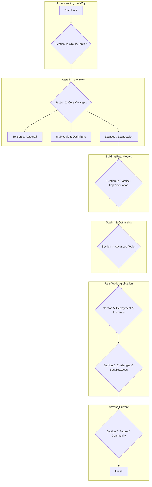

## Section 2: The Bedrock of PyTorch: Core Concepts Demystified

Mastery of LLMs requires a deep understanding of PyTorch's fundamental building blocks.

### 2.1 Tensors: The Language of Neural Networks

The `torch.Tensor` is the central data structure in PyTorch. It's a multi-dimensional array with two "superpowers": hardware acceleration (moving to a GPU with `.to('cuda')`) and the ability to track operations for automatic differentiation.

```python
import torch
import numpy as np

# --- Tensor Creation ---
# From a Python list
data = [[1, 2], [3, 4]]
x_data = torch.tensor(data)
print(f"Tensor from list:\n {x_data}\n")

# From a NumPy array (shares memory with the NumPy array!)
np_array = np.array(data)
x_np = torch.from_numpy(np_array)
print(f"Tensor from NumPy array:\n {x_np}\n")

# Modifying the NumPy array will change the tensor
np_array[0, 0] = 100
print(f"NumPy array modified, tensor also changes:\n {x_np}\n")

# Tensors with specific shapes and values
shape = (2, 3,)
rand_tensor = torch.rand(shape)
ones_tensor = torch.ones(shape)
zeros_tensor = torch.zeros(shape)
print(f"Random Tensor:\n {rand_tensor}\n")
print(f"Ones Tensor:\n {ones_tensor}\n")

# --- Tensor Operations ---
tensor = torch.ones(4, 4)
# Reshaping a tensor. The new shape must have the same number of elements.
# -1 infers the dimension from the others. 4x4=16, so this becomes 1x16.
tensor_reshaped = tensor.view(1, 16)
print(f"Original shape: {tensor.shape}")
print(f"Reshaped shape: {tensor_reshaped.shape}\n")

# Matrix multiplication
y1 = tensor @ tensor.T  # .T is a shortcut for transpose
y2 = torch.matmul(tensor, tensor.T)
print(f"Matrix multiplication result:\n {y1}\n")

# --- GPU Acceleration ---
# Move tensor to the GPU if available
if torch.cuda.is_available():
    print("CUDA is available, moving tensor to GPU.")
    tensor_gpu = ones_tensor.to('cuda')
    print(f"Tensor's device: {tensor_gpu.device}")
    # Operations on tensor_gpu will run on the GPU
    gpu_result = tensor_gpu + tensor_gpu
    # To bring it back to the CPU (e.g., for use with NumPy)
    cpu_result = gpu_result.to('cpu')
else:
    print("CUDA not available, all operations on CPU.")

```

### 2.2 Autograd: The Automatic Differentiation Engine

`autograd` is the engine that powers training. When a tensor's `requires_grad` attribute is `True`, PyTorch builds a graph of all operations involving it. Calling `.backward()` on the final output (usually the loss) calculates the gradients of all `requires_grad` tensors with respect to that output.

#### Feynman Explanation: Autograd as a Smart Accountant

1.  **Hiring the Accountant**: When you create a tensor and set `requires_grad=True`, you're telling PyTorch, "Hire an accountant for this number. I want you to track every single thing that happens to it."
2.  **Recording Transactions (The Forward Pass)**: As you perform calculations (`y = w*x + b`, `loss = ...`), the accountant watches every transaction. It doesn't just see the result; it makes a note of the *operation* used (`*`, `+`, `mean`). It builds a secret ledger (the computation graph) connecting all the transactions back to the original investments (`w` and `b`).
3.  **Asking "How did we get here?" (The Backward Pass)**: When you finally calculate your profit or loss and call `.backward()`, you're asking the accountant one question: "For every dollar I invested, how much did it contribute to my final profit/loss?" The accountant then works backward through the ledger, using calculus (the chain rule) to figure out the exact "contribution" of `w` and `b` to the final `loss`. This "contribution" is the gradient. It's the answer to "If I increase `w` by a tiny amount, how much will `loss` change?"

<!-- end list -->

```python
import torch

# --- Autograd in Action: A Simple Linear Regression Example ---
# We want to find w and b for the equation y = w*x + b

# 1. Define the model parameters we want to learn.
#    `requires_grad=True` tells PyTorch to track operations for gradient calculation.
w = torch.randn(1, requires_grad=True)
b = torch.randn(1, requires_grad=True)

# 2. Define the input data and true labels.
#    These are fixed and don't require gradients.
x_train = torch.tensor([1.0, 2.0, 3.0, 4.0])
y_train = torch.tensor([2.0, 4.0, 6.0, 8.0]) # True function is y = 2*x + 0

# 3. Forward pass: Calculate the model's predictions.
y_pred = w * x_train + b
print(f"Initial predictions: {y_pred}")

# 4. Calculate the loss (e.g., Mean Squared Error).
#    The loss is the value we want to minimize.
loss = torch.mean((y_pred - y_train)**2)
print(f"Initial loss: {loss.item()}") # .item() gets the Python number from a single-element tensor

# 5. Run backpropagation.
#    autograd calculates the gradients of the loss with respect to w and b.
loss.backward()

# 6. Inspect the computed gradients.
#    The gradients are stored in the .grad attribute of the tensors.
#    They tell us the direction to move w and b to reduce the loss.
print(f"Gradient for w: {w.grad.item()}")
print(f"Gradient for b: {b.grad.item()}")

# In a real training loop, an optimizer would now use these gradients
# to update w and b.
```

### 2.3 nn.Module: Encapsulating Complexity

`torch.nn.Module` is the base class for all neural network models. It provides a way to organize layers and parameters into reusable, hierarchical components.

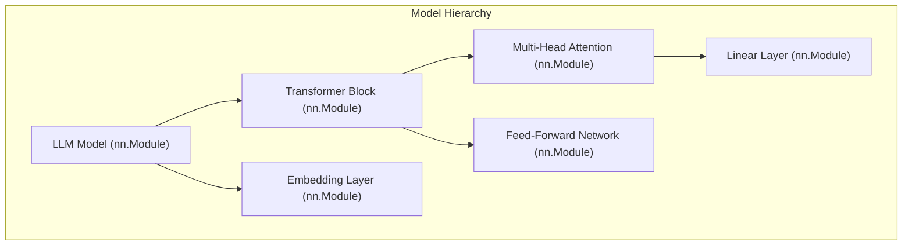

```python
import torch
from torch import nn

# All models are subclasses of nn.Module
class SimpleNeuralNetwork(nn.Module):
    def __init__(self, input_size, hidden_size, output_size):
        super().__init__() # Essential: initializes the parent class
        
        # Define layers as attributes. PyTorch will automatically
        # find all the learnable parameters (weights, biases) in these layers.
        self.layer_stack = nn.Sequential(
            nn.Linear(input_size, hidden_size),
            nn.ReLU(),
            nn.Linear(hidden_size, hidden_size),
            nn.ReLU(),
            nn.Linear(hidden_size, output_size)
        )

    # The forward method defines how input data flows through the layers.
    def forward(self, x):
        logits = self.layer_stack(x)
        return logits

# --- Using the Module ---
INPUT_FEATURES = 784  # e.g., a flattened 28x28 image
HIDDEN_UNITS = 512
OUTPUT_CLASSES = 10   # e.g., 10 digit classes

# Instantiate the model
model = SimpleNeuralNetwork(INPUT_FEATURES, HIDDEN_UNITS, OUTPUT_CLASSES)
print(f"Model architecture:\n{model}\n")

# Create a dummy input batch (e.g., 64 images)
dummy_input = torch.randn(64, INPUT_FEATURES)

# Pass the input through the model to get predictions
logits = model(dummy_input)

print(f"Shape of dummy input: {dummy_input.shape}")
print(f"Shape of model output (logits): {logits.shape}")

# You can easily inspect all parameters of the model
print(f"\nTotal parameters: {sum(p.numel() for p in model.parameters() if p.requires_grad)}")
```

### 2.4 optim: The Art of Optimization

The `torch.optim` package provides algorithms to update model parameters based on the computed gradients. The optimizer holds the current state of the parameters and updates them using the `.step()` method.

```python
import torch
from torch import nn

# Define a simple model for demonstration
class MyModel(nn.Module):
    def __init__(self):
        super().__init__()
        self.linear = nn.Linear(10, 1)
    def forward(self, x):
        return self.linear(x)

# 1. Model, Loss, and Optimizer setup
model = MyModel()
loss_fn = nn.MSELoss() # Mean Squared Error is common for regression
optimizer = torch.optim.SGD(model.parameters(), lr=0.01) # Stochastic Gradient Descent

# 2. Create dummy data
# Batch of 64 samples, each with 10 features
X_batch = torch.randn(64, 10)
# Corresponding batch of 64 labels
y_batch = torch.randn(64, 1)

print("--- Starting Training Loop ---\n")

# 3. The training loop
for epoch in range(5):
    # --- Step A: Forward pass ---
    predictions = model(X_batch)

    # --- Step B: Calculate loss ---
    loss = loss_fn(predictions, y_batch)

    # --- Step C: Backpropagation ---
    # 1. Clear gradients from the previous step.
    optimizer.zero_grad()
    # 2. Compute gradients for this step.
    loss.backward()

    # --- Step D: Update weights ---
    # 3. The optimizer updates the model's parameters.
    optimizer.step()

    print(f"Epoch {epoch+1}, Loss: {loss.item():.4f}")

print("\n--- Training Finished ---")
```

### 2.5 Dataset and DataLoader: The Data Pipeline

`Dataset` stores the samples and their corresponding labels, and `DataLoader` wraps an iterable around the `Dataset` to enable easy access to batches of data, handling shuffling, batching, and parallel loading.

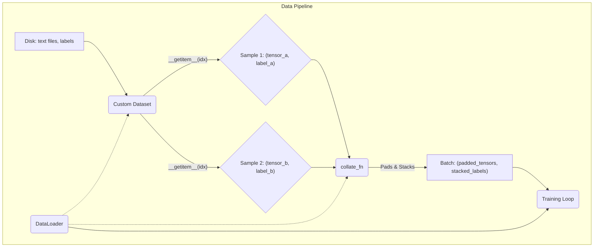

```python
import torch
from torch.utils.data import Dataset, DataLoader

# --- Creating a Custom Dataset ---

class CustomTextDataset(Dataset):
    """A simple dataset for text classification."""
    def __init__(self, texts, labels):
        self.texts = texts
        self.labels = labels
        # Build vocabulary from all texts
        all_words = ' '.join(texts).split()
        self.vocab = {word: i+1 for i, word in enumerate(sorted(list(set(all_words))))} # Reserve 0 for padding
        self.vocab['<PAD>'] = 0

    def __len__(self):
        return len(self.texts)

    def __getitem__(self, idx):
        text = self.texts[idx]
        label = self.labels[idx]
        tokenized_text = [self.vocab[word] for word in text.split()]
        return torch.tensor(tokenized_text), torch.tensor(label)

# Sample data
train_texts = ["hello world", "this is a test", "pytorch is great", "a simple example"]
train_labels = [0, 1, 0, 1]

text_dataset = CustomTextDataset(train_texts, train_labels)

# --- Using the DataLoader with a Collate Function ---

def collate_function(batch):
    """Custom logic to combine samples into a batch."""
    texts, labels = zip(*batch)
    # Pad all text sequences to the length of the longest one in the batch
    padded_texts = torch.nn.utils.rnn.pad_sequence(texts, batch_first=True, padding_value=text_dataset.vocab['<PAD>'])
    labels = torch.stack(labels, 0)
    return padded_texts, labels

data_loader = DataLoader(text_dataset, batch_size=2, shuffle=True, collate_fn=collate_function)

# Iterate through the DataLoader
print("--- Iterating through DataLoader ---")
for i, (texts_batch, labels_batch) in enumerate(data_loader):
    print(f"\nBatch {i+1}:")
    print(f"Texts batch shape: {texts_batch.shape}")
    print(f"Texts batch content:\n{texts_batch}")
    print(f"Labels batch shape: {labels_batch.shape}")
    print(f"Labels batch content:\n{labels_batch}")
```

### 2.6 Curious Questions on Core Concepts

**Q: Why do I have to call `optimizer.zero_grad()`? Why doesn't PyTorch do it automatically?**

**A:** This is a design choice that provides flexibility. In some advanced scenarios, like Recurrent Neural Networks (RNNs), you might want to accumulate gradients over several steps. By making gradient clearing an explicit step, PyTorch gives the developer full control, rather than enforcing a specific behavior. For most standard models, you'll always call it once per training step.

**Q: What's the real difference between a `torch.Tensor` and a `torch.nn.Parameter`?**

**A:** A `Parameter` is a special kind of `Tensor` that is automatically registered as a model parameter when assigned as an attribute to an `nn.Module`. This means two things:

1.  It automatically has `requires_grad=True`.
2.  It will be included in the list returned by `model.parameters()`, which is how the optimizer knows which tensors it needs to update.
    You can think of `Parameter` as a `Tensor` that signals, "I am a learnable weight or bias in this model."

**Q: `loss.backward()` seems like magic. How does it know which variables to compute gradients for?**

**A:** It's not magic, but the result of the dynamic computation graph (the "accountant's ledger"). When you create tensors with `requires_grad=True` (`w` and `b` in our example), every calculation that uses them to produce the final `loss` is recorded in that graph. The `loss` tensor holds the entire history of its computation. When you call `loss.backward()`, it simply traverses that graph backward from `loss` to all the leaf nodes (the source tensors) that had `requires_grad=True`, calculating the gradient at each step.

## Section 3: Practical Implementation: From First Neurons to Transformers

Now we apply the core concepts to build models of increasing complexity.

### 3.1 Foundational Workflow: A Simple Neural Network in PyTorch

This complete, runnable example establishes a standard training and evaluation workflow using the FashionMNIST dataset. This pattern is adaptable to almost any model.

```python
import torch
from torch import nn
from torch.utils.data import DataLoader
from torchvision import datasets
from torchvision.transforms import ToTensor

# --- 1. Data Loading ---
# Download training data from open datasets.
training_data = datasets.FashionMNIST(
    root="data",
    train=True,
    download=True,
    transform=ToTensor(),
)

# Download test data from open datasets.
test_data = datasets.FashionMNIST(
    root="data",
    train=False,
    download=True,
    transform=ToTensor(),
)

batch_size = 64
train_dataloader = DataLoader(training_data, batch_size=batch_size, shuffle=True)
test_dataloader = DataLoader(test_data, batch_size=batch_size)

# --- 2. Model Definition ---
# Get cpu or gpu device for training.
device = "cuda" if torch.cuda.is_available() else "cpu"
print(f"Using {device} device")

class NeuralNetwork(nn.Module):
    def __init__(self):
        super().__init__()
        self.flatten = nn.Flatten()
        self.linear_relu_stack = nn.Sequential(
            nn.Linear(28*28, 512),
            nn.ReLU(),
            nn.Linear(512, 512),
            nn.ReLU(),
            nn.Linear(512, 10)
        )

    def forward(self, x):
        x = self.flatten(x)
        logits = self.linear_relu_stack(x)
        return logits

model = NeuralNetwork().to(device)

# --- 3. Loss Function and Optimizer ---
loss_fn = nn.CrossEntropyLoss()
optimizer = torch.optim.Adam(model.parameters(), lr=1e-3)

# --- 4. Training Loop ---
def train(dataloader, model, loss_fn, optimizer):
    size = len(dataloader.dataset)
    # Set the model to training mode. This is important for layers like
    # Dropout and BatchNorm, which behave differently during training and evaluation.
    model.train()
    for batch, (X, y) in enumerate(dataloader):
        X, y = X.to(device), y.to(device) # Move data to the correct device

        # Compute prediction error
        pred = model(X)
        loss = loss_fn(pred, y)

        # Backpropagation
        optimizer.zero_grad()
        loss.backward()
        optimizer.step()

        if batch % 100 == 0:
            loss, current = loss.item(), batch * len(X)
            print(f"loss: {loss:>7f}  [{current:>5d}/{size:>5d}]")

# --- 5. Evaluation Loop ---
def test(dataloader, model, loss_fn):
    size = len(dataloader.dataset)
    num_batches = len(dataloader)
    # Set the model to evaluation mode.
    model.eval()
    test_loss, correct = 0, 0
    # Disable gradient calculation for inference, which saves memory and computation.
    with torch.no_grad():
        for X, y in dataloader:
            X, y = X.to(device), y.to(device)
            pred = model(X)
            test_loss += loss_fn(pred, y).item()
            correct += (pred.argmax(1) == y).type(torch.float).sum().item()
    test_loss /= num_batches
    correct /= size
    print(f"Test Error: \n Accuracy: {(100*correct):>0.1f}%, Avg loss: {test_loss:>8f} \n")

# --- Execute Training ---
epochs = 5
for t in range(epochs):
    print(f"Epoch {t+1}\n-------------------------------")
    train(train_dataloader, model, loss_fn, optimizer)
    test(test_dataloader, model, loss_fn)
print("Done!")
```

### 3.2 Stepping Stone to LLMs: Building an RNN/LSTM for Text Generation

LSTMs introduce sequential processing and autoregressive generation, key concepts for LLMs. This example builds a character-level LSTM to generate text.

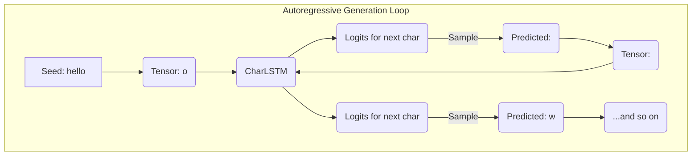

```python
import torch
import torch.nn as nn
import torch.nn.functional as F
import numpy as np

# --- 1. Data Preparation ---
text = "hello pytorch, this is a simple example of a character-level lstm for text generation. we will train it to predict the next character in a sequence."
chars = tuple(set(text))
int2char = dict(enumerate(chars))
char2int = {ch: ii for ii, ch in int2char.items()}
encoded = np.array([char2int[ch] for ch in text])

# --- 2. Model Architecture ---
class CharLSTM(nn.Module):
    def __init__(self, vocab_size, embedding_dim, hidden_dim, n_layers):
        super().__init__()
        self.hidden_dim = hidden_dim
        self.n_layers = n_layers
        self.embedding = nn.Embedding(vocab_size, embedding_dim)
        self.lstm = nn.LSTM(embedding_dim, hidden_dim, n_layers, batch_first=True)
        self.fc = nn.Linear(hidden_dim, vocab_size)

    def forward(self, x, hidden):
        embeds = self.embedding(x)
        lstm_out, hidden = self.lstm(embeds, hidden)
        # We only care about the output of the last sequence element
        out = self.fc(lstm_out[:, -1, :])
        return out, hidden

    def init_hidden(self, batch_size, device):
        weight = next(self.parameters()).data
        # Initialize hidden and cell states with zeros on the correct device
        hidden = (weight.new(self.n_layers, batch_size, self.hidden_dim).zero_().to(device),
                  weight.new(self.n_layers, batch_size, self.hidden_dim).zero_().to(device))
        return hidden

# Instantiate the model
device = "cuda" if torch.cuda.is_available() else "cpu"
model = CharLSTM(vocab_size=len(char2int), embedding_dim=128, hidden_dim=256, n_layers=2).to(device)

# --- 3. Generation Function (Autoregressive Sampling) ---
def generate(model, seed_prompt="hello", top_k=5, gen_length=100):
    model.eval()
    
    chars = [c for c in seed_prompt]
    hidden = model.init_hidden(1, device)
    
    # Convert seed prompt to tensor and move to device
    prompt_tensor = torch.tensor([[char2int[c] for c in seed_prompt]]).to(device)
    
    # Feed the seed prompt
    output, hidden = model(prompt_tensor, hidden)
    
    # The last output is the first predicted character
    probs = F.softmax(output, dim=1).data
    top_p, top_i = probs.topk(top_k)
    # Sample from the top-k distribution
    sampled_index = torch.multinomial(F.softmax(top_p, dim=-1), 1).item()
    last_char_idx = top_i[0][sampled_index].item()
    
    chars.append(int2char[last_char_idx])
    last_char_tensor = torch.tensor([[last_char_idx]]).to(device)

    # Generate the rest of the text autoregressively
    for _ in range(gen_length):
        output, hidden = model(last_char_tensor, hidden)
        
        probs = F.softmax(output, dim=1).data
        top_p, top_i = probs.topk(top_k)
        sampled_index = torch.multinomial(F.softmax(top_p, dim=-1), 1).item()
        char_idx = top_i[0][sampled_index].item()
        
        chars.append(int2char[char_idx])
        last_char_tensor = torch.tensor([[char_idx]]).to(device)
        
    return ''.join(chars)

# Note: The model is not trained, so the output will be random gibberish.
# A full training loop would be needed to produce coherent text.
print(f"Untrained model generation:\n{generate(model)}")
```

### 3.3 The Main Event: Implementing a Transformer from Scratch

Instead of a monolithic block, we'll implement the two most critical components: Scaled Dot-Product Attention and the Multi-Head Attention module that uses it.

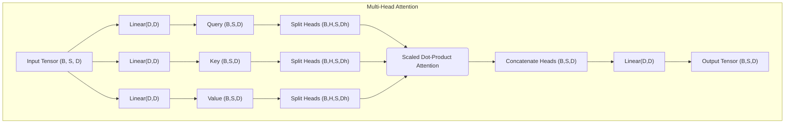

```python
import torch
import torch.nn as nn
import math

# --- Component 1: The Core Attention Calculation ---

def scaled_dot_product_attention(query, key, value, mask=None):
    """
    Computes scaled dot-product attention.
    """
    d_k = query.size(-1)
    scores = torch.matmul(query, key.transpose(-2, -1)) / math.sqrt(d_k)
    if mask is not None:
        scores = scores.masked_fill(mask == 0, -1e9)
    attn_weights = nn.functional.softmax(scores, dim=-1)
    output = torch.matmul(attn_weights, value)
    return output, attn_weights

# --- Component 2: The Multi-Head Attention Module ---

class MultiHeadAttention(nn.Module):
    def __init__(self, d_model, num_heads):
        super().__init__()
        assert d_model % num_heads == 0, "d_model must be divisible by num_heads"
        
        self.d_model = d_model
        self.num_heads = num_heads
        self.head_dim = d_model // num_heads
        
        self.wq = nn.Linear(d_model, d_model)
        self.wk = nn.Linear(d_model, d_model)
        self.wv = nn.Linear(d_model, d_model)
        self.wo = nn.Linear(d_model, d_model)
        
    def split_heads(self, x, batch_size):
        """Split the last dimension into (num_heads, head_dim)."""
        x = x.view(batch_size, -1, self.num_heads, self.head_dim)
        return x.transpose(1, 2)
    
    def forward(self, q, k, v, mask=None):
        batch_size = q.size(0)
        
        # 1. Project inputs and split into multiple heads
        Q = self.split_heads(self.wq(q), batch_size)
        K = self.split_heads(self.wk(k), batch_size)
        V = self.split_heads(self.wv(v), batch_size)
        
        # 2. Apply scaled dot-product attention
        attention_output, attn_weights = scaled_dot_product_attention(Q, K, V, mask)
        
        # 3. Concatenate heads and project through final linear layer
        attention_output = attention_output.transpose(1, 2).contiguous().view(batch_size, -1, self.d_model)
        output = self.wo(attention_output)
        
        return output, attn_weights

# --- Example Usage ---
d_model = 512
num_heads = 8
batch_size = 64
seq_len = 10

mha = MultiHeadAttention(d_model, num_heads)
dummy_q = torch.randn(batch_size, seq_len, d_model)
output, _ = mha(dummy_q, dummy_q, dummy_q) # In self-attention, q, k, v are the same

print(f"Input shape: {dummy_q.shape}")
print(f"Output shape: {output.shape}")
```

### 3.4 Deconstructing State-of-the-Art LLMs

Modern LLMs refine the original Transformer. Here are self-contained `nn.Module`s for their key components.

```python
import torch
import torch.nn as nn

# --- Component A: RMSNorm (replaces LayerNorm) ---
class RMSNorm(nn.Module):
    def __init__(self, dim: int, eps: float = 1e-6):
        super().__init__()
        self.eps = eps
        self.weight = nn.Parameter(torch.ones(dim))

    def _norm(self, x):
        return x * torch.rsqrt(x.pow(2).mean(-1, keepdim=True) + self.eps)

    def forward(self, x):
        return self.weight * self._norm(x.float()).type_as(x)

# --- Component B: SwiGLU Feed-Forward Network (replaces ReLU FFN) ---
class SwiGLUFFN(nn.Module):
    def __init__(self, dim, hidden_dim, multiple_of=256):
        super().__init__()
        hidden_dim = int(2 * hidden_dim / 3)
        hidden_dim = multiple_of * ((hidden_dim + multiple_of - 1) // multiple_of)
        
        self.w1 = nn.Linear(dim, hidden_dim, bias=False) # The 'gate' projection
        self.w2 = nn.Linear(hidden_dim, dim, bias=False) # The 'down' projection
        self.w3 = nn.Linear(dim, hidden_dim, bias=False) # The 'up' projection

    def forward(self, x):
        gate = self.w1(x)
        gate = nn.functional.silu(gate) # Swish activation
        up = self.w3(x)
        fused = gate * up
        return self.w2(fused)

# --- Example Usage ---
d_model = 512
ffn_hidden_dim = 2048

rms_norm = RMSNorm(dim=d_model)
dummy_input = torch.randn(1, 10, d_model)
normed_output = rms_norm(dummy_input)
print(f"RMSNorm Input Shape: {dummy_input.shape}")
print(f"RMSNorm Output Shape: {normed_output.shape}\n")

swiglu_ffn = SwiGLUFFN(dim=d_model, hidden_dim=ffn_hidden_dim)
ffn_output = swiglu_ffn(normed_output)
print(f"SwiGLU Input Shape: {normed_output.shape}")
print(f"SwiGLU Output Shape: {ffn_output.shape}")
```

### 3.5 Curious Questions on Practical Implementation

**Q: Why do Transformers need Positional Encodings when RNNs/LSTMs don't?**

**A:** Think of how each model processes a sentence. An LSTM reads a sentence one word at a time, in order. Its internal "memory" (hidden state) inherently knows that "king" came after "the" because it processed "the" in the previous step. The attention mechanism in a Transformer, however, looks at all the words in the sentence at once. To it, "the king sat" is just a "bag of words" with no inherent order. Positional Encodings are like adding a little tag to each word's embedding that says "I am word \#1," "I am word \#2," etc., giving the model the crucial context of word order.

**Q: What does `.contiguous()` do in the Multi-Head Attention code, and why is it needed?**

**A:** When you use `transpose()` in PyTorch, it doesn't physically reorder the data in memory; it just changes how the tensor is indexed. This can be efficient, but some operations (like `.view()`) require the data to be in a contiguous block of memory. Calling `.contiguous()` creates a new tensor with the data physically laid out in the new, transposed order, allowing `.view()` to work correctly. It's a necessary step to bridge the gap between the head-centric view (`transpose`) and the token-centric view (`view`).

**Q: What is the benefit of a "gated" activation like SwiGLU over a simple ReLU?**

**A:** A simple ReLU (`max(0, x)`) is a fixed, non-linear switch. A gated activation like SwiGLU is more dynamic. It calculates two separate things from the input: a value (`up` projection) and a "gate" (`gate` projection). The gate, after being passed through a sigmoid-like function (silu), acts as a filter, deciding *how much* of the value to let through for each element. This data-dependent filtering allows the network to control the flow of information much more effectively than a simple on/off switch, which has been shown to improve model performance.

## Section 4: Advanced Topics: Scaling and Optimizing LLMs

Training large models requires specialized techniques for distributing the workload and optimizing performance.

### 4.1 Training at Scale: Distributed Training Strategies

  * **DistributedDataParallel (DDP)**: Use when the model fits on a single GPU. It replicates the model across multiple GPUs to process more data in parallel.
  * **FullyShardedDataParallel (FSDP)**: Use when the model is too large for one GPU. It shards the model's parameters, gradients, and optimizer states across all GPUs.

<!-- end list -->

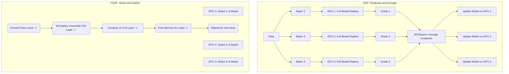

Here is a template showing how to set up a DDP script. Note that this code must be launched using `torchrun`.

```python
# DDP Template: save as ddp_template.py and run with:
# torchrun --nproc_per_node=NUM_GPUS ddp_template.py

import torch
import torch.nn as nn
from torch.utils.data import Dataset, DataLoader
from torch.utils.data.distributed import DistributedSampler
from torch.nn.parallel import DistributedDataParallel as DDP
import torch.distributed as dist
import os

def setup(rank, world_size):
    """Initializes the distributed process group."""
    os.environ['MASTER_ADDR'] = 'localhost'
    os.environ['MASTER_PORT'] = '12355'
    dist.init_process_group("nccl", rank=rank, world_size=world_size)

def cleanup():
    """Cleans up the distributed process group."""
    dist.destroy_process_group()

# Dummy Dataset for demonstration
class ToyDataset(Dataset):
    def __init__(self, size=1024):
        self.size = size
        self.data = torch.randn(size, 10)
        self.labels = torch.randn(size, 1)
    def __len__(self):
        return self.size
    def __getitem__(self, idx):
        return self.data[idx], self.labels[idx]

def main(rank, world_size):
    setup(rank, world_size)

    # 1. Create model and move it to the correct GPU
    model = nn.Linear(10, 1).to(rank)
    # 2. Wrap the model with DDP
    ddp_model = DDP(model, device_ids=[rank])

    loss_fn = nn.MSELoss()
    optimizer = torch.optim.SGD(ddp_model.parameters(), lr=0.01)

    # 3. Use DistributedSampler to ensure each process gets a unique slice of data
    dataset = ToyDataset()
    sampler = DistributedSampler(dataset, num_replicas=world_size, rank=rank)
    dataloader = DataLoader(dataset, batch_size=32, sampler=sampler)

    # Training loop
    for epoch in range(2):
        # The sampler needs the epoch to shuffle data correctly
        sampler.set_epoch(epoch)
        for data, labels in dataloader:
            data, labels = data.to(rank), labels.to(rank) # Move batch to GPU
            optimizer.zero_grad()
            outputs = ddp_model(data)
            loss = loss_fn(outputs, labels)
            loss.backward() # DDP handles averaging gradients across processes
            optimizer.step()
        print(f"Rank {rank}, Epoch {epoch}, Loss: {loss.item()}")
    
    cleanup()

if __name__ == "__main__":
    # This part is for demonstration. In a real script, `torchrun` would manage this.
    # world_size = torch.cuda.device_count()
    # rank = int(os.environ["LOCAL_RANK"])
    # main(rank, world_size)
    print("DDP template script. To run, use: torchrun --nproc_per_node=NUM_GPUS your_script_name.py")

```

### 4.2 Accelerating Performance: Speed and Memory Optimization

**torch.amp: Mixed-Precision Training**

Automatic Mixed Precision (AMP) uses a mix of full-precision (`float32`) and half-precision (`float16` or `bfloat16`) to speed up training and reduce memory.

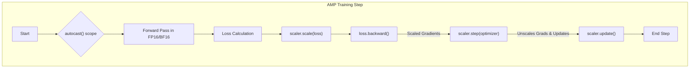

```python
import torch

# Dummy model and data
model = torch.nn.Sequential(torch.nn.Linear(128, 256), torch.nn.ReLU(), torch.nn.Linear(256, 10)).cuda()
optimizer = torch.optim.SGD(model.parameters(), lr=0.01)
loss_fn = torch.nn.CrossEntropyLoss()
dummy_input = torch.randn(64, 128, device="cuda")
dummy_labels = torch.randint(0, 10, (64,), device="cuda")

# 1. Initialize GradScaler.
scaler = torch.cuda.amp.GradScaler()

for epoch in range(2):
    # 2. Use the `autocast` context manager for the forward pass.
    with torch.cuda.amp.autocast():
        predictions = model(dummy_input)
        loss = loss_fn(predictions, dummy_labels)

    # 3. Scale the loss before calling backward().
    scaler.scale(loss).backward()

    # 4. scaler.step() unscales the gradients and calls optimizer.step().
    scaler.step(optimizer)

    # 5. Update the scale for the next iteration.
    scaler.update()

    optimizer.zero_grad()
    print(f"Epoch {epoch}, Loss: {loss.item()}")

```

**torch.compile: One-Line Speedup**

`torch.compile` is a just-in-time (JIT) compiler that can dramatically speed up your model with a single line of code by fusing operations into optimized kernels.

```python
import torch
import torch.nn as nn
import time

class MyModel(nn.Module):
    def __init__(self):
        super().__init__()
        self.linear1 = nn.Linear(1024, 1024)
        self.relu = nn.ReLU()
        self.linear2 = nn.Linear(1024, 1024)

    def forward(self, x):
        x = self.relu(self.linear1(x))
        x = self.relu(self.linear2(x))
        return x

# Create two instances: one standard, one compiled
model_eager = MyModel().cuda()
# The only change needed to enable compilation!
model_compiled = torch.compile(MyModel()).cuda()

dummy_input = torch.randn(2048, 1024, device="cuda")

# --- Time the Eager (standard) model ---
# Warmup runs
for _ in range(10):
    _ = model_eager(dummy_input)
torch.cuda.synchronize()

start_time = time.time()
for _ in range(100):
    _ = model_eager(dummy_input)
torch.cuda.synchronize()
eager_time = time.time() - start_time
print(f"Eager model time: {eager_time:.4f} seconds")


# --- Time the Compiled model ---
# Warmup runs (compilation happens on the first few calls)
for _ in range(10):
    _ = model_compiled(dummy_input)
torch.cuda.synchronize()

start_time = time.time()
for _ in range(100):
    _ = model_compiled(dummy_input)
torch.cuda.synchronize()
compiled_time = time.time() - start_time
print(f"Compiled model time: {compiled_time:.4f} seconds")

print(f"\nSpeedup: {eager_time / compiled_time:.2f}x")
```

### 4.3 Curious Questions on Scaling and Optimization

**Q: If FSDP is so great for memory, why would anyone ever use DDP?**

**A:** The primary reason is **communication overhead**. DDP's communication is simpler: after the backward pass, it performs one big "all-reduce" operation to average the gradients. FSDP, on the other hand, communicates constantly throughout the forward and backward passes, performing "all-gather" operations to assemble layers and "reduce-scatter" operations to shard them again. If your model already fits comfortably on a single GPU, the extra communication in FSDP can make it slower than DDP. The rule of thumb is: use DDP until you run out of memory, then switch to FSDP.

**Q: What's the difference between `float16` and `bfloat16`, and when should I use each?**

**A:** Both use 16 bits of memory, but they allocate those bits differently.

  * **`float16` (FP16)**: Has more bits for precision (the mantissa) and fewer for the exponent. This means it can represent numbers very precisely within a small range, but it's prone to "underflow" (small gradients becoming zero) or "overflow" (large values becoming infinity). This is why it *needs* the `GradScaler`.
  * **`bfloat16` (BF16)**: Has the same number of exponent bits as `float32`, giving it a huge dynamic range, but fewer precision bits. It's much more stable and less likely to overflow or underflow, often not even requiring a `GradScaler`.
    **Conclusion:** If your GPU supports it (NVIDIA A100/H100 and newer), **always prefer `bfloat16`** for training LLMs due to its stability.

**Q: If `torch.compile` is so fast, are there any downsides or reasons not to use it?**

**A:** There are a few trade-offs. First, there's a **compilation overhead**. The first few times you run the model, it will be slower as `torch.compile` analyzes and compiles the code. This is usually negligible for long training runs but can be noticeable for very short tasks. Second, while it has gotten incredibly robust, it's still a complex system, and you might encounter rare edge cases or bugs where it can't compile a specific operation, though it will gracefully "fall back" to the standard eager execution in such cases. The best practice is to get your model working correctly in eager mode first, then add `torch.compile` as a final optimization step.

## Section 5: From Training to Deployment: Optimizing for Inference

A trained model is not ready for production. **Inference** prioritizes low latency and high throughput, requiring different optimizations.

### 5.1 The Inference Bottleneck: Understanding the KV Cache

During autoregressive generation, the Key (K) and Value (V) vectors for every token in the context must be stored in a **KV Cache**. For long sequences, this cache becomes enormous and the speed of reading from it (memory bandwidth) becomes the primary bottleneck.

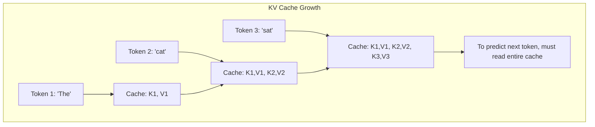

### 5.2 The Throughput Problem: Naive Batching vs. Continuous Batching

  * **Naive (Static) Batching**: Groups requests, pads them to the same length, and waits for the entire batch to finish. This leads to wasted computation and low GPU utilization.
  * **Pattern: Continuous Batching**: Modern inference servers use a continuous queue. When one sequence in a batch finishes, it's immediately replaced by a new one. This is enabled by algorithms like **PagedAttention**, which manage the KV cache in non-contiguous memory blocks, eliminating fragmentation and maximizing GPU usage.

### 5.3 Other Key Inference Optimizations

  * **Model Distillation**: Training a smaller "student" model to mimic a larger "teacher" model, resulting in a faster, smaller model for deployment.
  * **Speculative Decoding**: Using a small "draft" model to quickly generate token chunks, which are then verified in a single pass by the large model, significantly speeding up generation.

<!-- end list -->

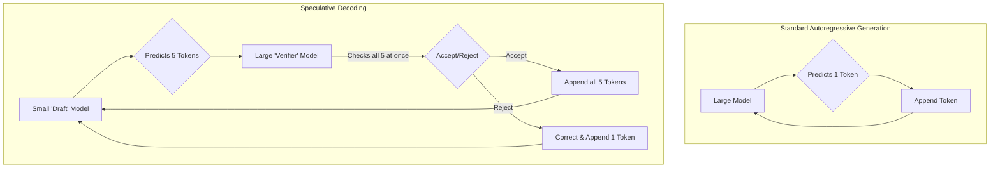

### 5.4 Curious Questions on Inference

**Q: Why can't we just make the KV cache smaller to save memory?**

**A:** The KV cache holds the model's "short-term memory" of the current conversation or document. Each key-value pair corresponds to a token the model has already seen. If you made the cache smaller, you would be throwing away the beginning of the context. For example, in a long conversation, the model might forget the user's original question, leading to incoherent responses. The size of the KV cache is directly tied to the model's context length.

**Q: Is model distillation the same as quantization? They both make the model smaller.**

**A:** They are different techniques that can even be used together.

  * **Quantization** takes an *existing* model and reduces the numerical precision of its weights (e.g., from 32-bit floats to 8-bit integers). You end up with the same number of parameters, but each one takes up less space. It's like rewriting a book using a simpler alphabet.
  * **Distillation** trains a *brand new*, smaller model from scratch. The goal of this new student model is to learn to replicate the outputs of the larger teacher model. You end up with a model that has far fewer parameters. It's like writing a short summary of a long book.

## Section 6: In the Trenches: Challenges and Best Practices

Training LLMs is fraught with challenges related to memory, stability, and debugging.

### 6.1 The Memory Wall: Common Memory Management Pitfalls

The most common obstacle is the "Out of Memory" (OOM) error.

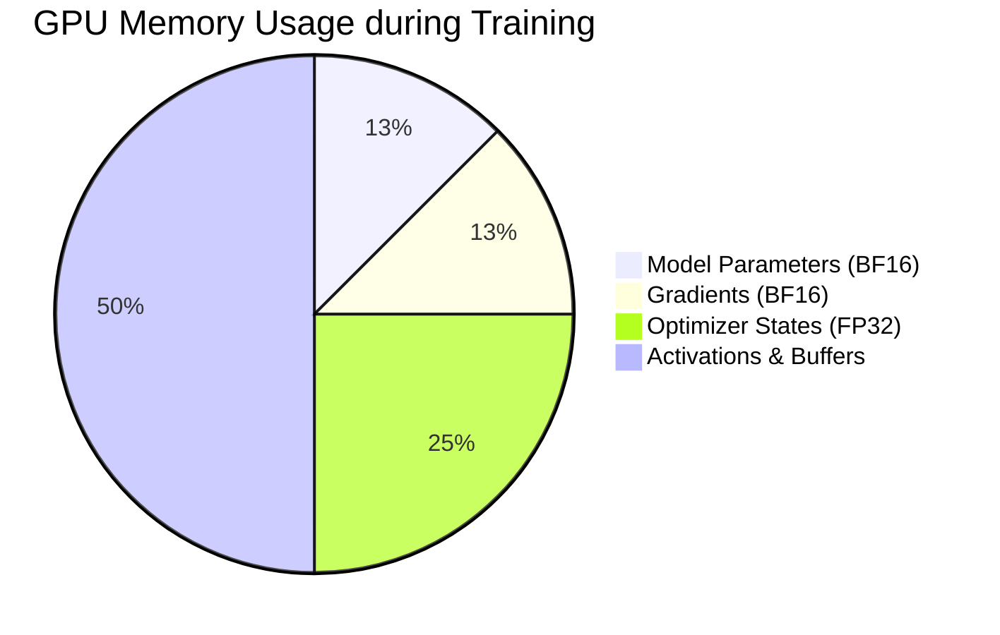

-----

#### **Heuristic: The 12-Byte Rule for Mixed-Precision Training**

Use this rule of thumb to estimate the fixed memory cost for a model trained with an Adam-style optimizer in mixed precision:

| Component       | Size per Parameter |
| :-------------- | :----------------- |
| Model Parameter | 2 bytes            |
| Gradient        | 2 bytes            |
| Optimizer State | 8 bytes            |
| **Total (Fixed)** | **12 bytes** |

For a 7-billion-parameter model, the cost is approximately: $7 \\times 10^9 \\text{ parameters} \\times 12 \\text{ bytes/parameter} \\approx 84 \\text{ GB}$. This calculation reveals why such a model cannot be fully fine-tuned on a single 80GB GPU and necessitates techniques like FSDP or QLoRA.

-----

### 6.2 The Stability Tightrope: Ensuring Robust Training

  * **Use `bfloat16` for Mixed Precision**: If your hardware supports it, `bfloat16` has a wider numerical range than `float16`, making it much more stable.
  * **Gradient Clipping**: This is a **non-negotiable** best practice. It prevents exploding gradients from corrupting the model weights by scaling them down if their norm exceeds a threshold. Use `torch.nn.utils.clip_grad_norm_`.
  * **Learning Rate Warmup and Decay**: Start with a low learning rate, gradually "warm it up," and then decay it over the training run. This prevents divergence early in training.

### 6.3 The Debugging Gauntlet: A Systematic Approach

**The Golden Rule of Debugging**: Before launching a large-scale job, always **overfit a single batch**. If your model cannot learn a single batch of data until the loss is near zero, there is a fundamental bug in your architecture, data processing, or loss function.

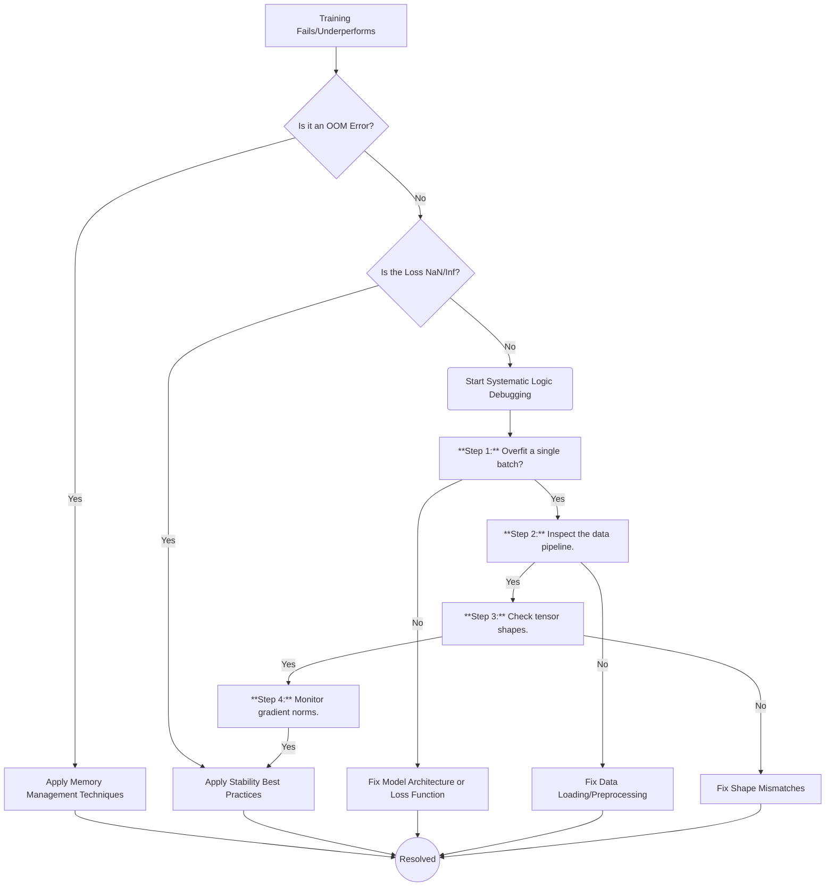

### 6.4 Curious Questions on Challenges

**Q: What exactly is a "NaN" loss and why does it break everything?**

**A:** NaN stands for "Not a Number." It's the result of an undefined mathematical operation, like dividing by zero or taking the square root of a negative number. In deep learning, this often happens during mixed-precision training if a calculation results in infinity (`inf`), and then a subsequent operation like `inf - inf` or `inf / inf` occurs. Once a NaN appears in your model's weights or gradients, it's like a virus. Any future calculation involving that NaN will also result in a NaN, and within one or two steps, your entire model's weights can become corrupted, halting the learning process completely.

**Q: Why is a large learning rate bad? Won't it help me learn faster?**

**A:** Imagine you're standing on a hill in a thick fog and want to get to the lowest point in the valley. The gradient tells you the direction of the steepest descent. The learning rate is the size of the step you take in that direction. A small learning rate is like taking tiny, careful steps. It's slow, but you'll eventually find the bottom. A very large learning rate is like taking a giant leap in the downhill direction. You might completely jump over the valley and land on another hill that's even higher than where you started. This causes your loss to increase (diverge) instead of decrease.

## Section 7: The Horizon: Future Directions and Continuous Learning

Mastery is not a destination but a continuous process of learning.

### 7.1 The PyTorch Roadmap: What's Next?

  * **Performance Through Compilation**: `torch.compile` is the centerpiece of PyTorch's performance strategy, aiming to make manual optimization a thing of the past.
  * **Advanced Distributed Training**: The goal is **composable parallelism**, allowing practitioners to easily combine FSDP, Tensor Parallelism, and Pipeline Parallelism to perfectly match training jobs to hardware.
  * **Deeper Hardware Integration**: PyTorch will continue to deepen its support for new GPUs and custom AI chips.

### 7.2 Emerging Trends in LLM Training

  * **The Push for Lower Precision**: Research is actively exploring robust training methods for even lower-precision formats like **FP8**.
  * **Democratization of Fine-Tuning**: Techniques like QLoRA and other Parameter-Efficient Fine-Tuning (PEFT) methods are making it possible for more people to adapt powerful models for specific tasks.

### 7.3 Your Lifelong Learning Toolkit

Staying current requires leveraging the rich resources of the PyTorch ecosystem.

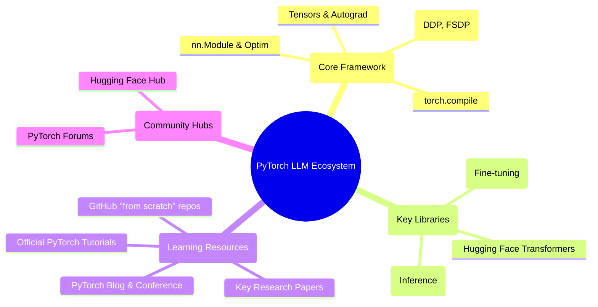