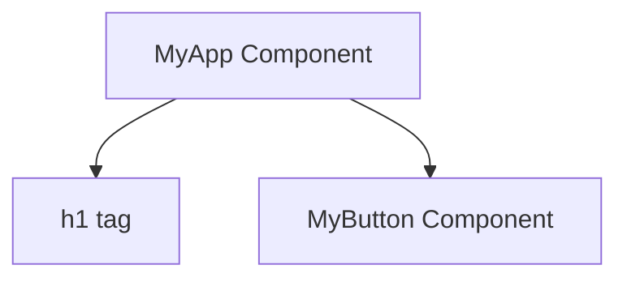
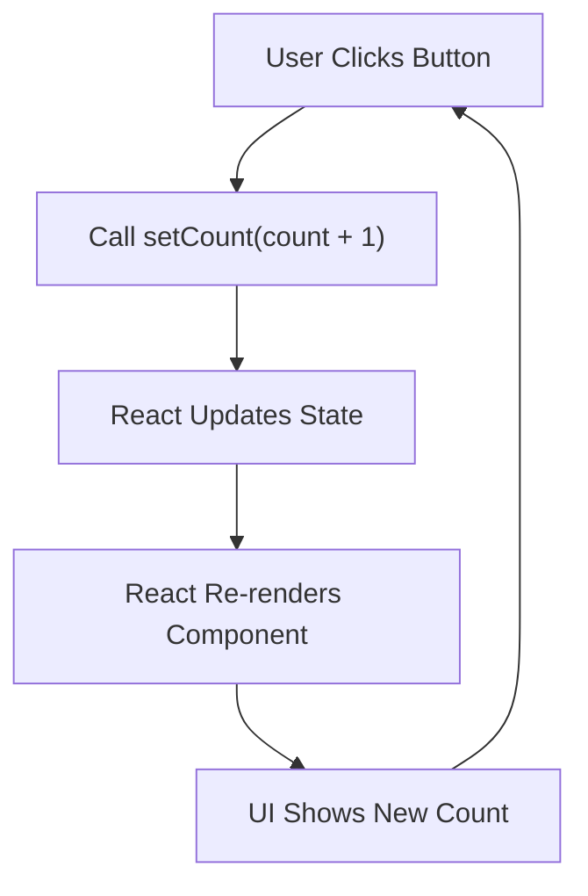
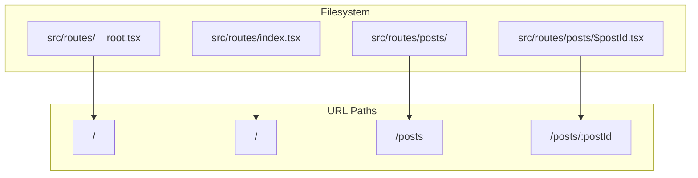
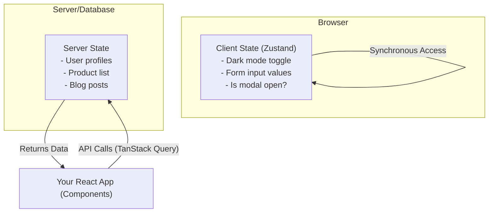
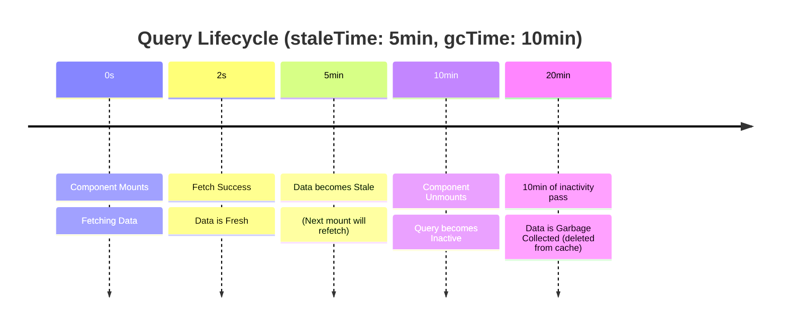
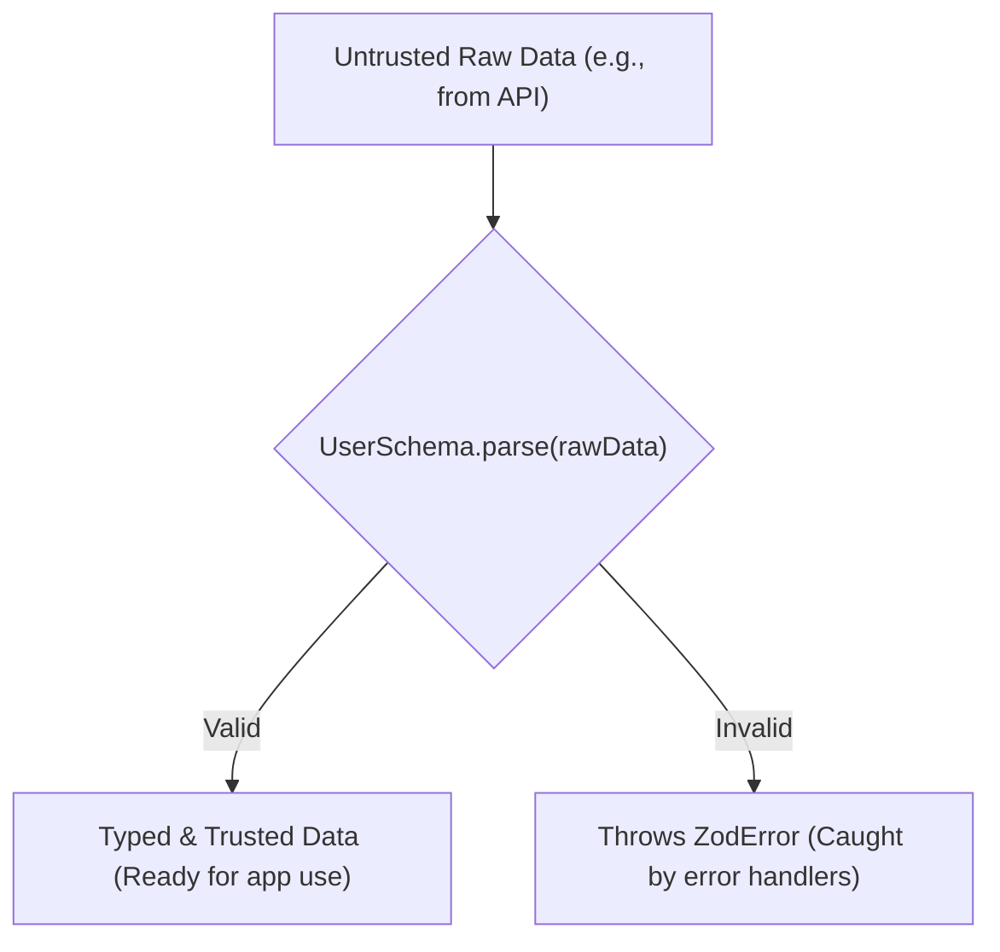
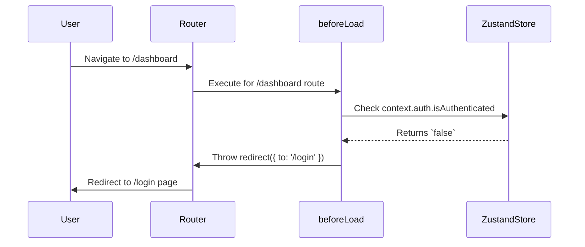
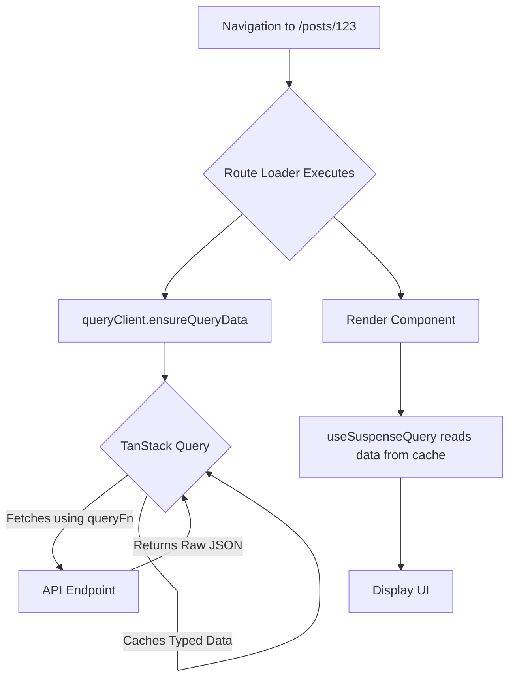
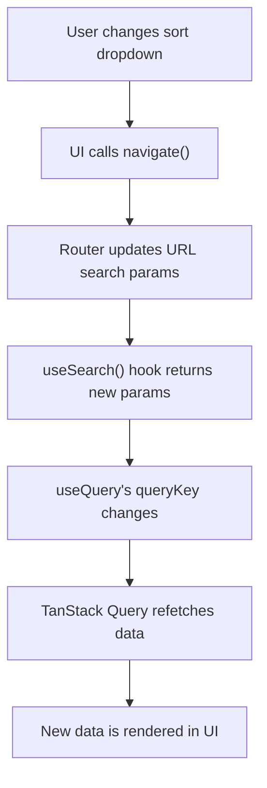
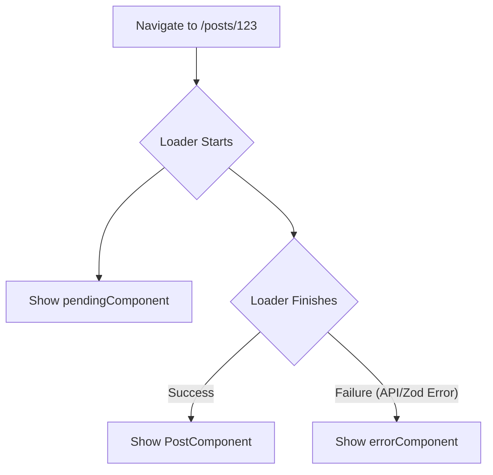

# The Modern React Stack: A Feynman Guide from First Principles to Production

## Table of Contents

  - [Introduction: The Philosophy of a Modern, Unopinionated Stack](#introduction-the-philosophy-of-a-modern-unopinionated-stack)
      - [The Feynman Premise](#the-feynman-premise)
      - [The Unbundling Philosophy](#the-unbundling-philosophy)
  - [Part I: The First Principle - Deconstructing React](#part-i-the-first-principle---deconstructing-react)
      - [Chapter 1: The Building Blocks - Components as LEGOs](#chapter-1-the-building-blocks---components-as-legos)
      - [Chapter 2: Communication - Props as Instructions](#chapter-2-communication---props-as-instructions)
      - [Chapter 3: Memory - State and Hooks as Superpowers](#chapter-3-memory---state-and-hooks-as-superpowers)
          - [The `useState` Hook: A Personal Whiteboard](#the-usestate-hook-a-personal-whiteboard)
          - [The `useEffect` Hook: "After \_\_\_\_, do \_\_\_\_"](#the-useeffect-hook-after-____-do-____)
  - [Part II: Mapping the Application - A Deep Dive into TanStack Router](#part-ii-mapping-the-application---a-deep-dive-into-tanstack-router)
      - [Chapter 4: Why TanStack Router? Simplicity and Power](#chapter-4-why-tanstack-router-simplicity-and-power)
      - [Chapter 5: File-Based Routing - The Filesystem as Your Map](#chapter-5-file-based-routing---the-filesystem-as-your-map)
          - [The Magic Behind the Scenes: The Route Tree](#the-magic-behind-the-scenes-the-route-tree)
          - [The Core Files](#the-core-files)
          - [File-Based Routing Use Cases](#file-based-routing-use-cases)
      - [Chapter 6: Navigating the Map](#chapter-6-navigating-the-map)
          - [Declarative Navigation with `<Link>`](#declarative-navigation-with-link)
          - [Programmatic Navigation with `useNavigate`](#programmatic-navigation-with-usenavigate)
  - [Part III: The Two Brains of Your App - Mastering State Management](#part-iii-the-two-brains-of-your-app---mastering-state-management)
      - [Chapter 7: The Great Divide - Server State vs. Client State](#chapter-7-the-great-divide---server-state-vs-client-state)
      - [Chapter 8: The Server Brain - Fetching and Caching with TanStack Query](#chapter-8-the-server-brain---fetching-and-caching-with-tanstack-query)
          - [The `useQuery` Hook](#the-usequery-hook)
          - [Caching Explained Simply](#caching-explained-simply)
      - [Chapter 9: The Client Brain - Simple, Global State with Zustand](#chapter-9-the-client-brain---simple-global-state-with-zustand)
          - [The `create` Hook: One Function to Rule Them All](#the-create-hook-one-function-to-rule-them-all)
          - [Key Advantages of Zustand](#key-advantages-of-zustand)
  - [Part IV: The Source of Truth - End-to-End Type Safety with Zod](#part-iv-the-source-of-truth---end-to-end-type-safety-with-zod)
      - [Chapter 10: The Contract - Defining Data Blueprints with Schemas](#chapter-10-the-contract---defining-data-blueprints-with-schemas)
      - [Chapter 11: Validating the World - Parsing External Data](#chapter-11-validating-the-world---parsing-external-data)
          - [The Single Source of Truth: `z.infer`](#the-single-source-of-truth-zinfer)
  - [Part V: The Production Stack in Action - Integrated Use Cases](#part-v-the-production-stack-in-action---integrated-use-cases)
      - [Chapter 12: The Protected Fortress - Authentication and Guarded Routes](#chapter-12-the-protected-fortress---authentication-and-guarded-routes)
          - [The Architecture](#the-architecture)
          - [Example Implementation](#example-implementation)
      - [Chapter 13: The Data Pipeline - Type-Safe Data Loading and Validation](#chapter-13-the-data-pipeline---type-safe-data-loading-and-validation)
          - [The Architecture](#the-architecture-1)
          - [Example Implementation](#example-implementation-1)
      - [Chapter 14: The Stateful URL - Search, Sort, and Filter](#chapter-14-the-stateful-url---search-sort-and-filter)
          - [The Architecture](#the-architecture-2)
          - [Example Implementation](#example-implementation-2)
      - [Chapter 15: The Resilient UI - Handling Errors and Loading States Gracefully](#chapter-15-the-resilient-ui---handling-errors-and-loading-states-gracefully)
          - [Simple Explanation → Identify Gaps](#simple-explanation--identify-gaps)
          - [Explore and Fill Gaps → Refine and Teach Back](#explore-and-fill-gaps--refine-and-teach-back)
  - [Conclusion: The Unopinionated Advantage](#conclusion-the-unopinionated-advantage)

## Introduction: The Philosophy of a Modern, Unopinionated Stack

### The Feynman Premise

The celebrated physicist Richard Feynman, known for his ability to distill profound concepts into simple, intuitive ideas, operated on a powerful principle: "If you can't explain it simply, you don't understand it well enough". This guide is constructed upon that very foundation. It is not a mere collection of API references or code snippets to be transcribed. Instead, it is an active process of learning, designed to build a deep, foundational understanding of a modern, high-performance React stack. The journey from fundamentals to production readiness requires more than memorization; it demands that we deconstruct complex systems into their first principles, identify the gaps in our knowledge, and then rebuild that knowledge on a solid, intuitive base. Each concept will be introduced first through analogy and simple explanation, ensuring that the *why* is understood before the *how* is implemented.

### The Unbundling Philosophy

The modern web development landscape is populated by powerful, monolithic frameworks that offer an "all-in-one" solution. They provide convention, structure, and a rapid path to getting started. However, this convenience often comes at the cost of control, flexibility, and sometimes, performance. The user query for this report explicitly rejects "bloated" frameworks, signaling a desire for a more deliberate, architectural approach.

This guide champions that philosophy. The chosen stack-React, TanStack Router, TanStack Query, Zustand, and Zod-represents a conscious decision to unbundle the framework. Instead of adopting a single, opinionated system, this approach involves composing a suite of specialized, best-in-class libraries. Each tool is selected for its excellence in a specific domain: UI rendering, routing, server-state management, client-state management, and data validation.

This architectural choice places the developer in the role of the architect, not just the builder. It is a trade-off that exchanges the prescribed path of a framework for the ultimate control over an application's structure, performance, and data flow. This path carries the responsibility of understanding how each piece of the puzzle fits together. This guide serves as the blueprint for that architecture, providing the knowledge necessary to assemble these components into a cohesive, robust, and production-grade application. The separation of concerns is paramount; for instance, TanStack Query is purpose-built to manage the complexities of server state, while Zustand offers a minimalist solution for client state-a nuanced distinction that is a cornerstone of this modern stack.

## Part I: The First Principle - Deconstructing React

Before assembling our advanced stack, we must first deconstruct our foundation: React itself. By applying the Feynman method, we can solidify our mental models for React's core concepts, ensuring we understand the simple truths upon which all complexity is built.

### Chapter 1: The Building Blocks - Components as LEGOs

The most fundamental idea in React is the **component**. Imagine building a complex model with LEGOs. You don't start with a single, massive block; you start with small, individual bricks. A React application is built in the same way, out of components. A component is a self-contained, reusable piece of the user interface (UI) that has its own appearance and logic. It can be as small as a button or as large as an entire page.

React components are, at their core, JavaScript functions that return a description of the UI. This description is written using a syntax called JSX (JavaScript XML).



```javascript
// A simple component, like a single LEGO brick
// It's a JavaScript function that returns UI description.
function MyButton() {
  return (
    <button>I'm a button</button>
  );
}
```

The power of this model lies in **composition**. Just as LEGO bricks snap together, components can be nested inside one another to build more complex UIs.

```javascript
// Nesting the MyButton component inside another component
export default function MyApp() {
  return (
    <div>
      <h1>Welcome to my app</h1>
      {/* Here we are composing our UI by including MyButton */}
      <MyButton />
    </div>
  );
}
```

Here, `MyApp` is a parent component that renders a heading and our `MyButton` child component. This simple act of nesting is the basis for every React application, from the simplest to the most complex.

It is important to understand that JSX is not a separate language that runs in the browser. It is a "syntax extension" for JavaScript that provides a convenient, HTML-like way to define the structure of components. During the build process, tools like Babel transpile this JSX into standard JavaScript `React.createElement()` calls. This abstraction allows developers to think in terms of UI structure rather than imperative function calls. JSX is stricter than HTML; for example, all tags must be closed, so a line break is written as `<br />`.

### Chapter 2: Communication - Props as Instructions

If components are LEGO bricks, how do we customize them? How do we make one button blue and another red? This is achieved through **props** (short for properties).

The best analogy for props is ordering at a restaurant. The parent component is the customer, and the child component is the chef. The customer gives the chef a specific order: "I want a large pizza with pepperoni and extra cheese." This order is the **props**. The chef receives these instructions and makes the pizza exactly as requested. Crucially, the chef cannot change the customer's order; they can only read it and fulfill it. This illustrates the two most important rules of props:

1.  **Data flows down:** Props are passed from parent components to child components.
2.  **Props are read-only:** A child component can never modify the props it receives.

This principle is known as **unidirectional data flow**, and it is a cornerstone of React's design. It makes applications more predictable and easier to debug because the source of data is always clear: it comes from the parent.

Let's make our `MyButton` component reusable by giving it instructions via props.

```javascript
// The parent component, App, passes a 'label' prop to each Button.
function App() {
  return (
    <div>
      {/* Instance 1: The 'order' is for a "Submit" button */}
      <Button label="Submit" />
      {/* Instance 2: The 'order' is for a "Cancel" button */}
      <Button label="Cancel" />
    </div>
  );
}

// The child component, Button, receives the 'label' prop.
// We use object destructuring { label } to access it directly.
function Button({ label }) {
  return (
    <button>{label}</button>
  );
}
```

In this example, we have a single `Button` component "blueprint." The `App` component renders two instances of it, each configured with a different `label` prop. We have created a reusable component and customized it through its props, just like a chef making two different pizzas from the same menu based on two different orders.

### Chapter 3: Memory - State and Hooks as Superpowers

Props allow components to receive information from their parents, but what if a component needs to remember information that changes over time? For example, how many times has a user clicked a button? This internal memory is called **state**. To give components this memory, React provides special functions called **Hooks**. Hooks are functions that let you "hook into" React features from your functional components. They always start with the word `use`.

#### The `useState` Hook: A Personal Whiteboard

The most fundamental hook is `useState`. The analogy for `useState` is a personal whiteboard that each component gets.

1.  The component can write an initial value on the board.
2.  It can read what's currently on the board.
3.  It gets a special magic marker that is the only way to update the board.

When the component uses its magic marker to change what's on the whiteboard, React sees that the component's memory has changed and automatically **re-renders** the component to display the new information. This cycle-state change causing a re-render-is the fundamental mechanism of interactivity in React.



Let's build a simple counter. First, we import `useState` from React.

```javascript
import { useState } from 'react';

function Counter() {
  // 1. Call useState to get the state variable and the setter function.
  // We pass 0 as the initial value for our state.
  // `count` is the value, `setCount` is the "magic marker".
  const [count, setCount] = useState(0);

  function handleClick() {
    // 2. Use the setter function to update the state.
    setCount(count + 1);
  }

  return (
    // When clicked, the handleClick function is called.
    <button onClick={handleClick}>
      Clicked {count} times
    </button>
  );
}
```

Here's what happens:

1.  `useState(0)` is called. It returns an array with two things: the current state value (`count`, which is 0 initially) and the function to update it (`setCount`).
2.  When the button is clicked, `handleClick` is called, which in turn calls `setCount(count + 1)`.
3.  React updates the `count` state variable.
4.  Because the state has changed, React re-runs the `Counter` function.
5.  This time, when the function runs, `useState(0)` knows the current value is now 1, so `count` is 1.
6.  The component renders the new output: `<button>Clicked 1 times</button>`.

Each component instance gets its own independent state. If you render `<Counter />` twice, each will have its own count and they won't interfere with each other.

#### The `useEffect` Hook: "After \_\_\_\_, do \_\_\_\_"

What if a component needs to interact with the world outside of the React component tree? This could be fetching data from an API, manually changing the DOM (like setting the document title), or setting up a timer. These operations are called **side effects**. The `useEffect` hook provides a way to handle them. The analogy is simple: it lets you say, "**After** the component renders, **do** this specific action".

Let's expand our counter to update the browser tab's title with the current count.

```javascript
import { useState, useEffect } from 'react';

function TitleCounter() {
  const [count, setCount] = useState(0);

  // The useEffect hook
  useEffect(() => {
    // This is the side effect: interacting with the browser DOM.
    // This function will run AFTER the component renders.
    document.title = `You clicked ${count} times`;
  }, [count]); // <-- The dependency array

  function handleClick() {
    setCount(count + 1);
  }

  return (
    <button onClick={handleClick}>
      Clicked {count} times
    </button>
  );
}
```

The second argument to `useEffect`, `[count]`, is the **dependency array**. This is a critical part of the hook that tells React *when* to re-run the effect.

| Dependency Array | When the Effect Runs                                                                 | Use Case                       |
| ---------------- | ------------------------------------------------------------------------------------ | ------------------------------ |
| `[count]`        | After the initial render, and after any render where `count` has changed.        | Syncing with a specific state. |
| `[]`             | **Only once**, after the component first mounts.                                | Initial data fetching.         |
| Omitted          | After **every single render**.                                                  | Rarely needed, can cause bugs. |

Mastering `useState` and `useEffect` provides the foundational knowledge required to build interactive and dynamic React applications.

## Part II: Mapping the Application - A Deep Dive into TanStack Router

With a solid understanding of React's first principles, we can now architect the structure of our application. Routing is the map that guides users through the different views and functionalities. For this, we turn to TanStack Router, a modern, lightweight, and powerfully type-safe library designed for the architectural philosophy of this guide.

### Chapter 4: Why TanStack Router? Simplicity and Power

The choice of TanStack Router is a direct answer to the user's request for a simple, non-bloated solution. Unlike some traditional routers, TanStack Router is engineered from the ground up with several key principles that make it an exceptional choice for a production application:

  * **100% Type Safety:** Every aspect of the router, from the paths you link to, the parameters in the URL, and the data loaded for a route, is fully type-safe. This is not an afterthought; it is a core design feature that eliminates a vast class of common runtime errors.
  * **Built-in Caching and Data Loading:** The router includes a sophisticated, stale-while-revalidate caching mechanism and a powerful `loader` API. This allows data to be fetched in parallel with navigation, often before a component even renders, leading to significantly better performance and user experience.
  * **First-Class Search Parameter APIs:** This is a paradigm-shifting feature. TanStack Router treats URL search parameters not as simple strings, but as a first-class state management solution. They can be parsed, serialized, and validated with schemas, effectively turning the URL into a reliable, shareable state container.

This last point is crucial. A core concept to grasp is that **Search Params Are State**. The router is not just a tool for rendering different components based on the URL; it is a state manager in its own right, with the URL as its store. This architectural perspective simplifies many complex UI states, like filtering and sorting data tables, by making the URL the single source of truth.

### Chapter 5: File-Based Routing - The Filesystem as Your Map

The most intuitive and recommended way to define the structure of an application with TanStack Router is through **file-based routing**. The concept is profoundly simple: the organization of your files and folders within the `src/routes` directory directly mirrors the URL structure of your application. This approach offers numerous advantages:

  * **Organization:** Routes are structured in a way that is visually intuitive and easy for any developer to understand.
  * **Scalability:** As the application grows, adding new routes is as simple as adding a new file.
  * **Code-Splitting:** This structure allows TanStack Router to automatically code-split your application at the route level, meaning users only download the JavaScript they need for the page they are visiting, improving initial load times.




#### The Magic Behind the Scenes: The Route Tree

While developers work with a simple file structure, TanStack Router uses a build-time tool-either a plugin for a bundler like Vite or a standalone CLI-to do something clever. This tool "watches" the `src/routes` directory and automatically generates a file, typically `src/routeTree.gen.ts`. This generated file is the machine-readable, highly optimized, and fully type-safe representation of the human-readable file structure. It contains all the route definitions, their relationships, and their types. A developer should almost never edit this file manually; it is an artifact of the build process that powers the router's type safety and performance.

#### The Core Files

A minimal file-based routing setup consists of a few key files:

  * `src/routes/__root.tsx`: The entry point for the entire application map. The double underscore `__` signifies that this is the root route. It is always active and its component is always rendered, making it the perfect place for global layouts, navigation bars, footers, and context providers. The `<Outlet />` component from `@tanstack/react-router` must be included here to specify where child routes should be rendered.

    ```typescript
    // src/routes/__root.tsx
    import { createRootRoute, Link, Outlet } from '@tanstack/react-router';
    import { TanStackRouterDevtools } from '@tanstack/react-router-devtools';

    export const Route = createRootRoute({
      component: () => (
        <>
          {/* This is the global layout, rendered on every page. */}
          <div className="p-2 flex gap-2">
            <Link to="/" className="[&.active]:font-bold">Home</Link>
            <Link to="/about" className="[&.active]:font-bold">About</Link>
          </div>
          <hr />
          {/* Child routes will be rendered here. */}
          <Outlet />
          <TanStackRouterDevtools />
        </>
      ),
    });
    ```

  * `src/main.tsx`: The main entry point of the React application. Here, the router is instantiated by passing the auto-generated `routeTree` to the `createRouter` function. The `RouterProvider` then makes this router instance available to the entire application.

    ```typescript
    // src/main.tsx
    import { StrictMode } from 'react';
    import ReactDOM from 'react-dom/client';
    import { RouterProvider, createRouter } from '@tanstack/react-router';

    // Import the generated route tree, which represents our file structure.
    import { routeTree } from './routeTree.gen';

    // Create a new router instance
    const router = createRouter({ routeTree });

    // Register the router instance for type safety across the app.
    declare module '@tanstack/react-router' {
      interface Register {
        router: typeof router;
      }
    }

    const rootElement = document.getElementById('root')!;
    if (!rootElement.innerHTML) {
      const root = ReactDOM.createRoot(rootElement);
      root.render(
        <StrictMode>
          {/* Provide the router to the entire app. */}
          <RouterProvider router={router} />
        </StrictMode>,
      );
    }
    ```

#### File-Based Routing Use Cases

The power of file-based routing lies in its expressive conventions. By naming files and folders in specific ways, developers can create complex routing structures with ease. The following table summarizes the primary conventions, providing a quick-reference guide to mapping your application's structure. It consolidates patterns from various sources into an easily digestible format, directly addressing the need for extensive examples of file-based routing.

| File/Folder Name | Convention | Resulting URL Path | Component Output Tree | Use Case |
| :--- | :--- | :--- | :--- | :--- |
| `index.tsx` | Index Route | `/` (exact) | `<Root><RootIndex />` | The default component for the root path. |
| `about.tsx` | Basic Route | `/about` | `<Root><About />` | "A simple, static page." |
| `posts/index.tsx` | Directory Index | `/posts` (exact) | `<Root><Posts><PostsIndex />` | The default component shown at /posts when no specific post is selected. The posts.tsx file acts as a layout. |
| `posts/$postId.tsx`| Dynamic Segment | `/posts/:postId` | `<Root><Posts><Post />` | Matches a dynamic part of the URL. The value of `postId` is available as a parameter. |
| `dashboard.tsx` | Flat Layout Route | `/dashboard` | `<Root><DashboardLayout />` | Acts as a layout for child routes. Must render an `<Outlet />`. |
| `dashboard.settings.tsx` | Flat Nested Route | `/dashboard/settings` | `<Root><DashboardLayout><Settings />` | A route nested under the dashboard layout. |
| `(auth)/` | Pathless Group | (No path segment) | N/A | Groups routes for organization or to apply a shared layout without affecting the URL. |
| `(auth)/login.tsx` | Route in Group | `/login` | `<Root><Login />` | The `(auth)` directory does not add to the path. |
| `_authLayout.tsx` | Pathless Layout File | (No path segment) | `<Root><AuthLayout />` | Applies a layout to child routes without adding a URL segment. Children are named like `_authLayout.profile.tsx`. |
| `files/$.tsx` | Catch-All / Splat | `/files/*` | `<Root><Files />` | Matches `/files/` and any path that follows. The captured path is available as a `_splat` parameter. |
| `posts_/$postId/edit.tsx` | Non-Nested Route | `/posts/:postId/edit` | `<Root><EditPost />` | "The `_` suffix on `posts_` breaks this route out of the `posts.tsx` layout, rendering it directly under the root." |

### Chapter 6: Navigating the Map

Once the application map is defined, users need a way to travel between routes. TanStack Router provides two primary, fully type-safe mechanisms for navigation.

#### Declarative Navigation with `<Link>`

The most common way to navigate is declaratively, using the `<Link>` component. Its power comes from the type safety afforded by the generated `routeTree.gen.ts` file.

```typescript
import { Link } from '@tanstack/react-router';

function PostList({ posts }) {
  return (
    <ul>
      {posts.map((post) => (
        <li key={post.id}>
          {/* This Link is fully type-safe! */}
          <Link
            to="/posts/$postId" // <-- TypeScript knows this is a valid route.
            params={{
              // TypeScript knows this route needs a 'postId' param.
              // A typo here, like `postID`, would cause a build error.
              postId: post.id
            }}
            className="[&.active]:font-bold"
          >
            {post.title}
          </Link>
        </li>
      ))}
    </ul>
  );
}
```

In this example, TypeScript and the router work together to ensure correctness:

  * The `to` prop is validated against the list of all known routes. A typo like `"/post/$postId"` would cause a build-time error.
  * The `params` prop is also typed. Since the route `/posts/$postId` has a dynamic segment named `postId`, the router requires a `params` object with a `postId` property. Forgetting it or misspelling it would result in a TypeScript error.

#### Programmatic Navigation with `useNavigate`

For situations where navigation must be triggered by an event, such as a button click or a form submission, the `useNavigate` hook is the tool of choice. It returns a `Maps` function that is, like `<Link>`, completely type-safe.

```typescript
import { useNavigate } from '@tanstack/react-router';

function CreatePostForm() {
  const navigate = useNavigate();

  async function handleSubmit(event) {
    event.preventDefault();
    const newPostId = await createPost(); // API call

    // Programmatically navigate to the new post's page
    // The options object here is identical to the props for <Link>.
    navigate({
      to: '/posts/$postId',
      params: {
        postId: newPostId,
      },
    });
  }

  return <form onSubmit={handleSubmit}>{/*... form fields... */}</form>;
}
```

The `Maps` function accepts the same options as the `<Link>` component (`to`, `params`, `search`, etc.), providing a consistent and safe API for both declarative and programmatic navigation. This deep integration of type safety at the navigation layer is a hallmark of TanStack Router and a significant contributor to building robust, maintainable applications.

## Part III: The Two Brains of Your App - Mastering State Management

A modern application is defined by its state-the data that changes over time, driving the user interface. A critical architectural decision in building a robust application is understanding that not all state is created equal. The unbundled stack we are exploring makes a clear and powerful distinction between two fundamental types of state: **server state** and **client state**.

### Chapter 7: The Great Divide - Server State vs. Client State

To grasp this concept, imagine an application's data is like the information in a vast library.

**Server State** is the collection of books on the library shelves. This data is:

  * **Persisted remotely:** It lives on a server, not in the browser.
  * **Requires async operations:** Getting a book requires a trip to the library (an API call).
  * **Shared ownership:** Other librarians or patrons can change the books without your knowledge.
  * **Can become stale:** The book on your table might be an old edition; a newer one could be on the shelf.

**Client State** is the sticky note on your desk as you work in the library. This data is:

  * **Local and ephemeral:** It exists only in the browser and is often temporary.
  * **Synchronous:** You can read or write to it instantly.
  * **You own it:** You have complete control over its contents.




A common architectural mistake is to use the wrong tool for the job. Trying to manage server state with a client-state library (like React Context or even Zustand alone) is like trying to transcribe the entire library's contents onto sticky notes. A developer would spend all their time manually handling the complexities of fetching, caching, de-duplicating requests, synchronizing, and managing stale data. These are precisely the problems that a dedicated server-state library is designed to solve out of the box.

Our stack embraces this division of labor explicitly. TanStack Query is our expert librarian, masterfully managing the entire lifecycle of server state. Zustand is our simple, reliable notepad, perfect for the minimal client state our application truly needs. This separation is not just a pattern; it is a philosophy that leads to simpler, more performant, and more maintainable code.

### Chapter 8: The Server Brain - Fetching and Caching with TanStack Query

TanStack Query is not merely a data-fetching library; it is a comprehensive **server-state management library**. It abstracts away the difficult challenges of working with asynchronous data, allowing developers to focus on *what* to display, not *how* to fetch and sync it.

#### The `useQuery` Hook

The primary tool for subscribing to server data is the `useQuery` hook. It requires two core options to function:

  * `queryKey`: A unique identifier for the data being fetched. It's an array that acts like a key in a database. For a list of todos, it might be `['todos']`. For a specific todo with ID 5, it might be `['todos', 5]`. This key is used internally for caching, sharing, and refetching. Think of it as the Dewey Decimal number for a piece of data in the library.
  * `queryFn`: The asynchronous function that performs the data fetching. This function must return a promise that either resolves with the data or throws an error.


```typescript
import { useQuery } from '@tanstack/react-query';
import axios from 'axios';

// The function that fetches the data
const fetchTodos = async () => {
  const { data } = await axios.get('/api/todos');
  return data;
};

function TodoList() {
  // Subscribing to the 'todos' query
  const { isPending, isError, data, error } = useQuery({
    queryKey: ['todos'], // Unique key for this data
    queryFn: fetchTodos, // Function to fetch it
  });

  // isPending is true while the initial fetch is happening.
  if (isPending) {
    return <span>Loading...</span>;
  }

  // isError is true if the queryFn throws an error.
  if (isError) {
    return <span>Error: {error.message}</span>;
  }

  // At this point, we can assume `isSuccess` is true and `data` is available
  return (
    <ul>
      {data.map(todo => <li key={todo.id}>{todo.title}</li>)}
    </ul>
  );
}
```

The `useQuery` hook returns a result object with various states that make handling the UI trivial, such as `isPending`, `isError`, and `isSuccess`. It's also important to understand the distinction between `status` (which describes the state of the *data*) and `fetchStatus` (which describes the state of the *queryFn* itself). A query can have a status of `'success'` (meaning we have data to display) but a `fetchStatus` of `'fetching'` if it's silently refetching new data in the background.

#### Caching Explained Simply

TanStack Query's intelligent caching is its superpower. Two options are key to understanding it:

  * `staleTime`: This is the duration in milliseconds that fetched data is considered "fresh." As long as data is fresh, TanStack Query will serve it from the cache without making a new network request. The default is `0`, meaning data is considered stale immediately. Setting `staleTime: 5 * 60 * 1000` would mean data is fresh for 5 minutes. **Analogy:** This is the "Return by" date on a library book. Before this date, you can keep reading it without going back to the library.
  * `gcTime` (Garbage Collection Time): This is the duration that *inactive* query data remains in the cache before being deleted. A query becomes inactive when all components using it have unmounted. The default is 5 minutes. **Analogy:** This is how long the library keeps a returned book on the "reshelve" cart before putting it back on the shelf or discarding it.




By intelligently configuring these values, developers can fine-tune application performance, balancing data freshness with network efficiency.

### Chapter 9: The Client Brain - Simple, Global State with Zustand

While TanStack Query handles the complex world of server state, we still need a place for our simple, global "sticky note" state. This is where Zustand shines. It is a minimalist state management solution designed for the portion of global state that is truly client-side, such as UI preferences, form state, or the status of a modal window.

#### The `create` Hook: One Function to Rule Them All

Getting started with Zustand is astonishingly simple. There is one core function: `create`. This function takes a setup function and returns a custom hook that is your store.

```typescript
import { create } from 'zustand';

// Define the shape of our state and actions
interface ThemeState {
  theme: 'light' | 'dark';
  toggleTheme: () => void;
}

// Create the store hook
const useThemeStore = create<ThemeState>((set) => ({
  // Initial state
  theme: 'light',
  // Actions are methods that call `set` to update the state.
  // `set` safely merges state, you don't need to spread `...state`.
  toggleTheme: () => set((state) => ({
    theme: state.theme === 'light' ? 'dark' : 'light',
  })),
}));
```

#### Key Advantages of Zustand

  * **No Providers:** Unlike React Context or Redux, Zustand does not require wrapping the application in a context provider. The `useThemeStore` hook can be imported and used directly in any component, anywhere in the application tree. This dramatically simplifies setup and keeps the component tree cleaner and more manageable.
  * **Selective Subscriptions for Performance:** To access state, you use the hook with a "selector" function. This tells Zustand that the component is only interested in a *specific piece* of the state. The component will only re-render if that specific piece of state changes, not when other, unrelated parts of the store are updated. This is a crucial, built-in performance optimization.

Let's see it in action with two separate components using our `useThemeStore`.

```typescript
// Component that displays the current theme
function ThemeDisplay() {
  // This component only "listens" to the 'theme' property.
  // It will only re-render when `theme` changes.
  const theme = useThemeStore((state) => state.theme);
  return <p>Current theme: {theme}</p>;
}

// Component that changes the theme
function ThemeToggler() {
  // This component only "listens" to the 'toggleTheme' action.
  // Actions don't change, so this component effectively never re-renders.
  const toggleTheme = useThemeStore((state) => state.toggleTheme);
  return <button onClick={toggleTheme}>Toggle Theme</button>;
}

// Main App component
function App() {
  const theme = useThemeStore((state) => state.theme);
  // Example of using the state to apply a class
  return (
    <div className={theme}>
      <ThemeDisplay />
      <ThemeToggler />
    </div>
  );
}
```

Zustand's simplicity, performance, and minimal API make it the ideal partner to TanStack Query. It provides just enough power for managing client state without introducing the boilerplate or complexity of more traditional state management libraries.

## Part IV: The Source of Truth - End-to-End Type Safety with Zod

In any production application, data integrity is non-negotiable. Data that flows into our application from external sources-APIs, user forms, URL parameters-is inherently untrusted. Zod is a TypeScript-first schema declaration and validation library that acts as the guardian of our application's data boundaries, ensuring that all data conforms to a predefined contract before it is used.

### Chapter 10: The Contract - Defining Data Blueprints with Schemas

The core concept in Zod is the **schema**. A schema is a detailed blueprint that defines the shape, types, and validation rules for a piece of data. Zod's API is concise and expressive, allowing for the definition of schemas ranging from simple primitives to complex, nested objects.

For example, let's define a schema for a user object.

```typescript
import { z } from 'zod';

// Define the schema for a User
const UserSchema = z.object({
  id: z.string().uuid(), // Must be a string in UUID format
  username: z.string().min(3, { message: "Username must be at least 3 characters long" }),
  email: z.string().email({ message: "Invalid email address" }),
  isAdmin: z.boolean().default(false), // A boolean that defaults to false
  // Use `coerce` for easy transformations from string/number
  createdAt: z.coerce.date(), // Must be, or be coercible to, a JS Date
});
```

This `UserSchema` is now a reusable validator that enforces several rules: `id` must be a UUID, `username` must be a string of at least 3 characters, `email` must be a valid email format, and so on.

### Chapter 11: Validating the World - Parsing External Data

With a schema defined, we can validate untrusted data using one of two primary methods:

  * `.parse()`: This method validates the input data against the schema. If the data is valid, it returns a deeply cloned, type-safe version of the data. If the data is invalid, it **throws** a `ZodError` that contains detailed information about every validation failure.
  * `.safeParse()`: This method works similarly but does not throw an error. Instead, it returns a result object with a `success` flag. If `success` is true, the object will contain the `data`. If `success` is false, it will contain the `error` instance. This is useful for handling validation in UI without `try/catch` blocks.




#### The Single Source of Truth: `z.infer`

The most powerful feature of Zod is its ability to bridge the gap between runtime validation and static TypeScript types. Using the `z.infer<>` utility, a TypeScript type can be inferred directly from a Zod schema.

```typescript
// Infer the TypeScript type directly from the schema
type User = z.infer<typeof UserSchema>;

// The 'User' type is now automatically generated and always in sync:
// {
//   id: string;
//   username: string;
//   email: string;
//   isAdmin: boolean;
//   createdAt: Date;
// }
```

This is a revolutionary concept for application architecture. The Zod schema becomes the **single source of truth** for the data structure. There is no longer a need to maintain separate TypeScript `interface` or `type` definitions alongside validation logic. Define the schema once, and you get both static type safety at development time and robust runtime validation in production. This eliminates data-type drift and ensures that the types the application relies on are always in sync with the validation rules being enforced.

Here is a practical example of validating an API response within a fetching function:

```typescript
import { z } from 'zod';

const UserSchema = z.object({
  id: z.string().uuid(),
  username: z.string(),
  email: z.string().email(),
});

// Infer the type for use in our function signature
type User = z.infer<typeof UserSchema>;

async function fetchUser(userId: string): Promise<User> {
  const response = await fetch(`/api/users/${userId}`);
  const rawData = await response.json();

  // Validate the raw, untrusted data.
  // If validation fails, this will throw an error that can be caught
  // by a calling function (like TanStack Query's useQuery).
  const validatedData = UserSchema.parse(rawData);

  return validatedData;
}
```

By integrating Zod at the data-fetching boundary, we guarantee that any data entering our application's state has been rigorously validated, providing end-to-end type safety and robustness.

## Part V: The Production Stack in Action - Integrated Use Cases

Having mastered the fundamental principles of each tool in our stack, it is time to assemble them into cohesive, production-ready solutions for common and complex application requirements. These chapters demonstrate how React, TanStack Router, TanStack Query, Zustand, and Zod work in concert to create elegant, performant, and robust features.

### Chapter 12: The Protected Fortress - Authentication and Guarded Routes

A fundamental requirement for most applications is restricting access to certain areas based on a user's authentication status. This example demonstrates how to create a seamless and secure authentication flow.

#### The Architecture

The solution involves a clean separation of concerns, leveraging each tool for its specific strength:

1.  **Client-Side Auth State (Zustand):** A global Zustand store will be the single source of truth for the user's authentication status. It is lightweight, accessible everywhere without providers, and perfect for this kind of client state.
2.  **Router Context (TanStack Router):** To make the authentication status available to our route loaders (which run before components render and thus cannot use hooks), we will inject the useAuthStore's state into the router's context. This is a powerful dependency injection pattern.
3.  **Route Guarding (`beforeLoad`):** TanStack Router's `beforeLoad` hook is the perfect place to implement our route protection logic. It runs before any loaders or components for a route are executed. If the user is not authenticated, we can redirect them to the login page. We can apply this logic to a group of routes using a layout route.




#### Example Implementation

We will use file-based routing to create a group of protected routes.

1.  **Create a pathless layout group for protected routes:** Create a folder `src/routes/(protected)`. The parentheses make this a pathless group, meaning `(protected)` will not appear in the URL.

2.  **Create the layout route to apply the auth check:** This layout will contain the `beforeLoad` logic that applies to all its children.

    ```typescript
    // src/routes/(protected)/_layout.tsx
    import { createFileRoute, Outlet, redirect } from '@tanstack/react-router';

    export const Route = createFileRoute('/(protected)/_layout')({
      // This function runs before the route tries to load.
      beforeLoad: ({ context, location }) => {
        // `context.auth` is from our router context setup in main.tsx.
        if (!context.auth.isAuthenticated) {
          // If not authenticated, throw a redirect.
          throw redirect({
            to: '/login',
            search: {
              // Redirect back to the original page after login
              redirect: location.href,
            },
          });
        }
      },
      component: () => <Outlet />, // Render child routes if auth check passes
    });
    ```

3.  **Create a protected route:** Any route inside the `(protected)` folder will now automatically be protected.

    ```typescript
    // src/routes/(protected)/dashboard.tsx
    import { createFileRoute } from '@tanstack/react-router';
    import { useAuthStore } from '../../store/authStore';

    export const Route = createFileRoute('/(protected)/dashboard')({
      component: Dashboard,
    });

    function Dashboard() {
      // We can safely access user info here, knowing the guard passed.
      const user = useAuthStore((state) => state.user);
      return <h1>Welcome to your Dashboard, {user?.username}!</h1>;
    }
    ```

With this structure, any attempt to access `/dashboard` without being authenticated will result in an automatic, clean redirect to `/login`, demonstrating a robust and scalable pattern for authentication.

### Chapter 13: The Data Pipeline - Type-Safe Data Loading and Validation

This use case demonstrates the end-to-end flow of fetching, validating, and displaying data for a route, ensuring complete type safety from the server to the screen.

#### The Architecture

This pattern creates a highly efficient data pipeline by integrating our tools seamlessly:

1.  **Schema (Zod):** Define the contract for the data. This is our single source of truth.
2.  **Data Fetching (TanStack Query):** Create reusable `queryOptions` that encapsulate the fetching logic and the Zod validation step. If validation fails, the query itself will enter an error state.
3.  **Preloading (TanStack Router):** The route's `loader` will use the `queryOptions` to ensure the data is fetched and validated *before* the component renders. This prevents in-component loading states for critical data.
4.  **Component (React):** The component simply reads the pre-loaded, validated data from the TanStack Query cache.




#### Example Implementation

Let's build a route to display a single blog post at `/posts/$postId`.

1.  **Define the Zod schema and TypeScript type:**

    ```typescript
    // src/types/post.ts
    import { z } from 'zod';

    export const PostSchema = z.object({
      id: z.number(),
      userId: z.number(),
      title: z.string(),
      body: z.string(),
    });

    export type Post = z.infer<typeof PostSchema>;
    ```

2.  **Create reusable `queryOptions` with validation:**

    ```typescript
    // src/queries/postQueries.ts
    import { queryOptions } from '@tanstack/react-query';
    import axios from 'axios';
    import { PostSchema } from '../types/post';

    const fetchPost = async (postId: string) => {
      const { data } = await axios.get(`https://jsonplaceholder.typicode.com/posts/${postId}`);
      // Fetch and immediately validate
      return PostSchema.parse(data);
    };

    // A query options factory for type-safe, reusable queries
    export const postQueryOptions = (postId: string) => queryOptions({
      queryKey: ['posts', postId],
      queryFn: () => fetchPost(postId),
    });
    ```

3.  **Create the route with a loader:** The `loader` ensures the data is in the cache before the component mounts. The `useParams` hook provides the dynamic `postId` from the URL.

    ```typescript
    // src/routes/posts/$postId.tsx
    import { createFileRoute } from '@tanstack/react-router';
    import { useSuspenseQuery } from '@tanstack/react-query';
    import { postQueryOptions } from '../../queries/postQueries';

    export const Route = createFileRoute('/posts/$postId')({
      // The loader runs before the component, in parallel with code download.
      loader: ({ params, context }) => {
        // The context should contain the queryClient instance
        context.queryClient.ensureQueryData(postQueryOptions(params.postId));
      },
      component: PostComponent,
    });

    function PostComponent() {
      const { postId } = Route.useParams();
      // useSuspenseQuery reads the data from the cache.
      // It will suspend if the data is not ready (though the loader prevents this).
      const { data: post } = useSuspenseQuery(postQueryOptions(postId));

      return (
        <div>
          <h1>{post.title}</h1>
          <p>{post.body}</p>
        </div>
      );
    }
    ```

This architecture is incredibly powerful. It co-locates data dependencies with the routes that need them, fetches data in parallel with rendering, eliminates loading waterfalls, and guarantees that any data reaching the component is already validated and type-safe.

### Chapter 14: The Stateful URL - Search, Sort, and Filter

This final example showcases the pinnacle of our stack's synergy: building a complex, interactive UI where the URL itself becomes the state manager. We will build a product list page that can be filtered, sorted, and paginated, with all state being shareable and bookmarkable via the URL.

#### The Architecture

This pattern creates a reactive loop between the URL, the UI controls, and the data layer:

1.  **URL Schema (TanStack Router + Zod):** We define a Zod schema for our search parameters directly in the route definition using the `validateSearch` option. This provides default values, parsing, and type safety for our URL state.
2.  **UI State (TanStack Router Hooks):** The component will use `useSearch` to read the validated search params from the URL and `useNavigate` to update them when the user interacts with filters or sort controls.
3.  **Data Fetching (TanStack Query):** The `queryKey` for our data fetch will include the search parameters object. When the URL changes, the `queryKey` changes, and TanStack Query automatically refetches the data with the new parameters.




#### Example Implementation

Let's build a `/products` page.

1.  **Define the search parameter schema in the route:**

    ```typescript
    // src/routes/products.tsx
    import { createFileRoute, useNavigate, useSearch } from '@tanstack/react-router';
    import { z } from 'zod';

    // Zod schema for our search params
    const productSearchSchema = z.object({
      page: z.number().catch(1).default(1),
      sortBy: z.enum(['name', 'price']).catch('name').default('name'),
      category: z.string().optional(),
    });

    export const Route = createFileRoute('/products')({
      // This validates search params from the URL!
      // It provides type-safety and default values.
      validateSearch: (search: Record<string, unknown>) => {
        return productSearchSchema.parse(search);
      },
      //... loader and component
    });
    ```

2.  **Connect the UI to the URL and data layer:** The component reads the search state from the URL and uses it to drive the UI and the data query.

    ```typescript
    // Continuing in src/routes/products.tsx
    import { useQuery } from '@tanstack/react-query';

    // Assume fetchProducts takes the search params object
    const fetchProducts = async (searchParams) => { /*... API call ...*/ };

    function ProductsComponent() {
      // Reads validated, typed params directly from the URL.
      const searchParams = useSearch();
      const navigate = useNavigate();

      const { data: products } = useQuery({
        // The searchParams object is part of the queryKey!
        // When it changes, the query refetches automatically.
        queryKey: ['products', searchParams],
        queryFn: () => fetchProducts(searchParams),
      });

      const handleSortChange = (e) => {
        navigate({
          search: (prev) => ({ ...prev, sortBy: e.target.value }),
          replace: true, // Doesn't add to browser history
        });
      };

      return (
        <div>
          <select value={searchParams.sortBy} onChange={handleSortChange}>
            <option value="name">Sort by Name</option>
            <option value="price">Sort by Price</option>
          </select>
          {/*... render products... */}
        </div>
      );
    }
    ```

When a user changes the sort dropdown, the following happens instantly:

1.  `handleSortChange` calls `Maps`.
2.  TanStack Router updates the URL's search parameters.
3.  The `useSearch` hook returns the new `searchParams` object.
4.  The `queryKey` for `useQuery` (`['products', searchParams]`) changes.
5.  TanStack Query automatically triggers a refetch of the product data with the new sorting parameter.
6.  The UI updates with the newly sorted data.

This creates a declarative, robust, and highly responsive system for managing complex UI state, all orchestrated through the URL as the single source of truth. While this creates a powerful and responsive system for our "happy path", a truly production-ready application must also gracefully handle the inevitable moments when things go wrong.

### Chapter 15: The Resilient UI - Handling Errors and Loading States Gracefully

#### Simple Explanation → Identify Gaps

We've built powerful data flows, but production apps aren't just about the "happy path." What happens if an API is down? What if data from the server doesn't match our Zod schema? How do we give users immediate feedback when they click a link, before our data has loaded? A resilient application anticipates these scenarios and provides a clear, helpful experience instead of a blank screen or a broken page.

#### Explore and Fill Gaps → Refine and Teach Back

Our stack provides elegant, built-in solutions for these exact problems at the router level. TanStack Router allows us to define fallback UIs for both pending and error states on a per-route basis.

**Pattern: The Layered Fallback Strategy**

1.  **Immediate Feedback (`pendingComponent`):** When a user navigates to a route with a `loader`, we can show an instant loading UI, like a skeleton screen. This tells the user that their action was registered and something is happening.
2.  **Critical Error Handling (`errorComponent`):** If the `loader` fails for any reason (network error, Zod validation error, authentication redirect), the router will catch it and render a specific error component instead of the main component. This prevents a crash and allows us to show a helpful message.
3.  **Inline State Handling (`useQuery`):** For non-critical data fetched *inside* a component (not in the loader), we can continue to use `isPending` and `isError` from `useQuery` to show smaller, inline spinners or error messages without disrupting the entire route.

**Example: A Bulletproof Post Page**

Let's make our `/posts/$postId` route from Chapter 13 fully resilient.



```typescript
// src/routes/posts/$postId.tsx
import {
  createFileRoute,
  ErrorComponent,
  isRedirect,
} from '@tanstack/react-router';
import { useSuspenseQuery } from '@tanstack/react-query';
import { postQueryOptions } from '../../queries/postQueries';

// A simple skeleton loader for the pending state
function PostSkeleton() {
  return (
    <div>
      <h1 className="bg-gray-300 h-8 w-3/4 rounded animate-pulse" />
      <p className="bg-gray-300 h-4 w-full mt-2 rounded animate-pulse" />
      <p className="bg-gray-300 h-4 w-5/6 mt-2 rounded animate-pulse" />
    </div>
  );
}

export const Route = createFileRoute('/posts/$postId')({
  loader: ({ params, context }) =>
    context.queryClient.ensureQueryData(postQueryOptions(params.postId)),

  // 1. Show this component while the loader is running.
  pendingComponent: PostSkeleton,

  // 2. Show this component if the loader throws any error.
  errorComponent: ({ error }) => {
    // Redirects are errors, but we don't want to show a UI for them.
    // The router handles them automatically.
    if (isRedirect(error)) {
      throw error;
    }
    return <ErrorComponent error={error} />;
  },

  component: PostComponent,
});

function PostComponent() {
  const { postId } = Route.useParams();
  const { data: post } = useSuspenseQuery(postQueryOptions(postId));
  return (
    <div>
      <h1>{post.title}</h1>
      <p>{post.body}</p>
    </div>
  );
}
```

With this single file, we have created an incredibly robust user experience. When a user navigates to a post, they immediately see a `PostSkeleton`. If the data loads successfully, it's seamlessly replaced by the `PostComponent`. If the `fetchPost` API call fails or if the returned data is malformed and fails the `PostSchema` validation, the router catches the thrown error and renders the `ErrorComponent`, which can display a helpful message like "Could not load this post." This layered approach ensures your application is resilient and user-friendly from navigation to final render.

## Conclusion: The Unopinionated Advantage

This guide has journeyed from the first principles of React to the intricate assembly of a modern, production-ready application stack. The philosophy underpinning this journey is one of deliberate architectural choice-the unbundling of the monolithic framework into a set of discrete, best-in-class tools. By selecting TanStack Router for type-safe navigation, TanStack Query for server-state management, Zustand for minimal client state, and Zod for unwavering data integrity, we construct applications that are not merely functional but are also performant, scalable, and profoundly maintainable.

This approach demands a deeper understanding from the developer. It requires one to be an architect, carefully considering the boundaries and interactions between the routing, data, and state layers. However, the rewards for this diligence are substantial. The result is an application with a clean separation of concerns, where server-state complexities are expertly handled, client state is kept simple and predictable, and data is validated at every boundary. The end-to-end type safety, from the URL parameters down to the data rendered in a component, eliminates entire categories of runtime errors and enhances developer confidence.

By mastering the patterns presented-from file-based routing and protected layouts to integrated data pipelines and URL-driven state-a developer gains more than just proficiency with a set of libraries. They gain a powerful mental model for building modern web applications. The unopinionated advantage is this: in exchange for taking on greater architectural responsibility, one achieves unparalleled control, performance, and robustness, capable of meeting the demands of any production environment.