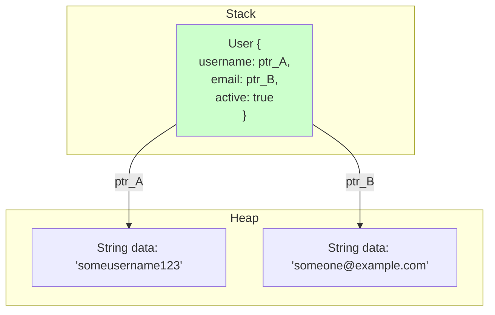
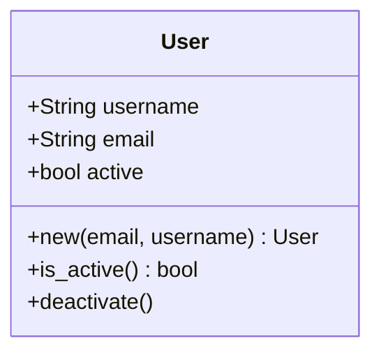
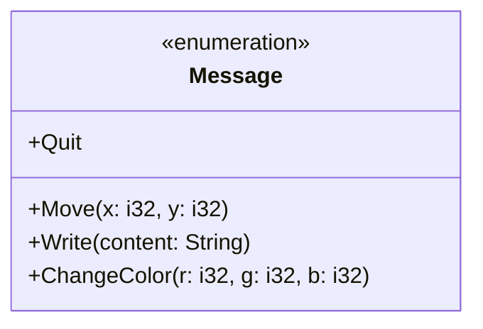
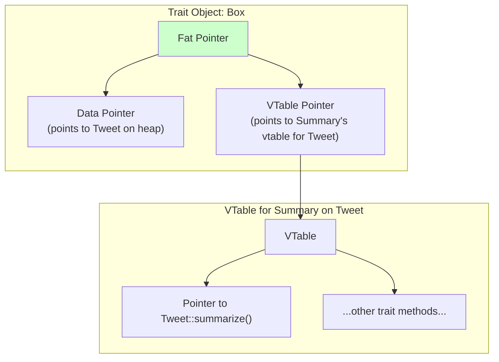
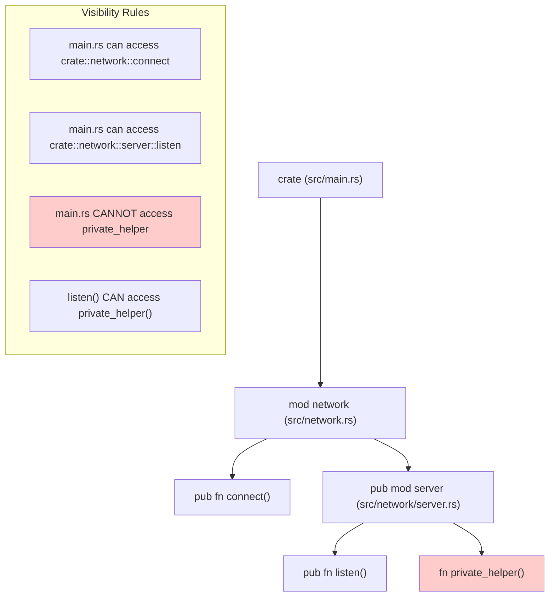
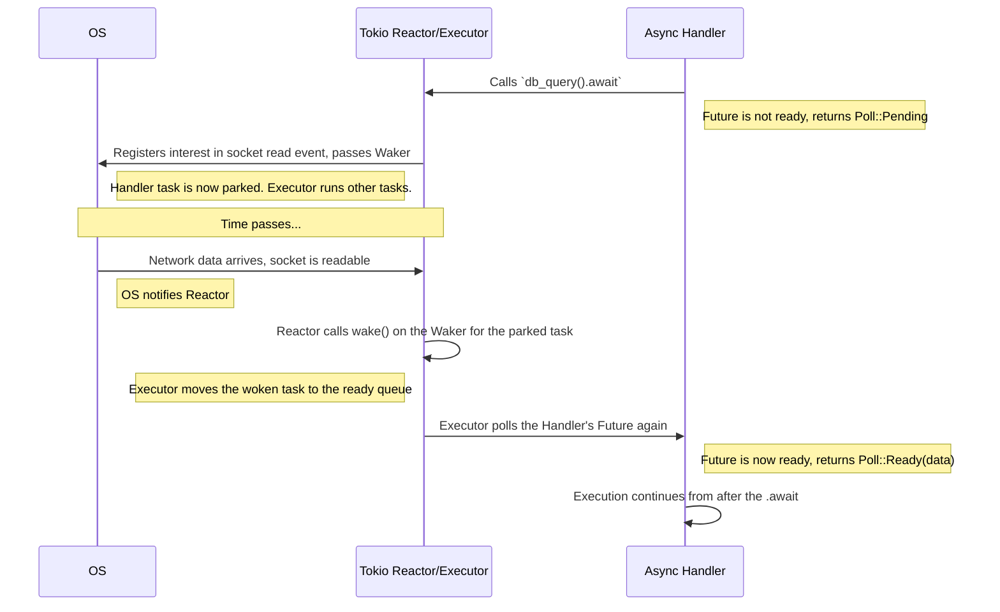

# A Deep Dive into Rust: From Fundamentals to Production Patterns

## Table of Contents

  * [**Introduction: Learning Rust with the Feynman Method**](#introduction-learning-rust-with-the-feynman-method)
  * [**Part I: The Building Blocks of Data and Behavior**](#part-i-the-building-blocks-of-data-and-behavior)
      * [Chapter 1: Structs - Giving Your Data a Name and a Home](#chapter-1-structs---giving-your-data-a-name-and-a-home)
      * [Chapter 2: Enums - A Type for "This, That, or the Other"](#chapter-2-enums---a-type-for-this-that-or-the-other)
      * [Chapter 3: Traits - Defining Shared Capabilities](#chapter-3-traits---defining-shared-capabilities)
      * [Chapter 4: The Module System - Creating a Tidy Codebase](#chapter-4-the-module-system---creating-a-tidy-codebase)
  * [**Part II: Production-Ready Concurrency**](#part-ii-production-ready-concurrency)
      * [Chapter 5: The Asynchronous Kitchen: Non-Blocking I/O with Tokio](#chapter-5-the-asynchronous-kitchen-non-blocking-io-with-tokio)
      * [Chapter 6: Effortless Parallelism: CPU-Bound Work with Rayon](#chapter-6-effortless-parallelism-cpu-bound-work-with-rayon)
  * [**Part III: The Rustacean's Toolkit: Essential Design Patterns**](#part-iii-the-rustaceans-toolkit-essential-design-patterns)
      * [Chapter 7: A Catalogue of Idiomatic Design Patterns](#chapter-7-a-catalogue-of-idiomatic-design-patterns)
  * [**Conclusion: A Framework for Reliable Software**](#conclusion-a-framework-for-reliable-software)

## Introduction: Learning Rust with the Feynman Method

Welcome to a comprehensive exploration of the Rust programming language. To truly master a system as rich and innovative as Rust, one must begin not with a list of features, but with an understanding of its foundational principles. This guide is structured to follow the Feynman learning method: we start with a simple, relatable explanation, identify and fill the gaps in our understanding, and then refine the concept until it can be taught to others.

This approach is particularly well-suited for Rust. The language's core mission is to empower developers to build reliable and efficient software, tackling the long-standing challenges of performance and memory safety without a garbage collector. Concepts like ownership, the borrow checker, and traits are not arbitrary; they are carefully designed solutions. By applying the Feynman method, we will build a robust mental model that illuminates not just *what* these features are, but *why* they exist and how they synergize to fulfill Rust's promise of "fearless concurrency."

-----

## **Part I: The Building Blocks of Data and Behavior**

Before constructing complex applications, one must first master the fundamental tools for shaping data and defining its behavior. In Rust, these tools are structs, enums, traits, and the module system that organizes them. This part provides an in-depth exploration of each, laying the groundwork for everything that follows.

### **Chapter 1: Structs - Giving Your Data a Name and a Home**

#### **Simple Explanation: A Custom Business Card**

Think of a `struct` as a custom-designed business card. A person's contact information consists of several distinct pieces of data: a name, a job title, an email, and a phone number. Carrying these as loose slips of paper would be chaotic. A business card organizes this information into a single, cohesive unit. You don't hand someone four separate pieces of paper; you hand them one `BusinessCard`.

In Rust, a `struct` serves the same purpose. It lets you group related pieces of information, give the collection a meaningful name, and treat it as a single, unified entity.

```rust
// Define the structure of our "business card"
struct User {
    username: String,
    email: String,
    active: bool,
}

// Create an instance of the User struct
let user1 = User {
    email: String::from("someone@example.com"),
    username: String::from("someusername123"),
    active: true,
};
```

This `User` struct bundles a username, an email, and an active status into a new, custom type named `User`. This is far more expressive and less error-prone than managing these values as separate variables.

#### **Identifying Gaps: Forms of Data, Behavior, and Memory**

The simple business card analogy is a good start, but it doesn't capture the full picture.

  * Can structs have different forms?
  * How do we make them *do* things, rather than just hold data?
  * Where does the data for a struct live in memory?

#### **Explore and Fill Gaps: Struct Varieties, Implementations, and Memory Layout**

Rust provides three distinct forms of structs, each suited for different use cases:

  * **Named-Field Structs**: The most common form, as seen in the `User` example. Each field has a name and a type, making the code self-documenting. Access is clear using dot notation (e.g., `user1.email`).
  * **Tuple Structs**: These structs have a name, but their fields are unnamed. They are useful for creating new, distinct types that wrap existing types, especially when field names would be redundant. For example, `struct Color(i32, i32, i32);` and `struct Point(i32, i32, i32);` are completely different types in the eyes of the compiler, preventing logical errors. This is the foundation of the **Newtype pattern**.
  * **Unit-Like Structs**: These have no fields at all (e.g., `struct AlwaysEqual;`). Their main utility is in generic programming, where a type is needed to act as a marker or to implement a trait without carrying any data.

**Attaching Behavior with `impl`**

A struct that only holds data is of limited use. The true power emerges when behavior is attached to it. This is done using an `impl` (implementation) block, which associates functions, called **methods**, with a specific struct. This bundles data with the functions that operate on that data.

```rust
// The struct defines the data.
// The `#[derive(Debug)]` attribute tells the compiler to automatically generate
// an implementation of the `Debug` trait, which allows us to print the struct.
#[derive(Debug)]
struct User {
    username: String,
    email: String,
    active: bool,
}

// The impl block defines the behavior.
impl User {
    // An "associated function" that acts as a constructor.
    // It's called using the `::` syntax: `User::new(...)`.
    fn new(email: String, username: String) -> User {
        User {
            email, // Using field init shorthand, since parameter names match field names
            username,
            active: true,
        }
    }

    // A method that operates on an instance of the struct.
    // `&self` is an immutable borrow of the instance. It allows reading data.
    fn is_active(&self) -> bool {
        self.active
    }

    // `&mut self` is a mutable borrow, allowing the method to change the instance's data.
    fn deactivate(&mut self) {
        self.active = false;
    }
}
```

***Insight: Data-First Design and Memory Layout***
*Unlike classes in many object-oriented languages, Rust's structs separate data definition (`struct`) from behavior definition (`impl`). This emphasizes that a type's primary role is to describe the shape of data. The data for a struct is stored contiguously in memory. For our `User` struct, the `active: bool` field will be stored directly. However, `username: String` and `email: String` are more complex. A `String` is itself a struct containing a pointer to data on the heap, a capacity, and a length. So, the `User` struct itself will be relatively small and live on the stack (by default), but it will hold pointers to the larger string data allocated on the heap.*



#### **Refine and Teach Back: The Cohesive Module**

A `struct` is Rust's primary way to create custom, composite data types. It defines the "shape" of your data. Through `impl` blocks, methods can be associated with the struct, defining behaviors that operate on that data. This combination of data and behavior creates a cohesive, encapsulated module, forming the fundamental building block for modeling complex entities in a Rust program.



-----

### **Chapter 2: Enums - A Type for "This, That, or the Other"**

#### **Simple Explanation: A Traffic Light**

An `enum`, short for enumeration, is like a traffic light. A traffic light can be in one of three distinct states: Red, Yellow, or Green. It can never be in an unknown state, nor can it be Red and Green at the same time. An enum in Rust allows you to define a new type that has a fixed set of possible values, or "variants."

```rust
enum TrafficLight {
    Red,
    Yellow,
    Green,
}
```

Here, `TrafficLight` is a new type, and any variable of this type can only hold one of the three specified values: `TrafficLight::Red`, `TrafficLight::Yellow`, or `TrafficLight::Green`.

#### **Identifying Gaps: States with Associated Data**

The simple traffic light analogy is useful, but it only scratches the surface. Unlike in many other languages where enums are just named integers, Rust enums are much more powerful. What if a state needs to carry extra information with it?

#### **Explore and Fill Gaps: Algebraic Data Types and Exhaustive Matching**

This is the feature that elevates Rust's enums. Each variant can be defined to hold different types and amounts of data. This allows a single enum type to represent multiple related but structurally different kinds of information. These are often called "sum types" or "tagged unions."

**Annotated Example: A Chat Message**

```rust
enum Message {
    Quit, // A variant with no associated data.
    Move { x: i32, y: i32 }, // A variant with named fields, like a mini-struct.
    Write(String), // A variant that wraps a single String value.
    ChangeColor(i32, i32, i32), // A variant that wraps a tuple of three i32 values.
}
```

This single `Message` type can encapsulate all of these possibilities. To work with it, Rust provides the `match` control flow operator. `match` is like a `switch` statement on steroids; it forces you to handle every possible variant, a feature called **exhaustiveness checking**.

```rust
fn process_message(msg: Message) {
    match msg {
        // The `=>` separates the pattern from the code to run.
        Message::Quit => {
            println!("The Quit variant has no data to destructure.");
        },
        // We can destructure the fields of the `Move` variant.
        Message::Move { x, y } => {
            println!("Move in the x direction {} and y direction {}", x, y);
        },
        // We can bind the inner value of `Write` to a variable named `text`.
        Message::Write(text) => {
            println!("Text message: {}", text);
        },
        Message::ChangeColor(r, g, b) => {
            println!("Change the color to red {}, green {}, and blue {}", r, g, b);
        },
        // If we later added a `React(Emoji)` variant to `Message`, the Rust compiler
        // would produce an error right here, forcing us to handle the new case.
        // This makes refactoring complex state machines incredibly safe.
    }
}
```

***Key Insight: `Option` and `Result` - The Pillars of Rust***
The entire Rust ecosystem is built upon two fundamental enums defined in the standard library. Understanding them is non-negotiable.

  * **`Option<T>`: The End of Null Errors**. The `Option<T>` enum represents a value that could be absent. It is defined as `enum Option<T> { None, Some(T) }`. A function that might not return a value (e.g., finding an item in a list) returns an `Option<T>`. This is Rust's solution to the infamous "billion-dollar mistake" of null pointers. The compiler forces the programmer to handle the `None` case explicitly using `match` or other helper methods, preventing entire classes of bugs.

  * **`Result<T, E>`: Explicit Error Handling**. The `Result<T, E>` enum is the cornerstone of Rust's approach to recoverable errors. It is defined as `enum Result<T, E> { Ok(T), Err(E) }`. A function that can fail (e.g., opening a file) returns a `Result`. If it succeeds, it returns `Ok(value)`; if it fails, it returns `Err(error_details)`. This forces the calling code to acknowledge and handle the possibility of failure, leading to more robust programs. The `?` operator is syntactic sugar for propagating errors from `Result` values.

#### **Refine and Teach Back: Making Invalid States Unrepresentable**

An `enum` in Rust defines a custom type that can be one of a finite set of variants. Its true power lies in the ability for these variants to contain associated data. When combined with Rust's exhaustive `match` statement, enums enable the powerful pattern of **"making invalid states unrepresentable."** Instead of having a single object with many `nullable` fields and a `state` flag, you define an enum where each variant holds only the data required for that specific state. This eliminates a wide range of common programming errors by encoding business logic directly into the type system.



-----

### **Chapter 3: Traits - Defining Shared Capabilities**

#### **Simple Explanation: A Professional Certification**

A `trait` in Rust is like a professional certification. Imagine a `FirstAidCertified` certification. To earn it, a person must demonstrate they can perform a specific set of actions, such as `apply_bandaid()` and `perform_cpr()`. The certification itself doesn't care *who* is certified-it could be a paramedic, a teacher, or a robot. It only cares that they possess the required capabilities.

A trait defines a set of methods that a type must implement to claim it has that "capability". It specifies *what* actions can be performed, but not *how*.

```rust
// This trait defines the "summarizable" capability.
// Any type that implements this trait MUST provide a `summarize` method.
pub trait Summary {
    fn summarize(&self) -> String;
}
```

#### **Identifying Gaps: Static vs. Dynamic Capabilities and Generics**

The certification analogy is a good start. But how is this used in practice? How does it differ from an "interface" in other languages? How can it help write flexible code that works with many different types? What if we need a collection of different types that all share the same certification?

#### **Explore and Fill Gaps: Generics, Dispatch, and the Orphan Rule**

**Implementing a Trait**

Implementing a trait for a type is how you "earn the certification." You use an `impl Trait for Type` block to provide the concrete behavior.

```rust
pub struct NewsArticle {
    pub headline: String,
    pub author: String,
}

impl Summary for NewsArticle {
    fn summarize(&self) -> String {
        format!("{}, by {}", self.headline, self.author)
    }
}

pub struct Tweet {
    pub username: String,
    pub content: String,
}

impl Summary for Tweet {
    fn summarize(&self) -> String {
        format!("{}: {}", self.username, &self.content[..20])
    }
}
```

**Generics and Static Dispatch (`impl Trait`)**

One of the most critical uses of traits is to constrain generic function parameters. This allows a function to accept any type that implements a specific trait.

```rust
// This function will work with NewsArticle, Tweet, or any other type
// that implements the Summary trait in the future.
// The syntax `T: Summary` is a "trait bound". It means "T can be any type
// as long as it implements the Summary trait."
pub fn notify<T: Summary>(item: &T) {
    println!("Breaking news! {}", item.summarize());
}
```

***Insight: Static Dispatch and Monomorphization***
This is called **static dispatch**. At compile time, the Rust compiler looks at all the places you've called `notify`. If you called it with a `Tweet`, it generates a specialized version of the function *specifically for `Tweet`*. It does the same for `NewsArticle`. This process, called **monomorphization**, means there is no runtime lookup to figure out which `summarize` method to call. The resulting code is just as fast as if you had written separate, non-generic functions. This is "zero-cost abstraction."

**Trait Objects and Dynamic Dispatch (`dyn Trait`)**

What if you need a collection of items that have different concrete types but share the same trait (e.g., a `Vec` of `Tweet`s and `NewsArticle`s)? Generics won't work, because a `Vec<T>` must hold elements of a single, concrete type `T`.

This is where **trait objects** come in. A trait object, written as `&dyn Trait` or `Box<dyn Trait>`, is a "fat pointer" that allows for **dynamic dispatch**. It enables you to mix different types that implement the same trait.

```rust
// This vector holds trait objects. The concrete type of each element is `Box<dyn Summary>`.
let items: Vec<Box<dyn Summary>> = vec![
    Box::new(Tweet { username: "horse_ebooks".into(), content: "of course...".into() }),
    Box::new(NewsArticle { headline: "Penguins win!".into(), author: "PGH Gazette".into() }),
];

for item in items {
    // The correct summarize() method is looked up at runtime using the vtable.
    println!("{}", item.summarize());
}
```

This flexibility comes with a small runtime cost due to the vtable lookup, but it enables classic object-oriented patterns.



***Heuristic: The Orphan Rule***
A crucial constraint in Rust is the **orphan rule**: you can implement a trait for a type only if either the trait or the type is defined in your current crate. You cannot implement an external trait (like `Display` from the standard library) for an external type (like `Vec<T>`). This prevents dependency conflicts where two different crates could provide conflicting implementations. The idiomatic solution is the **Newtype pattern**: wrap the external type in a local struct, and then you are free to implement any trait for your new type.

#### **Refine and Teach Back: Abstraction Without Overhead**

A `trait` is Rust's formal contract for shared behavior, analogous to an interface but more powerful. It's the primary tool for abstraction, enabling polymorphism either at compile time with zero overhead via **generics and static dispatch**, or at runtime with minor overhead via **trait objects and dynamic dispatch**. Traits are the cornerstone of Rust's architecture, enabling the construction of extensible systems that are both safe and performant.

-----

### **Chapter 4: The Module System - Creating a Tidy Codebase**

#### **Simple Explanation: A Library with Bookshelves**

Think of your Rust program as a library. If you just threw all the books (functions, structs) onto the floor, it would be impossible to find anything. The module system is how you organize this library.

  * A **crate** is the entire library building (`your_program`).
  * A **module** is a specific room or a bookshelf in the library (e.g., `networking`, `ui`).
  * You use the `mod` keyword to declare a module (build a new bookshelf).
  * You use the `pub` keyword to make an item public (put a book on the shelf for others to see).
  * You use the `use` keyword to bring an item into scope (take a book from a shelf to read at your desk).

This system keeps your code organized, clean, and easy to navigate.

#### **Identifying Gaps: Files, Paths, and Visibility**

The library analogy is helpful, but how does this map to the actual files and directories in a project? What are the precise rules for what code can see what other code? How do `mod`, `use`, `pub`, and file structure interact?

#### **Explore and Fill Gaps: Crates, Modules, and Paths**

A Rust project is built around a **crate**. A crate is the smallest unit of compilation. It can be a binary crate (an executable program with a `src/main.rs` file) or a library crate (a collection of code intended to be used by other programs, with a `src/lib.rs` file).

The `src/main.rs` or `src/lib.rs` file is the **crate root**. All module paths start from here, forming a module tree.

**Annotated Example: Organizing a small application**

Let's look at a typical project structure:

```
my_app/
├── Cargo.toml
└── src/
    ├── main.rs
    ├── network.rs
    └── network/
        └── server.rs
```

Now, let's see the code that makes this work:

**`src/main.rs` (The Crate Root)**

```rust
// Declares that a module named `network` exists.
// Rust will look for it in `src/network.rs` or `src/network/mod.rs`.
mod network;

// `use` brings items into the current scope so we can use them with a shorter path.
// `crate::network::connect` is the full path from the crate root.
use crate::network::connect;
use crate::network::server::listen;

fn main() {
    connect();
    listen();
}
```

**`src/network.rs`**

```rust
// This makes the `connect` function public, so code outside this module (like main.rs) can use it.
pub fn connect() {
    println!("Connecting...");
}

// Declares a submodule named `server`.
// Rust will look for it in `src/network/server.rs`.
// This module must also be `pub` for `main.rs` to see inside it.
pub mod server;
```

**`src/network/server.rs`**

```rust
// This function needs to be public to be visible outside the `server` module.
pub fn listen() {
    println!("Listening...");
    // We can call a private function from within the same module.
    private_helper();
}

// This function is private by default. It can only be called by other code
// inside the `server` module (i.e., inside this file or its children).
fn private_helper() {
    // ...
}
```

***Key Insight: Paths and Privacy are a Hierarchy***

  * All items (functions, structs, enums, modules) are **private by default**.
  * The `pub` keyword makes an item public to its parent module.
  * To access an item from outside its module, every step of the path to it must be public. It's like unlocking a series of doors: to get into `network::server::listen`, both the `server` module and the `listen` function must be `pub`.
  * Paths can be relative (`super::connect()`) or absolute from the crate root (`crate::network::connect`).

#### **Refine and Teach Back: The "Tree and Visibility" Model**

Think of your crate as a tree of modules whose structure is defined by the `mod` keyword and maps to your file system. By default, an item can only be seen by its parent module and its descendants. The `pub` keyword makes an item part of the module's public API, making it visible outside. Use modules to group related functionality and `pub` to define a stable interface, keeping implementation details private. This is the foundation of creating maintainable and reusable Rust code.



-----

## **Part II: Production-Ready Concurrency**

Having mastered the fundamental building blocks, the focus now shifts to applying them in production. This part delves into Rust's two dominant concurrency paradigms: asynchronous programming for I/O-bound workloads and data parallelism for CPU-bound workloads.

### **Chapter 5: The Asynchronous Kitchen: Non-Blocking I/O with Tokio**

#### **Simple Explanation: The Chef vs. The Chess Master**

To understand asynchronous programming, compare two ways of handling many tasks:

  * **Blocking (Traditional Threads): The Chess Master.** A chess master plays 20 opponents. They go to the first table, make a move, and then stand there, idle, waiting until that opponent moves. This is incredibly inefficient. The master (a CPU thread) spends most of their time blocked. This is like a web server dedicating one thread per connection; the thread blocks while waiting for the database or network.

  * **Non-Blocking (Asynchronous): The Chef.** A chef in a busy kitchen needs to cook a multi-course meal. They put a pot on the stove to boil. Instead of watching it, they immediately turn to chop vegetables. When the pot whistles (an "event"), they pause chopping, add pasta, and immediately go back to another task. The chef (a single thread) is never idle. This is asynchronous I/O. It allows a single thread to manage thousands of concurrent tasks by switching to another task whenever the current one has to wait.

#### **Identifying Gaps: The Machinery of `async`/`await`**

The chef analogy captures the "why" of async, but to understand the "how," we must delve into the core machinery: the `Future` trait, the `async`/`await` syntax, and the runtime that orchestrates everything. How does the "chef" know which task to work on next?

#### **Explore and Fill Gaps: `Future`s, Wakers, and the Tokio Runtime**

**`async` and `await`: The Syntax of Waiting**
The `async` keyword transforms a function into a state machine that produces a `Future`. A `Future` is a value representing a computation that will complete at some point. Calling an `async fn` does not run it; it just returns the `Future`.

The `.await` keyword, used inside an `async fn`, is what drives the future. When you `.await` a future, you are essentially saying, "Pause this function until this work is done, but let the thread go do other things in the meantime."

**The `Future` Trait, `poll`, and the `Waker`**
At its core, a `Future` is a trait with a single method, `poll`. The runtime calls `poll` to advance the future's state. `poll` returns:

  * `Poll::Ready(value)`: The future is complete.
  * `Poll::Pending`: The future is not yet complete because it's waiting for an external event (e.g., data from a network socket). When it returns `Pending`, it must register a `Waker` with the underlying I/O resource. The `Waker` holds a callback to the runtime. When the event occurs (data arrives), the resource calls `.wake()` on the `Waker`, which tells the runtime to schedule this task to be polled again.

**The Role of the Tokio Runtime**
If `async` functions create `Future`s, what actually calls `.poll()` on them? This is the job of an **asynchronous runtime**, and **Tokio** is the de facto standard. Tokio is the "kitchen manager." It provides:

  * **An Executor/Scheduler**: The core engine. It takes tasks (spawned via `tokio::spawn`) and manages a queue of them, polling them when they are woken.
  * **An I/O Reactor**: Interfaces with the OS's non-blocking I/O (epoll, kqueue, IOCP). It's the part that receives external events and uses them to call `.wake()`.
  * **A Thread Pool**: Tokio typically uses a multi-threaded scheduler, distributing async tasks across a pool of OS threads to leverage multiple CPU cores.

**Annotated Example: The Request Lifecycle in Axum**
Let's see this in a web server built with the **Axum** framework, which runs on Tokio.

```rust
use axum::{extract::Path, routing::get, Router, extract::State};
use std::{net::SocketAddr, sync::{Arc, Mutex}};

// A mock database connection pool
type Db = Arc<Mutex<Vec<String>>>;

// The `#[tokio::main]` macro transforms our main function.
// It sets up the Tokio runtime and runs the async main function as the first task.
#[tokio::main]
async fn main() {
    // Create some shared state for our handlers to access.
    let db = Db::default();

    let app = Router::new()
        .route("/users", get(get_users))
        // `with_state` makes the `db` available to all handlers.
        .with_state(db);

    let addr = SocketAddr::from(([127, 0, 0, 1], 3000));
    println!("listening on {}", addr);
    axum::Server::bind(&addr)
        .serve(app.into_make_service())
        .await // .await here means the main function will pause until the server is shut down.
        .unwrap();
}

// This async handler uses Extractors to get access to shared state.
async fn get_users(
    State(db): State<Db>, // The State extractor gives us access to our Db.
) -> String {
    // We lock the mutex to access the data. In a real app, this would be an async DB query.
    // let users = sqlx::query_as::<...>("SELECT * FROM users").fetch_all(&pool).await;
    // The `.await` would pause this handler, release the thread, and resume here once the DB responds.
    db.lock().unwrap().join(", ")
}
```



***Insight: `Send` and `Sync` are Your Guardrails***
When using a multi-threaded runtime like Tokio, a `Future` might be started on one thread and resumed on another. For this to be safe, all data captured by the `async` block must be `Send` (safe to *transfer* across threads). If data is shared between threads, it often needs to be `Sync` (safe to be *accessed* from multiple threads, e.g., via `&T`). The compiler enforces these traits, preventing a whole class of concurrency bugs at compile time. If you get a `!Send` error, it's often because you're holding something like a non-thread-safe `Rc` or `RefCell` across an `.await` point.

#### **Refine and Teach Back: The Cooperative Multitasking Model**

Asynchronous programming in Rust is a highly efficient cooperative multitasking model for I/O-bound applications. The `async`/`await` syntax provides an ergonomic way to write non-blocking code by creating `Future`s (pausable state machines). The **Tokio runtime** acts as the engine, driving these `Future`s to completion by polling them when they are ready. Frameworks like **Axum** build on this foundation to provide high-level abstractions for building robust and high-performance network services.

-----

### **Chapter 6: Effortless Parallelism: CPU-Bound Work with Rayon**

#### **Simple Explanation: The Librarian and the Assistants**

While `async` is perfect for waiting efficiently, another kind of problem involves heavy computation that maxes out the CPU. For these **CPU-bound** tasks, the goal is to use all available CPU cores to get the work done faster. This is **parallelism**.

Imagine a librarian who must take inventory of a massive library. Doing it alone (sequentially) would take days. A better approach is to hire a team of assistants, one for each floor (the CPU cores). The head librarian splits the task-"Floor 1 team, count your floor; Floor 2 team, count yours"-and they all work at the same time. This is the "divide and conquer" strategy that the **Rayon** library uses.

#### **Identifying Gaps: Safety and Performance in Parallel**

This sounds great, but how does Rayon split the work efficiently without creating chaos? And more importantly, how does it guarantee that the parallel version is correct and doesn't introduce subtle bugs like data races, which are notoriously difficult to debug in other languages?

#### **Explore and Fill Gaps: Parallel Iterators and Work-Stealing**

The magic of Rayon lies in its `ParallelIterator` trait. It provides parallel versions of most methods from the standard `Iterator` trait (`map`, `filter`, `reduce`, `sum`, etc.). By simply adding `use rayon::prelude::*;`, you can convert a sequential iterator chain into a parallel one.

**Annotated Example: Sequential vs. Parallel Image Processing**

```rust
use rayon::prelude::*;

struct Image { pixels: Vec<u8> }

// A CPU-intensive operation.
fn process_pixel(pixel: u8) -> u8 {
    // Imagine some complex calculation here
    pixel.wrapping_mul(2).wrapping_add(10)
}

// --- SEQUENTIAL (SINGLE-CORE) ---
fn process_image_sequentially(image: &mut Image) {
    // .iter_mut() creates a standard, sequential iterator.
    // This will run on a single CPU core.
    image.pixels
        .iter_mut()
        .for_each(|pixel| *pixel = process_pixel(*pixel));
}

// --- PARALLEL (MULTI-CORE) ---
fn process_image_in_parallel(image: &mut Image) {
    // .par_iter_mut() creates a parallel iterator from the Rayon prelude.
    // Rayon's scheduler now takes over, splitting the `pixels` slice
    // and processing chunks of it on different threads in parallel.
    image.pixels
        .par_iter_mut()
        .for_each(|pixel| *pixel = process_pixel(*pixel));
}
```

***Key Insight: Work-Stealing for Dynamic Load Balancing***
Rayon doesn't just blindly spawn one thread per item. It uses a highly efficient **work-stealing** scheduler.

1.  **Thread Pool**: Rayon creates a global thread pool, one thread per logical CPU.
2.  **Divide and Conquer**: The initial collection is recursively split into smaller and smaller chunks of work.
3.  **Work Stealing**: Each thread has its own queue of work chunks. When a thread finishes its own work, it doesn't sit idle. Instead, it looks at the queues of other threads and "steals" work from them. This dynamically balances the load, ensuring that all CPU cores remain busy as long as there is work to be done, even if some chunks take longer to process than others.

***Guaranteed Data-Race Freedom by Design***
This is the most profound benefit. A data race occurs when multiple threads access the same memory location concurrently, and at least one of the accesses is a write. Rayon is built on Rust's ownership and borrow-checking rules. The `par_iter_mut()` method is only possible because the borrow checker can prove that each closure invocation (`|pixel| ...`) will be given a mutable reference to a *distinct and non-overlapping* part of the original slice. It's impossible for two threads to get a mutable reference to the same pixel. Therefore, if your sequential iterator is correct, the parallel version is guaranteed to be free of data races and will produce the same result.

#### **Refine and Teach Back: The "Drop-In Parallelism" Pattern**

**Rayon** is a data-parallelism library that makes it trivially easy to convert sequential, CPU-bound computations into parallel ones. By changing standard iterator calls (like `.iter_mut()`) to their parallel counterparts (`.par_iter_mut()`), developers can leverage a highly efficient work-stealing scheduler to maximize CPU utilization. Crucially, Rayon integrates with Rust's ownership system to guarantee that this parallel execution is free from data races. It is the idiomatic, go-to tool for safely and effortlessly speeding up heavy computations.

-----

## **Part III: The Rustacean's Toolkit: Essential Design Patterns**

Design patterns are reusable solutions to common problems. While many classic patterns can be adapted to Rust, the language's unique features give rise to a set of more idiomatic patterns. This part focuses on the patterns that provide the most leverage in day-to-day Rust programming.

### **Chapter 7: A Catalogue of Idiomatic Design Patterns**

#### **Pattern 1: The Builder Pattern**

  * **Problem:** How do you construct a complex object with many optional or validated fields without creating a messy constructor function with a dozen arguments?

  * **Analogy: Ordering a Custom Sandwich.** The Builder pattern is like ordering a sandwich at a deli. You start with a `SandwichBuilder`. Then you say `.with_rye_bread()`, `.add_turkey()`, `.no_mustard()`. Each step is explicit and modifies the order. It prevents you from making an invalid sandwich, like adding toppings before the bread exists. When you're done, you say `.build()`, and you get the final `Sandwich`.

  * **Implementation & Insight:** The Builder is idiomatic in Rust because the language lacks named arguments and function overloading. It involves creating a separate `Builder` struct that accumulates configuration and then calls a final `.build()` method.

    ```rust
    pub struct HttpQuery { /* fields */ }
    pub struct HttpQueryBuilder {
        method: String,
        url: String,
        timeout: Option<u32>, // Optional fields are Options
        headers: Option<Vec<String>>,
    }

    impl HttpQueryBuilder {
        pub fn new(method: String, url: String) -> Self { /* ... */ }

        // Setter methods consume and return the builder, enabling chaining.
        pub fn with_timeout(mut self, timeout: u32) -> Self {
            self.timeout = Some(timeout);
            self // Return ownership of the modified builder
        }
        
        // Final build method consumes the builder and returns the target object.
        pub fn build(self) -> HttpQuery {
            HttpQuery {
                method: self.method,
                url: self.url,
                timeout: self.timeout.unwrap_or(30), // Apply default
                headers: self.headers.unwrap_or_default(), // Apply default
            }
        }
    }

    // Usage is clean and readable.
    let query = HttpQueryBuilder::new("GET".into(), "/".into())
        .with_timeout(60)
        .build();
    ```

  * **Heuristic: Consuming vs. Mutable Builder.** There's a key trade-off. The `fn method(mut self) -> Self` style shown above (consuming builder) is great for simple chaining. An alternative `fn method(&mut self)` (mutable builder) is better when you need to conditionally set fields: `let mut builder = ...; if condition { builder.set_timeout(10); }`. Choose based on the expected use case.

#### **Pattern 2: The Newtype Pattern**

  * **Problem:** The type system can't always protect against logical errors. A `user_id` and a `product_id` might both be `u64`, so the compiler won't stop you from accidentally passing one where the other is expected.

  * **Analogy: A Labeled Key-Cover.** The Newtype pattern is like putting a plain silver key into a custom-colored, labeled key-cover. `struct UserId(u64);` and `struct ProductId(u64);` are now completely different and incompatible types, even though they both just contain a `u64`.

  * **Implementation & Insight:** This is a zero-cost abstraction that adds a powerful layer of type safety. It's the cornerstone of the "Parse, don't validate" philosophy.

    ```rust
    use std::str::FromStr;

    #[derive(Debug)]
    pub struct Email(String);

    impl Email {
        // We can hide the constructor and only expose a validated parser.
        pub fn parse(s: String) -> Result<Email, String> { /* validation logic */ Ok(Self(s)) }
    }

    // We can even implement standard traits for better ergonomics.
    impl FromStr for Email {
        type Err = String;
        fn from_str(s: &str) -> Result<Self, Self::Err> {
            if s.contains('@') { Ok(Self(s.to_string())) }
            else { Err("Invalid email".to_string()) }
        }
    }

    // A function that now requires a *validated* Email.
    fn send_welcome_email(email: &Email) { /* ... */ }
    ```

  * **Heuristic to Teach:** Use the Newtype pattern to distinguish between primitive types that have different semantic meanings. It makes your APIs safer and more self-documenting. It is also the primary way to solve the **Orphan Rule** by wrapping an external type in a local one.

#### **Pattern 3: The RAII Guard Pattern**

  * **Problem:** How can a program guarantee that resources like file handles, network sockets, or mutex locks are always cleaned up properly, even in the face of errors or panics? Forgetting to release a resource leads to leaks or deadlocks.

  * **Analogy: A Temporary Security Badge.** RAII (Resource Acquisition Is Initialization) is like getting a security badge to enter a locked room (the resource). As long as you hold the badge (e.g., a `MutexGuard`), you have access. The moment the badge is no longer needed (it goes out of scope), it is automatically destroyed, and its destruction protocol includes locking the door behind you (releasing the resource).

  * **Implementation & Insight:** This pattern is built into the fabric of Rust via the `Drop` trait. When an object that implements `Drop` goes out of scope, its `drop` method is automatically called. The `MutexGuard` from the standard library is the canonical example.

    ```rust
    use std::sync::{Arc, Mutex};

    fn worker(counter: Arc<Mutex<i32>>) {
        // `lock()` acquires the lock and returns a `MutexGuard`.
        // The guard's lifetime starts here.
        let mut num_guard = counter.lock().unwrap();

        *num_guard += 1;

        // The guard `num_guard` goes out of scope at the closing brace.
        // Its `Drop` implementation is automatically called, unlocking the mutex.
        // It's impossible to forget this step.
    } // <- `drop(num_guard)` is called here.
    ```

  * **Heuristic to Teach:** Whenever you manage a resource that requires explicit cleanup (locks, files, connections), wrap it in a struct that implements the `Drop` trait. This makes resource management automatic, deterministic, and leak-proof, which is a cornerstone of Rust's safety and reliability.

#### **Pattern 4: The Type State Pattern**

  * **Problem:** How can you enforce state machine rules at compile time? For example, a blog post can't be published until it has been reviewed. Relying on runtime `if` checks is error-prone.

  * **Analogy: A Model Airplane Kit.** You start with a box of parts (`DraftPost`). The instructions tell you to glue the wings on, which consumes the parts and gives you a new object: a `PartiallyAssembledPlane` (`PendingReviewPost`). You cannot attach the landing gear to the initial box of parts. Invalid state transitions become impossible because the methods to perform them simply don't exist on the wrong types.

  * **Implementation & Insight:** This pattern encodes state machine logic into the type system, making invalid operations a compile-time error.

    ```rust
    // Each state is a distinct type.
    pub struct DraftPost { content: String }
    pub struct PendingReviewPost { content: String }
    pub struct Post { content: String }

    impl DraftPost {
        // This method consumes a DraftPost and returns a PendingReviewPost.
        pub fn request_review(self) -> PendingReviewPost {
            PendingReviewPost { content: self.content }
        }
    }

    impl PendingReviewPost {
        pub fn approve(self) -> Post {
            Post { content: self.content }
        }
    }

    // An attempt to call `post.approve()` when `post` is a `DraftPost`
    // will result in a compile-time error: "no method named `approve` found for struct `DraftPost`".
    ```

  * **Heuristic to Teach:** Use the Type State pattern for objects with a defined, linear lifecycle. It moves business logic from runtime `if/else` checks into the type system, creating incredibly robust state machines where "if it compiles, the state transitions are correct."

#### **Pattern 5: Structured Error Handling**

  * **Problem:** How should errors be handled in a robust Rust application? Simple strings are unstructured. `panic!` is for unrecoverable errors and should not be used for expected failures.

  * **Analogy: A Doctor's Diagnosis.**

      * **In an application (e.g., a CLI tool):** You are your own patient. You often just need a quick, simple diagnosis to report what went wrong and stop. This is the role of `anyhow` or `Box<dyn Error>`.
      * **In a library:** You are writing a report for another specialist. They need precise details to decide on the correct treatment (e.g., retry a network error vs. fail on invalid input). This is the role of `thiserror`. It helps you build custom, detailed error enums.

  * **Implementation & Insight:** Knowing when to use which tool is a mark of an experienced Rust developer.

      * **Application Errors (`anyhow`):** When writing a binary, the goal is often to bubble any error up to `main`, log it, and exit. A general-purpose, dynamic error type is perfect. `anyhow::Result` is an ergonomic wrapper for this.

        ```rust
        // In a main.rs file
        use anyhow::Result;

        fn main() -> Result<()> {
            let content = std::fs::read_to_string("config.toml")?; // `?` converts any error into an `anyhow::Error`
            println!("Config: {}", content);
            Ok(())
        }
        ```

      * **Library Errors (`thiserror`):** When writing a library, the caller needs to know the *specific* type of error to handle it programmatically. A custom error enum is required. The `thiserror` crate uses a procedural macro to remove the boilerplate of implementing `std::error::Error`.

        ```rust
        // In a lib.rs file
        use thiserror::Error;

        #[derive(Error, Debug)]
        pub enum DataError {
            #[error("Database connection failed: {0}")]
            Database(String),

            #[error("I/O error processing data")]
            Io(#[from] std::io::Error), // Automatically converts from io::Error into DataError::Io

            #[error("Failed to parse data")]
            Parse(#[from] serde_json::Error), // Can also convert from other library errors
        }

        // The function signature is explicit about the errors it can return.
        pub fn fetch_data() -> Result<String, DataError> {
            let file_content = std::fs::read_to_string("data.json")?; // ? converts to DataError::Io
            let data: String = serde_json::from_str(&file_content)?; // ? converts to DataError::Parse
            Ok(data)
        }
        ```

  * **Heuristic to Teach:** **Use `thiserror` for libraries, `anyhow` for applications.** This provides structured, typed errors for library consumers while offering convenience and simplicity for application authors. The reasoning is simple: libraries must provide callers with specific, typed error information so they can make programmatic decisions. Applications, on the other hand, typically just need to report the error and terminate, making a general-purpose, easy-to-use error type ideal.

-----

## **Conclusion: A Framework for Reliable Software**

This deep dive has journeyed through the core components of the Rust programming language, guided by the principles of the Feynman method to build understanding from the ground up. We began with the fundamental building blocks: `structs` and `enums` for structuring data with precision, `traits` for defining abstract behaviors, and the `module` system for creating clean architectural boundaries. We then transitioned to production-grade concurrency, examining `async` with **Tokio** for scalable I/O-bound work and data parallelism with **Rayon** for accelerating CPU-bound tasks. Finally, we explored a curated set of idiomatic design patterns that leverage Rust's unique features to solve common problems with unparalleled safety and elegance.

The unifying theme that emerges is that Rust's features are not a loose collection of tools but a deeply integrated, cohesive system. Ownership and the borrow checker are what make the RAII pattern's safety guarantees absolute. The powerful combination of traits and enums is the foundation of the Type State pattern. The strict type system is what makes the Newtype and Builder patterns so effective. It is this synergy-this careful, deliberate design where each feature reinforces the others-that empowers developers to build software that is not just fast, but provably more reliable. Rust provides not just a language, but a framework for thinking about and building truly robust systems.