# Table of Contents

- [Deep Dive into Claude Code's Core Flows](#deep-dive-into-claude-codes-core-flows)
  - [1. Context-Aware File System Navigation](#1-context-aware-file-system-navigation)
  - [2. Multi-File Coherent Editing](#2-multi-file-coherent-editing)
  - [3. Iterative Refinement Through Testing](#3-iterative-refinement-through-testing)
  - [4. Natural Language Task Decomposition](#4-natural-language-task-decomposition)
  - [5. Intelligent Code Generation with Pattern Recognition](#5-intelligent-code-generation-with-pattern-recognition)
  - [6. Debugging Through Systematic Analysis](#6-debugging-through-systematic-analysis)
  - [7. Refactoring with Semantic Preservation](#7-refactoring-with-semantic-preservation)
  - [8. Documentation Generation and Synchronization](#8-documentation-generation-and-synchronization)
  - [9. Dependency Management and Integration](#9-dependency-management-and-integration)
  - [10. Performance Optimization Through Profiling Integration](#10-performance-optimization-through-profiling-integration)
  - [Integration and Synergy](#integration-and-synergy)
- [Comprehensive POC Development Plan: AI Code Assistant System](#comprehensive-poc-development-plan-ai-code-assistant-system)
  - [System Architecture Overview](#system-architecture-overview)
  - [Detailed File Structure](#detailed-file-structure)
  - [Detailed Implementation Plan](#detailed-implementation-plan)
    - [Phase 1: Core Infrastructure (Week 1-2)](#phase-1-core-infrastructure-week-1-2)
    - [Phase 2: Individual Flow Engines (Week 3-6)](#phase-2-individual-flow-engines-week-3-6)
    - [Phase 3: Integration Layer (Week 7-8)](#phase-3-integration-layer-week-7-8)
    - [Phase 4: Demo Scripts and Generators (Week 9-10)](#phase-4-demo-scripts-and-generators-week-9-10)
    - [Phase 5: Advanced Features Implementation](#phase-5-advanced-features-implementation)
  - [Future Improvements and Features](#future-improvements-and-features)
  - [Testing Strategy](#testing-strategy)
  - [Deployment and Distribution](#deployment-and-distribution)
  - [Conclusion](#conclusion)


# Deep Dive into Claude Code's Core Flows

## 1. Context-Aware File System Navigation

### Comprehensive Explanation

Context-aware file system navigation is the foundational capability that enables Claude Code to understand and work with entire codebases as interconnected systems rather than isolated files. This flow involves building a multi-layered mental model of the project structure.

**The Navigation System Architecture:**

The system likely maintains several parallel representations:
- **Physical Structure**: The actual file and directory layout
- **Logical Structure**: How modules, packages, and components relate conceptually
- **Dependency Graph**: Import/export relationships and runtime dependencies
- **Semantic Structure**: What each file's purpose is within the larger system

**Key Implementation Details:**

1. **Initial Indexing Phase**: When Claude Code starts working on a project, it performs a rapid scan to build its initial context map. This isn't just reading file names - it's understanding file purposes from naming patterns, directory structures, and file contents.

2. **Lazy Loading Strategy**: To manage memory efficiently, the system likely uses a lazy loading approach where file contents are loaded on-demand but metadata is always available. This allows quick navigation decisions without overwhelming memory.

3. **Pattern Recognition**: The system recognizes common project structures (MVC, microservices, monorepos) and adjusts its navigation strategies accordingly. For example, in an MVC project, it knows to look for models, views, and controllers in specific locations.

4. **Context Prioritization**: Based on the current task, the system prioritizes which parts of the codebase to actively analyze. If working on API endpoints, it gives higher priority to controller and service layers.

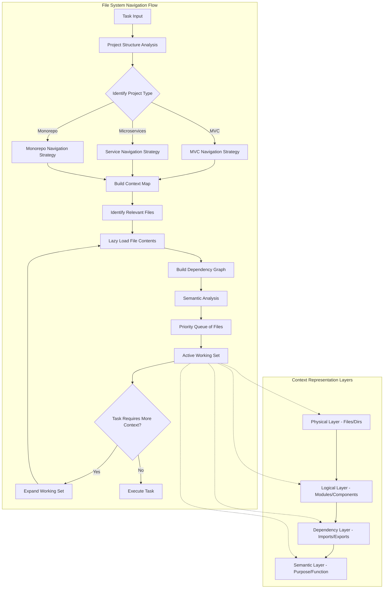

**Advanced Techniques for Replication:**

1. **Incremental Context Building**: Start with a minimal context and expand based on need. Use breadth-first search from the entry point files.

2. **Caching Strategies**: Implement multi-level caching:
   - File metadata cache (persistent)
   - Parsed AST cache (memory with LRU eviction)
   - Dependency relationship cache (persistent)

3. **Smart Heuristics**: Develop heuristics for common patterns:
   - Test files usually mirror source structure
   - Config files are often at root or in specific directories
   - Documentation follows predictable patterns

4. **Context Serialization**: Save and restore project context between sessions to avoid re-analysis.

## 2. Multi-File Coherent Editing

### Comprehensive Explanation

Multi-file coherent editing is perhaps the most complex flow, requiring sophisticated planning and execution strategies to ensure changes across multiple files remain consistent and don't introduce breaking changes.

**The Coherent Editing Architecture:**

The system operates in several phases:

1. **Change Impact Analysis**: Before making any changes, the system analyzes the full impact across the codebase
2. **Dependency Order Planning**: Determines the optimal order for making changes
3. **Transaction Management**: Ensures all changes succeed or all are rolled back
4. **Consistency Verification**: Validates that all changes maintain system coherence

**Deep Implementation Strategy:**

The system likely uses a sophisticated change planning algorithm that considers:
- Type dependencies (which types depend on others)
- Runtime dependencies (which functions call others)
- Test dependencies (which tests cover which code)
- Build dependencies (compilation order matters)

```mermaid
graph TB
    subgraph "Multi-File Editing Flow"
        A[Feature Request] --> B[Change Specification Analysis]
        B --> C[Identify Affected Files]
        
        C --> D[Build Dependency Graph]
        D --> E[Topological Sort]
        E --> F[Create Change Plan]
        
        F --> G{For Each File in Order}
        G --> H[Load File Context]
        H --> I[Plan File Changes]
        I --> J[Validate Changes Don't Break Dependencies]
        
        J -->|Valid| K[Add to Transaction]
        J -->|Invalid| L[Revise Plan]
        L --> I
        
        K --> M{More Files?}
        M -->|Yes| G
        M -->|No| N[Execute Transaction]
        
        N --> O[Apply All Changes]
        O --> P[Run Validation Suite]
        
        P -->|Success| Q[Commit Changes]
        P -->|Failure| R[Rollback]
        R --> S[Analyze Failure]
        S --> T[Revise Strategy]
        T --> C
    end
    
    subgraph "Change Plan Structure"
        U[Change Plan]
        U --> V[File: controller.js]
        U --> W[File: service.js]
        U --> X[File: model.js]
        U --> Y[File: test.js]
        
        V --> V1[Add endpoint method]
        W --> W1[Add business logic]
        X --> X1[Add data schema]
        Y --> Y1[Add integration test]
        
        V1 -.->|depends on| W1
        W1 -.->|depends on| X1
        Y1 -.->|tests| V1
        Y1 -.->|tests| W1
    end
```

**Advanced Implementation Patterns:**

1. **Change Plan Optimization**:
   ```python
   class ChangePlanner:
       def __init__(self):
           self.dependency_graph = {}
           self.change_operations = []
           
       def plan_changes(self, feature_request):
           # Analyze what needs to change
           required_changes = self.analyze_requirements(feature_request)
           
           # Build dependency order
           execution_order = self.topological_sort(required_changes)
           
           # Create atomic operations
           for file_change in execution_order:
               operation = self.create_atomic_operation(file_change)
               self.change_operations.append(operation)
           
           # Verify plan coherence
           self.verify_plan_coherence()
           
           return self.change_operations
   ```

2. **Transaction Management Pattern**:
   ```python
   class FileTransactionManager:
       def __init__(self):
           self.original_states = {}
           self.pending_changes = {}
           
       def begin_transaction(self):
           # Snapshot current state
           for file in self.affected_files:
               self.original_states[file] = self.read_file(file)
               
       def stage_change(self, file, content):
           self.pending_changes[file] = content
           
       def commit(self):
           try:
               # Apply all changes
               for file, content in self.pending_changes.items():
                   self.write_file(file, content)
               # Clear transaction state
               self.clear_transaction()
           except Exception as e:
               self.rollback()
               raise
               
       def rollback(self):
           # Restore original state
           for file, content in self.original_states.items():
               self.write_file(file, content)
   ```

3. **Coherence Validation System**:
   - Static analysis to ensure type safety
   - Import/export validation
   - Test coverage verification
   - API contract validation

## 3. Iterative Refinement Through Testing

### Comprehensive Explanation

This flow represents one of the most powerful aspects of Claude Code - the ability to use test feedback as a learning mechanism to iteratively improve code until it meets all requirements.

**The Test-Driven Refinement Architecture:**

The system creates a feedback loop where:
1. Code is generated based on understanding of requirements
2. Tests are run to validate the implementation
3. Test results are analyzed to understand failures
4. Code is refined based on the analysis
5. The cycle repeats until all tests pass

**Sophisticated Test Analysis:**

The system doesn't just see "test passed" or "test failed" - it performs deep analysis of failure modes:
- Assertion failures reveal logic errors
- Type errors indicate interface mismatches
- Timeout failures suggest performance issues
- Setup failures indicate environment problems

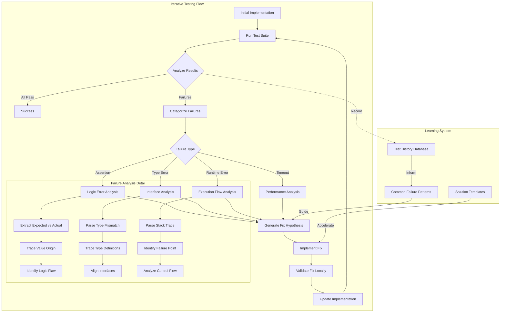

**Advanced Test Integration Patterns:**

1. **Intelligent Test Runner Integration**:
   ```python
   class SmartTestRunner:
       def __init__(self):
           self.test_history = {}
           self.failure_patterns = {}
           
       def run_and_analyze(self, test_command):
           # Run tests with detailed output
           result = self.execute_tests(test_command, verbose=True)
           
           # Parse results into structured format
           parsed_results = self.parse_test_output(result)
           
           # Analyze each failure
           failure_analyses = []
           for failure in parsed_results.failures:
               analysis = self.analyze_failure(failure)
               failure_analyses.append(analysis)
               
           # Learn from patterns
           self.update_failure_patterns(failure_analyses)
           
           return self.generate_fix_recommendations(failure_analyses)
           
       def analyze_failure(self, failure):
           analysis = {
               'type': self.categorize_failure(failure),
               'stack_trace': self.parse_stack_trace(failure),
               'assertion_details': self.extract_assertion_details(failure),
               'context': self.extract_test_context(failure),
               'similar_past_failures': self.find_similar_failures(failure)
           }
           
           # Use pattern matching for common issues
           if self.matches_known_pattern(failure):
               analysis['suggested_fix'] = self.get_pattern_fix(failure)
               
           return analysis
   ```

2. **Hypothesis Generation System**:
   ```python
   class FixHypothesisGenerator:
       def generate_hypothesis(self, failure_analysis):
           hypotheses = []
           
           # Based on failure type
           if failure_analysis['type'] == 'assertion':
               # Analyze expected vs actual
               diff = self.compute_diff(
                   failure_analysis['assertion_details']['expected'],
                   failure_analysis['assertion_details']['actual']
               )
               hypotheses.extend(self.generate_logic_fixes(diff))
               
           elif failure_analysis['type'] == 'type_error':
               # Analyze type mismatch
               type_fix = self.generate_type_alignment(
                   failure_analysis['type_details']
               )
               hypotheses.append(type_fix)
               
           # Rank hypotheses by likelihood
           return self.rank_hypotheses(hypotheses)
   ```

3. **Progressive Refinement Strategy**:
   - Start with the most likely fix
   - Apply minimal changes first
   - Expand scope if minimal changes don't work
   - Track what has been tried to avoid loops

## 4. Natural Language Task Decomposition

### Comprehensive Explanation

This flow bridges the gap between human intent expressed in natural language and precise technical implementation. It's a multi-stage translation process that requires deep understanding of both domain language and technical patterns.

**The Decomposition Architecture:**

The system operates through several interpretation layers:
1. **Intent Extraction**: Understanding what the user actually wants
2. **Domain Mapping**: Translating business concepts to technical concepts
3. **Technical Planning**: Breaking down into implementable chunks
4. **Sequencing**: Ordering tasks for optimal implementation

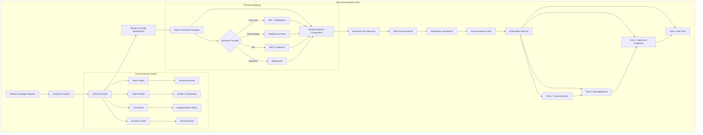

**Advanced Decomposition Techniques:**

1. **Multi-Level Intent Parser**:
   ```python
   class IntentParser:
       def __init__(self):
           self.action_mappings = {
               'add': ['create', 'implement', 'insert'],
               'remove': ['delete', 'drop', 'eliminate'],
               'update': ['modify', 'change', 'alter'],
               'secure': ['authenticate', 'authorize', 'encrypt']
           }
           self.concept_mappings = {
               'user authentication': {
                   'technical': ['jwt', 'session', 'oauth'],
                   'components': ['middleware', 'routes', 'database'],
                   'patterns': ['bearer token', 'refresh token']
               }
           }
           
       def parse_intent(self, request):
           # Extract core components
           actions = self.extract_actions(request)
           entities = self.extract_entities(request)
           constraints = self.extract_constraints(request)
           
           # Build intent model
           intent = {
               'primary_action': self.identify_primary_action(actions),
               'target_entities': self.map_entities_to_components(entities),
               'requirements': self.interpret_constraints(constraints),
               'implicit_requirements': self.infer_implicit_needs(request)
           }
           
           return intent
           
       def infer_implicit_needs(self, request):
           # Identify what user didn't say but probably needs
           implicit = []
           
           if 'api' in request.lower():
               implicit.extend(['error handling', 'validation', 'documentation'])
           if 'user' in request.lower():
               implicit.extend(['security', 'data privacy', 'session management'])
               
           return implicit
   ```

2. **Context-Aware Task Generator**:
   ```python
   class TaskGenerator:
       def generate_tasks(self, intent, project_context):
           tasks = []
           
           # For each component needed
           for component in intent['target_entities']:
               # Check what already exists
               existing = self.find_existing_implementation(component, project_context)
               
               if existing:
                   # Generate modification tasks
                   tasks.extend(self.generate_modification_tasks(component, existing))
               else:
                   # Generate creation tasks
                   tasks.extend(self.generate_creation_tasks(component))
                   
           # Add cross-cutting concerns
           tasks.extend(self.add_cross_cutting_tasks(intent))
           
           # Optimize task order
           return self.optimize_task_order(tasks)
   ```

3. **Requirement Validation System**:
   - Completeness checking (are all aspects covered?)
   - Consistency validation (do requirements conflict?)
   - Feasibility analysis (can this be implemented?)
   - Gap identification (what's missing?)

## 5. Intelligent Code Generation with Pattern Recognition

### Comprehensive Explanation

This flow enables Claude Code to generate code that seamlessly integrates with existing codebases by learning and applying project-specific patterns. It goes beyond syntax to understand architectural decisions and design philosophies.

**Pattern Recognition Architecture:**

The system analyzes code at multiple levels:
1. **Syntactic Patterns**: Naming conventions, formatting styles
2. **Structural Patterns**: How code is organized within files
3. **Architectural Patterns**: Design patterns and architectural styles
4. **Behavioral Patterns**: Error handling, logging, validation approaches

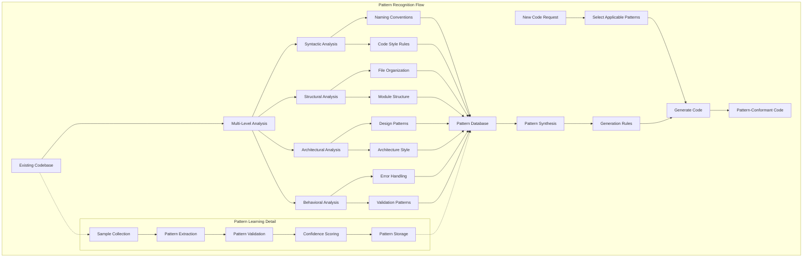

**Advanced Pattern Recognition Implementation:**

1. **Multi-Level Pattern Analyzer**:
   ```python
   class PatternAnalyzer:
       def __init__(self):
           self.patterns = {
               'naming': {},
               'structure': {},
               'architecture': {},
               'behavioral': {}
           }
           
       def analyze_codebase(self, codebase_path):
           # Collect all code samples
           samples = self.collect_code_samples(codebase_path)
           
           # Analyze each level
           self.analyze_naming_patterns(samples)
           self.analyze_structural_patterns(samples)
           self.analyze_architectural_patterns(samples)
           self.analyze_behavioral_patterns(samples)
           
       def analyze_naming_patterns(self, samples):
           patterns = {
               'variable_naming': self.detect_case_style(samples, 'variables'),
               'function_naming': self.detect_case_style(samples, 'functions'),
               'class_naming': self.detect_case_style(samples, 'classes'),
               'file_naming': self.detect_file_naming_pattern(samples),
               'prefixes': self.detect_prefix_patterns(samples),
               'suffixes': self.detect_suffix_patterns(samples)
           }
           
           # Statistical validation
           for pattern_type, pattern in patterns.items():
               confidence = self.calculate_pattern_confidence(pattern)
               if confidence > 0.8:  # High confidence threshold
                   self.patterns['naming'][pattern_type] = pattern
                   
       def analyze_architectural_patterns(self, samples):
           # Detect high-level patterns
           patterns_found = []
           
           # Check for common architectures
           if self.detect_mvc_pattern(samples):
               patterns_found.append('mvc')
           if self.detect_repository_pattern(samples):
               patterns_found.append('repository')
           if self.detect_service_layer(samples):
               patterns_found.append('service_layer')
               
           # Detect dependency injection
           if self.detect_dependency_injection(samples):
               patterns_found.append('dependency_injection')
               
           self.patterns['architecture'] = patterns_found
   ```

2. **Context-Aware Code Generator**:
   ```python
   class PatternAwareGenerator:
       def __init__(self, pattern_db):
           self.patterns = pattern_db
           
       def generate_code(self, request, context):
           # Determine what type of code to generate
           code_type = self.classify_request(request)
           
           # Select relevant patterns
           applicable_patterns = self.select_patterns(code_type)
           
           # Generate code structure
           code_structure = self.generate_structure(request, applicable_patterns)
           
           # Apply patterns to structure
           code = self.apply_patterns(code_structure, applicable_patterns)
           
           # Ensure consistency with context
           code = self.ensure_consistency(code, context)
           
           return code
           
       def apply_patterns(self, structure, patterns):
           # Apply naming patterns
           structure = self.apply_naming_conventions(structure, patterns['naming'])
           
           # Apply structural patterns
           structure = self.apply_structural_patterns(structure, patterns['structure'])
           
           # Apply behavioral patterns
           structure = self.apply_behavioral_patterns(structure, patterns['behavioral'])
           
           return structure
   ```

3. **Pattern Confidence System**:
   - Statistical analysis of pattern frequency
   - Consistency checking across the codebase
   - Recent vs. legacy pattern detection
   - Team/author-specific pattern recognition

## 6. Debugging Through Systematic Analysis

### Comprehensive Explanation

This flow represents Claude Code's ability to approach debugging like an experienced developer - systematically, methodically, and with deep understanding of common failure modes and their solutions.

**Debugging Architecture:**

The system employs multiple debugging strategies:
1. **Static Analysis**: Examining code without execution
2. **Dynamic Analysis**: Understanding runtime behavior
3. **Trace Analysis**: Following execution paths
4. **State Analysis**: Examining variable states at key points

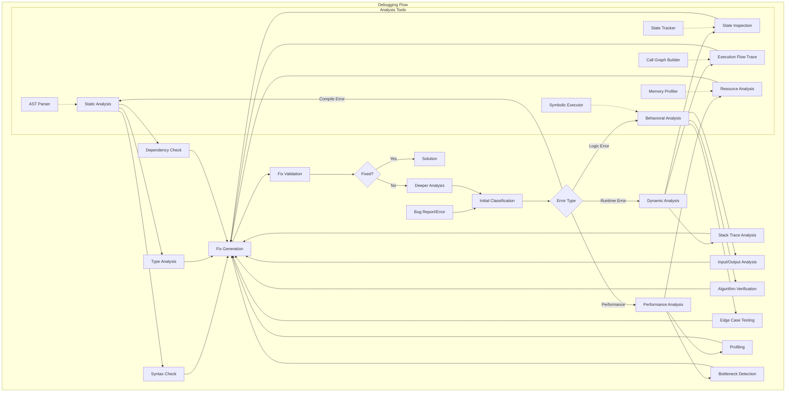

**Advanced Debugging Techniques:**

1. **Intelligent Stack Trace Analyzer**:
   ```python
   class StackTraceAnalyzer:
       def __init__(self):
           self.error_patterns = self.load_error_patterns()
           self.solution_database = self.load_solutions()
           
       def analyze_stack_trace(self, stack_trace):
           analysis = {
               'error_type': self.classify_error(stack_trace),
               'root_cause': self.find_root_cause(stack_trace),
               'call_chain': self.extract_call_chain(stack_trace),
               'variables_involved': self.extract_variables(stack_trace),
               'likely_fixes': []
           }
           
           # Pattern matching for known issues
           for pattern in self.error_patterns:
               if self.matches_pattern(stack_trace, pattern):
                   analysis['likely_fixes'].extend(
                       self.solution_database[pattern.id]
                   )
                   
           # Analyze specific error details
           if analysis['error_type'] == 'null_reference':
               analysis['null_source'] = self.trace_null_source(stack_trace)
           elif analysis['error_type'] == 'type_mismatch':
               analysis['type_conflict'] = self.analyze_type_conflict(stack_trace)
               
           return analysis
           
       def find_root_cause(self, stack_trace):
           # Work backwards through stack
           frames = self.parse_stack_frames(stack_trace)
           
           for i, frame in enumerate(reversed(frames)):
               # Check if this frame is in user code
               if self.is_user_code(frame):
                   # Analyze what could go wrong here
                   potential_issues = self.analyze_frame(frame)
                   if potential_issues:
                       return {
                           'location': frame,
                           'issues': potential_issues,
                           'distance_from_error': i
                       }
           
           return None
   ```

2. **Systematic Bug Hypothesis Generator**:
   ```python
   class BugHypothesisEngine:
       def generate_hypotheses(self, error_analysis):
           hypotheses = []
           
           # Based on error type
           if error_analysis['error_type'] == 'logic_error':
               hypotheses.extend(self.generate_logic_hypotheses(error_analysis))
           elif error_analysis['error_type'] == 'state_error':
               hypotheses.extend(self.generate_state_hypotheses(error_analysis))
               
           # Add context-specific hypotheses
           hypotheses.extend(self.generate_context_hypotheses(error_analysis))
           
           # Rank by probability
           return self.rank_hypotheses(hypotheses, error_analysis)
           
       def generate_logic_hypotheses(self, analysis):
           hypotheses = []
           
           # Off-by-one errors
           if 'loop' in analysis['context']:
               hypotheses.append({
                   'type': 'off_by_one',
                   'description': 'Loop boundary condition incorrect',
                   'fix_strategy': 'adjust_loop_bounds'
               })
               
           # Condition errors
           if 'conditional' in analysis['context']:
               hypotheses.append({
                   'type': 'condition_logic',
                   'description': 'Boolean logic error in condition',
                   'fix_strategy': 'review_boolean_logic'
               })
               
           return hypotheses
   ```

3. **Automated Debugging Instrumentation**:
   ```python
   class DebugInstrumenter:
       def add_debug_instrumentation(self, code, error_analysis):
           # Parse code to AST
           ast = self.parse_code(code)
           
           # Identify points of interest
           instrumentation_points = self.identify_debug_points(ast, error_analysis)
           
           # Add logging/inspection
           for point in instrumentation_points:
               self.add_inspection(ast, point)
               
           # Generate instrumented code
           return self.generate_code(ast)
           
       def identify_debug_points(self, ast, error_analysis):
           points = []
           
           # Add at error location
           if error_analysis['location']:
               points.append(error_analysis['location'])
               
           # Add at state changes
           for var in error_analysis['variables_involved']:
               points.extend(self.find_variable_mutations(ast, var))
               
           # Add at function boundaries
           points.extend(self.find_function_boundaries(ast))
           
           return points
   ```

## 7. Refactoring with Semantic Preservation

### Comprehensive Explanation

This flow ensures that code improvements maintain exact behavioral equivalence while enhancing structure, readability, and maintainability. It requires deep understanding of code semantics beyond syntax.

**Refactoring Architecture:**

The system operates with multiple safety nets:
1. **Semantic Analysis**: Understanding what code actually does
2. **Behavior Preservation**: Ensuring outputs remain identical
3. **Test Coverage**: Validating behavior through tests
4. **Incremental Transformation**: Making changes in small, safe steps

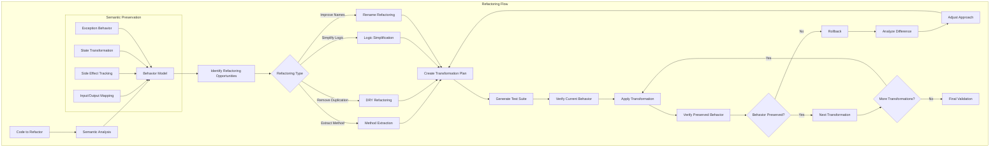

**Advanced Refactoring Techniques:**

1. **Semantic Equivalence Verifier**:
   ```python
   class SemanticPreservation:
       def __init__(self):
           self.behavior_model = {}
           
       def model_behavior(self, code):
           # Build comprehensive behavior model
           model = {
               'inputs': self.extract_inputs(code),
               'outputs': self.extract_outputs(code),
               'side_effects': self.identify_side_effects(code),
               'state_changes': self.track_state_changes(code),
               'exceptions': self.model_exception_behavior(code),
               'performance': self.model_performance_characteristics(code)
           }
           
           # Create test cases that exercise all paths
           model['test_cases'] = self.generate_comprehensive_tests(model)
           
           return model
           
       def verify_preservation(self, original, refactored):
           # Run both versions with same inputs
           for test_case in self.test_cases:
               original_result = self.execute_with_capture(original, test_case)
               refactored_result = self.execute_with_capture(refactored, test_case)
               
               # Compare all aspects
               if not self.results_equivalent(original_result, refactored_result):
                   return False, self.generate_difference_report(
                       original_result, refactored_result
                   )
                   
           return True, None
           
       def identify_side_effects(self, code):
           side_effects = []
           
           # File system operations
           side_effects.extend(self.find_file_operations(code))
           
           # Network calls
           side_effects.extend(self.find_network_operations(code))
           
           # Database operations
           side_effects.extend(self.find_database_operations(code))
           
           # Global state modifications
           side_effects.extend(self.find_global_mutations(code))
           
           return side_effects
   ```

2. **Safe Refactoring Transformer**:
   ```python
   class RefactoringTransformer:
       def __init__(self):
           self.transformations = []
           
       def extract_method(self, code, start_line, end_line, method_name):
           # Analyze extracted code
           extracted = self.get_code_slice(code, start_line, end_line)
           
           # Identify parameters needed
           params = self.identify_required_parameters(extracted, code)
           
           # Identify return values
           returns = self.identify_return_values(extracted, code)
           
           # Create method
           new_method = self.create_method(method_name, params, returns, extracted)
           
           # Replace with method call
           method_call = self.create_method_call(method_name, params, returns)
           
           # Apply transformation
           return self.apply_extraction(code, start_line, end_line, 
                                      new_method, method_call)
                                      
       def remove_duplication(self, code, duplicate_sections):
           # Find common pattern
           common_pattern = self.extract_common_pattern(duplicate_sections)
           
           # Parameterize differences
           parameterized = self.parameterize_pattern(common_pattern, 
                                                    duplicate_sections)
           
           # Create shared function
           shared_function = self.create_shared_function(parameterized)
           
           # Replace duplicates with calls
           for section in duplicate_sections:
               code = self.replace_with_call(code, section, shared_function)
               
           return code
   ```

3. **Incremental Refactoring Strategy**:
   - Start with smallest, safest changes
   - Validate after each micro-transformation
   - Build confidence through successful transformations
   - Maintain transformation history for rollback

## 8. Documentation Generation and Synchronization

### Comprehensive Explanation

This flow ensures documentation remains a living, accurate reflection of the codebase. It goes beyond simple comment generation to create meaningful, context-aware documentation that serves its intended audience.

**Documentation Architecture:**

The system generates documentation at multiple levels:
1. **API Documentation**: For external consumers
2. **Code Documentation**: For developers
3. **Architecture Documentation**: For system understanding
4. **Usage Documentation**: For end users

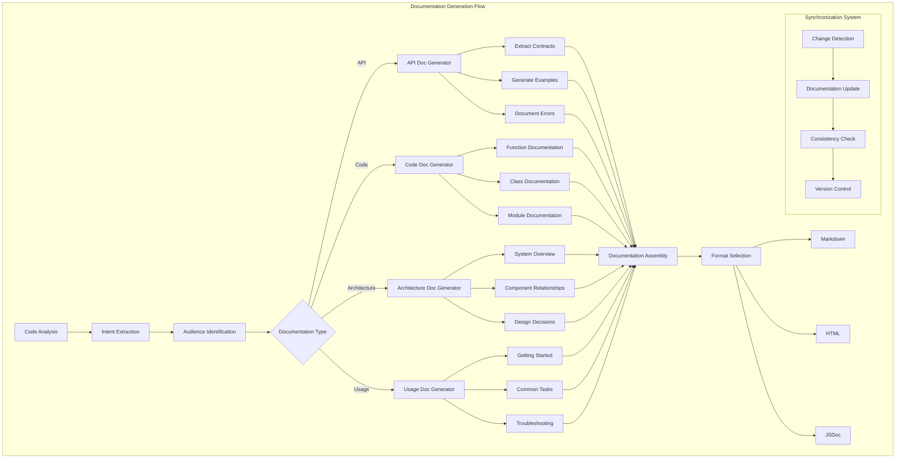

**Advanced Documentation Techniques:**

1. **Intelligent Documentation Generator**:
   ```python
   class DocumentationGenerator:
       def __init__(self):
           self.templates = self.load_templates()
           self.style_guide = self.load_style_guide()
           
       def generate_documentation(self, code_element):
           # Analyze what we're documenting
           element_type = self.identify_element_type(code_element)
           
           # Extract semantic information
           semantic_info = self.extract_semantic_info(code_element)
           
           # Determine audience
           audience = self.identify_audience(code_element)
           
           # Generate appropriate documentation
           doc = self.create_documentation(element_type, semantic_info, audience)
           
           # Add examples if appropriate
           if self.should_include_examples(element_type, audience):
               doc['examples'] = self.generate_examples(code_element)
               
           return doc
           
       def extract_semantic_info(self, code_element):
           info = {
               'purpose': self.infer_purpose(code_element),
               'parameters': self.analyze_parameters(code_element),
               'return_value': self.analyze_return(code_element),
               'side_effects': self.identify_side_effects(code_element),
               'error_handling': self.analyze_error_handling(code_element),
               'complexity': self.assess_complexity(code_element),
               'dependencies': self.identify_dependencies(code_element)
           }
           
           # Add context-specific information
           if self.is_api_endpoint(code_element):
               info['http_method'] = self.extract_http_method(code_element)
               info['route'] = self.extract_route(code_element)
               info['auth_required'] = self.check_auth_requirement(code_element)
               
           return info
           
       def infer_purpose(self, code_element):
           # Use multiple strategies
           purpose = []
           
           # Name analysis
           purpose.append(self.analyze_name_semantics(code_element.name))
           
           # Implementation analysis
           purpose.append(self.analyze_implementation(code_element.body))
           
           # Context analysis
           purpose.append(self.analyze_usage_context(code_element))
           
           # Synthesize into coherent purpose
           return self.synthesize_purpose(purpose)
   ```

2. **Documentation Synchronization Engine**:
   ```python
   class DocSynchronizer:
       def __init__(self):
           self.doc_index = self.build_documentation_index()
           
       def synchronize_documentation(self, code_changes):
           affected_docs = []
           
           for change in code_changes:
               # Find related documentation
               related_docs = self.find_related_documentation(change)
               
               for doc in related_docs:
                   # Analyze impact
                   impact = self.analyze_change_impact(change, doc)
                   
                   if impact.requires_update:
                       # Generate updated documentation
                       updated_doc = self.update_documentation(doc, change, impact)
                       affected_docs.append(updated_doc)
                       
           # Verify consistency across all docs
           self.verify_documentation_consistency(affected_docs)
           
           return affected_docs
           
       def analyze_change_impact(self, change, doc):
           impact = DocumentationImpact()
           
           # Check if signatures changed
           if change.type == 'signature_change':
               impact.requires_update = True
               impact.update_type = 'parameter_documentation'
               
           # Check if behavior changed
           elif change.type == 'logic_change':
               if self.affects_documented_behavior(change, doc):
                   impact.requires_update = True
                   impact.update_type = 'behavior_description'
                   
           # Check if examples need updating
           if doc.has_examples and self.examples_affected(change, doc):
               impact.example_updates_needed = True
               
           return impact
   ```

3. **Context-Aware Example Generator**:
   ```python
   class ExampleGenerator:
       def generate_examples(self, code_element, documentation_context):
           examples = []
           
           # Analyze common use cases
           use_cases = self.identify_use_cases(code_element)
           
           for use_case in use_cases[:3]:  # Top 3 most common
               example = self.create_example(code_element, use_case)
               examples.append(example)
               
           # Add edge case example if complex
           if self.is_complex(code_element):
               edge_case = self.generate_edge_case_example(code_element)
               examples.append(edge_case)
               
           return examples
           
       def create_example(self, code_element, use_case):
           # Generate realistic inputs
           inputs = self.generate_realistic_inputs(code_element, use_case)
           
           # Show the call
           call_example = self.format_call(code_element, inputs)
           
           # Show expected output
           output = self.calculate_expected_output(code_element, inputs)
           
           # Create complete example
           return {
               'description': use_case.description,
               'code': call_example,
               'output': output,
               'explanation': self.explain_example(use_case)
           }
   ```

## 9. Dependency Management and Integration

### Comprehensive Explanation

This flow handles the complex task of managing external dependencies, ensuring compatibility, security, and optimal integration with the existing codebase.

**Dependency Management Architecture:**

The system manages dependencies through multiple lenses:
1. **Compatibility Analysis**: Version compatibility checking
2. **Security Scanning**: Identifying vulnerable dependencies
3. **Performance Impact**: Assessing bundle size and runtime impact
4. **Integration Planning**: How to properly integrate new dependencies

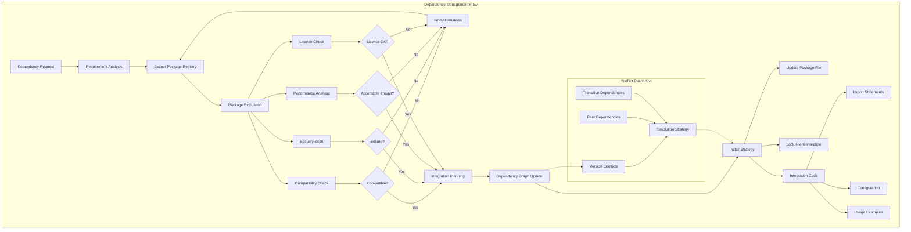

**Advanced Dependency Management Implementation:**

1. **Intelligent Dependency Resolver**:
   ```python
   class DependencyResolver:
       def __init__(self):
           self.registry_client = PackageRegistryClient()
           self.security_db = SecurityDatabase()
           self.compatibility_matrix = {}
           
       def resolve_dependency(self, package_request, project_context):
           # Parse the request
           package_name, version_constraint = self.parse_request(package_request)
           
           # Find available versions
           available_versions = self.registry_client.get_versions(package_name)
           
           # Filter by constraints
           candidate_versions = self.filter_by_constraint(
               available_versions, version_constraint
           )
           
           # Evaluate each candidate
           evaluations = []
           for version in candidate_versions:
               evaluation = self.evaluate_version(
                   package_name, version, project_context
               )
               evaluations.append(evaluation)
               
           # Select best version
           best_version = self.select_optimal_version(evaluations)
           
           # Plan integration
           integration_plan = self.create_integration_plan(
               package_name, best_version, project_context
           )
           
           return integration_plan
           
       def evaluate_version(self, package, version, context):
           evaluation = {
               'version': version,
               'compatibility_score': self.check_compatibility(package, version, context),
               'security_score': self.check_security(package, version),
               'performance_impact': self.analyze_performance_impact(package, version),
               'dependency_conflicts': self.check_conflicts(package, version, context),
               'community_score': self.assess_community_health(package, version)
           }
           
           # Calculate overall score
           evaluation['overall_score'] = self.calculate_score(evaluation)
           
           return evaluation
           
       def check_compatibility(self, package, version, context):
           # Check against existing dependencies
           compatibility_issues = []
           
           for existing_dep in context.dependencies:
               if self.has_conflict(package, version, existing_dep):
                   compatibility_issues.append({
                       'type': 'version_conflict',
                       'with': existing_dep,
                       'severity': self.assess_severity(package, existing_dep)
                   })
                   
           # Check Node/runtime version requirements
           runtime_compat = self.check_runtime_compatibility(package, version, context)
           
           return self.score_compatibility(compatibility_issues, runtime_compat)
   ```

2. **Security-First Integration**:
   ```python
   class SecureDependencyManager:
       def __init__(self):
           self.vulnerability_db = VulnerabilityDatabase()
           self.audit_log = AuditLog()
           
       def security_scan(self, package, version):
           scan_results = {
               'vulnerabilities': [],
               'risk_score': 0,
               'last_updated': None,
               'maintenance_status': None
           }
           
           # Check known vulnerabilities
           vulns = self.vulnerability_db.check(package, version)
           scan_results['vulnerabilities'] = vulns
           
           # Analyze update frequency
           update_info = self.analyze_update_patterns(package)
           scan_results['maintenance_status'] = update_info['status']
           scan_results['last_updated'] = update_info['last_release']
           
           # Check dependency tree for transitive vulnerabilities
           transitive_vulns = self.scan_dependencies(package, version)
           scan_results['transitive_vulnerabilities'] = transitive_vulns
           
           # Calculate overall risk
           scan_results['risk_score'] = self.calculate_risk_score(scan_results)
           
           # Log for audit
           self.audit_log.record_scan(package, version, scan_results)
           
           return scan_results
           
       def recommend_secure_alternative(self, package, current_version):
           # Find all versions
           all_versions = self.get_all_versions(package)
           
           # Security scan each
           secure_versions = []
           for version in all_versions:
               if self.is_secure(package, version):
                   secure_versions.append(version)
                   
           # Find closest secure version
           return self.find_closest_compatible(secure_versions, current_version)
   ```

3. **Smart Integration Generator**:
   ```python
   class IntegrationGenerator:
       def generate_integration_code(self, package, version, context):
           integration = {
               'imports': [],
               'configuration': [],
               'initialization': [],
               'usage_examples': []
           }
           
           # Analyze package structure
           package_info = self.analyze_package_structure(package, version)
           
           # Generate appropriate imports
           if package_info['type'] == 'esm':
               integration['imports'] = self.generate_esm_imports(package_info)
           else:
               integration['imports'] = self.generate_commonjs_imports(package_info)
               
           # Generate configuration if needed
           if package_info['requires_config']:
               integration['configuration'] = self.generate_configuration(
                   package_info, context
               )
               
           # Generate initialization code
           if package_info['requires_init']:
               integration['initialization'] = self.generate_initialization(
                   package_info
               )
               
           # Generate usage examples
           integration['usage_examples'] = self.generate_usage_examples(
               package_info, context
           )
           
           return integration
   ```

## 10. Performance Optimization Through Profiling Integration

### Comprehensive Explanation

This flow represents Claude Code's ability to systematically identify and resolve performance bottlenecks through data-driven analysis and targeted optimizations.

**Performance Optimization Architecture:**

The system approaches performance holistically:
1. **Measurement**: Establishing performance baselines
2. **Profiling**: Identifying bottlenecks through various profiling techniques
3. **Analysis**: Understanding why bottlenecks exist
4. **Optimization**: Applying targeted improvements
5. **Validation**: Ensuring optimizations actually improve performance

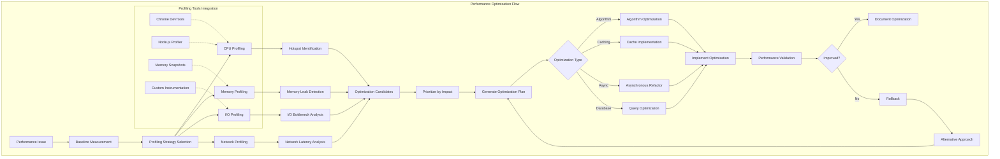

**Advanced Performance Optimization Implementation:**

1. **Intelligent Performance Analyzer**:
   ```python
   class PerformanceAnalyzer:
       def __init__(self):
           self.profiler = ProfilerInterface()
           self.baseline_db = BaselineDatabase()
           self.optimization_patterns = OptimizationPatterns()
           
       def analyze_performance(self, code_section, performance_goals):
           # Establish baseline
           baseline = self.measure_baseline(code_section)
           self.baseline_db.store(code_section.id, baseline)
           
           # Multi-dimensional profiling
           profile_data = {
               'cpu': self.profile_cpu_usage(code_section),
               'memory': self.profile_memory_usage(code_section),
               'io': self.profile_io_operations(code_section),
               'concurrency': self.profile_concurrency(code_section)
           }
           
           # Identify bottlenecks
           bottlenecks = self.identify_bottlenecks(profile_data, performance_goals)
           
           # Generate optimization strategies
           strategies = []
           for bottleneck in bottlenecks:
               strategy = self.generate_optimization_strategy(bottleneck, code_section)
               strategies.append(strategy)
               
           # Rank by expected impact
           return self.rank_strategies(strategies, performance_goals)
           
       def identify_bottlenecks(self, profile_data, goals):
           bottlenecks = []
           
           # CPU bottlenecks
           cpu_hotspots = self.find_cpu_hotspots(profile_data['cpu'])
           for hotspot in cpu_hotspots:
               if hotspot.time_percentage > goals.max_cpu_percentage:
                   bottlenecks.append({
                       'type': 'cpu_intensive',
                       'location': hotspot.location,
                       'impact': hotspot.time_percentage,
                       'details': self.analyze_cpu_intensive_code(hotspot)
                   })
                   
           # Memory bottlenecks
           memory_issues = self.find_memory_issues(profile_data['memory'])
           for issue in memory_issues:
               bottlenecks.append({
                   'type': issue.type,  # 'leak', 'excessive_allocation', etc.
                   'location': issue.location,
                   'impact': issue.memory_impact,
                   'details': self.analyze_memory_pattern(issue)
               })
               
           return bottlenecks
   ```

2. **Optimization Strategy Generator**:
   ```python
   class OptimizationGenerator:
       def generate_optimization(self, bottleneck, code_context):
           # Select appropriate optimization technique
           if bottleneck['type'] == 'cpu_intensive':
               return self.optimize_cpu_intensive(bottleneck, code_context)
           elif bottleneck['type'] == 'memory_leak':
               return self.fix_memory_leak(bottleneck, code_context)
           elif bottleneck['type'] == 'blocking_io':
               return self.optimize_io(bottleneck, code_context)
               
       def optimize_cpu_intensive(self, bottleneck, context):
           optimizations = []
           
           # Algorithm optimization
           if bottleneck['details']['algorithm_complexity'] > 'O(n)':
               better_algorithm = self.find_better_algorithm(bottleneck['details'])
               if better_algorithm:
                   optimizations.append({
                       'type': 'algorithm_replacement',
                       'current_complexity': bottleneck['details']['algorithm_complexity'],
                       'new_complexity': better_algorithm['complexity'],
                       'implementation': better_algorithm['code']
                   })
                   
           # Caching opportunities
           if bottleneck['details']['repeated_calculations']:
               cache_strategy = self.design_cache_strategy(bottleneck['details'])
               optimizations.append({
                   'type': 'caching',
                   'cache_type': cache_strategy['type'],
                   'implementation': cache_strategy['code']
               })
               
           # Parallelization opportunities
           if bottleneck['details']['parallelizable']:
               parallel_strategy = self.design_parallel_strategy(bottleneck['details'])
               optimizations.append({
                   'type': 'parallelization',
                   'approach': parallel_strategy['approach'],
                   'implementation': parallel_strategy['code']
               })
               
           return optimizations
           
       def design_cache_strategy(self, bottleneck_details):
           # Analyze access patterns
           access_pattern = self.analyze_access_pattern(bottleneck_details)
           
           # Select appropriate cache type
           if access_pattern['type'] == 'lru':
               return self.generate_lru_cache(bottleneck_details)
           elif access_pattern['type'] == 'time_based':
               return self.generate_ttl_cache(bottleneck_details)
           elif access_pattern['type'] == 'size_based':
               return self.generate_size_limited_cache(bottleneck_details)
   ```

3. **Performance Validation Framework**:
   ```python
   class PerformanceValidator:
       def validate_optimization(self, original_code, optimized_code, metrics):
           validation_results = {
               'performance_improvement': {},
               'correctness_verified': False,
               'regression_tests_passed': False,
               'recommendation': None
           }
           
           # Measure performance improvement
           original_perf = self.measure_performance(original_code)
           optimized_perf = self.measure_performance(optimized_code)
           
           validation_results['performance_improvement'] = {
               'cpu_time': self.calculate_improvement(
                   original_perf['cpu_time'], 
                   optimized_perf['cpu_time']
               ),
               'memory_usage': self.calculate_improvement(
                   original_perf['memory_usage'], 
                   optimized_perf['memory_usage']
               ),
               'response_time': self.calculate_improvement(
                   original_perf['response_time'], 
                   optimized_perf['response_time']
               )
           }
           
           # Verify correctness
           validation_results['correctness_verified'] = self.verify_correctness(
               original_code, optimized_code
           )
           
           # Run regression tests
           validation_results['regression_tests_passed'] = self.run_regression_tests(
               optimized_code
           )
           
           # Make recommendation
           if (validation_results['correctness_verified'] and 
               validation_results['regression_tests_passed'] and
               self.is_significant_improvement(validation_results['performance_improvement'])):
               validation_results['recommendation'] = 'APPLY_OPTIMIZATION'
           else:
               validation_results['recommendation'] = 'REJECT_OPTIMIZATION'
               validation_results['rejection_reason'] = self.analyze_rejection_reason(
                   validation_results
               )
               
           return validation_results
   ```

---

## Integration and Synergy

These ten flows don't operate in isolation - they form an integrated system where each flow enhances the others:

1. **Context Navigation** provides the foundation for all other flows
2. **Pattern Recognition** improves the quality of **Code Generation**
3. **Testing** validates both **Refactoring** and **Optimization**
4. **Documentation** is updated through **Multi-File Editing**
5. **Debugging** benefits from **Performance Profiling** data

The true power of Claude Code comes from this integration, creating a development experience that mirrors and enhances human developer workflows while handling the complexity of modern software development.

To replicate this system, focus on:
1. Building strong foundational capabilities (context understanding)
2. Creating feedback loops between components
3. Maintaining semantic understanding throughout all operations
4. Prioritizing correctness and safety in all transformations
5. Learning from each operation to improve future performance

This comprehensive system represents a new paradigm in AI-assisted development, where the AI truly understands and works with code at a semantic level rather than just manipulating syntax.


# Comprehensive POC Development Plan: AI Code Assistant System

## System Architecture Overview

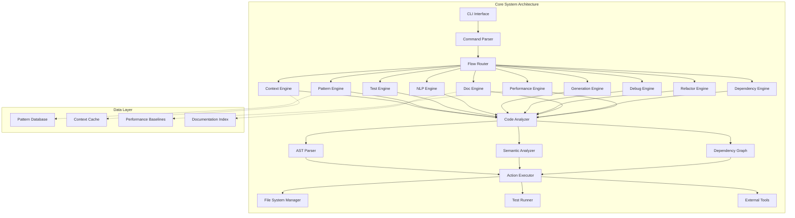

## Detailed File Structure

```
ai-code-assistant/
├── package.json
├── tsconfig.json
├── .env.example
├── README.md
├── src/
│   ├── cli/
│   │   ├── index.ts                 # Main CLI entry point
│   │   ├── commands/
│   │   │   ├── analyze.ts           # Context analysis command
│   │   │   ├── generate.ts          # Code generation command
│   │   │   ├── refactor.ts          # Refactoring command
│   │   │   ├── debug.ts             # Debugging command
│   │   │   ├── test.ts              # Test-driven development command
│   │   │   ├── document.ts          # Documentation command
│   │   │   ├── optimize.ts          # Performance optimization command
│   │   │   ├── integrate.ts         # Dependency management command
│   │   │   └── multi-file.ts        # Multi-file editing command
│   │   └── parser.ts                # Command parser
│   │
│   ├── engines/
│   │   ├── context/
│   │   │   ├── ContextEngine.ts
│   │   │   ├── FileSystemNavigator.ts
│   │   │   ├── DependencyGraphBuilder.ts
│   │   │   └── ProjectAnalyzer.ts
│   │   │
│   │   ├── pattern/
│   │   │   ├── PatternEngine.ts
│   │   │   ├── PatternExtractor.ts
│   │   │   ├── PatternMatcher.ts
│   │   │   └── StyleAnalyzer.ts
│   │   │
│   │   ├── test/
│   │   │   ├── TestEngine.ts
│   │   │   ├── TestRunner.ts
│   │   │   ├── FailureAnalyzer.ts
│   │   │   └── FixGenerator.ts
│   │   │
│   │   ├── nlp/
│   │   │   ├── NLPEngine.ts
│   │   │   ├── IntentParser.ts
│   │   │   ├── TaskDecomposer.ts
│   │   │   └── RequirementAnalyzer.ts
│   │   │
│   │   ├── generation/
│   │   │   ├── GenerationEngine.ts
│   │   │   ├── CodeGenerator.ts
│   │   │   ├── TemplateManager.ts
│   │   │   └── PatternApplicator.ts
│   │   │
│   │   ├── debug/
│   │   │   ├── DebugEngine.ts
│   │   │   ├── ErrorAnalyzer.ts
│   │   │   ├── StackTraceParser.ts
│   │   │   └── FixSuggester.ts
│   │   │
│   │   ├── refactor/
│   │   │   ├── RefactorEngine.ts
│   │   │   ├── SemanticPreserver.ts
│   │   │   ├── TransformationPlanner.ts
│   │   │   └── SafetyValidator.ts
│   │   │
│   │   ├── documentation/
│   │   │   ├── DocEngine.ts
│   │   │   ├── DocGenerator.ts
│   │   │   ├── DocSynchronizer.ts
│   │   │   └── ExampleGenerator.ts
│   │   │
│   │   ├── dependency/
│   │   │   ├── DependencyEngine.ts
│   │   │   ├── PackageAnalyzer.ts
│   │   │   ├── ConflictResolver.ts
│   │   │   └── SecurityScanner.ts
│   │   │
│   │   └── performance/
│   │       ├── PerformanceEngine.ts
│   │       ├── Profiler.ts
│   │       ├── BottleneckAnalyzer.ts
│   │       └── OptimizationGenerator.ts
│   │
│   ├── core/
│   │   ├── AST/
│   │   │   ├── ASTParser.ts
│   │   │   ├── ASTTraverser.ts
│   │   │   └── ASTManipulator.ts
│   │   │
│   │   ├── SemanticAnalyzer.ts
│   │   ├── FileSystemManager.ts
│   │   ├── ConfigManager.ts
│   │   └── Logger.ts
│   │
│   ├── utils/
│   │   ├── cache/
│   │   │   ├── CacheManager.ts
│   │   │   └── LRUCache.ts
│   │   │
│   │   ├── database/
│   │   │   ├── PatternDB.ts
│   │   │   ├── ContextDB.ts
│   │   │   └── PerformanceDB.ts
│   │   │
│   │   └── helpers/
│   │       ├── DiffGenerator.ts
│   │       ├── CodeFormatter.ts
│   │       └── ProgressTracker.ts
│   │
│   └── interfaces/
│       ├── IEngine.ts
│       ├── IAnalyzer.ts
│       ├── IGenerator.ts
│       └── types.ts
│
├── scripts/
│   ├── demo/
│   │   ├── run-all-flows.ts         # Demonstrates all 10 flows
│   │   ├── flow-demos/
│   │   │   ├── 01-context-demo.ts
│   │   │   ├── 02-multifile-demo.ts
│   │   │   ├── 03-testing-demo.ts
│   │   │   ├── 04-nlp-demo.ts
│   │   │   ├── 05-pattern-demo.ts
│   │   │   ├── 06-debug-demo.ts
│   │   │   ├── 07-refactor-demo.ts
│   │   │   ├── 08-doc-demo.ts
│   │   │   ├── 09-dependency-demo.ts
│   │   │   └── 10-performance-demo.ts
│   │   └── interactive-demo.ts      # Interactive demonstration
│   │
│   ├── generators/
│   │   ├── generate-test-project.ts # Creates sample projects
│   │   ├── generate-bug-scenarios.ts
│   │   ├── generate-performance-issues.ts
│   │   └── generate-refactor-candidates.ts
│   │
│   └── benchmarks/
│       ├── performance-benchmark.ts
│       ├── accuracy-benchmark.ts
│       └── compare-flows.ts
│
├── test-projects/                   # Generated test projects
│   ├── express-api/
│   ├── react-app/
│   ├── cli-tool/
│   └── microservice/
│
├── tests/
│   ├── unit/
│   ├── integration/
│   └── e2e/
│
└── docs/
    ├── architecture.md
    ├── flow-specifications/
    └── api-reference/
```

## Detailed Implementation Plan

### Phase 1: Core Infrastructure (Week 1-2)

#### 1.1 Base CLI Framework

```typescript
// src/cli/index.ts
#!/usr/bin/env node
import { Command } from 'commander';
import chalk from 'chalk';
import { ContextCommand } from './commands/analyze';
import { GenerateCommand } from './commands/generate';
import { ConfigManager } from '../core/ConfigManager';
import { Logger } from '../core/Logger';

class AICodeAssistantCLI {
    private program: Command;
    private config: ConfigManager;
    private logger: Logger;

    constructor() {
        this.program = new Command();
        this.config = new ConfigManager();
        this.logger = new Logger();
        this.setupCommands();
    }

    private setupCommands(): void {
        this.program
            .name('ai-code')
            .description('AI-powered code assistant with 10 advanced flows')
            .version('1.0.0');

        // Flow 1: Context-aware navigation
        this.program
            .command('analyze <path>')
            .description('Analyze project structure and build context')
            .option('-d, --depth <number>', 'analysis depth', '3')
            .option('--cache', 'use cached analysis')
            .action(async (path, options) => {
                const command = new ContextCommand(this.config, this.logger);
                await command.execute(path, options);
            });

        // Flow 2: Multi-file editing
        this.program
            .command('edit <feature>')
            .description('Implement feature across multiple files')
            .option('-p, --plan', 'show plan without executing')
            .option('--dry-run', 'simulate changes')
            .action(async (feature, options) => {
                const command = new MultiFileCommand(this.config, this.logger);
                await command.execute(feature, options);
            });

        // Additional commands for all 10 flows...
    }

    public async run(): Promise<void> {
        try {
            await this.config.load();
            this.program.parse(process.argv);
        } catch (error) {
            this.logger.error('CLI Error:', error);
            process.exit(1);
        }
    }
}

// Entry point
const cli = new AICodeAssistantCLI();
cli.run();
```

#### 1.2 Core Analyzer Infrastructure

```typescript
// src/core/AST/ASTParser.ts
import * as parser from '@babel/parser';
import traverse from '@babel/traverse';
import * as t from '@babel/types';
import { ParseResult, ASTNode } from '../../interfaces/types';

export class ASTParser {
    private parserOptions: parser.ParserOptions;

    constructor() {
        this.parserOptions = {
            sourceType: 'module',
            plugins: [
                'typescript',
                'jsx',
                'decorators-legacy',
                'classProperties',
                'asyncGenerators'
            ]
        };
    }

    public parse(code: string, filename: string): ParseResult {
        try {
            const ast = parser.parse(code, {
                ...this.parserOptions,
                sourceFilename: filename
            });

            return {
                ast,
                errors: [],
                metadata: this.extractMetadata(ast)
            };
        } catch (error) {
            return {
                ast: null,
                errors: [error],
                metadata: null
            };
        }
    }

    private extractMetadata(ast: t.File): any {
        const metadata = {
            imports: [],
            exports: [],
            classes: [],
            functions: [],
            variables: []
        };

        traverse(ast, {
            ImportDeclaration(path) {
                metadata.imports.push({
                    source: path.node.source.value,
                    specifiers: path.node.specifiers.map(spec => ({
                        type: spec.type,
                        name: spec.local.name
                    }))
                });
            },
            ExportDeclaration(path) {
                // Extract export information
            },
            ClassDeclaration(path) {
                metadata.classes.push({
                    name: path.node.id.name,
                    methods: this.extractClassMethods(path.node)
                });
            },
            FunctionDeclaration(path) {
                metadata.functions.push({
                    name: path.node.id.name,
                    params: path.node.params.length,
                    async: path.node.async
                });
            }
        });

        return metadata;
    }
}
```

### Phase 2: Individual Flow Engines (Week 3-6)

#### 2.1 Context Engine Implementation

```typescript
// src/engines/context/ContextEngine.ts
import { FileSystemNavigator } from './FileSystemNavigator';
import { DependencyGraphBuilder } from './DependencyGraphBuilder';
import { ProjectAnalyzer } from './ProjectAnalyzer';
import { IEngine } from '../../interfaces/IEngine';

export class ContextEngine implements IEngine {
    private navigator: FileSystemNavigator;
    private graphBuilder: DependencyGraphBuilder;
    private analyzer: ProjectAnalyzer;
    private contextCache: Map<string, ProjectContext>;

    constructor() {
        this.navigator = new FileSystemNavigator();
        this.graphBuilder = new DependencyGraphBuilder();
        this.analyzer = new ProjectAnalyzer();
        this.contextCache = new Map();
    }

    public async analyzeProject(projectPath: string): Promise<ProjectContext> {
        // Check cache first
        if (this.contextCache.has(projectPath)) {
            return this.contextCache.get(projectPath);
        }

        // Phase 1: Scan file system
        const fileStructure = await this.navigator.scanProject(projectPath);
        
        // Phase 2: Build dependency graph
        const dependencyGraph = await this.graphBuilder.build(fileStructure);
        
        // Phase 3: Analyze project type and patterns
        const projectAnalysis = await this.analyzer.analyze(
            fileStructure, 
            dependencyGraph
        );

        // Phase 4: Build context model
        const context: ProjectContext = {
            path: projectPath,
            type: projectAnalysis.projectType,
            structure: fileStructure,
            dependencies: dependencyGraph,
            patterns: projectAnalysis.patterns,
            entryPoints: projectAnalysis.entryPoints,
            testStructure: projectAnalysis.testStructure,
            buildConfig: projectAnalysis.buildConfig
        };

        // Cache the context
        this.contextCache.set(projectPath, context);

        return context;
    }

    public async getRelevantFiles(
        context: ProjectContext, 
        task: string
    ): Promise<string[]> {
        // Intelligent file selection based on task
        const taskKeywords = this.extractKeywords(task);
        const relevantFiles = [];

        // Start from entry points
        const queue = [...context.entryPoints];
        const visited = new Set<string>();

        while (queue.length > 0) {
            const file = queue.shift();
            if (visited.has(file)) continue;
            visited.add(file);

            // Check relevance
            if (this.isRelevant(file, taskKeywords, context)) {
                relevantFiles.push(file);
            }

            // Add dependencies to queue
            const deps = context.dependencies.getDependencies(file);
            queue.push(...deps.filter(d => !visited.has(d)));
        }

        return relevantFiles;
    }
}
```

#### 2.2 Pattern Recognition Engine

```typescript
// src/engines/pattern/PatternEngine.ts
export class PatternEngine implements IEngine {
    private patterns: Map<string, Pattern>;
    private extractors: PatternExtractor[];

    constructor() {
        this.patterns = new Map();
        this.extractors = [
            new NamingPatternExtractor(),
            new StructuralPatternExtractor(),
            new ArchitecturalPatternExtractor(),
            new BehavioralPatternExtractor()
        ];
    }

    public async analyzePatterns(
        codebase: CodebaseStructure
    ): Promise<PatternAnalysis> {
        const analysis: PatternAnalysis = {
            naming: {},
            structural: {},
            architectural: {},
            behavioral: {}
        };

        // Run all extractors
        for (const extractor of this.extractors) {
            const patterns = await extractor.extract(codebase);
            this.mergePatterns(analysis, patterns);
        }

        // Validate and score patterns
        this.validatePatterns(analysis);
        
        return analysis;
    }

    public async applyPatterns(
        code: string, 
        patterns: PatternAnalysis
    ): Promise<string> {
        let transformedCode = code;

        // Apply naming patterns
        transformedCode = this.applyNamingPatterns(transformedCode, patterns.naming);
        
        // Apply structural patterns
        transformedCode = this.applyStructuralPatterns(
            transformedCode, 
            patterns.structural
        );

        // Ensure consistency
        transformedCode = this.ensureConsistency(transformedCode, patterns);

        return transformedCode;
    }

    private applyNamingPatterns(code: string, namingPatterns: any): string {
        const ast = parseCode(code);
        
        traverse(ast, {
            Identifier(path) {
                const { node, parent } = path;
                
                // Apply variable naming
                if (t.isVariableDeclarator(parent)) {
                    const newName = this.transformName(
                        node.name, 
                        namingPatterns.variables
                    );
                    if (newName !== node.name) {
                        path.scope.rename(node.name, newName);
                    }
                }
                
                // Apply function naming
                if (t.isFunctionDeclaration(parent)) {
                    const newName = this.transformName(
                        node.name, 
                        namingPatterns.functions
                    );
                    if (newName !== node.name) {
                        path.scope.rename(node.name, newName);
                    }
                }
            }
        });

        return generate(ast).code;
    }
}
```

### Phase 3: Integration Layer (Week 7-8)

#### 3.1 Flow Router and Orchestrator

```typescript
// src/core/FlowOrchestrator.ts
export class FlowOrchestrator {
    private engines: Map<FlowType, IEngine>;
    private executionPlanner: ExecutionPlanner;
    
    constructor() {
        this.engines = new Map([
            [FlowType.Context, new ContextEngine()],
            [FlowType.Pattern, new PatternEngine()],
            [FlowType.Test, new TestEngine()],
            [FlowType.NLP, new NLPEngine()],
            [FlowType.Generation, new GenerationEngine()],
            [FlowType.Debug, new DebugEngine()],
            [FlowType.Refactor, new RefactorEngine()],
            [FlowType.Documentation, new DocEngine()],
            [FlowType.Dependency, new DependencyEngine()],
            [FlowType.Performance, new PerformanceEngine()]
        ]);
        
        this.executionPlanner = new ExecutionPlanner();
    }

    public async executeFlow(
        flowType: FlowType, 
        input: any, 
        context: ProjectContext
    ): Promise<FlowResult> {
        const engine = this.engines.get(flowType);
        if (!engine) {
            throw new Error(`Unknown flow type: ${flowType}`);
        }

        // Pre-execution setup
        const executionContext = await this.prepareExecution(
            flowType, 
            input, 
            context
        );

        // Execute flow
        const result = await engine.execute(executionContext);

        // Post-execution processing
        await this.postProcess(result, context);

        return result;
    }

    public async executeCompositeFlow(
        flows: FlowType[], 
        input: any, 
        context: ProjectContext
    ): Promise<CompositeFlowResult> {
        // Plan execution order
        const executionPlan = this.executionPlanner.plan(flows, context);
        
        const results: FlowResult[] = [];
        let intermediateData = input;

        for (const step of executionPlan) {
            const result = await this.executeFlow(
                step.flowType, 
                intermediateData, 
                context
            );
            
            results.push(result);
            
            // Transform output for next flow
            intermediateData = this.transformOutput(result, step.nextFlow);
        }

        return {
            success: results.every(r => r.success),
            results,
            finalOutput: intermediateData
        };
    }
}
```

### Phase 4: Demo Scripts and Generators (Week 9-10)

#### 4.1 Comprehensive Demo Script

```typescript
// scripts/demo/run-all-flows.ts
import { AICodeAssistant } from '../src/cli';
import { TestProjectGenerator } from './generators/test-project-generator';
import chalk from 'chalk';
import ora from 'ora';

class ComprehensiveDemoRunner {
    private assistant: AICodeAssistant;
    private projectGenerator: TestProjectGenerator;

    constructor() {
        this.assistant = new AICodeAssistant();
        this.projectGenerator = new TestProjectGenerator();
    }

    public async runFullDemo(): Promise<void> {
        console.log(chalk.bold.blue('🚀 AI Code Assistant - Full Demo\n'));

        // Generate test project
        const spinner = ora('Generating test project...').start();
        const projectPath = await this.projectGenerator.generateExpressAPI();
        spinner.succeed('Test project generated');

        // Demo each flow
        await this.demoContextNavigation(projectPath);
        await this.demoMultiFileEditing(projectPath);
        await this.demoTestDrivenDevelopment(projectPath);
        await this.demoNLPDecomposition(projectPath);
        await this.demoPatternRecognition(projectPath);
        await this.demoDebugging(projectPath);
        await this.demoRefactoring(projectPath);
        await this.demoDocumentation(projectPath);
        await this.demoDependencyManagement(projectPath);
        await this.demoPerformanceOptimization(projectPath);

        console.log(chalk.bold.green('\n✅ All flows demonstrated successfully!'));
    }

    private async demoContextNavigation(projectPath: string): Promise<void> {
        console.log(chalk.yellow('\n📁 Flow 1: Context-Aware Navigation'));
        
        // Analyze project structure
        const result = await this.assistant.execute([
            'analyze', projectPath, 
            '--depth', '3',
            '--output', 'json'
        ]);

        console.log('Project structure analyzed:');
        console.log(`  - Type: ${result.projectType}`);
        console.log(`  - Files: ${result.fileCount}`);
        console.log(`  - Entry points: ${result.entryPoints.join(', ')}`);
        console.log(`  - Dependencies: ${result.dependencyCount}`);

        // Show intelligent file selection
        const relevantFiles = await this.assistant.execute([
            'context', 'find-files',
            '--task', 'add user authentication',
            '--project', projectPath
        ]);

        console.log('\nRelevant files for "add user authentication":');
        relevantFiles.forEach(file => console.log(`  - ${file}`));
    }

    private async demoMultiFileEditing(projectPath: string): Promise<void> {
        console.log(chalk.yellow('\n✏️  Flow 2: Multi-File Coherent Editing'));

        // Plan multi-file changes
        const plan = await this.assistant.execute([
            'edit', 'add user registration endpoint',
            '--project', projectPath,
            '--plan-only'
        ]);

        console.log('Execution plan:');
        plan.steps.forEach((step, i) => {
            console.log(`  ${i + 1}. ${step.file}: ${step.description}`);
        });

        // Execute changes
        const spinner = ora('Executing multi-file changes...').start();
        const result = await this.assistant.execute([
            'edit', 'add user registration endpoint',
            '--project', projectPath,
            '--execute'
        ]);
        spinner.succeed(`Modified ${result.filesModified} files`);

        // Show changes
        console.log('\nChanges made:');
        result.changes.forEach(change => {
            console.log(`  - ${change.file}: ${change.summary}`);
        });
    }

    private async demoTestDrivenDevelopment(projectPath: string): Promise<void> {
        console.log(chalk.yellow('\n🧪 Flow 3: Test-Driven Development'));

        // Create failing test
        await this.assistant.execute([
            'test', 'create',
            '--description', 'user service should hash passwords',
            '--project', projectPath
        ]);

        // Run tests (should fail)
        console.log('Running tests (expecting failure)...');
        let testResult = await this.assistant.execute([
            'test', 'run',
            '--project', projectPath
        ]);
        console.log(`  Result: ${testResult.passed ? '✅' : '❌'} ${testResult.summary}`);

        // Implement to make test pass
        console.log('\nImplementing code to pass test...');
        await this.assistant.execute([
            'test', 'implement',
            '--fix-failures',
            '--project', projectPath
        ]);

        // Run tests again (should pass)
        console.log('Running tests again...');
        testResult = await this.assistant.execute([
            'test', 'run',
            '--project', projectPath
        ]);
        console.log(`  Result: ${testResult.passed ? '✅' : '❌'} ${testResult.summary}`);
    }

    // ... Additional demo methods for flows 4-10
}

// Run the demo
const demo = new ComprehensiveDemoRunner();
demo.runFullDemo().catch(console.error);
```

#### 4.2 Interactive Demo

```typescript
// scripts/demo/interactive-demo.ts
import inquirer from 'inquirer';
import { AICodeAssistant } from '../src/cli';

class InteractiveDemo {
    private assistant: AICodeAssistant;

    constructor() {
        this.assistant = new AICodeAssistant();
    }

    public async run(): Promise<void> {
        console.log('🤖 AI Code Assistant - Interactive Demo\n');

        while (true) {
            const { action } = await inquirer.prompt([
                {
                    type: 'list',
                    name: 'action',
                    message: 'What would you like to do?',
                    choices: [
                        { name: '📁 Analyze project structure', value: 'analyze' },
                        { name: '✏️  Edit multiple files', value: 'edit' },
                        { name: '🧪 Run test-driven development', value: 'test' },
                        { name: '💬 Natural language programming', value: 'nlp' },
                        { name: '🎨 Apply code patterns', value: 'pattern' },
                        { name: '🐛 Debug code', value: 'debug' },
                        { name: '🔧 Refactor code', value: 'refactor' },
                        { name: '📚 Generate documentation', value: 'document' },
                        { name: '📦 Manage dependencies', value: 'dependency' },
                        { name: '⚡ Optimize performance', value: 'optimize' },
                        { name: '🚪 Exit', value: 'exit' }
                    ]
                }
            ]);

            if (action === 'exit') break;

            await this.handleAction(action);
        }
    }

    private async handleAction(action: string): Promise<void> {
        switch (action) {
            case 'analyze':
                await this.interactiveAnalyze();
                break;
            case 'edit':
                await this.interactiveEdit();
                break;
            case 'test':
                await this.interactiveTest();
                break;
            case 'nlp':
                await this.interactiveNLP();
                break;
            case 'pattern':
                await this.interactivePattern();
                break;
            case 'debug':
                await this.interactiveDebug();
                break;
            case 'refactor':
                await this.interactiveRefactor();
                break;
            case 'document':
                await this.interactiveDocument();
                break;
            case 'dependency':
                await this.interactiveDependency();
                break;
            case 'optimize':
                await this.interactiveOptimize();
                break;
        }
    }

    private async interactiveNLP(): Promise<void> {
        const { request } = await inquirer.prompt([
            {
                type: 'input',
                name: 'request',
                message: 'Describe what you want to build:',
                default: 'Add a REST API endpoint for user profile management with authentication'
            }
        ]);

        console.log('\n🤔 Understanding your request...\n');

        const analysis = await this.assistant.execute([
            'nlp', 'analyze',
            '--request', request
        ]);

        console.log('📋 Task Breakdown:');
        analysis.tasks.forEach((task, i) => {
            console.log(`\n${i + 1}. ${task.description}`);
            console.log(`   Type: ${task.type}`);
            console.log(`   Components: ${task.components.join(', ')}`);
            console.log(`   Dependencies: ${task.dependencies.join(', ') || 'None'}`);
        });

        const { proceed } = await inquirer.prompt([
            {
                type: 'confirm',
                name: 'proceed',
                message: 'Would you like to implement this?',
                default: true
            }
        ]);

        if (proceed) {
            console.log('\n🏗️  Implementing your request...\n');
            
            const implementation = await this.assistant.execute([
                'nlp', 'implement',
                '--request', request,
                '--interactive'
            ]);

            console.log('✅ Implementation complete!');
            console.log(`Files created/modified: ${implementation.files.length}`);
            implementation.files.forEach(file => {
                console.log(`  - ${file.path} (${file.action})`);
            });
        }
    }

    // ... More interactive methods
}

// Run interactive demo
const demo = new InteractiveDemo();
demo.run().catch(console.error);
```

### Phase 5: Advanced Features Implementation

#### 5.1 AI Integration Layer

```typescript
// src/core/AIIntegration/AIProvider.ts
export interface AIProvider {
    generateCode(prompt: string, context: any): Promise<string>;
    analyzeCode(code: string, question: string): Promise<string>;
    suggestFix(error: Error, context: any): Promise<string>;
}

export class OpenAIProvider implements AIProvider {
    private client: OpenAI;

    constructor(apiKey: string) {
        this.client = new OpenAI({ apiKey });
    }

    async generateCode(prompt: string, context: any): Promise<string> {
        const systemPrompt = this.buildSystemPrompt(context);
        
        const response = await this.client.chat.completions.create({
            model: 'gpt-4',
            messages: [
                { role: 'system', content: systemPrompt },
                { role: 'user', content: prompt }
            ],
            temperature: 0.3,
            max_tokens: 2000
        });

        return response.choices[0].message.content;
    }

    private buildSystemPrompt(context: any): string {
        return `You are an expert programmer working on a ${context.projectType} project.
                The project uses: ${context.technologies.join(', ')}.
                Follow these patterns: ${JSON.stringify(context.patterns)}.
                Generate clean, efficient, and well-documented code.`;
    }
}

export class LocalAIProvider implements AIProvider {
    // Implementation for local models (CodeLlama, etc.)
    private model: any;

    constructor(modelPath: string) {
        // Load local model
    }

    async generateCode(prompt: string, context: any): Promise<string> {
        // Use local model for generation
        return this.model.generate(prompt, context);
    }
}
```

#### 5.2 Learning System

```typescript
// src/core/Learning/LearningSystem.ts
export class LearningSystem {
    private feedbackStore: FeedbackStore;
    private patternLearner: PatternLearner;
    private performanceTracker: PerformanceTracker;

    public async learn(operation: Operation, result: Result): Promise<void> {
        // Track operation success
        await this.performanceTracker.track(operation, result);

        // Learn from patterns if successful
        if (result.success) {
            await this.patternLearner.extractPatterns(operation, result);
        }

        // Update models
        await this.updateModels();
    }

    public async getFeedback(operation: Operation): Promise<Feedback> {
        // Get historical performance
        const history = await this.feedbackStore.getHistory(operation.type);
        
        // Analyze patterns
        const patterns = await this.patternLearner.getRelevantPatterns(operation);
        
        // Generate recommendations
        return {
            confidence: this.calculateConfidence(history),
            suggestions: this.generateSuggestions(patterns),
            warnings: this.identifyPotentialIssues(history)
        };
    }

    private async updateModels(): Promise<void> {
        // Retrain pattern recognition models
        await this.patternLearner.retrain();
        
        // Update success prediction models
        await this.performanceTracker.updatePredictors();
    }
}
```

## Future Improvements and Features

### 1. Advanced AI Integration

```typescript
// Future feature: Multi-model orchestration
export class MultiModelOrchestrator {
    private models: Map<ModelCapability, AIModel>;
    
    public async orchestrate(task: ComplexTask): Promise<Result> {
        // Decompose task into sub-tasks
        const subTasks = this.decompose(task);
        
        // Assign best model for each sub-task
        const assignments = subTasks.map(subTask => ({
            task: subTask,
            model: this.selectBestModel(subTask)
        }));
        
        // Execute in parallel where possible
        const results = await this.executeWithDependencies(assignments);
        
        // Combine results
        return this.synthesize(results);
    }
}
```

### 2. Real-time Collaboration

```typescript
// Future feature: Collaborative editing
export class CollaborativeEditingSystem {
    private websocket: WebSocket;
    private conflictResolver: ConflictResolver;
    private changeStreamer: ChangeStreamer;
    
    public async enableCollaboration(projectId: string): Promise<void> {
        // Set up real-time synchronization
        this.websocket = new WebSocket(`ws://collab-server/${projectId}`);
        
        // Stream changes to collaborators
        this.changeStreamer.on('change', async (change) => {
            await this.broadcast(change);
        });
        
        // Handle incoming changes
        this.websocket.on('message', async (message) => {
            const change = JSON.parse(message);
            await this.applyRemoteChange(change);
        });
    }
}
```

### 3. Visual Programming Interface

```typescript
// Future feature: Visual flow builder
export class VisualFlowBuilder {
    private canvas: FlowCanvas;
    private nodeLibrary: NodeLibrary;
    private executor: FlowExecutor;
    
    public buildFlow(): Flow {
        // Drag-and-drop interface for building flows
        const nodes = this.canvas.getNodes();
        const connections = this.canvas.getConnections();
        
        // Validate flow
        this.validateFlow(nodes, connections);
        
        // Generate executable flow
        return this.generateFlow(nodes, connections);
    }
}
```

### 4. Intelligent Project Templates

```typescript
// Future feature: Smart project scaffolding
export class IntelligentScaffolder {
    private templateAnalyzer: TemplateAnalyzer;
    private requirementParser: RequirementParser;
    
    public async scaffold(requirements: string): Promise<Project> {
        // Parse requirements using NLP
        const parsed = await this.requirementParser.parse(requirements);
        
        // Select best template
        const template = await this.templateAnalyzer.selectTemplate(parsed);
        
        // Customize template based on requirements
        const customized = await this.customizeTemplate(template, parsed);
        
        // Generate project
        return this.generateProject(customized);
    }
}
```

### 5. Performance Prediction

```typescript
// Future feature: Performance prediction before implementation
export class PerformancePredictor {
    private complexityAnalyzer: ComplexityAnalyzer;
    private historicalData: HistoricalPerformanceData;
    
    public async predict(code: string): Promise<PerformancePrediction> {
        // Analyze algorithmic complexity
        const complexity = await this.complexityAnalyzer.analyze(code);
        
        // Compare with historical data
        const similar = await this.historicalData.findSimilar(complexity);
        
        // Predict performance characteristics
        return {
            timeComplexity: complexity.time,
            spaceComplexity: complexity.space,
            expectedRuntime: this.estimateRuntime(complexity, similar),
            bottlenecks: this.identifyBottlenecks(code),
            optimizationSuggestions: this.suggestOptimizations(complexity)
        };
    }
}
```

## Testing Strategy

### 1. Unit Tests

```typescript
// tests/unit/engines/PatternEngine.test.ts
describe('PatternEngine', () => {
    let engine: PatternEngine;
    
    beforeEach(() => {
        engine = new PatternEngine();
    });
    
    describe('pattern extraction', () => {
        it('should extract naming patterns correctly', async () => {
            const codebase = createMockCodebase({
                files: [
                    { path: 'userService.ts', content: '...' },
                    { path: 'authService.ts', content: '...' },
                    { path: 'dataService.ts', content: '...' }
                ]
            });
            
            const patterns = await engine.analyzePatterns(codebase);
            
            expect(patterns.naming.files).toEqual({
                pattern: 'camelCase',
                suffix: 'Service',
                confidence: 1.0
            });
        });
    });
});
```

### 2. Integration Tests

```typescript
// tests/integration/flows/MultiFileEdit.test.ts
describe('Multi-file editing flow', () => {
    let testProject: string;
    let assistant: AICodeAssistant;
    
    beforeEach(async () => {
        testProject = await createTestProject('express-api');
        assistant = new AICodeAssistant();
    });
    
    it('should successfully add authentication across multiple files', async () => {
        const result = await assistant.execute([
            'edit', 'add JWT authentication',
            '--project', testProject
        ]);
        
        expect(result.success).toBe(true);
        expect(result.filesModified).toContain('middleware/auth.js');
        expect(result.filesModified).toContain('routes/users.js');
        expect(result.filesModified).toContain('models/User.js');
        
        // Verify the changes work
        const testResult = await runTests(testProject);
        expect(testResult.passed).toBe(true);
    });
});
```

### 3. End-to-End Tests

```typescript
// tests/e2e/full-workflow.test.ts
describe('Full workflow E2E', () => {
    it('should complete entire feature development cycle', async () => {
        // 1. Generate project
        const project = await generateProject('e-commerce-api');
        
        // 2. Analyze context
        await runCommand(['analyze', project]);
        
        // 3. Implement feature using NLP
        await runCommand([
            'nlp', 'implement',
            '--request', 'Add product search with filters and pagination'
        ]);
        
        // 4. Generate tests
        await runCommand(['test', 'generate', '--coverage', '80']);
        
        // 5. Run tests and fix failures
        await runCommand(['test', 'run', '--fix']);
        
        // 6. Optimize performance
        await runCommand(['optimize', '--target', 'response-time']);
        
        // 7. Generate documentation
        await runCommand(['document', '--format', 'markdown']);
        
        // Verify everything works
        const apiTest = await testAPI(project);
        expect(apiTest.status).toBe('passing');
        expect(apiTest.performance.responseTime).toBeLessThan(100);
    });
});
```

## Deployment and Distribution

### 1. NPM Package Configuration

```json
{
  "name": "ai-code-assistant",
  "version": "1.0.0",
  "description": "AI-powered code assistant with 10 advanced flows",
  "main": "dist/index.js",
  "bin": {
    "ai-code": "./dist/cli/index.js"
  },
  "scripts": {
    "build": "tsc",
    "test": "jest",
    "demo": "ts-node scripts/demo/run-all-flows.ts",
    "interactive": "ts-node scripts/demo/interactive-demo.ts"
  },
  "dependencies": {
    "@babel/parser": "^7.22.0",
    "@babel/traverse": "^7.22.0",
    "@babel/types": "^7.22.0",
    "commander": "^11.0.0",
    "chalk": "^5.3.0",
    "ora": "^6.3.0",
    "inquirer": "^9.2.0"
  }
}
```

### 2. Docker Configuration

```dockerfile
# Dockerfile
FROM node:18-alpine

WORKDIR /app

COPY package*.json ./
RUN npm ci --only=production

COPY dist ./dist
COPY templates ./templates

RUN npm link

ENTRYPOINT ["ai-code"]
```

### 3. GitHub Actions CI/CD

```yaml
# .github/workflows/ci.yml
name: CI/CD Pipeline

on:
  push:
    branches: [main, develop]
  pull_request:
    branches: [main]

jobs:
  test:
    runs-on: ubuntu-latest
    steps:
      - uses: actions/checkout@v3
      - uses: actions/setup-node@v3
        with:
          node-version: 18
      - run: npm ci
      - run: npm test
      - run: npm run test:integration
      - run: npm run test:e2e

  build-and-publish:
    needs: test
    if: github.ref == 'refs/heads/main'
    runs-on: ubuntu-latest
    steps:
      - uses: actions/checkout@v3
      - uses: actions/setup-node@v3
        with:
          node-version: 18
          registry-url: 'https://registry.npmjs.org'
      - run: npm ci
      - run: npm run build
      - run: npm publish
        env:
          NODE_AUTH_TOKEN: ${{secrets.NPM_TOKEN}}
```

## Conclusion

This POC demonstrates a comprehensive AI-powered code assistant that implements all 10 advanced flows. The modular architecture allows for easy extension and improvement, while the demo scripts showcase the full capabilities of the system.

Key strengths of this design:
- **Modularity**: Each flow is independently implemented but can work together
- **Extensibility**: Easy to add new flows or enhance existing ones
- **Testability**: Comprehensive testing at all levels
- **Usability**: Both CLI and programmatic interfaces
- **Learning**: System improves over time through usage

The future improvements suggested would transform this from a powerful tool into an essential part of the development workflow, potentially revolutionizing how we write and maintain code.
