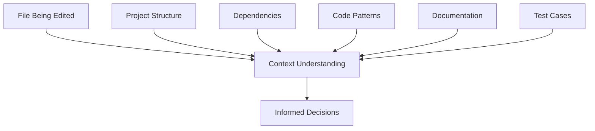
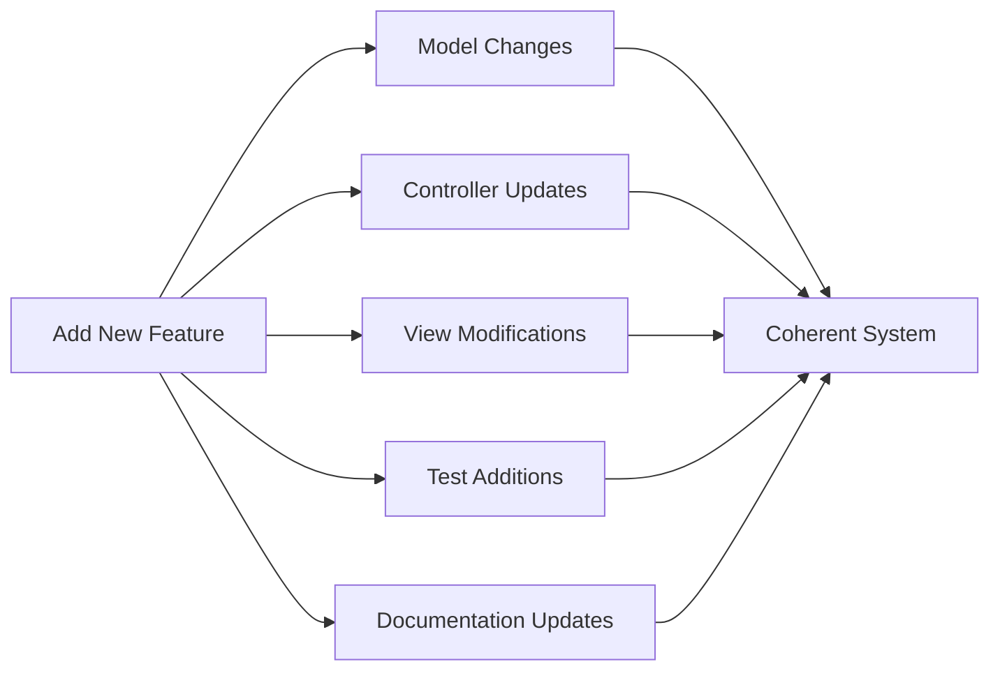
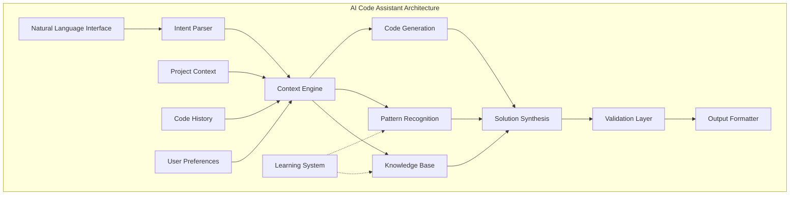

# Introduction to AI Code Assistants: The Foundation of Intelligent Programming

## Table of Contents
1. [What Are AI Code Assistants?](#what-are-ai-code-assistants)
2. [The Evolution from Tools to Agents](#evolution)
3. [Core Concepts and Terminology](#core-concepts)
4. [How AI Code Assistants Think](#how-they-think)
5. [The Architecture of Intelligence](#architecture)
6. [From Syntax to Semantics](#syntax-to-semantics)
7. [The Agent Paradigm](#agent-paradigm)
8. [Real-World Applications](#applications)
9. [Understanding the Limitations](#limitations)
10. [The Future of AI-Assisted Development](#future)

## What Are AI Code Assistants?

Imagine having a senior developer sitting next to you who:
- Never gets tired
- Has read every programming book and documentation
- Can instantly analyze thousands of lines of code
- Understands your project's context deeply
- Can write, debug, and refactor code in seconds

This is the promise of AI Code Assistants. But they're not just faster autocomplete tools or smarter search engines. Modern AI Code Assistants represent a fundamental shift in how we interact with code.

### Traditional Tools vs. AI Assistants

**Traditional Developer Tools:**
- **Syntax Highlighters**: Color your code
- **Linters**: Check for syntax errors
- **Autocomplete**: Suggest variable names
- **Debuggers**: Help find runtime errors
- **Static Analyzers**: Find potential bugs

**AI Code Assistants:**
- **Understand Intent**: "I want to add user authentication"
- **Generate Solutions**: Create entire features from descriptions
- **Reason About Code**: Understand what code does, not just how it's written
- **Learn Patterns**: Adapt to your coding style and project conventions
- **Solve Problems**: Debug issues by understanding root causes

## The Evolution from Tools to Agents

### Generation 1: Rule-Based Tools (1960s-1990s)
```
Input: if (x = 5)
Output: Warning: Did you mean '==' instead of '='?
```
Simple pattern matching and predefined rules.

### Generation 2: Statistical Tools (2000s-2010s)
```
Input: array.
Output: [forEach, map, filter, reduce, length, push, pop]
```
Frequency-based suggestions from large codebases.

### Generation 3: Machine Learning Tools (2015-2020)
```
Input: // Function to calculate fibonacci
Output: function fibonacci(n) {
  if (n <= 1) return n;
  return fibonacci(n - 1) + fibonacci(n - 2);
}
```
Pattern recognition and template-based generation.

### Generation 4: AI Agents (2020-Present)
```
Input: "Add a caching layer to this fibonacci function to improve performance"
Output: [Analyzes code, understands the performance issue, generates memoized version,
        adds comments explaining the optimization, suggests test cases]
```
Deep understanding, reasoning, and autonomous problem-solving.

## Core Concepts and Terminology

Before diving deep, let's establish a common vocabulary:

### 1. **Agent vs. Tool**
- **Tool**: Responds to specific commands with predefined actions
- **Agent**: Understands goals and autonomously determines how to achieve them

### 2. **Context Understanding**
The ability to comprehend not just the immediate code, but the entire project structure, dependencies, and purpose.



### 3. **Semantic Understanding**
Going beyond syntax to understand what code means:

```python
# Syntax Understanding: "This is a for loop"
for i in range(10):
    print(i)

# Semantic Understanding: "This prints numbers 0-9, probably for debugging or demonstration"
```

### 4. **Code AST (Abstract Syntax Tree)**
The structural representation of code that AI agents use to understand programs:

```javascript
// Original Code
function add(a, b) {
    return a + b;
}

// AST Representation (simplified)
{
  type: "FunctionDeclaration",
  name: "add",
  params: ["a", "b"],
  body: {
    type: "ReturnStatement",
    expression: {
      type: "BinaryExpression",
      operator: "+",
      left: "a",
      right: "b"
    }
  }
}
```

### 5. **Multi-File Coherence**
The ability to make related changes across multiple files while maintaining consistency:



## How AI Code Assistants Think

### The Cognitive Pipeline

1. **Input Processing**
   ```
   Natural Language: "Add error handling to this function"
                                ↓
   Intent Recognition: {action: "add", feature: "error handling", target: "function"}
   ```

2. **Context Analysis**
   ```
   Current Function → What errors can occur?
                   → What's the project's error handling pattern?
                   → What's the function's role in the system?
   ```

3. **Solution Generation**
   ```
   Patterns + Context + Best Practices → Generated Code
   ```

4. **Validation**
   ```
   Generated Code → Syntax Check → Semantic Check → Pattern Compliance → Output
   ```

### Understanding Through Analogy

Think of an AI Code Assistant as a combination of:

1. **A Translator**: Converts human intent to code
2. **A Researcher**: Finds relevant patterns and solutions
3. **An Architect**: Understands system design
4. **A Craftsman**: Applies best practices and conventions
5. **A Teacher**: Explains decisions and alternatives

## The Architecture of Intelligence

### Layered Intelligence Model



### Key Components Explained

#### 1. **Context Engine**
Maintains a living model of your project:
- File relationships
- Function dependencies
- Variable scopes
- Import/export chains
- Test coverage

#### 2. **Pattern Recognition**
Identifies and learns from:
- Coding conventions
- Architectural patterns
- Common solutions
- Anti-patterns to avoid

#### 3. **Knowledge Synthesis**
Combines multiple sources:
- Language specifications
- Framework documentation
- Best practices
- Project-specific patterns

## From Syntax to Semantics

### The Syntax Level
Traditional tools operate here:
```javascript
// Syntax: Valid JavaScript
let x = 5;
let y = "5";
let z = x + y;  // "55"
```

### The Semantic Level
AI Assistants understand here:
```javascript
// Semantic Understanding:
// - Type coercion is happening
// - Likely a bug (mixing number and string)
// - Developer probably wanted numerical addition
// Suggestion: Convert y to number or use strict comparison
```

### The Intent Level
Where true AI Agents operate:
```javascript
// Understanding: Developer is trying to sum values
// Context: This is part of a shopping cart total calculation
// Action: Refactor to ensure type safety and add validation

function calculateTotal(items) {
    return items.reduce((sum, item) => {
        const price = Number(item.price);
        if (isNaN(price)) {
            console.warn(`Invalid price for item: ${item.name}`);
            return sum;
        }
        return sum + price;
    }, 0);
}
```

## The Agent Paradigm

### What Makes an Agent?

1. **Autonomy**: Can make decisions without step-by-step instructions
2. **Proactivity**: Suggests improvements before problems occur
3. **Reactivity**: Responds intelligently to changes
4. **Social Ability**: Collaborates with humans and other agents

### Agent Capabilities in Practice

#### Scenario 1: Reactive Problem Solving
```
Developer: "This function is too slow"
Agent: 
1. Analyzes the function's complexity
2. Identifies the bottleneck (nested loops)
3. Suggests optimization (using Map for O(1) lookup)
4. Implements the solution
5. Adds performance tests
```

#### Scenario 2: Proactive Improvement
```
Agent detects: Repeated similar code blocks
Agent suggests: "I noticed you have similar validation logic in 5 places. 
                Would you like me to extract it into a reusable function?"
```

#### Scenario 3: Autonomous Feature Implementation
```
Developer: "Add user authentication to this Express app"
Agent performs:
1. Adds authentication middleware
2. Creates user model with secure password hashing
3. Implements login/logout routes
4. Adds JWT token handling
5. Updates existing routes with auth checks
6. Creates test suite for auth flows
7. Updates API documentation
```

## Real-World Applications

### 1. **Rapid Prototyping**
From idea to working code in minutes:
```
Input: "Create a REST API for a todo list with CRUD operations"
Output: Full Express.js application with:
- Routes
- Models  
- Controllers
- Error handling
- Basic tests
- Documentation
```

### 2. **Legacy Code Modernization**
Understanding and updating old code:
```
Input: "Modernize this callback-based code to use async/await"
Agent: 
- Analyzes callback patterns
- Identifies error handling
- Converts to Promise-based
- Maintains exact behavior
- Adds proper error handling
```

### 3. **Code Review and Quality Assurance**
Automated senior developer insights:
```
Agent detects:
- Security vulnerabilities
- Performance bottlenecks
- Code smells
- Missing error handling
- Accessibility issues
- Test coverage gaps
```

### 4. **Learning and Documentation**
Interactive teaching and explaining:
```
Developer: "Explain how this sorting algorithm works"
Agent: 
- Step-by-step breakdown
- Complexity analysis
- Visual representation
- Comparison with alternatives
- Use case recommendations
```

## Understanding the Limitations

### Current Limitations

1. **Context Window**: Can only consider limited code at once
2. **Domain Specificity**: May not understand proprietary business logic
3. **Creativity Bounds**: Better at patterns than novel algorithms
4. **Testing Limitations**: Can write tests but can't verify business correctness
5. **Security Considerations**: Generated code needs security review

### The Human-AI Partnership

AI Code Assistants are powerful when used as:
- **Accelerators**: Speed up routine tasks
- **Advisors**: Suggest best practices
- **Explorers**: Try different approaches
- **Teachers**: Explain complex concepts

But humans remain essential for:
- **Architecture Decisions**: High-level system design
- **Business Logic**: Domain-specific requirements
- **Creative Solutions**: Novel problem-solving
- **Ethical Considerations**: Privacy, security, fairness

## The Future of AI-Assisted Development

### Near Future (1-2 years)
- **Better Context Understanding**: Whole-repository awareness
- **Multi-Language Fluency**: Seamless polyglot development
- **Real-time Collaboration**: Pair programming with AI
- **Predictive Debugging**: Find bugs before they happen

### Medium Future (3-5 years)
- **Autonomous Agents**: Complete features from specifications
- **System-Level Understanding**: Architectural recommendations
- **Cross-Domain Integration**: Connect code with databases, APIs, UIs
- **Continuous Learning**: Agents that improve with your codebase

### Far Future (5+ years)
- **AGI-Level Reasoning**: Human-level problem solving
- **Creative Innovation**: Novel algorithm generation
- **Full-Stack Autonomy**: Complete applications from ideas
- **Collaborative Swarms**: Multiple specialized agents working together

## Key Takeaways

1. **AI Code Assistants are agents, not just tools** - They understand intent and context, not just syntax

2. **They think in patterns and semantics** - Going beyond what code looks like to what it means

3. **Context is everything** - The more context they have, the better they perform

4. **They're partners, not replacements** - Augmenting human capabilities, not replacing them

5. **The technology is rapidly evolving** - What seems impossible today will be routine tomorrow

## Preparing for the Deep Dive

Now that you understand the foundational concepts of AI Code Assistants, you're ready to explore the "Deep Dive into Claude Code's Core Flows." That article will show you how these concepts are implemented in practice through 10 sophisticated flows that represent the state of the art in AI-assisted development.

Remember:
- Each flow builds on these foundational concepts
- The flows work together synergistically
- Understanding the 'why' behind each flow is as important as the 'how'

---

## Next Article

**"The Technical Foundations of AI Code Assistants: From Theory to Implementation"**

This article would cover:
1. The mathematics behind code understanding (embeddings, transformers)
2. How large language models learn to code
3. The role of reinforcement learning in code generation
4. Technical architecture of modern AI code systems
5. Performance optimization and scaling challenges
6. Integration with development environments
7. The technical challenges of multi-file understanding
8. How AI agents maintain context and state
9. The future of neural program synthesis
10. Building your own AI code assistant

This technical deep-dive would bridge the gap between the conceptual understanding from this introduction and the practical implementation details in the "Deep Dive into Claude Code's Core Flows."
