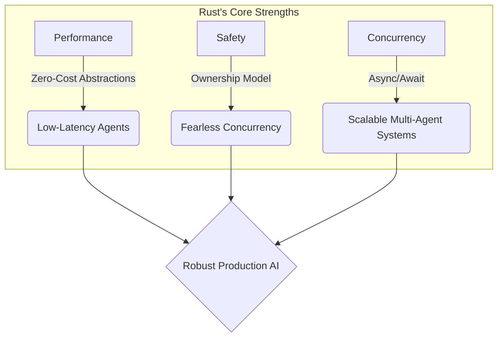
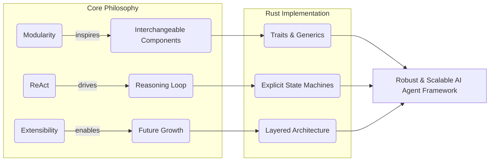
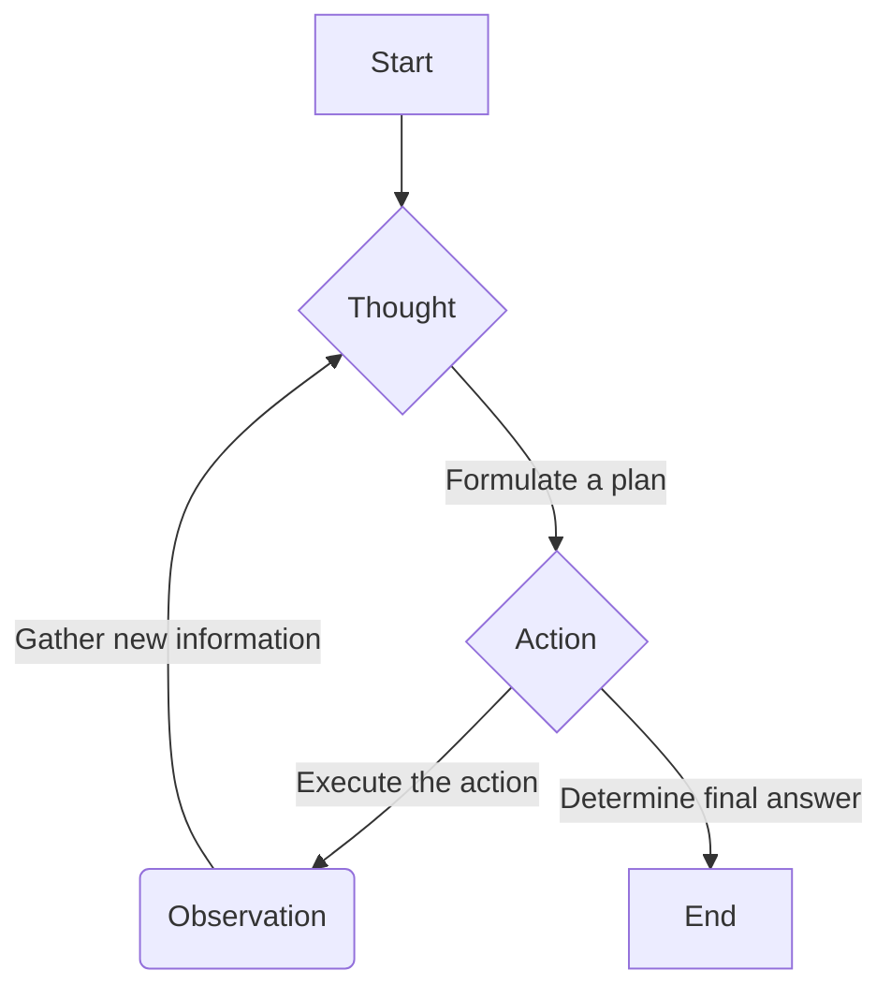
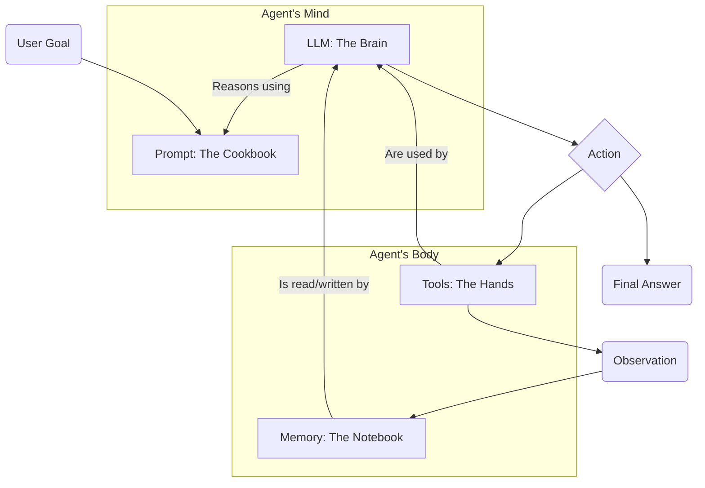
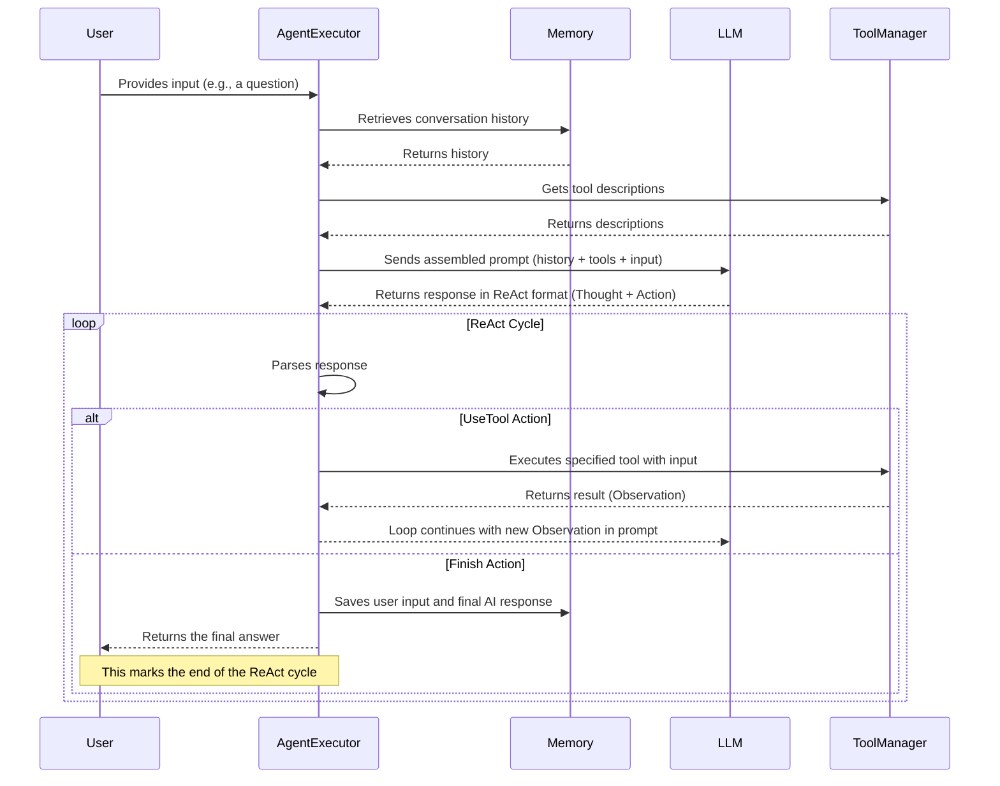
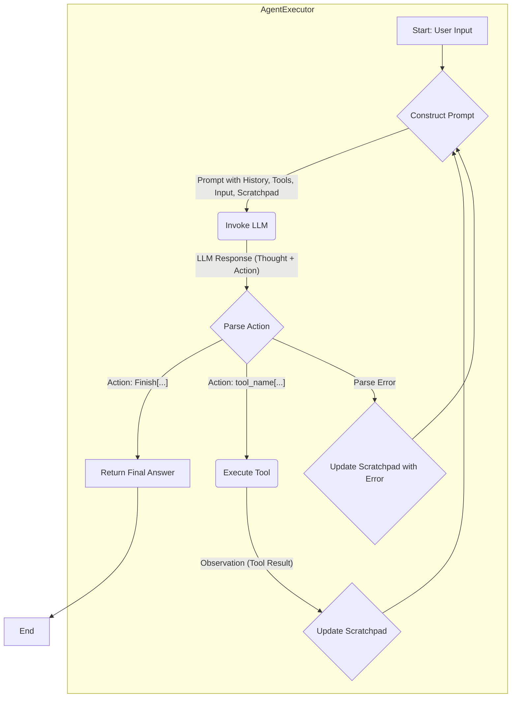
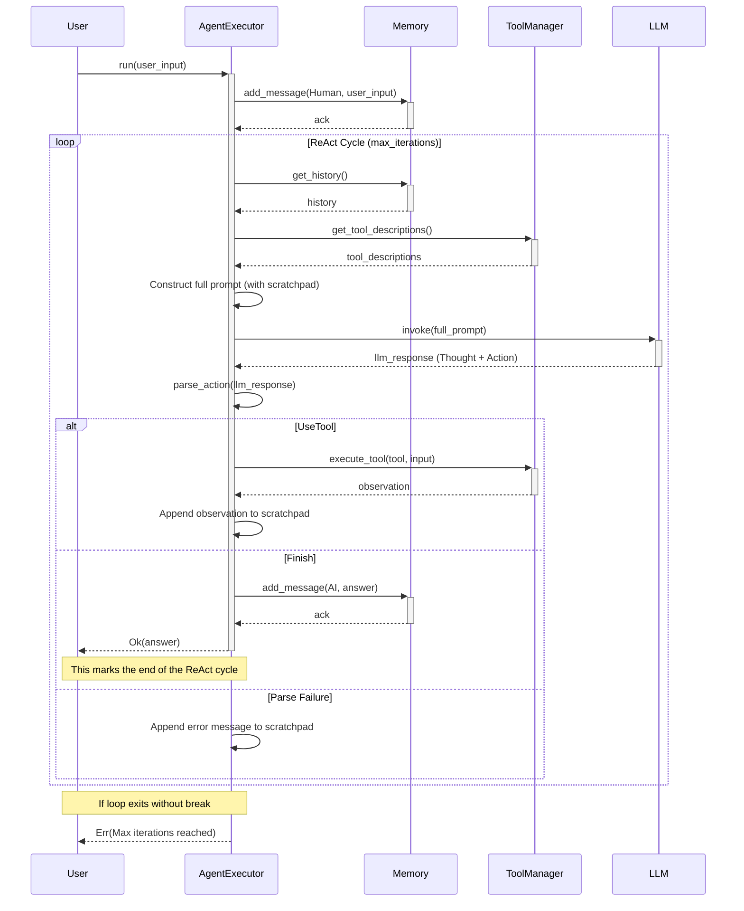
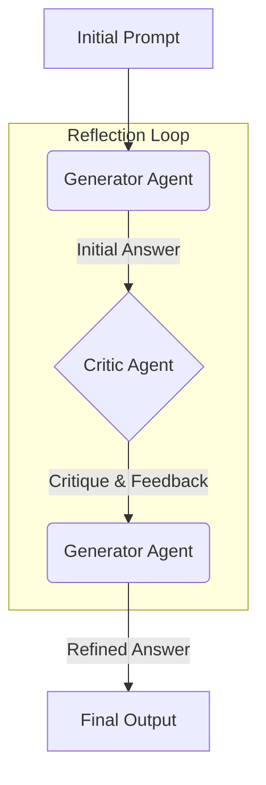
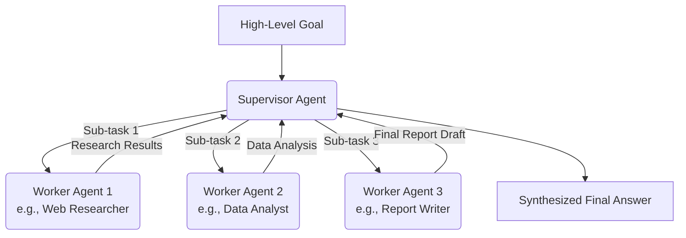

# Building a Performant AI Agent Framework in Rust from Scratch

## Table of Contents

- [Building a Performant AI Agent Framework in Rust from Scratch](#building-a-performant-ai-agent-framework-in-rust-from-scratch)
  - [Table of Contents](#table-of-contents)
  - [Introduction: The Case for a Modern Agent Framework in Rust](#introduction-the-case-for-a-modern-agent-framework-in-rust)
    - [The Rust Advantage: Why Performance, Safety, and Concurrency Matter for AI Systems](#the-rust-advantage-why-performance-safety-and-concurrency-matter-for-ai-systems)
    - [Core Principles of Our Framework: A Synthesis of Modularity, ReAct, and Extensibility](#core-principles-of-our-framework-a-synthesis-of-modularity-react-and-extensibility)
  - [Part I: Architectural Blueprint for a Rust-Native Agent Framework](#part-i-architectural-blueprint-for-a-rust-native-agent-framework)
    - [Deconstructing Existing Frameworks: Lessons from LangChain, CrewAI, and VoltAgent](#deconstructing-existing-frameworks-lessons-from-langchain-crewai-and-voltagent)
    - [The Foundational Paradigm: Implementing the ReAct (Reason-Act) Loop](#the-foundational-paradigm-implementing-the-react-reason-act-loop)
    - [Designing for Rust: Leveraging Traits, Enums, and Async for a Modular Architecture](#designing-for-rust-leveraging-traits-enums-and-async-for-a-modular-architecture)
    - [The Mental Model: Thinking Like an Agent Builder](#the-mental-model-thinking-like-an-agent-builder)
    - [The Target Architecture: A High-Level Overview of Our Framework's Components](#the-target-architecture-a-high-level-overview-of-our-frameworks-components)
  - [Part II: Implementation Guide: Building the Framework in Six Milestones](#part-ii-implementation-guide-building-the-framework-in-six-milestones)
    - [Milestone 1: Core Primitives and LLM Connectivity](#milestone-1-core-primitives-and-llm-connectivity)
      - [Defining Data Structures](#defining-data-structures)
      - [The LLM Trait](#the-llm-trait)
      - [Implementation: OpenAI-Compatible API Connector](#implementation-openai-compatible-api-connector)
    - [Milestone 2: The Foundational LLMChain](#milestone-2-the-foundational-llmchain)
      - [Structuring a Simple Execution Flow](#structuring-a-simple-execution-flow)
      - [Managing Inputs and Parsing Outputs](#managing-inputs-and-parsing-outputs)
    - [Milestone 3: Extending Capabilities with Tools](#milestone-3-extending-capabilities-with-tools)
      - [The Tool Trait](#the-tool-trait)
      - [Implementing Basic Tools](#implementing-basic-tools)
      - [The ToolManager](#the-toolmanager)
    - [Milestone 4: The Reasoning Engine: Implementing the ReAct Loop](#milestone-4-the-reasoning-engine-implementing-the-react-loop)
      - [The Prompt is the Agent's "Operating System"](#the-prompt-is-the-agents-operating-system)
      - [The Thought-Action-Observation Cycle in Code](#the-thought-action-observation-cycle-in-code)
      - [Parsing LLM Intent](#parsing-llm-intent)
      - [State Management within the ReAct Loop](#state-management-within-the-react-loop)
    - [Milestone 5: Incorporating Conversational Context with Memory](#milestone-5-incorporating-conversational-context-with-memory)
      - [The Memory Trait](#the-memory-trait)
      - [Implementing a ConversationBufferMemory](#implementing-a-conversationbuffermemory)
      - [Integrating Memory into the Agent's Context Assembly](#integrating-memory-into-the-agents-context-assembly)
    - [Milestone 6: Assembling the AgentExecutor](#milestone-6-assembling-the-agentexecutor)
      - [Tying It All Together: The Central Orchestrator](#tying-it-all-together-the-central-orchestrator)
      - [The Final Execution Flow](#the-final-execution-flow)
    - [Running the Framework: A Complete Example](#running-the-framework-a-complete-example)
  - [Part III: Advanced Concepts and Future Directions](#part-iii-advanced-concepts-and-future-directions)
    - [Beyond the Core: The Path to a Production-Ready Framework](#beyond-the-core-the-path-to-a-production-ready-framework)
    - [Implementing the Reflection Pattern for Self-Correction](#implementing-the-reflection-pattern-for-self-correction)
    - [Architecting for Multi-Agent Collaboration](#architecting-for-multi-agent-collaboration)
    - [The Importance of Observability: Strategies for Tracing and Debugging](#the-importance-of-observability-strategies-for-tracing-and-debugging)
  - [Conclusion: A Foundation for Sophisticated AI Agents](#conclusion-a-foundation-for-sophisticated-ai-agents)

## Introduction: The Case for a Modern Agent Framework in Rust

The field of software development is undergoing a *paradigm shift*, catalyzed by the rapid maturation of Large Language Models (LLMs). The dominant metaphor is evolving from direct instruction to *delegated autonomy*. We are moving from writing code that performs a task to building systems that understand a goal and orchestrate the steps to achieve it.

At the heart of this transformation is the concept of the **AI Agent**: an autonomous entity capable of perception, reasoning, planning, and acting within a digital or physical environment to accomplish complex objectives.

The proliferation of frameworks such as LangChain, CrewAI, and AutoGen is a testament to this shift, providing developers with the initial toolkits to construct these new kinds of applications. However, as these agentic systems grow in complexity, a new set of engineering challenges has emerged. Early frameworks, while successful in abstracting LLM interaction, often leave developers grappling with issues of *performance, state management, concurrency, and reliability*-problems that are the traditional domain of systems programming.

The process of building robust, scalable AI agents is revealing itself to be less of a pure data science exercise and more of a **complex systems engineering endeavor**. The challenges of orchestrating multiple tools, managing conversational memory, ensuring low-latency responses, and providing clear observability into an agent's "thought process" are not peripheral concerns; they are *central* to creating production-grade systems.

### The Rust Advantage: Why Performance, Safety, and Concurrency Matter for AI Systems

It is at this intersection of AI and systems engineering that **Rust emerges as a uniquely powerful tool**. While much of the initial AI development has been centered in Python for its rich data science ecosystem, the operational demands of sophisticated agentic systems align perfectly with Rust's core strengths.

  * **Performance**: AI agents are computationally intensive. They involve frequent, high-throughput I/O operations (API calls to LLMs and tools) and complex data processing. Rust's *zero-cost abstractions* and compilation to native machine code ensure that the framework itself introduces minimal overhead, allowing the system to be as fast and efficient as possible. This is critical for delivering responsive user experiences and managing the operational costs associated with LLM API calls.
  * **Safety**: An autonomous agent, by definition, makes decisions. In a complex system, this introduces the risk of unpredictable behavior, race conditions, and memory-related bugs that can be notoriously difficult to debug. Rust's **ownership model** and **borrow checker** provide compile-time guarantees against these entire classes of errors. This ***"fearless concurrency"*** allows developers to build complex, multi-threaded agents-for instance, agents that use multiple tools in parallel-with a high degree of confidence in their stability and safety.
  * **Concurrency**: As agentic architectures evolve towards multi-agent collaboration, the ability to handle concurrent operations efficiently becomes paramount. An agent might need to query a database, search the web, and analyze a document *simultaneously*. Rust's modern **async/await** syntax and robust concurrency primitives provide the foundation for building highly scalable systems that can manage these parallel tasks without the complexity and risk associated with traditional multi-threaded programming.

<!-- end list -->



Choosing Rust for an AI agent framework is therefore not merely a matter of preference; it is a **strategic decision** that acknowledges the growing systems-level complexity of the domain. It provides the tools to manage this complexity from the ground up, enabling the development of agents that are not only intelligent but also *robust, efficient, and reliable*.

### Core Principles of Our Framework: A Synthesis of Modularity, ReAct, and Extensibility

This guide will detail the construction of a minimal viable AI agent framework in Rust, built upon three philosophical pillars derived from the successes of existing systems:

  * **Modularity (Inspired by LangChain)**: The framework will be composed of small, interchangeable components that each perform a single, well-defined function. This mirrors the *Unix philosophy* and the design of LangChain, where elements like Models, Prompts, and Tools can be swapped and composed with ease. In our Rust implementation, this will be achieved through a heavy reliance on **traits**, creating clean, stable interfaces that decouple the core logic from specific implementations.
  * **ReAct (The Reasoning Core)**: The agent's intelligence will not be a black box. Its core operational logic will be driven by the **ReAct (Reason-Act)** paradigm, a powerful method for synergizing reasoning and acting with LLMs. By explicitly generating reasoning traces before taking actions, the agent becomes more *interpretable, auditable, and capable of correcting its course* based on new information.
  * **Extensibility (Learning from VoltAgent & CrewAI)**: The framework will be designed with the future in mind. While the initial goal is a single, capable agent, the architecture will anticipate the need for more advanced features. The design will facilitate future extensions for **multi-agent collaboration**, inspired by CrewAI's role-based systems, and will be structured for easy integration of **observability tools**, a key lesson from VoltAgent's developer-centric approach.

<!-- end list -->



This guide is intended for the software engineer or technical architect who is not content with simply using pre-built abstractions but seeks to *understand and build the fundamental engine* of an AI agent. It is a blueprint for constructing a performant, safe, and extensible foundation for the next generation of intelligent applications.

## Part I: Architectural Blueprint for a Rust-Native Agent Framework

Before writing a single line of Rust, it is crucial to establish a **clear architectural blueprint**. This blueprint is not created in a vacuum; it is a synthesis of proven concepts, refined through a critical analysis of existing frameworks and foundational research. This section deconstructs the key lessons from the current state of the art to derive a robust and well-reasoned design for our Rust-native framework.

### Deconstructing Existing Frameworks: Lessons from LangChain, CrewAI, and VoltAgent

The current landscape of AI agent frameworks is dominated by a few influential players, each with a distinct philosophy and set of trade-offs. By understanding their strengths and weaknesses, we can *cherry-pick* the most effective ideas for our own design.

  * **LangChain: The Great Enabler.** LangChain was instrumental in popularizing the concept of building applications with LLMs. Its primary contribution is a powerful, modular architecture that breaks down the problem into a set of composable components: *Schema* (data structures), *Models* (LLM wrappers), *Prompts* (input templates), *Chains* (sequences of calls), and *Agents* (decision-making loops). This component-based approach, often described as *"LEGOs for LLMs,"* provides immense flexibility and has fostered a vast ecosystem of integrations. The core lesson from LangChain is the **power of abstraction**: by defining standardized interfaces for core components, the framework allows developers to easily swap out implementations (e.g., switch from OpenAI to Anthropic) without rewriting the application's core logic. Our framework will heavily adopt this philosophy of modular, swappable components.
  * **CrewAI: The Collaboration Specialist.** While LangChain provides the building blocks for a single agent, CrewAI specializes in *orchestrating multiple agents to work together*. Its core abstractions are the *Agent*, the *Task*, and the *Crew*. Each agent is given a specific role, a goal, and a backstory, which guides its behavior and area of expertise. A Crew then manages the collaboration between these agents, which can follow a sequential process (one agent's output is the next's input) or a hierarchical process (a manager agent delegates tasks to subordinates). The key insight from CrewAI is the importance of **designing for agent interaction from the outset**. Even if our minimal viable product (MVP) is a single agent, the architecture should be extensible enough to support these more complex, collaborative workflows in the future.
  * **VoltAgent: The Developer-Centric Toolkit.** VoltAgent emerged as a response to some of the perceived shortcomings of earlier, more abstract frameworks. Built as a TypeScript-first framework, it prioritizes developer experience, offering *"structure without sacrificing control"*. Its philosophy rejects the idea that developers should be shielded from the underlying mechanics. Instead, it provides clear, code-native components and, crucially, **first-class observability** through a visual console that allows developers to trace an agent's step-by-step execution. The lesson from VoltAgent is that *transparency and debuggability are not luxury features*; they are essential for building and maintaining complex systems. Our framework must be idiomatic to Rust and designed to be as transparent as possible.

The following table summarizes this comparative analysis and distills the primary lesson each framework provides for our design.

**Table 1: Comparative Analysis of Leading AI Agent Frameworks**

| Feature                      | LangChain                                | CrewAI                                           | VoltAgent                                       |
| :--------------------------- | :--------------------------------------- | :----------------------------------------------- | :---------------------------------------------- |
| **Primary Language**         | Python                                   | Python                                           | TypeScript                                      |
| **Core Abstraction**         | Chains / Runnables                       | Agents / Crews                                   | Agents / Supervisors                            |
| **Orchestration Model**      | Sequential & Router Chains               | Sequential & Hierarchical Processes              | Supervisor / Sub-agent Delegation               |
| **Key Differentiator**       | Vast ecosystem and flexibility           | Role-based collaborative intelligence            | Code-first control & visual observability       |
| **Lesson for Our Framework** | *"Adopt modular, swappable components."* | *"Design for future multi-agent collaboration."* | *"Prioritize transparency and idiomatic code."* |

### The Foundational Paradigm: Implementing the ReAct (Reason-Act) Loop

With the high-level architectural lessons established, we turn to the core reasoning engine of the agent. Our framework will be built upon the **ReAct** paradigm, a powerful and influential approach detailed in research from Google and Princeton University. ReAct stands for *"Reason and Act"* and proposes a simple yet profound method for enabling LLMs to solve complex tasks by interleaving verbal reasoning with actions that interact with an external environment.

The core of the ReAct loop is an iterative cycle: **Thought -\> Action -\> Observation -\> Thought...**



  * **Thought**: The agent is prompted to first *"think"* about the problem. It analyzes the current state, breaks down the high-level goal into a smaller, actionable step, and formulates a plan. This is a verbal reasoning trace that is not executed but serves as an *internal monologue*.
  * **Action**: Based on its thought process, the agent chooses an *Action* to take. This action typically involves calling an external **Tool**, such as a search engine API, a database query, or a calculator.
  * **Observation**: The agent executes the action and receives an *Observation* back from the environment. This is the result of the tool call (e.g., the search results, the database record, the calculation's answer).
  * **Next Thought**: The observation is then fed back into the agent's context. The loop repeats, with the agent generating a new *Thought* based on the original goal and the new information it has just gathered. This cycle continues until the agent determines it has enough information to provide a final answer.

The ReAct paradigm directly addresses one of the most significant failure modes of LLMs: **hallucination**. By forcing the model to ground its reasoning in concrete observations from external tools, it dramatically reduces the likelihood of fabricating information and improves the overall trustworthiness of the system. This approach is a direct implementation of the *"Planning Pattern"* and *"Tool Use Pattern,"* which are considered fundamental building blocks of modern agentic design.

### Designing for Rust: Leveraging Traits, Enums, and Async for a Modular Architecture

Translating this abstract architecture into a robust Rust implementation requires leveraging the language's most powerful features to create a system that is both *flexible* and *type-safe*.

  * **Traits for Abstraction**: The principle of modularity, borrowed from LangChain, will be realized in Rust through **traits**. We will define core components like `LLM`, `Tool`, and `Memory` as traits. A trait defines a set of methods that a type must implement, creating a shared interface. For example, the `LLM` trait will have an `async fn invoke(...)` method. Any struct that implements this trait, whether it's an `OpenAI_LLM` or a `LocalLlama_LLM`, can be used interchangeably by the agent's core logic. This provides a powerful, **compile-time-enforced abstraction layer** that is the cornerstone of a flexible and extensible framework.
  * **Enums for State and Actions**: Rust's `enum` type is far more powerful than in many other languages; it allows for the creation of *sum types*, where a value can be one of several different kinds. We will use enums to model the discrete states and decisions within the agent's logic. For instance, the output of the agent's reasoning step can be modeled as an `AgentAction` enum: `enum AgentAction { UseTool(ToolCall), Finish(FinalResponse) }`. This makes the agent's decision-making process **explicit** and allows the compiler to ensure that all possible outcomes are handled, eliminating a wide range of potential runtime errors.
  * **Async/Await for I/O**: Modern AI agents are inherently *I/O-bound*. They spend most of their time waiting for responses from external network services like LLM APIs and tool endpoints. To build a high-performance framework, it is **non-negotiable** to handle these operations asynchronously. We will use Rust's native `async/await` syntax throughout the framework for any function that involves network calls or other forms of I/O. This allows a single thread to manage many concurrent operations, dramatically improving the throughput and scalability of the system without the complexities of manual thread management.

### The Mental Model: Thinking Like an Agent Builder

Before diving into the code, it's helpful to establish a simple mental model. At its core, an AI agent is like a *highly resourceful apprentice* to whom you can delegate tasks. Let's use the **Feynman Technique** to break this down.

***Imagine you're teaching a child how to bake a cake for the first time.***

1.  **The "Brain" (The LLM)**: The child's brain is the core processor. It can understand your goal ("bake a chocolate cake"), reason about the steps, and process new information. Our agent's "brain" is the **Large Language Model (LLM)**. It's the reasoning engine, but it has limitations. It knows a lot *about* the world, but it can't *interact* with it directly. The child knows what an oven is but can't feel its heat without touching it.

2.  **The "Hands" (The Tools)**: To bake, the child needs kitchen tools: a whisk, a measuring cup, an oven. These are their "hands" to interact with the world. For our agent, **Tools** are its hands. A `web_search` tool lets it "look" at the internet. A `calculator` tool lets it "do" math. A database connector lets it "access" specific information. *Without tools, the agent is just a thinker, not a doer.*

3.  **The "Cookbook" (The Prompt)**: You wouldn't just tell the child "bake a cake." You'd give them a cookbook (a prompt) with instructions: the list of ingredients (available tools), the steps to follow (the ReAct cycle), and what the final cake should look like (the goal). A **well-written prompt** is the most critical piece of guidance for the agent. It's the *"operating system"* that tells the agent *how* to behave.

4.  **The "Notebook" (The Memory)**: If the child gets interrupted, they might forget what step they were on. They need a notebook to keep track of what they've done ("I've already added the flour") and what happened ("The oven is now preheated"). For our agent, **Memory** is this notebook. It stores the conversation history and the results of past actions, allowing it to maintain context over time.

<!-- end list -->



***Question & Answer to Solidify Concepts:***

  * **Q: If the LLM is so smart, why does it need tools?**

      * **A:** The LLM's knowledge is *frozen in time* (when it was trained) and it has no access to real-time, private, or specific data. Think of a brilliant historian (the LLM). They can tell you everything about World War II, but they can't tell you today's weather unless they look out a window (use a `weather_tool`).

  * **Q: What's the difference between the Prompt and the Memory?**

      * **A:** The **Prompt** is the static set of *rules and capabilities* given to the agent at the start. It's the "user manual." The **Memory** is the dynamic, ever-growing *log of the current task*. It's the "work journal." The agent consults its manual (Prompt) and its journal (Memory) to decide what to do next.

With this mental model, the architectural components we are about to build will feel more *intuitive and purposeful*.

### The Target Architecture: A High-Level Overview of Our Framework's Components

Synthesizing these principles, we arrive at the target architecture for our minimal viable framework. The following diagram and description illustrate the flow of information and control within the system.



**Architectural Flow:**

1.  A **User Input** (e.g., a question) is passed to the central `AgentExecutor`.
2.  The `AgentExecutor` is the main orchestrator. It consults the `Memory` component to retrieve the recent conversation history.
3.  It then assembles a **master prompt**. This prompt includes the conversation history, a description of all available `Tools` (provided by the `ToolManager`), and the current user input.
4.  This comprehensive prompt is sent to the configured `LLM` implementation.
5.  The `LLM` returns a text response that follows the ReAct format.
6.  The `AgentExecutor` parses this response to extract a `Thought` and an `AgentAction` (either to use a tool or to finish).
7.  If the action is `UseTool`, the `AgentExecutor` instructs the `ToolManager` to find and execute the specified tool with the provided input.
8.  The result of the tool call (the `Observation`) is added to the agent's working context.
9.  The loop repeats from step 3, with the new observation included in the prompt, allowing the agent to reason based on the new information.
10. This continues until the `LLM` generates a `Finish` action.
11. The `AgentExecutor` then takes the final response, saves the user's turn and the final AI response to `Memory`, and returns the result to the user.

This architecture provides a **clear separation of concerns**, a robust reasoning loop, and a flexible, trait-based foundation that is perfectly suited for a high-performance, safe, and extensible implementation in Rust.

## Part II: Implementation Guide: Building the Framework in Six Milestones

This section provides a detailed, step-by-step guide to implementing the minimal viable AI agent framework in Rust. Each milestone builds upon the last, progressively adding core capabilities. The implementation will prioritize *clarity, idiomatic Rust patterns, and adherence to the architectural principles* established in Part I.

Before beginning, the following table serves as a quick reference for the primary data structures and traits that will form the backbone of our framework. Understanding their roles upfront will clarify the purpose of the code in the subsequent milestones.

**Table 2: Core Rust Traits and Data Structures**

| Component  | Type     | Key Fields / Methods                                  | Purpose                                                                            |
| :--------- | :------- | :---------------------------------------------------- | :--------------------------------------------------------------------------------- |
| `Message`  | `struct` | `role: Role`, `content: String`                       | Represents a single message in a chat history, with a defined role.                |
| `Role`     | `enum`   | `System`, `Human`, `AI`                               | Defines the originator of a `Message`.                                             |
| `Document` | `struct` | `page_content: String`, `metadata: HashMap`           | A standardized container for unstructured data, often used as a tool output.       |
| `LLM`      | `trait`  | `async fn invoke(&self, ...)`                         | An abstract, asynchronous interface for interacting with any language model.       |
| `Tool`     | `trait`  | `fn name()`, `fn description()`, `async fn execute()` | An abstract interface for a function an agent can call to interact with the world. |
| `Memory`   | `trait`  | `fn get_history()`, `fn add_message()`                | An abstract interface for storing and retrieving conversation history.             |

### Milestone 1: Core Primitives and LLM Connectivity

The foundation of any software framework is its **data model**. In this first milestone, we will define the core data structures, or "schema," that represent information within our system. We will then create the essential `LLM` trait and a concrete implementation to connect to an external language model.

#### Defining Data Structures

We begin by defining the fundamental types that will be passed between components. Using **strong, clear types** from the outset is a hallmark of good Rust programming and prevents many common errors.

First, we define the `Role` of a message originator as a simple enum. This ensures that a message can only be from one of the predefined, valid roles.

```rust
// src/primitives.rs
use serde::{Serialize, Deserialize};

#[derive(Serialize, Deserialize, Debug, Clone, PartialEq)]
pub enum Role {
    System,
    Human,
    AI,
}
```

Next, the `Message` struct will represent a single unit of conversation. It contains the content of the message and its associated `Role`. The `serde` derives are included to allow for easy serialization to and from JSON, which is necessary for communicating with most LLM APIs.

```rust
// src/primitives.rs

#[derive(Serialize, Deserialize, Debug, Clone)]
pub struct Message {
    pub role: Role,
    pub content: String,
}
```

Finally, we define the `Document` struct. This is a generic container for unstructured data, particularly useful for the output of tools that retrieve information, such as a web scraper. It separates the main content from any associated metadata.

```rust
// src/primitives.rs
use std::collections::HashMap;

#[derive(Debug, Clone)]
pub struct Document {
    pub page_content: String,
    pub metadata: HashMap<String, String>,
}
```

#### The LLM Trait

To make our framework *model-agnostic*, we define an `LLM` trait. This trait establishes a contract for any language model integration. The key method, `invoke`, is asynchronous because it will involve a network request. It takes a slice of `Message` structs and returns a `Result`, which will either contain the LLM's string response or an error. This use of `Result` enforces **explicit error handling** throughout the framework.

```rust
// src/llm.rs
use crate::primitives::Message;
use async_trait::async_trait;
use thiserror::Error;

#[derive(Error, Debug)]
pub enum LLMError {
    #[error("API request failed: {0}")]
    RequestError(#[from] reqwest::Error),
    #[error("Failed to parse response: {0}")]
    ParseError(String),
    #[error("API returned an error: {0}")]
    ApiError(String),
    #[error("An unexpected error occurred: {0}")]
    UnexpectedError(String),
}

#[async_trait]
pub trait LLM: Send + Sync {
    async fn invoke(&self, messages: &[Message]) -> Result<String, LLMError>;
}
```

***Why This Way?***

  * **`Send + Sync`**: These traits are crucial for concurrency. They signal to the Rust compiler that our `LLM` implementation is safe to be sent across threads (`Send`) and accessed from multiple threads (`Sync`). This is *essential* for building a scalable system.
  * **`async_trait`**: This crate allows us to use `async fn` in traits, which isn't natively supported in Rust yet. It's the standard way to define asynchronous interfaces.

#### Implementation: OpenAI-Compatible API Connector

With the trait defined, we can now provide a concrete implementation. The following struct, `OpenAI`, will connect to any OpenAI-compatible API endpoint. It will use the `reqwest` crate for making HTTP requests and `serde` for handling JSON.

A critical aspect of this implementation is the **secure handling of API keys**. Hardcoding credentials is a major security risk. Instead, the API key should be loaded from an environment variable at runtime, a best practice for production-ready systems. The `invoke` method is designed to be robust, handling potential API errors and parsing failures without panicking.

```rust
// src/llm.rs
use reqwest::Client;
use std::env;
use serde_json::Value;

pub struct OpenAI {
    client: Client,
    api_key: String,
    model: String,
    api_base: String,
}

impl OpenAI {
    pub fn new(model: String, api_base: String) -> Self {
        let api_key = env::var("OPENAI_API_KEY")
            .expect("OPENAI_API_KEY must be set");
        Self {
            client: Client::new(),
            api_key,
            model,
            api_base,
        }
    }
}

#[async_trait]
impl LLM for OpenAI {
    async fn invoke(&self, messages: &[Message]) -> Result<String, LLMError> {
        // Construct the request body
        let request_body = serde_json::json!({
            "model": &self.model,
            "messages": messages,
        });

        // Send the request and get the response
        let response = self.client.post(&self.api_base)
            .bearer_auth(&self.api_key)
            .json(&request_body)
            .send()
            .await?;

        // Deserialize the response into a generic JSON Value
        let response_value: Value = response.json().await?;

        // **Robust Error Handling**: Check for an 'error' key in the API response
        if let Some(error) = response_value.get("error") {
            // If the key exists, return a structured API error
            return Err(LLMError::ApiError(error.to_string()));
        }

        // **Safe Parsing**: Extract the content without using unwrap()
        let content = response_value
            .get("choices")
            .and_then(|choices| choices.get(0))
            .and_then(|choice| choice.get("message"))
            .and_then(|message| message.get("content"))
            .and_then(|content| content.as_str())
            .map(String::from)
            .ok_or_else(|| LLMError::ParseError("Could not find 'content' in API response".to_string()))?;
        
        Ok(content)
    }
}
```

With this milestone complete, we have the basic data types and a functioning, secure connection to a powerful language model.

### Milestone 2: The Foundational LLMChain

Before building a full-fledged agent, it's useful to construct the simplest possible execution flow: a *"chain."* An `LLMChain`, an idea popularized by LangChain, is a component that takes a prompt template, formats it with user input, sends it to an LLM, and returns the output. This isolates the core interaction loop and serves as a stepping stone to more complex agentic behavior.

#### Structuring a Simple Execution Flow

The `LLMChain` will encapsulate an `LLM` instance and a `PromptTemplate`. Its purpose is to streamline the process of running a single, non-interactive query against the model.

```rust
// src/chain.rs
use crate::llm::{LLM, LLMError};
use crate::primitives::{Message, Role};
use crate::prompt::PromptTemplate;
use std::collections::HashMap;

pub struct LLMChain {
    llm: Box<dyn LLM>,
    prompt: PromptTemplate,
}

impl LLMChain {
    pub fn new(llm: Box<dyn LLM>, prompt: PromptTemplate) -> Self {
        Self { llm, prompt }
    }

    pub async fn run(&self, inputs: &HashMap<String, String>) -> Result<String, LLMError> {
        let formatted_prompt_content = self.prompt.format(inputs).unwrap(); // In production, handle this error properly
        let messages = vec![
            Message { role: Role::Human, content: formatted_prompt_content }
        ];
        self.llm.invoke(&messages).await
    }
}
```

***Why This Way?***

  * `Box<dyn LLM>`: This is a *"trait object."* It allows us to hold *any* type that implements the `LLM` trait without knowing the concrete type at compile time. This is the key to our modularity. We can pass an `OpenAI` instance, a `LocalLlama` instance, or a `MockLLM` for testing, and the `LLMChain` doesn't need to change.

#### Managing Inputs and Parsing Outputs

To make the chain reusable, we need a way to handle dynamic inputs. The `PromptTemplate` struct will manage this. For our minimal implementation, it will hold a template string and perform simple string replacement for placeholders.

```rust
// src/prompt.rs
use std::collections::HashMap;

pub struct PromptTemplate {
    template: String,
}

impl PromptTemplate {
    pub fn new(template: &str) -> Self {
        Self { template: template.to_string() }
    }

    pub fn format(&self, inputs: &HashMap<String, String>) -> Result<String, String> {
        let mut result = self.template.clone();
        for (key, value) in inputs {
            let placeholder = format!("{{{}}}", key);
            if !result.contains(&placeholder) {
                return Err(format!("Placeholder {} not found in template", key));
            }
            result = result.replace(&placeholder, value);
        }
        Ok(result)
    }
}
```

While we will handle simple string outputs for now, it is important to acknowledge the concept of **OutputParsers**. In more advanced scenarios, an output parser would be responsible for taking the raw string from the LLM and converting it into a structured format, like JSON or a custom Rust struct. This would be a natural extension to the `LLMChain`.

This milestone demonstrates the core pattern of our framework: **composing components that implement our defined traits**. The `LLMChain` doesn't know or care *which* LLM it's using; it only knows that it has a component that satisfies the `LLM` trait contract. This is the power of abstraction. The code emphasizes robust error handling by propagating the `Result` from the LLM's `invoke` method. Every `async` function returns a `Result`, ensuring that potential failures (like network issues or API errors) are explicitly handled by the caller.

### Milestone 3: Extending Capabilities with Tools

An agent's ability to reason is only as powerful as its ability to **act**. Tools are the agent's connection to the outside world, allowing it to move beyond its internal knowledge and interact with external systems like APIs, databases, or local files. This milestone implements the *"Tool Use Pattern,"* a fundamental concept in agentic design.

#### The Tool Trait

We define a `Tool` trait to create a standardized interface for any function we want our agent to be able to call. The trait requires three methods:

  * **`name()`**: A simple, machine-readable name for the tool (e.g., `calculator`).
  * **`description()`**: A clear, natural language description of what the tool does and what its input should be. This description is ***critical***, as the LLM will use it to decide when and how to use the tool.
  * **`execute()`**: An asynchronous method that takes a string input and performs the tool's action, returning the result.

<!-- end list -->

```rust
// src/tools/mod.rs
use async_trait::async_trait;
use thiserror::Error;

#[derive(Error, Debug)]
pub enum ToolError {
    #[error("Tool execution failed: {0}")]
    ExecutionError(String),
}

#[async_trait]
pub trait Tool: Send + Sync {
    fn name(&self) -> String;
    fn description(&self) -> String;
    async fn execute(&self, input: &str) -> Result<String, ToolError>;
}
```

#### Implementing Basic Tools

To demonstrate the framework's flexibility, we will implement two distinct types of tools: a simple, synchronous calculator and an asynchronous web search tool.

  * **CalculatorTool**: This tool is synchronous and CPU-bound. It takes a mathematical expression as a string and uses a library like `meval` to evaluate it.

<!-- end list -->

```rust
// src/tools/calculator.rs
use super::{Tool, ToolError};
use async_trait::async_trait;

pub struct CalculatorTool;

#[async_trait]
impl Tool for CalculatorTool {
    fn name(&self) -> String { "calculator".to_string() }
    fn description(&self) -> String {
        "A calculator that evaluates mathematical expressions. Use this for any calculations.".to_string()
    }
    async fn execute(&self, input: &str) -> Result<String, ToolError> {
        match meval::eval_str(input) {
            Ok(result) => Ok(result.to_string()),
            Err(e) => Err(ToolError::ExecutionError(e.to_string())),
        }
    }
}
```

  * **WebSearchTool**: This tool is asynchronous and I/O-bound. It wraps an external search API (like Serper) to fetch real-world, up-to-date information. This demonstrates how the framework handles network-dependent tasks efficiently.

<!-- end list -->

```rust
// src/tools/search.rs
use super::{Tool, ToolError};
use async_trait::async_trait;
use reqwest::Client;
use std::env;

pub struct WebSearchTool {
    client: Client,
    api_key: String,
}

impl WebSearchTool {
    pub fn new() -> Self {
        let api_key = env::var("SERPER_API_KEY")
            .expect("SERPER_API_KEY must be set");
        Self { client: Client::new(), api_key }
    }
}

#[async_trait]
impl Tool for WebSearchTool {
    fn name(&self) -> String { "web_search".to_string() }
    fn description(&self) -> String {
        "Searches the web for information. Use this to answer questions about current events or facts.".to_string()
    }
    async fn execute(&self, input: &str) -> Result<String, ToolError> {
        let request_body = serde_json::json!({ "q": input });
        let response = self.client.post("https://google.serper.dev/search")
            .header("X-API-KEY", &self.api_key)
            .json(&request_body)
            .send()
            .await
            .map_err(|e| ToolError::ExecutionError(e.to_string()))?
            .text()
            .await
            .map_err(|e| ToolError::ExecutionError(e.to_string()))?;
        Ok(response) // In a real implementation, you'd parse this JSON for cleaner output.
    }
}
```

#### The ToolManager

To make tools available to the agent, we need a registry to hold them. The `ToolManager` will store a collection of `Tool` implementations. It will provide two key functionalities: finding a specific tool by its name to execute it, and generating a formatted string of all available tool descriptions to be injected into the agent's main prompt.

```rust
// src/tools/manager.rs
use super::{Tool, ToolError};
use std::collections::HashMap;

pub struct ToolManager {
    tools: HashMap<String, Box<dyn Tool>>,
}

impl ToolManager {
    pub fn new(tools: Vec<Box<dyn Tool>>) -> Self {
        let mut tool_map = HashMap::new();
        for tool in tools {
            tool_map.insert(tool.name(), tool);
        }
        Self { tools: tool_map }
    }

    pub async fn execute_tool(&self, name: &str, input: &str) -> Result<String, ToolError> {
        match self.tools.get(name) {
            Some(tool) => tool.execute(input).await,
            None => Err(ToolError::ExecutionError(format!("Tool '{}' not found.", name))),
        }
    }

    pub fn get_tool_descriptions(&self) -> String {
        self.tools.values()
            .map(|tool| format!("- {}: {}", tool.name(), tool.description()))
            .collect::<Vec<_>>()
            .join("\n")
    }
}
```

With tools and a manager in place, our agent is no longer just a text generator; it has the potential to become a true *actor* in a digital environment.

### Milestone 4: The Reasoning Engine: Implementing the ReAct Loop

This milestone is the **heart of the agent**. Here, we implement the core logic that enables the agent to reason, plan, and use the tools we defined in the previous step. We will build the Thought-Action-Observation cycle that defines the ReAct paradigm.

#### The Prompt is the Agent's "Operating System"

A crucial realization when implementing a ReAct-style agent is that the system prompt is not merely a set of instructions; it is the agent's *entire operational environment*. It defines the protocol for how the agent thinks, how it accesses its capabilities (tools), and how it determines when its work is complete. The structure and quality of this prompt **directly determine the reliability and capability of the agent**. It is, in essence, a text-based operating system.

The design of this prompt is therefore a core architectural task. It must contain several key sections:

  * **Overall Goal/Persona**: A high-level instruction defining the agent's purpose (e.g., "You are a helpful assistant.").
  * **Tool Manifest**: A section that lists the available tools and their descriptions, formatted clearly so the LLM can parse them. This is where the output of our `ToolManager::get_tool_descriptions()` method will be injected.
  * **Response Format Instructions**: Explicit instructions on the format the LLM *must* use for its responses. This includes the syntax for `Thought` and `Action`.
  * **Exit Condition**: A clear definition of the final action the agent should take when it has found the answer and its work is done (e.g., `Action: Finish[your final answer]`).
  * **Few-Shot Examples (Optional but Recommended)**: One or two examples of a full Thought-Action-Observation-Thought cycle can dramatically improve the model's adherence to the format.

Here is an example of what this **master ReAct prompt template** might look like:

```text
You are a helpful assistant that can use tools to answer questions.
You have access to the following tools:
{tool_descriptions}

To answer the user's question, you must follow this cycle:
1. Thought: Reason about the user's question and decide what action to take.
2. Action: Use one of the available tools. The action must be in the format `tool_name[input]`.
When you have the final answer, use the action `Finish[your final answer]`.

--- START OF CONVERSATION ---
{history}
--- END OF CONVERSATION ---

Begin!

User's question: {input}
{scratchpad}
```

#### The Thought-Action-Observation Cycle in Code

The ReAct loop will be an iterative process within our main execution logic. This diagram illustrates the flow:



In each iteration, the agent will:

1.  Assemble the current context (history, tools, user query, previous steps).
2.  Call the LLM.
3.  Parse the LLM's response to determine the next action.
4.  Execute the action (if it's a tool call).
5.  Record the observation.
6.  Loop.

#### Parsing LLM Intent

A key technical challenge is parsing the LLM's raw string output to extract the `Thought` and `Action`. For a minimal viable framework, **regular expressions are a pragmatic choice**. We need to define patterns that can capture the tool name and its input, or the final answer.

We can define an enum to represent the parsed action, as discussed in the architectural blueprint.

```rust
// src/agent.rs

#[derive(Debug, PartialEq)]
pub enum AgentAction {
    UseTool { tool: String, input: String },
    Finish { answer: String },
}
```

And a parsing function using the `regex` crate:

```rust
// src/agent.rs
use regex::Regex;
use once_cell::sync::Lazy;

// Using once_cell::sync::Lazy to compile regex only once
static TOOL_RE: Lazy<Regex> = Lazy::new(|| Regex::new(r"Action:\s*(\w+)\s*\[\s*(.*)\s*\]").unwrap());
static FINISH_RE: Lazy<Regex> = Lazy::new(|| Regex::new(r"Action:\s*Finish\s*\[\s*(.*)\s*\]").unwrap());

pub fn parse_action(text: &str) -> Option<AgentAction> {
    if let Some(caps) = FINISH_RE.captures(text) {
        let answer = caps.get(1).map_or("", |m| m.as_str()).trim().to_string();
        return Some(AgentAction::Finish { answer });
    }
    if let Some(caps) = TOOL_RE.captures(text) {
        let tool = caps.get(1).map_or("", |m| m.as_str()).trim().to_string();
        let input = caps.get(2).map_or("", |m| m.as_str()).trim().to_string();
        return Some(AgentAction::UseTool { tool, input });
    }
    None
}
```

***Why This Way?***

  * Using `Option<AgentAction>` is idiomatic Rust for functions that might not produce a value. If the LLM output doesn't match our expected format, the function gracefully returns `None` instead of crashing, allowing the calling code to handle the failure.
  * `once_cell::sync::Lazy` ensures that the computationally expensive task of compiling the regular expressions happens only once, the first time they are needed, and is then available safely across multiple threads.

#### State Management within the ReAct Loop

During a single run, the agent needs to keep track of its *"scratchpad"* or *"trajectory"*, the sequence of thoughts, actions, and observations it has taken so far. This scratchpad is **crucial context** for the next reasoning step. We will manage this by accumulating these steps into a string that gets appended to the prompt in each iteration of the loop.

The logic would look something like this (to be placed inside the main executor in Milestone 6):

```rust
// Pseudocode for the loop logic
let mut scratchpad = String::new();
loop {
    let current_prompt = format_react_prompt(user_input, tool_descriptions, &scratchpad);
    let llm_response = llm.invoke(&[Message::human(current_prompt)]).await?;

    scratchpad.push_str("\n");
    scratchpad.push_str(&llm_response); // Add the thought and action to the scratchpad

    match parse_action(&llm_response) {
        Some(AgentAction::UseTool { tool, input }) => {
            let observation = tool_manager.execute_tool(&tool, &input).await?;
            scratchpad.push_str(&format!("\nObservation: {}\n", observation)); // Add observation
        },
        Some(AgentAction::Finish { answer }) => {
            return Ok(answer); // Exit the loop and return the final answer
        },
        None => {
            // Handle parsing failure, maybe retry or return an error
            return Err("Failed to parse LLM action".into());
        }
    }
}
```

This milestone provides the **cognitive engine** of our agent. It can now formulate plans, use tools to gather information, and reason about the results to achieve a goal.

### Milestone 5: Incorporating Conversational Context with Memory

A stateless agent that starts fresh with every query has *limited utility*. To engage in meaningful conversations, an agent must remember past interactions. This is the role of **Memory**. This milestone introduces a memory component to make our agent stateful.

#### The Memory Trait

Following our established pattern, we define a `Memory` trait. This provides a generic interface for any component that can store and retrieve conversation history. This abstraction allows for different memory backends in the future, such as an in-memory buffer for development, or a persistent *Redis* or *database-backed store* for production.

```rust
// src/memory.rs
use crate::primitives::Message;

pub trait Memory: Send + Sync {
    fn get_history(&self) -> Vec<Message>;
    fn add_message(&mut self, message: Message);
    fn clear(&mut self);
}
```

#### Implementing a ConversationBufferMemory

The simplest and most common form of memory is a buffer that stores the entire chat history verbatim. For our MVP, we will implement this as a simple in-memory vector of `Message` structs.

```rust
// src/memory.rs
use crate::primitives::{Message};

#[derive(Default)]
pub struct ConversationBufferMemory {
    messages: Vec<Message>,
}

impl ConversationBufferMemory {
    pub fn new() -> Self {
        Self::default()
    }
}

impl Memory for ConversationBufferMemory {
    fn get_history(&self) -> Vec<Message> {
        self.messages.clone()
    }

    fn add_message(&mut self, message: Message) {
        self.messages.push(message);
    }

    fn clear(&mut self) {
        self.messages.clear();
    }
}
```

***Why This Way?***

  * The `get_history` method returns a `clone()` of the messages. This follows Rust's ownership rules, giving the caller their own copy of the history to work with, preventing different parts of the program from accidentally interfering with the canonical memory state.

While simple, this buffer is highly effective for short-to-medium length conversations. For very long conversations, it can lead to large prompts and high token costs. More advanced memory types, such as `SummaryMemory` (which periodically summarizes the conversation) or `EntityMemory` (which tracks specific entities), could be implemented as future extensions by simply creating new structs that implement the `Memory` trait.

#### Integrating Memory into the Agent's Context Assembly

The final step is to modify the agent's logic to use this memory. Before starting the ReAct loop, the `AgentExecutor` will retrieve the history from its `Memory` component. This history will then be prepended to the messages sent to the LLM. After the agent produces a final answer, the user's initial query and the agent's final response will be added to the memory for future turns. This integration transforms the agent from a single-shot question-answerer into a true **conversational partner**, capable of maintaining context across multiple interactions.

### Milestone 6: Assembling the AgentExecutor

This final milestone brings all the individual components together into a single, cohesive unit: the **`AgentExecutor`**. This top-level struct will own the `LLM`, `ToolManager`, and `Memory`, and will be responsible for orchestrating the entire end-to-end execution flow, from receiving user input to returning a final, reasoned answer.

#### Tying It All Together: The Central Orchestrator

The `AgentExecutor` is the public-facing entry point to our framework. It encapsulates the complexity of the ReAct loop and provides a simple `run` method for the end user.

```rust
// src/agent.rs
use crate::llm::LLM;
use crate::memory::Memory;
use crate::tools::manager::ToolManager;
use crate::primitives::{Message, Role};
use std::error::Error;

// AgentAction and parse_action are assumed to be in this file as well.

pub struct AgentExecutor {
    llm: Box<dyn LLM>,
    tool_manager: ToolManager,
    memory: Box<dyn Memory>,
    max_iterations: u32,
}

impl AgentExecutor {
    pub fn new(llm: Box<dyn LLM>, tool_manager: ToolManager, memory: Box<dyn Memory>) -> Self {
        Self { llm, tool_manager, memory, max_iterations: 5 }
    }

    // The main run method will be defined here
}
```

#### The Final Execution Flow

The `run` method of the `AgentExecutor` implements the complete logic we've designed over the previous milestones. It manages the state of the conversation and the ReAct trajectory. This sequence diagram illustrates the complex interactions orchestrated by the `run` method.



And here is the complete, annotated implementation of the `run` method.

```rust
// Inside impl AgentExecutor
pub async fn run(&mut self, user_input: &str) -> Result<String, Box<dyn Error>> {
    // 1. Add the new user message to conversation history.
    self.memory.add_message(Message {
        role: Role::Human,
        content: user_input.to_string(),
    });

    // 2. Get tool descriptions to inject into the master prompt.
    let tool_descriptions = self.tool_manager.get_tool_descriptions();
    
    // 3. Define the master ReAct prompt template. This is the agent's "OS".
    let base_prompt = format!(
        "You are a helpful assistant. Your goal is to answer the user's question.

You have access to the following tools:
{tools}

To use a tool, respond with:
Action: tool_name[input]

When you have the final answer, respond with:
Action: Finish[your final answer]

You must respond in the format:
Thought: Your reasoning for the action.
Action: The action to take.",
        tools = tool_descriptions
    );

    // This will hold the "Thought, Action, Observation" sequence for the current run.
    let mut scratchpad = String::new();
    
    for i in 0..self.max_iterations {
        // 4. Assemble the full prompt for this iteration.
        // It includes the master prompt, conversation history, user input, and the current scratchpad.
        let history_str = self.memory.get_history().iter()
            .map(|m| format!("{:?}: {}", m.role, m.content))
            .collect::<Vec<_>>().join("\n");
        
        let prompt_content = format!(
            "{base}\n\n--- CONVERSATION HISTORY ---\n{history}\n\n--- CURRENT TASK ---\nQuestion: {input}\n{scratchpad}",
            base = base_prompt,
            history = history_str,
            input = user_input,
            scratchpad = scratchpad
        );

        let messages = vec![Message { role: Role::Human, content: prompt_content }];

        // 5. Invoke the LLM with the complete context.
        let llm_response = self.llm.invoke(&messages).await?;
        scratchpad.push_str("\n");
        scratchpad.push_str(&llm_response);

        // 6. Parse the LLM's response to decide the next action.
        match parse_action(&llm_response) {
            Some(AgentAction::UseTool { tool, input }) => {
                // Agent wants to use a tool.
                let observation = match self.tool_manager.execute_tool(&tool, &input).await {
                    Ok(result) => result,
                    Err(e) => format!("Tool execution failed: {}", e),
                };
                scratchpad.push_str(&format!("\nObservation: {}", observation));
            },
            Some(AgentAction::Finish { answer }) => {
                // Agent is finished. Save the final answer to memory and return it.
                self.memory.add_message(Message {
                    role: Role::AI,
                    content: answer.clone(),
                });
                return Ok(answer);
            },
            None => {
                // LLM failed to respond in the correct format.
                // We add an observation to the scratchpad to let it "self-correct".
                scratchpad.push_str("\nObservation: Your response was not in the correct format. Please respond with a 'Thought:' and an 'Action:'.");
            }
        }
        
        // Safety break to prevent infinite loops if something goes wrong.
        if i == self.max_iterations - 1 {
            return Err("Agent reached max iterations without finishing.".into());
        }
    }

    // This should ideally not be reached if max_iterations > 0
    Err("Agent failed to produce a response.".into())
}
```

### Running the Framework: A Complete Example

Finally, we provide a complete `main.rs` file to demonstrate how to initialize and run the framework. This example sets up the components and enters a simple **read-evaluate-print loop (REPL)** in the terminal, allowing for interactive conversation with the agent.

```rust
// src/main.rs

// Assuming all modules are correctly declared in lib.rs
// e.g., in `src/lib.rs`:
// pub mod agent;
// pub mod llm;
// pub mod memory;
// pub mod primitives;
// pub mod tools;

use agent_framework::agent::{AgentExecutor, AgentAction, parse_action};
use agent_framework::llm::{LLM, OpenAI};
use agent_framework::memory::{ConversationBufferMemory, Memory};
use agent_framework::tools::{
    calculator::CalculatorTool,
    manager::ToolManager,
    search::WebSearchTool,
    Tool,
};
use std::io::{self, Write};

#[tokio::main]
async fn main() {
    // Load .env file for API keys
    dotenv::dotenv().ok();
    println!("AI Agent is initializing...");

    // 1. Initialize components
    let llm = Box::new(OpenAI::new(
        "gpt-4-turbo".to_string(), // Or your preferred model
        "https://api.openai.com/v1/chat/completions".to_string(),
    ));

    let tools: Vec<Box<dyn Tool>> = vec![
        Box::new(CalculatorTool),
        Box::new(WebSearchTool::new()),
    ];
    let tool_manager = ToolManager::new(tools);
    let memory = Box::new(ConversationBufferMemory::new());

    // 2. Create the AgentExecutor
    let mut agent = AgentExecutor::new(llm, tool_manager, memory);

    println!("AI Agent is ready. Type 'exit' to quit.");
    loop {
        print!("> ");
        io::stdout().flush().unwrap();
        let mut input = String::new();
        io::stdin().read_line(&mut input).unwrap();
        let input = input.trim();

        if input.eq_ignore_ascii_case("exit") {
            break;
        }
        if input.is_empty() {
            continue;
        }

        match agent.run(input).await {
            Ok(response) => println!("\nAI: {}\n", response),
            Err(e) => eprintln!("\nError: {}\n", e),
        }
    }
}
```

With this final milestone, we have a working, **end-to-end AI agent framework**. It is modular, stateful, capable of using tools, and built on a robust reasoning paradigm. It serves as a powerful foundation for building more sophisticated and specialized AI applications.

## Part III: Advanced Concepts and Future Directions

The six milestones have established a solid foundation for a minimal viable AI agent framework. However, the journey from a working prototype to a **production-grade, feature-rich system** involves several further steps. This section explores advanced concepts and future directions, showing how the modular, trait-based architecture we have built can be extended to incorporate more sophisticated behaviors and operational robustness.

### Beyond the Core: The Path to a Production-Ready Framework

The current framework is functional but lacks several features essential for real-world deployment. Key areas for enhancement include:

  * **Robust Error Handling and Retries**: While we use `Result` for error propagation, a production system needs more sophisticated strategies. This includes implementing *retry logic with exponential backoff* for transient network errors when calling LLM or tool APIs, and more granular error types to distinguish between different failure modes.
  * **Configuration Management**: Hardcoded values like model names or API endpoints should be externalized into a configuration file (e.g., YAML or TOML). This allows for easier management of different environments (development, staging, production) *without code changes*.
  * **Structured Logging**: A simple `println!` is insufficient for debugging. Integrating a structured logging library like **`tracing`** would allow for emitting detailed, machine-parsable logs for each step of the agent's execution. This is the first step towards *true observability*.

### Implementing the Reflection Pattern for Self-Correction

One of the most powerful agentic patterns is **Reflection**, where an agent critically evaluates its own output and iteratively refines it. This can be implemented as an *"Evaluator-Optimizer"* workflow.

The process would look like this:

1.  **Generation**: The primary agent generates an initial response or plan, as it does now.
2.  **Reflection**: Instead of returning this response directly, it is passed to a second LLM call (or even a separate, specialized *"critic" agent*). This second call is prompted to evaluate the initial response against specific criteria (e.g., "Is this answer factually accurate? Is the code efficient? Is the tone appropriate?").
3.  **Refinement**: The feedback from the reflection step is then provided as context to the original agent, which is prompted to generate a revised and improved response.

<!-- end list -->



Our trait-based architecture supports this pattern elegantly. A `ReflectiveAgentExecutor` could be created that wraps a standard `AgentExecutor`. Its `run` method would internally call the inner agent, then orchestrate the additional reflection and refinement steps before returning the final, polished output.

### Architecting for Multi-Agent Collaboration

The true power of agentic AI is often realized when **multiple specialized agents collaborate** to solve a problem that is too complex for any single agent. Our framework's design is well-suited for extension into a multi-agent system, drawing inspiration from the patterns established by CrewAI and AutoGen.

A common and powerful model is the **hierarchical** or **supervisor-worker** pattern. This can be implemented by creating a new `SupervisorAgent` struct. This supervisor's "tools" would not be simple functions like a calculator; instead, *its tools would be other `AgentExecutor` instances*.



The workflow would be:

1.  A high-level task is given to the `SupervisorAgent`.
2.  The supervisor's reasoning process (its ReAct loop) would involve breaking the task down and delegating sub-tasks to its specialized worker agents.
3.  For example, a "research report" task could be delegated by the supervisor as follows: "Action: `web_research_agent[topic]`", followed by "Action: `data_analysis_agent[research_results]`", and finally "Action: `writer_agent[analysis_summary]`".
4.  The supervisor would collect the outputs from each worker agent and synthesize them into a final, cohesive response.

This architecture creates a **powerful separation of concerns**, allowing each worker agent to be optimized with its own specific prompt, tools, and even its own choice of LLM, while the supervisor focuses solely on orchestration.

### The Importance of Observability: Strategies for Tracing and Debugging

As agentic behavior becomes more complex and non-deterministic, understanding ***why*** an agent made a particular decision becomes incredibly difficult. This is why **observability is not an afterthought but a critical requirement**, a lesson strongly emphasized by the market positioning of frameworks like VoltAgent. Developers need to be able to visualize the agent's reasoning process to debug failures and improve performance.

In Rust, the **`tracing`** crate is the de facto standard for instrumenting applications to emit structured, contextual logs and events. We can integrate it into our framework by adding `span!` and `event!` macros at key points in the `AgentExecutor`:

  * A top-level `span` could be created for each `run` call, tagged with a unique conversation ID.
  * Within that span, `event!`s could be emitted for each `Thought`, `Action`, and `Observation`.
  * Tool execution could be wrapped in its own `span`, measuring its duration and recording its input and output.

```mermaid
gantt
    title Agent Execution Trace
    dateFormat  X
    axisFormat %S
    section Agent Run (ID: 123)
    LLM Invocation: 0, 2
    Parse Action: 2, 1
    Tool: web_search: 3, 3
    LLM Invocation: 6, 2
    Parse Action: 8, 1
    Tool: calculator: 9, 1
    LLM Invocation: 10, 2
    Parse (Finish): 12, 1
```

<!-- end list -->



These structured logs can then be collected by a subscriber and sent to a variety of backends, from simple terminal output to sophisticated observability platforms like Jaeger, Datadog, or specialized AI monitoring tools like LangSmith. This provides the *"n8n-style visual debugging"* that developers find so valuable, allowing them to see a clear, step-by-step trace of how the agent arrived at its final answer.

## Conclusion: A Foundation for Sophisticated AI Agents

This guide has detailed the architectural design and step-by-step implementation of a minimal but **powerful AI agent framework in Rust**. By synthesizing the best practices from leading frameworks and grounding the design in foundational research, we have constructed a system that is *modular, extensible, and performant*. The developer who completes this guide will have built not just a tool, but a deep understanding of the core mechanics that drive modern agentic systems.

The framework's capabilities can be summarized as follows: a stateful, conversational agent that can intelligently select and use external tools to reason about and solve complex problems. It is built on a robust **ReAct reasoning loop**, ensuring that its actions are grounded and its thought process is, in principle, auditable.

The decision to build in Rust and leverage its core features-*traits for abstraction, enums for type-safe state management, and async/await for high-performance I/O*-provides an exceptionally strong foundation. This extensible nature is not an accident; it is the result of deliberate architectural choices. The path to more advanced features like self-correction via the Reflection pattern, complex collaboration through multi-agent systems, and production-grade observability is clear and achievable within the existing design.

As the field of AI continues to accelerate, the demand for custom, high-performance, and transparent agentic systems will only grow. The era of treating LLMs as simple, black-box APIs is giving way to a new era of **sophisticated AI engineering**, where the challenges of orchestration, reliability, and efficiency are paramount. Rust, with its unique combination of performance, safety, and modern concurrency, is uniquely positioned to be the language of choice for this next wave of innovation. The framework outlined here serves as a robust starting point for developers looking to build the future of intelligent, autonomous software.