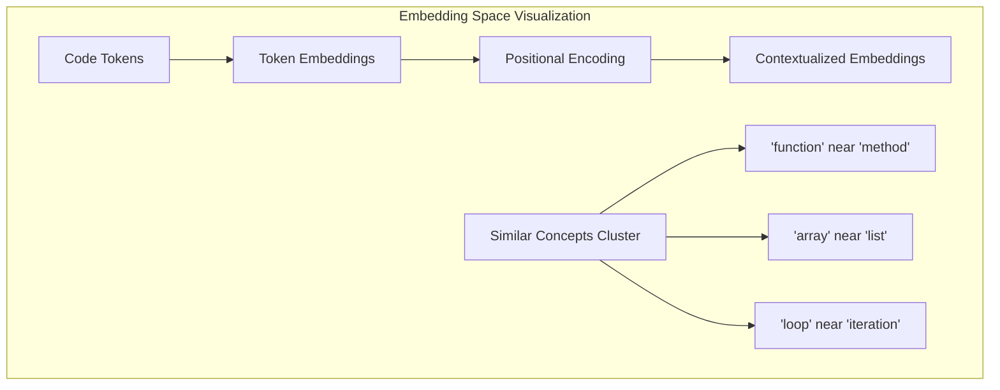
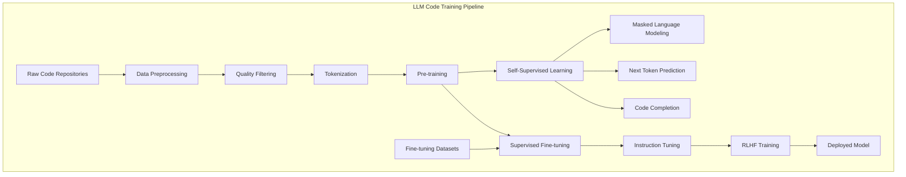
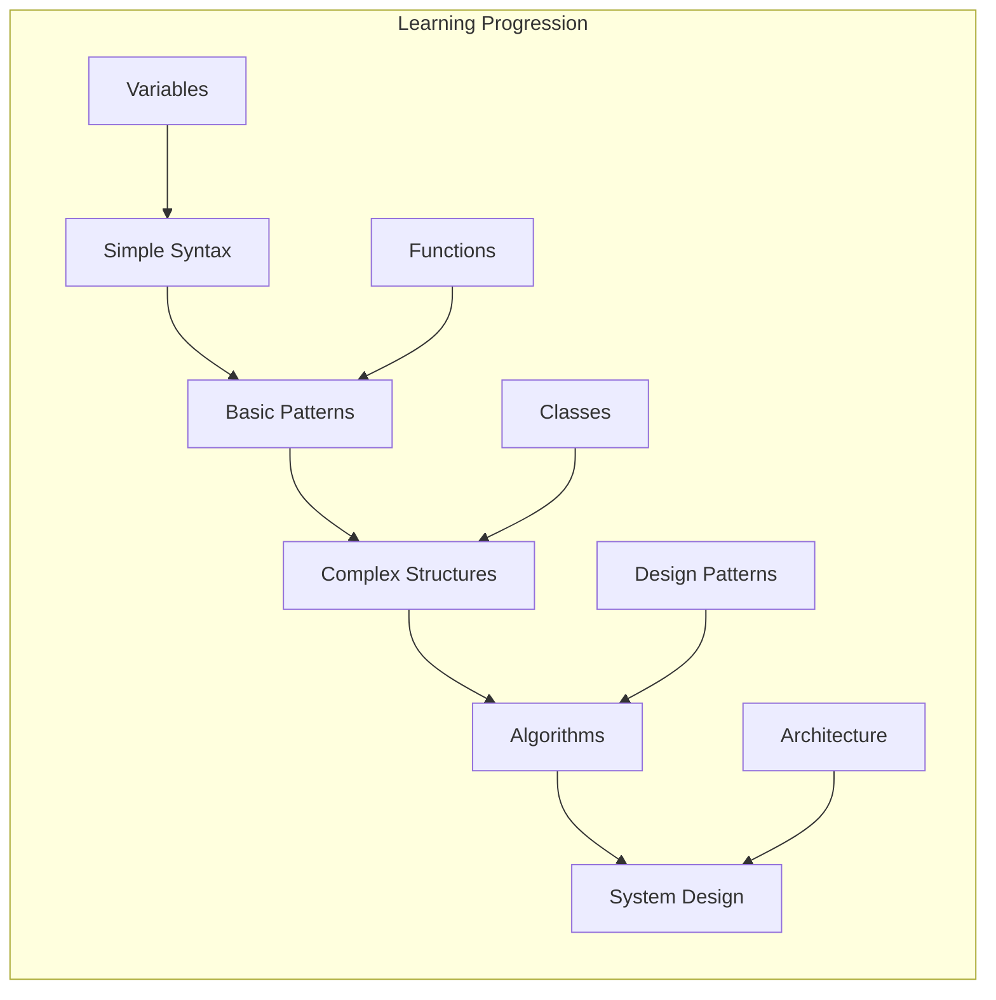
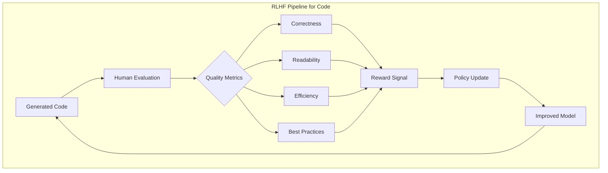
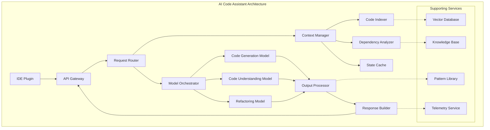
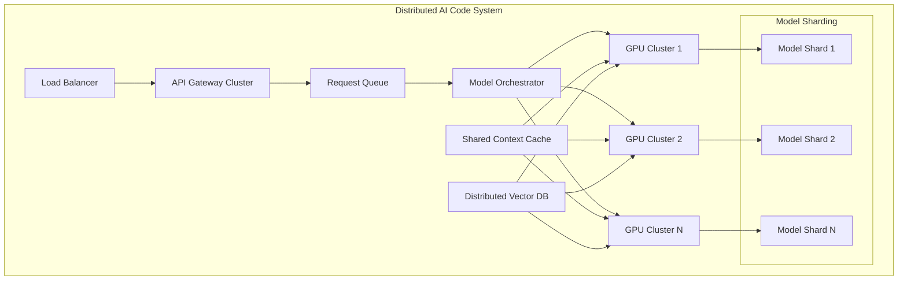
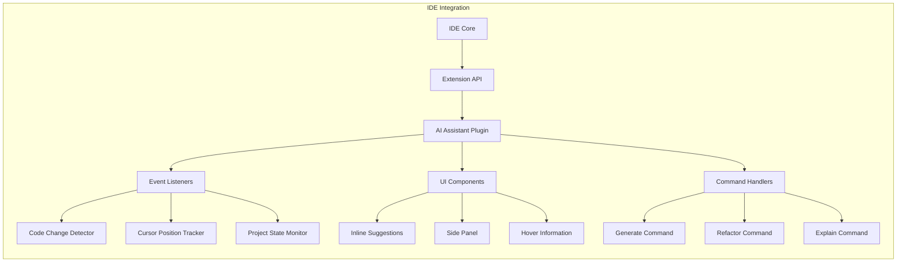
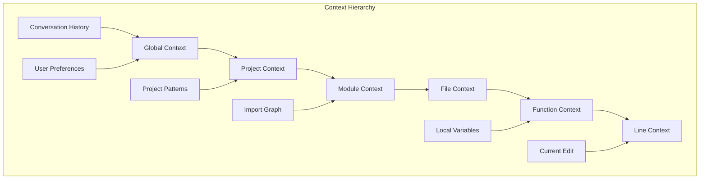
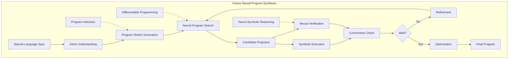
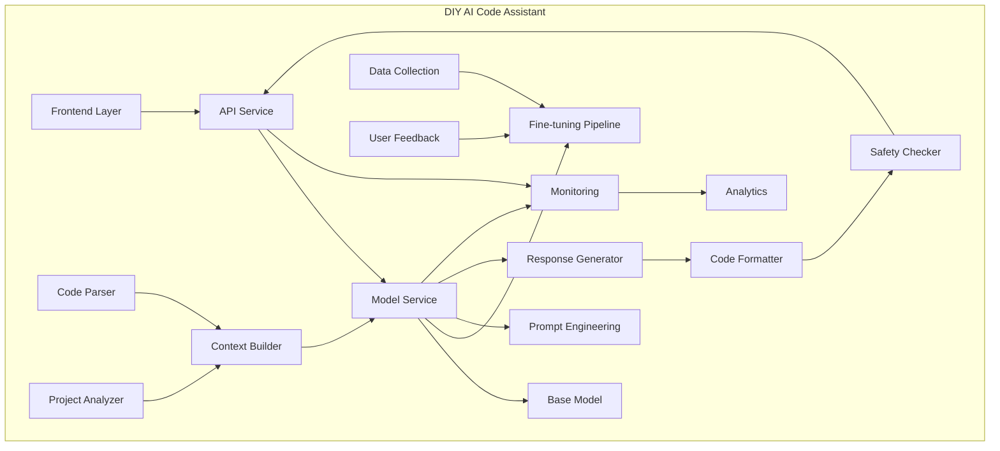

# The Technical Foundations of AI Code Assistants: From Theory to Implementation

## Table of Contents
1. [The Mathematics Behind Code Understanding](#mathematics)
2. [How Large Language Models Learn to Code](#llm-learning)
3. [The Role of Reinforcement Learning in Code Generation](#reinforcement-learning)
4. [Technical Architecture of Modern AI Code Systems](#architecture)
5. [Performance Optimization and Scaling Challenges](#performance)
6. [Integration with Development Environments](#integration)
7. [The Technical Challenges of Multi-File Understanding](#multi-file)
8. [How AI Agents Maintain Context and State](#context-state)
9. [The Future of Neural Program Synthesis](#neural-synthesis)
10. [Building Your Own AI Code Assistant](#building)

## 1. The Mathematics Behind Code Understanding {#mathematics}

### From Code to Vectors: The Embedding Journey

At the heart of AI code understanding lies a fundamental challenge: how do we represent code in a way that neural networks can process? The answer is embeddings - dense vector representations that capture semantic meaning.

#### Token Embeddings

```python
# Original code
def calculate_area(radius):
    return 3.14159 * radius ** 2

# Tokenized representation
["def", "calculate_area", "(", "radius", ")", ":", "\n", 
 "return", "3.14159", "*", "radius", "**", "2"]

# Each token becomes a vector
"def" → [0.23, -0.45, 0.67, ..., 0.12]  # 768-dimensional vector
"calculate_area" → [0.56, 0.34, -0.23, ..., 0.89]
```

#### The Embedding Space



### Transformer Architecture: The Brain of Code Understanding

The transformer architecture revolutionized how AI understands code through self-attention mechanisms.

#### Self-Attention Mechanism

```python
# Simplified self-attention calculation
def self_attention(query, key, value, d_k):
    # Calculate attention scores
    scores = torch.matmul(query, key.transpose(-2, -1)) / math.sqrt(d_k)
    
    # Apply softmax to get attention weights
    attention_weights = torch.softmax(scores, dim=-1)
    
    # Apply attention to values
    output = torch.matmul(attention_weights, value)
    
    return output, attention_weights
```

#### Multi-Head Attention

```
Input: "function calculates the sum of array elements"

Head 1: Focuses on syntax (function, array)
Head 2: Focuses on operation (calculates, sum)
Head 3: Focuses on relationships (sum...of...elements)
Head 4: Focuses on data types (array, elements)
...
Head 8: Focuses on overall semantic meaning
```

### Mathematical Formulation

#### Attention Score Calculation

$$\text{Attention}(Q, K, V) = \text{softmax}\left(\frac{QK^T}{\sqrt{d_k}}\right)V$$

Where:
- Q = Query matrix
- K = Key matrix  
- V = Value matrix
- $d_k$ = Dimension of key vectors

#### Position Encoding

Since code structure is crucial, position encoding helps maintain order:

$$PE_{(pos, 2i)} = \sin\left(\frac{pos}{10000^{2i/d_{model}}}\right)$$
$$PE_{(pos, 2i+1)} = \cos\left(\frac{pos}{10000^{2i/d_{model}}}\right)$$

### Code-Specific Embeddings

Beyond standard token embeddings, code understanding requires:

1. **Syntax-Aware Embeddings**
   ```python
   # AST-based embedding enrichment
   def enrich_embedding(token, ast_context):
       base_embedding = get_token_embedding(token)
       syntax_embedding = get_syntax_embedding(ast_context.node_type)
       scope_embedding = get_scope_embedding(ast_context.scope_level)
       
       return concatenate([base_embedding, syntax_embedding, scope_embedding])
   ```

2. **Type-Aware Embeddings**
   ```python
   # Type information integration
   variable_embedding = combine(
       token_embedding("user_id"),
       type_embedding("string"),
       usage_embedding("identifier")
   )
   ```

3. **Control Flow Embeddings**
   ```python
   # Representing control flow in vector space
   if_statement_embedding = combine(
       structure_embedding("conditional"),
       branch_embedding("if_true", "if_false"),
       complexity_embedding(nested_depth=2)
   )
   ```

## 2. How Large Language Models Learn to Code {#llm-learning}

### The Training Pipeline



### Pre-training Objectives

#### 1. Masked Language Modeling (MLM) for Code

```python
# Original code
def fibonacci(n):
    if n <= 1:
        return n
    return fibonacci(n-1) + fibonacci(n-2)

# Training example with masking
def fibonacci([MASK]):
    if n <= [MASK]:
        return n
    return [MASK](n-1) + fibonacci([MASK])

# Model learns to predict: n, 1, fibonacci, n-2
```

#### 2. Span Corruption for Code Understanding

```python
# Original
class User:
    def __init__(self, name, email):
        self.name = name
        self.email = email
    
    def validate_email(self):
        return "@" in self.email

# Training with span corruption
class User:
    def __init__(self, name, email):
        [SPAN_1]
    
    def validate_email(self):
        [SPAN_2]

# Model learns entire coherent spans
```

### Learning Code Patterns

#### Pattern Extraction Through Attention

```python
# The model learns to recognize patterns like:

# Pattern 1: Error handling
try:
    result = risky_operation()
except Exception as e:
    logger.error(f"Operation failed: {e}")
    return default_value

# Pattern 2: Resource management
with open(filename, 'r') as file:
    content = file.read()
    
# Pattern 3: List comprehensions
filtered_items = [item for item in items if condition(item)]
```

### Curriculum Learning for Code



### Multi-Task Learning

```python
class CodeLLM:
    def __init__(self):
        self.shared_encoder = TransformerEncoder()
        self.task_heads = {
            'completion': CompletionHead(),
            'explanation': ExplanationHead(),
            'bug_detection': BugDetectionHead(),
            'refactoring': RefactoringHead(),
            'translation': TranslationHead()
        }
    
    def train_step(self, batch):
        # Shared encoding
        encoded = self.shared_encoder(batch.input)
        
        # Multi-task losses
        losses = []
        for task, data in batch.tasks.items():
            task_output = self.task_heads[task](encoded)
            loss = compute_loss(task_output, data.target)
            losses.append(loss)
        
        return sum(losses)
```

## 3. The Role of Reinforcement Learning in Code Generation {#reinforcement-learning}

### RLHF for Code Quality



### Reward Modeling

```python
class CodeRewardModel:
    def __init__(self):
        self.correctness_weight = 0.4
        self.readability_weight = 0.3
        self.efficiency_weight = 0.2
        self.style_weight = 0.1
    
    def compute_reward(self, generated_code, context):
        rewards = {
            'correctness': self.evaluate_correctness(generated_code, context),
            'readability': self.evaluate_readability(generated_code),
            'efficiency': self.evaluate_efficiency(generated_code),
            'style': self.evaluate_style(generated_code, context.style_guide)
        }
        
        total_reward = sum(
            reward * getattr(self, f"{metric}_weight")
            for metric, reward in rewards.items()
        )
        
        return total_reward, rewards
```

### PPO for Code Generation

```python
def ppo_update(model, old_model, optimizer, batch, clip_epsilon=0.2):
    # Generate code and get rewards
    generated = model.generate(batch.prompts)
    rewards = compute_rewards(generated, batch.contexts)
    
    # Compute advantages
    advantages = compute_advantages(rewards, model.value_head(batch.states))
    
    # PPO objective
    for _ in range(ppo_epochs):
        # Get current policy probabilities
        log_probs = model.get_log_probs(batch.prompts, generated)
        old_log_probs = old_model.get_log_probs(batch.prompts, generated)
        
        # Compute ratio
        ratio = torch.exp(log_probs - old_log_probs)
        
        # Clipped surrogate objective
        surr1 = ratio * advantages
        surr2 = torch.clamp(ratio, 1 - clip_epsilon, 1 + clip_epsilon) * advantages
        
        # Loss
        policy_loss = -torch.min(surr1, surr2).mean()
        value_loss = F.mse_loss(model.value_head(batch.states), rewards)
        
        loss = policy_loss + 0.5 * value_loss
        
        optimizer.zero_grad()
        loss.backward()
        optimizer.step()
```

### Automatic Code Evaluation

```python
class AutomaticCodeEvaluator:
    def __init__(self):
        self.test_runner = TestRunner()
        self.static_analyzer = StaticAnalyzer()
        self.complexity_analyzer = ComplexityAnalyzer()
    
    def evaluate(self, code, test_suite):
        results = {
            'passes_tests': self.test_runner.run(code, test_suite),
            'static_analysis': self.static_analyzer.analyze(code),
            'complexity': self.complexity_analyzer.measure(code),
            'execution_time': self.measure_performance(code, test_suite)
        }
        
        # Convert to reward signal
        reward = self.results_to_reward(results)
        return reward
```

## 4. Technical Architecture of Modern AI Code Systems {#architecture}

### System Architecture Overview



### Core Components

#### 1. Model Orchestrator

```python
class ModelOrchestrator:
    def __init__(self):
        self.models = {
            'small': CodeModel(size='7B', latency='low'),
            'medium': CodeModel(size='34B', latency='medium'),
            'large': CodeModel(size='70B', latency='high')
        }
        self.router = IntelligentRouter()
    
    async def process_request(self, request):
        # Analyze request complexity
        complexity = self.analyze_complexity(request)
        
        # Route to appropriate model
        if complexity.is_simple:
            return await self.models['small'].generate(request)
        elif complexity.requires_reasoning:
            return await self.models['medium'].generate(request)
        else:
            # Complex requests may need multiple models
            return await self.ensemble_generation(request)
    
    async def ensemble_generation(self, request):
        # Generate with multiple models
        results = await asyncio.gather(
            self.models['medium'].generate(request),
            self.models['large'].generate(request)
        )
        
        # Combine results intelligently
        return self.combine_outputs(results)
```

#### 2. Context Management System

```python
class ContextManager:
    def __init__(self):
        self.file_cache = LRUCache(max_size=1000)
        self.ast_cache = ASTCache()
        self.embedding_cache = EmbeddingCache()
        self.dependency_graph = DependencyGraph()
    
    def build_context(self, request):
        context = Context()
        
        # Current file context
        current_file = self.get_file_context(request.file_path)
        context.add_current(current_file)
        
        # Related files through imports
        imports = self.extract_imports(current_file)
        for imp in imports:
            context.add_related(self.get_file_context(imp))
        
        # Similar code patterns
        similar_patterns = self.find_similar_patterns(current_file)
        context.add_patterns(similar_patterns)
        
        # Project-wide information
        project_info = self.get_project_info(request.project_root)
        context.add_project_info(project_info)
        
        return context
    
    def sliding_window_context(self, request, window_size=8192):
        """Manage context within transformer window limits"""
        full_context = self.build_context(request)
        
        # Prioritize context elements
        prioritized = self.prioritize_context_elements(full_context, request)
        
        # Fit within window
        return self.pack_context_window(prioritized, window_size)
```

#### 3. Streaming Response System

```python
class StreamingResponseHandler:
    def __init__(self):
        self.buffer = []
        self.syntax_validator = SyntaxValidator()
    
    async def stream_generate(self, prompt, callback):
        async for token in self.model.generate_stream(prompt):
            self.buffer.append(token)
            
            # Check if we have a complete syntactic unit
            if self.is_complete_unit(self.buffer):
                code_unit = ''.join(self.buffer)
                
                # Validate before sending
                if self.syntax_validator.is_valid(code_unit):
                    await callback(code_unit)
                    self.buffer.clear()
    
    def is_complete_unit(self, buffer):
        """Determine if buffer contains complete code unit"""
        code = ''.join(buffer)
        return (
            code.count('{') == code.count('}') and
            code.count('(') == code.count(')') and
            code.count('[') == code.count(']') and
            code.strip().endswith(('\n', ';', '}'))
        )
```

## 5. Performance Optimization and Scaling Challenges {#performance}

### Optimization Strategies

#### 1. Model Quantization

```python
class QuantizedCodeModel:
    def __init__(self, base_model, quantization_bits=8):
        self.base_model = base_model
        self.quantization_bits = quantization_bits
        self.quantize_model()
    
    def quantize_model(self):
        """Quantize model weights for faster inference"""
        for name, param in self.base_model.named_parameters():
            if 'weight' in name:
                # Quantize weights
                quantized = self.quantize_tensor(
                    param.data, 
                    self.quantization_bits
                )
                param.data = self.dequantize_tensor(quantized)
    
    def quantize_tensor(self, tensor, bits):
        qmin = -(2 ** (bits - 1))
        qmax = 2 ** (bits - 1) - 1
        
        min_val, max_val = tensor.min(), tensor.max()
        scale = (max_val - min_val) / (qmax - qmin)
        zero_point = qmin - min_val / scale
        
        quantized = torch.round(tensor / scale + zero_point)
        return quantized.clamp(qmin, qmax).to(torch.int8)
```

#### 2. Caching and Memoization

```python
class IntelligentCache:
    def __init__(self):
        self.embedding_cache = {}
        self.generation_cache = LRUCache(10000)
        self.similarity_threshold = 0.95
    
    def get_or_generate(self, prompt, context, generator):
        # Check exact match
        cache_key = self.create_cache_key(prompt, context)
        if cache_key in self.generation_cache:
            return self.generation_cache[cache_key]
        
        # Check similar prompts
        prompt_embedding = self.get_embedding(prompt)
        for cached_prompt, cached_result in self.generation_cache.items():
            cached_embedding = self.get_embedding(cached_prompt)
            similarity = cosine_similarity(prompt_embedding, cached_embedding)
            
            if similarity > self.similarity_threshold:
                # Adapt cached result to new prompt
                adapted = self.adapt_result(cached_result, prompt, cached_prompt)
                return adapted
        
        # Generate new result
        result = generator(prompt, context)
        self.generation_cache[cache_key] = result
        return result
```

#### 3. Batching and Pipeline Optimization

```python
class BatchProcessor:
    def __init__(self, model, batch_size=32, timeout_ms=100):
        self.model = model
        self.batch_size = batch_size
        self.timeout_ms = timeout_ms
        self.request_queue = asyncio.Queue()
        self.processing = False
    
    async def process_request(self, request):
        future = asyncio.Future()
        await self.request_queue.put((request, future))
        
        if not self.processing:
            asyncio.create_task(self.process_batch())
        
        return await future
    
    async def process_batch(self):
        self.processing = True
        batch = []
        futures = []
        
        # Collect requests for batch
        deadline = time.time() + self.timeout_ms / 1000
        while len(batch) < self.batch_size and time.time() < deadline:
            try:
                timeout = deadline - time.time()
                request, future = await asyncio.wait_for(
                    self.request_queue.get(), 
                    timeout=max(0, timeout)
                )
                batch.append(request)
                futures.append(future)
            except asyncio.TimeoutError:
                break
        
        if batch:
            # Process batch
            results = await self.model.batch_generate(batch)
            
            # Return results
            for future, result in zip(futures, results):
                future.set_result(result)
        
        self.processing = False
```

### Scaling Architecture



### Memory Optimization

```python
class MemoryEfficientContext:
    def __init__(self, max_memory_gb=16):
        self.max_memory = max_memory_gb * 1024 * 1024 * 1024
        self.current_memory = 0
        self.context_chunks = []
        
    def add_file(self, file_path, content):
        # Compute memory requirement
        memory_needed = self.estimate_memory(content)
        
        if self.current_memory + memory_needed > self.max_memory:
            # Evict least recently used chunks
            self.evict_lru_chunks(memory_needed)
        
        # Add new content
        chunk = self.create_chunk(file_path, content)
        self.context_chunks.append(chunk)
        self.current_memory += memory_needed
    
    def create_chunk(self, file_path, content):
        # Create memory-efficient representation
        return {
            'path': file_path,
            'ast': self.compress_ast(content),
            'embeddings': self.compute_sparse_embeddings(content),
            'summary': self.generate_summary(content),
            'access_time': time.time()
        }
```

## 6. Integration with Development Environments {#integration}

### IDE Integration Architecture



### Language Server Protocol (LSP) Implementation

```python
class AICodeLanguageServer:
    def __init__(self):
        self.ai_model = CodeAssistantModel()
        self.document_store = DocumentStore()
        
    async def initialize(self, params):
        """LSP initialization"""
        return {
            "capabilities": {
                "textDocumentSync": 1,
                "completionProvider": {
                    "resolveProvider": True,
                    "triggerCharacters": [".", "(", "{", " "]
                },
                "hoverProvider": True,
                "codeActionProvider": True,
                "renameProvider": True,
                "definitionProvider": True,
                "referencesProvider": True,
                "documentFormattingProvider": True
            }
        }
    
    async def text_document_completion(self, params):
        """Handle completion requests"""
        document = self.document_store.get(params.textDocument.uri)
        position = params.position
        
        # Build context
        context = self.build_completion_context(document, position)
        
        # Generate completions
        completions = await self.ai_model.generate_completions(context)
        
        # Format for LSP
        return {
            "isIncomplete": False,
            "items": [
                {
                    "label": comp.text,
                    "kind": self.map_completion_kind(comp.type),
                    "detail": comp.description,
                    "documentation": comp.documentation,
                    "insertText": comp.insert_text,
                    "insertTextFormat": 2  # Snippet format
                }
                for comp in completions
            ]
        }
    
    async def text_document_code_action(self, params):
        """Provide code actions (refactoring, fixes)"""
        document = self.document_store.get(params.textDocument.uri)
        range = params.range
        
        # Analyze code in range
        code_segment = self.extract_code(document, range)
        issues = await self.ai_model.analyze_code(code_segment)
        
        actions = []
        for issue in issues:
            actions.append({
                "title": issue.action_title,
                "kind": issue.action_kind,
                "diagnostics": [issue.diagnostic] if issue.diagnostic else [],
                "edit": {
                    "changes": {
                        params.textDocument.uri: [{
                            "range": issue.range,
                            "newText": issue.fixed_code
                        }]
                    }
                }
            })
        
        return actions
```

### Real-time Collaboration

```python
class CollaborativeSession:
    def __init__(self, session_id):
        self.session_id = session_id
        self.participants = {}
        self.ai_assistant = AIAssistant()
        self.operation_transformer = OperationalTransform()
        
    async def handle_edit(self, user_id, edit):
        # Transform edit based on concurrent edits
        transformed = self.operation_transformer.transform(
            edit, 
            self.get_pending_edits(user_id)
        )
        
        # Apply edit
        self.apply_edit(transformed)
        
        # AI responds to changes
        ai_suggestions = await self.ai_assistant.analyze_edit(transformed)
        
        # Broadcast to all participants
        await self.broadcast({
            'type': 'edit',
            'user': user_id,
            'edit': transformed,
            'ai_suggestions': ai_suggestions
        })
    
    async def handle_ai_request(self, user_id, request):
        # Process AI request with session context
        context = self.build_session_context()
        response = await self.ai_assistant.process(request, context)
        
        # Share AI action with all participants
        await self.broadcast({
            'type': 'ai_action',
            'requested_by': user_id,
            'action': response.action,
            'code': response.generated_code
        })
```

## 7. The Technical Challenges of Multi-File Understanding {#multi-file}

### Dependency Graph Construction

```python
class DependencyGraphBuilder:
    def __init__(self):
        self.graph = nx.DiGraph()
        self.import_resolver = ImportResolver()
        self.type_analyzer = TypeAnalyzer()
    
    def build_graph(self, project_root):
        # Scan all files
        for file_path in self.scan_files(project_root):
            self.add_file_to_graph(file_path)
        
        # Analyze dependencies
        for file_path in self.graph.nodes():
            self.analyze_file_dependencies(file_path)
        
        # Compute transitive dependencies
        self.compute_transitive_closure()
        
        return self.graph
    
    def analyze_file_dependencies(self, file_path):
        content = self.read_file(file_path)
        ast = self.parse_file(content)
        
        # Extract imports
        imports = self.extract_imports(ast)
        for imp in imports:
            resolved_path = self.import_resolver.resolve(imp, file_path)
            if resolved_path:
                self.graph.add_edge(file_path, resolved_path, type='import')
        
        # Extract type dependencies
        type_deps = self.type_analyzer.extract_dependencies(ast)
        for dep in type_deps:
            self.graph.add_edge(file_path, dep.file, type='type')
        
        # Extract runtime dependencies
        runtime_deps = self.extract_runtime_dependencies(ast)
        for dep in runtime_deps:
            self.graph.add_edge(file_path, dep, type='runtime')
```

### Cross-File Type Inference

```python
class CrossFileTypeInferencer:
    def __init__(self):
        self.type_store = {}
        self.inference_engine = TypeInferenceEngine()
        
    def infer_types(self, file_graph):
        # Topological sort for dependency order
        process_order = list(nx.topological_sort(file_graph))
        
        for file_path in process_order:
            self.infer_file_types(file_path, file_graph)
        
        # Iterative refinement
        changed = True
        iterations = 0
        while changed and iterations < 10:
            changed = self.refine_types(file_graph)
            iterations += 1
        
        return self.type_store
    
    def infer_file_types(self, file_path, file_graph):
        ast = self.parse_file(file_path)
        
        # Get imported types
        imported_types = {}
        for dep in file_graph.predecessors(file_path):
            if dep in self.type_store:
                imported_types.update(self.type_store[dep]['exports'])
        
        # Infer local types
        local_types = self.inference_engine.infer(ast, imported_types)
        
        # Store results
        self.type_store[file_path] = {
            'locals': local_types,
            'exports': self.extract_exports(local_types, ast)
        }
```

### Incremental Analysis

```python
class IncrementalAnalyzer:
    def __init__(self):
        self.file_hashes = {}
        self.analysis_cache = {}
        self.dependency_graph = None
        
    def analyze_changes(self, changed_files):
        # Determine affected files
        affected = set(changed_files)
        for file in changed_files:
            affected.update(self.get_dependents(file))
        
        # Invalidate caches
        for file in affected:
            self.invalidate_cache(file)
        
        # Re-analyze affected files
        results = {}
        for file in self.topological_sort(affected):
            results[file] = self.analyze_file(file)
        
        return results
    
    def analyze_file(self, file_path):
        # Check if cached analysis is valid
        current_hash = self.compute_file_hash(file_path)
        if (file_path in self.file_hashes and 
            self.file_hashes[file_path] == current_hash and
            file_path in self.analysis_cache):
            return self.analysis_cache[file_path]
        
        # Perform analysis
        analysis = self.perform_full_analysis(file_path)
        
        # Update caches
        self.file_hashes[file_path] = current_hash
        self.analysis_cache[file_path] = analysis
        
        return analysis
```

## 8. How AI Agents Maintain Context and State {#context-state}

### Hierarchical Context Management



### Stateful Conversation Management

```python
class StatefulAssistant:
    def __init__(self):
        self.conversation_store = ConversationStore()
        self.context_manager = ContextManager()
        self.state_compressor = StateCompressor()
        
    async def handle_message(self, session_id, message):
        # Load conversation state
        state = await self.conversation_store.load(session_id)
        
        # Update context with new message
        state.add_message(message)
        
        # Compress state if needed
        if state.size() > self.max_state_size:
            state = self.state_compressor.compress(state)
        
        # Generate response with full context
        response = await self.generate_with_context(message, state)
        
        # Update state with response
        state.add_response(response)
        
        # Persist state
        await self.conversation_store.save(session_id, state)
        
        return response
    
    def compress_state(self, state):
        """Intelligently compress conversation state"""
        compressed = CompressedState()
        
        # Keep important decisions
        compressed.decisions = state.extract_key_decisions()
        
        # Summarize discussions
        compressed.summaries = self.summarize_conversations(state.messages)
        
        # Preserve code context
        compressed.code_context = state.extract_code_snippets()
        
        # Keep recent messages in full
        compressed.recent = state.messages[-10:]
        
        return compressed
```

### Working Memory Implementation

```python
class WorkingMemory:
    def __init__(self, capacity=8192):
        self.capacity = capacity
        self.short_term = deque(maxlen=100)
        self.long_term = PersistentMemory()
        self.attention_scores = {}
        
    def add_information(self, info, importance=1.0):
        # Add to short-term memory
        self.short_term.append({
            'content': info,
            'timestamp': time.time(),
            'importance': importance,
            'access_count': 0
        })
        
        # Promote important information to long-term
        if importance > 0.8:
            self.promote_to_long_term(info)
        
        # Manage capacity
        self.manage_capacity()
    
    def retrieve(self, query):
        # Search short-term memory
        short_term_results = self.search_short_term(query)
        
        # Search long-term memory if needed
        if len(short_term_results) < 5:
            long_term_results = self.long_term.search(query)
            short_term_results.extend(long_term_results)
        
        # Re-rank by relevance and recency
        return self.rank_results(short_term_results, query)
    
    def manage_capacity(self):
        """Evict least important information when at capacity"""
        if self.current_size() > self.capacity:
            # Calculate importance scores
            for item in self.short_term:
                score = self.calculate_importance(item)
                self.attention_scores[id(item)] = score
            
            # Evict lowest scoring items
            sorted_items = sorted(
                self.short_term, 
                key=lambda x: self.attention_scores.get(id(x), 0)
            )
            
            to_evict = self.current_size() - self.capacity
            for item in sorted_items[:to_evict]:
                self.short_term.remove(item)
```

### Context Window Management

```python
class ContextWindowManager:
    def __init__(self, window_size=8192, model_type='transformer'):
        self.window_size = window_size
        self.model_type = model_type
        self.tokenizer = CodeTokenizer()
        
    def pack_context(self, context_elements, target_prompt):
        """Optimally pack context within window constraints"""
        # Tokenize target prompt
        prompt_tokens = self.tokenizer.encode(target_prompt)
        remaining_space = self.window_size - len(prompt_tokens) - 100  # Buffer
        
        # Score context elements by relevance
        scored_elements = []
        for element in context_elements:
            score = self.score_relevance(element, target_prompt)
            tokens = self.tokenizer.encode(element.content)
            scored_elements.append({
                'element': element,
                'score': score,
                'tokens': len(tokens),
                'content': element.content
            })
        
        # Pack using knapsack algorithm
        packed = self.knapsack_packing(scored_elements, remaining_space)
        
        # Order by relevance and position
        ordered = self.order_for_model(packed, self.model_type)
        
        return ordered
    
    def knapsack_packing(self, items, capacity):
        """Dynamic programming solution for context packing"""
        n = len(items)
        dp = [[0 for _ in range(capacity + 1)] for _ in range(n + 1)]
        
        for i in range(1, n + 1):
            for w in range(1, capacity + 1):
                if items[i-1]['tokens'] <= w:
                    dp[i][w] = max(
                        items[i-1]['score'] + dp[i-1][w-items[i-1]['tokens']],
                        dp[i-1][w]
                    )
                else:
                    dp[i][w] = dp[i-1][w]
        
        # Backtrack to find selected items
        selected = []
        w = capacity
        for i in range(n, 0, -1):
            if dp[i][w] != dp[i-1][w]:
                selected.append(items[i-1])
                w -= items[i-1]['tokens']
        
        return selected
```

## 9. The Future of Neural Program Synthesis {#neural-synthesis}

### Next-Generation Architectures



### Differentiable Programming Languages

```python
class DifferentiableProgrammingLanguage:
    def __init__(self):
        self.neural_executor = NeuralExecutor()
        self.gradient_tracker = GradientTracker()
        
    def execute_differentiable(self, program, inputs):
        """Execute program while tracking gradients"""
        # Convert program to differentiable representation
        diff_program = self.to_differentiable(program)
        
        # Execute with gradient tracking
        with self.gradient_tracker:
            result = self.neural_executor.execute(diff_program, inputs)
            
        # Compute gradients w.r.t. program parameters
        gradients = self.gradient_tracker.compute_gradients(result)
        
        return result, gradients
    
    def optimize_program(self, program, loss_fn, training_data):
        """Optimize program parameters using gradients"""
        optimizer = torch.optim.Adam(program.parameters())
        
        for inputs, expected in training_data:
            # Forward pass
            output, _ = self.execute_differentiable(program, inputs)
            
            # Compute loss
            loss = loss_fn(output, expected)
            
            # Backward pass
            loss.backward()
            
            # Update program parameters
            optimizer.step()
            optimizer.zero_grad()
```

### Program Synthesis with Large Language Models

```python
class NeuralProgramSynthesizer:
    def __init__(self):
        self.sketch_generator = SketchGenerator()
        self.hole_filler = HoleFiller()
        self.verifier = ProgramVerifier()
        
    async def synthesize(self, specification):
        # Generate program sketch with holes
        sketch = await self.sketch_generator.generate(specification)
        
        # Example sketch:
        # def solve(input):
        #     result = []
        #     for item in input:
        #         if <?CONDITION?>:
        #             result.append(<?TRANSFORMATION?>)
        #     return result
        
        # Fill holes using neural search
        completed_programs = []
        for _ in range(self.beam_size):
            filled = await self.hole_filler.fill(sketch, specification)
            completed_programs.append(filled)
        
        # Verify and rank programs
        verified_programs = []
        for program in completed_programs:
            if await self.verifier.verify(program, specification):
                score = await self.score_program(program, specification)
                verified_programs.append((program, score))
        
        # Return best program
        return max(verified_programs, key=lambda x: x[1])[0]
```

### Neuro-Symbolic Program Understanding

```python
class NeuroSymbolicAnalyzer:
    def __init__(self):
        self.neural_encoder = NeuralEncoder()
        self.symbolic_reasoner = SymbolicReasoner()
        self.knowledge_base = KnowledgeBase()
        
    def analyze_program(self, program):
        # Neural understanding
        neural_representation = self.neural_encoder.encode(program)
        
        # Extract symbolic constraints
        constraints = self.extract_constraints(program)
        
        # Combine neural and symbolic reasoning
        analysis = {
            'purpose': self.infer_purpose(neural_representation),
            'invariants': self.symbolic_reasoner.find_invariants(constraints),
            'complexity': self.analyze_complexity(program),
            'correctness_conditions': self.derive_correctness_conditions(constraints)
        }
        
        # Use knowledge base for deeper understanding
        similar_programs = self.knowledge_base.find_similar(neural_representation)
        analysis['patterns'] = self.extract_patterns(program, similar_programs)
        
        return analysis
```

## 10. Building Your Own AI Code Assistant {#building}

### Architecture Blueprint



### Step-by-Step Implementation Guide

#### Step 1: Choose Your Base Model

```python
class ModelSelector:
    def __init__(self):
        self.available_models = {
            'small': {
                'name': 'CodeT5-small',
                'size': '60M',
                'context': 512,
                'languages': ['python', 'java', 'javascript']
            },
            'medium': {
                'name': 'CodeGen-350M',
                'size': '350M',
                'context': 2048,
                'languages': ['multi']
            },
            'large': {
                'name': 'StarCoder',
                'size': '15B',
                'context': 8192,
                'languages': ['multi']
            }
        }
    
    def select_model(self, requirements):
        # Consider memory constraints
        available_memory = get_available_gpu_memory()
        
        # Filter by requirements
        suitable_models = []
        for name, specs in self.available_models.items():
            if (self.fits_in_memory(specs['size'], available_memory) and
                self.supports_languages(specs['languages'], requirements.languages)):
                suitable_models.append((name, specs))
        
        # Return best fit
        return max(suitable_models, key=lambda x: self.score_model(x[1]))
```

#### Step 2: Build the Context System

```python
class ContextSystem:
    def __init__(self):
        self.file_watcher = FileWatcher()
        self.ast_parser = MultiLanguageParser()
        self.indexer = CodeIndexer()
        
    def initialize_project(self, project_path):
        # Scan project structure
        files = self.scan_project(project_path)
        
        # Build initial index
        for file in files:
            ast = self.ast_parser.parse(file)
            self.indexer.index_file(file, ast)
        
        # Set up file watching
        self.file_watcher.watch(project_path, self.on_file_change)
        
        return self.indexer.get_statistics()
    
    def build_context(self, current_file, cursor_position):
        context = {
            'current_file': self.get_file_info(current_file),
            'cursor_context': self.get_cursor_context(current_file, cursor_position),
            'related_files': self.find_related_files(current_file),
            'project_structure': self.get_project_summary(),
            'recent_edits': self.get_recent_edits()
        }
        
        return self.optimize_context(context)
```

#### Step 3: Implement the Generation Pipeline

```python
class GenerationPipeline:
    def __init__(self, model):
        self.model = model
        self.prompt_templates = PromptTemplates()
        self.post_processor = PostProcessor()
        
    async def generate(self, request, context):
        # Select appropriate prompt template
        template = self.prompt_templates.select(request.type)
        
        # Build prompt
        prompt = template.format(
            instruction=request.instruction,
            context=context,
            constraints=request.constraints
        )
        
        # Generate with model
        raw_output = await self.model.generate(
            prompt,
            max_tokens=request.max_tokens,
            temperature=request.temperature,
            stop_sequences=template.stop_sequences
        )
        
        # Post-process output
        processed = self.post_processor.process(
            raw_output,
            language=context.language,
            style_guide=context.style_guide
        )
        
        # Validate output
        if not self.validate_output(processed):
            # Retry with adjusted parameters
            return await self.retry_generation(request, context)
        
        return processed
```

#### Step 4: Create a Learning System

```python
class LearningSystem:
    def __init__(self):
        self.feedback_collector = FeedbackCollector()
        self.fine_tuner = FineTuner()
        self.pattern_learner = PatternLearner()
        
    def collect_feedback(self, generation, user_action):
        feedback = {
            'generation': generation,
            'accepted': user_action.type == 'accept',
            'modifications': user_action.modifications if hasattr(user_action, 'modifications') else None,
            'timestamp': time.time()
        }
        
        self.feedback_collector.store(feedback)
        
        # Learn patterns from feedback
        if feedback['accepted']:
            self.pattern_learner.learn_positive(generation)
        else:
            self.pattern_learner.learn_negative(generation, feedback['modifications'])
    
    async def fine_tune_model(self, base_model):
        # Prepare training data from feedback
        training_data = self.prepare_training_data()
        
        # Fine-tune model
        fine_tuned = await self.fine_tuner.fine_tune(
            base_model,
            training_data,
            epochs=3,
            learning_rate=5e-5
        )
        
        # Evaluate improvement
        metrics = await self.evaluate_model(fine_tuned, self.test_set)
        
        if metrics.improvement > 0.05:  # 5% improvement threshold
            return fine_tuned
        else:
            return base_model
```

#### Step 5: Deploy and Monitor

```python
class DeploymentManager:
    def __init__(self):
        self.model_server = ModelServer()
        self.load_balancer = LoadBalancer()
        self.monitor = PerformanceMonitor()
        
    async def deploy(self, model, config):
        # Set up model serving
        endpoints = []
        for i in range(config.num_replicas):
            endpoint = await self.model_server.deploy_replica(
                model,
                gpu_id=i % config.num_gpus
            )
            endpoints.append(endpoint)
        
        # Configure load balancing
        self.load_balancer.configure(endpoints)
        
        # Set up monitoring
        self.monitor.track_metrics([
            'latency',
            'throughput',
            'error_rate',
            'user_satisfaction'
        ])
        
        # Health checks
        asyncio.create_task(self.health_check_loop())
        
        return self.load_balancer.endpoint
    
    async def health_check_loop(self):
        while True:
            for endpoint in self.load_balancer.endpoints:
                health = await self.check_endpoint_health(endpoint)
                if not health.is_healthy:
                    await self.handle_unhealthy_endpoint(endpoint)
            
            await asyncio.sleep(30)  # Check every 30 seconds
```

### Best Practices for Production

1. **Security Considerations**
```python
class SecurityLayer:
    def __init__(self):
        self.code_scanner = CodeSecurityScanner()
        self.secret_detector = SecretDetector()
        self.injection_preventer = InjectionPreventer()
    
    def validate_generation(self, code):
        # Scan for security vulnerabilities
        vulnerabilities = self.code_scanner.scan(code)
        if vulnerabilities:
            return False, vulnerabilities
        
        # Check for secrets
        if self.secret_detector.contains_secrets(code):
            return False, "Contains potential secrets"
        
        # Prevent code injection
        if self.injection_preventer.is_dangerous(code):
            return False, "Potential injection risk"
        
        return True, None
```

2. **Performance Optimization**
```python
class PerformanceOptimizer:
    def __init__(self):
        self.cache = GenerationCache()
        self.batch_processor = BatchProcessor()
        self.gpu_optimizer = GPUOptimizer()
    
    def optimize_inference(self, model):
        # Enable mixed precision
        model = self.gpu_optimizer.enable_mixed_precision(model)
        
        # Compile model for faster inference
        model = torch.compile(model)
        
        # Set up caching
        model = self.cache.wrap_model(model)
        
        return model
```

3. **Scalability Design**
```python
class ScalableArchitecture:
    def __init__(self):
        self.request_queue = DistributedQueue()
        self.model_pool = ModelPool()
        self.result_cache = DistributedCache()
    
    async def handle_request(self, request):
        # Check cache first
        cache_key = self.generate_cache_key(request)
        if cached := await self.result_cache.get(cache_key):
            return cached
        
        # Queue request
        request_id = await self.request_queue.enqueue(request)
        
        # Get available model instance
        model = await self.model_pool.acquire()
        
        try:
            # Process request
            result = await model.generate(request)
            
            # Cache result
            await self.result_cache.set(cache_key, result)
            
            return result
        finally:
            # Return model to pool
            await self.model_pool.release(model)
```

## Conclusion

Building AI code assistants requires understanding multiple layers of technology:

1. **Mathematical Foundations**: Embeddings and transformers that enable code understanding
2. **Learning Mechanisms**: How models learn patterns and generate code
3. **System Architecture**: Scalable, performant infrastructure
4. **Integration Challenges**: Seamless IDE and workflow integration
5. **Future Directions**: Neural program synthesis and beyond

The journey from understanding these foundations to implementing advanced flows like those in Claude Code requires mastering each layer. Start with a solid foundation, build incrementally, and always keep the end user—the developer—in mind.

Remember: The goal isn't to replace programmers but to amplify their capabilities, turning routine tasks into creative opportunities and making the impossible merely challenging.
