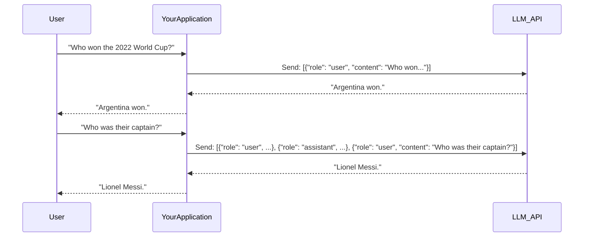

# The Engineer's Guide to Production-Ready Generative AI

- [The Engineer's Guide to Production-Ready Generative AI](#the-engineers-guide-to-production-ready-generative-ai)
  - [The New Frontier of AI Engineering](#the-new-frontier-of-ai-engineering)
  - [Deconstructing the Core Technology](#deconstructing-the-core-technology)
  - [Building Conversational Intelligence](#building-conversational-intelligence)
  - [From Output to Insight: Evaluating AI Responses](#from-output-to-insight-evaluating-ai-responses)
  - [Advanced Architectures for Complex Problems](#advanced-architectures-for-complex-problems)
  - [Fortifying and Operationalizing AI Systems](#fortifying-and-operationalizing-ai-systems)


## The New Frontier of AI Engineering

The advent of powerful, pre-trained Large Language Models (LLMs) has catalyzed the emergence of a new and distinct discipline: AI Engineering. This field represents a significant paradigm shift from traditional Machine Learning. While ML engineering has historically focused on the painstaking, data-centric process of collecting vast datasets and training models from scratch, AI engineering is fundamentally about adaptation and application in a model-centric world. The core challenge is no longer building the engine, but learning how to expertly drive the high-performance vehicle that has been provided.

A modern AI engineer's primary role is to adapt, orchestrate, and deploy existing foundation models to solve real-world problems. This shift is defined by three key differentiators:

  * **Adaptation over Training**: The new workflow prioritizes adapting colossal, pre-trained models rather than building smaller ones from the ground up. This adaptation takes many forms, from the surgical precision of crafting the perfect instructions (Prompt Engineering), to the knowledge infusion of giving the model access to private data (Retrieval-Augmented Generation), to the behavioral sculpting of specializing the model on a task (Fine-Tuning).
  * **New Infrastructure Demands**: LLMs introduce unique infrastructure challenges, including higher latency, significant computational costs, and new design patterns to handle their scale.
  * **The Complexity of Evaluation**: Unlike traditional software where a test passes or fails, AI models produce open-ended, nuanced outputs. Programmatically evaluating the "quality" of a generated paragraph or the "helpfulness" of a chatbot’s response requires new frameworks for testing, evaluation, and monitoring to ensure reliability.

## Deconstructing the Core Technology

To truly master Generative AI, one must understand the engine that drives it. At its very core, a Large Language Model is a machine that is exceptionally good at one thing: predicting the next most probable word in a sequence. It can be thought of as the most powerful autocomplete ever created. When it generates a paragraph, it is simply performing this "predict the next word" task over and over again. It predicts a word, appends it to the sequence, and then uses that new, longer sequence to predict the *next* word.

This process is powered by a few key innovations within what is known as the Transformer architecture.

First, computers do not understand words; they understand numbers. Before an LLM can process text, it must convert words into a numerical format through a process called **embedding**. Think of embeddings as assigning a unique coordinate to every word or token in a vast, multi-dimensional "meaning space." In this space, words with similar meanings are located close to each other. This allows the model to perform mathematical operations on words, measuring the "distance" between concepts and understanding relationships.

The second critical component is the **attention mechanism**. Once the model has a sequence of words as numerical embeddings, it must determine which previous words are most important for predicting the next one. The attention mechanism is a mathematical process that mimics this cognitive highlighting. For every new word it considers, the model generates a set of "attention scores" for all the previous words in the context. This allows the model to dynamically shift its focus, looking back hundreds or thousands of words to find the most relevant pieces of information, effectively giving it a powerful and flexible short-term memory.

These pieces come together in the model's architecture. An input prompt is broken into tokens, which are converted to numerical embeddings. These embeddings are then processed through a stack of identical layers, each containing the attention mechanism and a feed-forward network for deeper processing. After passing through all layers, the system uses the final processed information to generate a probability distribution over its entire vocabulary and selects the most likely next word. This word is appended to the input, and the entire process repeats.

## Building Conversational Intelligence

With a solid understanding of the underlying theory, we can move to practical application. The quintessential AI application is the chatbot, which serves as an excellent vehicle for learning core development patterns.

The first step is a basic API call. The developer sends a structured payload, typically a list of messages, to the model's API endpoint. This payload distinguishes between a `system` message, which sets the AI's persona and high-level instructions, and a `user` message, which contains the specific query.

```python
# A conceptual example of a basic API call
from openai import OpenAI

client = OpenAI(api_key="YOUR_API_KEY")

# The 'messages' list structures the conversation for the model
messages = [
    {"role": "system", "content": "You are a helpful assistant that explains complex topics simply."},
    {"role": "user", "content": "Explain the theory of relativity in one sentence."}
]

# The API call sends the request to the model
response = client.chat.completions.create(
   model="gpt-4o",
   messages=messages
)

# The AI's reply is extracted from the response object
ai_response = response.choices[0].message.content
print(f"AI: {ai_response}")
```

The quality of the `ai_response` is directly proportional to the quality of the input prompt. Prompt engineering is the craft of designing these inputs to elicit the desired response. Fundamental techniques include **role prompting** (assigning a persona in the system message), providing **few-shot examples** (giving the model examples of the desired output format within the prompt), and using **clear delimiters** like XML tags or backticks to separate instructions from user input.

A critical concept to grasp is that LLM APIs are **stateless**. Each API call is an independent event; the model has no inherent memory of past conversations. To create the illusion of a continuous dialogue, the application must manage the conversation history itself, appending each user query and assistant response to a list and sending the entire history with every new turn.



This approach has a significant trade-off: as the conversation grows, the number of tokens sent increases, leading to higher costs and latency. Production systems require sophisticated strategies like summarizing or windowing the history to manage this.

## From Output to Insight: Evaluating AI Responses

A chatbot that can talk is a starting point, but how do you verify its quality? Evaluating the subjective, nuanced output of an LLM is a significant challenge. Unlike traditional software, AI quality exists on a spectrum. Moving evaluation from a vague "looks good" to a structured, repeatable process is essential for production.

The first step is to define what "good" means for your specific use case. An **evaluation rubric** is a simple and powerful tool for this. Before writing more code, the developer should write down the success criteria. For an AI that summarizes news articles, a rubric might include axes like:

  * **Faithfulness (Score 1-5):** Does the summary accurately reflect the source article without adding information?
  * **Brevity (Score 1-5):** Is the summary appropriately concise?
  * **Clarity (Score 1-5):** Is the summary easy to read and understand?

Using humans for evaluation is high-quality but slow and expensive. A powerful modern technique is **LLM-as-a-Judge**, where a capable model is used to automate the evaluation process. The workflow involves sending the original query, the generated response, and the evaluation rubric to a powerful "judge" LLM, instructing it to score the response according to the rubric and provide a rationale.

```mermaid
graph TD
    A[User Query] --> B(Application LLM);
    B --> C{Generated Response};
    C --> D(Evaluation Prompt);
    E[Your Rubric] --> D;
    A --> D;
    D --> F(Judge LLM);
    F --> G[Evaluation Result (JSON Score + Rationale)];

    style F fill:#d4edda,stroke:#155724,stroke-width:2px
```

By operationalizing evaluation, engineers create a feedback loop that is essential for improving AI applications. They can now tweak prompts, change models, or add more context, and then re-run the evaluation suite to measure the impact on quality.

## Advanced Architectures for Complex Problems

Beyond basic conversation, advanced architectures enable LLMs to solve complex problems, access external knowledge, and interact with other systems.

A significant limitation of LLMs is that their knowledge is frozen at the time of their training. They cannot access real-time information and are prone to "hallucinating" facts. **Retrieval-Augmented Generation (RAG)** is the most effective pattern to solve this. RAG turns a closed-book exam into an open-book exam, allowing the model to consult relevant source materials before answering. The process involves two phases:

1.  **Indexing (Offline)**: Private documents are broken down into smaller chunks, converted into numerical embeddings, and stored in a specialized **vector database**.
2.  **Retrieval & Generation (Online)**: When a user asks a question, the system finds the most relevant document chunks from the database and adds them to the prompt along with the user's question. This forces the LLM to ground its answer in the provided data, dramatically reducing hallucinations.

<!-- end list -->

```mermaid
graph TD
    subgraph Indexing Phase (Offline)
        A[Your Documents] --> B(Chunking) --> C(Embedding) --> D[Vector Database];
    end
    subgraph "Retrieval & Generation Phase (Online)"
        E[User Question] --> F(Embedding) --> G(Search Vector DB) --> H[Retrieved Chunks];
        H --> I{Augmented Prompt};
        E --> I;
        I --> J(LLM) --> K[Grounded Answer];
    end
```

While RAG enhances an LLM's knowledge, an **AI Agent** enhances its ability to *act*. An Agent uses an LLM as a reasoning engine to make decisions and execute a sequence of actions to achieve a goal. The core of an Agent is a reasoning loop, often referred to as **ReAct (Reason + Act)**. The LLM is given a high-level goal and a list of available "tools" (e.g., a web search function, a calculator). It then iterates through a loop:

1.  **Think**: The LLM reasons about the goal and decides which tool to use first.
2.  **Act**: The application code parses the LLM's decision and executes the chosen tool.
3.  **Observe**: The result of the action is fed back into the LLM as a new observation, starting the loop again until the goal is accomplished.

## Fortifying and Operationalizing AI Systems

Deploying a robust, secure, and reliable AI application requires significant engineering discipline. **LLMOps** (Large Language Model Operations) extends DevOps principles to the unique lifecycle of LLM-powered applications, covering areas like prompt version control, structured evaluation pipelines, and monitoring for cost, latency, and behavioral drift.

Security is paramount. When an LLM is exposed to user input, it becomes vulnerable to **prompt injection**, where a user crafts an input to hijack the model's instructions. Mitigation requires **Defensive Prompting**. This involves using strong system prompts that clearly define the AI's role, using delimiters to separate instructions from untrusted user input, and sanitizing inputs and outputs.

Furthermore, the quality of any AI system's output is fundamentally capped by the quality of its input data. For RAG systems especially, this principle of "Garbage In, Gospel Out" is critical. If the knowledge base documents are inaccurate or outdated, the AI's answers will be equally flawed. Data for AI must be clean, well-structured, up-to-date, and rich in metadata for filtering and verification.

Finally, the engineer's primary strategic decision is *how* to adapt a foundation model. The choice between Prompt Engineering, RAG, and Fine-Tuning depends on the specific problem:

  * **Prompt Engineering** is best for quick prototyping and general reasoning tasks.
  * **RAG** is ideal for question-answering over private or dynamic documents where verifiability is key.
  * **Fine-Tuning** is most suitable for teaching a model a new skill, style, or specific output format, rather than new factual knowledge.

The field of Generative AI is defined by rapid evolution. The journey from a simple chatbot to a secure, robust, and effective production system requires a multi-faceted understanding of theory, practical application, advanced architectures, and operational discipline. By mastering these principles, engineers can move beyond mere prototyping and begin to build the next generation of intelligent applications.