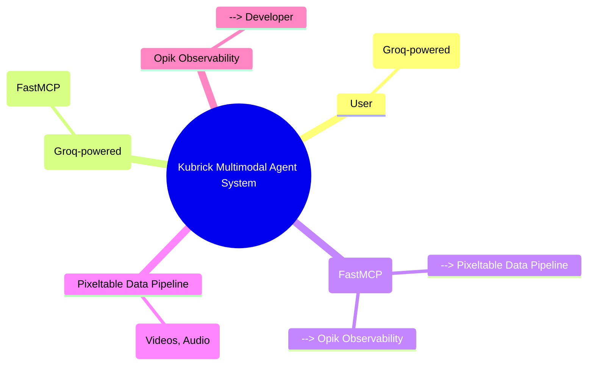
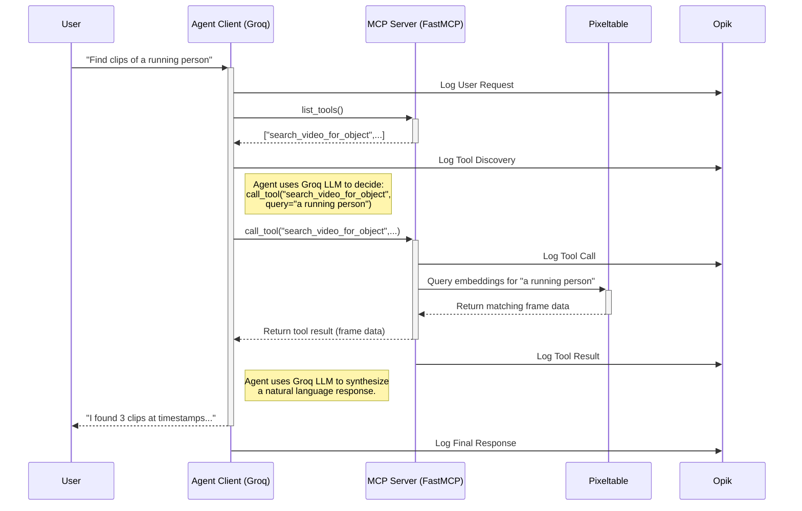
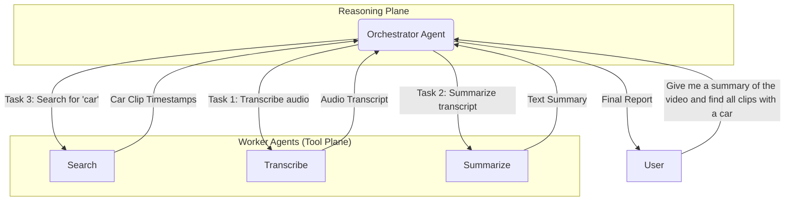
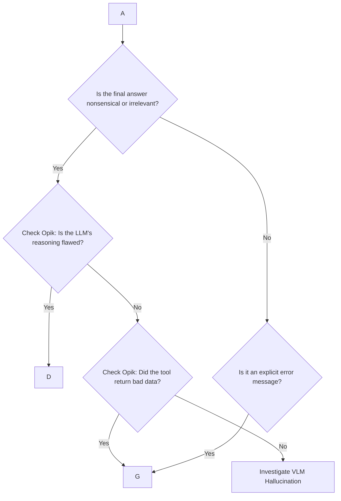
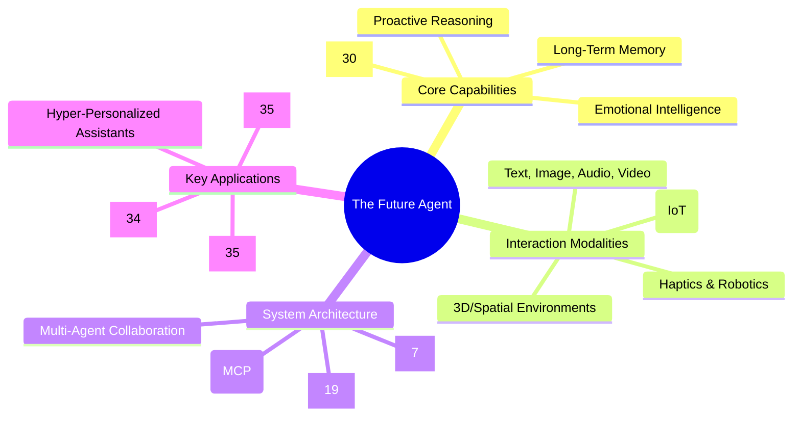

# Kubrick Course Learning Guide to Multimodal AI Systems

1. An official introducing article: https://multimodalai.substack.com/p/introducing-kubrick-course-a-multimodal

2. Course Github repository: https://github.com/multi-modal-ai/multimodal-agents-course

## Table Of Contents
- [Kubrick Course Learning Guide to Multimodal AI Systems](#kubrick-course-learning-guide-to-multimodal-ai-systems)
  - [Table Of Contents](#table-of-contents)
  - [The Big Picture: Architecting an Intelligent System](#the-big-picture-architecting-an-intelligent-system)
    - [The Kubrick Vision: A New Set of Eyes and Ears](#the-kubrick-vision-a-new-set-of-eyes-and-ears)
    - [System Overview: The Four Pillars of the Kubrick Agent](#system-overview-the-four-pillars-of-the-kubrick-agent)
  - [First Principles: Deconstructing Multimodality and MCP](#first-principles-deconstructing-multimodality-and-mcp)
    - [Concept 1: What is a Multimodal Agent?](#concept-1-what-is-a-multimodal-agent)
    - [Concept 2: What is the Model Context Protocol (MCP)?](#concept-2-what-is-the-model-context-protocol-mcp)
    - [Self-Test Questions](#self-test-questions)
  - [Theory to Practice: Building the Kubrick Video Search Agent](#theory-to-practice-building-the-kubrick-video-search-agent)
    - [Module 0: Setup and Prerequisites](#module-0-setup-and-prerequisites)
    - [Module 1: The Data Foundation with Pixeltable](#module-1-the-data-foundation-with-pixeltable)
    - [Module 2: The Tool Server with FastMCP](#module-2-the-tool-server-with-fastmcp)
    - [Module 3: The Agentic Brain with Groq](#module-3-the-agentic-brain-with-groq)
    - [Module 4: Production-Ready Observability with Opik](#module-4-production-ready-observability-with-opik)
    - [Sequence Diagram: Tracing a Live Request](#sequence-diagram-tracing-a-live-request)
    - [Practical Questions](#practical-questions)
  - [Advanced Topics: Scaling and Enhancing Your Agent](#advanced-topics-scaling-and-enhancing-your-agent)
    - [From Stateless to Stateful: Giving Your Agent a Memory](#from-stateless-to-stateful-giving-your-agent-a-memory)
    - [From Single Agent to Multi-Agent Collaboration](#from-single-agent-to-multi-agent-collaboration)
    - [Advanced Fusion Techniques](#advanced-fusion-techniques)
    - [Diagram: A Collaborative Multi-Agent System](#diagram-a-collaborative-multi-agent-system)
    - [Advanced Questions](#advanced-questions)
  - [Challenges \& Best Practices: Navigating Production Pitfalls](#challenges--best-practices-navigating-production-pitfalls)
    - [Identifying Common Pitfalls](#identifying-common-pitfalls)
    - [Heuristics and Best Practices (The Kubrick Way)](#heuristics-and-best-practices-the-kubrick-way)
    - [Decision-Making Diagram: A Debugging Workflow](#decision-making-diagram-a-debugging-workflow)
  - [The Horizon: The Future of Multimodal, Agentic Systems](#the-horizon-the-future-of-multimodal-agentic-systems)
    - [Emerging Trends in Agentic AI](#emerging-trends-in-agentic-ai)
    - [The Future of Tooling and Protocols](#the-future-of-tooling-and-protocols)
    - [Curated Resources for Continuous Learning](#curated-resources-for-continuous-learning)
    - [Mindmap: The Future of Agentic AI](#mindmap-the-future-of-agentic-ai)

## The Big Picture: Architecting an Intelligent System

Welcome to the frontier of Artificial Intelligence. While many tutorials demonstrate how to connect a Large Language Model (LLM) to a simple API, the modern world demands more. We are moving beyond basic text-in, text-out chatbots and into an era of AI systems that can perceive, reason about, and act upon the world in all its rich complexity. This guide, based on the open-source Kubrick Course, is designed for developers and engineers who want to build these serious, production-ready AI systems.1 The goal is to create agents that can understand not just text, but also images, audio, and video, fusing these different streams of information to achieve a truly comprehensive understanding.2

### The Kubrick Vision: A New Set of Eyes and Ears

The name of this course is a direct homage to Stanley Kubrick's cinematic masterpiece, _2001: A Space Odyssey_, and its iconic, all-perceiving AI, HAL 9000-the archetypal multimodal agent. Our mission is to build a "HAL themed spin-off," an agent that serves as a new set of "eyes and ears" for a user, capable of intelligently searching and reasoning about video content.1

It is crucial to distinguish this "Kubrick Course" from two other related but distinct projects. This course focuses on building a **video understanding agent**. It is not to be confused with the "Kubrick Paper," a research project on using multi-agent collaboration for synthetic **video generation** 4, nor is it related to Google's "Kubric" project, which is a data generation pipeline for creating synthetic videos for research.6 Our focus here is practical application: building an agent that can watch and understand video for you.

### System Overview: The Four Pillars of the Kubrick Agent

Building a production-grade multimodal agent is not just about having a powerful LLM; it's about architecting a robust system around it. The challenges are significant: multimodal data is notoriously complex, integrating various tools can become a nightmare, inference speed is critical for a good user experience, and a lack of observability can make debugging nearly impossible.7

The Kubrick Course presents an opinionated, synergistic stack where each component is chosen to solve one of these specific production bottlenecks.1 This architecture stands on four pillars:

1. **Pixeltable:** This is the data engine. It tackles the challenge of multimodal data complexity by providing a specialized platform to manage, process, and index video, image, and audio data streams.
    
2. **FastMCP:** This is the integration framework. It solves the tool integration problem by using the Model Context Protocol (MCP) to create a standardized server that cleanly exposes the system's capabilities (like video search) to the agent.
    
3. **Groq:** This is the inference engine. It addresses the need for speed by providing an LPU (Language Processing Unit) that delivers exceptionally fast, low-latency reasoning, making the agent responsive and interactive.
    
4. **Opik:** This is the observability platform. It solves the debugging and monitoring challenge by providing a dedicated service to track, analyze, and version all interactions within the system, from user queries to tool calls and LLM responses.
    

Together, these components form a blueprint for a modern, scalable, and maintainable multimodal AI system. The following mindmap illustrates how they fit together.




## First Principles: Deconstructing Multimodality and MCP

Before we write a single line of code, it's essential to understand the core concepts that make the Kubrick agent possible. We will use the Feynman Technique-breaking down complex ideas into simple analogies-to build a true, intuitive understanding of the two foundational pillars of this course: Multimodal Agents and the Model Context Protocol (MCP).9

### Concept 1: What is a Multimodal Agent?

Let's start with a simple analogy. Imagine a detective investigating a case. A rookie detective might only be able to read text-based witness reports. This detective is **unimodal**-they operate on a single type of data (text). While useful, their understanding is limited.

Now, imagine a master detective. This expert doesn't just read reports (text). They also analyze crime scene photos (images), listen to audio recordings of interviews (audio), and watch security camera footage (video). By combining, or _fusing_, clues from all these different types of information-these different **modalities**-the master detective develops a much deeper, more accurate, and more nuanced understanding of the case. They can cross-reference what a witness said with what the video shows, leading to breakthroughs the rookie would miss.2

A **multimodal agent** is like this master detective. It's an AI system designed to process, understand, and reason about information from multiple data types simultaneously.3 This approach mimics human perception and leads to significant benefits:

- **Improved Accuracy:** By cross-referencing information from different sources, the agent can make more robust decisions and is less susceptible to errors or ambiguities present in a single data type.2
    
- **Enhanced User Experience:** Users can interact more naturally, using their preferred mode of communication, whether it's typing a command, speaking it, or showing the agent an image.2
    
- **Deeper Contextual Understanding:** The agent gains a more holistic view of a situation, which is critical for complex, real-world applications like analyzing medical scans alongside patient notes or navigating a self-driving car using cameras, LiDAR, and microphones.2
    

Architecturally, a multimodal agent typically consists of an **input layer** to receive data, **modality-specific processors** (e.g., a computer vision model for images, a speech-to-text model for audio), a **fusion layer** to combine the processed information, and a **reasoning engine** (often an LLM) to make decisions based on the fused context.2

### Concept 2: What is the Model Context Protocol (MCP)?

Now, let's tackle the second key concept. Imagine you're an electronics enthusiast in a world before universal standards. You have dozens of devices-a phone, a laptop, a camera, headphones-and each one has a unique, proprietary charging port. To connect them to power or to each other, you need a specific, custom-built adapter for every single connection. The result is a nightmare of tangled cables and incompatibility. This is the **"M×N integration problem"**: connecting _M_ AI models to _N_ different tools and data sources requires a messy, unscalable _M_ times _N_ number of custom integrations.12

The **Model Context Protocol (MCP)** is the solution to this problem. Think of it as the invention of **USB-C for AI**.13 MCP is an open, standardized protocol that creates a universal "port" for AI systems. Instead of custom wiring, any AI application that "speaks" MCP can now seamlessly connect to any tool or data source that also "speaks" MCP. It transforms the chaotic M×N mess into a clean, manageable M+N "plug-and-play" ecosystem.12

Technically, MCP is an open standard, first introduced by Anthropic and now widely adopted, that uses a client-server architecture built on the JSON-RPC 2.0 message format.14 Here's how the pieces fit together:

- **MCP Host:** This is the main AI application the user interacts with, like an IDE or a chatbot. In our case, it's our Kubrick agent client.
    
- **MCP Client:** This is a component _within_ the host that manages the connection to a specific tool.
    
- **MCP Server:** This is a lightweight program that wraps a tool, a database, or any external system, exposing its capabilities to the MCP network.
    

The process is simple: the agent's MCP client connects to an MCP server and asks, "What can you do?" The server responds with a list of available **tools** (executable functions, like `search_video`) and **resources** (structured data, like a configuration file). The agent's LLM brain can then decide to use these capabilities to fulfill a user's request.16

This standardization is a strategic game-changer. It commoditizes the "plumbing" of AI systems, shifting the focus from building bespoke connectors to creating more intelligent agents and more powerful, unique tools. By learning to build with MCP, you are preparing for a future where value lies not in the connection itself, but in the intelligence that flows through it.

The diagram below illustrates this transformative shift.

**The Integration Problem: Before and After MCP**

- **Before MCP (The M×N Mess):**
    
    - Agent A <--> Custom Connector <--> Tool 1
        
    - Agent A <--> Custom Connector <--> Tool 2
        
    - Agent B <--> Custom Connector <--> Tool 1
        
    - Agent B <--> Custom Connector <--> Tool 2
        
        (A tangled web of point-to-point integrations)
        
- **After MCP (The M+N Solution):**
    
    - Agent A (Client) --> [Universal MCP Protocol] <-- Tool 1 (Server)
        
    - Agent B (Client) --> [Universal MCP Protocol] <-- Tool 2 (Server)
        
        (A clean, hub-and-spoke model where any client can talk to any server)
        

### Self-Test Questions

1. In your own words, what is the main difference between a unimodal and a multimodal agent?
    
2. Using the USB-C analogy, explain what an "MCP server" and an "MCP client" are.
    
3. What is the "M×N integration problem," and how does MCP address it?
    

## Theory to Practice: Building the Kubrick Video Search Agent

With a solid grasp of the first principles, it's time to translate theory into practice. This section provides a step-by-step guide to building the complete Kubrick agent, following the modular structure of the official course. We will build the system piece by piece, from the data foundation to the agentic brain, culminating in a fully functional, production-ready video search agent.

### Module 0: Setup and Prerequisites

Before we begin, we need to set up our development environment. This ensures all necessary tools and credentials are in place.

1. **Clone the Repository:** Start by cloning the official course repository from GitHub, which contains all the necessary code templates and configuration files.1
  
    ```bash
    git clone https://github.com/multi-modal-ai/multimodal-agents-course.git
    cd multimodal-agents-course
    ```
    
2. **Environment Setup:** Create a Python virtual environment and install the required dependencies listed in the `requirements.txt` file. This isolates our project and prevents conflicts with other Python projects.
    
3. **API Key Configuration:** The Kubrick agent uses OpenAI for its Vision Language Model (VLM) capabilities and Groq for its fast LLM inference. You will need to obtain API keys from both services. The course is designed to be completed using the free tiers offered by these providers, which are sufficient for running the examples.1 Store these keys securely as environment variables.
    

### Module 1: The Data Foundation with Pixeltable

The first step in building our "eyes and ears" is to create a system that can process and understand video. The goal of this module is to build a multimodal processing pipeline using Pixeltable.1

Annotated Code: Video Ingestion and Embedding

The following Python script demonstrates how to use Pixeltable to ingest a video, extract its frames, and generate vector embeddings for each frame. These embeddings are numerical representations that capture the semantic meaning of an image, making them searchable.

```python
import pixeltable as pxt
from pixeltable.functions.video import extract_frames
from pixeltable.functions.image import openai_vision

# 1. Initialize Pixeltable client
# This connects to the Pixeltable database.
client = pxt.Client()

# 2. Create a table to store video data
# 'video_path' is the column for the video file, with type 'video'.
# 'fps' stores the frames-per-second we want to extract.
videos = client.create_table('videos', {'video_path': pxt.VideoType(), 'fps': pxt.IntType()})

# 3. Create a view to extract frames
# A 'view' is a derived table. This one uses the `extract_frames` function.
# It takes the video from the 'videos' table and extracts frames at the specified 'fps'.
frames = client.create_view(
    'frames', videos,
    schema={'video_id': pxt.IntType(), 'frame_idx': pxt.IntType(), 'frame': pxt.ImageType()},
    map={'video_id': videos.id, 'frame_idx': videos.video_path.frame_idx, 'frame': videos.video_path},
    iterator=extract_frames(video_path=videos.video_path, fps=videos.fps)
)

# 4. Create a view to generate embeddings for each frame
# This view uses the OpenAI VLM to describe each frame and generate an embedding.
# The `apply` function calls the `openai_vision` function on each 'frame'.
# 'embedding' is a special column that creates a searchable vector index.
frame_embeddings = client.create_view(
    'frame_embeddings', frames,
    schema={'description': pxt.StringType(), 'embedding': pxt.embedding(pxt.StringType())},
    map={'description': frames.frame.description, 'embedding': frames.frame.embedding},
    apply=openai_vision(frame=frames.frame, output=['description', 'embedding'])
)

# 5. Insert a video into the pipeline
# This triggers the entire pipeline: the video is added, frames are extracted,
# and embeddings are generated and indexed for every frame.
videos.insert(video_path='path/to/your/video.mp4', fps=1)

print("Video processing complete. Frames and embeddings are ready for search.")
```

### Module 2: The Tool Server with FastMCP

Now that our data is processed and indexed, we need a way for our agent to access it. We will build an MCP server using FastMCP to expose a `search_video_for_object` tool.1 FastMCP dramatically simplifies this process, often requiring only a function decorator to expose a tool.18

Annotated Code: Creating the MCP Server

This script defines a tool that can query the Pixeltable database we just created.

```python
from fastmcp import FastMCP
import pixeltable as pxt

# 1. Initialize the FastMCP server
# This creates the server instance that will handle requests from the agent.
mcp = FastMCP(name="KubrickVideoSearchServer")

# 2. Initialize the Pixeltable client
# We need to connect to Pixeltable to perform the search.
client = pxt.Client()

# 3. Define the search tool using the @mcp.tool decorator
# This decorator exposes the 'search_video_for_object' function as a callable tool.
# FastMCP automatically generates the necessary schema from the type hints and docstring.
@mcp.tool
def search_video_for_object(query: str) -> list:
    """
    Searches the video frames for a given object or action described in the query.
    Returns a list of timestamps where the object was found.
    """
    # 4. Access the embeddings table in Pixeltable
    frame_embeddings = client.get_table('frame_embeddings')

    # 5. Perform a similarity search
    # The `search` method finds embeddings most similar to the embedding of the text query.
    # It returns the top 5 matching frames.
    results = frame_embeddings.search(query=query).limit(5).collect()

    # 6. Format and return the results
    # We extract the timestamps (frame_idx) and return them.
    timestamps = [res['frame_idx'] for res in results]
    return timestamps

# 7. Run the server (if this script is executed directly)
if __name__ == "__main__":
    mcp.run()
```

### Module 3: The Agentic Brain with Groq

With our data pipeline and tool server in place, we need to build the agent itself-the "brain" that will receive user requests, decide which tools to use, and generate responses. We use Groq for its high-speed inference, which is critical for a responsive agent.1

Annotated Code: The Agent Client

This script creates the agent, connects it to our MCP server, and implements the core reasoning loop.

```python
from groq import Groq
from fastmcp import Client
import asyncio

# 1. Initialize API clients
# The Groq client for LLM inference and the FastMCP client to connect to our server.
groq_client = Groq(api_key="YOUR_GROQ_API_KEY")
mcp_client = Client("python server.py") # Points to our MCP server script

async def run_agent():
    # 2. Connect to the MCP server
    await mcp_client.start()

    # 3. Get the list of available tools from the server
    tools = await mcp_client.list_tools()
    tool_definitions = [{"type": "function", "function": tool.spec} for tool in tools]

    # 4. Get user input
    user_query = input("What would you like to search for in the video? ")

    # 5. The core agentic loop (Reason -> Act)
    # First, ask the LLM to decide which tool to call based on the user's query.
    response = groq_client.chat.completions.create(
        model="llama3-8b-8192",
        messages=[
            {"role": "system", "content": "You are a helpful assistant that uses available tools to answer questions about a video."},
            {"role": "user", "content": user_query}
        ],
        tools=tool_definitions,
        tool_choice="auto"
    )

    # 6. Execute the chosen tool
    tool_call = response.choices.message.tool_calls
    if tool_call.function.name == "search_video_for_object":
        arguments = eval(tool_call.function.arguments)
        # Call the tool via the MCP client
        tool_result = await mcp_client.call_tool(tool_call.function.name, arguments)
        
        # 7. Synthesize the final answer
        # Give the tool's result back to the LLM to generate a natural language response.
        final_response = groq_client.chat.completions.create(
            model="llama3-8b-8192",
            messages=
        )
        print(final_response.choices.message.content)

    # 8. Shutdown the client connection
    await mcp_client.stop()

if __name__ == "__main__":
    asyncio.run(run_agent())
```

### Module 4: Production-Ready Observability with Opik

The final piece of the puzzle is ensuring our system is transparent and manageable in a production environment. Integrating Opik provides full observability into every step of the agent's operation, which is a cornerstone of modern LLMOps.1 This involves wrapping our existing components with the Opik SDK, which then automatically captures and logs all relevant data-user prompts, LLM reasoning steps, tool calls, and final outputs-to a centralized dashboard for analysis. This addresses a critical software engineering principle for building complex AI systems: if you can't see what it's doing, you can't fix it.

### Sequence Diagram: Tracing a Live Request

The following diagram illustrates the complete, end-to-end flow of information when a user makes a request to the fully assembled Kubrick agent. This visualization clarifies the separation of concerns: the Agent Client handles reasoning, while the MCP Server and Pixeltable handle tool execution and data processing.




### Practical Questions

1. In the Pixeltable module, why do we generate embeddings for video frames? How does this enable search?
    
2. What is the purpose of the `@mcp.tool` decorator in the FastMCP server code?
    
3. Explain the role of the Groq-powered LLM in the agent's decision-making loop. Why is inference speed important here?
    

## Advanced Topics: Scaling and Enhancing Your Agent

The Kubrick Course provides the foundation for a powerful multimodal agent. However, the field of agentic AI is advancing rapidly. This section explores state-of-the-art concepts that build upon the core Kubrick architecture, guiding you toward even more sophisticated and capable systems.

### From Stateless to Stateful: Giving Your Agent a Memory

The agent we built is **stateless**; it treats every query as a brand-new interaction, with no memory of past conversations. A **stateful** agent, by contrast, maintains context across multiple turns. This capability, often called long-term coherence, is critical for more natural and effective interactions.1

Imagine this conversation with our stateless agent:

> User: "Find clips of a dog in the video."
> 
> Agent: "I found clips at 0:15, 0:48, and 1:12."
> 
> User: "Now show me only the ones where it's running."
> 
> Agent: "I'm sorry, I don't know what 'it' refers to."

A stateful agent with memory would understand that "it" refers to the dog from the previous turn. This can be implemented using a pattern similar to Retrieval-Augmented Generation (RAG).20 Each conversation turn (both user query and agent response) can be stored as an embedding in a vector database. When a new query comes in, the agent first retrieves relevant turns from its memory to build a richer context before generating a response.

### From Single Agent to Multi-Agent Collaboration

Complex problems are often best solved by a team of specialists rather than a single generalist. This principle applies to AI as well. The future of agentic AI lies in **multi-agent systems**, where multiple specialized agents collaborate to achieve a common goal.19

A powerful real-world example of this architecture comes from the _Kubrick video generation paper_.4 While that project's goal was different (creating video), its architectural pattern is highly relevant. It uses a team of three agents:

1. **Director Agent:** The strategist. It receives a high-level goal (e.g., "create a comprehensive analysis of this video") and breaks it down into a sequence of smaller, manageable tasks.
    
2. **Programmer/Worker Agent:** The specialist. This agent is designed to execute a single, well-defined task. The Kubrick video search agent we built is a perfect example of a worker agent. Other workers could include an audio transcription agent, a text summarization agent, or an object tracking agent.
    
3. **Reviewer/Orchestrator Agent:** The manager. This agent evaluates the output from the worker agents, decides if the task is complete, provides feedback for iterative improvement, and coordinates the overall workflow. This "orchestrator" role is a key trend in the future of AI systems.19
    

This architecture demonstrates a sophisticated separation of concerns. The agent we built is a powerful tool, but it becomes even more valuable as part of a larger, collaborative system. This mirrors the evolution of software from monolithic applications to microservice architectures, where specialized services are orchestrated to deliver complex functionality.

### Advanced Fusion Techniques

Our Kubrick agent uses a simple form of data fusion: it processes video into a searchable format and then uses text to query it. More advanced systems employ more sophisticated fusion techniques to combine modalities.2 The main categories are:

- **Early Fusion:** This method combines raw data from different modalities at the very beginning of the process. For example, it might combine video pixels and audio waveforms into a single large representation before feeding it to a model. This can capture deep, subtle interactions between modalities but is computationally expensive and requires perfectly synchronized data.
    
- **Late Fusion:** This method processes each modality independently and then combines the results at the decision-making stage. For example, one model analyzes video, another analyzes audio, and a third model (the reasoning engine) looks at both of their outputs to make a final conclusion. This approach is more modular and robust to errors in a single stream but may miss low-level cross-modal correlations.
    
- **Hybrid Fusion:** This approach combines features at multiple stages, attempting to get the best of both worlds. It offers a balance of performance and modularity but can be more complex to design.
    

### Diagram: A Collaborative Multi-Agent System

The following diagram shows how an Orchestrator Agent could manage a team of specialized agents, including our Kubrick Search Agent, to fulfill a complex user request.




### Advanced Questions

1. How would adding memory change the user's interaction with the Kubrick agent? Provide an example conversation.
    
2. In the Director-Programmer-Reviewer model, which agent is most similar to the base Kubrick agent we built? What new capabilities would the other two agents add?
    
3. When might you choose Late Fusion over Early Fusion for a multimodal task?
    

## Challenges & Best Practices: Navigating Production Pitfalls

Deploying a multimodal agent into a production environment introduces a new set of challenges that go beyond model accuracy. Real-world systems must be robust, reliable, secure, and maintainable. This section identifies common pitfalls and provides best practices for navigating them, leveraging the tools from the Kubrick stack.

### Identifying Common Pitfalls

Building and deploying multimodal agents can be fraught with difficulties. Awareness of these potential issues is the first step toward mitigation.

- **Data and Tooling Issues:** The quality of an agent's output is fundamentally limited by the quality of its inputs. **Data alignment** is a critical challenge; for example, ensuring that transcribed audio segments are correctly synchronized with the corresponding video frames. **Tool failures** are another concern; a tool might fail silently or return incorrect data, leading the agent to make flawed decisions.7
    
- **Model-Level Issues:** Vision Language Models (VLMs), like LLMs, can **hallucinate**, generating plausible but factually incorrect descriptions of video content. They can also be **brittle**, performing well on training data but failing when faced with slightly different or unexpected inputs in the real world.24
    
- **System-Level Issues:** Multimodal processing is **computationally expensive**, leading to high operational costs and potential latency issues. The distributed nature of agentic systems makes **debugging complex**, as a single request may traverse multiple models and services. Finally, giving an agent the ability to execute tools introduces significant **security risks** if access is not properly controlled.13
    

### Heuristics and Best Practices (The Kubrick Way)

The Kubrick Course stack is specifically designed to address these production challenges. The key to production-readiness is not necessarily having a flawless model, but having a robust, observable, and iterative system built around it.

- **For Data Issues:** Treat your data pipeline as a first-class citizen. Use a dedicated data engine like **Pixeltable** to version, validate, and systematically preprocess your multimodal data. This ensures that data is clean, aligned, and ready for your agent to use.
    
- **For Model Issues:** Don't treat the model as an infallible black box. Use rigorous prompt engineering to guide and constrain the model's behavior. Version and track your prompts using **Opik** to systematically test what works and quickly roll back changes that degrade performance. Providing few-shot examples within the prompt can also dramatically reduce hallucinations.
    
- **For System Issues:** Embrace observability. Use **Opik** to get a unified view of your entire system, tracing requests from the user through the agent, to the tool server, and back. This makes debugging distributed systems manageable. Secure your tool endpoints using the built-in authentication features of frameworks like **FastMCP**.18 Manage costs and latency by choosing efficient models and hardware, such as the
    
    **Groq** LPU.
    

The following table provides a quick-reference guide for diagnosing and mitigating common issues.

**Table 5.1: Common Pitfalls in Multimodal Agent Production**

| Pitfall                    | Common Symptoms                                                               | Mitigation Strategy (using Kubrick Stack)                                                                                                                          |
| -------------------------- | ----------------------------------------------------------------------------- | ------------------------------------------------------------------------------------------------------------------------------------------------------------------ |
| **VLM Hallucination**      | Agent describes objects or events in a video that are not present.            | Use strong, specific system prompts. Provide few-shot examples of correct analysis. Version and track prompts with **Opik** to find what works best.               |
| **Data Misalignment**      | Agent incorrectly associates transcribed audio with the wrong video frames.   | Use **Pixeltable** to create a unified data pipeline that ensures timestamps are synchronized across all extracted modalities (frames, audio segments).            |
| **Tool Execution Failure** | The `search_video_for_object` tool returns an error or times out.             | Implement robust error handling in the **FastMCP** server. Use **Opik** to log the exact inputs that caused the tool to fail for easier replication and debugging. |
| **High Inference Latency** | The agent takes too long to respond, leading to a poor user experience.       | Utilize a high-speed inference engine like **Groq**. Cache frequently accessed data or tool results where appropriate.                                             |
| **Security Vulnerability** | An unauthorized user or another agent gains access to the MCP server's tools. | Implement authentication on the **FastMCP** server. Use dynamic tool filtering to expose only necessary tools based on the client's permissions.27                 |

### Decision-Making Diagram: A Debugging Workflow

When an error occurs, a systematic approach to debugging is essential. The following flowchart provides a simple workflow for diagnosing problems in your Kubrick agent system.




## The Horizon: The Future of Multimodal, Agentic Systems

Having built, scaled, and debugged our Kubrick agent, we now look to the future. The field of agentic AI is one of the most dynamic areas of technology, and the principles learned in this course are the building blocks for the next generation of intelligent systems. This final section explores the emerging trends that will define the horizon and provides resources to continue your learning journey.

### Emerging Trends in Agentic AI

The research and development landscape points toward several key trends that will shape the agents of tomorrow:

- **Increased Autonomy and Proactivity:** Agents are evolving from reactive tools that wait for commands to proactive partners that anticipate user needs and initiate tasks independently. Instead of just answering questions, future agents will offer suggestions, automate workflows, and manage complex projects with minimal human oversight.22
    
- **Hyper-Personalization and Emotional Intelligence:** With the addition of long-term memory and the ability to process cues like tone of voice, agents will develop a much deeper understanding of individual users. This will enable hyper-personalized and emotionally intelligent interactions, making them more effective as assistants, tutors, and companions.22
    
- **The Rise of Multi-Agent Systems and Orchestrators:** As we explored in the advanced topics, the paradigm is shifting toward collaborative teams of specialized agents. This "society of minds" approach, managed by sophisticated orchestrator agents, will be capable of tackling problems of a scale and complexity far beyond any single agent. This is a central theme in visions for the future of enterprise AI.19
    
- **Deeper Integration with the Physical World:** The line between digital and physical will continue to blur. Agents will increasingly process data from IoT sensors and use that understanding to interact with and control smart devices, robotic systems, and our physical environment, moving from virtual assistants to true real-world actors.2
    

### The Future of Tooling and Protocols

The success of a multi-agent future hinges on standardized communication. The **Model Context Protocol (MCP)** is poised to become the universal language for this new ecosystem. We can expect to see explosive growth in the number of publicly available MCP servers, creating a vast, interoperable library of tools and data sources for developers.14 Frameworks like

**FastMCP** will be crucial in accelerating this trend by making it trivially easy for developers to wrap their unique capabilities-be it a proprietary database, a new API, or a custom model-into a standard MCP server, contributing to the richness of the ecosystem.18

### Curated Resources for Continuous Learning

Your journey doesn't end here. The following resources will help you stay on the cutting edge of multimodal and agentic AI.

- **Primary Source Code:**(https://github.com/multi-modal-ai/multimodal-agents-course) 1
    
- **Protocol Specification:** [Official Model Context Protocol (MCP) Website](https://modelcontextprotocol.io/specification/2025-03-26) 26
    
- **Tooling Documentation:**([https://github.com/jlowin/fastmcp](https://github.com/jlowin/fastmcp)) 18
    
- **Community and News:**
    
    - Newsletters: The Neural Maze, Neural Bits 1
        
    - GitHub Awesome Lists: [Awesome Large Multimodal Agents](https://github.com/jun0wanan/awesome-large-multimodal-agents) 32
        
- **Academic Research:** Keep an eye on proceedings from top AI conferences where the latest breakthroughs are published, including CVPR (Computer Vision and Pattern Recognition), NeurIPS (Neural Information Processing Systems), and EMNLP (Empirical Methods in Natural Language Processing).33
    

### Mindmap: The Future of Agentic AI

This final mindmap visualizes the interconnected trends shaping the agent of the future, a system that is not just a language model, but a perceptive, collaborative, and proactive entity.




Ultimately, the future of AI appears to be not a single, monolithic AGI, but a globally distributed, collaborative "society of minds." In this future, countless specialized agents will interact through standardized protocols to solve the world's most complex problems. Mastery in this new era will require a dual expertise in both AI model development and distributed systems design. The skills you have acquired in the Kubrick course-building a single, capable, multimodal agent that communicates via a standard protocol-are the essential, foundational building blocks for becoming an architect of these future intelligent systems.