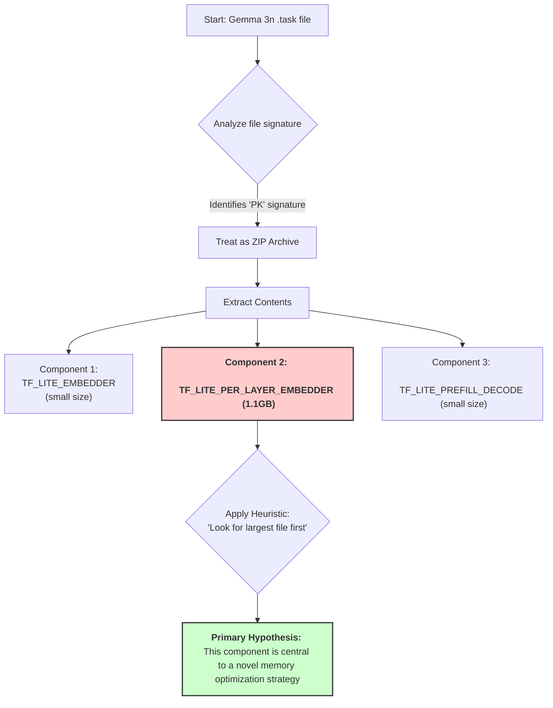
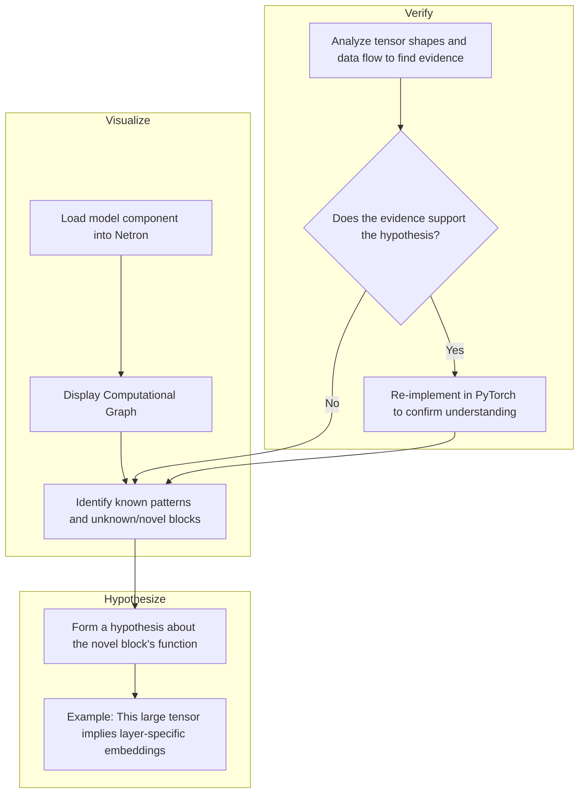
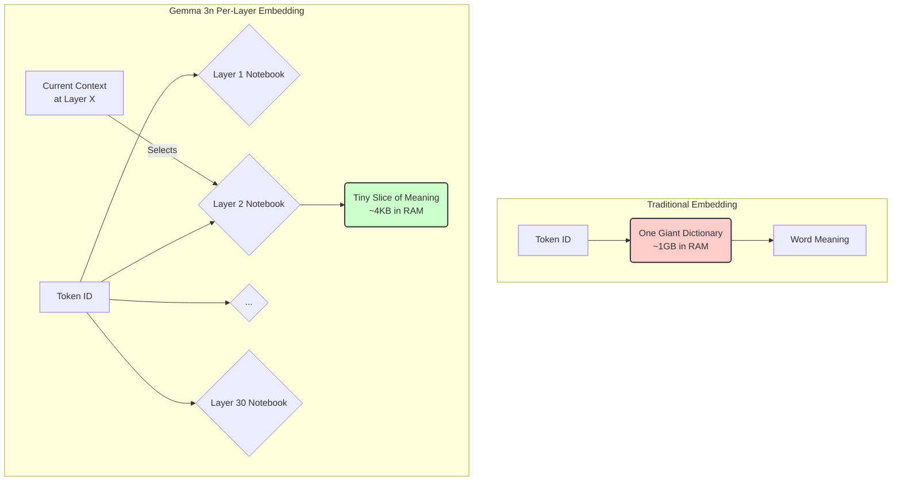
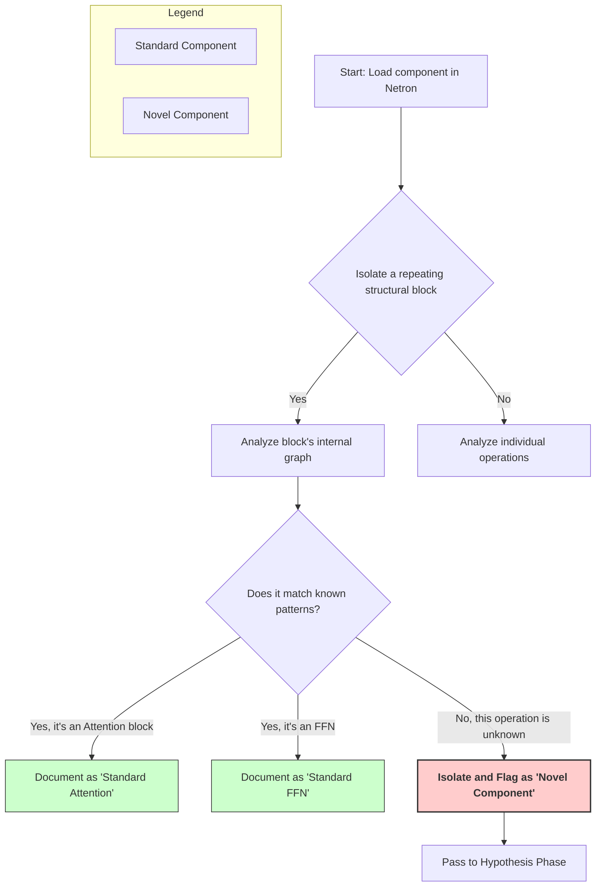
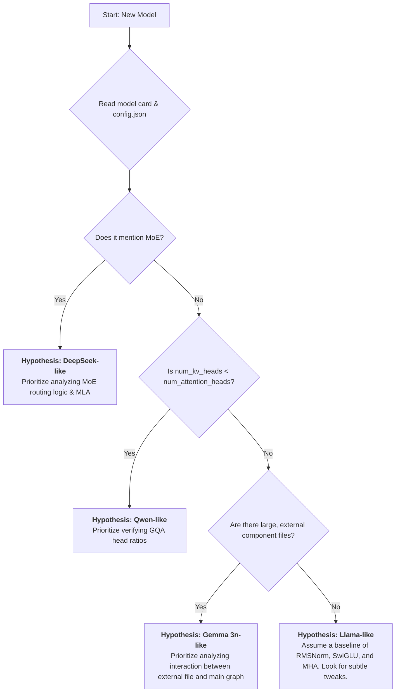
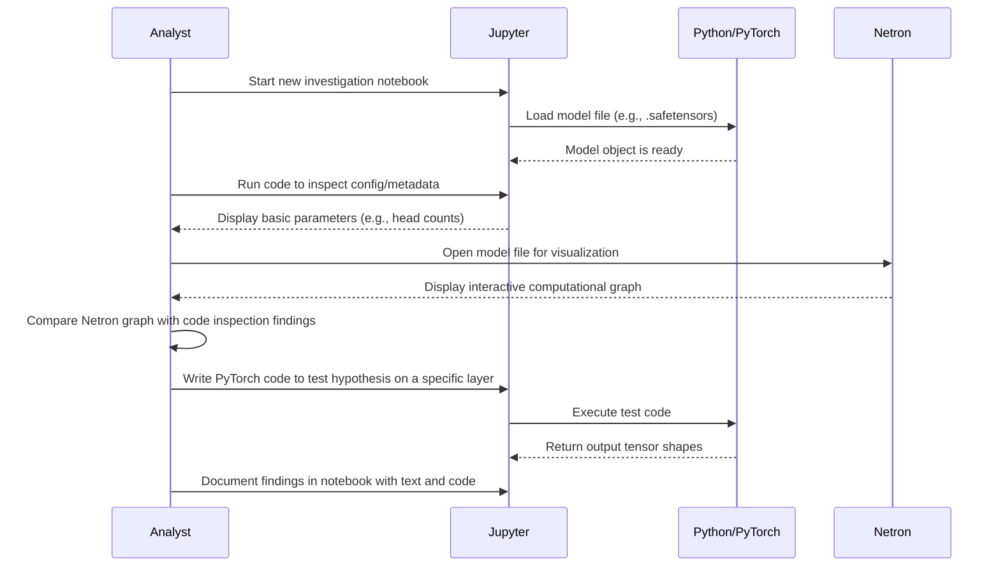
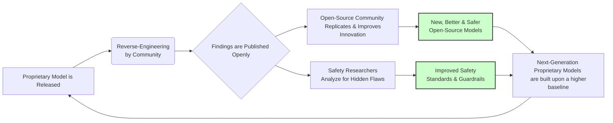

# LLM Reverse-Engineering: A Generalized Framework and Analysis of Modern Architectures

## Table of Contents

- [LLM Reverse-Engineering: A Generalized Framework and Analysis of Modern Architectures](#llm-reverse-engineering-a-generalized-framework-and-analysis-of-modern-architectures)
  - [Table of Contents](#table-of-contents)
  - [**Introduction: Decoding the Black Box**](#introduction-decoding-the-black-box)
    - [Feynman's Corner: The Cartographer's Analogy](#feynmans-corner-the-cartographers-analogy)
    - [Curiosity Corner: Q\&A](#curiosity-corner-qa)
  - [**1. The Gemma 3n Discovery Process: A Methodological Blueprint**](#1-the-gemma-3n-discovery-process-a-methodological-blueprint)
    - [Initial Investigation and File Structure Analysis](#initial-investigation-and-file-structure-analysis)
    - [**Mermaid Diagram: Gemma 3n's File Structure**](#mermaid-diagram-gemma-3ns-file-structure)
    - [Critical Breakthrough: Understanding Per-Layer Embeddings](#critical-breakthrough-understanding-per-layer-embeddings)
    - [Feynman's Corner: The Specialist Library Analogy](#feynmans-corner-the-specialist-library-analogy)
    - [Curiosity Corner: Q\&A](#curiosity-corner-qa-1)
  - [**2. Chronological Sequence of Investigation Techniques**](#2-chronological-sequence-of-investigation-techniques)
    - [**Mermaid Diagram: The "Visualize, Hypothesize, Verify" Loop**](#mermaid-diagram-the-visualize-hypothesize-verify-loop)
    - [Feynman's Corner: The Radio Repair Analogy](#feynmans-corner-the-radio-repair-analogy)
    - [Curiosity Corner: Q\&A](#curiosity-corner-qa-2)
  - [**3. Feynman Technique Explanation: Simplifying Complex Architectures**](#3-feynman-technique-explanation-simplifying-complex-architectures)
    - [Understanding Traditional vs. Per-Layer Embeddings](#understanding-traditional-vs-per-layer-embeddings)
    - [**Mermaid Diagram: Memory Access Patterns**](#mermaid-diagram-memory-access-patterns)
    - [The Gating Mechanism Simplified](#the-gating-mechanism-simplified)
    - [Feynman's Corner: The Teaching Analogy](#feynmans-corner-the-teaching-analogy)
    - [Curiosity Corner: Q\&A](#curiosity-corner-qa-3)
  - [**4. Generalized Step-by-Step Guide for LLM Reverse-Engineering**](#4-generalized-step-by-step-guide-for-llm-reverse-engineering)
    - [**Mermaid Diagram: Step 3 - Detailed Component Analysis**](#mermaid-diagram-step-3---detailed-component-analysis)
    - [Feynman's Corner: The LEGO Set Analogy](#feynmans-corner-the-lego-set-analogy)
    - [Curiosity Corner: Q\&A](#curiosity-corner-qa-4)
  - [**5. Architectural Specifics of Major LLM Families**](#5-architectural-specifics-of-major-llm-families)
    - [**DeepSeek Architecture: The Efficiency Specialist**](#deepseek-architecture-the-efficiency-specialist)
    - [**Llama Architecture: The Refined Powerhouse**](#llama-architecture-the-refined-powerhouse)
    - [**Qwen Architecture: The Multilingual Communicator**](#qwen-architecture-the-multilingual-communicator)
    - [**Mermaid Diagram: Architectural Feature Comparison**](#mermaid-diagram-architectural-feature-comparison)
    - [Feynman's Corner: The Car Engine Analogy](#feynmans-corner-the-car-engine-analogy)
    - [Curiosity Corner: Q\&A](#curiosity-corner-qa-5)
  - [**6. Comparative Analysis and Architectural Adaptations**](#6-comparative-analysis-and-architectural-adaptations)
    - [Memory Optimization Strategies](#memory-optimization-strategies)
    - [Attention Mechanism Variations](#attention-mechanism-variations)
    - [**Mermaid Diagram: Comparative Triage Decision Tree**](#mermaid-diagram-comparative-triage-decision-tree)
    - [Feynman's Corner: The Medical Diagnosis Analogy](#feynmans-corner-the-medical-diagnosis-analogy)
    - [Curiosity Corner: Q\&A](#curiosity-corner-qa-6)
  - [**7. Essential Tools and Prerequisites**](#7-essential-tools-and-prerequisites)
    - [Core Software Requirements](#core-software-requirements)
    - [Knowledge Prerequisites](#knowledge-prerequisites)
    - [**Mermaid Diagram: The Analyst's Workflow**](#mermaid-diagram-the-analysts-workflow)
    - [Feynman's Corner: The Mechanic's Workshop Analogy](#feynmans-corner-the-mechanics-workshop-analogy)
    - [Curiosity Corner: Q\&A](#curiosity-corner-qa-7)
  - [**8. Common Challenges and Problem-Solving Strategies**](#8-common-challenges-and-problem-solving-strategies)
    - [Challenge 1: Custom Operators and Proprietary Components](#challenge-1-custom-operators-and-proprietary-components)
    - [Challenge 2: Quantization and Precision Reduction](#challenge-2-quantization-and-precision-reduction)
    - [Challenge 3: Obfuscation and Model Protection](#challenge-3-obfuscation-and-model-protection)
    - [**Mermaid Diagram: "Isolate and Conquer" Strategy**](#mermaid-diagram-isolate-and-conquer-strategy)
    - [Feynman's Corner: The Detective Analogy](#feynmans-corner-the-detective-analogy)
    - [Curiosity Corner: Q\&A](#curiosity-corner-qa-8)
  - [**9. Modular Code Implementation Framework**](#9-modular-code-implementation-framework)
    - [**Mermaid Diagram: LLMAnalyzer Interaction Sequence**](#mermaid-diagram-llmanalyzer-interaction-sequence)
    - [Feynman's Corner: The Standardized Diagnostic Kit Analogy](#feynmans-corner-the-standardized-diagnostic-kit-analogy)
    - [Curiosity Corner: Q\&A](#curiosity-corner-qa-9)
  - [**10. The Strategic \& Ethical Imperative of Reverse-Engineering**](#10-the-strategic--ethical-imperative-of-reverse-engineering)
    - [**Mermaid Diagram: The Reverse-Engineering Feedback Loop**](#mermaid-diagram-the-reverse-engineering-feedback-loop)
    - [Feynman's Corner: The Independent Car Safety Tester Analogy](#feynmans-corner-the-independent-car-safety-tester-analogy)
    - [Curiosity Corner: Q\&A](#curiosity-corner-qa-10)
  - [**Conclusion: The Future of LLM Transparency**](#conclusion-the-future-of-llm-transparency)
    - [Feynman's Corner: Deciphering a Lost Language](#feynmans-corner-deciphering-a-lost-language)
    - [Curiosity Corner: Q\&A](#curiosity-corner-qa-11)

## **Introduction: Decoding the Black Box**

The reverse-engineering of large language models (LLMs) has shifted from a niche pursuit to a crucial scientific discipline. It allows us to transform these complex AI systems from indecipherable "black boxes" into artifacts that can be understood, analyzed, and improved. A pivotal moment in this field was the analysis of Google's Gemma 3n model, which showed how systematic investigation could reveal architectural secrets hidden even in compiled code.

The guiding principle of this work is to "follow the data". By meticulously tracing how information flows and transforms within the model, we can map its internal structures. This analysis delves into the reverse-engineering of Gemma 3n to establish a general, repeatable framework that can be applied to other major LLM families like DeepSeek, Llama, and Qwen. The goal is to understand not just the specifics of one model, but the fundamental principles of modern AI design.

### Feynman's Corner: The Cartographer's Analogy

Think of a modern LLM as a newly discovered, uncharted continent. From the outside, you see its coastline, but you know nothing of its mountains, rivers, or cities. A reverse-engineer is like an early cartographer. They can't just ask for a map (the source code). Instead, they must sail up the rivers (trace the data flow) and climb the mountains (analyze the operations) to chart the territory themselves. Their tools are their sextant and compass (hex editors, visualizers), and their success depends on their knowledge of geography (neural network fundamentals) and a spirit of exploration. The principle of "follow the data" is their unbreakable rule: every river will eventually lead to its source.

### Curiosity Corner: Q\&A

  * **Question:** Why is reverse-engineering so important if companies could just publish their model architectures?

      * **Answer:** Companies often keep their model architectures proprietary for competitive reasons. Reverse-engineering is crucial for the broader community to ensure safety by looking for hidden biases or flaws, to foster innovation by allowing the open-source world to build on new ideas, and to hold developers accountable if an AI system causes harm.

  * **Question:** What does it mean for a model to be a "black box"?

      * **Answer:** A "black box" system is one where you can see the inputs and outputs, but the internal workings are hidden or not understandable. In the context of LLMs, it means we might not know the exact structure, the number of layers, the type of attention mechanism, or how it makes its decisions without the kind of deep analysis described in the article.

-----

## **1. The Gemma 3n Discovery Process: A Methodological Blueprint**

### Initial Investigation and File Structure Analysis

The investigation into Gemma 3n began by examining its `.task` files, which are compiled binary representations optimized for on-device machine learning. The first breakthrough came from a simple but powerful observation: these files carried the "PK" signature, identifying them as standard ZIP archives. Unzipping these archives revealed a modular architecture with distinct components like `TF_LITE_EMBEDDER`, `TF_LITE_PER_LAYER_EMBEDDER`, and `TF_LITE_PREFILL_DECODE`.

A key heuristic in reverse-engineering is to *look for the largest files first*. The `per-layer embedder` file stood out, consuming a massive 1.1GB. This immediately signaled that the model was using an innovative and memory-centric approach, departing significantly from traditional designs.

### **Mermaid Diagram: Gemma 3n's File Structure**

This diagram illustrates the initial discovery process, from identifying the file type to pinpointing the most interesting component based on size.



### Critical Breakthrough: Understanding Per-Layer Embeddings

The core discovery was the **per-layer embeddings** mechanism. Instead of one giant embedding matrix, Gemma 3n uses smaller, specialized 256-dimensional vectors for each of its 30 layers across its 262,144-token vocabulary. This allows the model to store layer-specific semantic information that is retrieved on-demand via a "gating mechanism". This selective activation of information dramatically reduces memory needs-by almost 50%-by only loading what is contextually relevant, leaving the rest on slower storage.

### Feynman's Corner: The Specialist Library Analogy

Imagine you have to write a 30-chapter book on world history.

  * **The Traditional Model:** You go to a library and check out a single, enormous encyclopedia containing every fact about everything. You have to carry this giant book with you and keep it open on your desk at all times, even though for Chapter 1 ("Ancient Egypt"), you don't need any information about the Industrial Revolution. This is incredibly inefficient.
  * **The Gemma 3n Model:** Instead, you have a library with 30 specialized notebooks. Notebook 1 is only about Ancient Egypt. Notebook 2 is only about Ancient Greece, and so on. When you work on Chapter 1, you only take that one small, relevant notebook to your desk. You also have an expert librarian (the gating mechanism) who watches you work and anticipates which specific facts you'll need next from the notebook, handing you just the right index card at the right time. This keeps your workspace clean and your effort focused, representing a huge leap in efficiency.

### Curiosity Corner: Q\&A

  * **Question:** What is a "gating mechanism" in simple terms?

      * **Answer:** The gating mechanism acts like a smart controller or a traffic cop. It looks at the current task (the "hidden state" of the model) and decides which pieces of information from the specialized layer embeddings are relevant. It then "opens the gate" to let that useful information through and "closes the gate" to block irrelevant information, preventing memory from being wasted.

  * **Question:** Why would a file be distributed as a compiled binary instead of more accessible source code?

      * **Answer:** Compiled binaries are often used for performance and optimization, especially for models intended to run on devices like phones or laptops (known as "edge computing"). They are also harder to inspect, which can be a way for companies to protect their proprietary architectural designs.

-----

## **2. Chronological Sequence of Investigation Techniques**

The reverse-engineering process is not random; it follows a structured, iterative loop: **"Visualize, Hypothesize, Verify"**. This method is essential when dealing with complex systems where the original blueprint (source code) is missing.

1.  **Phase 1: Recognition & Extraction:** This is the initial detective work. It begins with basic tools like hex editors to identify file formats (e.g., finding the 'PK' signature for a ZIP file). This first step is foundational, as it breaks the model down into its constituent, manageable parts.
2.  **Phase 2: Component Analysis & Visualization:** Once extracted, each component is loaded into a specialized tool like Netron. Netron is invaluable because it visualizes the *computational graph*-the model's true operational blueprint, independent of the code it was written in. This allows the analyst to distinguish standard, well-understood parts (like Attention and Feed-Forward Networks) from novel, unusual structures.
3.  **Phase 3: Hypothesis Formation & Validation:** This is where insight happens. Observing anomalies-like a very large file or an unusually shaped tensor-leads to a hypothesis. For instance, seeing a tensor with the shape `[30, 262144, 256]` directly leads to the hypothesis that it's related to 30 layers, a 262,144-token vocabulary, and a 256-dimension embedding. This hypothesis is then validated by cross-referencing tensor shapes and data flows within the visualizer.
4.  **Phase 4: Reverse Engineering & Implementation:** The final step is to translate the validated hypothesis into clean, understandable code (e.g., using PyTorch). This act of re-implementation forces a complete and unambiguous understanding. If you can build a working replica of a mechanism, you have truly understood it.

### **Mermaid Diagram: The "Visualize, Hypothesize, Verify" Loop**

This flowchart details the iterative nature of the core investigation loop.



### Feynman's Corner: The Radio Repair Analogy

Imagine you find an old, complex radio with no schematic. You want to understand how it works.

1.  **Phase 1 (Recognition):** First, you open the case. You don't see a single block, but a set of distinct components: a power supply, a tuner, an amplifier, a speaker. You've just extracted the modules.
2.  **Phase 2 (Visualization):** You trace the wires connecting the components. You see the power supply connects to everything, and the tuner connects to the amplifier, which connects to the speaker. This is your computational graph. You recognize the speaker and power supply, but the tuning circuit looks unique.
3.  **Phase 3 (Hypothesis):** You notice the tuner has a very large, unusual capacitor. Your hypothesis is that this odd part is the secret to the radio's exceptional reception range. You check the connections and see it's linked directly to the antenna input, supporting your theory.
4.  **Phase 4 (Implementation):** To prove you understand it, you get some spare parts and build your own version of that unique tuning circuit. When you hook it up and it works perfectly, you've validated your understanding and successfully reverse-engineered the core innovation.

### Curiosity Corner: Q\&A

  * **Question:** What is Netron and why is it so important?

      * **Answer:** Netron is a visualization tool that can read various neural network model files (like `.tflite`, `.onnx`) and display their architecture as an interactive graph. It's the single most important tool because it reveals the model's fundamental operations and data flow, allowing an analyst to "see" the architecture without needing any source code.

  * **Question:** Why bother re-implementing the model in PyTorch if you can already see the graph in Netron?

      * **Answer:** Visualizing a graph shows you the components and connections, but re-implementing it in code forces you to understand the exact mathematical operations and logic inside each component. It's the difference between seeing a car's engine and actually being able to build one. This final step confirms your understanding is complete and correct.

-----

## **3. Feynman Technique Explanation: Simplifying Complex Architectures**

A core principle for explaining complex topics is the **"Analogy First"** method. By starting with a simple, relatable analogy, the groundwork is laid for introducing more technical details.

### Understanding Traditional vs. Per-Layer Embeddings

Traditional language models operate like students who must keep every detail about every word in their working memory at all times-an exhausting and inefficient process. If a word appears, the model has to consult a single, gigantic dictionary that contains every piece of information about that word for every possible context.

Gemma 3n represents a revolutionary approach, functioning more like a skilled researcher who maintains specialized notebooks for different subjects (the "layers"). When working on a specific subject, the researcher only pulls out the relevant notebook, ignoring the rest. In practical terms, where a traditional model might require loading a huge parameter table (e.g., \~1GB) into active memory, Gemma 3n's per-layer system only needs the small, relevant "page" for that layer (e.g., under 4KB per token) during inference. This represents a dramatic improvement in memory efficiency without sacrificing model capability.

### **Mermaid Diagram: Memory Access Patterns**

This diagram visually contrasts the memory load of a traditional embedding system with Gemma 3n's efficient, on-demand approach.



### The Gating Mechanism Simplified

The gating mechanism in Gemma 3n functions as an intelligent librarian system. But it's more advanced than just a simple librarian. Imagine the librarian is constantly reading over your shoulder. As you write a sentence, the librarian anticipates what you'll need for the *next* sentence and preemptively fetches only the most relevant index cards from a vast library. This decision-making process, implemented through GELU-activated projections, ensures that only the most useful information is retrieved and incorporated into the processing stream, preventing memory from being cluttered with irrelevant data.

### Feynman's Corner: The Teaching Analogy

Explaining the Feynman Technique itself can be done with an analogy about teaching. Imagine you're trying to teach a child how to ride a bike.

  * **Step 1 (Identify the Concept):** The concept is "how a bike stays up."
  * **Step 2 (Explain Simply):** You don't start with physics equations about gyroscopic precession. You say, "When you pedal and go forward, the wheels want to keep spinning straight, and that holds you up. It's like a spinning top that doesn't fall over." This is the "Analogy First" method.
  * **Step 3 (Identify Gaps):** The child asks, "But why does it wobble when I go slow?" You've found a gap in your simple explanation. Now you introduce a slightly more technical detail: "The spinning helps a lot, but you also have to steer a little to keep your balance. When you feel a wobble, you instinctively turn the handlebars into the fall to straighten out."
  * **Step 4 (Refine and Review):** You combine the ideas: "So, you pedal to make the wheels spin, which gives you stability like a top, and you use tiny steering adjustments to handle the wobbles. Now, let's try it." This refined explanation, born from identifying and filling gaps, is the essence of the Feynman Technique.

### Curiosity Corner: Q\&A

  * **Question:** Is the "Analogy First" method always the best way to explain something?

      * **Answer:** It is an extremely effective starting point for complex topics because it provides a mental scaffold for the listener to hang more technical details on. While a purely technical audience might prefer to start with the raw data, for broader communication, starting with a relatable analogy is almost always better.

  * **Question:** How does the gating mechanism "anticipate" what is needed?

      * **Answer:** It's not magic, but learned patterns. The "gating mechanism" is itself a small neural network. Through training on vast amounts of text, it has learned to recognize patterns in the data stream (the model's hidden state) that predict which types of semantic information are likely to be useful in the next processing step.

-----

## **4. Generalized Step-by-Step Guide for LLM Reverse-Engineering**

The specific process used for Gemma 3n can be generalized into a repeatable, five-step methodology for analyzing any LLM. A critical guiding principle is **Documentation-Driven Investigation**: always start with official papers, model cards, or blog posts, as they provide a map to guide your technical exploration.

  * **Step 1: Acquisition & Initial Assessment:** Download the model files and any accompanying metadata (like `config.json`). Identify the file format, catalog the components and their sizes, and perform a basic file structure analysis.
  * **Step 2: Tool Selection and Environment Setup:** Choose your tools. This includes a visualizer like **Netron**, a coding framework like **PyTorch** or TensorFlow, and an interactive environment like **Jupyter Notebooks** for exploration and documentation.
  * **Step 3: Component-by-Component Analysis:** Systematically load each part of the model into your visualizer. Identify standard building blocks (like normalization layers or attention mechanisms) and isolate any unusual or novel components for a deeper look.
  * **Step 4: Hypothesis Formation and Testing:** For any novel component, form a hypothesis based on clues like tensor shapes and operations. Test the hypothesis by analyzing the data flow or, for a definitive answer, by implementing a simplified version of the mechanism in code to see if it behaves as expected.
  * **Step 5: Documentation and Community Validation:** Document your findings clearly, using diagrams and code snippets. Share your results with the research community through blogs or GitHub. This validates your work and contributes to the collective knowledge of the field.

### **Mermaid Diagram: Step 3 - Detailed Component Analysis**

This diagram expands on what happens during the "Component Analysis" phase of the general guide.



### Feynman's Corner: The LEGO Set Analogy

Imagine someone gives you a huge, completed LEGO castle, but without the instruction booklet. Your goal is to create that instruction booklet for others.

1.  **Step 1 (Acquisition):** You receive the castle (the model) and a little card that says "The Dragon's Keep, 5000 pieces" (the metadata). You carefully break it into major sections: the main tower, the gatehouse, the walls.
2.  **Step 2 (Tool Setup):** You clear your desk (your environment) and get out your brick separator tool (your specialized software like Netron).
3.  **Step 3 (Analysis):** You take the main tower and examine its structure. You see standard LEGO techniques you recognize, like how the windows are built (standard FFNs). But you also see a very strange, clever mechanism for the drawbridge that you've never seen before (a novel component).
4.  **Step 4 (Hypothesis & Testing):** You form a hypothesis: "This strange piece combination acts as a spring-loaded hinge.". To test it, you take it apart and rebuild just the drawbridge mechanism. You push on it, and it snaps back as you predicted. Your hypothesis is validated.
5.  **Step 5 (Documentation):** You take pictures, draw diagrams of the drawbridge mechanism, and write down the steps to build it. You post it online with the title, "How the LEGO Dragon's Keep Drawbridge Works\!" for other builders to use.

### Curiosity Corner: Q\&A

  * **Question:** What does "tensor shape" mean and why is it so important?

      * **Answer:** A tensor is a multi-dimensional array (like a matrix). Its "shape" describes its dimensions. For example, a tensor with shape `[30, 262144, 256]` tells you it has 30 "sheets," each with 262,144 rows and 256 columns. This is a massive clue. In reverse-engineering, the shape tells you what the data likely represents-in this case, data for 30 layers, a 262,144-word vocabulary, and 256-dimensional embeddings, which was key to the Gemma 3n discovery.

  * **Question:** Can this process be fully automated?

      * **Answer:** While parts of the process can be automated (like file extraction and graph generation), the most critical phase-hypothesis formation-still requires human intuition and expertise. Automation can highlight anomalies, but an experienced analyst is needed to understand *why* something is anomalous and what it might mean.

-----

## **5. Architectural Specifics of Major LLM Families**

When approaching a new model, a key heuristic is to **Identify the Core Differentiator**. Ask, "What is the one major innovation this model family is known for?" This helps focus the investigation immediately.

### **DeepSeek Architecture: The Efficiency Specialist**

DeepSeek's main innovations are aimed at scaling up model size without a proportional increase in computational cost during inference.

  * **Mixture-of-Experts (MoE):** This is a key feature. Instead of every part of the model processing every piece of data, DeepSeek uses a hybrid system. It has "shared experts" that all tokens see, plus a larger set of "routed experts" that are specialized for certain tasks. A routing mechanism sends each token to the most relevant expert. This allows for a huge total parameter count (which increases capability) while keeping the number of *activated* parameters low (which maintains speed).
  * **Multi-Head Latent Attention (MLA):** This is DeepSeek's most significant contribution. It addresses the massive memory bottleneck caused by the KV cache in models with long contexts. MLA acts as a "summarizer" by compressing the Key-Value cache into a smaller, "latent" representation, which allows the model to handle very long sequences efficiently.

### **Llama Architecture: The Refined Powerhouse**

The Llama family isn't known for one radical new idea, but for elegantly combining and optimizing several powerful, existing components to create a strong and popular baseline.

  * **Core Components:** It uses the **SwiGLU** activation function, which is more efficient than the standard ReLU. It employs **Rotary Positional Embeddings (RoPE)** for better positional encoding and length extrapolation. And it uses **RMSNorm** for a more computationally efficient normalization scheme.

### **Qwen Architecture: The Multilingual Communicator**

Qwen models are designed for multilingual performance and attention efficiency.

  * **Grouped Query Attention (GQA):** This is Qwen's core differentiator. It's a compromise between standard Multi-Head Attention (MHA) and Multi-Query Attention (MQA). In GQA, multiple "query" heads share a single set of "key" and "value" heads. This significantly reduces the size of the memory-hungry KV cache while keeping most of the performance benefits of full MHA.
  * **Multilingual Design:** Qwen is optimized to support many languages (29 in some versions) through specialized tokenization and training strategies.

### **Mermaid Diagram: Architectural Feature Comparison**

This table provides a quick, visual comparison of the key architectural choices made in each LLM family.

```mermaid
gantt
    title LLM Family Feature Comparison
    dateFormat  X
    axisFormat %s

    section Features
    Llama     :done,    Llama, 2023-01-01, 2d
    Qwen      :active,  Qwen, 2023-01-01, 2d
    DeepSeek  :crit,  DeepSeek, 2023-01-01, 2d

    section Normalization
    Llama     :done,    RMSNorm, 2023-01-03, 2d
    Qwen      :done,    RMSNorm, 2023-01-03, 2d
    DeepSeek  :done,    RMSNorm, 2023-01-03, 2d

    section Activation
    Llama     :done,    SwiGLU, 2023-01-05, 2d
    Qwen      :done,    SwiGLU, 2023-01-05, 2d
    DeepSeek  :crit,    MoE FFN, 2023-01-05, 2d

    section Attention
    Llama     :done,    MHA w/ RoPE, 2023-01-07, 3d
    Qwen      :active,  GQA w/ RoPE, 2023-01-07, 3d
    DeepSeek  :crit,    MLA, 2023-01-07, 3d
```



### Feynman's Corner: The Car Engine Analogy

Let's compare these LLM architectures to different types of car engines.

  * **Llama (The Tuned V8):** Llama is like a classic, high-performance V8 engine. It doesn't use brand-new, experimental technology. Instead, it takes proven, high-quality components (pistons, crankshaft, fuel injection) and tunes them to work together in perfect harmony. Its use of SwiGLU and RMSNorm are like using lighter, stronger materials for its parts to get more power with less waste.
  * **Qwen (The Cylinder-Deactivation Engine):** Qwen's Grouped Query Attention (GQA) is like a modern engine with cylinder deactivation. To get high performance, you need a lot of query "cylinders." But running them all the time wastes fuel (memory). GQA "groups" the query cylinders so that several of them can share a single fuel injector (the key/value head). This gives you most of the power of having many cylinders, but with much better fuel economy.
  * **DeepSeek (The Advanced Hybrid):** DeepSeek is like a sophisticated hybrid car. Its Mixture-of-Experts (MoE) system is the hybrid drivetrain: it has a small, efficient engine (the shared experts) that runs all the time, but when it needs a burst of power for a specific task (like climbing a hill), it activates a powerful electric motor (a specialized expert). Its Multi-Head Latent Attention (MLA) is like a super-advanced regenerative braking system that doesn't just recover energy, but *compresses* it, allowing the car to go much farther on a single charge (handle much longer contexts).

### Curiosity Corner: Q\&A

  * **Question:** What is the "KV cache" and why is it such a bottleneck?

      * **Answer:** In an attention mechanism, for every token in the input sequence, the model calculates "Key" (K) and "Value" (V) vectors. To avoid recalculating these for past tokens when generating the next one, the model stores them in a memory buffer called the KV cache. For very long sequences (e.g., thousands of tokens), this cache becomes enormous, consuming huge amounts of RAM and becoming the main limiting factor for context length. This is why architectures like Qwen (with GQA) and DeepSeek (with MLA) focus so heavily on shrinking it.

  * **Question:** If MoE is so efficient, why don't all models use it?

      * **Answer:** MoE models come with significant trade-offs. They can be very difficult to train effectively, as there's a risk that some "experts" are undertrained or over-specialized. The "routing" mechanism that decides which expert to send a token to also adds complexity and computational overhead.

-----

## **6. Comparative Analysis and Architectural Adaptations**

When reverse-engineering a new model, a useful pattern is **Comparative Triage**: compare its high-level description to known families (Llama, Qwen, DeepSeek) to quickly form a baseline hypothesis about its internal structure.

### Memory Optimization Strategies

Each major LLM family addresses memory limitations through different, innovative approaches:

  * **Gemma 3n**: Per-layer embeddings with on-demand loading. A radical change to the embedding system.
  * **DeepSeek**: Multi-Head Latent Attention for KV cache compression. Focuses on the attention mechanism's memory usage.
  * **Llama**: Efficient normalization (RMSNorm) and activation functions (SwiGLU). Optimizes core block components.
  * **Qwen**: Grouped Query Attention for reduced memory overhead in the KV cache. A structural change to the attention heads.

### Attention Mechanism Variations

The evolution of attention mechanisms shows a clear trend towards reducing memory and computation while preserving performance:

  * **Standard Multi-Head Attention (MHA)**: Used in early transformers. Every head has its own Query, Key, and Value weights.
  * **Grouped Query Attention (GQA) (Qwen)**: Shares Key and Value weights across a "group" of Query heads. A balance of MHA and MQA.
  * **Multi-Head Latent Attention (MLA) (DeepSeek)**: Compresses the Key and Value representations into a smaller latent space before the attention calculation.
  * **Per-Layer Gated Attention (Gemma 3n)**: Not a change to the attention mechanism itself, but adds a gating system that feeds layer-specific information into the model's state.

### **Mermaid Diagram: Comparative Triage Decision Tree**

This diagram illustrates the "Comparative Triage" process for quickly identifying a model's potential family.



### Feynman's Corner: The Medical Diagnosis Analogy

Think of a reverse-engineer as an expert diagnostician at a hospital, and a new, unknown LLM is the patient.

The doctor doesn't start from scratch. They use **Comparative Triage**. First, they check the patient's chart (the `config.json` file). If it mentions "intermittent specialists" (MoE), they immediately think it might be a rare condition similar to "DeepSeek Syndrome" and order tests for that. If not, they check the vital signs. Is the ratio of "query breaths" to "key/value heartbeats" unusual? If so, they suspect "Qwen's Disease" (GQA) and investigate that possibility. If the patient's file shows they carry a large, separate "organ" in a cooler bag (a huge external file), the doctor immediately suspects "Gemma's Anomaly" (per-layer embeddings). If all signs are normal, the doctor assumes it's a variation of the common "Llama Flu" and looks for minor deviations from that well-understood baseline. This process of comparing to known cases makes the diagnosis dramatically faster and more accurate.

### Curiosity Corner: Q\&A

  * **Question:** What happens if a model mixes and matches features from different families?

      * **Answer:** This is increasingly common and a great question. The "Comparative Triage" method still works as a starting point. You would identify the known components first (e.g., "It uses GQA from Qwen") and then isolate the other, more unusual parts for deeper analysis. The goal of the triage isn't to put the model in a perfect box, but to quickly understand as much of it as possible by leveraging knowledge of existing patterns.

  * **Question:** Why is adapting the general guide so important for each model type?

      * **Answer:** Because each architectural family hides its secrets in different places. For a DeepSeek-like model, the novelty is in the MoE router and the MLA block, so you focus your attention there. For a Gemma 3n-like model, the first clue is a massive file size anomaly, which you might miss if you only focused on the computational graph. Adapting your approach based on the initial evidence saves time and directs your most intensive efforts to the most innovative parts of the model.

-----

## **7. Essential Tools and Prerequisites**

Success in reverse-engineering hinges on a combination of the right tools and foundational knowledge. The tools act as a microscope, but true insight comes from the analyst's understanding of what they are seeing. The core heuristic here is **Master the Fundamentals**: no tool can replace a deep understanding of linear algebra and neural network basics.

### Core Software Requirements

  * **Visualization Tools**:
      * **Netron**: A universal neural network visualizer supporting ONNX, TensorFlow Lite, PyTorch, and other formats. It is the single most important tool for this work.
      * **TensorBoard**: Integrated visualization for TensorFlow models with interactive graph exploration.
      * **Zetane Viewer**: Specialized ONNX visualization tool for detailed tensor inspection.
  * **Development Frameworks**:
      * **Python**: The primary language for machine learning research and model manipulation.
      * **PyTorch**: The preferred framework for research due to its flexibility and dynamic graph capabilities, making it ideal for re-implementing and experimenting with discovered architectures.
      * **Hugging Face Transformers**: A comprehensive library and, more importantly, a living repository of implemented architectures that serves as an invaluable reference for comparison.

### Knowledge Prerequisites

  * **Mathematical Foundations**: A deep, intuitive understanding of matrices, tensors, and vector operations is non-negotiable. Basic calculus and statistics are also key.
  * **Technical Expertise**: Deep understanding of transformer components (self-attention, FFNs, positional embeddings, normalization), proficiency in Python, and familiarity with model serialization formats like ONNX and SafeTensors are required.

### **Mermaid Diagram: The Analyst's Workflow**

This diagram shows how the core software tools are used together in a typical investigation workflow.



### Feynman's Corner: The Mechanic's Workshop Analogy

A reverse-engineer's toolkit is like a professional mechanic's workshop.

  * **Jupyter Notebook** is the workbench: an organized space where you lay out your project, keep your notes, and perform tests.
  * **Python** is the set of power tools (wrenches, screwdrivers). It's the language you use to actually take things apart and put them back together. **PyTorch** and **Hugging Face** are specialized, high-end tool brands that provide pre-built kits for common jobs, saving you immense time.
  * **Netron** is your diagnostic machine and magnifying glass. You plug the engine (the model) into it to get a blueprint (the computational graph) of how everything is connected.
  * Finally, the **Knowledge Prerequisites** (linear algebra, neural networks) are the mechanic's actual expertise. Having the fanciest tools in the world is useless if you don't understand how an internal combustion engine works. The tools only reveal the structure; the knowledge lets you understand its function.

### Curiosity Corner: Q\&A

  * **Question:** If you could only have one tool, which would it be?

      * **Answer:** Netron. While you can't manipulate or test a model with it, the ability to *see* the computational graph is the single most important first step. It provides the map that guides all other exploration.

  * **Question:** Why is PyTorch often preferred over TensorFlow for research and reverse-engineering?

      * **Answer:** PyTorch is generally favored for research because its "dynamic graph" (or "define-by-run") nature makes it more flexible and intuitive for experimentation. You can build and modify parts of the model on the fly, which is perfect for the iterative "Hypothesis & Testing" cycle, whereas TensorFlow was traditionally built around static graphs that are more rigid but efficient for production deployment.

-----

## **8. Common Challenges and Problem-Solving Strategies**

Reverse-engineering is often a detective story, complete with dead ends and mysterious clues. A key problem-solving pattern is to **Isolate and Conquer**. When faced with a confusing component, create a minimal test case that feeds it controlled inputs and observes the outputs to deduce its function.

### Challenge 1: Custom Operators and Proprietary Components

Many production models incorporate custom operators that are not part of standard libraries. These can appear as "unknown" operations in visualizers. The strategy is to research documentation, perform functional analysis by isolating the operator and testing it with controlled inputs, and examine source code if available.

### Challenge 2: Quantization and Precision Reduction

Quantized models use lower-precision numbers (like 8-bit integers) to represent weights, which can obscure the original design. The approach here is to focus on the model's *behavior* and *computational graph*, which are independent of weight precision. An attention block is still an attention block, whether its weights are 32-bit floats or 8-bit integers.

### Challenge 3: Obfuscation and Model Protection

Some models may include deliberate obfuscation, such as meaningless operator names. The key mitigation strategy is pattern recognition. Even in a confusing graph, a transformer block is a repeating structural motif. Identifying this repeating pattern is the key to unlocking the architecture.

### **Mermaid Diagram: "Isolate and Conquer" Strategy**

This flowchart shows the process of empirically testing an unknown operator to determine its function.

```mermaid
flowchart TD
    A[Identify 'UnknownOperator' in graph] --> B[Create a minimal test environment];
    B --> C[Input: A tensor of all Zeros];
    C --> D{Observe Output};
    D -- Output is Zeros --> E[Hypothesis: It might be a linear operation like ReLU];
    B --> F[Input: A tensor of all Ones];
    F --> G{Observe Output};
    G -- Output is not Ones --> H[Hypothesis: It's a non-linear scaling function];
    B --> I[Input: A tensor with a simple range, e.g., [-2, -1, 0, 1, 2]];
    I --> J{Observe Output};
    J -- Output matches known function --> K[<b>Conclusion: Function Identified!</b><br>e.g., Output matches GELU(-2), GELU(-1)...];

    style K fill:#ccffcc,stroke:#333,stroke-width:2px
```

### Feynman's Corner: The Detective Analogy

A reverse-engineer facing these challenges is a detective at a crime scene with misleading evidence.

  * **Custom Operators** are like finding a mysterious device at the scene that's not in any police database. The detective can't look it up, so they take it to the lab (**Isolate and Conquer**). They try pushing different buttons (feeding it controlled inputs) to see what it does. "Push button A (input zeros), nothing happens. Push button B (input ones), a light flashes (output scales)." They deduce its function empirically.
  * **Quantization** is like finding a note written with a blurry, fading pen. The exact words are hard to make out (the weight values are imprecise), but the detective can still analyze the *structure* of the sentences, the grammar, and the way the paragraphs are connected (the computational graph) to understand its meaning.
  * **Obfuscation** is when the suspect deliberately tries to confuse the detective with meaningless clues. The detective's best tool is looking for patterns. The suspect may have tried to make the crime scene look random, but they left the same unusual knot on three different ropes. That repeating knot (the transformer block) becomes the key that unravels the entire scheme.

### Curiosity Corner: Q\&A

  * **Question:** Why do companies use obfuscation if the community can eventually figure it out?

      * **Answer:** Obfuscation is a deterrent. While it may not stop a dedicated, collaborative community effort[cite: 192], it raises the cost, time, and effort required for reverse-engineering. This can provide a company with a longer competitive advantage from their proprietary innovations.

  * **Question:** Which of these challenges is the hardest to overcome?

      * **Answer:** Custom operators are often the most difficult challenge because they can represent genuinely new, unpublished research. While quantization and obfuscation are hurdles, they are often layers on top of known architectures. A truly novel, undocumented custom operator requires first-principles analysis to understand its mathematical function, which is the most demanding task.

-----

## **9. Modular Code Implementation Framework**

To formalize the reverse-engineering process, we can design a modular Python framework. The core principle here is **Signature-Based Classification**, a pattern that identifies a model's family by looking for a unique combination of its architectural components (e.g., RMSNorm + SwiGLU + GQA strongly suggests a Qwen-family model). The provided code outlines a framework with classes like `LLMAnalyzer`, `GraphAnalyzer`, and `ComponentExtractor` to create a reusable and extensible foundation for these efforts. This separation of concerns ensures the workflow is structured yet adaptable to new model architectures.

### **Mermaid Diagram: LLMAnalyzer Interaction Sequence**

This diagram shows how the different classes in the proposed framework would interact when analyzing a model.

```mermaid
sequenceDiagram
    participant Analyst
    participant Analyzer:LLMAnalyzer
    participant Grapher:GraphAnalyzer
    participant Extractor:ComponentExtractor

    Analyst->>Analyzer: analyzer = LLMAnalyzer("path/to/model")
    Analyst->>Analyzer: analyzer.load_model()
    Analyst->>Analyzer: analyzer.generate_report()
    activate Analyzer
    Analyzer->>Grapher: graph = analyze(model)
    activate Grapher
    Grapher-->>Analyzer: return graph_structure
    deactivate Grapher
    Analyzer->>Extractor: components = extract(model)
    activate Extractor
    Extractor-->>Analyzer: return component_dict
    deactivate Extractor
    Analyzer->>Extractor: family = _classify_architecture_family(components)
    activate Extractor
    Extractor-->>Analyzer: return "Qwen"
    deactivate Extractor
    Analyzer->>Analyst: return AnalysisReport
    deactivate Analyzer
```

### Feynman's Corner: The Standardized Diagnostic Kit Analogy

The modular code framework is like creating a standardized diagnostic kit for the car mechanics we discussed earlier.

Before, every mechanic had their own messy toolbox and ad-hoc process. The new framework provides a clean, organized kit.

  * The `LLMAnalyzer` class is the main carrying case. It holds everything and defines the overall procedure.
  * The `GraphAnalyzer` is the electronic scanner tool. Its only job is to plug into the engine and get a clean blueprint of all the parts and connections.
  * The `ComponentExtractor` is a set of specialized gauges. It takes the blueprint from the scanner and runs specific tests to identify the parts. "Is this an alternator? Is this a fuel injector?" It then compares the combination of parts to a known database (**Signature-Based Classification**) to guess the car's manufacturer.
  * The `AnalysisReport` is the printed-out summary that the mechanic gives to the customer.

By creating this modular kit, the process becomes repeatable, reliable, and easy to upgrade. If a new type of engine part is invented, you don't need a whole new toolbox; you just add one new gauge to the `ComponentExtractor`.

### Curiosity Corner: Q\&A

  * **Question:** What is the main benefit of using a modular framework like this?

      * **Answer:** The primary benefit is the "separation of concerns." The part of the code that analyzes the graph (`GraphAnalyzer`) is completely separate from the part that classifies components (`ComponentExtractor`). This makes the system much easier to maintain and extend. For example, to add support for a new model format, you only need to update the loading logic without touching the analysis code.

  * **Question:** How does "Signature-Based Classification" work in practice?

      * **Answer:** It works by creating a "fingerprint" for each known model family based on its unique architectural choices. The code defines these signatures, for example: `Llama = {RMSNorm, SwiGLU, RoPE}`. When analyzing a new model, the `ComponentExtractor` identifies all its components and checks if any of these predefined signatures are a perfect match or a subset of what it found.

-----

## **10. The Strategic & Ethical Imperative of Reverse-Engineering**

Beyond the technical fascination, the reverse-engineering of LLMs carries significant strategic and ethical weight. It is a vital activity for ensuring a safe, competitive, and transparent AI ecosystem. Proactively understanding proprietary models is not merely an academic exercise; it is a necessary measure for risk mitigation and open innovation.

  * **AI Safety and Alignment**: Closed, proprietary models can harbor hidden biases, security vulnerabilities, or emergent behaviors that are impossible to identify from the outside. Dissecting these models allows researchers to proactively search for these flaws and develop better safety techniques for the entire field.
  * **Democratizing Innovation**: When key architectural breakthroughs are confined to a few large corporate labs, it stifles broader progress. Reverse-engineering allows the open-source community to understand, replicate, and build upon these innovations, fostering a more vibrant ecosystem.
  * **Forensics and Accountability**: When an AI system causes harm, a "the model is a black box" defense is unacceptable. The ability to perform technical forensics is crucial for accountability, and reverse-engineering provides the methodologies for such investigations.
  * **Ethical Guardrails**: The history of information security has shown that "security through obscurity" is a failed strategy. A robust, open, and critical research community that can analyze public-facing models is our best defense against both accidental failures and malicious use.

### **Mermaid Diagram: The Reverse-Engineering Feedback Loop**

This diagram illustrates how the act of reverse-engineering positively influences the entire AI ecosystem.



### Feynman's Corner: The Independent Car Safety Tester Analogy

Think of the ethical imperative for reverse-engineering as being the same as the need for an independent car safety testing agency (like the IIHS or Euro NCAP).

Car manufacturers build proprietary cars. They could just say, "Trust us, it's safe." But we don't. Instead, independent testers buy the car off the lot, take it back to their lab, and perform rigorous tests-they crash it into walls, roll it over, and analyze every component. They are, in effect, "reverse-engineering" its safety features.

  * **AI Safety:** They might discover a flaw in the airbag deployment system that the manufacturer missed.
  * **Democratizing Innovation:** They publish their findings, and soon every car manufacturer adopts the life-saving side-curtain airbag design that was once a luxury feature.
  * **Accountability:** If a car fails catastrophically in the real world, these independent reports are crucial evidence in determining if it was due to a design flaw.

The car companies may not always like it, but this independent, sometimes adversarial, process makes cars dramatically safer for everyone. The same is true for AI.

### Curiosity Corner: Q\&A

  * **Question:** What about the "dual-use" risk? Couldn't these same techniques be used by malicious actors to find exploits?

      * **Answer:** This is a valid concern, but the benefits of transparency are considered to far outweigh the risks. The principle, borrowed from decades of cybersecurity research, is that "security through obscurity" is ineffective in the long run. It's better to have a community of "white hat" researchers finding and helping to fix flaws openly than to hope that "black hat" hackers won't find them in secret. Responsible disclosure practices help manage this risk by giving developers time to fix a flaw before it's publicized.

  * **Question:** How does this relate to AI regulation?

      * **Answer:** It's foundational. For any regulation to have teeth, regulators must have the ability to audit and investigate AI systems, especially after an incident. The tools and methodologies of reverse-engineering provide the technical means for this accountability, moving the conversation from "We don't know why it did that" to "We have analyzed the architecture and can pinpoint the failure."

-----

## **Conclusion: The Future of LLM Transparency**

The reverse-engineering of Gemma 3n represents more than a technical achievement-it demonstrates the power of systematic investigation in unveiling the architectural innovations that drive modern AI systems. The methodologies developed through this analysis provide a replicable framework for understanding the design principles behind other major language models. The discoveries from Gemma 3n, combined with insights from DeepSeek's MoE and MLA innovations, Llama's optimizations, and Qwen's GQA, paint a picture of a rapidly evolving field where efficiency and capability are being continuously optimized through innovative architectural design.

As the field of artificial intelligence continues to evolve, the ability to understand and analyze model architectures becomes increasingly critical for advancing research, ensuring safety, and maintaining transparency. Future research will likely focus on developing more sophisticated analysis tools, creating standardized methodologies, and establishing best practices for sharing reverse-engineering findings. The collaborative nature of this research suggests that continued transparency and knowledge sharing will be essential for advancing our understanding of these complex systems.

### Feynman's Corner: Deciphering a Lost Language

The ongoing effort to reverse-engineer LLMs is like the quest to decipher a lost language, like Egyptian hieroglyphs.

Each new model family (Llama, Qwen, DeepSeek) is like a new tablet found in a different ruin. At first, it's just a wall of symbols. But the researchers (the analysts) have a key-the Rosetta Stone (fundamental neural network principles). They start by identifying symbols they recognize (standard components like RMSNorm). They notice repeating patterns (transformer blocks). They make a hypothesis about a strange new symbol by seeing what other symbols it appears with (hypothesis testing).

The Gemma 3n discovery was like finding a tablet that came with its own separate dictionary (the per-layer embedder file), a completely new way of writing that no one had seen before. By deciphering it and sharing the knowledge, the entire field of "AI archaeology" took a giant leap forward. This is not a one-time discovery, but a continuous process of deciphering the ever-evolving language of artificial intelligence.

### Curiosity Corner: Q\&A

  * **Question:** What is the next major frontier in LLM reverse-engineering?

      * **Answer:** While architectural analysis is crucial, the next frontier is likely understanding the *mechanisms of reasoning and emergent behavior*. It's one thing to know the structure of an attention block; it's another to understand precisely how a chain of these blocks leads to a model "understanding" a complex analogy or exhibiting a new, unplanned capability. This moves from architectural blueprints to a deeper, more cognitive level of analysis.

  * **Question:** Will this field still be relevant if all models become open-source?

      * **Answer:** Absolutely. Even with full source code, understanding a complex system is a major challenge. The tools and techniques of reverse-engineering-visualizing computational graphs, isolating components for testing, and empirical analysis-are just as valuable for understanding a complex open-source model as they are for a closed-source one. The goal is always the same: to move from having the code to having a true, deep understanding of the system.