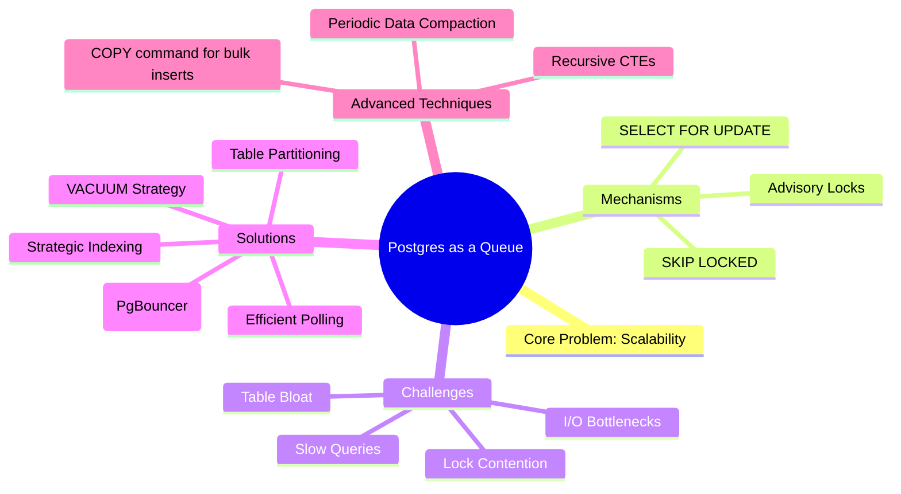
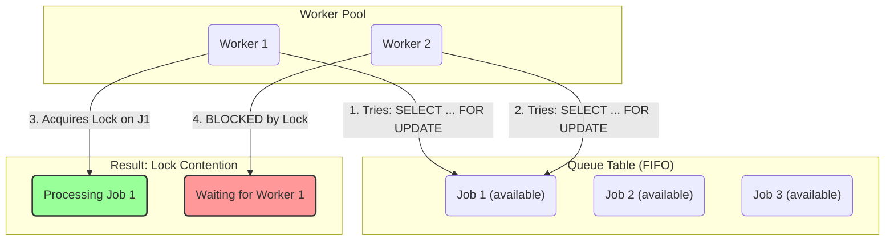
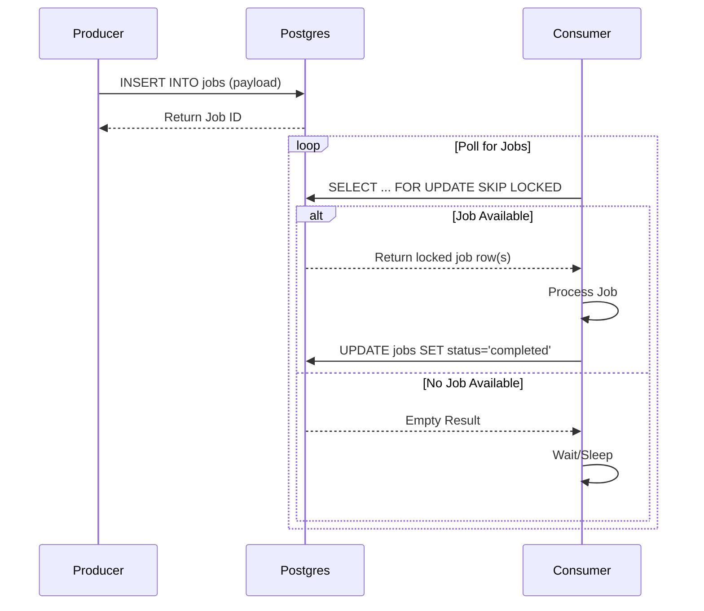
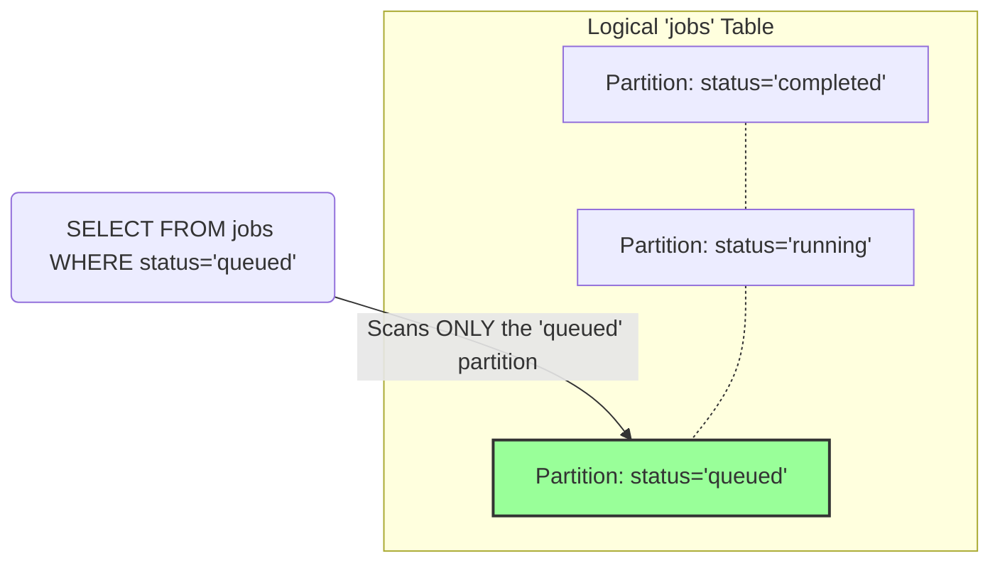
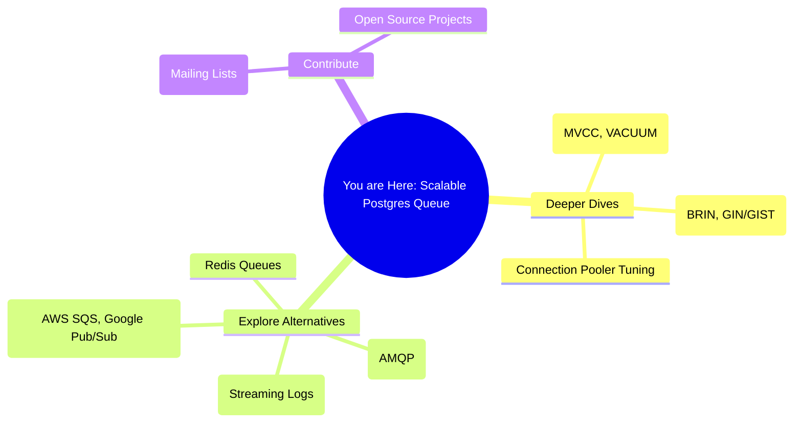

# Mastering the PostgreSQL Job Queue: A Comprehensive Guide to High-Throughput Production Systems

# 1. The Big Picture: Why Use Postgres for Queuing?
Using a relational database like PostgreSQL as a job queue is a common pattern, especially in systems that already rely on it as their primary data store. This approach simplifies the tech stack, reduces operational overhead, and leverages the powerful transactional and consistency guarantees (ACID compliance) that Postgres provides. However, as load increases, naive implementations can falter, leading to bottlenecks, lock contention, and performance degradation.

This guide will walk you through the journey of transforming a simple Postgres-based queue into a highly scalable, production-ready system capable of handling immense throughput, inspired by real-world engineering challenges.

## Ecosystem Context
While dedicated message brokers like RabbitMQ or Kafka are built for high-throughput messaging, using Postgres can be a pragmatic choice. It avoids introducing another service to maintain, allows for atomic transactions that span both your application data and the job queue, and enables rich, SQL-based querying and inspection of the queue state. The key is understanding Postgres's internal mechanisms—particularly its locking and concurrency models—to unlock its full potential.

## Key Concepts Mindmap


# 2. First Principles: Understanding the Locking Mechanisms
At the heart of any database-backed queue is the "pop" operation: selecting a job, marking it as "in-progress" to prevent other workers from taking it, and returning it to a worker process. Doing this safely and efficiently is the central challenge.

### The Feynman Explanation: The Checkout Counter Analogy
Imagine a busy supermarket with many checkout counters (your worker processes) and a single line of customers (your job queue).

1.  **The Naive Approach (Simple `SELECT` and `UPDATE`)**: A cashier shouts "Next!" and a customer starts walking over. But in that split second, another cashier also shouts "Next!" and the same customer gets confused and walks toward them. Two cashiers are now trying to serve the same customer, causing chaos. This is a **race condition**, where two workers grab the same job.
2.  **The Basic Lock (`SELECT FOR UPDATE`)**: This is like putting up a "Next Customer, Please Wait" sign. When a cashier is ready, they press a button that locks the front of the line. They get the exclusive right to call the next customer. No other cashier can call anyone until the first one is done. This is safe, but if one cashier is slow, everyone else has to wait, creating a **bottleneck**.
3.  **The Scalable Lock (`SELECT FOR UPDATE SKIP LOCKED`)**: This is the game-changer. Imagine each customer in line has a light on their back. When a cashier calls "Next!", they grab the first customer whose light is *off* and that customer's light immediately turns *on*. Other cashiers can instantly scan past the "in-use" customer and grab the next available one. This allows many cashiers to work in parallel without waiting for each other, dramatically increasing throughput.

### Diagram: Locking Illustrated
This diagram shows how a simple `SELECT FOR UPDATE` causes Worker 2 to wait for Worker 1 to release its lock, creating a bottleneck. `SKIP LOCKED` avoids this by allowing Worker 2 to simply move on to Job 2.



### Self-Test Q&A
1.  **Q:** What is a "race condition" in the context of a job queue?
    *   *A: When two or more worker processes select and begin processing the same job from the queue simultaneously.*
2.  **Q:** How does `SELECT FOR UPDATE` prevent race conditions?
    *   *A: It places an exclusive lock on the selected row(s), making other transactions wait until the current transaction is committed or rolled back.*
3.  **Q:** What is the primary performance advantage of `SKIP LOCKED` over a standard `SELECT FOR UPDATE`?
    *   *A: It prevents workers from being blocked. Instead of waiting for a locked row to be released, the query simply skips it and moves to the next available unlocked row, enabling high concurrency.*

# 3. Theory to Practice: Building a Scalable Queue
Let's translate the theory into a practical, step-by-step implementation.

### Step-by-Step Implementation Guide

#### Step 1: The Table Schema
Start with a well-defined `jobs` table. An index on the `status` and `created_at` columns is crucial for efficient polling.

```sql
CREATE TYPE job_status AS ENUM ('queued', 'running', 'completed', 'failed');

CREATE TABLE jobs (
   id BIGSERIAL PRIMARY KEY,
   payload JSONB NOT NULL,
   status job_status NOT NULL DEFAULT 'queued',
   created_at TIMESTAMPTZ NOT NULL DEFAULT NOW(),
   updated_at TIMESTAMPTZ NOT NULL DEFAULT NOW()
);

-- The crucial index for polling!
CREATE INDEX idx_jobs_on_status_created_at ON jobs (status, created_at)
WHERE status = 'queued';
```

#### Step 2: The Producer (Enqueuing Jobs)
Enqueuing jobs is a simple `INSERT`. For high-volume ingestion, use the `COPY` command to bulk-load jobs instead of inserting them one by one.

```sql
-- Single job
INSERT INTO jobs (payload) VALUES ('{"user_id": 123, "task": "send_email"}');

-- Bulk insert (from an application)
-- Use a library that leverages the COPY protocol.
```

#### Step 3: The Consumer (Dequeuing Jobs with `SKIP LOCKED`)
This is the most critical part. The query must be atomic: find a job, lock it, update its status to `running`, and return it. A Common Table Expression (CTE) is perfect for this.

```sql
-- The atomic "pop" operation
WITH next_job AS (
   SELECT id
   FROM jobs
   WHERE status = 'queued'
   ORDER BY created_at
   LIMIT 1
   FOR UPDATE SKIP LOCKED
)
UPDATE jobs
SET status = 'running', updated_at = NOW()
WHERE id = (SELECT id FROM next_job)
RETURNING id, payload;
```

### Producer-Consumer Sequence Diagram


### Hands-On Q&A
1.  **Q:** Why is the `WHERE status = 'queued'` clause included in the index definition?
    *   *A: This creates a partial index. Since workers only ever search for 'queued' jobs, the index remains small and highly efficient, containing pointers only to the jobs that matter.*
2.  **Q:** What does the `RETURNING` clause do in the `UPDATE` statement?
    *   *A: It allows the `UPDATE` statement to return values from the rows that were just modified, eliminating the need for a separate `SELECT` call to get the job's payload.*
3.  **Q:** In the consumer logic, what should happen if the query returns an empty result?
    *   *A: The consumer should wait for a short period (e.g., using exponential backoff) before polling again to avoid hammering the database with constant queries when the queue is empty.*

# 4. Advanced Topics: Pushing the Limits
Once you have a `SKIP LOCKED` implementation, other bottlenecks will appear at scale. Here’s how to address them.

### Advanced Concepts
1.  **Table Partitioning**: As the `jobs` table grows to billions of rows, even indexed queries will slow down. Partitioning splits one large table into many smaller, more manageable physical tables. You can partition by a time range (e.g., a new partition for each day or week) or by status. This allows `VACUUM` to work on smaller chunks and allows for older partitions to be detached or moved to slower storage.
2.  **Connection Pooling**: Every worker connection to Postgres consumes memory and process resources. A high number of workers can exhaust the server's `max_connections` limit. A connection pooler like PgBouncer sits between your application and Postgres. Workers connect to PgBouncer (which is very lightweight), and PgBouncer manages a smaller, shared pool of connections to the actual database, dramatically improving scalability.
3.  **Aggressive `VACUUM` Strategy**: With high job churn (many `INSERT`s and `UPDATE`s), dead rows accumulate quickly, causing table bloat. This bloat increases table size and slows down queries. You must tune Postgres's autovacuum settings to be more aggressive for your `jobs` table, or even run manual `VACUUM` operations during off-peak hours to reclaim space efficiently.
4.  **Strategic Indexing**: Use `EXPLAIN ANALYZE` on your dequeuing query to ensure it's using the correct index. Sometimes, you may need a composite index (an index on multiple columns) to match a specific query pattern and avoid slow bitmap scans.

### Partitioning Diagram
This diagram illustrates partitioning by status. A query for 'queued' jobs only needs to scan the much smaller Partition 1.



### Challenging Q&A
1.  **Q:** Why is connection pooling necessary when you can just increase `max_connections` in Postgres?
    *   *A: Each Postgres connection is a separate OS process that consumes significant memory (several MBs). Increasing `max_connections` to thousands can exhaust server RAM. A pooler like PgBouncer uses a lightweight, event-driven model to handle thousands of client connections while maintaining only a few dozen actual connections to the database backend.*
2.  **Q:** If your `jobs` table is partitioned by `created_at` (e.g., one partition per week), how would you efficiently drop old, completed jobs?
    *   *A: Instead of a slow, row-by-row `DELETE`, you can simply `DETACH` the old partition from the main table and then `DROP` the detached table. This operation is nearly instantaneous, regardless of how many rows are in the partition.*
3.  **Q:** What is "table bloat" and how do `UPDATE` operations contribute to it?
    *   *A: Bloat is disk space occupied by dead tuples (rows) that are no longer visible to any transaction. In Postgres's MVCC model, an `UPDATE` is effectively a `DELETE` followed by an `INSERT`; the old version of the row is marked as "dead" but not immediately removed. `VACUUM` is the process that cleans up these dead tuples and reclaims the space.*

# 5. Challenges & Best Practices: Navigating the Pitfalls
Building a robust queue involves anticipating problems and making smart design choices.

### Common Pitfalls and Heuristics
1.  **Pitfall: Long-Running Jobs Holding Locks**: A job that takes a long time to process will hold its row lock for the entire duration, preventing `VACUUM` from cleaning up dead tuples on that page.
    *   **Heuristic**: Decouple the lock from the execution. Lock the job, update its status, and commit the transaction *immediately*. The worker can then process the job without holding a long-lived transaction. Implement a "watchdog" process that finds 'running' jobs that have exceeded a timeout and moves them to a 'failed' or 'retry' state.
2.  **Pitfall: Unbounded Retries (Poison Pill)**: A single, consistently failing job can be picked up, fail, be re-queued, and repeat indefinitely, consuming significant resources.
    *   **Heuristic**: Add a `retry_count` column. Increment it on each failure and give up after a certain threshold (e.g., 5 retries), moving the job to a final 'failed' state for manual inspection.
3.  **Pitfall: Inefficient Polling**: Constant, rapid polling from many idle workers can create unnecessary load on the database.
    *   **Heuristic**: Use exponential backoff for polling. If a worker finds no jobs, it waits 1 second. If still none, it waits 2s, then 4s, up to a maximum cap. Also consider using `LISTEN/NOTIFY`, where the producer sends a lightweight notification to a channel that workers are listening on, waking them up only when new work is available.

### Decision Tree: Choosing a Locking Strategy
```mermaid
graph TD
    A{Start: Need a DB Job Queue} --> B{Low churn & few workers?};
    B -- Yes --> C[Use simple<br/>SELECT ... FOR UPDATE];
    B -- No --> D{High concurrency needed?};
    D -- Yes --> E[Use SELECT ...<br/>FOR UPDATE SKIP LOCKED];
    D -- No --> F{Jobs partitionable by a key?<br/>(e.g., customer_id)};
    F -- Yes --> G[Consider Advisory Locks<br/>on the partition key];
    F -- No --> E;

    subgraph "Primary Recommendation"
        style E fill:#9f9,stroke:#333,stroke-width:2px
        E --> I[Most robust & scalable<br/>general-purpose solution]
    end

    subgraph "Niche Use Case"
        style G fill:#f9f,stroke:#333,stroke-width:2px
        G --> H[Advantage: Locks a concept, not a row.<br>Requires careful lock management.]
    end
```

# 6. The Horizon: Future-Proofing Your Queue
The world of data engineering is always evolving. Staying aware of future trends and alternative tools ensures your system remains effective.

### Future Developments
*   **Native Asynchronous Features**: Newer versions of PostgreSQL continue to improve concurrency and asynchronous operations. Keep an eye on features that might simplify or enhance the `LISTEN/NOTIFY` pattern or offer more efficient ways to handle concurrent writes.
*   **Hybrid Approaches**: For ultra-high-scale systems, consider a hybrid model. Use a fast, in-memory store like Redis for initial job ingestion and scheduling (the "hot" queue), and then persist jobs to Postgres for reliability, retries, and analytics (the "cold" storage).
*   **Dedicated Queues**: Recognize the point where your use case outgrows what Postgres can pragmatically offer. If your core business logic is messaging, investing in Kafka, RabbitMQ, or a managed cloud service (SQS, Pub/Sub) becomes the right decision. The skills learned scaling a Postgres queue are directly transferable.

### Learning Resources
*   **Official Documentation**: [Postgres SELECT Statement](https://www.postgresql.org/docs/current/sql-select.html) (Check the "The Locking Clause" section).
*   **Connection Pooling**: [PgBouncer](https://www.pgbouncer.org/)
*   **Blog Posts & Articles**:
    *   The original RudderStack blog post that inspired this guide.
    *   Various articles on queue-building from companies like Crunchy Data and Percona.

### Mindmap: Next Steps in Your Learning Journey

