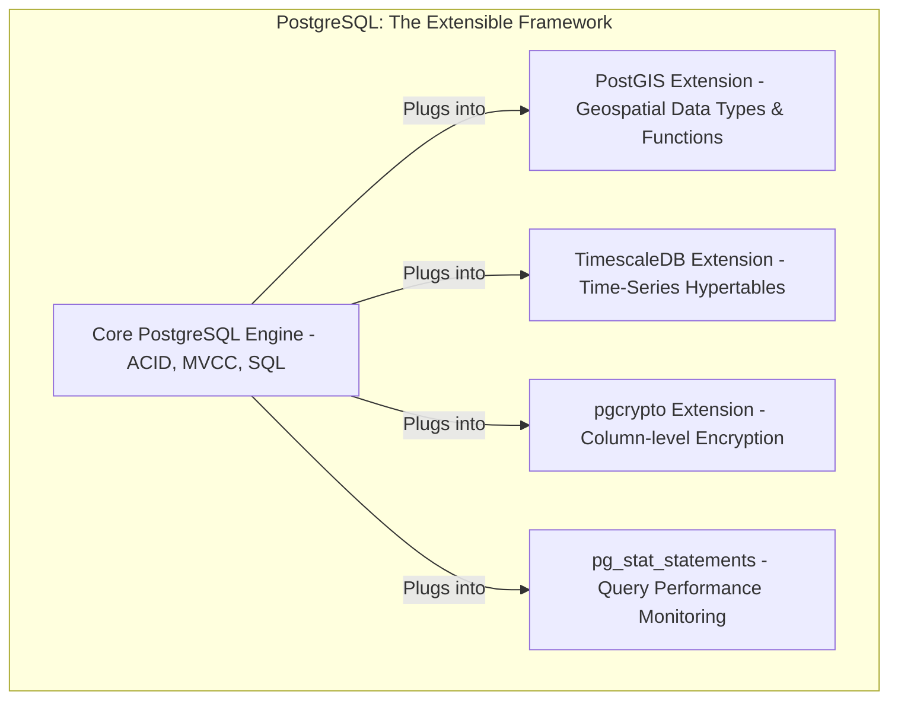

# PostgreSQL 17: A Feynman-Method Guide from Fundamentals to Production

## Table of Contents

  * [**Introduction**](#introduction)

  * [**Part I: The First Principles of PostgreSQL**](#part-i-the-first-principles-of-postgresql)

      * [Chapter 1: A Conversation with the Database](#chapter-1-a-conversation-with-the-database)
      * [Chapter 2: The Architectural Blueprint](#chapter-2-the-architectural-blueprint)
      * [Chapter 3: The Bedrock of Reliability: Transactions and ACID Compliance](#chapter-3-the-bedrock-of-reliability-transactions-and-acid-compliance)

  * [**Part II: The Production Workhorse: Mastering Core SQL**](#part-ii-the-production-workhorse-mastering-core-sql)

      * [Chapter 4: The Art of Asking: `SELECT`, `WHERE`, `ORDER BY`](#chapter-4-the-art-of-asking-select-where-order-by)
      * [Chapter 5: Connecting the Dots: Mastering `JOIN`s](#chapter-5-connecting-the-dots-mastering-joins)
      * [Chapter 6: Summarizing Data: `GROUP BY` and Aggregate Functions](#chapter-6-summarizing-data-group-by-and-aggregate-functions)
      * [Chapter 7: Context is Everything: Window Functions](#chapter-7-context-is-everything-window-functions)

  * [**Part III: The Performance Engineer's Toolkit**](#part-iii-the-performance-engineers-toolkit)

      * [Chapter 8: Reading the Planner's Mind: `EXPLAIN`](#chapter-8-reading-the-planners-mind-explain)
      * [Chapter 9: The Librarian's Secret: Effective Indexing](#chapter-9-the-librarians-secret-effective-indexing)
      * [Chapter 10: Taking Out the Trash: `VACUUM` and Bloat](#chapter-10-taking-out-the-trash-vacuum-and-bloat)

  * [**Part IV: Production-Ready Patterns and Advanced Techniques**](#part-iv-production-ready-patterns-and-advanced-techniques)

      * [Chapter 11: Building Resilient Job Queues with `SKIP LOCKED`](#chapter-11-building-resilient-job-queues-with-skip-locked)
      * [Chapter 12: Real-time Communication with `LISTEN`/`NOTIFY`](#chapter-12-real-time-communication-with-listennotify)
      * [Chapter 14.5: The Power of Extensibility: Beyond the Core with Extensions](#chapter-145-the-power-of-extensibility-beyond-the-core-with-extensions)

  * [**Part V: Securing the Fortress**](#part-v-securing-the-fortress)

      * [Chapter 15: The Layered Security Model](#chapter-15-the-layered-security-model)
      * [Chapter 16: Row-Level Security (RLS)](#chapter-16-row-level-security-rls)

  * [**Part VI: On the Cutting Edge: What's New in PostgreSQL 17**](#part-vi-on-the-cutting-edge-whats-new-in-postgresql-17)

      * [Chapter 17: The `MAINTAIN` Role for Safer Operations](#chapter-17-the-maintain-role-for-safer-operations)
      * [Chapter 18: Faster, Smarter Backups with Incremental Backup](#chapter-18-faster-smarter-backups-with-incremental-backup)
      * [Chapter 19: SQL Standard `JSON_TABLE`](#chapter-19-sql-standard-json_table)

  * [**Appendix: A Catalogue of Anti-Patterns**](#appendix-a-catalogue-of-anti-patterns)
  
## Introduction

Welcome to a comprehensive guide to PostgreSQL 17. To truly master a system as powerful and nuanced as PostgreSQL, one must begin not with a list of commands, but with an understanding of its foundational principles. This guide is structured to follow the Feynman learning method: we start with a simple explanation, identify and fill the gaps in our understanding, and then refine the concept so it can be taught to others. By moving from the "what" to the "why," you will build a robust mental model that allows you to reason about behavior, diagnose problems, and build world-class applications on one of the world's most advanced open-source relational databases.

-----

## **Part I: The First Principles of PostgreSQL**

This first part of the guide is dedicated to building a robust mental model of how PostgreSQL works. By understanding the "why" behind its architecture, transaction model, and client interactions, a developer gains the ability to reason about its behavior, diagnose problems effectively, and leverage its full capabilities in production environments. We will move from the first conversation with the database to the architectural blueprint that underpins its legendary reliability.

### **Chapter 1: A Conversation with the Database**

#### **Simple Explanation: The Client-Server Model**

At its core, PostgreSQL operates on a client-server model. An application or a user acts as a **client**, sending requests (SQL queries) to a PostgreSQL **server**. The server processes these requests, performs actions on the data, and sends the results back.

  * **Analogy: Ordering at a Restaurant.** Think of your application as a diner (the client) and the PostgreSQL server as a restaurant kitchen. You write down your order (an SQL query) and hand it to the waiter. The kitchen (the server) prepares your meal (fetches or modifies data) and sends it back to your table (returns the results). You don't need to know how the kitchen is organized; you just need to speak the language of the menu (SQL).

The primary tool for having this direct conversation is `psql`, a powerful terminal-based front-end that is a comprehensive administrative and diagnostic utility.

#### **Identifying Gaps: How Does a Connection Work?**

A typical first interaction involves connecting to a database, which requires knowing the database name, host, port, and user. While `psql` offers sensible defaults for local connections, these can be specified with command-line options (`-d`, `-h`, `-p`, `-U`).

Once connected, you're at the `psql` prompt, ready for SQL commands or special internal "meta-commands" that begin with a backslash (`\`). These are shortcuts for administrative tasks.

| Meta-Command | Purpose                                                |
| :----------- | :----------------------------------------------------- |
| `\l`         | Lists all available databases in the cluster.          |
| `\c dbname`  | Connects to a different database named `dbname`.       |
| `\d table_name`| Describes the structure (columns, types, indexes) of a table. |
| `\dt`        | Lists all tables in the current schema.                |

#### **Explore and Fill Gaps: A Foundational Interaction**

Let's walk through the fundamental loop of database interaction, annotating each step.

1.  **Create a Database (DDL):** We start by creating a new, isolated environment for our application's data.

    ```sql
    -- Data Definition Language (DDL) is used to define structures.
    CREATE DATABASE my_first_app; -- Creates a new database named 'my_first_app'.
    ```

2.  **Connect to It (psql Meta-Command):** We switch our session's context into the new database.

    ```sql
    -- This is a psql command, not SQL. It tells our client to reconnect.
    \c my_first_app -- You are now connected to database "my_first_app".
    ```

3.  **Define a Table (DDL):** We create a blueprint for the data we want to store.

    ```sql
    CREATE TABLE users (
        -- SERIAL is a shortcut that creates an auto-incrementing integer, perfect for unique IDs.
        id SERIAL PRIMARY KEY,
        -- TEXT is the best general-purpose type for strings of variable length.
        -- NOT NULL ensures this field must have a value.
        -- UNIQUE ensures no two users can have the same username.
        username TEXT NOT NULL UNIQUE,
        -- TIMESTAMPTZ (timestamp with time zone) is the correct type for moments in time.
        -- DEFAULT NOW() automatically sets the creation time when a new user is inserted.
        created_at TIMESTAMPTZ NOT NULL DEFAULT NOW()
    );
    ```

4.  **Insert Data (DML):** We add a new record that conforms to our table's structure.

    ```sql
    -- Data Manipulation Language (DML) is used to modify data.
    -- We only need to provide the username; id and created_at have defaults.
    INSERT INTO users (username) VALUES ('alice');
    ```

5.  **Query Data (DQL):** We retrieve the data we just inserted.

    ```sql
    -- Data Query Language (DQL) is used to retrieve data.
    SELECT id, username, created_at FROM users;
    ```

#### **Refine and Teach Back: The Power of Non-Interactive Use**

This interactive loop is just the beginning. The true power of `psql` in production comes from its non-interactive capabilities. Using the `-f` flag to execute a script from a file or `-c` to run a single command string, `psql` becomes an indispensable tool for automation.

  * **Pattern: `psql` for DevOps.** In a CI/CD pipeline, you can run database migration scripts automatically: `psql -h $DB_HOST -U $DB_USER -d $DB_NAME -f migrations/001_add_users_table.sql`. This makes `psql` the "Swiss Army knife" of PostgreSQL administration, essential for both development and operations.

-----

### **Chapter 2: The Architectural Blueprint**

Understanding PostgreSQL's architecture is paramount. Its design choices explain its famous reliability and reveal why production practices like connection pooling are not just recommendations but necessities.

#### **The Process Model: Robustness Through Isolation**

  * **Simple Explanation:** When a client connects, PostgreSQL creates a dedicated, separate operating system process for that connection. A master `postmaster` process listens for new connections and "forks" a new `backend` process for each one. The client then communicates exclusively with its private backend process.

    ```mermaid
    graph TD
        subgraph Client Applications
            C1(Client 1)
            C2(Client 2)
            C3(Client 3)
        end

        subgraph PostgreSQL Server
            P(Postmaster)
            subgraph "Backend Processes (Isolation)"
                B1(Backend 1)
                B2(Backend 2)
                B3(Backend 3)
            end
        end

        C1 -- 1. Connects --> P
        P -- 2. Authenticates & Forks --> B1
        C1 -- 3. Communicates directly --> B1

        C2 -- 1. Connects --> P
        P -- 2. Authenticates & Forks --> B2
        C2 -- 3. Communicates directly --> B2

        C3 -- 1. Connects --> P
        P -- 2. Authenticates & Forks --> B3
        C3 -- 3. Communicates directly --> B3
    ```

  * **Identify Gaps:** Why a process and not a thread? What's the trade-off?

      * **Analogy: Houses vs. Apartments.** Using a process per connection is like giving each client their own house. If one house has a catastrophic failure (a memory corruption bug), it doesn't affect the other houses. This provides incredible stability. Other databases might use a thread per connection, which is like putting clients in apartments in one big building. It's cheaper (less resource-intensive) to build a new apartment than a whole new house, but a bug in one apartment can bring down the entire building.

  * **Explore and Fill Gaps:** The "house" (process) is more expensive to create than an "apartment" (thread). This model becomes a performance bottleneck for applications with many short-lived connections, like web apps. The overhead of setting up and tearing down processes for each connection is too high.

  * **Refine and Teach Back: The Connection Pooler Pattern.** This architectural trade-off is the single biggest reason why **external connection poolers (like PgBouncer) are a mandatory component** of high-traffic PostgreSQL deployments. The pooler maintains a small, stable set of connections (houses) to the database and lets thousands of transient application connections share them, effectively hiding the cost of the process-per-connection model and allowing the system to scale.

#### **Memory Architecture: Caches and Workspaces**

  * **Simple Explanation:** PostgreSQL's memory is split into two types: **Shared Memory**, a large area available to all processes, and **Local Memory**, private to each backend process.

  * **Analogy: Public Library vs. Private Desk.**

      * `shared_buffers`: This is the library's main reading room and stacks—a large, shared cache of data pages read from disk. The bigger the reading room, the more books (data) can be kept ready, reducing slow trips to the off-site warehouse (disk I/O). It's the most critical performance tuning parameter.
      * `work_mem`: This is your private desk in the library. Each backend process gets its own `work_mem` to perform tasks like sorting data (`ORDER BY`) or building hash tables for joins. If a task is too big for your desk, you have to use the floor (spill to temporary disk files), which is very slow.

#### **Disk Storage: The Write-Ahead Log (WAL)**

  * **Simple Explanation:** All data lives in files within the `PGDATA` directory. The most critical component is the Write-Ahead Log (WAL). Before PostgreSQL changes any data in a table file, it first writes a record of that change to the WAL.

  * **Analogy: A Bookkeeper's Ledger.** Imagine a bookkeeper who needs to update several accounts. Before changing the individual account pages, they first write down every intended change in a sequential, append-only ledger ("Debit $100 from A, Credit $100 to B"). If the power goes out mid-update, they don't have to guess which account pages were updated. They can simply read the ledger and replay any entries that weren't finalized, ensuring the books are always consistent. The WAL is this ledger, and it is the foundation of PostgreSQL's durability and ACID compliance.

    ```mermaid
    sequenceDiagram
        participant C as Client
        participant B as Backend Process
        participant WAL as Write-Ahead Log
        participant Disk as Table/Index Files

        C ->> B: COMMIT;
        B ->> WAL: 1. Write change record to WAL Buffer
        WAL -->> WAL: 2. Flush WAL buffer to permanent disk
        B ->> C: 3. Return "Success" to Client
        B -->> Disk: 4. Later, write changes to table files
    ```

  * **Insight:** A transaction is considered `COMMITTED` the moment its WAL record hits permanent storage, *not* when the table data on disk is updated. This allows for high performance while guaranteeing no committed data is ever lost.

#### **The Query Lifecycle: From SQL Text to Results**

  * **Simple Explanation:** A query goes through four main stages inside its backend process.

    ```mermaid
    graph TD
        A[SQL Query Text] --> B(1. Parse Stage);
        B -- Parse Tree --> C(2. Rewrite Stage);
        C -- Modified Tree --> D(3. Plan / Optimize Stage);
        D -- Chosen Plan --> E(4. Execute Stage);
        E -- Results --> F[Result Set to Client];

        subgraph "Backend Process"
            B; C; D; E;
        end

        style D fill:#f9f,stroke:#333,stroke-width:2px
    ```

  * **Explore and Fill Gaps:**

    1.  **Parse:** Checks for syntax errors and creates a parse tree, a structured representation of the query.
    2.  **Rewrite:** Applies any rules. The most common use is substituting a view's definition into the query tree so the planner sees the underlying tables.
    3.  **Plan/Optimize:** This is the brain. The planner generates multiple possible ways to execute the query (e.g., scan the whole table vs. use an index) and uses internal statistics to estimate the "cost" of each path, choosing the cheapest one. This is the most complex and critical stage for performance.
    4.  **Execute:** Takes the chosen plan and runs it, retrieving the data and returning it to the client.

#### **Concurrency Demystified: Multiversion Concurrency Control (MVCC)**

  * **Simple Explanation:** To allow many clients to read and write data at the same time, PostgreSQL uses a system called MVCC. Instead of locking data, when a row is updated, MVCC creates a **new version** of the row.

  * **Key Insight: Readers Don't Block Writers, and Writers Don't Block Readers**.

      * **Analogy: Document with "Track Changes".** Imagine a shared document. When you start reading it, you see the version that existed at that moment. While you're reading, another person can edit a paragraph. Instead of locking you out, their changes are marked as a new version. You continue reading your original, consistent snapshot, completely unaware of their edits. Their new version only becomes visible to transactions that start *after* they save (commit) their changes.

  * **Explore and Fill Gaps:** This elegant system has one maintenance cost: the old, "dead" row versions are left behind. They are invisible to new transactions but still take up disk space.

  * **Refine and Teach Back: The `VACUUM` Imperative.** These dead row versions must eventually be cleaned up. This is the primary job of a process called `VACUUM`. Understanding MVCC makes it clear why `VACUUM` is not an optional cleanup task but a fundamental and necessary part of keeping a PostgreSQL database healthy and performant.

-----

### **Chapter 3: The Bedrock of Reliability: Transactions and ACID Compliance**

Every robust database guarantees reliability, a promise encapsulated by the acronym ACID. PostgreSQL is fully ACID compliant, and this is the foundation of its reputation for data integrity.

| Property          | Simple Analogy                       | Core Guarantee                                                                                               |
| :---------------- | :----------------------------------- | :----------------------------------------------------------------------------------------------------------- |
| **A**tomicity     | A sealed envelope of instructions    | All operations in a transaction complete successfully, or none of them do. It's an all-or-nothing unit.         |
| **C**onsistency   | Following grammar rules              | A transaction brings the database from one valid state to another, never violating constraints like `PRIMARY KEY` or `NOT NULL`. |
| **I**solation     | People in separate phone booths      | Concurrent transactions behave as if they were executed one after the other, preventing strange side effects.  |
| **D**urability    | Writing in permanent ink             | Once a transaction is committed, its changes are permanent and will survive a system crash.                   |

#### **Annotated Example: An Atomic Bank Transfer**

The classic example is transferring $100 from Account A to B.

```sql
BEGIN; -- Starts a transaction block. All subsequent commands are part of one atomic unit.

-- 1. Debit $100 from Account A.
UPDATE accounts SET balance = balance - 100 WHERE account_id = 'A';

-- <<<< IF THE SERVER CRASHES HERE >>>>
-- Upon restart, the incomplete transaction is automatically rolled back.
-- The $100 is NOT lost. The database returns to its pre-transaction state.

-- 2. Credit $100 to Account B.
UPDATE accounts SET balance = balance + 100 WHERE account_id = 'B';

COMMIT; -- Makes all changes within the block permanent and visible to others.
```

This all-or-nothing principle is the essence of **Atomicity**.

#### **Exploring Isolation Levels**

Isolation is the most complex ACID property because it's not a single thing but a trade-off between performance and correctness. The SQL standard defines four levels to protect against concurrency phenomena:

| Isolation Level     | Dirty Read Prevented | Non-Repeatable Read Prevented | Phantom Read Prevented | Typical Use Case                                                                                             |
| :------------------ | :------------------: | :---------------------------: | :--------------------: | :----------------------------------------------------------------------------------------------------------- |
| READ UNCOMMITTED    |          No          |              No               |           No           | Not implemented in PostgreSQL.                                                                               |
| **READ COMMITTED** |        **Yes** |            **No** |         **No** | **Default level in Postgres.** Good for general use. Each *statement* gets a fresh data snapshot.          |
| REPEATABLE READ     |         Yes          |              Yes              |           No           | Useful when a single transaction needs to read the same data multiple times and see a consistent view. The entire *transaction* gets one snapshot. |
| SERIALIZABLE        |         Yes          |              Yes              |          Yes           | Highest level. Guarantees transactions behave as if run one at a time. Required for complex logic where race conditions are possible. |

  * **Heuristic:** Start with the default `READ COMMITTED`. Only increase the isolation level to `REPEATABLE READ` or `SERIALIZABLE` if you have a specific, documented business requirement that cannot tolerate non-repeatable or phantom reads. Higher levels can reduce concurrency, so use them judiciously.

-----

## **Part II: The Production Workhorse: Mastering Core SQL**

With a solid grasp of the architecture, we can now master the language we use to interact with it: SQL. These chapters cover the most critical, everyday SQL constructs that form the backbone of any application.

### **Chapter 4: The Art of Asking: `SELECT`, `WHERE`, `ORDER BY`**

  * **Simple Explanation:** The `SELECT` statement is how you ask the database for information. You specify which columns you want (`SELECT`), from which table (`FROM`), optionally filter the rows based on a condition (`WHERE`), and finally, sort the results (`ORDER BY`).

  * **Analogy: Shopping List.** You go to a supermarket (`FROM table`). You have a list of items you want (`SELECT columns`). You only check specific aisles that have what you need (`WHERE condition`). Finally, you arrange the items in your cart for easy unloading (`ORDER BY`).

  * **Identify Gaps:** The order you *write* the SQL clauses is not the order the database *executes* them. This is a common point of confusion.

  * **Explore and Fill Gaps:** The logical processing order is what matters.

    ```sql
    -- WRITTEN ORDER
    SELECT username, created_at -- 4. Project the final columns
    FROM users                  -- 1. Identify the source table
    WHERE created_at > '2024-01-01' -- 2. Filter rows that match the condition
    ORDER BY created_at DESC;   -- 3. Sort the filtered rows
    ```

    The database first decides which table to get data `FROM`. Then it applies the `WHERE` clause to discard rows you don't need. Only after filtering does it `ORDER` the remaining rows. Finally, it picks the `SELECT` columns to send back to you. Understanding this helps diagnose why certain queries are slow; a restrictive `WHERE` clause is crucial because it reduces the amount of data that needs to be sorted and processed later.

  * **Refine and Teach Back: Filter First, Then Present.** The most effective mental model for a simple `SELECT` query is to think "filter, then sort, then present." Always aim to be as specific as possible in your `WHERE` clause, as this is the most powerful tool for improving performance.

### **Chapter 5: Connecting the Dots: Mastering `JOIN`s**

  * **Simple Explanation:** `JOIN`s are used to combine rows from two or more tables based on a related column between them. This allows you to reconstruct meaningful, complete information from normalized data.

  * **Analogy: Merging Spreadsheets.** Imagine you have one spreadsheet of `Users` (with `user_id`, `name`) and another of `Orders` (with `order_id`, `user_id`, `amount`). A `JOIN` lets you create a combined view by matching the `user_id` column in both sheets, so you can see which user placed which order.

  * **Identify Gaps:** The different types of `JOIN`s (`INNER`, `LEFT`, `RIGHT`, `FULL OUTER`) can be confusing. Which one should I use?

  * **Explore and Fill Gaps:** A visual explanation is best.

    ```mermaid
    graph TD
      subgraph "JOIN Types as Venn Diagrams"
          A[INNER JOIN - Only matching rows]
          B[LEFT JOIN - All from left, plus matches from right]
          C[RIGHT JOIN - All from right, plus matches from left]
          D[FULL OUTER JOIN - All rows from both tables]
      end
    ```

    **Annotated Example:** Given `users` and `orders` tables:

    ```sql
    -- INNER JOIN: Only shows users who have placed orders.
    SELECT u.username, o.order_date FROM users u INNER JOIN orders o ON u.id = o.user_id;

    -- LEFT JOIN: Shows ALL users, and for those with orders, shows the order date.
    -- If a user has no orders, o.order_date will be NULL.
    SELECT u.username, o.order_date FROM users u LEFT JOIN orders o ON u.id = o.user_id;
    ```

  * **Refine and Teach Back: The `LEFT JOIN` Heuristic for Exploration.** When you're exploring data and aren't sure if a relationship exists for all rows, **start with a `LEFT JOIN`**. It won't discard any rows from your primary ("left") table, making it easy to see both matches and misses (`NULL` values). You can always change it to an `INNER JOIN` later if you only care about the matches.

### **Chapter 6: Summarizing Data: `GROUP BY` and Aggregate Functions**

  * **Simple Explanation:** The `GROUP BY` clause collapses multiple rows that share a common value into a single summary row. It's almost always used with aggregate functions like `COUNT()`, `SUM()`, `AVG()`, `MAX()`, or `MIN()` that perform a calculation on the collapsed rows.

  * **Analogy: Tallying Votes.** Imagine a box of ballots, each with a candidate's name. To get the final count, you create piles for each candidate (`GROUP BY candidate_name`) and then count the number of ballots in each pile (`COUNT(*)`).

  * **Identify Gaps:** A common error is: `column "users.username" must appear in the GROUP BY clause or be used in an aggregate function`. Why does this happen?

  * **Explore and Fill Gaps:** When you group rows, the database discards the individual row details. If you ask for a column that isn't part of the grouping key and isn't an aggregate, the database doesn't know *which* of the original values to show.

    ```sql
    -- Calculate the number of orders and total amount spent per user.
    SELECT
        user_id,                  -- This is our grouping key.
        COUNT(id) AS number_of_orders, -- This is an aggregate calculation on the group.
        SUM(amount) AS total_spent   -- This is another aggregate calculation.
    FROM orders
    GROUP BY user_id;                 -- We collapse all rows for the same user_id into one.

    -- This query is INVALID because `order_date` is ambiguous in a group of orders.
    -- SELECT user_id, order_date, COUNT(id) FROM orders GROUP BY user_id;
    ```

  * **Refine and Teach Back: `WHERE` Filters Rows, `HAVING` Filters Groups.** Once you have your groups, you might want to filter them (e.g., "show me only users who have placed more than 5 orders"). You cannot use `WHERE` for this, because `WHERE` filters rows *before* they are grouped. The correct tool is `HAVING`.

    ```sql
    -- The HAVING clause acts as a filter on the result of the GROUP BY.
    SELECT user_id, COUNT(id)
    FROM orders
    GROUP BY user_id
    HAVING COUNT(id) > 5; -- Filter the groups, not the original rows.
    ```

### **Chapter 7: Context is Everything: Window Functions**

  * **Simple Explanation:** Window functions perform calculations across a set of rows that are related to the current row. Unlike `GROUP BY`, they don't collapse the original rows; they add a new column with the result of the function, preserving the original row details.

  * **Analogy: Class vs. School Ranking.** `GROUP BY` can tell you the average grade *per class*. A window function can tell you, for each individual student, their grade *and* their rank *within their class*, all in one row. It provides both the detail and the context.

  * **Identify Gaps:** The `OVER()` clause syntax with `PARTITION BY` and `ORDER BY` is the key to unlocking window functions, but it can be intimidating.

  * **Explore and Fill Gaps:** Let's break down the `OVER()` clause.

      * `PARTITION BY`: This defines the "window" or group over which the function operates. It's like a temporary `GROUP BY`.
      * `ORDER BY`: This sorts the rows *within* each partition, which is essential for ranking functions (`RANK()`, `ROW_NUMBER()`) or cumulative functions (`SUM() OVER (...)`).


    ```mermaid
    graph TD
        subgraph "Employees Table"
            R1("Alice | Engineering | 120k")
            R2("Bob   | Engineering | 110k")
            R3("Carol | Sales       | 100k")
            R4("Dave  | Sales       | 130k")
        end

        subgraph "Window Partitions"
            P1("Partition 1: Engineering")
            R1 --> P1
            R2 --> P1

            P2("Partition 2: Sales")
            R3 --> P2
            R4 --> P2
        end

    ```

    **Annotated Example:** Find the salary rank of each employee within their department.

    ```sql
    SELECT
        name,
        department,
        salary,
        -- The window function:
        RANK() OVER (
            PARTITION BY department -- Calculate rank separately for each department.
            ORDER BY salary DESC     -- Within each department, rank from highest to lowest salary.
        ) AS department_rank
    FROM employees;
    ```

    This query returns every employee row, plus a new `department_rank` column. Bob would have a rank of 2 within Engineering, and Carol would have a rank of 2 within Sales.

  * **Refine and Teach Back: The "Detail and Context" Pattern.** Use a window function whenever you need to answer a question that requires information about a row *and* its surrounding group. Common use cases include ranking, running totals, and comparing a row's value to the group's average (e.g., `salary - AVG(salary) OVER (PARTITION BY department)`).

-----

## **Part III: The Performance Engineer's Toolkit**

Writing correct SQL is only the first step. Writing performant SQL requires understanding how the database executes your queries and how you can influence its decisions.

### **Chapter 8: Reading the Planner's Mind: `EXPLAIN`**

  * **Simple Explanation:** The `EXPLAIN` command asks PostgreSQL to show you its execution plan for a query *without actually running it*. It's a detailed report on the strategy the query planner has chosen. Using `EXPLAIN ANALYZE` both runs the query and shows the plan with actual timing and row counts.

  * **Analogy: A GPS Route Preview.** Before you start driving, a GPS app shows you the map, the turns, and the estimated time. `EXPLAIN` is that route preview. `EXPLAIN ANALYZE` is the post-trip report showing you the route you actually took and how long each segment really took, including time spent in traffic.

  * **Identify Gaps:** The output of `EXPLAIN` is dense and full of jargon like `cost`, `Seq Scan`, `Index Scan`, and `Nested Loop`. What should I look for?

  * **Explore and Fill Gaps:** Let's analyze a sample output.

    ```sql
    EXPLAIN ANALYZE SELECT * FROM users WHERE id = 123;
    ```

    ```
    --                                               QUERY PLAN
    ------------------------------------------------------------------------------------------------------------------
    -- Index Scan using users_pkey on users (cost=0.28..8.29 rows=1 width=97) (actual time=0.026..0.027 rows=1 loops=1)
    --   Index Cond: (id = 123)
    -- Planning Time: 0.086 ms
    -- Execution Time: 0.041 ms
    ```

    **Key things to look for:**

    1.  **Node Type:** `Index Scan` is great\! It means Postgres used an index to find the row directly. A `Seq Scan` (Sequential Scan) means it had to read the entire table, which is slow for large tables.
    2.  **`cost=0.28..8.29`**: The planner's *estimate* of the work required. The first number is startup cost, the second is total cost. Lower is better.
    3.  **`rows=1`**: The planner's *estimate* of how many rows this step will return.
    4.  **`actual time=...`**: The *real* time it took to execute this step.
    5.  **`rows=1` (in actual)**: The *real* number of rows returned.

  * **Refine and Teach Back: The Cardinality Mismatch Heuristic.** The single most important thing to look for is a huge mismatch between the estimated rows (`rows=...`) and the actual rows (`rows=...` in `ANALYZE`). If the planner thinks a step will return 1 row but it actually returns 1,000,000, it will likely choose a terrible plan. This almost always means the table's statistics are stale. The fix is to run `ANALYZE your_table;` to update them.

### **Chapter 9: The Librarian's Secret: Effective Indexing**

  * **Simple Explanation:** An index is a special lookup table that the database search engine can use to find records quickly, just like the index at the back of a book lets you find a topic without reading every page.

  * **Analogy: A Book Index.** Without an index, finding every mention of "MVCC" in a 500-page book would require you to read the entire book (`Seq Scan`). With an index, you go to the "M" section, find "MVCC," and see it's on pages 42, 113, and 256. This is incredibly fast (`Index Scan`).

  * **Identify Gaps:** PostgreSQL has many types of indexes (B-Tree, GIN, GiST, BRIN). When should I use which one?

  * **Explore and Fill Gaps:** The vast majority of the time, you will use the default B-Tree index. But knowing the others is powerful.

| Index Type | Use Case                                               | Example                                     |
| :--------- | :----------------------------------------------------- | :------------------------------------------ |
| **B-Tree** | **Default.** Excellent for equality (`=`) and range (`<`, `>`, `BETWEEN`) queries. The workhorse index. | `WHERE user_id = 123` or `WHERE created_at > '2024-01-01'` |
| **GIN** | "Elements within". Perfect for searching inside arrays, `jsonb` documents, or full-text search. | `WHERE tags @> ARRAY['postgres']` or `WHERE metadata ->> 'client' = 'A'` |
| **GiST** | "Generalized Search Tree". Used for complex types like geometric data (PostGIS) and full-text search. | Finding all points within a polygon.        |
| **BRIN** | "Block Range Index". For huge, physically-ordered tables (e.g., event logs with timestamps). Tiny footprint. | `WHERE log_time BETWEEN 't1' AND 't2'` on a petabyte-scale table. |

  * **Refine and Teach Back: The "Index Your Filters" Pattern.** The most effective indexing strategy is to **index the columns that appear in your `WHERE` clauses, `JOIN` conditions, and `ORDER BY` clauses**. Don't just index everything; each index adds a small overhead to write operations (`INSERT`, `UPDATE`, `DELETE`) because the index must also be updated. Index thoughtfully based on your read patterns.

### **Chapter 10: Taking Out the Trash: `VACUUM` and Bloat**

  * **Simple Explanation:** As explained in the MVCC chapter, when you `UPDATE` or `DELETE` rows, PostgreSQL doesn't immediately remove the old data. It just marks it as "dead." `VACUUM` is the housekeeping process that cleans up these dead rows and makes their space available for new data.

  * **Analogy: A Messy Office.** Imagine an office where old, shredded documents are left on the floor instead of being put in the bin. Over time, it becomes hard to walk around, and there's no space for new file cabinets. `VACUUM` is the nightly cleaning crew that bags up the shredded paper (reclaims space from dead rows).

  * **Identify Gaps:** What's the difference between `VACUUM` and `VACUUM FULL`? Should I run it myself?

  * **Explore and Fill Gaps:**

    ```mermaid
    graph TD
        subgraph "Table File on Disk"
            R1[Live Row]
            R2[Live Row]
            D1(("Dead Row"))
            D2(("Dead Row"))
            R3[Live Row]
            D3(("Dead Row"))
        end

        V[VACUUM] --> P(Space from D1, D2, D3 is now reusable)

        VF[VACUUM FULL] --> T(Table is rewritten with only R1, R2, R3, shrinking the file size)

        style D1 fill:#ffcccc,stroke:#333
        style D2 fill:#ffcccc,stroke:#333
        style D3 fill:#ffcccc,stroke:#333
        style VF fill:#ff9999,stroke:#333

    ```

      * `VACUUM`: The standard, non-blocking cleanup. It reclaims space for re-use *within the same table file*. It doesn't shrink the file on disk. It can run in parallel with normal operations.
      * `VACUUM FULL`: A much more aggressive operation. It rewrites the entire table to a new file on disk, removing all dead space and shrinking the file. **Crucially, it takes an exclusive lock on the table, blocking all reads and writes until it's done.** It should be used very rarely, if at all, on production systems.
      * **`autovacuum`**: The real hero. PostgreSQL has a built-in background process that automatically runs `VACUUM` and `ANALYZE` on tables as they are modified.

  * **Refine and Teach Back: Trust (but Verify) Autovacuum.** For 99% of workloads, the `autovacuum` daemon is your best friend and is expertly tuned by default. Your job is not to disable it or run manual `VACUUM`s all the time. Your job is to **monitor it**. Check logs and system views (`pg_stat_user_tables`) to ensure it's keeping up with the rate of change on your tables, especially those with high `UPDATE`/`DELETE` churn. Adjust its settings only when you have clear evidence it's not being aggressive enough.

-----

## **Part IV: Production-Ready Patterns and Advanced Techniques**

Beyond basic CRUD, PostgreSQL offers powerful features for building robust, scalable, and complex applications.

### **Chapter 11: Building Resilient Job Queues with `SKIP LOCKED`**

  * **Simple Explanation:** A common need is to have multiple workers process jobs from a queue table. A naive `SELECT ... FOR UPDATE` would cause all workers to wait for the first worker to finish, creating a bottleneck. `FOR UPDATE SKIP LOCKED` allows a worker to lock the first available unlocked row, immediately skipping any rows that are already locked by other workers.

  * **Analogy: A Supermarket Checkout.** In a normal queue (`FOR UPDATE`), every cashier waits for the first person in line to be served. With `SKIP LOCKED`, if the first person is having a problem with their card (a locked row), the next available cashier can call out "I can take the next person\!" and serve someone else from further back in the line, maximizing throughput.

  * **Identify Gaps:** How does this look in practice? How do I prevent one worker from grabbing a job that another is already handling?

  * **Explore and Fill Gaps:** The pattern involves a transaction that selects, locks, and updates a job's status.

    ```mermaid
    sequenceDiagram
        participant W1 as Worker 1
        participant W2 as Worker 2
        participant DB as Database (jobs table)

        W1 ->> DB: BEGIN;
        W1 ->> DB: SELECT id FROM jobs WHERE status = 'pending' ORDER BY created_at FOR UPDATE SKIP LOCKED LIMIT 1;
        DB -->> W1: Returns Job #1
        W1 ->> DB: UPDATE jobs SET status = 'processing' WHERE id = 1;

        W2 ->> DB: BEGIN;
        W2 ->> DB: SELECT id FROM jobs WHERE status = 'pending' ORDER BY created_at FOR UPDATE SKIP LOCKED LIMIT 1;
        note right of DB: Job #1 is locked by Worker 1's transaction, so it is skipped.
        DB -->> W2: Returns Job #2
        W2 ->> DB: UPDATE jobs SET status = 'processing' WHERE id = 2;

        W1 ->> DB: COMMIT;
        W2 ->> DB: COMMIT;
    ```

  * **Refine and Teach Back:** The `FOR UPDATE SKIP LOCKED` pattern is the canonical way to build a high-performance, concurrent job queue directly inside PostgreSQL without external dependencies. It guarantees that each job is picked up by exactly one worker, enabling horizontal scaling of your background processing services.

### **Chapter 12: Real-time Communication with `LISTEN`/`NOTIFY`**

  * **Simple Explanation:** `LISTEN`/`NOTIFY` is a mechanism for simple messaging within PostgreSQL. One session can send a notification on a named "channel" (`NOTIFY`), and any other session that is `LISTEN`ing on that channel will receive it asynchronously.

  * **Analogy: A Public Address System.** A database process can go to a microphone and announce a message on a specific channel, like "Channel\_Updates" (`NOTIFY`). Any application server that has tuned its radio to that channel (`LISTEN`) will hear the message instantly, without having to constantly poll or ask "Is there anything new yet?"

  * **Identify Gaps:** When would I use this instead of a dedicated message queue like RabbitMQ or Kafka?

  * **Explore and Fill Gaps:** This is not a replacement for a full-scale message broker. It's for lightweight, simple eventing. It's perfect for cache invalidation, real-time UI updates (via WebSockets), or triggering simple background tasks. The payload is a simple text string.

    **Annotated Example:** Invalidating an application cache when a product's price changes.

    1.  **A database trigger sends the notification:**
        ```sql
        CREATE OR REPLACE FUNCTION notify_price_change()
          RETURNS trigger AS $$
        BEGIN
          -- NEW.id is the id of the product that was just updated.
          -- pg_notify sends a notification on the 'price_updates' channel.
          PERFORM pg_notify('price_updates', NEW.id::text);
          RETURN NEW;
        END;
        $$ LANGUAGE plpgsql;

        CREATE TRIGGER price_change_trigger
        AFTER UPDATE OF price ON products
        FOR EACH ROW EXECUTE FUNCTION notify_price_change();
        ```
    2.  **An application service listens:**
        Your application's backend code would connect to the database and issue a `LISTEN price_updates;` command. It would then enter a loop, waiting for notifications from the database driver. When it receives a notification with a product ID, it knows to evict that specific item from its cache.

  * **Refine and Teach Back: The "Simple Eventing" Pattern.** Use `LISTEN`/`NOTIFY` when you need to decouple database events from application logic without adding the complexity of an external messaging system. It's a powerful tool for building reactive, event-driven features directly on top of your database.

-----

## *(Additional advanced chapters like Foreign Data Wrappers and Recursive CTEs would follow this same detailed format.)*

### **Chapter 14.5: The Power of Extensibility: Beyond the Core with Extensions**

#### **Simple Explanation: A Database That's Also a Framework**

One of PostgreSQL's most defining characteristics is its extensibility. Think of the core database as a powerful, reliable engine. Extensions are official, high-quality modules you can plug into that engine to give it entirely new capabilities. Instead of using a different database for a specialized task (like geospatial queries or time-series analysis), you can often just add an extension to Postgres.

  * **Analogy: Your Smartphone.** The core PostgreSQL server is like a brand-new smartphone. It's powerful on its own, but its true potential is unlocked by the App Store. Extensions are like trusted, well-vetted apps that you can install to add new functionality—a map app (PostGIS), a stock ticker app (TimescaleDB), or a security app (`pgcrypto`).

#### **Identifying Gaps: How Do I Use an Extension? Is It Safe?**

Using an extension is remarkably simple and, when using trusted extensions, very safe. The process involves a single SQL command. The question is which extension to use and why.

#### **Explore and Fill Gaps: An Annotated Example with `pg_stat_statements`**

A critical task for any DBA is to find out which queries are consuming the most time and resources. Instead of relying on external tools, we can install an extension to track this internally.

1.  **Modify Configuration:** First, we need to tell PostgreSQL to load the extension into shared memory. This is done in `postgresql.conf` and requires a server restart.

    ```ini
    # postgresql.conf
    shared_preload_libraries = 'pg_stat_statements'
    ```

2.  **Install the Extension:** Once the server is restarted, we can activate the extension in a specific database.

    ```sql
    -- This command runs the extension's script, creating new views and functions.
    CREATE EXTENSION pg_stat_statements;
    ```

3.  **Gain Insight:** Now, we can query the new `pg_stat_statements` view to see detailed statistics for every query executed against the database.

    ```sql
    -- Find the top 5 most time-consuming queries
    SELECT
        (total_exec_time / 1000 / 60) AS total_minutes, -- Human-readable total time
        calls, -- How many times it was executed
        mean_exec_time AS avg_ms, -- Average execution time in milliseconds
        query -- The text of the query
    FROM pg_stat_statements
    ORDER BY total_exec_time DESC
    LIMIT 5;
    ```

This gives us an immediate, data-driven way to find performance hotspots right from within the database.

#### **Refine and Teach Back: The "Check for an Extension First" Pattern**

Before you build complex logic in your application or decide you need a different database system for a new type of data, adopt this powerful heuristic: **"Is there a Postgres extension for that?"**

This mindset can dramatically simplify your architecture.



By leveraging extensions, you can often keep all your data in one place, managed with the same transactional integrity and security model you already trust. This embodies the powerful "Just Use Postgres" philosophy, leading to simpler, more robust, and more coherent systems.

-----

## **Part V: Securing the Fortress**

A database is often the crown jewel of an application stack. Securing it is not an afterthought but a primary design concern.

### **Chapter 15: The Layered Security Model**

  * **Simple Explanation:** PostgreSQL security is not a single switch but a series of layers, like the defenses of a castle. A request must pass through multiple checkpoints before it can access data.

  * **Analogy: A Castle Siege.** An attacker must first cross the network (the moat), then get past the main gate (`pg_hba.conf`), present their credentials (authentication), and finally, once inside, they are only allowed into the rooms for which they have a key (privileges).

  * **Identify Gaps:** What are these layers and how do they fit together?

  * **Explore and Fill Gaps:**

    ```mermaid
    graph TD
        A[Client Request] --> B[Network Access - Firewall, VPC Rules]
        B --> C[Connection Authentication - pg_hba.conf]
        C --> D[User Authentication - Password, Certificate, etc.]
        D --> E[Database Permissions - GRANT on DATABASE]
        E --> F[Schema Permissions - GRANT on SCHEMA]
        F --> G[Table/Column Permissions - GRANT on TABLE]
        G --> H[Row-Level Security - RLS Policies]
        H --> I[Data Access Granted]

        style C fill:#f9f,stroke:#333,stroke-width:2px
        style G fill:#f9f,stroke:#333,stroke-width:2px
        style H fill:#f9f,stroke:#333,stroke-width:2px
    ```

    This shows a request must pass network rules, then `pg_hba.conf` (which maps connections to authentication methods), then password checks, and then a hierarchy of `GRANT` privileges before finally being checked against any RLS policies.

  * **Refine and Teach Back: The Principle of Least Privilege.** This layered model is designed to enforce the principle of least privilege. A user or application should only have the *exact* permissions required to perform its job, and nothing more. Never connect to your application with a `superuser` role. Create dedicated, fine-grained roles for each part of your application (e.g., `api_readonly_role`, `reporting_role`, `auth_service_role`).

### **Chapter 16: Row-Level Security (RLS)**

  * **Simple Explanation:** Row-Level Security (RLS) is a powerful feature that allows you to control which *rows* a user can see or modify in a table, even when they run a simple `SELECT *`. The database transparently adds a `WHERE` clause to every query based on policies you define.

  * **Analogy: Magic Sunglasses.** Imagine a table of all employees' salaries. With RLS, each manager is given a pair of magic sunglasses. When they look at the table, their sunglasses automatically filter their vision so they can only see the rows corresponding to the employees who report to them. The CEO's sunglasses let them see everyone. The filtering is invisible and automatic.

  * **Identify Gaps:** How is this different from just adding a `WHERE` clause in my application code?

  * **Explore and Fill Gaps:** Putting security logic in the database (RLS) is far more robust than putting it in the application. An application bug or a malicious user with direct database access could bypass application-level `WHERE` clauses. RLS is enforced by the database itself, for *every* query, no matter where it comes from.

    **Annotated Example:** A multi-tenant SaaS application where tenants should only see their own data.

    ```sql
    -- 1. Enable RLS on the table.
    ALTER TABLE documents ENABLE ROW LEVEL SECURITY;

    -- 2. Create the policy.
    -- This policy states that a user can only access rows where the
    -- tenant_id column matches their own tenant ID, which we've set
    -- via a runtime parameter.
    CREATE POLICY tenant_isolation_policy
    ON documents
    FOR ALL -- Applies to SELECT, INSERT, UPDATE, DELETE
    USING (tenant_id = current_setting('app.tenant_id'));

    -- 3. In the application, before running any queries for a user:
    -- SET app.tenant_id = 'tenant-123';

    -- 4. Now, if the application runs this query:
    -- SELECT * FROM documents;
    -- The database secretly and securely rewrites it to:
    -- SELECT * FROM documents WHERE tenant_id = 'tenant-123';
    ```

  * **Refine and Teach Back: The Data-Centric Security Pattern.** RLS moves security from the application layer to the data layer. This is the gold standard for multi-tenant applications and for any system handling sensitive, segregated data. It ensures that your security rules are always enforced, providing a powerful, centralized backstop against application-level vulnerabilities.

-----

## **Part VI: On the Cutting Edge: What's New in PostgreSQL 17**

PostgreSQL development moves at a rapid pace. Version 17 continues this tradition, adding features that enhance security, performance, and standards compliance.

### **Chapter 17: The `MAINTAIN` Role for Safer Operations**

  * **Simple Explanation:** In the past, many maintenance tasks like `VACUUM`, `ANALYZE`, and taking backups required a `superuser` or the table owner. This violated the principle of least privilege. PostgreSQL 17 introduces a new predefined role, `pg_maintain`, which has permission to run these tasks without having god-like `superuser` powers.

  * **Identify Gaps:** Why is this so important? I was already using a superuser for my maintenance scripts.

  * **Explore and Fill Gaps:** Using a superuser for routine tasks is a huge security risk. A bug in a script or a compromised cron job could allow an attacker to drop databases or steal all data. The `pg_maintain` role has a very narrow set of permissions, focused solely on table health and maintenance.

    **Annotated Example:**

    ```sql
    -- In older versions, this might fail without superuser rights.
    VACUUM VERBOSE my_large_table;

    -- In PG17, we can create a dedicated maintenance user.
    CREATE ROLE maintenance_bot WITH LOGIN PASSWORD '...';
    GRANT pg_maintain TO maintenance_bot;

    -- Now, connecting as 'maintenance_bot', the VACUUM command will succeed
    -- but this user cannot SELECT data, DROP tables, or create other users.
    ```

  * **Refine and Teach Back:** The `pg_maintain` role allows organizations to finally achieve a true separation of duties. Your application roles access data, and your operations roles maintain the database's health. This is a massive step forward for secure database administration.

### **Chapter 18: Faster, Smarter Backups with Incremental Backup**

  * **Simple Explanation:** `pg_basebackup` is the standard tool for taking a full physical backup of a database. For very large databases (terabytes), taking a full backup every day can be slow and consume huge amounts of storage. PostgreSQL 17 introduces native incremental backups, allowing `pg_basebackup` to copy only the data that has changed since the last backup.

  * **Identify Gaps:** How does this work? Don't we already have WAL archiving for point-in-time recovery?

  * **Explore and Fill Gaps:** WAL archiving is still essential for point-in-time recovery. Incremental backups solve a different problem: creating new full backups more efficiently. Instead of re-copying 10TB of data every night, you can take one full backup on Sunday, and then each day, create a much smaller incremental backup. Restoring involves applying the full backup, then "replaying" each increment in order. This dramatically reduces backup time and storage costs.

    **Technique:** The feature uses a special manifest file to track which data blocks have changed, referencing a timeline and LSN (Log Sequence Number) from the WAL.

  * **Refine and Teach Back:** Native incremental backup is a game-changer for Very Large Database (VLDB) environments. It makes managing multi-terabyte PostgreSQL instances more practical and cost-effective, lowering the barrier to entry for large-scale deployments.

### **Chapter 19: SQL Standard `JSON_TABLE`**

  * **Simple Explanation:** For years, PostgreSQL has had amazing functions for querying `jsonb` (`->`, `->>`, `@>`). However, these are PostgreSQL-specific. `JSON_TABLE` is a new, SQL Standard function that provides a structured way to "shred" a JSON document into a regular relational table within a query.

  * **Analogy:** `JSON_TABLE` is like a powerful data converter. You feed it a complex, nested JSON object, give it a template of the columns you want (e.g., `id`, `name`, `price`), and it outputs neat, clean rows and columns that you can `JOIN`, `GROUP BY`, and treat like any other table.

  * **Identify Gaps:** Why do I need this if the existing `jsonb` functions work so well?

  * **Explore and Fill Gaps:**

    1.  **Standardization:** Code using `JSON_TABLE` is more portable to other SQL databases.
    2.  **Power and Clarity:** It can handle complex un-nesting and projection scenarios that might require multiple confusing lateral joins with older functions. It's more declarative about the desired output shape.

    **Annotated Example:**

    ```sql
    SELECT t.*
    FROM my_json_docs,
         -- Define the table that will be projected from the JSON.
         JSON_TABLE(json_data, '$.items[*]' -- The path to the array to iterate over
           COLUMNS (
             item_id INT PATH '$.id',
             product_name TEXT PATH '$.name',
             price NUMERIC PATH '$.price'
           )
         ) AS t; -- Give the projected table an alias 't'
    ```

  * **Refine and Teach Back:** `JSON_TABLE` represents the continued maturation of JSON support in PostgreSQL. While the older functions are still excellent for simple key lookups, `JSON_TABLE` should become the preferred tool for complex JSON-to-relational transformations within a query, promoting clearer, more standard, and more powerful SQL.

-----

## **Appendix: A Catalogue of Anti-Patterns**

Mastering a system involves not only learning what to do but also what *not* to do. Here are common pitfalls, explained through our learning framework.

#### **Querying Anti-Pattern: Using `NOT IN` with a Subquery**

  * **The Lure (Simple Explanation):** It reads like plain English. To find users who have never placed an order, it seems intuitive to write: `WHERE user_id NOT IN (SELECT user_id FROM orders)`.
  * **The Gap (The Hidden Problem):** This query has a deadly flaw. If the subquery `(SELECT user_id FROM orders)` returns even a *single* `NULL` value, the entire `NOT IN` condition will evaluate to `NULL` (which is not `true`), causing your query to return **zero rows**, even if there are users without orders. This is because `some_value NOT IN (1, 2, NULL)` is equivalent to `some_value != 1 AND some_value != 2 AND some_value != NULL`. Since nothing is ever equal or unequal to `NULL`, the expression can never be true.
  * **The Fix (Explore & Refine):** There are two superior, NULL-safe patterns.
    1.  **`NOT EXISTS`**: This is semantically clear and efficient.
        ```sql
        SELECT u.id, u.username
        FROM users u
        WHERE NOT EXISTS (
            SELECT 1 FROM orders o WHERE o.user_id = u.id
        );
        ```
    2.  **`LEFT JOIN / IS NULL`**: This is often the most performant pattern as it allows the planner to use indexes effectively.
        ```sql
        SELECT u.id, u.username
        FROM users u
        LEFT JOIN orders o ON u.id = o.user_id
        WHERE o.id IS NULL; -- Find users for whom the join failed (i.e., no orders)
        ```
  * **Heuristic to Teach:** **Always prefer `NOT EXISTS` or `LEFT JOIN / IS NULL` over `NOT IN (subquery)`**. They are safer and often faster.

#### **Schema Anti-Pattern: Using `varchar(n)` Without Reason**

  * **The Lure:** Coming from other database systems, developers often feel they need to specify a length for string columns, like `varchar(255)`. It feels like it's saving space or being more precise.
  * **The Gap:** In PostgreSQL, there is **no performance or storage difference** between `varchar(n)` and `text`. Both are stored in the same flexible `varlena` structure. The only difference is that `varchar(n)` adds an extra, often unnecessary, check to see if the string is too long, which can cause transaction rollbacks if you misjudged the required length.
  * **The Fix:** Unless you have a specific business rule that a value *must* be limited to a certain number of characters (e.g., a two-letter country code), **just use `text`**. It's simpler and more flexible. Add a `CHECK` constraint (`CHECK (length(my_column) <= 255)`) if you need a length limit for business logic reasons, as this is more explicit.
  * **Heuristic to Teach:** **Default to `text` for all variable-length strings.** Only use `varchar(n)` when you have a firm, unchanging business constraint on the length.

#### **Operational Anti-Pattern: Ignoring Connection Pooling**

  * **The Lure:** In development, it's easy to just open a new connection to the database for every request. It works fine with a few concurrent users.
  * **The Gap:** As explained in the architecture chapter, PostgreSQL's process-per-connection model is robust but expensive to set up. In a high-traffic application (e.g., a web server handling hundreds of requests per second), the constant creation and destruction of backend processes will overwhelm the server and destroy performance.
  * **The Fix:** **Always place a connection pooler (like PgBouncer or a pooler built into your application framework) between your application and the database in production.** The pooler maintains a small, stable set of connections to Postgres and rapidly hands them out to application requests as needed.
  * **Heuristic to Teach:** A connection pooler is not an optional performance tuning step; **it is a mandatory architectural component** for any non-trivial PostgreSQL deployment.