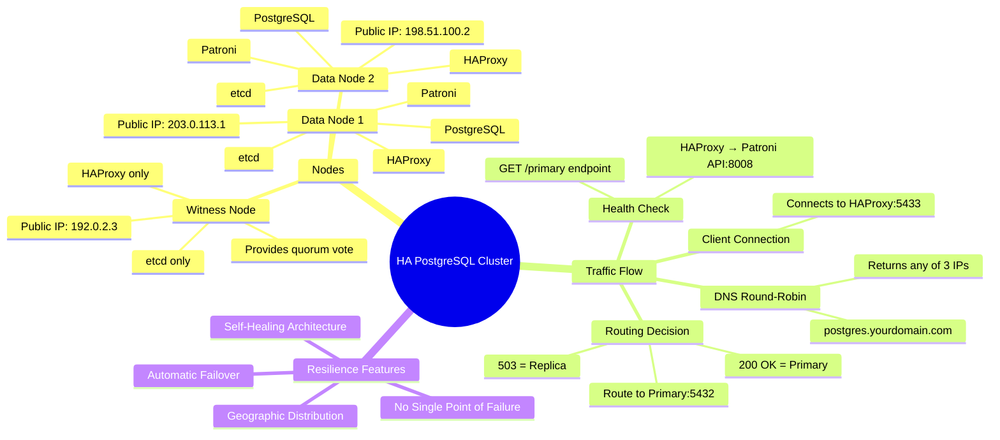
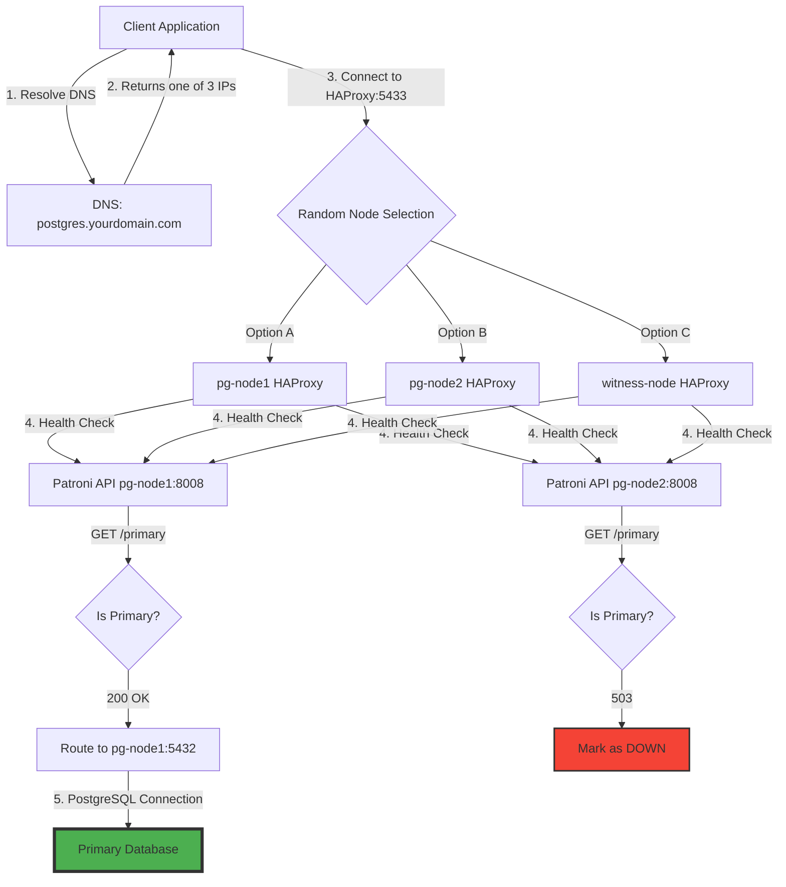
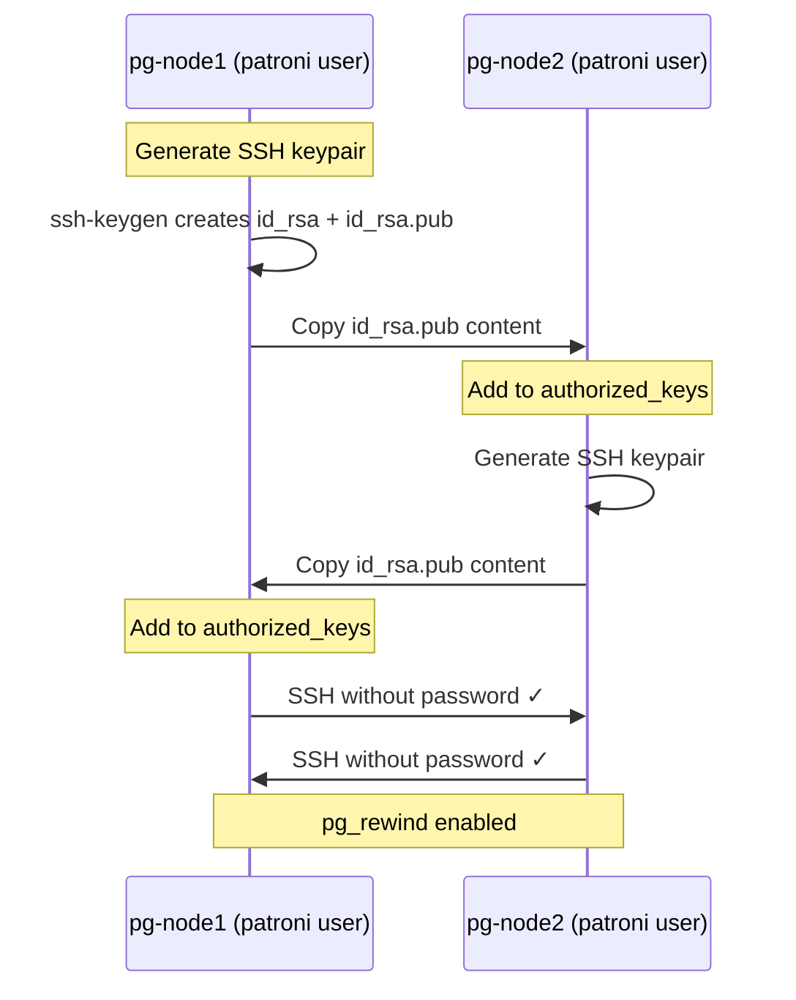
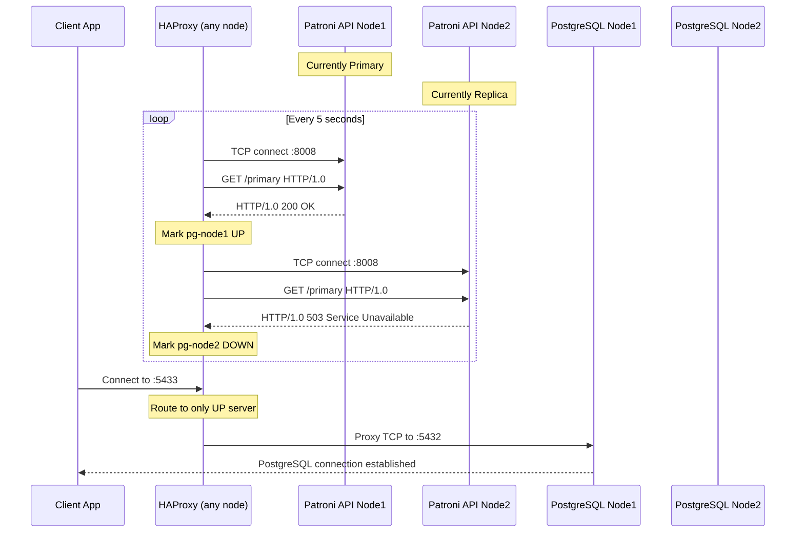
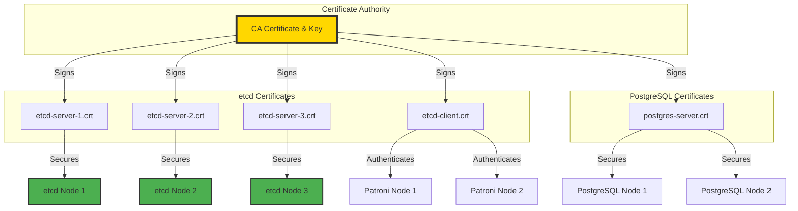
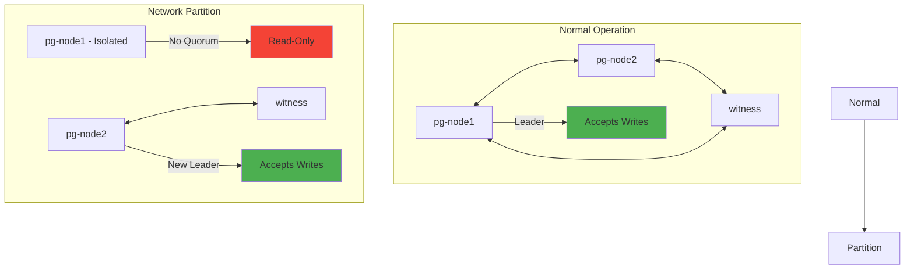
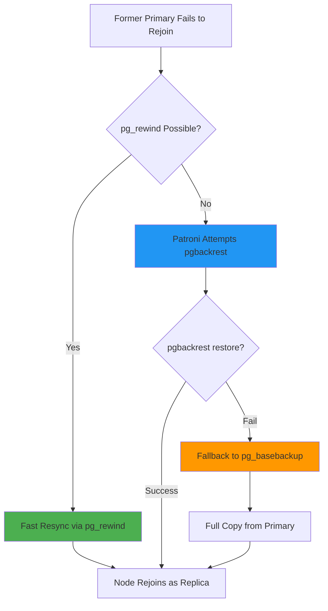
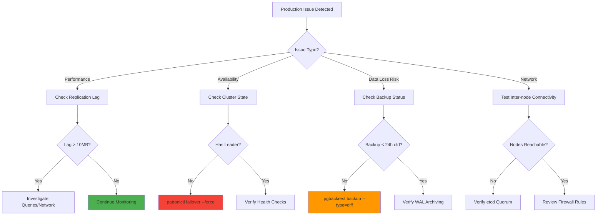
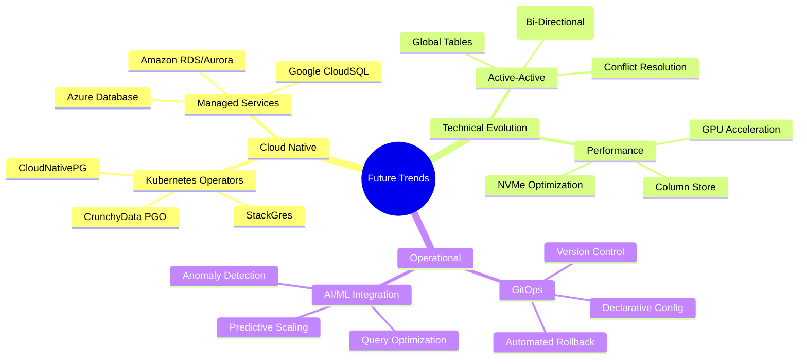

# PostgreSQL High Availability from Scratch: A Practical Guide to Multi-Region Clusters

- [PostgreSQL High Availability from Scratch: A Practical Guide to Multi-Region Clusters](#postgresql-high-availability-from-scratch-a-practical-guide-to-multi-region-clusters)
  - [1. The Big Picture: Architecture Overview of the Self-Healing PostgreSQL Cluster](#1-the-big-picture-architecture-overview-of-the-self-healing-postgresql-cluster)
    - [Core Components and Their Roles](#core-components-and-their-roles)
    - [The Geo-Distributed Topology](#the-geo-distributed-topology)
    - [Traffic Flow: From Client to Primary](#traffic-flow-from-client-to-primary)
  - [2. First Principles: Prerequisite System Hardening on Ubuntu 22.04 LTS](#2-first-principles-prerequisite-system-hardening-on-ubuntu-2204-lts)
    - [Understanding the Fundamentals](#understanding-the-fundamentals)
    - [System Updates and Time Synchronization](#system-updates-and-time-synchronization)
    - [Kernel Tuning for Database Workloads](#kernel-tuning-for-database-workloads)
    - [Dedicated User and Passwordless SSH Setup](#dedicated-user-and-passwordless-ssh-setup)
    - [Self-Test Questions](#self-test-questions)
  - [3. Theory to Practice: Multi-Region Firewall and Routing Configuration](#3-theory-to-practice-multi-region-firewall-and-routing-configuration)
    - [Step 1: Strict Firewall Configuration with ufw](#step-1-strict-firewall-configuration-with-ufw)
    - [Step 2: HAProxy Configuration - The Intelligent Router](#step-2-haproxy-configuration---the-intelligent-router)
    - [Understanding the Health Check Magic](#understanding-the-health-check-magic)
    - [Practical Questions and Answers](#practical-questions-and-answers)
  - [4. Advanced Topics: End-to-End Encryption with TLS](#4-advanced-topics-end-to-end-encryption-with-tls)
    - [Understanding TLS in Distributed Systems](#understanding-tls-in-distributed-systems)
    - [Securing the etcd Cluster with mTLS](#securing-the-etcd-cluster-with-mtls)
    - [Generate the Certificate Authority and Certificates](#generate-the-certificate-authority-and-certificates)
    - [Configure etcd with TLS](#configure-etcd-with-tls)
    - [Securing PostgreSQL with TLS](#securing-postgresql-with-tls)
    - [Advanced Questions and Answers](#advanced-questions-and-answers)
  - [5. Challenges and Best Practices: Fortifying for Production](#5-challenges-and-best-practices-fortifying-for-production)
    - [Common Pitfalls and Their Solutions](#common-pitfalls-and-their-solutions)
      - [Pitfall 1: Split-Brain Scenarios](#pitfall-1-split-brain-scenarios)
      - [Pitfall 2: HAProxy Health Check Flapping](#pitfall-2-haproxy-health-check-flapping)
    - [Production Backup Strategy with pgBackRest](#production-backup-strategy-with-pgbackrest)
    - [Handling pg\_rewind Failures](#handling-pg_rewind-failures)
    - [Decision Framework for Common Scenarios](#decision-framework-for-common-scenarios)
  - [6. The Horizon: Day-2 Operations and Future Trends](#6-the-horizon-day-2-operations-and-future-trends)
    - [Cluster Bootstrap and Initial Verification](#cluster-bootstrap-and-initial-verification)
    - [Comprehensive Monitoring Strategy](#comprehensive-monitoring-strategy)
    - [Lifecycle Management Procedures](#lifecycle-management-procedures)
      - [Rolling Patroni Updates](#rolling-patroni-updates)
      - [PostgreSQL Major Version Upgrade](#postgresql-major-version-upgrade)
    - [Future Evolution and Resources](#future-evolution-and-resources)


## 1. The Big Picture: Architecture Overview of the Self-Healing PostgreSQL Cluster

In the world of stateful services, achieving true high availability (HA) across geographical regions is the pinnacle of resilience. This guide details the architecture and step-by-step implementation of a production-grade, self-healing PostgreSQL cluster that can survive the loss of an entire data center while maintaining data integrity and service continuity.

### Core Components and Their Roles

At its heart, this architecture orchestrates four specialized components:

- **PostgreSQL**: The relational database at the core, treated as a stateful workhorse with lifecycle management delegated to specialized managers
- **Patroni**: The high-availability cluster manager that wraps PostgreSQL's native streaming replication in robust automation, constantly monitoring health and automating leader election
- **etcd**: The distributed consensus store using Raft algorithm to maintain cluster state, preventing split-brain scenarios with an unwavering source of truth
- **HAProxy**: The intelligent request router that's "Patroni-aware," determining the current primary in real-time and routing write traffic transparently

### The Geo-Distributed Topology



The architecture consists of three strategically placed nodes:

1. **Data Node 1 (pg-node1)**: Full cluster member at 203.0.113.1
2. **Data Node 2 (pg-node2)**: Second full member at 198.51.100.2  
3. **Witness Node (witness-node)**: Lightweight quorum provider at 192.0.2.3

### Traffic Flow: From Client to Primary



The elegance lies in the layered approach:

1. **DNS Round-Robin**: Single A record with three IPs provides basic load distribution
2. **HAProxy Connection**: Client receives any IP and connects to port 5433
3. **Intelligent Health Check**: HAProxy performs HTTP GET to Patroni's `/primary` endpoint
4. **Primary Detection**: Only the leader returns 200 OK; replicas return 503
5. **Proxy to Primary**: HAProxy routes the TCP connection to the healthy primary

This design compensates for DNS round-robin's lack of health awareness by making every entry point intelligent.

## 2. First Principles: Prerequisite System Hardening on Ubuntu 22.04 LTS

Before building our resilient cluster, we must establish a secure foundation. Think of this like preparing the ground before building a house—a solid foundation prevents future problems and ensures structural soundness.

### Understanding the Fundamentals

In distributed systems, three core principles govern our approach:

1. **Time Synchronization**: All nodes must agree on time. Components like etcd use time-based leases (TTL) for leadership. Clock drift can destabilize the entire cluster.
2. **Resource Optimization**: Database servers have specific kernel requirements different from general-purpose systems. We optimize for memory retention and consistent performance.
3. **Security by Default**: Every service runs with minimal privileges, and every connection is authenticated and encrypted.

### System Updates and Time Synchronization

```bash
# Refresh package lists and apply all security patches
sudo apt update
sudo apt upgrade -y

# Install essential utilities for our cluster
sudo apt install -y curl wget python3-pip ufw

# Enable and verify time synchronization
sudo timedatectl set-ntp true
timedatectl status
```

### Kernel Tuning for Database Workloads

```bash
# Lower swappiness to keep database pages in RAM
sudo sysctl vm.swappiness=10
echo 'vm.swappiness = 10' | sudo tee -a /etc/sysctl.conf

# Disable Transparent Huge Pages (THP) to prevent latency spikes
sudo bash -c 'cat > /etc/systemd/system/disable-thp.service' <<EOF
[Unit]
Description=Disable Transparent Huge Pages (THP)
DefaultDependencies=no
After=sysinit.target local-fs.target
Before=dbus.service

[Service]
Type=oneshot
ExecStart=/bin/sh -c "echo 'never' > /sys/kernel/mm/transparent_hugepage/enabled"
ExecStart=/bin/sh -c "echo 'never' > /sys/kernel/mm/transparent_hugepage/defrag"

[Install]
WantedBy=multi-user.target
EOF

sudo systemctl daemon-reload
sudo systemctl enable --now disable-thp.service
```

### Dedicated User and Passwordless SSH Setup

```bash
# Create system user for running Patroni and PostgreSQL
sudo useradd --system --home-dir /home/patroni --shell /bin/bash patroni
sudo mkdir /home/patroni
sudo chown patroni:patroni /home/patroni

# On pg-node1: Generate SSH key
sudo -iu patroni
ssh-keygen -t rsa -b 4096  # Press Enter for all prompts
cat ~/.ssh/id_rsa.pub      # Copy this output
exit

# On pg-node2: Add pg-node1's public key
sudo -iu patroni
mkdir -p ~/.ssh
touch ~/.ssh/authorized_keys
chmod 700 ~/.ssh
chmod 600 ~/.ssh/authorized_keys
nano ~/.ssh/authorized_keys  # Paste pg-node1's public key
exit

# Repeat the process in reverse (pg-node2 → pg-node1)

# Verify SSH connectivity
sudo -iu patroni ssh pg-node2 'echo "SSH connection successful"'
```



### Self-Test Questions

1. **Q: Why is vm.swappiness set to 10 on a database server?**
   A: Low swappiness (10) tells the kernel to avoid swapping memory to disk unless absolutely necessary. This keeps PostgreSQL's buffer cache and working set in fast RAM, preventing performance degradation from disk I/O.

2. **Q: What problems does disabling Transparent Huge Pages prevent?**
   A: THP can cause significant latency spikes and memory allocation stalls in PostgreSQL due to lock contention in the kernel when managing large memory pages. PostgreSQL's sparse memory access patterns don't benefit from huge pages.

3. **Q: Why is passwordless SSH critical for low Recovery Time Objective (RTO)?**
   A: The pg_rewind tool requires SSH access to quickly resync a failed primary as a new replica. Without passwordless SSH, manual intervention would be needed during failover recovery, significantly increasing downtime.

4. **Q: What is the purpose of the patroni user?**
   A: The patroni user embodies the principle of least privilege—services should never run as root. This limits potential damage from security breaches and prevents accidental system-wide changes.

5. **Q: If adding a fourth node, what time synchronization steps are needed?**
   A: Enable NTP with `sudo timedatectl set-ntp true` and verify synchronization with `timedatectl status`. Ensure the node syncs to the same NTP servers as existing nodes to maintain consistent time across the cluster.

## 3. Theory to Practice: Multi-Region Firewall and Routing Configuration

With our nodes hardened, we now implement the security perimeter and intelligent routing layer. This section transforms our architectural design into concrete firewall rules and HAProxy configurations.

### Step 1: Strict Firewall Configuration with ufw

Since our nodes communicate over the public internet, we implement a zero-trust network model: deny everything by default, then explicitly allow only required connections between known cluster members.

```bash
# Execute on ALL three nodes (pg-node1, pg-node2, witness-node)

# Set default policies
sudo ufw default deny incoming
sudo ufw default allow outgoing

# Core Cluster Communication (All Nodes)
# Replace <your_admin_ip> with your actual management IP
sudo ufw allow from <your_admin_ip> to any port 22 proto tcp comment 'SSH admin access'

# etcd client traffic (port 2379)
sudo ufw allow from 203.0.113.1 to any port 2379 proto tcp comment 'etcd client pg-node1'
sudo ufw allow from 198.51.100.2 to any port 2379 proto tcp comment 'etcd client pg-node2'
sudo ufw allow from 192.0.2.3 to any port 2379 proto tcp comment 'etcd client witness'

# etcd peer traffic (port 2380)
sudo ufw allow from 203.0.113.1 to any port 2380 proto tcp comment 'etcd peer pg-node1'
sudo ufw allow from 198.51.100.2 to any port 2380 proto tcp comment 'etcd peer pg-node2'
sudo ufw allow from 192.0.2.3 to any port 2380 proto tcp comment 'etcd peer witness'

# HAProxy public entry point
sudo ufw allow 5433/tcp comment 'HAProxy frontend'

# Data Node Specific Rules (ONLY on pg-node1 and pg-node2)
# Patroni REST API for health checks
sudo ufw allow from 203.0.113.1 to any port 8008 proto tcp comment 'Patroni API pg-node1'
sudo ufw allow from 198.51.100.2 to any port 8008 proto tcp comment 'Patroni API pg-node2'
sudo ufw allow from 192.0.2.3 to any port 8008 proto tcp comment 'Patroni API witness'

# PostgreSQL replication between data nodes only
sudo ufw allow from 203.0.113.1 to any port 5432 proto tcp comment 'PostgreSQL pg-node1'
sudo ufw allow from 198.51.100.2 to any port 5432 proto tcp comment 'PostgreSQL pg-node2'

# Enable firewall
sudo ufw --force enable
sudo ufw status verbose
```

### Step 2: HAProxy Configuration - The Intelligent Router

The beauty of this architecture is symmetry: identical HAProxy configuration on all three nodes simplifies management and reduces errors.

```bash
# Install HAProxy on all three nodes
sudo apt install -y haproxy

# Create /etc/haproxy/haproxy.cfg (identical on all nodes)
sudo tee /etc/haproxy/haproxy.cfg <<'EOF'
# HAProxy Configuration for PostgreSQL HA
# This configuration is identical across all three nodes

global
    log /dev/log    local0
    log /dev/log    local1 notice
    chroot /var/lib/haproxy
    stats socket /run/haproxy/admin.sock mode 660 level admin expose-fd listeners
    stats timeout 30s
    user haproxy
    group haproxy
    daemon

defaults
    log     global
    mode    tcp          # TCP mode for PostgreSQL protocol
    option  tcplog
    option  dontlognull
    timeout connect 5000
    timeout client  60m  # Long timeout for database connections
    timeout server  60m
    timeout check   5s   # Crucial for health check timing

# Frontend: Public-facing entry point for all clients
frontend pg_writes
    bind *:5433          # Listen on all interfaces
    default_backend pg_primary_nodes

# Backend: Intelligent routing logic
backend pg_primary_nodes
    balance roundrobin   # Only one server will be UP at a time
    
    # Patroni-Aware Health Check Sequence
    option tcp-check
    
    # 1. Connect to Patroni REST API
    tcp-check connect port 8008
    
    # 2. Send HTTP GET request for /primary endpoint
    tcp-check send GET\ /primary\ HTTP/1.0\\r\\n\\r\\n
    
    # 3. Expect 200 OK (only from current leader)
    tcp-check expect string HTTP/1.0\ 200
    
    # Define PostgreSQL nodes with health checks
    server pg-node1 203.0.113.1:5432 check
    server pg-node2 198.51.100.2:5432 check
EOF

# Enable and start HAProxy on all nodes
sudo systemctl enable haproxy
sudo systemctl start haproxy
```

### Understanding the Health Check Magic



### Practical Questions and Answers

1. **Q: Why is the HAProxy configuration identical on the witness node?**
   A: This promotes operational simplicity. The witness node's HAProxy performs the same health checks and can route traffic correctly, making it a fully functional entry point despite not hosting PostgreSQL.

2. **Q: What happens if port 8008 is blocked on the firewall?**
   A: HAProxy health checks will timeout, marking all backends as DOWN. Clients connecting through that HAProxy instance will receive connection errors. This highlights the critical importance of proper firewall rules.

3. **Q: Why use tcp-check instead of option httpchk?**
   A: We're proxying the PostgreSQL wire protocol (mode tcp), not HTTP. The tcp-check sequence allows us to perform HTTP-style health checks against Patroni's management API while maintaining TCP mode for the actual PostgreSQL connections.

4. **Q: How does this handle network partitions?**
   A: If a network partition isolates a node, its local HAProxy can only health-check reachable nodes. The etcd quorum ensures only one partition can have an active primary, preventing split-brain scenarios.

5. **Q: What's the impact of the 5-second check timeout?**
   A: This timeout must balance responsiveness with stability. Too short causes false-positive failures during high load; too long delays failover detection. 5 seconds accommodates temporary network hiccups while maintaining reasonable failover speed.

## 4. Advanced Topics: End-to-End Encryption with TLS

In a geo-distributed architecture, encryption isn't optional—it's fundamental. This section implements military-grade encryption for both the control plane (etcd) and data plane (PostgreSQL) using a self-signed Certificate Authority.

### Understanding TLS in Distributed Systems

Transport Layer Security (TLS) provides three critical guarantees:
1. **Confidentiality**: Data is encrypted in transit, preventing eavesdropping
2. **Integrity**: Tampering is detectable through cryptographic signatures
3. **Authentication**: Nodes can verify each other's identity through certificates

We'll implement mutual TLS (mTLS) where both client and server authenticate each other—the gold standard for zero-trust architectures.

### Securing the etcd Cluster with mTLS

First, install etcd from official binaries for production stability:

```bash
# Execute on all three nodes
ETCD_VER=v3.5.14
DOWNLOAD_URL=https://github.com/etcd-io/etcd/releases/download
curl -L ${DOWNLOAD_URL}/${ETCD_VER}/etcd-${ETCD_VER}-linux-amd64.tar.gz -o /tmp/etcd-${ETCD_VER}-linux-amd64.tar.gz
sudo tar xzvf /tmp/etcd-${ETCD_VER}-linux-amd64.tar.gz -C /usr/local/bin --strip-components=1
rm /tmp/etcd-${ETCD_VER}-linux-amd64.tar.gz
```

### Generate the Certificate Authority and Certificates

```bash
# Execute on a secure admin machine
mkdir -p etcd-certs && cd etcd-certs

# 1. Create Certificate Authority (Root of Trust)
openssl genrsa -out ca.key 4096
openssl req -x509 -new -nodes -key ca.key -sha256 -days 3650 -out ca.crt \
    -subj "/CN=PostgreSQL-HA-CA"

# 2. Generate Server Certificates with SANs
# For pg-node1
openssl genrsa -out etcd-server-1.key 4096
cat > etcd-server-1.cnf <<EOF
[req]
distinguished_name = req_distinguished_name
req_extensions = v3_req
[req_distinguished_name]
[v3_req]
subjectAltName = DNS:pg-node1,IP:203.0.113.1,IP:127.0.0.1
EOF
openssl req -new -key etcd-server-1.key -out etcd-server-1.csr \
    -subj "/CN=pg-node1" -config etcd-server-1.cnf
openssl x509 -req -in etcd-server-1.csr -CA ca.crt -CAkey ca.key \
    -CAcreateserial -out etcd-server-1.crt -days 365 \
    -extensions v3_req -extfile etcd-server-1.cnf

# For pg-node2
openssl genrsa -out etcd-server-2.key 4096
cat > etcd-server-2.cnf <<EOF
[req]
distinguished_name = req_distinguished_name
req_extensions = v3_req
[req_distinguished_name]
[v3_req]
subjectAltName = DNS:pg-node2,IP:198.51.100.2,IP:127.0.0.1
EOF
openssl req -new -key etcd-server-2.key -out etcd-server-2.csr \
    -subj "/CN=pg-node2" -config etcd-server-2.cnf
openssl x509 -req -in etcd-server-2.csr -CA ca.crt -CAkey ca.key \
    -CAcreateserial -out etcd-server-2.crt -days 365 \
    -extensions v3_req -extfile etcd-server-2.cnf

# For witness-node
openssl genrsa -out etcd-server-3.key 4096
cat > etcd-server-3.cnf <<EOF
[req]
distinguished_name = req_distinguished_name
req_extensions = v3_req
[req_distinguished_name]
[v3_req]
subjectAltName = DNS:witness-node,IP:192.0.2.3,IP:127.0.0.1
EOF
openssl req -new -key etcd-server-3.key -out etcd-server-3.csr \
    -subj "/CN=witness-node" -config etcd-server-3.cnf
openssl x509 -req -in etcd-server-3.csr -CA ca.crt -CAkey ca.key \
    -CAcreateserial -out etcd-server-3.crt -days 365 \
    -extensions v3_req -extfile etcd-server-3.cnf

# 3. Generate Client Certificate for Patroni
openssl genrsa -out etcd-client.key 4096
openssl req -new -key etcd-client.key -out etcd-client.csr \
    -subj "/CN=patroni-client"
openssl x509 -req -in etcd-client.csr -CA ca.crt -CAkey ca.key \
    -CAcreateserial -out etcd-client.crt -days 365
```

### Configure etcd with TLS

```bash
# Create directories and distribute certificates
# On pg-node1:
sudo mkdir -p /etc/etcd/tls
# Copy ca.crt, etcd-server-1.crt, etcd-server-1.key, etcd-client.crt, etcd-client.key
sudo chown -R root:root /etc/etcd/tls
sudo chmod 600 /etc/etcd/tls/*.key

# Create /etc/etcd/etcd.conf.yml on pg-node1
sudo tee /etc/etcd/etcd.conf.yml <<'EOF'
name: 'pg-node1'
data-dir: /var/lib/etcd

# Client-to-Server TLS
listen-client-urls: https://0.0.0.0:2379
advertise-client-urls: https://203.0.113.1:2379

client-transport-security:
  cert-file: /etc/etcd/tls/etcd-server-1.crt
  key-file: /etc/etcd/tls/etcd-server-1.key
  client-cert-auth: true
  trusted-ca-file: /etc/etcd/tls/ca.crt

# Peer-to-Peer TLS
initial-advertise-peer-urls: https://203.0.113.1:2380
listen-peer-urls: https://0.0.0.0:2380

peer-transport-security:
  cert-file: /etc/etcd/tls/etcd-server-1.crt
  key-file: /etc/etcd/tls/etcd-server-1.key
  peer-client-cert-auth: true
  trusted-ca-file: /etc/etcd/tls/ca.crt

# Cluster Configuration
initial-cluster: pg-node1=https://203.0.113.1:2380,pg-node2=https://198.51.100.2:2380,witness-node=https://192.0.2.3:2380
initial-cluster-token: 'pg-ha-prod-cluster'
initial-cluster-state: 'new'

# Performance
auto-compaction-retention: "1"
auto-compaction-mode: periodic
EOF

# Create systemd service
sudo groupadd --system etcd
sudo useradd -s /sbin/nologin --system -g etcd etcd
sudo mkdir -p /var/lib/etcd
sudo chown -R etcd:etcd /var/lib/etcd

sudo tee /etc/systemd/system/etcd.service <<'EOF'
[Unit]
Description=etcd key-value store
After=network.target

[Service]
User=etcd
Group=etcd
Type=notify
ExecStart=/usr/local/bin/etcd --config-file /etc/etcd/etcd.conf.yml
Restart=always
RestartSec=10s
LimitNOFILE=40000

[Install]
WantedBy=multi-user.target
EOF

# Start etcd (coordinate with other nodes)
sudo systemctl daemon-reload
sudo systemctl enable etcd
sudo systemctl start etcd
```

### Securing PostgreSQL with TLS

Generate PostgreSQL certificates:

```bash
# On admin machine
cd etcd-certs  # Use same CA

# Generate PostgreSQL server certificate
openssl genrsa -out postgres-server.key 4096
cat > postgres-server.cnf <<EOF
[req]
distinguished_name = req_distinguished_name
req_extensions = v3_req
[req_distinguished_name]
[v3_req]
subjectAltName = DNS:pg-node1,IP:203.0.113.1,DNS:pg-node2,IP:198.51.100.2
EOF
openssl req -new -key postgres-server.key -out postgres-server.csr \
    -subj "/CN=postgres-ha-server" -config postgres-server.cnf
openssl x509 -req -in postgres-server.csr -CA ca.crt -CAkey ca.key \
    -CAcreateserial -out postgres-server.crt -days 365 \
    -extensions v3_req -extfile postgres-server.cnf
```

Configure Patroni with TLS:

```yaml
# /etc/patroni/patroni.yml on pg-node1
scope: prod-postgres-cluster
name: pg-node1

restapi:
  listen: 0.0.0.0:8008
  connect_address: 203.0.113.1:8008

# Secure etcd Communication
etcd:
  protocol: https
  hosts:
    - '203.0.113.1:2379'
    - '198.51.100.2:2379'
    - '192.0.2.3:2379'
  cacert: /etc/etcd/tls/ca.crt
  cert: /etc/etcd/tls/etcd-client.crt
  key: /etc/etcd/tls/etcd-client.key

bootstrap:
  dcs:
    ttl: 30
    loop_wait: 10
    retry_timeout: 10
    maximum_lag_on_failover: 1048576
  # Enforce SSL for all connections
  pg_hba:
    - hostssl all all 0.0.0.0/0 scram-sha-256 clientcert=verify-ca
    - hostssl replication replicator 0.0.0.0/0 scram-sha-256 clientcert=verify-ca

postgresql:
  listen: 0.0.0.0:5432
  connect_address: 203.0.113.1:5432
  data_dir: /var/lib/postgresql/14/main
  bin_dir: /usr/lib/postgresql/14/bin
  use_pg_rewind: true
  use_slots: true
  parameters:
    ssl: 'on'
    ssl_cert_file: '/etc/patroni/tls/postgres-server.crt'
    ssl_key_file: '/etc/patroni/tls/postgres-server.key'
    ssl_ca_file: '/etc/patroni/tls/ca.crt'
  authentication:
    superuser:
      username: postgres
      password: 'SecurePassword123!'
    replication:
      username: replicator
      password: 'ReplicationPassword123!'
```



### Advanced Questions and Answers

1. **Q: Why include 127.0.0.1 in the SAN list?**
   A: Local management tools and health checks often connect via localhost. Without 127.0.0.1 in the certificate's SAN, these connections fail with "certificate name mismatch" errors, breaking operational tooling.

2. **Q: Can we use one certificate for both etcd and PostgreSQL?**
   A: While technically possible, this violates the principle of least privilege. A compromised PostgreSQL certificate shouldn't grant etcd access. Separate certificates provide defense in depth.

3. **Q: What if the CA private key is compromised?**
   A: This is catastrophic—an attacker can sign valid certificates and impersonate any component. The only remediation is generating a new CA, reissuing all certificates, and revoking the old ones. Store the CA key offline in a hardware security module if possible.

4. **Q: How do we handle certificate expiration?**
   A: Implement monitoring for certificate expiry (30 days warning). Plan rolling certificate updates during maintenance windows. Consider shorter-lived certificates (90 days) with automation for regular rotation.

5. **Q: What's the performance impact of TLS?**
   A: Modern CPUs with AES-NI instructions minimize overhead (~5-10% CPU increase). The security benefits far outweigh this cost. Use persistent connections and connection pooling to amortize TLS handshake costs.

## 5. Challenges and Best Practices: Fortifying for Production

Building the cluster is just the beginning. Operating it reliably requires understanding failure modes, implementing robust backup strategies, and establishing operational excellence.

### Common Pitfalls and Their Solutions

#### Pitfall 1: Split-Brain Scenarios

**The Problem**: Network partitions can cause nodes to disagree about cluster state, potentially leading to data corruption if multiple nodes accept writes.

**Our Defense**: The 3-node etcd cluster with Raft consensus provides mathematical guarantees. With 3 nodes, quorum requires 2 nodes (`(3/2) + 1 = 2`).



**Scenario Analysis**:
- pg-node1 isolated: Has 1/3 votes, loses quorum, Patroni demotes to read-only
- pg-node2 + witness: Have 2/3 votes, maintain quorum, elect new leader
- Result: No split-brain, service continues with degraded redundancy

#### Pitfall 2: HAProxy Health Check Flapping

**The Problem**: Transient network issues or high load cause health checks to intermittently fail, resulting in connection instability.

**Solutions**:
```bash
# Modify /etc/haproxy/haproxy.cfg
backend pg_primary_nodes
    balance roundrobin
    
    # Increase check interval and tolerance
    option tcp-check
    tcp-check connect port 8008
    tcp-check send GET\ /primary\ HTTP/1.0\\r\\n\\r\\n
    tcp-check expect string HTTP/1.0\ 200
    
    # Require 3 failures before marking down, 2 successes to mark up
    # Check every 3 seconds instead of default 2
    server pg-node1 203.0.113.1:5432 check inter 3s fall 3 rise 2
    server pg-node2 198.51.100.2:5432 check inter 3s fall 3 rise 2
```

### Production Backup Strategy with pgBackRest

High availability protects against downtime, not data loss. Implement defense-in-depth with pgBackRest and cloud storage.

```bash
# Install pgBackRest on both data nodes
sudo apt install -y pgbackrest

# Create /etc/pgbackrest.conf
sudo tee /etc/pgbackrest.conf <<'EOF'
[global]
# S3 Configuration
repo1-type=s3
repo1-s3-bucket=postgres-backups-prod
repo1-s3-endpoint=s3.us-east-1.amazonaws.com
repo1-s3-key=<AWS_ACCESS_KEY>
repo1-s3-key-secret=<AWS_SECRET_KEY>
repo1-s3-region=us-east-1
repo1-path=/backup/prod-cluster
repo1-retention-full=2
repo1-retention-diff=6

# Performance
archive-async=y
archive-push-queue-max=256MB
process-max=4
compress-type=lz4
compress-level=3

[prod-cluster]
pg1-path=/var/lib/postgresql/14/main
pg1-host=pg-node1
pg2-path=/var/lib/postgresql/14/main
pg2-host=pg-node2
EOF

# Update Patroni configuration for pgBackRest
# Add to postgresql.parameters section:
archive_mode: on
archive_command: 'pgbackrest --stanza=prod-cluster archive-push %p'

# Add to create_replica_methods:
create_replica_methods:
  - pgbackrest
  - basebackup

pgbackrest:
  command: '/usr/bin/pgbackrest --stanza=prod-cluster --delta restore'
  keep_data: true
  no_params: true
  recovery_conf:
    restore_command: 'pgbackrest --stanza=prod-cluster archive-get %f "%p"'

# Initialize and perform first backup
sudo -u postgres pgbackrest --stanza=prod-cluster stanza-create
sudo -u postgres pgbackrest --stanza=prod-cluster check
sudo -u postgres pgbackrest --stanza=prod-cluster --type=full backup

# Schedule regular backups via cron
(crontab -l 2>/dev/null; echo "0 2 * * 0 pgbackrest --stanza=prod-cluster --type=full backup") | crontab -
(crontab -l 2>/dev/null; echo "0 2 * * 1-6 pgbackrest --stanza=prod-cluster --type=diff backup") | crontab -
```

### Handling pg_rewind Failures

When a former primary can't rejoin via pg_rewind, our pgBackRest integration provides a robust fallback:



Manual intervention when automatic recovery fails:
```bash
# Force reinitialize failed node
patronictl -c /etc/patroni/patroni.yml reinit prod-postgres-cluster pg-node2 --force

# Monitor progress
patronictl -c /etc/patroni/patroni.yml list
tail -f /var/log/postgresql/postgresql-*.log
```

### Decision Framework for Common Scenarios



## 6. The Horizon: Day-2 Operations and Future Trends

Operating a production cluster requires continuous attention to monitoring, lifecycle management, and staying current with evolving best practices.

### Cluster Bootstrap and Initial Verification

The first startup requires precise sequencing:

```bash
# 1. Start etcd cluster (all nodes simultaneously)
sudo systemctl start etcd

# 2. Verify etcd cluster health
ETCDCTL_API=3 etcdctl \
  --endpoints="https://203.0.113.1:2379,https://198.51.100.2:2379,https://192.0.2.3:2379" \
  --cacert=/etc/etcd/tls/ca.crt \
  --cert=/etc/etcd/tls/etcd-client.crt \
  --key=/etc/etcd/tls/etcd-client.key \
  endpoint health --cluster

# 3. Start Patroni on pg-node1 (becomes initial primary)
sudo systemctl start patroni
# Wait for initialization
journalctl -u patroni -f

# 4. Start Patroni on pg-node2 (becomes replica)
sudo systemctl start patroni

# 5. Verify cluster state
patronictl -c /etc/patroni/patroni.yml list

# 6. Start HAProxy on all nodes
sudo systemctl start haproxy

# 7. Verification tests
# Test from each node
for node in 203.0.113.1 198.51.100.2 192.0.2.3; do
  psql -h $node -p 5433 -U postgres -c "SELECT pg_is_in_recovery();" postgres
done
# All should return 'f' (false = primary)
```

### Comprehensive Monitoring Strategy

Implement Prometheus-based monitoring for proactive management:

```yaml
# Prometheus scrape configuration
scrape_configs:
  - job_name: 'patroni'
    scrape_interval: 15s
    static_configs:
      - targets: ['203.0.113.1:8008', '198.51.100.2:8008']
    relabel_configs:
      - source_labels: [__address__]
        target_label: instance
        regex: '([^:]+):\d+'

  - job_name: 'etcd'
    scrape_interval: 15s
    static_configs:
      - targets: ['203.0.113.1:2379', '198.51.100.2:2379', '192.0.2.3:2379']
    scheme: https
    tls_config:
      ca_file: /etc/etcd/tls/ca.crt
      cert_file: /etc/etcd/tls/etcd-client.crt
      key_file: /etc/etcd/tls/etcd-client.key
```

Critical alerts to implement:
```yaml
groups:
  - name: postgresql_ha
    rules:
      - alert: NoClusterLeader
        expr: (max by (scope) (patroni_master) < 1)
        for: 1m
        labels:
          severity: critical
        annotations:
          summary: "PostgreSQL cluster has no leader"
          
      - alert: HighReplicationLag  
        expr: patroni_replication_lag > 10485760  # 10MB
        for: 5m
        labels:
          severity: warning
          
      - alert: EtcdClusterUnhealthy
        expr: up{job="etcd"} == 0
        for: 1m
        labels:
          severity: critical
```

### Lifecycle Management Procedures

#### Rolling Patroni Updates
```bash
# 1. Pause automatic failover
patronictl -c /etc/patroni/patroni.yml pause --wait

# 2. Update each node sequentially
for node in pg-node2 pg-node1; do
  ssh $node "sudo pip install --upgrade patroni[etcd]"
  ssh $node "sudo systemctl restart patroni"
  sleep 30
done

# 3. Resume operations
patronictl -c /etc/patroni/patroni.yml resume --wait
```

#### PostgreSQL Major Version Upgrade
```bash
# CRITICAL: Full backup first
sudo -u postgres pgbackrest --stanza=prod-cluster --type=full backup

# 1. Install new PostgreSQL version
sudo apt install postgresql-15

# 2. Pause cluster
patronictl -c /etc/patroni/patroni.yml pause

# 3. Stop all Patroni instances
sudo systemctl stop patroni

# 4. Upgrade primary with pg_upgrade
cd /var/lib/postgresql
sudo -u postgres /usr/lib/postgresql/15/bin/pg_upgrade \
  --old-datadir=/var/lib/postgresql/14/main \
  --new-datadir=/var/lib/postgresql/15/main \
  --old-bindir=/usr/lib/postgresql/14/bin \
  --new-bindir=/usr/lib/postgresql/15/bin

# 5. Update Patroni configuration
sudo sed -i 's/14/15/g' /etc/patroni/patroni.yml

# 6. Remove old cluster state from etcd
patronictl -c /etc/patroni/patroni.yml remove prod-postgres-cluster

# 7. Start Patroni on upgraded primary
sudo systemctl start patroni

# 8. Reinitialize replicas
patronictl -c /etc/patroni/patroni.yml reinit prod-postgres-cluster pg-node2
```

### Future Evolution and Resources

The landscape of distributed databases continues to evolve rapidly:



Essential resources for continued learning:
- **Patroni Documentation**: patroni.readthedocs.io
- **PostgreSQL Performance**: postgresql.org/docs/current/performance-tips.html
- **etcd Operations Guide**: etcd.io/docs/latest/op-guide/
- **pgBackRest User Guide**: pgbackrest.org/user-guide.html
- **PostgreSQL Slack**: postgresteam.slack.com

This architecture provides a foundation for true production resilience. While managed services offer convenience, understanding these fundamentals empowers you to build systems tailored to your exact requirements, maintain complete control over your data, and achieve the deep operational knowledge that separates good engineers from great ones.

Remember: High availability is not a destination but a journey of continuous improvement. Each incident teaches valuable lessons, each optimization enhances resilience, and each successful failover builds confidence in your system's ability to weather any storm.