# 10 Essential Rust Patterns for Robust Code

- [10 Essential Rust Patterns for Robust Code](#10-essential-rust-patterns-for-robust-code)
  - [Introduction: Beyond Just Code](#introduction-beyond-just-code)
  - [Part 1: The Bedrock of Idiomatic Rust](#part-1-the-bedrock-of-idiomatic-rust)
    - [1. RAII: The Silent Guardian of Resources 🧹](#1-raii-the-silent-guardian-of-resources-)
    - [2. The `Result` Pattern: Embracing Fallibility 🤔](#2-the-result-pattern-embracing-fallibility-)
    - [3. The Iterator Pattern: Composable Data Pipelines 🚶‍♂️](#3-the-iterator-pattern-composable-data-pipelines-️)
  - [Part 2: Building Blocks for Safe and Ergonomic APIs](#part-2-building-blocks-for-safe-and-ergonomic-apis)
    - [4. The Newtype Pattern: Giving Primitives a Purpose 🏷️](#4-the-newtype-pattern-giving-primitives-a-purpose-️)
    - [5. The Builder Pattern: Taming Complex Objects 🏗️](#5-the-builder-pattern-taming-complex-objects-️)
    - [6. Static vs. Dynamic Dispatch: A Performance Trade-off ⚡](#6-static-vs-dynamic-dispatch-a-performance-trade-off-)
  - [Part 3: Advanced Guarantees via the Type System](#part-3-advanced-guarantees-via-the-type-system)
    - [7. The Typestate Pattern: Making Invalid States Unrepresentable 🚦](#7-the-typestate-pattern-making-invalid-states-unrepresentable-)
    - [8. Fearless Concurrency: The `Send` and `Sync` Markers 👯](#8-fearless-concurrency-the-send-and-sync-markers-)
  - [Part 4: The Cutting Edge of Abstraction](#part-4-the-cutting-edge-of-abstraction)
    - [9. Generic Associated Types (GATs): The Ultimate Abstraction ⛓️](#9-generic-associated-types-gats-the-ultimate-abstraction-️)
    - [10. Higher-Rank Trait Bounds (HRTBs): For Universal Functions 🏅](#10-higher-rank-trait-bounds-hrtbs-for-universal-functions-)
  - [Architectural Synthesis: A Symphony of Patterns](#architectural-synthesis-a-symphony-of-patterns)
  - [Final Explanation: Thinking in Rules, Not Just Instructions](#final-explanation-thinking-in-rules-not-just-instructions)


## Introduction: Beyond Just Code

In the world of software, a "design pattern" is a well-known solution to a common problem. But in Rust, this concept runs deeper. Rust patterns are not just about organizing code for readability; they are fundamental techniques for harnessing the full power of the Rust compiler. They are about writing code that is not only clean, but verifiably correct, safe, and incredibly efficient.

Mastering these patterns is the difference between writing Rust code and *thinking* in Rust. It's about shifting your mindset from "How do I tell the computer what to do?" to "How do I describe the rules of my problem so the compiler can help me build the solution?" This guide explores ten essential patterns, moving from the foundational principles every Rust developer uses daily to the advanced abstractions that power the language's most innovative libraries. Each section is designed to build intuition, answer the "why," and show you how to apply these concepts to real-world problems.

-----

## Part 1: The Bedrock of Idiomatic Rust

These first three patterns form the core of everyday Rust programming. They are the tools you'll reach for constantly to manage resources, handle errors, and process data efficiently and safely.

### 1\. RAII: The Silent Guardian of Resources 🧹

At its heart, the **Resource Acquisition Is Initialization (RAII)** pattern is Rust's automatic cleanup service. It guarantees that resources like memory, file handles, or network sockets are released deterministically as soon as they are no longer needed.

  - **So, what problem does this actually solve?**
    In many languages, you must manually manage resources. You open a file, and you must remember to close it. You lock a mutex, and you must remember to unlock it. Forgetting to do so leads to some of the most insidious bugs: resource leaks and deadlocks. RAII eliminates this entire class of errors.
  - **How does it *really* work?**
    When an object that owns a resource is created, the resource is acquired (e.g., a file is opened). Rust ties the object's lifetime to its scope. When the object goes out of scope (for example, at the end of a function), its special `drop` method is automatically called by the compiler. This is where you put the cleanup logic. There's no garbage collector and no unpredictable delays; cleanup is immediate and guaranteed.
  - **Real-World Use Cases:**
      - **Mutexes:** A `MutexGuard` from the standard library is a perfect example. The mutex is locked when the guard is created, and automatically unlocked when the guard is dropped.
      - **File I/O:** The `File` struct automatically closes the underlying file descriptor when it's dropped.
      - **Database Connections:** A connection pool will return a connection object that, when dropped, automatically returns the connection to the pool for reuse.

```mermaid
sequenceDiagram
    participant main_thread as Main Thread
    participant spawned_thread as Spawned Thread
    participant mutex as Mutex
    main_thread->>mutex: lock() → creates guard
    activate main_thread
    Note over main_thread: Lock is held by `guard`
    main_thread-->>main_thread: guard += 1
    spawned_thread->>mutex: lock()
    Note over spawned_thread: Blocks, waiting for lock
    main_thread-->>main_thread: Finishes work...
    deactivate main_thread
    Note over main_thread: `guard` goes out of scope, drops
    mutex-->>spawned_thread: Lock acquired
```




```rust
use std::sync::{Arc, Mutex};
use std::thread;
use std::time::Duration;

fn main() {
    let my_data = Arc::new(Mutex::new(0));
    let data_clone = Arc::clone(&my_data);

    // The lock is acquired and a MutexGuard is returned.
    let mut guard = my_data.lock().unwrap();
    *guard += 1;
    println!("Main thread locked and incremented the data.");

    // We spawn another thread to show the lock is held.
    let handle = thread::spawn(move || {
        println!("Spawned thread trying to lock...");
        // This will block until the guard in `main` is dropped.
        let mut num = data_clone.lock().unwrap();
        *num += 1;
        println!("Spawned thread acquired lock and incremented data.");
    });
    
    // The main thread continues its work...
    thread::sleep(Duration::from_millis(10));
    println!("Main thread is done with the lock. Guard is about to go out of scope.");
    
    // The `guard` is dropped here, automatically releasing the lock.
}
```

-----

### 2\. The `Result` Pattern: Embracing Fallibility 🤔

The `Result` pattern is Rust's explicit and robust approach to operations that can fail. Instead of throwing exceptions or returning `null`, functions return a `Result<T, E>` enum, forcing the caller to confront both success (`Ok(T)`) and failure (`Err(E)`).

  - **But why is being forced to handle errors a good thing?**
    In languages with exceptions, it's easy to forget which functions can fail, leading to unhandled exceptions crashing the program. The `Result` type makes a function's fallibility part of its signature. The compiler won't let you compile code that ignores a potential error, turning what would be a runtime crash into a compile-time check.
  - **What's the `?` operator really doing?**
    Writing `match` for every `Result` would be tedious. The `?` operator is syntactic sugar that cleans this up immensely. When you append `?` to a `Result`, the compiler inserts logic that says: "If this is `Ok(value)`, unwrap it and give me the `value`. If this is `Err(error)`, stop executing this function immediately and return that `error`."
  - **Real-World Use Cases:**
      - **Web Services:** Parsing an incoming JSON request body might fail if the JSON is malformed. This function should return a `Result`.
      - **Configuration:** Reading a `.env` or `.toml` file might fail if the file doesn't exist or a required key is missing.
      - **Database Queries:** Any database operation can fail due to network issues, constraint violations, or syntax errors.


```rust
use std::fs::File;
use std::io::{self, Read};

// This function chains two fallible operations.
fn read_username_from_file() -> Result<String, io::Error> {
    // The '?' operator elegantly handles potential errors from each step.
    let mut f = File::open("username.txt")?; // Fails if file doesn't exist.
    let mut s = String::new();
    f.read_to_string(&mut s)?; // Fails if file contains invalid UTF-8.
    Ok(s)
}

fn main() {
    // To test, create a file named `username.txt`.
    // Try it with content, and then try it after deleting the file.
    match read_username_from_file() {
        Ok(username) => println!("Username found: {}", username.trim()),
        Err(e) => println!("Error reading username: {}", e),
    }
}
```

-----

### 3\. The Iterator Pattern: Composable Data Pipelines 🚶‍♂️

The `Iterator` pattern provides a powerful, zero-cost abstraction for processing sequences of data. It allows you to build declarative pipelines of transformations that are both highly readable and exceptionally performant.

  - **What does "zero-cost abstraction" mean here?**
    It means you can write high-level, expressive code like `.filter().map().sum()` without paying a performance penalty. The Rust compiler is smart enough to optimize these chained calls into a single, highly efficient loop, equivalent to what you would have written by hand in a lower-level language. You get developer productivity without sacrificing runtime speed.
  - **How does the "lazy" part work?**
    Iterators are lazy. When you chain methods like `map` and `filter`, no computation actually happens. You are just building a "recipe" for the computation. The work is only performed when you call a "consuming" method like `collect`, `sum`, or `for_each`. This allows for powerful optimizations, as the system can process data one item at a time through the entire pipeline, often avoiding the need for intermediate collections.
  - **Real-World Use Cases:**
      - **Data Science:** Reading a CSV file, skipping the header, parsing rows, filtering for specific criteria, and calculating aggregates.
      - **Web Development:** Taking raw database models, filtering out sensitive information, transforming them into API response models, and collecting them into a JSON array.
      - **Log Processing:** Lazily reading lines from a massive multi-gigabyte log file, filtering for lines containing "ERROR," and counting them without ever loading the entire file into memory.


```rust
fn main() {
    let words = vec!["hello", "rust", "world", "pattern", "iterator"];

    // This is a recipe for a computation. Nothing happens yet.
    let pipeline = words
        .iter()
        .filter(|&&word| word.starts_with('p'))
        .map(|&word| word.to_uppercase());

    // The `for_each` consumer executes the recipe.
    println!("Executing pipeline:");
    pipeline.for_each(|word| {
        println!("Processed word: {}", word);
    });
}
```

-----

## Part 2: Building Blocks for Safe and Ergonomic APIs

These patterns focus on how you structure your data and functions to create APIs that are a joy to use and hard to misuse.

### 4\. The Newtype Pattern: Giving Primitives a Purpose 🏷️

The **Newtype** pattern involves wrapping an existing type (often a primitive like `u64` or `String`) inside a dedicated `struct` to create a new, distinct type in the eyes of the compiler.

  - **But isn't `struct Username(String)` just a `String`? Why the extra ceremony?**
    To you, it might be. But to the Rust compiler, `Username` and `String` are now completely different types. This is incredibly powerful. It means you can't accidentally pass a raw, unvalidated `String` to a function expecting a `Username`. You are using the type system to enforce your application's domain logic.
  - **What's a common trap when using newtypes?**
    The newtype doesn't automatically inherit the methods of the inner type. If you wrap a `String` in `struct Email(String)`, you can't call `.trim()` on an `Email` directly. You can solve this by implementing the `Deref` trait, which allows your newtype to be treated like the inner type in many contexts, giving you the best of both worlds: type safety plus convenience.
  - **Real-World Use Cases:**
      - **API Design:** Distinguishing between different kinds of identifiers (`UserId`, `OrderId`, `SessionId`) to prevent mix-ups.
      - **Data Validation:** Creating an `EmailAddress(String)` newtype where the constructor validates the string format. This guarantees that if you have a value of type `EmailAddress`, it contains a valid email.
      - **Unit Safety:** Creating types like `Meters(f64)` and `Kilograms(f64)` to prevent accidentally adding a distance to a weight.


```rust
#[derive(Debug, PartialEq, Eq)]
struct Username(String);

impl Username {
    pub fn new(s: String) -> Result<Self, String> {
        if s.len() < 4 {
            return Err("Username must be at least 4 characters.".to_string());
        }
        if s.chars().any(|c| !c.is_alphanumeric()) {
            return Err("Username can only contain letters and numbers.".to_string());
        }
        Ok(Self(s))
    }
}

fn welcome_user(username: Username) {
    println!("Welcome, {}!", username.0);
}

fn main() {
    let valid_username = Username::new("rustacean1".to_string()).unwrap();
    welcome_user(valid_username);

    let invalid_username_result = Username::new("!@#".to_string());
    if let Err(e) = invalid_username_result {
        println!("Failed to create username: {}", e);
    }
}
```

-----

### 5\. The Builder Pattern: Taming Complex Objects 🏗️

The **Builder** pattern provides a separate object—the "Builder"—to handle the construction of a complex object in a readable, step-by-step manner.

  - **Why not just use a constructor with lots of arguments?**
    This is often called the "telescoping constructor" anti-pattern. A call like `new(true, false, None, Some(5), "hello")` is cryptic and error-prone. What does `true` mean? Did you mix up the order of the arguments? The Builder pattern replaces this with a fluent, self-documenting API: `.enable_feature_a().timeout(5).name("hello")`.
  - **How does the `build()` step enhance safety?**
    The final `.build()` method acts as a gatekeeper. It is the single point where you can validate the entire configuration. Are there conflicting settings? Are all required fields present? By returning a `Result`, the builder can signal that the requested configuration is invalid, preventing the creation of a malformed object. This ensures that if you successfully get an object, it's a valid one.
  - **Real-World Use Cases:**
      - **Database Pools:** Libraries like `r2d2` use a builder to configure the pool's minimum/maximum connections, timeout values, and other parameters.
      - **Web Servers:** Configuring a server like `actix-web` or `axum` involves setting up routes, middleware, and TCP listener settings, often done through a builder-style API.
      - **GUI Applications:** Constructing a complex UI widget like a window or a button with specific styling, text, and event handlers.


```rust
#[derive(Debug)]
pub struct Server {
    host: String,
    port: u16,
    enable_tls: bool,
}

#[derive(Default)]
pub struct ServerBuilder {
    host: Option<String>,
    port: Option<u16>,
    enable_tls: bool,
}

impl ServerBuilder {
    pub fn new() -> Self { Default::default() }

    pub fn host(mut self, host: String) -> Self {
        self.host = Some(host);
        self
    }
    pub fn port(mut self, port: u16) -> Self {
        self.port = Some(port);
        self
    }
    pub fn enable_tls(mut self, enabled: bool) -> Self {
        self.enable_tls = enabled;
        self
    }

    pub fn build(self) -> Result<Server, String> {
        let host = self.host.ok_or("Host is required.")?;
        let port = self.port.ok_or("Port is required.")?;

        if self.enable_tls && port != 443 {
            println!("Warning: TLS enabled on a non-standard port ({}).", port);
        }

        Ok(Server { host, port, enable_tls: self.enable_tls })
    }
}

fn main() {
    let server = ServerBuilder::new()
        .host("localhost".to_string())
        .port(8080)
        .enable_tls(true)
        .build()
        .expect("Failed to build server");

    println!("Server configured to run at https://{}:{} with TLS={}", server.host, server.port, server.enable_tls);
}
```

-----

### 6\. Static vs. Dynamic Dispatch: A Performance Trade-off ⚡

This pattern describes the two ways Rust can call methods defined in traits, representing a fundamental trade-off between compile-time performance and runtime flexibility.

  - **What's the difference in simple terms?**
      - **Static Dispatch (Generics):** Think of this as a "copy-paste" by the compiler. If you have a function `fn do_thing<T: Animal>(animal: T)`, the compiler creates a separate, highly optimized version of `do_thing` for every type (`Dog`, `Cat`) you call it with. The method call is direct and extremely fast. This is called **monomorphization**.
      - **Dynamic Dispatch (`dyn Trait`):** Think of this as a "lookup" at runtime. When you use a **trait object** like `&dyn Animal`, the compiler doesn't know the concrete type. The object contains a pointer to the data and a second pointer to a **vtable** (a virtual method table). To call a method, the program has to follow the vtable pointer to find the correct function address. This has a minor runtime cost but is incredibly flexible.
  - **So when should I use one over the other?**
      - Use **static dispatch** by default, especially in performance-sensitive code. It's Rust's idiomatic preference.
      - Use **dynamic dispatch** when you need to store different concrete types that share the same trait in a single collection, like `Vec<Box<dyn Drawable>>`. This is impossible with static dispatch because a `Vec` must store elements of a single, known size.
  - **Real-World Use Cases:**
      - **Static Dispatch:** The vast majority of generic functions in Rust libraries (like `sort` on a slice) use static dispatch for maximum performance.
      - **Dynamic Dispatch:**
          - GUI frameworks use `Vec<Box<dyn Widget>>` to manage a list of different widgets on screen.
          - A plugin system where loaded plugins all implement a `Plugin` trait and are stored in a `HashMap<String, Box<dyn Plugin>>`.
          - Dependency injection, where a service accepts a `Box<dyn Logger>` to allow different logging implementations (e.g., console logger, file logger) to be swapped out.


```rust
trait Animal {
    fn speak(&self);
}

struct Dog;
impl Animal for Dog {
    fn speak(&self) { println!("Woof!"); }
}

struct Cat;
impl Animal for Cat {
    fn speak(&self) { println!("Meow!"); }
}

// Static Dispatch: Compiler creates specialized versions of this function.
fn speak_static<T: Animal>(animal: T) {
    animal.speak();
}

// Dynamic Dispatch: A single function that uses a vtable at runtime.
fn speak_dynamic(animal: &dyn Animal) {
    animal.speak();
}

fn main() {
    let dog = Dog;
    let cat = Cat;

    println!("Static dispatch (fast, compile-time):");
    speak_static(dog); // Compiles to a direct call to Dog::speak
    speak_static(cat); // Compiles to a direct call to Cat::speak

    println!("\nDynamic dispatch (flexible, runtime):");
    let animals: Vec<&dyn Animal> = vec![&Dog, &Cat];
    for animal in animals {
        speak_dynamic(animal); // Call is resolved at runtime
    }
}
```

-----

## Part 3: Advanced Guarantees via the Type System

These patterns showcase Rust's unique ability to encode complex rules and states into the type system, turning potential runtime logic errors into compile-time checks.

### 7\. The Typestate Pattern: Making Invalid States Unrepresentable 🚦

The **Typestate** pattern uses an object's type to represent its current state. State transitions are implemented as methods that consume the object in its old state and return a new object of a different type representing the new state.

  - **What's the big idea? Why not just use an enum field like `state: PostState`?**
    If you use a field, you must add runtime checks (`if self.state == PostState::Draft`) in every method that depends on a state. You could forget a check, or the logic could become complex and buggy. With the Typestate pattern, the compiler becomes the state machine validator. If a method like `approve()` only exists on the `PendingReviewPost` type, it is a *compile-time error* to try and call it on a `DraftPost`. You have made invalid state transitions impossible to even write.
  - **Isn't creating new objects for every state change inefficient?**
    Thanks to Rust's move semantics and compiler optimizations, this is usually a zero-cost abstraction. The compiler is often smart enough to see that you are just transforming the object on the stack and will optimize away any unnecessary memory allocations or copies. You get the full benefit of compile-time safety without a runtime performance penalty.
  - **Real-World Use Cases:**
      - **Protocol Implementation:** Modeling a network protocol like TCP, with states like `Listen`, `SynSent`, `Established`, and `Closed`.
      - **File Handles:** A file handle type that can be in `ReadMode` or `WriteMode`, where write operations are only available on the `WriteMode` type.
      - **User Authentication Flow:** Modeling a user's session as it moves from `Guest` -\> `Awaiting2FA` -\> `Authenticated`, where access to sensitive data is only possible with an `Authenticated` session type.


```rust
// State types
pub struct NewRequest;
pub struct SentRequest { id: u32 }
pub struct DeliveredRequest { id: u32 }

impl NewRequest {
    // Consumes the NewRequest and returns a SentRequest.
    pub fn send(self) -> SentRequest {
        println!("Request sent...");
        SentRequest { id: 42 }
    }
}

impl SentRequest {
    // Consumes the SentRequest and returns a DeliveredRequest.
    pub fn confirm_delivery(self) -> DeliveredRequest {
        println!("Delivery confirmed for request {}.", self.id);
        DeliveredRequest { id: self.id }
    }
}

fn main() {
    let request = NewRequest;
    // The type changes at each step, enforcing the correct order of operations.
    let sent_request = request.send();
    let _delivered_request = sent_request.confirm_delivery();

    // The following would be a COMPILE-TIME ERROR, preventing a logical bug.
    // let request = NewRequest;
    // request.confirm_delivery(); // Error: method not found in `NewRequest`
}
```

-----

### 8\. Fearless Concurrency: The `Send` and `Sync` Markers 👯

This pattern revolves around two special **marker traits** that the Rust compiler uses to reason about thread safety. They are the secret sauce behind Rust's "fearless concurrency."

  - **What do `Send` and `Sync` actually mean?**
      - `Send`: A type is `Send` if it's safe to **move** it and transfer its ownership to another thread. Most types are `Send`. A counter-example is `Rc<T>` (Reference Counted pointer), which is not thread-safe and thus not `Send`.
      - `Sync`: A type is `Sync` if it's safe to have **shared references** (`&T`) to it from multiple threads simultaneously. If `T` is `Sync`, then `&T` is `Send`. A `Mutex<T>` is `Sync` because its internal locking mechanism ensures that even with shared references, only one thread can access the data at a time.
  - **How does this help me in practice?**
    You don't usually implement these traits yourself. Instead, you use types from the standard library (like `Arc` and `Mutex`) that already have the correct implementations. The compiler then acts as a relentless proofreader. If you try to send a non-`Send` type to another thread, your code will not compile. If you try to share a non-`Sync` type, your code will not compile. This prevents data races—one of the most difficult classes of bugs in concurrent programming—before you even run your program.
  - **Real-World Use Cases:**
      - **Web Servers:** A shared application state or database connection pool wrapped in an `Arc<Mutex<T>>` is passed to every request handler thread.
      - **Parallel Computation:** Libraries like Rayon use these markers to safely parallelize operations on iterators across multiple CPU cores.
      - **GUI Applications:** An application model can be safely updated from a background worker thread while being read by the UI thread.


```rust
use std::sync::{Arc, Mutex};
use std::thread;

fn main() {
    // Arc is a thread-safe atomic reference counter.
    // Mutex provides interior mutability with thread-safe locking.
    // The compiler knows Arc<Mutex<T>> is Send and Sync if T is Send.
    let shared_data = Arc::new(Mutex::new(vec![1, 2, 3]));
    let mut handles = vec![];

    for i in 0..3 {
        let data_clone = Arc::clone(&shared_data);
        let handle = thread::spawn(move || {
            // The compiler allows this because `data_clone` is `Send`.
            let mut data = data_clone.lock().unwrap();
            data.push(i + 4);
            println!("Thread {} added an element. Data: {:?}", i, data);
        });
        handles.push(handle);
    }

    // Wait for all threads to finish.
    for handle in handles {
        handle.join().unwrap();
    }

    println!("Final data: {:?}", shared_data.lock().unwrap());
}
```

-----

## Part 4: The Cutting Edge of Abstraction

These final patterns are more advanced and are essential for library authors or anyone building highly generic, reusable components.

### 9\. Generic Associated Types (GATs): The Ultimate Abstraction ⛓️

**Generic Associated Types (GATs)** are a powerful feature allowing an associated type within a trait to be generic over a lifetime. This finally solves a long-standing problem in Rust, enabling truly decoupled, database-agnostic abstractions.

  - **This sounds abstract. What's the concrete problem?**
    Imagine you want to create a `Repository` trait for database operations. Your methods need to work within a transaction. A database transaction type is almost always tied to the lifetime of the connection it came from (e.g., `sqlx::Transaction<'a, Postgres>`). Before GATs, you couldn't express "an associated type `Transaction` that has some lifetime `'a`" inside the trait itself. You were forced to make the trait know about `sqlx`, defeating the purpose of abstraction.
  - **How do GATs solve this?**
    GATs let you define `type Connection<'a>;` inside your trait. This says: "Any implementation of this trait must provide a connection-like type that is generic over a lifetime `'a`." Now, your `PostgresRepository` can specify that its `Connection<'a>` is `sqlx::Transaction<'a, _>`, while your `MockRepository` for testing can specify its `Connection<'a>` is `MutexGuard<'a, _>`. The trait remains completely generic and decoupled.
  - **Real-World Use Cases:**
      - **Database Abstraction:** Creating a truly database-agnostic data access layer (DAL) that can be backed by Postgres, SQLite, or an in-memory mock for unit tests.
      - **Borrowing Iterators:** Creating an iterator that can yield items that borrow from the iterator itself (e.g., a "streaming iterator"). This was notoriously difficult before GATs.
      - **Generic Data Structures:** Building highly generic data structures that can flexibly handle borrowed data.


```rust
use std::collections::HashMap;
use std::sync::{Mutex, MutexGuard};

// The trait uses a GAT to define a generic "connection" type.
pub trait KeyValueStore {
    type Connection<'a>;
    fn get<'a>(&'a self, conn: &'a mut Self::Connection<'a>, key: &str) -> Option<String>;
}

// A mock implementation for fast unit tests.
pub struct InMemoryStore {
    data: Mutex<HashMap<String, String>>,
}

impl KeyValueStore for InMemoryStore {
    // The GAT is specified as a MutexGuard.
    type Connection<'a> = MutexGuard<'a, HashMap<String, String>>;

    fn get<'a>(&'a self, conn: &'a mut Self::Connection<'a>, key: &str) -> Option<String> {
        conn.get(key).cloned()
    }
}

fn main() {
    let store = InMemoryStore {
        data: Mutex::new(HashMap::from([("key1".to_string(), "value1".to_string())])),
    };
    
    // "Connecting" means locking the mutex.
    let mut conn = store.data.lock().unwrap();
    let item = store.get(&mut conn, "key1");
    println!("Found item via mock repository: {:?}", item);
}
```

-----

### 10\. Higher-Rank Trait Bounds (HRTBs): For Universal Functions 🏅

**Higher-Rank Trait Bounds (HRTBs)**, using the `for<'a>...` syntax, are a way to specify that a trait bound must hold true for *any* possible lifetime. It's a tool for writing exceptionally generic and flexible functions, especially for library authors.

  - **That sounds even more abstract\! Can you give me a simple analogy?**
    Imagine you have a universal key-copying machine (a generic function). You want to be able to tell it: "This machine must accept *any* key I give it, no matter how long or short the key's 'lifetime' is, and be able to make a copy." An HRTB is that guarantee. The function `process(closure)` says "The `closure` you give me must be able to work with a `&'a str` reference for *any* lifetime `'a` I decide to create inside this function."
  - **When would I ever need this?**
    You need it when you are writing code that accepts a function or closure as an argument, and your code will be the one *calling* that closure with data of varying lifetimes. For example, a web framework that processes an incoming request might want to pass different parts of the request (headers, body slices) to a user-provided middleware function. The middleware needs to be able to handle all of them.
  - **Real-World Use Cases:**
      - **Library APIs:** A function in a library that takes a callback and needs to guarantee it can call that callback with references to its own internal data.
      - **Asynchronous Runtimes:** Executors that need to be able to run `Future`s that are generic over any lifetime.
      - **Parser Combinators:** Writing generic parsing functions that can operate on different slices of an input buffer.


```rust
// This function uses an HRTB (`for<'a>`) to specify that the
// closure `F` must be callable with a reference of ANY lifetime `'a`.
fn process_strings<F>(processor: F)
where
    F: for<'a> Fn(&'a str),
{
    // The processor works on a string literal (a 'static lifetime).
    processor("I live for the whole program.");

    // It also works on a local variable with a shorter lifetime.
    let local_string = String::from("I only live inside this function.");
    processor(&local_string);
}

fn main() {
    // This closure satisfies the HRTB because it can handle any &str.
    let simple_printer = |s: &str| println!("Processing: '{}'", s);
    process_strings(simple_printer);
}
```

-----

## Architectural Synthesis: A Symphony of Patterns

These patterns rarely live in isolation. A well-architected Rust application is a symphony where each pattern plays a crucial role. Consider a simple API client that fetches user data.


This diagram illustrates a flow:

1.  We use the **Builder Pattern** to construct an `ApiClient` with a specific configuration.
2.  The `ApiClient` itself holds a trait object (`dyn HttpClient`), allowing us to use a real HTTP client in production and a mock one in tests (**Dynamic Dispatch**).
3.  The client's internal connection pool is managed by **RAII**, ensuring sockets are closed and returned correctly.
4.  Calling `fetch_user` returns a `Result`, forcing us to handle network or API errors gracefully (**Result Pattern**).
5.  A successful result gives us a `User` struct, which uses the **Newtype Pattern** for its `UserId`, preventing it from being mixed up with other IDs.

-----

## Final Explanation: Thinking in Rules, Not Just Instructions

If there is one unifying idea behind all these Rust patterns, it is this: **You are not just telling the computer what to do; you are teaching it the rules of your problem's domain.**

Imagine building a house. In many programming languages, you are a builder with a pile of standard bricks and a blueprint. You must constantly check the blueprint, measure every angle, and ensure you don't use a bathroom tile in the kitchen. The responsibility for correctness is entirely on you, at every single step.

In Rust, the patterns give you a set of "smart", specialized bricks.

  - The **Newtype** brick for the kitchen wall is physically incompatible with the one for the bathroom. You *cannot* mix them up.
  - The **Typestate** pattern gives you foundation bricks that only accept wall bricks, which in turn only accept roof bricks. You *cannot* build the roof before the walls.
  - The **RAII** pattern ensures that when you're done with a tool, it automatically flies back to its designated spot in the toolbox. You *cannot* leave a mess.
  - The **Result** pattern means that every time you try to fit two bricks together, you get an immediate, unmissable signal: a solid "click" (`Ok`) or a jarring "buzz" (`Err`). You *cannot* ignore a bad fit.

Your job as the builder changes. You spend less time on manual verification and more time up-front, describing the properties of your materials and the rules of their assembly. You are essentially creating a custom, physics-enabled LEGO set for your specific problem. The Rust compiler is the physics engine that runs a simulation every time you build, telling you instantly if your design violates its own rules.

This is the paradigm shift Rust offers. It's a move from a world of imperative "do this, then do that" to a world of declarative "these are the rules." By embracing these patterns, you leverage this paradigm to build software that is not just tested for correctness, but is structurally, fundamentally, and verifiably correct by design.