# 10 Essential Rust Patterns for Robust Code

- [10 Essential Rust Patterns for Robust Code](#10-essential-rust-patterns-for-robust-code)
  - [Introduction: Beyond Just Code](#introduction-beyond-just-code)
  - [Part 1: The Bedrock of Idiomatic Rust](#part-1-the-bedrock-of-idiomatic-rust)
    - [1. RAII: The Silent Guardian of Resources 🧹](#1-raii-the-silent-guardian-of-resources-)
    - [2. The `Result` Pattern: Embracing Fallibility 🤔](#2-the-result-pattern-embracing-fallibility-)
    - [3. The Iterator Pattern: Composable Data Pipelines 🚶♂️](#3-the-iterator-pattern-composable-data-pipelines-️)
  - [Part 2: Building Blocks for Safe and Ergonomic APIs](#part-2-building-blocks-for-safe-and-ergonomic-apis)
    - [4. The Newtype Pattern: Giving Primitives a Purpose 🏷️](#4-the-newtype-pattern-giving-primitives-a-purpose-️)
    - [5. The Builder Pattern: Taming Complex Objects 🏗️](#5-the-builder-pattern-taming-complex-objects-️)
    - [6. Static vs. Dynamic Dispatch: A Performance Trade-off ⚡](#6-static-vs-dynamic-dispatch-a-performance-trade-off-)
  - [Part 3: Advanced Guarantees via the Type System](#part-3-advanced-guarantees-via-the-type-system)
    - [7. The Typestate Pattern: Making Invalid States Unrepresentable 🚦](#7-the-typestate-pattern-making-invalid-states-unrepresentable-)
    - [8. Fearless Concurrency: The `Send` and `Sync` Markers 👯](#8-fearless-concurrency-the-send-and-sync-markers-)
  - [Part 4: The Cutting Edge of Abstraction](#part-4-the-cutting-edge-of-abstraction)
    - [9. Generic Associated Types (GATs): The Ultimate Abstraction ⛓️](#9-generic-associated-types-gats-the-ultimate-abstraction-️)
    - [10. Higher-Rank Trait Bounds (HRTBs): For Universal Functions 🏅](#10-higher-rank-trait-bounds-hrtbs-for-universal-functions-)
  - [Architectural Synthesis: Building a Real-World Application](#architectural-synthesis-building-a-real-world-application)
  - [Final Thoughts: Thinking in Rules, Not Just Instructions](#final-thoughts-thinking-in-rules-not-just-instructions)


## Introduction: Beyond Just Code

In the world of software, a "design pattern" is a well-known solution to a common problem. But in Rust, this concept runs deeper. Rust patterns are not just about organizing code for readability; they are fundamental techniques for harnessing the full power of the Rust compiler. They are about writing code that is not only clean, but verifiably correct, safe, and incredibly efficient.

Mastering these patterns is the difference between writing Rust code and *thinking* in Rust. It's about shifting your mindset from "How do I tell the computer what to do?" to "How do I describe the rules of my problem so the compiler can help me build the solution?" This guide explores ten essential patterns, moving from the foundational principles every Rust developer uses daily to the advanced abstractions that power the language's most innovative libraries. Each section is designed to build intuition, answer the "why," and show you how to apply these concepts to real-world problems.

-----

## Part 1: The Bedrock of Idiomatic Rust

These first three patterns form the core of everyday Rust programming. They are the tools you'll reach for constantly to manage resources, handle errors, and process data efficiently and safely.

### 1. RAII: The Silent Guardian of Resources 🧹

At its heart, the **Resource Acquisition Is Initialization (RAII)** pattern is Rust's automatic cleanup service. It guarantees that resources like memory, file handles, or network sockets are released deterministically as soon as they are no longer needed.

  - **So, what problem does this actually solve?**
    In many languages, you must manually manage resources. You open a file, and you must remember to close it. You lock a mutex, and you must remember to unlock it. Forgetting to do so leads to some of the most insidious bugs: resource leaks and deadlocks. RAII eliminates this entire class of errors.
  - **How does it *really* work?**
    When an object that owns a resource is created, the resource is acquired (e.g., a file is opened). Rust ties the object's lifetime to its scope. When the object goes out of scope (for example, at the end of a function), its special `drop` method is automatically called by the compiler. This is where you put the cleanup logic. There's no garbage collector and no unpredictable delays; cleanup is immediate and guaranteed.
  - **Real-World Use Cases:**
      - **Mutexes:** A `MutexGuard` from the standard library is a perfect example. The mutex is locked when the guard is created, and automatically unlocked when the guard is dropped.
      - **File I/O:** The `File` struct automatically closes the underlying file descriptor when it's dropped.
      - **Database Connections:** A connection pool will return a connection object that, when dropped, automatically returns the connection to the pool for reuse.

```mermaid
sequenceDiagram
    participant main_thread as Main Thread
    participant spawned_thread as Spawned Thread
    participant mutex as Mutex
    main_thread->>mutex: lock() → creates guard
    activate main_thread
    Note over main_thread: Lock is held by `guard`
    main_thread-->>main_thread: guard += 1
    spawned_thread->>mutex: lock()
    Note over spawned_thread: Blocks, waiting for lock
    main_thread-->>main_thread: Finishes work...
    deactivate main_thread
    Note over main_thread: `guard` goes out of scope, drops
    mutex-->>spawned_thread: Lock acquired
```




```rust
use std::sync::{Arc, Mutex};
use std::thread;
use std::time::Duration;

fn main() {
    let my_data = Arc::new(Mutex::new(0));
    let data_clone = Arc::clone(&my_data);

    // The lock is acquired and a MutexGuard is returned.
    let mut guard = my_data.lock().unwrap();
    *guard += 1;
    println!("Main thread locked and incremented the data.");

    // We spawn another thread to show the lock is held.
    let handle = thread::spawn(move || {
        println!("Spawned thread trying to lock...");
        // This will block until the guard in `main` is dropped.
        let mut num = data_clone.lock().unwrap();
        *num += 1;
        println!("Spawned thread acquired lock and incremented data.");
    });
    
    // The main thread continues its work...
    thread::sleep(Duration::from_millis(10));
    println!("Main thread is done with the lock. Guard is about to go out of scope.");
    
    // The `guard` is dropped here, automatically releasing the lock.
}
```

**Common Anti-Pattern:** Holding guards longer than necessary:
```rust
// ❌ DON'T DO THIS - holding the lock while doing expensive work
fn bad_pattern(data: Arc<Mutex<Vec<i32>>>) {
    let mut guard = data.lock().unwrap();
    expensive_computation(); // Lock is held unnecessarily long!
    guard.push(42);
}

// ✅ DO THIS - minimize critical sections
fn good_pattern(data: Arc<Mutex<Vec<i32>>>) {
    let result = expensive_computation();
    let mut guard = data.lock().unwrap();
    guard.push(result); // Lock held only for the mutation
}
```

**Testing RAII Patterns:**
```rust
#[cfg(test)]
mod tests {
    use std::sync::{Arc, Mutex};
    use std::thread;

    #[test]
    fn test_mutex_guard_drop() {
        let data = Arc::new(Mutex::new(0));
        let data_clone = Arc::clone(&data);
        
        // Create a scope to control guard lifetime
        {
            let _guard = data.lock().unwrap();
            // Try to lock in another thread - should timeout
            let handle = thread::spawn(move || {
                match data_clone.try_lock() {
                    Ok(_) => panic!("Should not acquire lock!"),
                    Err(_) => {} // Expected
                }
            });
            handle.join().unwrap();
        } // Guard dropped here
        
        // Now we should be able to lock
        assert!(data.try_lock().is_ok());
    }
}
```

-----

### 2. The `Result` Pattern: Embracing Fallibility 🤔

The `Result` pattern is Rust's explicit and robust approach to operations that can fail. Instead of throwing exceptions or returning `null`, functions return a `Result<T, E>` enum, forcing the caller to confront both success (`Ok(T)`) and failure (`Err(E)`).

  - **But why is being forced to handle errors a good thing?**
    In languages with exceptions, it's easy to forget which functions can fail, leading to unhandled exceptions crashing the program. The `Result` type makes a function's fallibility part of its signature. The compiler won't let you compile code that ignores a potential error, turning what would be a runtime crash into a compile-time check.
  - **What's the `?` operator really doing?**
    Writing `match` for every `Result` would be tedious. The `?` operator is syntactic sugar that cleans this up immensely. When you append `?` to a `Result`, the compiler inserts logic that says: "If this is `Ok(value)`, unwrap it and give me the `value`. If this is `Err(error)`, stop executing this function immediately and return that `error`."
  - **Real-World Use Cases:**
      - **Web Services:** Parsing an incoming JSON request body might fail if the JSON is malformed. This function should return a `Result`.
      - **Configuration:** Reading a `.env` or `.toml` file might fail if the file doesn't exist or a required key is missing.
      - **Database Queries:** Any database operation can fail due to network issues, constraint violations, or syntax errors.


```rust
use std::fs::File;
use std::io::{self, Read};

// Define a custom error type for better error handling
#[derive(Debug)]
enum UsernameError {
    IoError(io::Error),
    InvalidUsername(String),
}

impl From<io::Error> for UsernameError {
    fn from(error: io::Error) -> Self {
        UsernameError::IoError(error)
    }
}

// This function chains two fallible operations with proper error handling.
fn read_username_from_file() -> Result<String, UsernameError> {
    let mut f = File::open("username.txt")?; // Converts io::Error to UsernameError
    let mut s = String::new();
    f.read_to_string(&mut s)?;
    
    // Additional validation
    let username = s.trim();
    if username.is_empty() {
        return Err(UsernameError::InvalidUsername("Username cannot be empty".to_string()));
    }
    
    Ok(username.to_string())
}

fn main() {
    match read_username_from_file() {
        Ok(username) => println!("Username found: {}", username),
        Err(UsernameError::IoError(e)) => println!("IO Error: {}", e),
        Err(UsernameError::InvalidUsername(msg)) => println!("Invalid username: {}", msg),
    }
}
```

**Common Anti-Pattern:** Overusing `unwrap()`:
```rust
// ❌ DON'T DO THIS - crashes on error
fn bad_pattern() -> String {
    let contents = std::fs::read_to_string("config.txt").unwrap();
    contents
}

// ✅ DO THIS - propagate errors properly
fn good_pattern() -> Result<String, std::io::Error> {
    let contents = std::fs::read_to_string("config.txt")?;
    Ok(contents)
}
```

**Testing Error Handling:**
```rust
#[cfg(test)]
mod tests {
    use super::*;
    use std::fs;

    #[test]
    fn test_file_not_found() {
        // Ensure file doesn't exist
        let _ = fs::remove_file("nonexistent.txt");
        
        let result = read_username_from_file();
        assert!(matches!(result, Err(UsernameError::IoError(_))));
    }

    #[test]
    fn test_empty_username() {
        fs::write("username.txt", "   ").unwrap();
        let result = read_username_from_file();
        assert!(matches!(result, Err(UsernameError::InvalidUsername(_))));
        let _ = fs::remove_file("username.txt");
    }
}
```

-----

### 3. The Iterator Pattern: Composable Data Pipelines 🚶♂️

The `Iterator` pattern provides a powerful, zero-cost abstraction for processing sequences of data. It allows you to build declarative pipelines of transformations that are both highly readable and exceptionally performant.

  - **What does "zero-cost abstraction" mean here?**
    It means you can write high-level, expressive code like `.filter().map().sum()` without paying a performance penalty. The Rust compiler is smart enough to optimize these chained calls into a single, highly efficient loop, equivalent to what you would have written by hand in a lower-level language. You get developer productivity without sacrificing runtime speed.
  - **How does the "lazy" part work?**
    Iterators are lazy. When you chain methods like `map` and `filter`, no computation actually happens. You are just building a "recipe" for the computation. The work is only performed when you call a "consuming" method like `collect`, `sum`, or `for_each`. This allows for powerful optimizations, as the system can process data one item at a time through the entire pipeline, often avoiding the need for intermediate collections.
  - **Real-World Use Cases:**
      - **Data Science:** Reading a CSV file, skipping the header, parsing rows, filtering for specific criteria, and calculating aggregates.
      - **Web Development:** Taking raw database models, filtering out sensitive information, transforming them into API response models, and collecting them into a JSON array.
      - **Log Processing:** Lazily reading lines from a massive multi-gigabyte log file, filtering for lines containing "ERROR," and counting them without ever loading the entire file into memory.


```rust
use std::time::Instant;

fn main() {
    let words = vec!["hello", "rust", "world", "pattern", "iterator", "programming", "powerful"];

    // Performance comparison
    let start = Instant::now();
    
    // Lazy iterator chain - nothing happens yet
    let pipeline = words
        .iter()
        .filter(|&&word| word.starts_with('p'))
        .map(|&word| word.to_uppercase());

    println!("Pipeline created in {:?}", start.elapsed());

    // Now we consume - this is when the work happens
    let consume_start = Instant::now();
    let results: Vec<String> = pipeline.collect();
    println!("Pipeline executed in {:?}", consume_start.elapsed());
    println!("Results: {:?}", results);

    // Compare with eager evaluation
    let eager_start = Instant::now();
    let mut temp = Vec::new();
    for word in &words {
        if word.starts_with('p') {
            temp.push(word.to_uppercase());
        }
    }
    println!("Eager evaluation in {:?}", eager_start.elapsed());
}
```

**Common Anti-Pattern:** Collecting unnecessarily:
```rust
// ❌ DON'T DO THIS - creates intermediate vector
fn bad_pattern(numbers: &[i32]) -> i32 {
    let filtered: Vec<i32> = numbers.iter()
        .filter(|&&x| x > 0)
        .cloned()
        .collect(); // Unnecessary allocation!
    
    filtered.iter().sum()
}

// ✅ DO THIS - stay lazy until the end
fn good_pattern(numbers: &[i32]) -> i32 {
    numbers.iter()
        .filter(|&&x| x > 0)
        .sum() // Direct summation without intermediate collection
}
```

**Performance Benchmark:**
```rust
#[cfg(test)]
mod benchmarks {
    use super::*;
    use std::time::Instant;

    #[test]
    fn benchmark_iterator_vs_loop() {
        let data: Vec<i32> = (0..1_000_000).collect();
        
        // Iterator version
        let start = Instant::now();
        let sum_iter: i32 = data.iter()
            .filter(|&&x| x % 2 == 0)
            .take(10000)
            .sum();
        let iter_time = start.elapsed();
        
        // Manual loop version
        let start = Instant::now();
        let mut sum_loop = 0;
        let mut count = 0;
        for &x in &data {
            if x % 2 == 0 {
                sum_loop += x;
                count += 1;
                if count >= 10000 {
                    break;
                }
            }
        }
        let loop_time = start.elapsed();
        
        println!("Iterator: {:?}, Loop: {:?}", iter_time, loop_time);
        assert_eq!(sum_iter, sum_loop);
        // Iterator version is typically as fast or faster!
    }
}
```

-----

## Part 2: Building Blocks for Safe and Ergonomic APIs

These patterns focus on how you structure your data and functions to create APIs that are a joy to use and hard to misuse.

### 4. The Newtype Pattern: Giving Primitives a Purpose 🏷️

The **Newtype** pattern involves wrapping an existing type (often a primitive like `u64` or `String`) inside a dedicated `struct` to create a new, distinct type in the eyes of the compiler.

  - **But isn't `struct Username(String)` just a `String`? Why the extra ceremony?**
    To you, it might be. But to the Rust compiler, `Username` and `String` are now completely different types. This is incredibly powerful. It means you can't accidentally pass a raw, unvalidated `String` to a function expecting a `Username`. You are using the type system to enforce your application's domain logic.
  - **What's a common trap when using newtypes?**
    The newtype doesn't automatically inherit the methods of the inner type. If you wrap a `String` in `struct Email(String)`, you can't call `.trim()` on an `Email` directly. You can solve this by implementing the `Deref` trait, which allows your newtype to be treated like the inner type in many contexts, giving you the best of both worlds: type safety plus convenience.
  - **Real-World Use Cases:**
      - **API Design:** Distinguishing between different kinds of identifiers (`UserId`, `OrderId`, `SessionId`) to prevent mix-ups.
      - **Data Validation:** Creating an `EmailAddress(String)` newtype where the constructor validates the string format. This guarantees that if you have a value of type `EmailAddress`, it contains a valid email.
      - **Unit Safety:** Creating types like `Meters(f64)` and `Kilograms(f64)` to prevent accidentally adding a distance to a weight.


```rust
use std::fmt;
use std::ops::Deref;

#[derive(Debug, Clone, PartialEq, Eq)]
struct Username(String);

#[derive(Debug)]
enum ValidationError {
    TooShort,
    InvalidCharacters,
    Reserved,
}

impl Username {
    // Reserved usernames that cannot be used
    const RESERVED: &'static [&'static str] = &["admin", "root", "system"];
    
    pub fn new(s: String) -> Result<Self, ValidationError> {
        let trimmed = s.trim();
        
        if trimmed.len() < 4 {
            return Err(ValidationError::TooShort);
        }
        
        if !trimmed.chars().all(|c| c.is_alphanumeric() || c == '_') {
            return Err(ValidationError::InvalidCharacters);
        }
        
        if Self::RESERVED.contains(&trimmed.to_lowercase().as_str()) {
            return Err(ValidationError::Reserved);
        }
        
        Ok(Self(trimmed.to_string()))
    }
    
    // Provide access to the inner value when needed
    pub fn as_str(&self) -> &str {
        &self.0
    }
}

// Implement Display for nice formatting
impl fmt::Display for Username {
    fn fmt(&self, f: &mut fmt::Formatter<'_>) -> fmt::Result {
        write!(f, "@{}", self.0)
    }
}

// Optionally implement Deref for ergonomics
impl Deref for Username {
    type Target = str;
    
    fn deref(&self) -> &Self::Target {
        &self.0
    }
}

fn welcome_user(username: Username) {
    println!("Welcome, {}!", username);
    // Can use string methods thanks to Deref
    println!("Your username is {} characters long", username.len());
}

fn main() -> Result<(), ValidationError> {
    let valid_username = Username::new("rustacean1".to_string())?;
    welcome_user(valid_username);
    
    // This won't compile - type safety!
    // welcome_user("raw_string".to_string()); // Error: expected Username, found String
    
    // Demonstrate error handling
    match Username::new("!@#".to_string()) {
        Ok(_) => unreachable!(),
        Err(ValidationError::InvalidCharacters) => println!("Invalid characters detected"),
        Err(e) => println!("Other error: {:?}", e),
    }
    
    Ok(())
}
```

**Common Anti-Pattern:** Overexposing internals:
```rust
// ❌ DON'T DO THIS - public field breaks encapsulation
#[derive(Debug)]
pub struct BadUsername {
    pub value: String, // Anyone can modify this!
}

// ✅ DO THIS - private field with controlled access
#[derive(Debug)]
pub struct GoodUsername(String); // Private by default

impl GoodUsername {
    pub fn new(s: String) -> Result<Self, ValidationError> {
        // Validation logic here
        Ok(Self(s))
    }
    
    pub fn as_str(&self) -> &str {
        &self.0
    }
}
```

**Testing Newtypes:**
```rust
#[cfg(test)]
mod tests {
    use super::*;

    #[test]
    fn test_username_validation() {
        // Valid usernames
        assert!(Username::new("valid_user".to_string()).is_ok());
        assert!(Username::new("user123".to_string()).is_ok());
        
        // Invalid usernames
        assert!(matches!(
            Username::new("usr".to_string()),
            Err(ValidationError::TooShort)
        ));
        
        assert!(matches!(
            Username::new("user@domain".to_string()),
            Err(ValidationError::InvalidCharacters)
        ));
        
        assert!(matches!(
            Username::new("admin".to_string()),
            Err(ValidationError::Reserved)
        ));
    }
    
    #[test]
    fn test_username_deref() {
        let username = Username::new("test_user".to_string()).unwrap();
        // Deref allows us to use string methods
        assert_eq!(username.len(), 9);
        assert!(username.starts_with("test"));
    }
}
```

-----

### 5. The Builder Pattern: Taming Complex Objects 🏗️

The **Builder** pattern provides a separate object-the "Builder"-to handle the construction of a complex object in a readable, step-by-step manner.

  - **Why not just use a constructor with lots of arguments?**
    This is often called the "telescoping constructor" anti-pattern. A call like `new(true, false, None, Some(5), "hello")` is cryptic and error-prone. What does `true` mean? Did you mix up the order of the arguments? The Builder pattern replaces this with a fluent, self-documenting API: `.enable_feature_a().timeout(5).name("hello")`.
  - **How does the `build()` step enhance safety?**
    The final `.build()` method acts as a gatekeeper. It is the single point where you can validate the entire configuration. Are there conflicting settings? Are all required fields present? By returning a `Result`, the builder can signal that the requested configuration is invalid, preventing the creation of a malformed object. This ensures that if you successfully get an object, it's a valid one.
  - **Real-World Use Cases:**
      - **Database Pools:** Libraries like `r2d2` use a builder to configure the pool's minimum/maximum connections, timeout values, and other parameters.
      - **Web Servers:** Configuring a server like `actix-web` or `axum` involves setting up routes, middleware, and TCP listener settings, often done through a builder-style API.
      - **GUI Applications:** Constructing a complex UI widget like a window or a button with specific styling, text, and event handlers.


```rust
use std::time::Duration;

#[derive(Debug, Clone)]
pub struct Server {
    host: String,
    port: u16,
    enable_tls: bool,
    max_connections: u32,
    timeout: Duration,
}

#[derive(Debug)]
pub enum BuildError {
    MissingHost,
    MissingPort,
    InvalidConfiguration(String),
}

#[derive(Default)]
pub struct ServerBuilder {
    host: Option<String>,
    port: Option<u16>,
    enable_tls: bool,
    max_connections: Option<u32>,
    timeout_ms: Option<u64>,
}

impl ServerBuilder {
    pub fn new() -> Self {
        Default::default()
    }

    // Consuming builder pattern - takes ownership and returns it
    pub fn host(mut self, host: impl Into<String>) -> Self {
        self.host = Some(host.into());
        self
    }

    pub fn port(mut self, port: u16) -> Self {
        self.port = Some(port);
        self
    }

    pub fn enable_tls(mut self, enabled: bool) -> Self {
        self.enable_tls = enabled;
        self
    }

    pub fn max_connections(mut self, max: u32) -> Self {
        self.max_connections = Some(max);
        self
    }

    pub fn timeout(mut self, timeout: Duration) -> Self {
        self.timeout_ms = Some(timeout.as_millis() as u64);
        self
    }

    pub fn build(self) -> Result<Server, BuildError> {
        // Validate required fields
        let host = self.host.ok_or(BuildError::MissingHost)?;
        let port = self.port.ok_or(BuildError::MissingPort)?;

        // Apply defaults
        let max_connections = self.max_connections.unwrap_or(100);
        let timeout = Duration::from_millis(self.timeout_ms.unwrap_or(5000));

        // Business logic validation
        if self.enable_tls && port == 80 {
            return Err(BuildError::InvalidConfiguration(
                "TLS should not be enabled on port 80".to_string()
            ));
        }

        if self.enable_tls && port != 443 {
            eprintln!("Warning: TLS enabled on non-standard port {}", port);
        }

        if max_connections == 0 {
            return Err(BuildError::InvalidConfiguration(
                "Max connections must be greater than 0".to_string()
            ));
        }

        Ok(Server {
            host,
            port,
            enable_tls: self.enable_tls,
            max_connections,
            timeout,
        })
    }
}

// Alternative: Mutable reference builder for conditional building
pub struct MutableServerBuilder {
    config: ServerBuilder,
}

impl MutableServerBuilder {
    pub fn new() -> Self {
        Self {
            config: ServerBuilder::new(),
        }
    }

    pub fn host(&mut self, host: impl Into<String>) -> &mut Self {
        self.config.host = Some(host.into());
        self
    }

    pub fn port(&mut self, port: u16) -> &mut Self {
        self.config.port = Some(port);
        self
    }

    pub fn build(self) -> Result<Server, BuildError> {
        self.config.build()
    }
}

fn main() -> Result<(), BuildError> {
    // Consuming builder - ideal for chaining
    let server = ServerBuilder::new()
        .host("localhost")
        .port(8080)
        .enable_tls(true)
        .timeout(Duration::from_secs(30))
        .max_connections(200)
        .build()?;

    println!("Server configured: {:?}", server);

    // Mutable builder - ideal for conditional configuration
    let mut builder = MutableServerBuilder::new();
    builder.host("example.com").port(443);
    
    if std::env::var("ENABLE_TLS").is_ok() {
        builder.config.enable_tls = true;
    }
    
    let server2 = builder.build()?;
    println!("Server 2 configured: {:?}", server2);

    Ok(())
}
```

**Common Anti-Pattern:** Partial builders:
```rust
// ❌ DON'T DO THIS - allows invalid states
pub struct BadBuilder {
    server: Server, // Partially initialized!
}

impl BadBuilder {
    pub fn new() -> Self {
        Self {
            server: Server {
                host: String::new(), // Invalid empty host!
                port: 0,            // Invalid port!
                // ... other fields with invalid defaults
            }
        }
    }
}

// ✅ DO THIS - use Option to represent unset fields
pub struct GoodBuilder {
    host: Option<String>,
    port: Option<u16>,
    // ... other fields
}
```

**Testing Builders:**
```rust
#[cfg(test)]
mod tests {
    use super::*;

    #[test]
    fn test_builder_validates_required_fields() {
        let result = ServerBuilder::new().build();
        assert!(matches!(result, Err(BuildError::MissingHost)));

        let result = ServerBuilder::new()
            .host("localhost")
            .build();
        assert!(matches!(result, Err(BuildError::MissingPort)));
    }

    #[test]
    fn test_builder_validates_configuration() {
        let result = ServerBuilder::new()
            .host("localhost")
            .port(80)
            .enable_tls(true)
            .build();
        
        assert!(matches!(
            result,
            Err(BuildError::InvalidConfiguration(_))
        ));
    }

    #[test]
    fn test_builder_applies_defaults() {
        let server = ServerBuilder::new()
            .host("localhost")
            .port(8080)
            .build()
            .unwrap();
        
        assert_eq!(server.max_connections, 100); // Default
        assert_eq!(server.timeout, Duration::from_secs(5)); // Default
    }
}
```

-----

### 6. Static vs. Dynamic Dispatch: A Performance Trade-off ⚡

This pattern describes the two ways Rust can call methods defined in traits, representing a fundamental trade-off between compile-time performance and runtime flexibility.

  - **What's the difference in simple terms?**
      - **Static Dispatch (Generics):** Think of this as a "copy-paste" by the compiler. If you have a function `fn do_thing<T: Animal>(animal: T)`, the compiler creates a separate, highly optimized version of `do_thing` for every type (`Dog`, `Cat`) you call it with. The method call is direct and extremely fast. This is called **monomorphization**.
      - **Dynamic Dispatch (`dyn Trait`):** Think of this as a "lookup" at runtime. When you use a **trait object** like `&dyn Animal`, the compiler doesn't know the concrete type. The object contains a pointer to the data and a second pointer to a **vtable** (a virtual method table). To call a method, the program has to follow the vtable pointer to find the correct function address. This has a minor runtime cost but is incredibly flexible.
  - **So when should I use one over the other?**
      - Use **static dispatch** by default, especially in performance-sensitive code. It's Rust's idiomatic preference.
      - Use **dynamic dispatch** when you need to store different concrete types that share the same trait in a single collection, like `Vec<Box<dyn Drawable>>`. This is impossible with static dispatch because a `Vec` must store elements of a single, known size.
  - **Real-World Use Cases:**
      - **Static Dispatch:** The vast majority of generic functions in Rust libraries (like `sort` on a slice) use static dispatch for maximum performance.
      - **Dynamic Dispatch:**
          - GUI frameworks use `Vec<Box<dyn Widget>>` to manage a list of different widgets on screen.
          - A plugin system where loaded plugins all implement a `Plugin` trait and are stored in a `HashMap<String, Box<dyn Plugin>>`.
          - Dependency injection, where a service accepts a `Box<dyn Logger>` to allow different logging implementations (e.g., console logger, file logger) to be swapped out.


```rust
use std::time::Instant;

trait Animal {
    fn speak(&self);
    fn name(&self) -> &str;
}

struct Dog {
    name: String,
}

impl Animal for Dog {
    fn speak(&self) {
        println!("{} says: Woof!", self.name);
    }
    
    fn name(&self) -> &str {
        &self.name
    }
}

struct Cat {
    name: String,
}

impl Animal for Cat {
    fn speak(&self) {
        println!("{} says: Meow!", self.name);
    }
    
    fn name(&self) -> &str {
        &self.name
    }
}

// Static Dispatch: Compiler creates specialized versions of this function
fn speak_static<T: Animal>(animal: T) {
    animal.speak();
}

// Dynamic Dispatch: A single function that uses a vtable at runtime
fn speak_dynamic(animal: &dyn Animal) {
    animal.speak();
}

// Performance comparison
fn performance_comparison() {
    let dogs: Vec<Dog> = (0..1000)
        .map(|i| Dog { name: format!("Dog{}", i) })
        .collect();
    
    let cats: Vec<Cat> = (0..1000)
        .map(|i| Cat { name: format!("Cat{}", i) })
        .collect();

    // Static dispatch performance
    let start = Instant::now();
    for dog in &dogs {
        speak_static(dog);
    }
    for cat in &cats {
        speak_static(cat);
    }
    let static_time = start.elapsed();

    // Dynamic dispatch performance
    let animals: Vec<&dyn Animal> = dogs.iter()
        .map(|d| d as &dyn Animal)
        .chain(cats.iter().map(|c| c as &dyn Animal))
        .collect();
    
    let start = Instant::now();
    for animal in &animals {
        speak_dynamic(*animal);
    }
    let dynamic_time = start.elapsed();

    println!("\nPerformance Results:");
    println!("Static dispatch: {:?}", static_time);
    println!("Dynamic dispatch: {:?}", dynamic_time);
    println!("Dynamic is {:.2}x slower", 
             dynamic_time.as_nanos() as f64 / static_time.as_nanos() as f64);
}

// Real-world example: Plugin system
trait Plugin {
    fn execute(&self, input: &str) -> String;
    fn name(&self) -> &str;
}

struct UppercasePlugin;

impl Plugin for UppercasePlugin {
    fn execute(&self, input: &str) -> String {
        input.to_uppercase()
    }
    
    fn name(&self) -> &str {
        "Uppercase"
    }
}

struct ReversePlugin;

impl Plugin for ReversePlugin {
    fn execute(&self, input: &str) -> String {
        input.chars().rev().collect()
    }
    
    fn name(&self) -> &str {
        "Reverse"
    }
}

struct PluginManager {
    plugins: Vec<Box<dyn Plugin>>,
}

impl PluginManager {
    fn new() -> Self {
        Self { plugins: Vec::new() }
    }
    
    fn register(&mut self, plugin: Box<dyn Plugin>) {
        println!("Registered plugin: {}", plugin.name());
        self.plugins.push(plugin);
    }
    
    fn execute_all(&self, input: &str) -> Vec<String> {
        self.plugins.iter()
            .map(|plugin| {
                let result = plugin.execute(input);
                println!("{}: {} -> {}", plugin.name(), input, result);
                result
            })
            .collect()
    }
}

fn main() {
    println!("=== Static vs Dynamic Dispatch Demo ===\n");
    
    let dog = Dog { name: "Buddy".to_string() };
    let cat = Cat { name: "Whiskers".to_string() };

    println!("Static dispatch (fast, compile-time):");
    speak_static(&dog);
    speak_static(&cat);

    println!("\nDynamic dispatch (flexible, runtime):");
    let animals: Vec<&dyn Animal> = vec![&dog, &cat];
    for animal in animals {
        speak_dynamic(animal);
    }

    // Plugin system demo
    println!("\n=== Plugin System Demo ===");
    let mut manager = PluginManager::new();
    manager.register(Box::new(UppercasePlugin));
    manager.register(Box::new(ReversePlugin));
    
    let results = manager.execute_all("hello world");
    println!("Results: {:?}", results);

    // Performance comparison (commented out for brevity)
    // performance_comparison();
}
```

**Common Anti-Pattern:** Unnecessary boxing:
```rust
// ❌ DON'T DO THIS - unnecessary dynamic dispatch
fn bad_pattern() -> Box<dyn Iterator<Item = i32>> {
    Box::new((0..10).filter(|x| x % 2 == 0))
}

// ✅ DO THIS - use impl Trait for static dispatch
fn good_pattern() -> impl Iterator<Item = i32> {
    (0..10).filter(|x| x % 2 == 0)
}
```

**Testing Dispatch Patterns:**
```rust
#[cfg(test)]
mod tests {
    use super::*;

    #[test]
    fn test_static_dispatch() {
        // Verify monomorphization by checking function addresses
        fn get_speak_addr<T: Animal>(animal: &T) -> usize {
            speak_static as fn(T) as usize
        }
        
        let dog = Dog { name: "Test".to_string() };
        let cat = Cat { name: "Test".to_string() };
        
        // Different addresses prove separate functions were generated
        assert_ne!(
            get_speak_addr(&dog),
            get_speak_addr(&cat)
        );
    }

    #[test]
    fn test_dynamic_dispatch() {
        let mut animals: Vec<Box<dyn Animal>> = vec![
            Box::new(Dog { name: "Fido".to_string() }),
            Box::new(Cat { name: "Felix".to_string() }),
        ];
        
        // Can add different types to the same collection
        animals.push(Box::new(Dog { name: "Rex".to_string() }));
        
        // All share the same interface
        for animal in &animals {
            animal.speak();
        }
        
        assert_eq!(animals.len(), 3);
    }
}
```

-----

## Part 3: Advanced Guarantees via the Type System

These patterns showcase Rust's unique ability to encode complex rules and states into the type system, turning potential runtime logic errors into compile-time checks.

### 7. The Typestate Pattern: Making Invalid States Unrepresentable 🚦

The **Typestate** pattern uses an object's type to represent its current state. State transitions are implemented as methods that consume the object in its old state and return a new object of a different type representing the new state.

  - **What's the big idea? Why not just use an enum field like `state: PostState`?**
    If you use a field, you must add runtime checks (`if self.state == PostState::Draft`) in every method that depends on a state. You could forget a check, or the logic could become complex and buggy. With the Typestate pattern, the compiler becomes the state machine validator. If a method like `approve()` only exists on the `PendingReviewPost` type, it is a *compile-time error* to try and call it on a `DraftPost`. You have made invalid state transitions impossible to even write.
  - **Isn't creating new objects for every state change inefficient?**
    Thanks to Rust's move semantics and compiler optimizations, this is usually a zero-cost abstraction. The compiler is often smart enough to see that you are just transforming the object on the stack and will optimize away any unnecessary memory allocations or copies. You get the full benefit of compile-time safety without a runtime performance penalty.
  - **Real-World Use Cases:**
      - **Protocol Implementation:** Modeling a network protocol like TCP, with states like `Listen`, `SynSent`, `Established`, and `Closed`.
      - **File Handles:** A file handle type that can be in `ReadMode` or `WriteMode`, where write operations are only available on the `WriteMode` type.
      - **User Authentication Flow:** Modeling a user's session as it moves from `Guest` -> `Awaiting2FA` -> `Authenticated`, where access to sensitive data is only possible with an `Authenticated` session type.


```rust
use std::marker::PhantomData;

// State marker types - zero-sized types that exist only at compile time
struct Draft;
struct PendingReview;
struct Published;

// Generic post type parameterized by state
struct Post<State> {
    title: String,
    content: String,
    _state: PhantomData<State>,
}

// Methods available in all states
impl<State> Post<State> {
    fn title(&self) -> &str {
        &self.title
    }
    
    fn content(&self) -> &str {
        &self.content
    }
}

// Methods only available for Draft posts
impl Post<Draft> {
    pub fn new(title: String, content: String) -> Self {
        Post {
            title,
            content,
            _state: PhantomData,
        }
    }
    
    pub fn add_text(&mut self, text: &str) {
        self.content.push_str(text);
    }
    
    // Consumes Draft, returns PendingReview
    pub fn request_review(self) -> Post<PendingReview> {
        Post {
            title: self.title,
            content: self.content,
            _state: PhantomData,
        }
    }
}

// Methods only available for PendingReview posts
impl Post<PendingReview> {
    // Consumes PendingReview, returns Published
    pub fn approve(self) -> Post<Published> {
        Post {
            title: self.title,
            content: self.content,
            _state: PhantomData,
        }
    }
    
    // Allow rejecting back to draft
    pub fn reject(self) -> Post<Draft> {
        Post {
            title: self.title,
            content: self.content,
            _state: PhantomData,
        }
    }
}

// Methods only available for Published posts
impl Post<Published> {
    pub fn print(&self) {
        println!("PUBLISHED: {}\n{}", self.title, self.content);
    }
}

// Real-world example: Connection state machine
mod connection {
    use std::marker::PhantomData;
    
    pub struct Disconnected;
    pub struct Connected;
    pub struct Authenticated;
    
    pub struct Connection<State> {
        host: String,
        port: u16,
        _state: PhantomData<State>,
    }
    
    impl Connection<Disconnected> {
        pub fn new(host: String, port: u16) -> Self {
            Connection {
                host,
                port,
                _state: PhantomData,
            }
        }
        
        pub fn connect(self) -> Result<Connection<Connected>, std::io::Error> {
            println!("Connecting to {}:{}...", self.host, self.port);
            // Simulate connection logic
            Ok(Connection {
                host: self.host,
                port: self.port,
                _state: PhantomData,
            })
        }
    }
    
    impl Connection<Connected> {
        pub fn authenticate(self, username: &str, password: &str) 
            -> Result<Connection<Authenticated>, String> {
            println!("Authenticating as {}...", username);
            // Simulate authentication
            if password == "correct" {
                Ok(Connection {
                    host: self.host,
                    port: self.port,
                    _state: PhantomData,
                })
            } else {
                Err("Invalid credentials".to_string())
            }
        }
        
        pub fn disconnect(self) -> Connection<Disconnected> {
            println!("Disconnecting...");
            Connection {
                host: self.host,
                port: self.port,
                _state: PhantomData,
            }
        }
    }
    
    impl Connection<Authenticated> {
        pub fn execute_command(&self, command: &str) -> String {
            format!("Executed: {}", command)
        }
        
        pub fn logout(self) -> Connection<Connected> {
            println!("Logging out...");
            Connection {
                host: self.host,
                port: self.port,
                _state: PhantomData,
            }
        }
    }
}

fn main() {
    // Blog post example
    let post = Post::new(
        "My First Post".to_string(),
        "This is the content.".to_string()
    );
    
    // Can only call draft methods
    let mut post = post;
    post.add_text(" More content!");
    
    // State transition: Draft -> PendingReview
    let post = post.request_review();
    
    // This would be a compile error:
    // post.add_text(" Can't add text in review!");
    
    // State transition: PendingReview -> Published
    let post = post.approve();
    
    // Now we can print
    post.print();
    
    // Connection example
    use connection::*;
    
    let conn = Connection::new("example.com".to_string(), 443);
    
    let conn = match conn.connect() {
        Ok(c) => c,
        Err(e) => {
            eprintln!("Connection failed: {}", e);
            return;
        }
    };
    
    let conn = match conn.authenticate("user", "correct") {
        Ok(c) => c,
        Err(e) => {
            eprintln!("Authentication failed: {}", e);
            return;
        }
    };
    
    // Now we can execute commands
    println!("{}", conn.execute_command("SELECT * FROM users"));
    
    // Clean logout and disconnect
    let conn = conn.logout();
    let _conn = conn.disconnect();
}
```

**Common Anti-Pattern:** Runtime state checking:
```rust
// ❌ DON'T DO THIS - runtime state checking
struct BadPost {
    title: String,
    content: String,
    state: PostState,
}

enum PostState {
    Draft,
    PendingReview,
    Published,
}

impl BadPost {
    fn publish(&mut self) -> Result<(), &'static str> {
        match self.state {
            PostState::PendingReview => {
                self.state = PostState::Published;
                Ok(())
            }
            _ => Err("Can only publish posts pending review"),
        }
    }
}

// ✅ DO THIS - compile-time state checking (as shown above)
```

**Testing Typestate Patterns:**
```rust
#[cfg(test)]
mod tests {
    use super::*;

    #[test]
    fn test_post_workflow() {
        let post = Post::<Draft>::new(
            "Test".to_string(),
            "Content".to_string()
        );
        
        // Verify we can call draft methods
        let mut post = post;
        post.add_text(" Extra");
        assert!(post.content().contains("Extra"));
        
        // Move through states
        let post = post.request_review();
        let post = post.approve();
        
        // This is now a Post<Published>
        post.print();
    }
    
    #[test]
    fn test_connection_states() {
        use connection::*;
        
        let conn = Connection::new("localhost".to_string(), 8080);
        
        // Can't execute commands on disconnected connection
        // conn.execute_command("SELECT 1"); // Compile error!
        
        let conn = conn.connect().unwrap();
        
        // Can't execute commands on merely connected connection
        // conn.execute_command("SELECT 1"); // Compile error!
        
        let conn = conn.authenticate("user", "correct").unwrap();
        
        // Now we can execute commands
        let result = conn.execute_command("SELECT 1");
        assert!(result.contains("SELECT 1"));
    }
}
```

-----

### 8. Fearless Concurrency: The `Send` and `Sync` Markers 👯

This pattern revolves around two special **marker traits** that the Rust compiler uses to reason about thread safety. They are the secret sauce behind Rust's "fearless concurrency."

  - **What do `Send` and `Sync` actually mean?**
      - `Send`: A type is `Send` if it's safe to **move** it and transfer its ownership to another thread. Most types are `Send`. A counter-example is `Rc<T>` (Reference Counted pointer), which is not thread-safe and thus not `Send`.
      - `Sync`: A type is `Sync` if it's safe to have **shared references** (`&T`) to it from multiple threads simultaneously. If `T` is `Sync`, then `&T` is `Send`. A `Mutex<T>` is `Sync` because its internal locking mechanism ensures that even with shared references, only one thread can access the data at a time.
  - **How does this help me in practice?**
    You don't usually implement these traits yourself. Instead, you use types from the standard library (like `Arc` and `Mutex`) that already have the correct implementations. The compiler then acts as a relentless proofreader. If you try to send a non-`Send` type to another thread, your code will not compile. If you try to share a non-`Sync` type, your code will not compile. This prevents data races-one of the most difficult classes of bugs in concurrent programming-before you even run your program.
  - **Real-World Use Cases:**
      - **Web Servers:** A shared application state or database connection pool wrapped in an `Arc<Mutex<T>>` is passed to every request handler thread.
      - **Parallel Computation:** Libraries like Rayon use these markers to safely parallelize operations on iterators across multiple CPU cores.
      - **GUI Applications:** An application model can be safely updated from a background worker thread while being read by the UI thread.


```rust
use std::sync::{Arc, Mutex, RwLock};
use std::thread;
use std::time::{Duration, Instant};
use std::cell::RefCell;
use std::rc::Rc;

// Demonstrate Send and Sync with concrete examples
fn main() {
    println!("=== Send and Sync Demo ===\n");
    
    // Example 1: Arc<Mutex<T>> - Both Send and Sync
    demonstrate_arc_mutex();
    
    // Example 2: Arc<RwLock<T>> - Better for read-heavy workloads
    demonstrate_arc_rwlock();
    
    // Example 3: What happens with non-Send types
    demonstrate_non_send();
    
    // Example 4: Channel-based communication
    demonstrate_channels();
}

fn demonstrate_arc_mutex() {
    println!("1. Arc<Mutex<T>> Example:");
    
    #[derive(Debug)]
    struct SharedState {
        counter: i32,
        data: Vec<String>,
    }
    
    let shared_state = Arc::new(Mutex::new(SharedState {
        counter: 0,
        data: Vec::new(),
    }));
    
    let mut handles = vec![];
    
    for i in 0..3 {
        let state_clone = Arc::clone(&shared_state);
        let handle = thread::spawn(move || {
            for j in 0..3 {
                let mut state = state_clone.lock().unwrap();
                state.counter += 1;
                state.data.push(format!("Thread {} iteration {}", i, j));
                println!("Thread {} incremented counter to {}", i, state.counter);
                
                // Simulate some work
                drop(state); // Explicitly drop to release lock early
                thread::sleep(Duration::from_millis(10));
            }
        });
        handles.push(handle);
    }
    
    for handle in handles {
        handle.join().unwrap();
    }
    
    let final_state = shared_state.lock().unwrap();
    println!("Final counter: {}", final_state.counter);
    println!("Data entries: {}\n", final_state.data.len());
}

fn demonstrate_arc_rwlock() {
    println!("2. Arc<RwLock<T>> Example (Read-Heavy Workload):");
    
    let data = Arc::new(RwLock::new(vec![1, 2, 3, 4, 5]));
    let start = Instant::now();
    
    let mut handles = vec![];
    
    // Spawn many reader threads
    for i in 0..5 {
        let data_clone = Arc::clone(&data);
        let handle = thread::spawn(move || {
            for _ in 0..1000 {
                let values = data_clone.read().unwrap();
                let sum: i32 = values.iter().sum();
                assert!(sum > 0); // Just to prevent optimization
            }
            println!("Reader {} finished", i);
        });
        handles.push(handle);
    }
    
    // Spawn one writer thread
    let data_clone = Arc::clone(&data);
    let writer = thread::spawn(move || {
        for i in 0..10 {
            let mut values = data_clone.write().unwrap();
            values.push(i);
            println!("Writer added value: {}", i);
            drop(values); // Release write lock
            thread::sleep(Duration::from_millis(5));
        }
    });
    
    for handle in handles {
        handle.join().unwrap();
    }
    writer.join().unwrap();
    
    println!("RwLock operations completed in {:?}\n", start.elapsed());
}

fn demonstrate_non_send() {
    println!("3. Non-Send Types (Rc and RefCell):");
    
    // Rc is not Send - this won't compile:
    let rc_data = Rc::new(RefCell::new(42));
    
    // This would fail to compile:
    // thread::spawn(move || {
    //     let mut data = rc_data.borrow_mut();
    //     *data += 1;
    // });
    
    // But we can use it in the same thread:
    {
        let mut data = rc_data.borrow_mut();
        *data += 1;
    }
    println!("Rc<RefCell<T>> value: {}", rc_data.borrow());
    
    // The Send + Sync alternative: Arc<Mutex<T>>
    let arc_data = Arc::new(Mutex::new(42));
    let arc_clone = Arc::clone(&arc_data);
    
    thread::spawn(move || {
        let mut data = arc_clone.lock().unwrap();
        *data += 1;
    }).join().unwrap();
    
    println!("Arc<Mutex<T>> value: {}\n", arc_data.lock().unwrap());
}

fn demonstrate_channels() {
    use std::sync::mpsc;
    
    println!("4. Channel-Based Communication (Alternative to Shared State):");
    
    let (tx, rx) = mpsc::channel();
    
    // Spawn multiple producers
    let mut handles = vec![];
    for i in 0..3 {
        let tx_clone = tx.clone();
        let handle = thread::spawn(move || {
            for j in 0..3 {
                tx_clone.send(format!("Message {} from thread {}", j, i))
                    .unwrap();
                thread::sleep(Duration::from_millis(10));
            }
        });
        handles.push(handle);
    }
    
    // Drop original transmitter so receiver knows when all senders are done
    drop(tx);
    
    // Receive messages in main thread
    let mut message_count = 0;
    for received in rx {
        println!("Received: {}", received);
        message_count += 1;
    }
    
    for handle in handles {
        handle.join().unwrap();
    }
    
    println!("Total messages received: {}", message_count);
}

// Example: Building a thread-safe cache
struct ThreadSafeCache<K, V> {
    data: Arc<RwLock<std::collections::HashMap<K, V>>>,
}

impl<K, V> ThreadSafeCache<K, V> 
where 
    K: std::hash::Hash + Eq + Send + Sync + Clone,
    V: Send + Sync + Clone,
{
    fn new() -> Self {
        Self {
            data: Arc::new(RwLock::new(std::collections::HashMap::new())),
        }
    }
    
    fn get(&self, key: &K) -> Option<V> {
        self.data.read().unwrap().get(key).cloned()
    }
    
    fn insert(&self, key: K, value: V) {
        self.data.write().unwrap().insert(key, value);
    }
}

// The cache is automatically Send + Sync if K and V are!
impl<K, V> Clone for ThreadSafeCache<K, V> {
    fn clone(&self) -> Self {
        Self {
            data: Arc::clone(&self.data),
        }
    }
}
```

**Common Anti-Pattern:** Trying to share non-thread-safe types:
```rust
use std::rc::Rc;
use std::cell::RefCell;

// ❌ DON'T DO THIS - Rc is not Send!
fn bad_pattern() {
    let data = Rc::new(RefCell::new(0));
    let data_clone = Rc::clone(&data);
    
    // This won't compile:
    // thread::spawn(move || {
    //     *data_clone.borrow_mut() += 1;
    // });
}

// ✅ DO THIS - Use Arc<Mutex<T>> for thread-safe sharing
fn good_pattern() {
    let data = Arc::new(Mutex::new(0));
    let data_clone = Arc::clone(&data);
    
    thread::spawn(move || {
        *data_clone.lock().unwrap() += 1;
    });
}
```

**Testing Concurrent Code:**
```rust
#[cfg(test)]
mod tests {
    use super::*;
    use std::sync::atomic::{AtomicUsize, Ordering};

    #[test]
    fn test_mutex_prevents_data_races() {
        let counter = Arc::new(Mutex::new(0));
        let mut handles = vec![];
        
        for _ in 0..10 {
            let counter_clone = Arc::clone(&counter);
            let handle = thread::spawn(move || {
                for _ in 0..1000 {
                    let mut num = counter_clone.lock().unwrap();
                    *num += 1;
                }
            });
            handles.push(handle);
        }
        
        for handle in handles {
            handle.join().unwrap();
        }
        
        assert_eq!(*counter.lock().unwrap(), 10_000);
    }
    
    #[test]
    fn test_send_sync_bounds() {
        fn requires_send<T: Send>(_: T) {}
        fn requires_sync<T: Sync>(_: T) {}
        fn requires_send_sync<T: Send + Sync>(_: T) {}
        
        let mutex = Arc::new(Mutex::new(42));
        requires_send(mutex.clone());
        requires_sync(mutex.clone());
        requires_send_sync(mutex);
        
        // This would not compile:
        // let rc = Rc::new(42);
        // requires_send(rc);
    }
}
```

-----

## Part 4: The Cutting Edge of Abstraction

These final patterns are more advanced and are essential for library authors or anyone building highly generic, reusable components.

### 9. Generic Associated Types (GATs): The Ultimate Abstraction ⛓️

**Generic Associated Types (GATs)** are a powerful feature allowing an associated type within a trait to be generic over a lifetime or type parameter. This finally solves a long-standing problem in Rust, enabling truly decoupled, database-agnostic abstractions.

  - **This sounds abstract. What's the concrete problem?**
    Imagine you want to create a `Repository` trait for database operations. Your methods need to work within a transaction. A database transaction type is almost always tied to the lifetime of the connection it came from (e.g., `sqlx::Transaction<'a, Postgres>`). Before GATs, you couldn't express "an associated type `Transaction` that has some lifetime `'a`" inside the trait itself. You were forced to make the trait know about `sqlx`, defeating the purpose of abstraction.
  - **How do GATs solve this?**
    GATs let you define `type Connection<'a>;` inside your trait. This says: "Any implementation of this trait must provide a connection-like type that is generic over a lifetime `'a`." Now, your `PostgresRepository` can specify that its `Connection<'a>` is `sqlx::Transaction<'a, _>`, while your `MockRepository` for testing can specify its `Connection<'a>` is `MutexGuard<'a, _>`. The trait remains completely generic and decoupled.
  - **Real-World Use Cases:**
      - **Database Abstraction:** Creating a truly database-agnostic data access layer (DAL) that can be backed by Postgres, SQLite, or an in-memory mock for unit tests.
      - **Borrowing Iterators:** Creating an iterator that can yield items that borrow from the iterator itself (e.g., a "streaming iterator"). This was notoriously difficult before GATs.
      - **Generic Data Structures:** Building highly generic data structures that can flexibly handle borrowed data.


```rust
use std::collections::HashMap;
use std::sync::{Arc, Mutex, MutexGuard};
use uuid::Uuid;

// A complete database abstraction using GATs
trait Repository {
    type Connection<'a> where Self: 'a;
    type Error;
    
    fn transaction<'a>(&'a mut self) -> Result<Self::Connection<'a>, Self::Error>;
    
    fn get<'a>(
        conn: &mut Self::Connection<'a>,
        id: Uuid,
    ) -> Result<Option<Entity>, Self::Error>;
    
    fn insert<'a>(
        conn: &mut Self::Connection<'a>,
        entity: Entity,
    ) -> Result<(), Self::Error>;
    
    fn update<'a>(
        conn: &mut Self::Connection<'a>,
        entity: Entity,
    ) -> Result<(), Self::Error>;
    
    fn delete<'a>(
        conn: &mut Self::Connection<'a>,
        id: Uuid,
    ) -> Result<bool, Self::Error>;
}

#[derive(Debug, Clone)]
struct Entity {
    id: Uuid,
    name: String,
    data: String,
}

// Mock implementation for testing
struct InMemoryRepository {
    data: Arc<Mutex<HashMap<Uuid, Entity>>>,
}

impl InMemoryRepository {
    fn new() -> Self {
        Self {
            data: Arc::new(Mutex::new(HashMap::new())),
        }
    }
}

impl Repository for InMemoryRepository {
    type Connection<'a> = MutexGuard<'a, HashMap<Uuid, Entity>> where Self: 'a;
    type Error = String;
    
    fn transaction<'a>(&'a mut self) -> Result<Self::Connection<'a>, Self::Error> {
        self.data.lock()
            .map_err(|e| format!("Lock error: {}", e))
    }
    
    fn get<'a>(
        conn: &mut Self::Connection<'a>,
        id: Uuid,
    ) -> Result<Option<Entity>, Self::Error> {
        Ok(conn.get(&id).cloned())
    }
    
    fn insert<'a>(
        conn: &mut Self::Connection<'a>,
        entity: Entity,
    ) -> Result<(), Self::Error> {
        if conn.contains_key(&entity.id) {
            return Err("Entity already exists".to_string());
        }
        conn.insert(entity.id, entity);
        Ok(())
    }
    
    fn update<'a>(
        conn: &mut Self::Connection<'a>,
        entity: Entity,
    ) -> Result<(), Self::Error> {
        match conn.get_mut(&entity.id) {
            Some(existing) => {
                *existing = entity;
                Ok(())
            }
            None => Err("Entity not found".to_string()),
        }
    }
    
    fn delete<'a>(
        conn: &mut Self::Connection<'a>,
        id: Uuid,
    ) -> Result<bool, Self::Error> {
        Ok(conn.remove(&id).is_some())
    }
}

// Example: Streaming iterator using GATs
trait StreamingIterator {
    type Item<'a> where Self: 'a;
    
    fn next<'a>(&'a mut self) -> Option<Self::Item<'a>>;
}

// A streaming iterator that yields string slices into its internal buffer
struct LineIterator {
    data: String,
    position: usize,
}

impl LineIterator {
    fn new(data: String) -> Self {
        Self { data, position: 0 }
    }
}

impl StreamingIterator for LineIterator {
    type Item<'a> = &'a str where Self: 'a;
    
    fn next<'a>(&'a mut self) -> Option<Self::Item<'a>> {
        if self.position >= self.data.len() {
            return None;
        }
        
        let start = self.position;
        let remaining = &self.data[start..];
        
        if let Some(newline_pos) = remaining.find('\n') {
            self.position = start + newline_pos + 1;
            Some(&self.data[start..start + newline_pos])
        } else {
            self.position = self.data.len();
            Some(&self.data[start..])
        }
    }
}

// Service layer that uses the repository abstraction
struct UserService<R: Repository> {
    repository: R,
}

impl<R: Repository> UserService<R> {
    fn new(repository: R) -> Self {
        Self { repository }
    }
    
    fn create_user(&mut self, name: String, data: String) -> Result<Entity, R::Error> {
        let entity = Entity {
            id: Uuid::new_v4(),
            name,
            data,
        };
        
        let mut conn = self.repository.transaction()?;
        self.repository.insert(&mut conn, entity.clone())?;
        Ok(entity)
    }
    
    fn get_user(&mut self, id: Uuid) -> Result<Option<Entity>, R::Error> {
        let mut conn = self.repository.transaction()?;
        self.repository.get(&mut conn, id)
    }
}

fn main() {
    // Using the in-memory repository
    let mut service = UserService::new(InMemoryRepository::new());
    
    // Create a user
    let user = service.create_user(
        "Alice".to_string(),
        "User data".to_string()
    ).unwrap();
    
    println!("Created user: {:?}", user);
    
    // Retrieve the user
    let retrieved = service.get_user(user.id).unwrap();
    println!("Retrieved user: {:?}", retrieved);
    
    // Demonstrate streaming iterator
    let mut lines = LineIterator::new("Hello\nWorld\nFrom\nGATs!".to_string());
    
    println!("\nStreaming iterator output:");
    while let Some(line) = lines.next() {
        println!("Line: '{}'", line);
    }
}

// Real production example: Async repository with GATs
#[cfg(feature = "async")]
mod async_example {
    use super::*;
    use async_trait::async_trait;
    
    #[async_trait]
    trait AsyncRepository {
        type Connection<'a> where Self: 'a;
        type Error: std::error::Error + Send + Sync + 'static;
        
        async fn transaction<'a>(&'a mut self) -> Result<Self::Connection<'a>, Self::Error>;
        
        async fn get<'a>(
            conn: &mut Self::Connection<'a>,
            id: Uuid,
        ) -> Result<Option<Entity>, Self::Error>;
        
        // ... other methods
    }
    
    // This would be implemented by real database backends
    struct PostgresRepository {
        pool: sqlx::PgPool,
    }
    
    #[async_trait]
    impl AsyncRepository for PostgresRepository {
        type Connection<'a> = sqlx::Transaction<'a, sqlx::Postgres> where Self: 'a;
        type Error = sqlx::Error;
        
        async fn transaction<'a>(&'a mut self) -> Result<Self::Connection<'a>, Self::Error> {
            self.pool.begin().await
        }
        
        async fn get<'a>(
            conn: &mut Self::Connection<'a>,
            id: Uuid,
        ) -> Result<Option<Entity>, Self::Error> {
            sqlx::query_as!(
                Entity,
                "SELECT id, name, data FROM entities WHERE id = $1",
                id
            )
            .fetch_optional(conn)
            .await
        }
    }
}
```

**Common Anti-Pattern:** Trying to work around lifetime issues without GATs:
```rust
// ❌ DON'T DO THIS - Lifetime parameter on the trait itself
trait BadRepository<'a> {
    type Connection;
    fn transaction(&'a mut self) -> Self::Connection;
}

// This makes the trait very difficult to use with different lifetimes

// ✅ DO THIS - GAT allows lifetime to be specified at use site
trait GoodRepository {
    type Connection<'a> where Self: 'a;
    fn transaction<'a>(&'a mut self) -> Self::Connection<'a>;
}
```

**Testing GAT-based Abstractions:**
```rust
#[cfg(test)]
mod tests {
    use super::*;

    #[test]
    fn test_repository_abstraction() {
        let mut repo = InMemoryRepository::new();
        
        // Test insert
        let entity = Entity {
            id: Uuid::new_v4(),
            name: "Test".to_string(),
            data: "Test data".to_string(),
        };
        
        let mut conn = repo.transaction().unwrap();
        repo.insert(&mut conn, entity.clone()).unwrap();
        drop(conn); // Release the lock
        
        // Test get
        let mut conn = repo.transaction().unwrap();
        let retrieved = repo.get(&mut conn, entity.id).unwrap();
        assert_eq!(retrieved, Some(entity.clone()));
        
        // Test update
        let mut updated_entity = entity.clone();
        updated_entity.data = "Updated data".to_string();
        repo.update(&mut conn, updated_entity.clone()).unwrap();
        
        let retrieved = repo.get(&mut conn, entity.id).unwrap();
        assert_eq!(retrieved.unwrap().data, "Updated data");
    }

    #[test]
    fn test_streaming_iterator() {
        let mut iter = LineIterator::new("Line1\nLine2\nLine3".to_string());
        
        assert_eq!(iter.next(), Some("Line1"));
        assert_eq!(iter.next(), Some("Line2"));
        assert_eq!(iter.next(), Some("Line3"));
        assert_eq!(iter.next(), None);
    }
}
```

-----

### 10. Higher-Rank Trait Bounds (HRTBs): For Universal Functions 🏅

**Higher-Rank Trait Bounds (HRTBs)**, using the `for<'a>...` syntax, are a way to specify that a trait bound must hold true for *any* possible lifetime. It's a tool for writing exceptionally generic and flexible functions, especially for library authors.

  - **That sounds even more abstract! Can you give me a simple analogy?**
    Imagine you have a universal key-copying machine (a generic function). You want to be able to tell it: "This machine must accept *any* key I give it, no matter how long or short the key's 'lifetime' is, and be able to make a copy." An HRTB is that guarantee. The function `process(closure)` says "The `closure` you give me must be able to work with a `&'a str` reference for *any* lifetime `'a` I decide to create inside this function."
  - **When would I ever need this?**
    You need it when you are writing code that accepts a function or closure as an argument, and your code will be the one *calling* that closure with data of varying lifetimes. For example, a web framework that processes an incoming request might want to pass different parts of the request (headers, body slices) to a user-provided middleware function. The middleware needs to be able to handle all of them.
  - **Real-World Use Cases:**
      - **Library APIs:** A function in a library that takes a callback and needs to guarantee it can call that callback with references to its own internal data.
      - **Asynchronous Runtimes:** Executors that need to be able to run `Future`s that are generic over any lifetime.
      - **Parser Combinators:** Writing generic parsing functions that can operate on different slices of an input buffer.


```rust
use std::fmt::Debug;

// Basic HRTB example
fn process_strings<F>(processor: F)
where
    F: for<'a> Fn(&'a str),
{
    // The processor works on a string literal (a 'static lifetime).
    processor("I live for the whole program.");

    // It also works on a local variable with a shorter lifetime.
    let local_string = String::from("I only live inside this function.");
    processor(&local_string);
    
    // And even on a temporary with an even shorter lifetime
    processor(&format!("I live for just this expression"));
}

// More complex example: A middleware system
trait Middleware {
    fn process<'a>(&self, request: &'a Request<'a>) -> Response;
}

struct Request<'a> {
    path: &'a str,
    headers: Vec<(&'a str, &'a str)>,
    body: &'a [u8],
}

struct Response {
    status: u16,
    body: String,
}

// A function that accepts any closure that can handle requests with any lifetime
fn run_middleware<M>(middleware: M, raw_request: &[u8]) -> Response
where
    M: for<'a> Fn(&Request<'a>) -> Response,
{
    // Parse different parts of the request with different lifetimes
    let path = "/api/users";
    let headers = vec![("Content-Type", "application/json")];
    
    let request = Request {
        path,
        headers,
        body: raw_request,
    };
    
    middleware(&request)
}

// Real-world example: Parser combinator
trait Parser<'input> {
    type Output;
    fn parse(&self, input: &'input str) -> Result<Self::Output, String>;
}

// A combinator that requires the parser to work with any lifetime
fn many<'a, P, O>(parser: P) -> impl Fn(&'a str) -> Vec<O>
where
    P: for<'b> Fn(&'b str) -> Result<(O, &'b str), String>,
    O: 'a,
{
    move |input| {
        let mut results = Vec::new();
        let mut remaining = input;
        
        while let Ok((item, rest)) = parser(remaining) {
            results.push(item);
            remaining = rest;
        }
        
        results
    }
}

// Advanced example: Visitor pattern with HRTBs
trait Visitor {
    fn visit_str(&mut self, value: &str);
    fn visit_int(&mut self, value: i32);
}

trait Visitable {
    fn accept<V: Visitor>(&self, visitor: &mut V);
}

// A function that requires a visitor that can handle references with any lifetime
fn visit_all<V, I>(items: I, visitor: &mut V)
where
    V: Visitor,
    I: IntoIterator,
    I::Item: Visitable,
{
    for item in items {
        item.accept(visitor);
    }
}

// Implementation of visitable types
impl Visitable for String {
    fn accept<V: Visitor>(&self, visitor: &mut V) {
        visitor.visit_str(self);
    }
}

impl Visitable for i32 {
    fn accept<V: Visitor>(&self, visitor: &mut V) {
        visitor.visit_int(*self);
    }
}

// Concrete visitor implementation
struct PrintVisitor;

impl Visitor for PrintVisitor {
    fn visit_str(&mut self, value: &str) {
        println!("Visiting string: {}", value);
    }
    
    fn visit_int(&mut self, value: i32) {
        println!("Visiting integer: {}", value);
    }
}

// Most complex example: Async trait with HRTBs
trait AsyncProcessor {
    fn process<'a>(&'a self, data: &'a str) -> Box<dyn Future<Output = String> + 'a>;
}

use std::future::Future;
use std::pin::Pin;

// A function that works with any async processor
fn run_async_processor<P, F>(processor: P) 
where
    P: for<'a> Fn(&'a str) -> F,
    F: Future<Output = String>,
{
    // In a real async context, you would .await these futures
    let _future1 = processor("static string");
    
    let dynamic_string = String::from("dynamic");
    let _future2 = processor(&dynamic_string);
}

fn main() {
    println!("=== HRTB Examples ===\n");
    
    // Example 1: Basic string processing
    println!("1. Basic String Processing:");
    let simple_printer = |s: &str| println!("Processing: '{}'", s);
    process_strings(simple_printer);
    
    // Example 2: Middleware system
    println!("\n2. Middleware System:");
    let auth_middleware = |req: &Request| {
        if req.headers.iter().any(|(k, _)| *k == "Authorization") {
            Response { status: 200, body: "Authorized".to_string() }
        } else {
            Response { status: 401, body: "Unauthorized".to_string() }
        }
    };
    
    let response = run_middleware(auth_middleware, b"request body");
    println!("Response: {} - {}", response.status, response.body);
    
    // Example 3: Visitor pattern
    println!("\n3. Visitor Pattern:");
    let items: Vec<Box<dyn Visitable>> = vec![
        Box::new(String::from("Hello")),
        Box::new(42),
        Box::new(String::from("World")),
    ];
    
    let mut visitor = PrintVisitor;
    for item in &items {
        item.accept(&mut visitor);
    }
    
    // Example 4: Complex lifetime scenarios
    println!("\n4. Complex Lifetime Scenarios:");
    
    // This function requires a closure that can work with any lifetime
    fn with_temp_string<F, R>(f: F) -> R
    where
        F: for<'a> FnOnce(&'a str) -> R,
    {
        let temp = String::from("temporary");
        f(&temp)
    }
    
    let length = with_temp_string(|s| s.len());
    println!("Temporary string length: {}", length);
}
```

**Common Anti-Pattern:** Overly restrictive lifetime bounds:
```rust
// ❌ DON'T DO THIS - Too restrictive, only works with one specific lifetime
fn bad_processor<'a, F>(data: &'a str, processor: F)
where
    F: Fn(&'a str) -> String,
{
    // Can only pass data with exactly lifetime 'a
    processor(data);
}

// ✅ DO THIS - Works with any lifetime
fn good_processor<F>(processor: F)
where
    F: for<'a> Fn(&'a str) -> String,
{
    // Can pass data with any lifetime
    let static_str = "static";
    processor(static_str);
    
    let owned = String::from("owned");
    processor(&owned);
}
```

**Testing HRTB Patterns:**
```rust
#[cfg(test)]
mod tests {
    use super::*;

    #[test]
    fn test_hrtb_with_multiple_lifetimes() {
        // A function that collects all processed values
        fn collect_processed<F>(processor: F) -> Vec<String>
        where
            F: for<'a> Fn(&'a str) -> String,
        {
            let mut results = vec![];
            
            // Different lifetimes
            results.push(processor("static"));
            
            let owned = String::from("owned");
            results.push(processor(&owned));
            
            {
                let scoped = String::from("scoped");
                results.push(processor(&scoped));
            }
            
            results
        }
        
        let results = collect_processed(|s| s.to_uppercase());
        assert_eq!(results, vec!["STATIC", "OWNED", "SCOPED"]);
    }

    #[test]
    fn test_visitor_pattern_with_mixed_types() {
        struct CollectingVisitor {
            strings: Vec<String>,
            integers: Vec<i32>,
        }
        
        impl Visitor for CollectingVisitor {
            fn visit_str(&mut self, value: &str) {
                self.strings.push(value.to_string());
            }
            
            fn visit_int(&mut self, value: i32) {
                self.integers.push(value);
            }
        }
        
        let mut visitor = CollectingVisitor {
            strings: vec![],
            integers: vec![],
        };
        
        let items: Vec<Box<dyn Visitable>> = vec![
            Box::new(String::from("First")),
            Box::new(10),
            Box::new(String::from("Second")),
            Box::new(20),
        ];
        
        for item in &items {
            item.accept(&mut visitor);
        }
        
        assert_eq!(visitor.strings, vec!["First", "Second"]);
        assert_eq!(visitor.integers, vec![10, 20]);
    }
}
```

-----

## Architectural Synthesis: Building a Real-World Application

These patterns rarely live in isolation. A well-architected Rust application combines multiple patterns to create robust, maintainable systems. Let's build a complete API client that demonstrates how these patterns work together.

```mermaid
graph TD
    subgraph API Client Architecture
        A[main()] --> B(ClientBuilder)
        B --> C{Build Client}
        C --> D[ApiClient]
        D --> E[HttpClient: Box&lt;dyn HttpClient&gt;]
        D --> F[RateLimiter: Arc&lt;Mutex&lt;...&gt;&gt;]
        D --> G[Cache: Arc&lt;RwLock&lt;...&gt;&gt;]
        
        subgraph Request Flow
            H[make_request] --> I{Check Cache}
            I -->|Hit| J[Return Cached]
            I -->|Miss| K[Check Rate Limit]
            K --> L[Send Request]
            L --> M[Update Cache]
            M --> N[Return Result]
        end
    end

    subgraph Pattern Usage
        Builder["Builder Pattern<br><i>Configure client</i>"]
        Result["Result Pattern<br><i>Error handling</i>"]
        RAII["RAII Pattern<br><i>Connection management</i>"]
        Newtype["Newtype Pattern<br><i>ApiKey, Endpoint types</i>"]
        DynDispatch["Dynamic Dispatch<br><i>Mock/Real HTTP client</i>"]
        StaticDispatch["Static Dispatch<br><i>Generic over response types</i>"]
        SendSync["Send + Sync<br><i>Thread-safe caching</i>"]
    end

    %% Styling
    style A fill:#0f172a,stroke:#64748b,color:#fff
    style Builder fill:#854d0e,stroke:#facc15,stroke-width:2px,color:#fff
    style Result fill:#7f1d1d,stroke:#ef4444,stroke-width:2px,color:#fff
    style RAII fill:#14532d,stroke:#22c55e,stroke-width:2px,color:#fff
    style Newtype fill:#1e3a8a,stroke:#60a5fa,stroke-width:2px,color:#fff
    style DynDispatch fill:#4a044e,stroke:#c026d3,stroke-width:2px,color:#fff
    style SendSync fill:#065f46,stroke:#10b981,stroke-width:2px,color:#fff
```

```rust
use std::collections::HashMap;
use std::sync::{Arc, Mutex, RwLock};
use std::time::{Duration, Instant};
use serde::{Deserialize, Serialize};
use thiserror::Error;

// Newtype pattern for type safety
#[derive(Debug, Clone)]
struct ApiKey(String);

impl ApiKey {
    fn new(key: String) -> Result<Self, ApiError> {
        if key.len() < 32 {
            return Err(ApiError::InvalidApiKey);
        }
        Ok(Self(key))
    }
}

#[derive(Debug, Clone)]
struct Endpoint(String);

impl Endpoint {
    fn new(url: String) -> Result<Self, ApiError> {
        if !url.starts_with("https://") {
            return Err(ApiError::InsecureEndpoint);
        }
        Ok(Self(url))
    }
}

// Error handling with thiserror
#[derive(Error, Debug)]
enum ApiError {
    #[error("Invalid API key")]
    InvalidApiKey,
    
    #[error("Insecure endpoint (must use HTTPS)")]
    InsecureEndpoint,
    
    #[error("Rate limit exceeded")]
    RateLimitExceeded,
    
    #[error("Network error: {0}")]
    Network(String),
    
    #[error("Deserialization error: {0}")]
    Deserialization(#[from] serde_json::Error),
}

// Dynamic dispatch for testability
trait HttpClient: Send + Sync {
    fn get(&self, url: &str, headers: &HashMap<String, String>) 
        -> Result<String, ApiError>;
}

// Real HTTP client
struct RealHttpClient;

impl HttpClient for RealHttpClient {
    fn get(&self, url: &str, headers: &HashMap<String, String>) 
        -> Result<String, ApiError> {
        // Simulate HTTP request
        println!("Making real HTTP request to: {}", url);
        Ok(r#"{"id": 1, "name": "Test User"}"#.to_string())
    }
}

// Mock HTTP client for testing
struct MockHttpClient {
    responses: HashMap<String, String>,
}

impl HttpClient for MockHttpClient {
    fn get(&self, url: &str, _headers: &HashMap<String, String>) 
        -> Result<String, ApiError> {
        self.responses.get(url)
            .cloned()
            .ok_or_else(|| ApiError::Network("Not found".to_string()))
    }
}

// Rate limiter using RAII
struct RateLimiter {
    last_request: Mutex<Option<Instant>>,
    min_interval: Duration,
}

impl RateLimiter {
    fn new(requests_per_second: u32) -> Self {
        Self {
            last_request: Mutex::new(None),
            min_interval: Duration::from_millis(1000 / requests_per_second as u64),
        }
    }
    
    fn check_and_update(&self) -> Result<(), ApiError> {
        let mut last = self.last_request.lock().unwrap();
        let now = Instant::now();
        
        if let Some(last_time) = *last {
            let elapsed = now.duration_since(last_time);
            if elapsed < self.min_interval {
                return Err(ApiError::RateLimitExceeded);
            }
        }
        
        *last = Some(now);
        Ok(())
    }
}

// Cache implementation
type Cache = Arc<RwLock<HashMap<String, (Instant, String)>>>;

// Builder pattern for client configuration
struct ApiClientBuilder {
    api_key: Option<ApiKey>,
    base_url: Option<Endpoint>,
    http_client: Option<Box<dyn HttpClient>>,
    rate_limit: Option<u32>,
    cache_ttl: Option<Duration>,
}

impl ApiClientBuilder {
    fn new() -> Self {
        Self {
            api_key: None,
            base_url: None,
            http_client: None,
            rate_limit: None,
            cache_ttl: None,
        }
    }
    
    fn api_key(mut self, key: String) -> Result<Self, ApiError> {
        self.api_key = Some(ApiKey::new(key)?);
        Ok(self)
    }
    
    fn base_url(mut self, url: String) -> Result<Self, ApiError> {
        self.base_url = Some(Endpoint::new(url)?);
        Ok(self)
    }
    
    fn http_client(mut self, client: Box<dyn HttpClient>) -> Self {
        self.http_client = Some(client);
        self
    }
    
    fn rate_limit(mut self, requests_per_second: u32) -> Self {
        self.rate_limit = Some(requests_per_second);
        self
    }
    
    fn cache_ttl(mut self, ttl: Duration) -> Self {
        self.cache_ttl = Some(ttl);
        self
    }
    
    fn build(self) -> Result<ApiClient, ApiError> {
        Ok(ApiClient {
            api_key: self.api_key.ok_or(ApiError::InvalidApiKey)?,
            base_url: self.base_url.ok_or(ApiError::InsecureEndpoint)?,
            http_client: self.http_client
                .unwrap_or_else(|| Box::new(RealHttpClient)),
            rate_limiter: self.rate_limit
                .map(RateLimiter::new),
            cache: Arc::new(RwLock::new(HashMap::new())),
            cache_ttl: self.cache_ttl.unwrap_or(Duration::from_secs(300)),
        })
    }
}

// Main API client
struct ApiClient {
    api_key: ApiKey,
    base_url: Endpoint,
    http_client: Box<dyn HttpClient>,
    rate_limiter: Option<RateLimiter>,
    cache: Cache,
    cache_ttl: Duration,
}

impl ApiClient {
    fn builder() -> ApiClientBuilder {
        ApiClientBuilder::new()
    }
    
    // Static dispatch for response types
    fn get<T>(&self, path: &str) -> Result<T, ApiError>
    where
        T: for<'de> Deserialize<'de>,
    {
        let url = format!("{}/{}", self.base_url.0, path);
        
        // Check cache first
        if let Some(cached) = self.get_from_cache(&url) {
            return serde_json::from_str(&cached).map_err(Into::into);
        }
        
        // Check rate limit
        if let Some(ref limiter) = self.rate_limiter {
            limiter.check_and_update()?;
        }
        
        // Make request
        let mut headers = HashMap::new();
        headers.insert("Authorization".to_string(), format!("Bearer {}", self.api_key.0));
        
        let response = self.http_client.get(&url, &headers)?;
        
        // Update cache
        self.update_cache(url, response.clone());
        
        // Deserialize response
        serde_json::from_str(&response).map_err(Into::into)
    }
    
    fn get_from_cache(&self, key: &str) -> Option<String> {
        let cache = self.cache.read().unwrap();
        cache.get(key).and_then(|(time, value)| {
            if time.elapsed() < self.cache_ttl {
                Some(value.clone())
            } else {
                None
            }
        })
    }
    
    fn update_cache(&self, key: String, value: String) {
        let mut cache = self.cache.write().unwrap();
        cache.insert(key, (Instant::now(), value));
    }
}

// Example usage types
#[derive(Debug, Deserialize, Serialize)]
struct User {
    id: u64,
    name: String,
}

#[derive(Debug, Deserialize, Serialize)]
struct Product {
    id: u64,
    name: String,
    price: f64,
}

fn main() -> Result<(), ApiError> {
    // Build client with all configurations
    let client = ApiClient::builder()
        .api_key("a".repeat(32))?
        .base_url("https://api.example.com".to_string())?
        .rate_limit(10) // 10 requests per second
        .cache_ttl(Duration::from_secs(60))
        .build()?;
    
    // Use the client with different types (static dispatch)
    let user: User = client.get("users/1")?;
    println!("User: {:?}", user);
    
    let product: Product = client.get("products/1")?;
    println!("Product: {:?}", product);
    
    // Demonstrate thread safety (Send + Sync)
    let client = Arc::new(client);
    let mut handles = vec![];
    
    for i in 0..3 {
        let client_clone = Arc::clone(&client);
        let handle = thread::spawn(move || {
            let user: User = client_clone.get(&format!("users/{}", i))
                .expect("Failed to get user");
            println!("Thread {} got user: {:?}", i, user);
        });
        handles.push(handle);
    }
    
    for handle in handles {
        handle.join().unwrap();
    }
    
    Ok(())
}

// Testing the composed patterns
#[cfg(test)]
mod tests {
    use super::*;

    #[test]
    fn test_client_with_mock() {
        let mut responses = HashMap::new();
        responses.insert(
            "https://api.test.com/users/1".to_string(),
            r#"{"id": 1, "name": "Test User"}"#.to_string()
        );
        
        let mock_client = Box::new(MockHttpClient { responses });
        
        let client = ApiClient::builder()
            .api_key("a".repeat(32)).unwrap()
            .base_url("https://api.test.com".to_string()).unwrap()
            .http_client(mock_client)
            .build()
            .unwrap();
        
        let user: User = client.get("users/1").unwrap();
        assert_eq!(user.id, 1);
        assert_eq!(user.name, "Test User");
    }
    
    #[test]
    fn test_rate_limiting() {
        let limiter = RateLimiter::new(2); // 2 requests per second
        
        // First request should succeed
        assert!(limiter.check_and_update().is_ok());
        
        // Immediate second request should fail
        assert!(matches!(
            limiter.check_and_update(),
            Err(ApiError::RateLimitExceeded)
        ));
        
        // After waiting, should succeed
        thread::sleep(Duration::from_millis(600));
        assert!(limiter.check_and_update().is_ok());
    }
    
    #[test]
    fn test_cache_functionality() {
        let client = ApiClient::builder()
            .api_key("a".repeat(32)).unwrap()
            .base_url("https://api.test.com".to_string()).unwrap()
            .cache_ttl(Duration::from_secs(1))
            .build()
            .unwrap();
        
        let url = "test_key".to_string();
        let value = "test_value".to_string();
        
        // Cache should be empty
        assert!(client.get_from_cache(&url).is_none());
        
        // Update cache
        client.update_cache(url.clone(), value.clone());
        
        // Cache should return value
        assert_eq!(client.get_from_cache(&url), Some(value));
        
        // After TTL, cache should be empty
        thread::sleep(Duration::from_secs(2));
        assert!(client.get_from_cache(&url).is_none());
    }
}
```

This complete example demonstrates how all the patterns work together:

1. **Builder Pattern**: Configures the complex `ApiClient` with validation
2. **Newtype Pattern**: `ApiKey` and `Endpoint` provide type safety
3. **Result Pattern**: Comprehensive error handling throughout
4. **RAII Pattern**: Automatic cleanup of locks in `RateLimiter` and cache
5. **Dynamic Dispatch**: `Box<dyn HttpClient>` allows testing with mocks
6. **Static Dispatch**: Generic `get<T>()` method for different response types
7. **Send + Sync**: Thread-safe client can be shared across threads
8. **Iterator Pattern**: Could be used for paginated responses
9. **Typestate Pattern**: Could enhance the builder to prevent invalid configurations at compile time
10. **GATs & HRTBs**: Used implicitly in the deserialization bounds

-----

## Final Thoughts: Thinking in Rules, Not Just Instructions

If there is one unifying idea behind all these Rust patterns, it is this: **You are not just telling the computer what to do; you are teaching it the rules of your problem's domain.**

Imagine building a house. In many programming languages, you are a builder with a pile of standard bricks and a blueprint. You must constantly check the blueprint, measure every angle, and ensure you don't use a bathroom tile in the kitchen. The responsibility for correctness is entirely on you, at every single step.

In Rust, the patterns give you a set of "smart", specialized bricks.

  - The **Newtype** brick for the kitchen wall is physically incompatible with the one for the bathroom. You *cannot* mix them up.
  - The **Typestate** pattern gives you foundation bricks that only accept wall bricks, which in turn only accept roof bricks. You *cannot* build the roof before the walls.
  - The **RAII** pattern ensures that when you're done with a tool, it automatically flies back to its designated spot in the toolbox. You *cannot* leave a mess.
  - The **Result** pattern means that every time you try to fit two bricks together, you get an immediate, unmissable signal: a solid "click" (`Ok`) or a jarring "buzz" (`Err`). You *cannot* ignore a bad fit.

Your job as the builder changes. You spend less time on manual verification and more time up-front, describing the properties of your materials and the rules of their assembly. You are essentially creating a custom, physics-enabled LEGO set for your specific problem. The Rust compiler is the physics engine that runs a simulation every time you build, telling you instantly if your design violates its own rules.

This is the paradigm shift Rust offers. It's a move from a world of imperative "do this, then do that" to a world of declarative "these are the rules." By embracing these patterns, you leverage this paradigm to build software that is not just tested for correctness, but is structurally, fundamentally, and verifiably correct by design.