# Distributed Task Execution Workflow Patterns

**Language versions:** [Python](distributed-task-execution-workflow-patterns.md) | [Go](distributed-task-execution-workflow-patterns-go.md) | [Rust](distributed-task-execution-workflow-patterns-rust.md) | [TypeScript](distributed-task-execution-workflow-patterns-typescript.md)

> A comprehensive guide to building production-ready distributed task execution systems

## Table of Contents

1.  [Introduction](#introduction)
2.  [Foundation Patterns](#foundation-patterns)
    1.  [Task Lifecycle Management](#1-task-lifecycle-management)
    2.  [Priority-Based Task Scheduling](#2-priority-based-task-scheduling)
    3.  [Worker Assignment Strategies](#3-worker-assignment-strategies)
3.  [Advanced Retry & Resilience](#advanced-retry--resilience)
    1.  [Comprehensive Retry Strategies](#1-comprehensive-retry-strategies)
    2.  [Circuit Breaker Pattern](#2-circuit-breaker-pattern)
    3.  [Error Classification & Handling](#3-error-classification--handling)
    4.  [Dead Letter Queue Patterns](#4-dead-letter-queue-patterns)
4.  [Progress Tracking & Observability](#progress-tracking--observability)
    1.  [Real-time Progress Patterns](#1-real-time-progress-patterns)
    2.  [Metrics & Monitoring Patterns](#2-metrics--monitoring-patterns)
5.  [Worker Management & Scaling](#worker-management--scaling)
    1.  [Worker Pool Management](#1-worker-pool-management)
    2.  [Auto-scaling Patterns](#2-auto-scaling-patterns)
    3.  [Graceful Shutdown Patterns](#3-graceful-shutdown-patterns)
6.  [Advanced Patterns & Edge Cases](#advanced-patterns--edge-cases)
    1.  [Task Dependencies & Workflows (DAGs)](#1-task-dependencies--workflows-dags)
    2.  [The Saga Pattern for Long-Running Transactions](#2-the-saga-pattern-for-long-running-transactions)
    3.  [Event Sourcing for Task State](#3-event-sourcing-for-task-state)
7.  [Implementation Examples](#implementation-examples)
    1.  [Using PostgreSQL as a High-Reliability Task Queue](#1-using-postgresql-as-a-high-reliability-task-queue)
    2.  [Using Redis Streams as a High-Throughput Task Queue](#2-using-redis-streams-as-a-high-throughput-task-queue)
    3.  [Using Apache Kafka for Scalable Task Processing](#3-using-apache-kafka-for-scalable-task-processing)
8.  [Production Considerations](#production-considerations)
    1.  [Monitoring & Alerting in Production](#1-monitoring--alerting-in-production)
    2.  [Performance Optimization & Tuning](#2-performance-optimization--tuning)
    3.  [Security for Task Systems](#3-security-for-task-systems)
    4.  [Disaster Recovery & Backup Strategies](#4-disaster-recovery--backup-strategies)
9.  [References](#references)

---

## Introduction

This document presents a comprehensive collection of patterns, principles, and practices for building distributed task execution systems. These patterns are technology-agnostic and can be applied across various platforms including PostgreSQL, Redis Streams, Apache Kafka, RabbitMQ, and others.

At its core, a distributed task system offloads work from a primary application to a separate pool of processes, often called "workers". This is essential for modern applications to remain responsive and scalable. Instead of making a user wait for a slow operation (like sending an email or processing a video), the application can instantly queue a "task" and let a worker handle it in the background. This improves user experience, optimizes resource usage, and builds more resilient services.

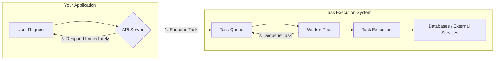

### Target Audience
- **Distributed Systems Engineers** building task processing infrastructure
- **Backend Engineers** implementing background job systems
- **Platform Engineers** designing scalable workflow orchestration
- **Technical Leaders** making architectural decisions for async processing

### Key Principles
- **Reliability**: Tasks execute exactly once or fail gracefully. We never want to lose a task or process a payment twice.
- **Scalability**: Systems handle increasing load through horizontal scaling. As more tasks come in, we can simply add more workers.
- **Observability**: Complete visibility into task execution and system health. We need to know what's happening, where tasks are, and why they might be failing.
- **Resilience**: Graceful handling of failures and recovery mechanisms. The system must withstand worker crashes, network issues, and service outages.

---

## Foundation Patterns

### 1. Task Lifecycle Management

#### Introduction
The task lifecycle is the complete journey a task takes from its creation to its final resolution, whether that's success or failure. Understanding and explicitly defining this lifecycle is the most fundamental pattern in any task queue system. It provides a predictable state machine that governs every piece of work, ensuring no task is ever lost or forgotten.

#### Analogy
Think of it as a package delivery service.
1.  **Pending:** You've printed the shipping label and packed the box. It's sitting by your door, waiting to be picked up.
2.  **Processing:** The delivery driver has picked up the package and it's now in their truck, on its way to the destination.
3.  **Completed:** The package has been successfully delivered to the recipient's doorstep.
4.  **Failed:** The delivery address was invalid and after several attempts, the package is sent to the "dead letter" office for manual handling. If the truck gets a flat tire (a transient error), the driver fixes it and retries the delivery.

#### Use Cases
- **User-facing actions:** Sending a welcome email after sign-up. The user gets an immediate response, while the email is sent in the background.
- **Long-running computations:** Generating a complex monthly analytics report for a user.
- **Media processing:** Transcoding a user-uploaded video into different resolutions.
- **Third-party integrations:** Calling an external API that might be slow or unreliable.

#### Mermaid Diagrams
**Task State Machine:**
This diagram shows the possible states a task can be in and the events that cause it to transition between them.
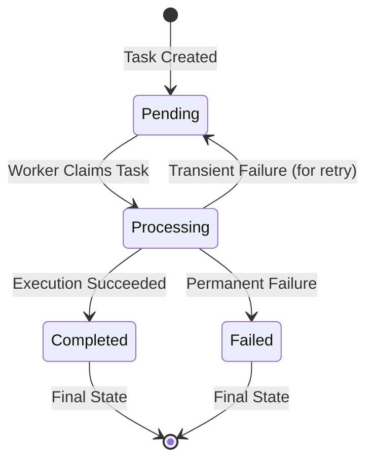

#### Explanation
The lifecycle consists of several key states and the guarantees provided at each transition.
- **Pending:** The initial state. The task is safely stored in the queue, waiting for an available worker.
- **Processing:** A worker has atomically "claimed" the task. This transition is critical; it must guarantee that only one worker can claim a given task. This is often achieved with database-level locking (`SELECT ... FOR UPDATE SKIP LOCKED`) or features of a message broker.
- **Completed:** The task was executed successfully. The worker signals completion, and the task is permanently removed from the active queue.
- **Failed:** The task could not be completed, even after retries. It is moved to a Dead Letter Queue (DLQ) for manual inspection.
- **Idempotency:** A crucial concept for reliability. Since a worker might crash after completing a task but before acknowledging it, the task may be executed again by another worker. An idempotent task is one where executing it multiple times has the same effect as executing it once. For example, setting a user's status to `active` is idempotent, while incrementing a `login_count` is not.

#### Insights and Tips/Tricks
- **Stateless Workers:** Design your workers to be stateless. All the information they need to process a task should be contained within the task's payload. This makes scaling and recovery much simpler.
- **Idempotency Keys:** The most robust way to ensure idempotency is to include a unique `idempotency_key` in the task payload. Before executing, the worker checks if a task with this key has already been completed. A good key is often a combination of user ID, action, and a unique identifier (e.g., `user-123-charge-order-567`).
- **Use `SKIP LOCKED`:** When using a database like PostgreSQL as a queue, the `FOR UPDATE SKIP LOCKED` clause is a game-changer. It allows multiple workers to poll the `tasks` table concurrently without blocking each other, dramatically improving throughput.

#### Questions and Answers
- **Q: What happens if a worker crashes while a task is in the `processing` state?**
  **A:** The task remains in the `processing` state. A separate "janitor" process or a timeout mechanism is needed to detect these "stuck" tasks (e.g., tasks that have been processing for too long) and move them back to `pending` to be retried.
- **Q: How do I make a non-idempotent operation (like charging a credit card) safe to retry?**
  **A:** You use an idempotency key. Before calling the payment provider, you check your own database to see if you have already processed a payment for `idempotency_key: "order-123-payment"`. If you have, you skip the API call and return the stored result. If not, you make the call and then store the result along with the key.

#### Implementation (Python / PostgreSQL)
**1. PostgreSQL Table Schema:**
```sql
-- tasks.sql
CREATE TABLE tasks (
    id UUID PRIMARY KEY DEFAULT gen_random_uuid(),
    task_type VARCHAR(100) NOT NULL,
    payload JSONB NOT NULL,
    status VARCHAR(20) NOT NULL DEFAULT 'pending' CHECK (status IN ('pending', 'processing', 'completed', 'failed')),
    priority INTEGER NOT NULL DEFAULT 0,
    retry_count INTEGER NOT NULL DEFAULT 0,
    max_retries INTEGER NOT NULL DEFAULT 3,
    last_error TEXT,
    created_at TIMESTAMPTZ NOT NULL DEFAULT NOW(),
    scheduled_at TIMESTAMPTZ NOT NULL DEFAULT NOW(),
    processing_started_at TIMESTAMPTZ,
    worker_id VARCHAR(100)
);

-- Index for efficient worker polling
CREATE INDEX idx_tasks_for_claiming ON tasks (priority DESC, scheduled_at ASC)
WHERE status = 'pending';
```

**2. Python Code for Enqueuing and Claiming Tasks:**
```python
# task_manager.py
import psycopg2
import psycopg2.extras
import json
import uuid

def enqueue_task(conn, task_type: str, payload: dict, priority: int = 0):
    """Enqueues a new task into the database."""
    with conn.cursor() as cur:
        cur.execute(
            """
            INSERT INTO tasks (id, task_type, payload, priority)
            VALUES (%s, %s, %s, %s)
            RETURNING id;
            """,
            (str(uuid.uuid4()), task_type, json.dumps(payload), priority)
        )
        task_id = cur.fetchone()[0]
        conn.commit()
        return task_id

def claim_next_task(conn, worker_id: str) -> dict | None:
    """Atomically claims the next available task."""
    with conn.cursor(cursor_factory=psycopg2.extras.DictCursor) as cur:
        cur.execute(
            """
            UPDATE tasks
            SET status = 'processing', worker_id = %s, processing_started_at = NOW()
            WHERE id = (
                SELECT id
                FROM tasks
                WHERE status = 'pending' AND scheduled_at <= NOW()
                ORDER BY priority DESC, scheduled_at ASC
                FOR UPDATE SKIP LOCKED
                LIMIT 1
            )
            RETURNING *;
            """,
            (worker_id,)
        )
        task = cur.fetchone()
        conn.commit()
        return dict(task) if task else None
```

#### Related Patterns
- **Advanced Retry & Resilience:** The lifecycle must account for failures, which leads directly to retry strategies.
- **Dead Letter Queue:** The `Failed` state is typically implemented by moving the task to a DLQ.
- **Worker Assignment Strategies:** This pattern defines how a task moves from `Pending` to `Processing`.

---

### 2. Priority-Based Task Scheduling

#### Introduction
Not all background tasks are created equal. A user-initiated password reset is far more urgent than a nightly job to aggregate analytics. Priority-based scheduling is the pattern that allows a system to process high-importance tasks before low-importance ones, ensuring responsiveness for critical operations while still eventually getting to everything else.

#### Analogy
Think of an airport security line.
- **Priority Queue:** There's a separate, shorter line for first-class passengers and frequent flyers (`high-priority` tasks).
- **Normal Queue:** The main line is for everyone else (`normal-priority` tasks).
- **Worker Pool:** The TSA agents are the workers. They are instructed to always take the next person from the priority line if someone is there.
- **Starvation Prevention:** To ensure the main line keeps moving, they might follow a rule like "take four from the priority line, then one from the main line." This prevents the normal-priority passengers from waiting forever.

#### Use Cases
- **High Priority:** Password resets, two-factor authentication code delivery, real-time notifications.
- **Normal Priority:** Sending a receipt email, processing a user's new profile picture.
- **Low Priority:** Generating a weekly analytics report, re-indexing a search database, cleaning up old records.

#### Mermaid Diagrams
**Multi-Queue Architecture:**
This is a common and scalable way to implement priority, with workers polling from queues in a weighted order.
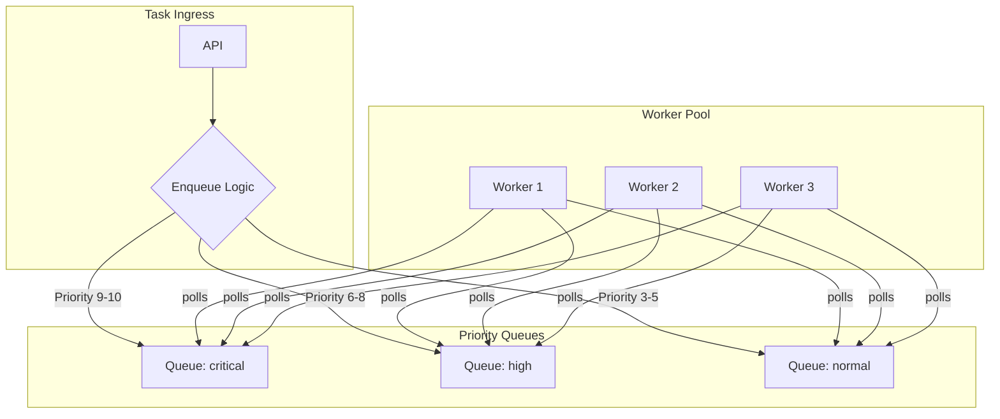

#### Explanation
Implementing priority scheduling involves two key decisions: how to store tasks by priority, and how workers should select them.
1.  **Storage:**
    - **Single Queue with a Priority Field:** The simplest approach. A `priority` column is added to the `tasks` table. Workers query this table, ordering by priority. This is easy to implement but can cause database contention, as all workers are competing for the same set of rows.
    - **Multiple Queues:** A more scalable approach. You create separate tables or use different streams/topics for each priority level (e.g., `tasks_high`, `tasks_normal`). Workers are configured to poll the high-priority queue first and most frequently. This isolates priorities and reduces contention.
2.  **Starvation Prevention:** A major risk with priority queues is "starvation," where low-priority tasks are never processed because there is a constant stream of high-priority tasks. To prevent this, you must implement a fairness mechanism:
    - **Age-based Priority Boosting:** Periodically run a job that finds old, low-priority tasks and increases their priority.
    - **Weighted Polling:** Workers don't just poll the highest priority queue. They might check the `critical` queue 70% of the time, the `high` queue 20% of the time, and the `normal` queue 10% of the time.

#### Insights and Tips/Tricks
- **Limit Priority Levels:** Avoid having too many priority levels (e.g., 1-100). This often leads to "priority inflation" where every new task is marked as the highest priority. A small number of distinct levels (e.g., `critical`, `high`, `default`, `low`) is usually more effective and easier to reason about.
- **Priority is a Scarce Resource:** Treat priority as a feature that requires justification. Not every task should be high priority. Establish clear guidelines for your development team on when to use different priority levels.
- **Monitor Queue Latency per Priority:** Track the average time a task spends in the `pending` state for each priority level. If your low-priority tasks have a latency of several days, your starvation prevention mechanism isn't working.

#### Questions and Answers
- **Q: What's the main drawback of the single-queue approach?**
  **A:** Performance at scale. Every worker polling for a job will run a query like `SELECT ... ORDER BY priority DESC ...`. This can be slow on very large tables and lead to lock contention, even with `SKIP LOCKED`. The multi-queue approach physically separates the work, leading to less contention.
- **Q: How does age-based priority boosting work in practice?**
  **A:** You run a scheduled background job (e.g., every hour) that executes a SQL query like: `UPDATE tasks SET priority = priority + 1 WHERE status = 'pending' AND created_at < NOW() - INTERVAL '1 hour' AND priority < 10;`. This ensures that tasks that have been waiting for a long time get a "nudge" up the priority ladder.

#### Implementation (Python / PostgreSQL)
**1. Modified `claim_next_task` Function:**
The `claim_next_task` function from the previous section already supports priority by including `ORDER BY priority DESC` in its query. No changes are needed there.

**2. Python Script for Age-Based Priority Boosting:**
This script would be run on a schedule (e.g., via a cron job or a scheduler service).
```python
# priority_booster.py
import psycopg2
import time

def boost_task_priorities(conn):
    """Finds old, low-priority tasks and increases their priority."""
    print("Running priority booster...")
    with conn.cursor() as cur:
        # Boost tasks older than 1 hour that are not already at max priority
        cur.execute(
            """
            UPDATE tasks
            SET priority = LEAST(priority + 1, 10) -- Increment priority, cap at 10
            WHERE status = 'pending'
              AND priority < 10
              AND scheduled_at < NOW() - INTERVAL '1 hour';
            """
        )
        updated_count = cur.rowcount
        conn.commit()
        print(f"Boosted priority for {updated_count} tasks.")

if __name__ == "__main__":
    # In a real app, get connection details from config
    conn = psycopg2.connect(dsn="dbname=tasks_db user=user password=pass host=localhost")
    try:
        boost_task_priorities(conn)
    finally:
        conn.close()
```

#### Related Patterns
- **Task Lifecycle Management:** Priority is an attribute of a task within its lifecycle.
- **Worker Management & Scaling:** You might configure auto-scaling to be more aggressive for high-priority queues. If the `critical` queue depth exceeds a small threshold, you might want to scale up workers immediately.
- **Metrics & Monitoring:** It's essential to monitor queue depth and task wait times *per priority level*.

---

### 3. Worker Assignment Strategies

#### Introduction
Worker assignment is the mechanism that matches a pending task with an available worker. This choice fundamentally impacts the system's latency, complexity, and resilience. The two primary models are the "pull" model, where workers ask for work, and the "push" model, where a central dispatcher assigns work.

#### Analogy
Imagine a food court.
- **Pull Model (Polling):** This is like a customer (worker) walking up to a restaurant counter (queue) and asking, "What's ready?" If there's food, they take it. If not, they wait a bit and ask again. The customer is in control.
- **Push Model (Event-Driven):** This is like getting a pager when you order. When your food (task) is ready, the central kitchen (dispatcher) buzzes your pager, telling you specifically to come and get it. The kitchen is in control of the assignment.

#### Use Cases
- **Pull Model:** The default choice for most systems. It's simple, robust, and scales well. Perfect for general-purpose background jobs like sending emails, processing images, etc.
- **Push Model:** Best for systems requiring very low latency, where the sub-second delay of a polling interval is unacceptable. Examples include real-time notifications, financial transaction processing, or interactive systems.
- **Hybrid Model:** Used in very sophisticated systems that need the low latency of push but the resilience of pull. A dispatcher tries to push a task, but if the worker is unresponsive, the task remains in the queue for another worker to pull later.

#### Mermaid Diagrams
**Comparison of Pull vs. Push Models:**
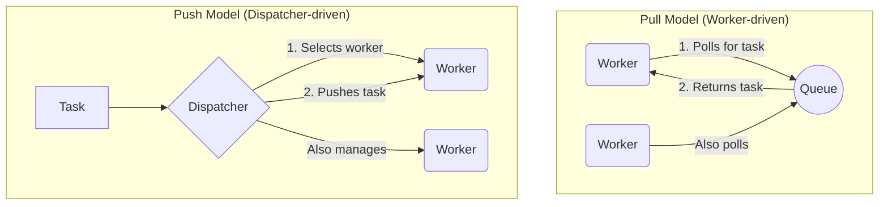

#### Explanation
- **Pull Model (Polling):**
  - **Mechanism:** Workers are in a loop, periodically asking the queue for a job. If they get one, they process it. If not, they wait for a configured interval (the "poll interval") and try again.
  - **Pros:** Simple to implement and reason about. Workers manage their own load. It's inherently load-balancing, as a busy worker won't be polling for more work. It's also very resilient; if a worker dies, the system doesn't care, and another worker will eventually pick up its tasks.
  - **Cons:** Can introduce latency (the task must wait for the next poll). Can cause unnecessary load on the queue/database if many idle workers are polling frequently.

- **Push Model (Event-Driven):**
  - **Mechanism:** A central component (a "dispatcher" or "scheduler") listens for new tasks. It also maintains a registry of available workers and their current load. When a new task arrives, the dispatcher selects a suitable worker and pushes the task directly to it.
  - **Pros:** Very low latency, as tasks are assigned immediately. More efficient, as there is no idle polling.
  - **Cons:** Much higher complexity. The dispatcher is a single point of failure and a potential bottleneck. It must track worker health and availability, which is a hard problem in distributed systems.

#### Insights and Tips/Tricks
- **Start with Pull:** For over 95% of use cases, the pull model is the right choice. Its simplicity and robustness are huge advantages. Only consider a push model if you have a strict low-latency requirement that cannot be met by tuning the pull model's poll interval.
- **Adaptive Polling:** To mitigate the cons of the pull model, implement adaptive polling. When a worker gets a task, it should immediately poll again, assuming there might be more. When the queue is empty, the worker should exponentially increase its wait time between polls (e.g., 1s, 2s, 4s, up to a max of 30s) to reduce load.
- **Batch Claiming:** Instead of `LIMIT 1`, a worker can try to claim `LIMIT 10` tasks in a single query. This reduces the number of round trips to the database and can significantly improve throughput for systems with many small, fast tasks.

#### Questions and Answers
- **Q: How does the push model handle a worker crashing?**
  **A:** This is its main challenge. The dispatcher needs a reliable health-checking mechanism (like heartbeats or lease-based registration). If a worker is marked as dead, the dispatcher must be able to reclaim any tasks that were assigned to it but not completed and re-assign them to another worker. This adds significant complexity.
- **Q: Can't I just set the poll interval to a very low value, like 100ms, to get low latency with the pull model?**
  **A:** You can, but it comes at a cost. If you have hundreds of workers all polling the database every 100ms, you will generate a huge amount of load, which can impact database performance for your entire application. Adaptive polling is a much better solution.

#### Implementation (Python / PostgreSQL)
This example shows a Python worker implementing an adaptive polling loop. It uses the `claim_next_task` function defined earlier.
```python
# worker.py
import psycopg2
import time
import random
import os

from task_manager import claim_next_task

# In a real app, these would come from a config file
DB_DSN = "dbname=tasks_db user=user password=pass host=localhost"
WORKER_ID = f"worker-{os.getpid()}"
MIN_POLL_INTERVAL_S = 0.5
MAX_POLL_INTERVAL_S = 16

def process_task(task: dict):
    """Placeholder for actual task processing logic."""
    print(f"[{WORKER_ID}] Processing task {task['id']} of type {task['task_type']}...")
    # Simulate work
    time.sleep(random.uniform(1, 5))
    print(f"[{WORKER_ID}] Finished task {task['id']}.")
    # In a real worker, you would update the task status to 'completed' or 'failed' here.

def main():
    """Main worker loop with adaptive polling."""
    conn = psycopg2.connect(dsn=DB_DSN)
    poll_interval = MIN_POLL_INTERVAL_S
    print(f"[{WORKER_ID}] Worker started. Polling for tasks...")

    while True:
        try:
            task = claim_next_task(conn, WORKER_ID)

            if task:
                # If we found a task, process it and reset the poll interval to the minimum.
                # This ensures we immediately check for more work.
                process_task(task)
                poll_interval = MIN_POLL_INTERVAL_S
            else:
                # If no task was found, wait for the current poll interval.
                print(f"[{WORKER_ID}] No tasks found. Sleeping for {poll_interval:.2f}s.")
                time.sleep(poll_interval)
                # Then, increase the interval for the next cycle (exponential backoff).
                poll_interval = min(poll_interval * 2, MAX_POLL_INTERVAL_S)

        except (psycopg2.InterfaceError, psycopg2.OperationalError):
            # Handle database connection errors
            print("Database connection lost. Reconnecting...")
            time.sleep(5)
            conn.close()
            conn = psycopg2.connect(dsn=DB_DSN)
        except Exception as e:
            print(f"An unexpected error occurred: {e}")
            time.sleep(5) # Wait before retrying

if __name__ == "__main__":
    main()
```

#### Related Patterns
- **Worker Pool Management:** The collection of workers using an assignment strategy forms a pool that needs to be managed.
- **Health Check Strategies:** Essential for both push and pull models to detect and handle dead workers.
- **Load Balancing:** In a push model, the dispatcher *is* the load balancer. In a pull model, the act of polling itself is a form of decentralized load balancing.

---

## Advanced Retry & Resilience

### 1. Comprehensive Retry Strategies

#### Introduction
In any distributed system, failures are not an exception; they are a certainty. Networks will drop packets, services will become temporarily unavailable, and databases will experience deadlocks. A comprehensive retry strategy is the first line of defense against these transient failures. This pattern defines the logic for automatically re-attempting a failed operation, with the goal of eventually succeeding without overwhelming the failing service or wasting system resources. The most effective and widely used of these strategies is Exponential Backoff with Jitter.

#### Analogy
Imagine you're calling a friend, but their line is busy.
- **Fixed Retry:** You hang up and immediately redial every 10 seconds. This is annoying and might jam their line if they become free for just a moment.
- **Linear Retry:** You wait 10 seconds, then 20, then 30. This is better, but still predictable.
- **Exponential Backoff:** You wait 10 seconds, then 20, then 40, then 80. You're giving your friend increasingly more time to finish their call. This is the core of a smart retry strategy.
- **Jitter:** Now, imagine you and another mutual friend are both trying to call at the same time. If you both use the same exponential backoff, you'll dial at the exact same moments (10s, 20s, 40s), creating a "thundering herd" that jams the line. Jitter adds a small, random amount of time to each wait (e.g., waiting 18-22 seconds instead of exactly 20). This staggers the retry attempts, making it much more likely one of you will get through.

#### Use Cases
- **External API Calls:** Calling a third-party service that has rate limits or occasional instability.
- **Network Flakiness:** Handling temporary connection drops between microservices or between a worker and the database.
- **Resource Contention:** Recovering from database deadlocks, where retrying the transaction after a short delay will likely succeed.
- **Temporary Service Outages:** Handling `503 Service Unavailable` errors from a dependency that is restarting or deploying.

#### Mermaid Diagrams
**Delay Growth Comparison:**
This diagram shows how the delay between retries grows for different strategies. Exponential growth is clearly more conservative and safer for stressed systems.
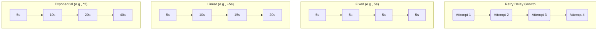

**The "Thundering Herd" Problem and Jitter's Solution:**
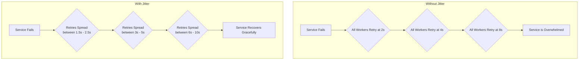

#### Explanation
The core of this pattern is a simple formula applied when a retryable error occurs:

`next_delay = min(max_delay, base_delay * (multiplier ** retry_attempt))`

- **`base_delay`**: The initial wait time (e.g., 1 second).
- **`multiplier`**: The factor by which the delay increases (e.g., 2).
- **`retry_attempt`**: The number of times this task has been retried.
- **`max_delay`**: A ceiling to prevent the delay from becoming absurdly long (e.g., 1 hour).

**Jitter** is then applied to this calculated delay. A common and effective method is "full jitter":

`final_delay = random_uniform(0, next_delay)`

This spreads the retries evenly across the time window, providing the best defense against the thundering herd problem. A task is only retried a configured number of times (`max_retries`). If it still fails, it's considered permanently failed.

#### Insights and Tips/Tricks
- **Configure per Task Type:** The ideal retry policy depends on what the task is doing. A task calling an internal, high-performance service can have a more aggressive retry policy (shorter delays, more retries) than a task calling a fragile, external legacy system.
- **Respect `Retry-After` Headers:** If a service responds with a `429 Too Many Requests` status and a `Retry-After` header, your retry logic should *always* respect that header's value. It's a direct instruction from the service on how to behave.
- **Log on Retries, Alert on Final Failure:** Log a warning every time a task is retried. This is useful for spotting flapping services. However, only fire a high-severity alert when a task has exhausted all its retries and is moved to the Dead Letter Queue.

#### Questions and Answers
- **Q: When is a simple fixed retry good enough?**
  **A:** Almost never for a distributed system. It's only acceptable if you have exactly one worker process and are calling a service that you know recovers in a fixed amount of time. In all other cases, the risk of synchronized retries makes it a dangerous choice.
- **Q: How do I decide the `max_retries` and `max_delay`?**
  **A:** This is a business decision based on your Service Level Objectives (SLOs). Ask: "What is the maximum amount of time this task is allowed to be delayed before it's considered a business failure?" For a password reset, it might be 5 minutes. For a report generation, it could be 24 hours. Work backward from that to set your `max_retries` and `max_delay`.

#### Implementation (Python / PostgreSQL)
**1. PostgreSQL Table Modification:**
We need to add columns to our `tasks` table to track retry state.
```sql
-- alter_tasks_for_retry.sql
ALTER TABLE tasks ADD COLUMN last_error TEXT;

-- We already have retry_count, max_retries, and scheduled_at, which are perfect for this.
```

**2. Python Worker Logic for Retrying a Task:**
This function is called when a task handler raises a specific, retryable exception.
```python
# retry_logic.py
import psycopg2
import time
import random
from datetime import datetime, timedelta

# A custom exception to signal that a task should be retried.
class RetryableError(Exception):
    pass

def handle_retry(conn, task: dict, error: Exception):
    """
    Updates a task in the database to be retried later using exponential backoff.
    """
    retry_count = task['retry_count'] + 1
    
    if retry_count > task['max_retries']:
        print(f"Task {task['id']} has exceeded max retries. Moving to failed state.")
        # In a real system, you'd move this to a DLQ.
        # For now, we just mark it as 'failed'.
        with conn.cursor() as cur:
            cur.execute(
                "UPDATE tasks SET status = 'failed', last_error = %s WHERE id = %s",
                (str(error), task['id'])
            )
        conn.commit()
        return

    # --- Exponential Backoff with Full Jitter Calculation ---
    base_delay_seconds = 2  # Start with 2 seconds
    max_delay_seconds = 3600  # Cap at 1 hour
    
    # Calculate the exponential delay
    backoff_delay = min(max_delay_seconds, base_delay_seconds * (2 ** task['retry_count']))
    
    # Apply full jitter
    jittered_delay_seconds = random.uniform(0, backoff_delay)
    
    next_scheduled_at = datetime.utcnow() + timedelta(seconds=jittered_delay_seconds)
    
    print(f"Task {task['id']} failed. Retrying in {jittered_delay_seconds:.2f} seconds.")
    
    with conn.cursor() as cur:
        cur.execute(
            """
            UPDATE tasks
            SET status = 'pending',
                retry_count = %s,
                last_error = %s,
                scheduled_at = %s,
                -- Clear worker state for the next attempt
                worker_id = NULL,
                processing_started_at = NULL
            WHERE id = %s;
            """,
            (retry_count, str(error), next_scheduled_at, task['id'])
        )
    conn.commit()

# --- Example Usage in a Worker ---
# def my_task_handler(payload):
#     if some_condition:
#         raise RetryableError("External service is temporarily down.")
#
# try:
#     my_task_handler(task['payload'])
# except RetryableError as e:
#     handle_retry(conn, task, e)
```

#### Related Patterns
- **Error Classification & Handling:** This is a prerequisite. You must classify an error as "transient" before applying a retry strategy.
- **Circuit Breaker:** If retries for a service consistently fail, the circuit breaker acts as a master switch to stop all attempts, protecting the wider system.
- **Dead Letter Queue:** This is the end of the line for a task that has exhausted all its retries.

---

### 2. Circuit Breaker Pattern

#### Introduction
The Circuit Breaker is a critical resilience pattern that prevents an application from repeatedly trying to execute an operation that is likely to fail. While retries are useful for isolated, transient failures, a circuit breaker is designed to handle broader, more sustained outages in a dependency. It acts as a proxy for operations that are prone to failure, monitoring them and tripping to "fail fast" if the failure rate becomes too high. This prevents cascading failures and gives a struggling downstream service time to recover.

#### Analogy
It's exactly like an electrical circuit breaker in your home's fuse box.
1.  **Closed State:** The breaker is on, and electricity is flowing normally to your outlets. Your application is making requests to the dependency.
2.  **Open State:** You plug in a faulty toaster that shorts out. To prevent a fire, the breaker trips, cutting off power to the entire circuit. When your dependency starts failing repeatedly, the software circuit breaker "trips" and immediately rejects all further requests with an error, without even trying to contact the dependency.
3.  **Half-Open State:** After a few minutes, you go to the fuse box and flip the breaker back on. This is a test. If the toaster immediately shorts out again, the breaker re-trips. If it works, the breaker stays on. The software circuit breaker, after a timeout, allows one "trial" request to go through. If it succeeds, the breaker closes and returns to normal. If it fails, the breaker re-opens, starting the timeout again.

#### Use Cases
- **Wrapping API calls to a critical third-party service:** If a payment gateway goes down, you don't want every checkout request to hang for 30 seconds before timing out. The circuit breaker would trip, failing them instantly and showing users a "payment service is down" message.
- **Protecting a database:** If a new code deployment introduces a toxic query that overloads the database, a circuit breaker around database calls can trip, preventing the entire application from crashing.
- **Inter-service communication in a microservices architecture:** To isolate failures and prevent one misbehaving service from bringing down its upstream callers.

#### Mermaid Diagrams
**The State Machine of a Circuit Breaker:**
```mermaid
stateDiagram-v2
    direction LR
    
    [*] --> Closed: Initial State
    
    state Closed {
        note right of Closed
            Requests are executed.
            Successes reset failure count.
            Failures increment failure count.
        end note
        Closed --> Open: Failure threshold exceeded
    }
    
    state Open {
        note right of Open
            Requests fail immediately.
            A recovery timer is running.
        end note
        Open --> HalfOpen: Recovery timeout expires
    }

    state HalfOpen {
        note right of HalfOpen
            A limited number of "trial"
            requests are allowed through.
        end note
        HalfOpen --> Closed: Trial request succeeds
        HalfOpen --> Open: Trial request fails
    }
```

#### Explanation
A circuit breaker is a stateful object that wraps a function call. It operates in three states:
- **`CLOSED`:** The default state. The circuit breaker executes the wrapped operation and monitors for failures. It maintains a failure counter. If a call succeeds, the counter is reset. If it fails, the counter is incremented. When the counter exceeds a configured `failure_threshold`, the breaker "trips" and moves to the `OPEN` state.
- **`OPEN`:** In this state, the circuit breaker does not execute the wrapped operation at all. It immediately returns an error. It stays in this state for a configured `recovery_timeout` (e.g., 30 seconds). This is the "cooling-off" period.
- **`HALF_OPEN`:** After the recovery timeout expires, the breaker moves to `HALF_OPEN`. In this state, it will allow the *next* operation to go through. If this "trial" operation succeeds, the breaker assumes the dependency has recovered and moves back to `CLOSED`. If the trial operation fails, the breaker immediately re-trips and moves back to `OPEN`, starting the recovery timeout again.

#### Insights and Tips/Tricks
- **Per-Instance State:** A circuit breaker's state should be local to each worker instance. A global circuit breaker is an anti-pattern because one unhealthy worker could trip the breaker for the entire fleet, causing a self-inflicted outage.
- **Expose State as a Metric:** Your monitoring system should track the state of every circuit breaker. An alert on `circuit_breaker_state == 'OPEN'` is one of the most valuable alerts you can have, as it points directly to a failing dependency.
- **Combine with Fallbacks:** Don't just fail when a circuit is open. If possible, provide a fallback behavior. For example, if the circuit for a live recommendation service is open, fall back to showing generic, popular recommendations from a cache.
- **Don't Wrap Trivial Operations:** Circuit breakers add a small amount of overhead. Don't wrap operations that are in-memory or are guaranteed to be highly available. Reserve them for network calls or other I/O that can realistically fail.

#### Questions and Answers
- **Q: How is this different from just retrying?**
  **A:** They solve different problems. Retries are for *recovering* from a failure. A circuit breaker is for *preventing* future failures when a pattern of failure has been detected. A retry is optimistic ("maybe it will work this time"). A circuit breaker is pessimistic ("it's probably going to fail, so I won't even try"). They are often used together: an operation might be retried a couple of times, but each failure is still reported to the circuit breaker.
- **Q: What happens if the trial request in the `HALF_OPEN` state is very slow?**
  **A:** This is why circuit breakers should also have a timeout on the operations they wrap. If the trial request hangs, it should be considered a failure, and the breaker should re-open. This prevents a slow dependency from locking up your worker.

#### Implementation (Python / PostgreSQL)
A circuit breaker's state is ephemeral and high-frequency, so it's a poor fit for a primary PostgreSQL database. It's best implemented in memory within the worker process. For this, we'll use the popular `pybreaker` library.

**1. PostgreSQL Schema:**
No changes are needed in the database. The circuit breaker is a worker-side pattern.

**2. Python Worker with Circuit Breaker:**
```python
# worker_with_breaker.py
import psycopg2
import time
import random
from pybreaker import CircuitBreaker, CircuitBreakerError

# This breaker will trip if there are 5 failures in a row.
# It will stay open for 30 seconds before moving to half-open.
api_breaker = CircuitBreaker(fail_max=5, reset_timeout=30)

def call_unreliable_api(payload: dict):
    """A placeholder for a function that makes a network call."""
    print("Attempting to call the external API...")
    # Simulate a flaky API
    if random.random() < 0.5: # 50% chance of failure
        raise ConnectionError("API service is unavailable")
    print("API call successful.")
    return {"status": "ok"}

@api_breaker
def protected_api_call(payload: dict):
    """
    This function is now protected by the circuit breaker.
    The @api_breaker decorator wraps the function call.
    """
    return call_unreliable_api(payload)

def task_handler(task: dict):
    """The main handler for a task that needs to call the API."""
    print(f"\nProcessing task {task['id']}. Current breaker state: {api_breaker.current_state}")
    try:
        result = protected_api_call(task['payload'])
        print(f"Task {task['id']} completed successfully with result: {result}")
        # Mark task as 'completed' in DB
    except CircuitBreakerError:
        # The breaker is OPEN. The call wasn't even attempted.
        print(f"Task {task['id']} failed because circuit is open. Re-scheduling task.")
        # Re-schedule the task for later, don't count it as a normal retry.
        # This gives the dependency time to recover.
    except ConnectionError as e:
        # The breaker was CLOSED or HALF_OPEN, but the call failed.
        print(f"Task {task['id']} failed with an error: {e}. This failure was recorded by the breaker.")
        # Here you would trigger the normal retry logic (e.g., handle_retry).
        
if __name__ == "__main__":
    # Simulate running some tasks
    for i in range(15):
        task_handler({'id': i, 'payload': {}})
        time.sleep(1)
```

#### Related Patterns
- **Comprehensive Retry Strategies:** The failures counted by the circuit breaker are often the result of an operation that has already exhausted its own internal retries.
- **Health Check Strategies:** A sophisticated system can use active health checks to proactively open or close a circuit, rather than waiting for requests to fail.
- **Monitoring & Alerting:** The state of a circuit breaker is a primary metric that should be monitored and used to trigger alerts.

---

### 3. Error Classification & Handling

#### Introduction
A mature task processing system does not treat all errors equally. Blindly retrying every failure is inefficient and can hide serious bugs. Error classification is the pattern of inspecting a caught error to determine its nature—is it temporary? Is it a user mistake? Is it a bug in our code?—and then routing it to the appropriate handling logic. This intelligent routing is the key to building a resilient, efficient, and debuggable system.

#### Analogy
Think of a hospital's emergency room triage.
- **Patient Arrives (Error Occurs):** A patient comes in with an ailment.
- **Triage Nurse (Error Classifier):** The nurse doesn't immediately send them to surgery. They assess the situation.
  - **`TRANSIENT` Error:** A minor cut. The nurse sends them to a treatment room to be patched up and sent home (retry with backoff).
  - **`PERMANENT` Error:** The patient forgot their ID and insurance card. There's nothing the hospital can do. They are sent home to retrieve their documents (fail immediately, no retry).
  - **`UNKNOWN` Error:** The patient has mysterious symptoms. They are sent for further diagnosis (retry conservatively, but alert a senior doctor/developer).

#### Use Cases
- **Differentiating User Errors from System Errors:** An "Invalid API Key" (permanent error) should fail immediately, while a "Service Unavailable" (transient error) should be retried.
- **Optimizing Retry Logic:** Avoiding retries for errors that will never succeed saves time and resources, allowing workers to move on to valid tasks.
- **Improving Debuggability:** Classifying an error like `NullPointerException` as a "Permanent Code Bug" and routing it directly to a DLQ with an alert makes finding and fixing bugs much faster.
- **Handling Rate Limits:** Specifically identifying `429 Too Many Requests` errors allows the system to use a specific rate-limit handling strategy instead of a generic retry.

#### Mermaid Diagrams
**Error Handling Flowchart:**
This diagram shows how an error is classified and then routed to different handling strategies.
```mermaid
graph TD
    A[Task Execution Fails] --> B{Error Classifier};
    
    B -->|Transient (e.g., 503, Timeout)| C[Retry with Exponential Backoff];
    B -->|Permanent (e.g., 400, 403)| D[Fail Immediately];
    B -->|Rate Limit (e.g., 429)| E[Retry with `Retry-After` Header];
    B -->|Code Bug (e.g., Null Pointer)| F[Fail Immediately & Alert];

    C --> G{Retry Limit Reached?};
    G -->|No| H[Reschedule Task];
    G -->|Yes| I[Move to DLQ];

    D --> I;
    E --> H;
    F --> I;
```

#### Explanation
The core of this pattern is a function or class, the "Error Classifier," that takes an exception object as input and returns a category. The classification logic can be based on several factors:
- **Exception Type:** `isinstance(error, psycopg2.OperationalError)` often indicates a transient network issue. `isinstance(error, KeyError)` is a permanent code bug.
- **HTTP Status Codes:** If the error comes from an API call, the HTTP status code is a rich source of information. `5xx` codes are typically transient, while `4xx` codes are permanent.
- **Error Message Content:** As a last resort, you can inspect the error message string for keywords (e.g., `if "rate limit exceeded" in str(error)`).

Once the error is categorized, a `switch` statement or dictionary lookup determines the correct `RetryStrategy` or `FailureHandler` to invoke.

#### Insights and Tips/Tricks
- **Start with a Default:** Your classifier should have a default category, like `UNKNOWN`. The policy for `UNKNOWN` errors should be conservative: retry a small number of times with a short delay. This prevents an unexpected error from being retried forever but gives you a chance to recover if it was transient.
- **Make the Classifier Data-Driven:** Instead of a giant `if/elif/else` block, define your classification rules in a configuration file (YAML, JSON) or a database table. This allows you to update the logic without deploying new code.
- **Log Unclassified Errors:** Whenever an error is categorized as `UNKNOWN`, log it with high visibility. This is a signal that your classifier needs to be updated to handle a new type of failure.
- **Centralize Classification Logic:** Don't let every task handler implement its own error classification. Create a single, shared classifier that all workers use. This ensures consistent behavior across the system.

#### Questions and Answers
- **Q: Isn't inspecting error messages by string matching brittle?**
  **A:** Yes, it is the most brittle method and should be a last resort. It's always better to rely on specific exception types or status codes. However, sometimes you have to integrate with poorly designed libraries or APIs that don't provide structured errors, leaving you no other choice. If you must do it, make your string matching as specific as possible.
- **Q: Where does the classifier run?**
  **A:** It runs inside the worker process, within the `catch` block of the main task execution loop. The worker attempts to run the task, and if an exception occurs, it passes the exception object to the classifier to decide what to do next.

#### Implementation (Python / PostgreSQL)
**1. PostgreSQL Schema:**
No changes are needed in the database. This is a worker-side logic pattern.

**2. Python Error Classifier Implementation:**
```python
# error_classifier.py
from enum import Enum, auto
import psycopg2

class ErrorCategory(Enum):
    TRANSIENT_NETWORK = auto()
    TRANSIENT_DATABASE = auto()
    PERMANENT_INPUT = auto()
    PERMANENT_CODE_BUG = auto()
    UNKNOWN = auto()

class MyCustomError(Exception):
    """An example of a custom application error."""
    pass

def classify_error(error: Exception) -> ErrorCategory:
    """
    Inspects an exception and returns a category.
    """
    if isinstance(error, psycopg2.OperationalError):
        # Errors like connection failures are transient network issues.
        return ErrorCategory.TRANSIENT_NETWORK
    
    if isinstance(error, psycopg2.IntegrityError):
        # e.g., unique constraint violation. This is likely a permanent data issue.
        return ErrorCategory.PERMANENT_INPUT
        
    if isinstance(error, (KeyError, TypeError, AttributeError, ValueError)):
        # These are common bugs in Python code. Retrying won't help.
        return ErrorCategory.PERMANENT_CODE_BUG

    if isinstance(error, MyCustomError):
        # Handle our own application errors.
        return ErrorCategory.PERMANENT_INPUT
        
    # Default case for anything we don't recognize.
    return ErrorCategory.UNKNOWN

# --- Example Usage in a Worker ---
# from retry_logic import handle_retry, RetryableError
#
# def task_handler(task):
#     try:
#         # ... do work ...
#     except Exception as e:
#         category = classify_error(e)
#         print(f"Caught error '{e}', classified as {category.name}")
#
#         if category in (ErrorCategory.TRANSIENT_NETWORK, ErrorCategory.TRANSIENT_DATABASE):
#             # For transient errors, use the retry handler
#             handle_retry(conn, task, e)
#         elif category in (ErrorCategory.PERMANENT_INPUT, ErrorCategory.PERMANENT_CODE_BUG):
#             # For permanent errors, fail fast and move to DLQ
#             move_to_dlq(conn, task, e)
#         else: # UNKNOWN
#             # Be conservative: retry once or twice, then fail.
#             handle_retry(conn, task, e) # Assuming handle_retry respects max_retries
```

#### Related Patterns
- **Comprehensive Retry Strategies:** The output of the classifier is the input to the retry strategy.
- **Dead Letter Queue:** The ultimate destination for errors classified as `PERMANENT`.
- **Monitoring & Alerting:** You should create metrics and dashboards broken down by error category. A spike in `PERMANENT_CODE_BUG` errors after a deployment is a critical alert.

---

### 4. Dead Letter Queue Patterns

#### Introduction
A Dead Letter Queue (DLQ), sometimes called a "failed jobs" queue, is a critical safety net in any robust task processing system. It is a dedicated queue where tasks are sent when they have been deemed permanently undeliverable to their original destination. This prevents "poison messages"—malformed or unprocessable tasks—from getting stuck in an endless retry loop, which would block all subsequent tasks and grind the system to a halt. The DLQ isolates these failed tasks for later analysis, debugging, and manual intervention.

#### Analogy
Think of the postal service's "dead letter office."
- **Normal Mail (Tasks):** Most letters are delivered successfully.
- **Return to Sender (Retries):** If the address is slightly wrong, the mail carrier might try again the next day.
- **Dead Letter Office (DLQ):** If a letter has an impossible address (e.g., "123 Main Street, Wonderland"), is damaged, or has insufficient postage, it can't be delivered or returned. Instead of being thrown away, it's sent to the dead letter office. There, postal workers (developers/ops) can open it, try to figure out what went wrong, and decide whether to attempt a manual redelivery, return it, or archive it.

#### Use Cases
- **Isolating Poison Messages:** A task with a malformed payload that causes the worker to crash on deserialization. Without a DLQ, this task would be retried and crash the worker indefinitely.
- **Auditing and Debugging:** Providing a central place to inspect all tasks that failed, complete with the original payload and the final error message. This is invaluable for debugging.
- **Manual Intervention and Replay:** Allowing an operator to inspect a failed task, potentially fix the underlying issue (e.g., a misconfigured user account), and then manually re-enqueue the task to be processed again.
- **Compliance:** For some industries, it's a requirement to never "lose" a message, even if it fails. The DLQ serves as a durable store for these failures.

#### Mermaid Diagrams
**The Flow of a Task to the DLQ:**
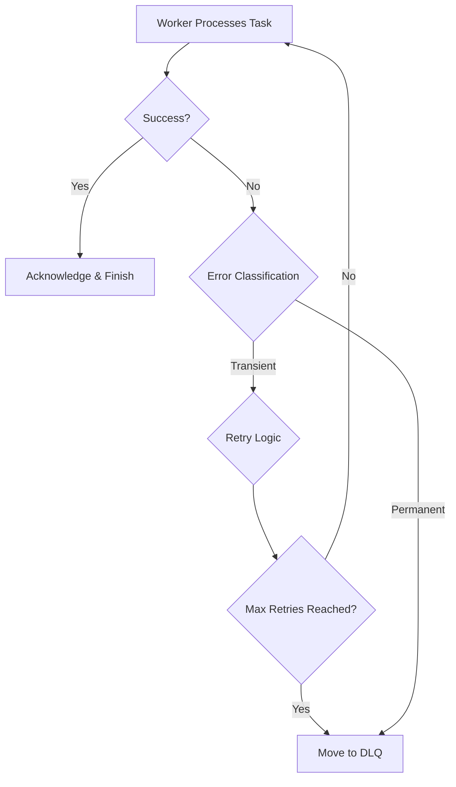
**DLQ Analysis and Replay Workflow:**
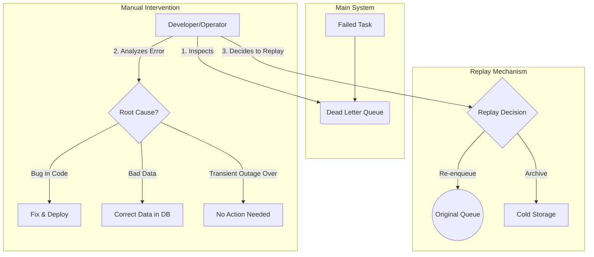

#### Explanation
A DLQ is more than just another queue; it's a system for handling failures gracefully.
1.  **Entry:** A task is moved to the DLQ under two conditions:
    *   It failed with a `PERMANENT` error.
    *   It failed with a `TRANSIENT` error but has exhausted its `max_retries`.
2.  **Enrichment:** When moving a task to the DLQ, the system should enrich it with as much context as possible: the full stack trace of the final error, the ID of the worker that failed, a timestamp, and a history of the previous retry attempts.
3.  **Storage:** The DLQ itself is typically a separate database table (e.g., `dead_letter_tasks`) that is not actively polled by workers. This prevents failed jobs from interfering with the main processing flow.
4.  **Tooling:** A production-ready system needs a UI or CLI tool to interact with the DLQ. This tool should allow operators to list, search, inspect, delete, and re-enqueue failed tasks.

#### Insights and Tips/Tricks
- **Create a Separate DLQ per Queue:** If you use multiple queues for different priorities or task types, create a corresponding DLQ for each one. This prevents a flood of failed low-priority tasks from burying a single critical failed task that needs immediate attention.
- **Alert on DLQ Entries:** An entry arriving in the DLQ is a high-signal event that something has gone wrong. Configure alerts to notify the responsible team immediately. The alert should include the task type and error message.
- **Automate Replays for Known Issues:** If you have a common failure that can be resolved automatically (e.g., a service was down but is now back up), you can build an automated process that scans the DLQ for those specific errors and re-enqueues them.
- **DLQ Has a Max Size:** To prevent a catastrophic failure from filling your database, consider putting a size limit or retention policy on your DLQ. For example, automatically archive DLQ entries older than 30 days to cold storage.

#### Questions and Answers
- **Q: What's the difference between a task in a `failed` state and a task in the DLQ?**
  **A:** They are often the same concept. Implementing the `failed` state is typically done by moving the task record from the active `tasks` table to a `dead_letter_tasks` table (the DLQ). This keeps the primary tasks table lean and fast, as it only contains pending or recently processed jobs.
- **Q: Should I retry tasks from the DLQ?**
  **A:** Not automatically. A task is in the DLQ because the system has already determined it cannot be processed automatically. It requires human intelligence to diagnose the problem. Once the underlying issue is fixed, an operator can then choose to manually trigger a replay of the task.

#### Implementation (Python / PostgreSQL)
**1. PostgreSQL Schema for the DLQ:**
This table will store the failed tasks with enriched metadata.
```sql
-- dead_letter_queue.sql
CREATE TABLE dead_letter_tasks (
    id UUID PRIMARY KEY DEFAULT gen_random_uuid(),
    original_task_id UUID NOT NULL,
    task_type VARCHAR(100) NOT NULL,
    payload JSONB NOT NULL,
    final_error TEXT NOT NULL,
    retry_count INTEGER NOT NULL,
    failed_at TIMESTAMPTZ NOT NULL DEFAULT NOW(),
    worker_id VARCHAR(100),
    -- Store the full task record for perfect auditing
    original_task_record JSONB
);

CREATE INDEX idx_dlt_failed_at ON dead_letter_tasks (failed_at);
CREATE INDEX idx_dlt_task_type ON dead_letter_tasks (task_type);
```

**2. Python Function to Move a Task to the DLQ:**
This function performs the move atomically within a transaction.
```python
# dlq_handler.py
import psycopg2
import psycopg2.extras
import json

def move_to_dlq(conn, task: dict, error: Exception):
    """
    Atomically moves a failed task from the main tasks table to the dead_letter_tasks table.
    """
    print(f"Moving task {task['id']} to Dead Letter Queue. Reason: {error}")
    
    with conn.cursor() as cur:
        try:
            # Start a transaction
            # 1. Insert the failed task into the DLQ with rich metadata
            cur.execute(
                """
                INSERT INTO dead_letter_tasks (
                    original_task_id, task_type, payload, final_error,
                    retry_count, worker_id, original_task_record
                )
                VALUES (%s, %s, %s, %s, %s, %s, %s);
                """,
                (
                    task['id'],
                    task['task_type'],
                    json.dumps(task['payload']),
                    str(error),
                    task['retry_count'],
                    task['worker_id'],
                    json.dumps(task, default=str) # Store the whole original record
                )
            )
            
            # 2. Delete the task from the main tasks table
            cur.execute("DELETE FROM tasks WHERE id = %s;", (task['id'],))
            
            # 3. Commit the transaction
            conn.commit()
            print(f"Task {task['id']} successfully moved to DLQ.")
            
        except Exception as e:
            # If anything goes wrong, roll back the transaction
            conn.rollback()
            print(f"CRITICAL: Failed to move task {task['id']} to DLQ: {e}")
            # This is a serious problem and should trigger a high-priority alert.
            # The task will likely be retried by another worker, but the underlying issue remains.
```

#### Related Patterns
- **Error Classification & Handling:** This pattern is the primary source of tasks for the DLQ.
- **Task Lifecycle Management:** The DLQ represents the final, terminal `failed` state in a task's lifecycle.
- **Monitoring & Alerting:** The size of the DLQ and the rate of new entries are two of the most important metrics to monitor for system health.

---

## Progress Tracking & Observability

### 1. Real-time Progress Patterns

#### Introduction
For tasks that run longer than a few seconds, simply knowing they are "processing" is not enough. Real-time progress tracking is the pattern of a worker periodically reporting its status on a long-running job. This provides crucial visibility for both end-users (e.g., a progress bar) and system operators (e.g., detecting stuck tasks). It transforms a black box operation into a transparent process, significantly improving user experience and system manageability.

#### Analogy
Think of tracking a pizza delivery.
- **No Progress Tracking:** You order a pizza and are told "it will arrive soon." You have no idea if it's being made, if it's in the oven, or if it's on its way. You might get anxious and call the store.
- **With Progress Tracking:** The app shows you a status tracker: "Order Received," "Making your Pizza," "In the Oven," "Out for Delivery." You can even see the driver's car on a map. You feel informed and in control, even though the total delivery time is the same.

#### Use Cases
- **Video Transcoding:** Showing the user "25% complete" or "Step 2/4: Applying Watermark."
- **Data Import/Export:** Processing a large CSV file and reporting "Processed 5,000 of 100,000 rows."
- **Multi-step Workflows:** A user onboarding process that involves creating an account, setting up a profile, and sending a welcome email, with each step being reported.
- **Scientific Computations:** A long-running simulation reporting progress through various stages.

#### Mermaid Diagrams
**Progress Reporting Sequence:**
This shows the flow of information from the worker to the end-user.
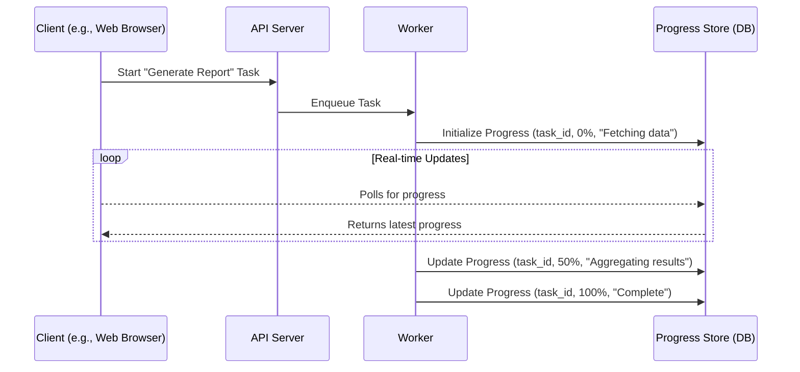

#### Explanation
Implementing progress tracking involves three components:
1.  **Reporting:** The worker code must be instrumented to report progress. This is typically done by calling a `report_progress` function at key checkpoints within the task's execution. The update can be a simple percentage or, more usefully, a description of the current step.
2.  **Storage:** A centralized store is needed to hold the latest progress for each task. This is often a separate database table or a fast key-value store like Redis. The store should be optimized for frequent writes from workers and frequent reads from clients.
3.  **Presentation:** The API server exposes an endpoint (e.g., `/tasks/{task_id}/progress`) that clients can poll to get the latest progress update from the storage layer and display it in the UI. For true real-time updates, WebSockets can be used to push updates from the server to the client.

#### Insights and Tips/Tricks
- **Throttle Updates:** Do not report progress on every single iteration of a loop (e.g., for every row in a 1-million-row file). This will overwhelm your database. Instead, report progress only periodically, either based on time (e.g., once every 5 seconds) or on a percentage change (e.g., for every 5% of progress).
- **Report Steps, Not Just Percentages:** A message like "Step 3/5: Transcoding Audio" is much more informative to a user than just "60%". It provides context and a better sense of what the system is doing.
- **Calculate a Running ETA:** You can provide an Estimated Time of Arrival (ETA) by tracking the average time taken for each percentage point of progress and extrapolating that to the remaining work. Be sure to label it as an "estimate," as it can be inaccurate.

#### Questions and Answers
- **Q: What happens to the progress if a task fails and is retried?**
  **A:** The progress should be reset. When the task is retried, it should start again from 0%. The progress store should be updated to reflect this, so the user doesn't see a progress bar jump from 75% back to 0%, which can be confusing. A better UX is to show a "Retrying..." state.
- **Q: What is the performance impact of progress reporting?**
  **A:** If not throttled, the impact can be significant, as each progress update is a database write. Throttling is essential. For a 1-hour task, reporting progress once every 10-15 seconds is usually more than enough and has a negligible performance impact.

#### Implementation (Python / PostgreSQL)
**1. PostgreSQL Schema for Progress:**
```sql
-- task_progress.sql
CREATE TABLE task_progress (
    task_id UUID PRIMARY KEY,
    last_updated_at TIMESTAMPTZ NOT NULL DEFAULT NOW(),
    progress_percent INTEGER NOT NULL CHECK (progress_percent >= 0 AND progress_percent <= 100),
    current_step_message TEXT,
    -- Store any other useful data as a flexible JSON object
    metadata JSONB
);
```

**2. Python Functions for Reporting and Fetching Progress:**
```python
# progress_manager.py
import psycopg2
import psycopg2.extras
import json
from datetime import datetime

def report_progress(conn, task_id: str, percent: int, message: str, metadata: dict = None):
    """
    Reports the progress of a task. Uses UPSERT to create or update the progress record.
    """
    with conn.cursor() as cur:
        cur.execute(
            """
            INSERT INTO task_progress (task_id, progress_percent, current_step_message, metadata)
            VALUES (%s, %s, %s, %s)
            ON CONFLICT (task_id) DO UPDATE SET
                progress_percent = EXCLUDED.progress_percent,
                current_step_message = EXCLUDED.current_step_message,
                metadata = EXCLUDED.metadata,
                last_updated_at = NOW();
            """,
            (task_id, percent, message, json.dumps(metadata) if metadata else None)
        )
    conn.commit()

def get_progress(conn, task_id: str) -> dict | None:
    """Fetches the latest progress for a given task."""
    with conn.cursor(cursor_factory=psycopg2.extras.DictCursor) as cur:
        cur.execute("SELECT * FROM task_progress WHERE task_id = %s;", (task_id,))
        progress = cur.fetchone()
        return dict(progress) if progress else None

# --- Example Usage in a Worker ---
# def long_running_task(task_id, total_items):
#     report_progress(conn, task_id, 0, "Starting processing...")
#     for i in range(total_items):
#         # ... process item i ...
#         # --- Throttled Reporting ---
#         if i % (total_items // 20) == 0: # Report every 5%
#             percent_complete = int((i / total_items) * 100)
#             report_progress(conn, task_id, percent_complete, f"Processed {i} items.")
#     report_progress(conn, task_id, 100, "Processing complete.")
```

#### Related Patterns
- **Task Lifecycle Management:** Progress tracking provides detailed insight into the `processing` state of the lifecycle.
- **Metrics & Monitoring:** The duration of each reported step can be a valuable metric to track for performance analysis. A step that suddenly starts taking much longer is a sign of a problem.

---

### 2. Metrics & Monitoring Patterns

#### Introduction
Metrics and monitoring are the eyes and ears of your distributed system. While logging tells you what happened for a *single* task, metrics give you an aggregated, system-wide view of health and performance over time. This pattern involves collecting key numerical data about your task system, storing it in a time-series database, and visualizing it on dashboards. It is the foundation for observability, allowing you to understand system behavior, plan for future capacity, and detect problems before they become outages.

#### Analogy
Think of a doctor monitoring a patient's vital signs.
- **Logs:** The doctor's detailed notes about a specific patient visit ("Patient complained of a cough at 10:30 AM").
- **Metrics:** The continuous chart of the patient's vital signs (heart rate, blood pressure, temperature).
- **Dashboard:** The monitor by the patient's bed showing the real-time charts of these vital signs.
- **Alert:** The monitor beeping loudly when the heart rate drops below a critical threshold.

A doctor can't understand the patient's overall health just by reading one set of notes; they need to see the trends in the vital signs over time.

#### Use Cases
- **Performance Analysis:** Answering questions like, "Did our last deployment make `video_transcoding` tasks slower?"
- **Capacity Planning:** Answering, "Our queue depth is steadily increasing every week. How many more workers do we need to add next quarter?"
- **Alerting:** Automatically notifying the on-call engineer when the task failure rate exceeds 5% for more than 10 minutes.
- **Business Intelligence:** Tracking the number of `order_placed` tasks processed per day to monitor business growth.

#### Mermaid Diagrams
**The Observability Pipeline:**
This shows the flow of data from collection to action.
```mermaid
graph TD
    subgraph "Collection (Workers)"
        A[Task Execution] --> B[Emit Metrics]
    end

    subgraph "Aggregation (e.g., Prometheus)"
        C[Time-Series Database]
    end

    subgraph "Visualization & Alerting"
        D[Dashboard (e.g., Grafana)]
        E[Alerting Rules (e.g., Alertmanager)]
    end

    subgraph "Action"
        F[Developer/Operator]
        G[Auto-scaler]
    end
    
    B --> C
    C --> D
    C --> E
    D --> F
    E --> F
    E --> G
```

#### Explanation
A robust monitoring setup focuses on the "Four Golden Signals" as they apply to a task system:
1.  **Latency:** How long do tasks take to execute? This should be measured as a distribution (e.g., p50, p95, p99) to understand both the typical case and the worst-case experience. Also, track "wait time" or "queue latency"—how long a task sits in the `pending` state.
2.  **Traffic:** How many tasks are being processed? This is your throughput, measured in tasks per second/minute. It should be tracked per task type.
3.  **Errors:** What is the rate of task failures? This should be tracked as a percentage of total tasks and broken down by error type.
4.  **Saturation:** How "full" is the system? The most important saturation metric for a task system is **queue depth** (the number of tasks in the `pending` state). Worker CPU and memory utilization are also key saturation metrics.

These metrics are typically exposed by workers via an HTTP endpoint (e.g., `/metrics`) in a specific format (like the Prometheus text format). A scraper (the Prometheus server) then periodically polls this endpoint to collect the data.

#### Insights and Tips/Tricks
- **Use Labels/Tags Extensively:** A metric like `tasks_processed_total` is not very useful. A metric like `tasks_processed_total{task_type="send_email", priority="high", status="success"}` is incredibly powerful. It allows you to slice and dice your data to pinpoint problems.
- **Dashboards Should Tell a Story:** A good dashboard starts with high-level health (the golden signals for the whole system) at the top, then allows you to drill down into metrics for specific task types or workers.
- **Alert on Symptoms, Not Causes:** Alert on high task latency or a high failure rate (symptoms that affect users). Don't alert on high CPU (a potential cause). A worker could have high CPU but still be meeting its performance SLOs. Alerting on symptoms reduces alert fatigue.

#### Questions and Answers
- **Q: What's the difference between logging and metrics?**
  **A:** **Logs** are for investigating a specific event. They are detailed, unstructured or semi-structured, and useful for debugging a single task failure. **Metrics** are for understanding trends and aggregates. They are numerical, highly structured, and designed for efficient storage and querying over time. You use metrics to find the smoke (e.g., "p99 latency for `send_email` tasks is high"), and logs to find the fire (e.g., "task `abc-123` failed because of a timeout to the SMTP server").
- **Q: How can I monitor queue depth from my database?**
  **A:** You can create a specific monitoring user in your database with read-only access and have a small service (or Prometheus's own `postgres_exporter`) run a query like `SELECT COUNT(*) FROM tasks WHERE status = 'pending';` every 30 seconds and export the result as a metric.

#### Implementation (Python / PostgreSQL)
**1. PostgreSQL Query for a Metric:**
This query can be used by an exporter to get the current queue depth per task type.
```sql
-- get_queue_depth.sql
SELECT task_type, COUNT(*) as depth
FROM tasks
WHERE status = 'pending'
GROUP BY task_type;
```

**2. Python Worker Exposing Prometheus Metrics:**
This uses the `prometheus-client` library to create an HTTP server within the worker that Prometheus can scrape.
```python
# metrics_exporter.py
from prometheus_client import start_http_server, Counter, Gauge, Histogram
import time
import random

# --- Define the metrics ---
# Use labels to differentiate by task_type and status
TASKS_PROCESSED = Counter(
    'tasks_processed_total',
    'Total number of tasks processed',
    ['task_type', 'status']
)
# A Gauge to track the number of workers currently running a task
WORKER_ACTIVE_TASKS = Gauge(
    'worker_active_tasks',
    'Number of tasks a worker is currently processing',
    ['worker_id']
)
# A Histogram to track the distribution of task durations
TASK_DURATION = Histogram(
    'task_duration_seconds',
    'Distribution of task execution times',
    ['task_type']
)

def some_task_handler(task_type: str):
    """A fake task handler to demonstrate metric instrumentation."""
    status = "success"
    # Use the .time() context manager to automatically record duration
    with TASK_DURATION.labels(task_type=task_type).time():
        with WORKER_ACTIVE_TASKS.labels(worker_id="worker-1").track_inprogress():
            print(f"Processing a '{task_type}' task...")
            # Simulate work and potential failure
            time.sleep(random.uniform(0.1, 1.0))
            if random.random() < 0.1:
                status = "failure"
    
    # Increment the counter with the appropriate labels
    TASKS_PROCESSED.labels(task_type=task_type, status=status).inc()
    print(f"Finished '{task_type}' task with status '{status}'.")

if __name__ == '__main__':
    # Start an HTTP server on port 8000 to expose the metrics
    start_http_server(8000)
    print("Metrics server started on port 8000.")
    
    # Simulate a worker processing tasks
    while True:
        some_task_handler("send_email")
        some_task_handler("generate_thumbnail")
        time.sleep(2)
```

#### Related Patterns
- **Auto-scaling Patterns:** Auto-scaling decisions are driven directly by the metrics collected here, especially queue depth and worker saturation.
- **Error Classification & Handling:** The categories of errors should be a label on your `tasks_processed_total` metric (with `status="failure"`), allowing you to track the rate of different failure types.
- **Progress Tracking:** While progress is for single tasks, the *duration* of each progress step can be aggregated into a valuable performance metric.

---

## Worker Management & Scaling

### 1. Worker Pool Management

#### Introduction
A worker pool is the collection of processes or containers that execute tasks. In any non-trivial system, this pool is not static. Workers can crash, new workers can be added, and old ones removed. Worker Pool Management is the pattern of maintaining a real-time, accurate inventory of healthy, active workers. It is the foundation for intelligent load balancing and effective auto-scaling, as the system must first know *who* is available to do work before it can assign work or decide if more workers are needed.

#### Analogy
Think of a taxi dispatcher.
- **Worker Pool:** The fleet of all taxi drivers currently on duty.
- **Registration:** When a driver starts their shift, they log into the dispatch system, making themselves available for rides.
- **Health Check / Heartbeat:** The driver's GPS unit periodically sends their location and status (e.g., "available," "on a trip") back to the dispatcher.
- **Deregistration:** If the dispatcher doesn't hear from a driver for a long time, they assume the driver's radio is broken or they've gone off-shift, and they remove them from the available pool. When the driver ends their shift, they log out.

#### Use Cases
- **Service Discovery:** Allowing a task dispatcher or API server to find out the network addresses of available workers.
- **Health Monitoring:** Detecting and removing crashed or unresponsive workers from the pool so that tasks are not assigned to them.
- **Capacity Tracking:** Providing the data needed for an auto-scaler to know the current number of active workers.
- **Targeted Deployment:** Rolling out a new version of the worker code to a subset of the pool for canary testing.

#### Mermaid Diagrams
**Worker Lifecycle in the Pool:**
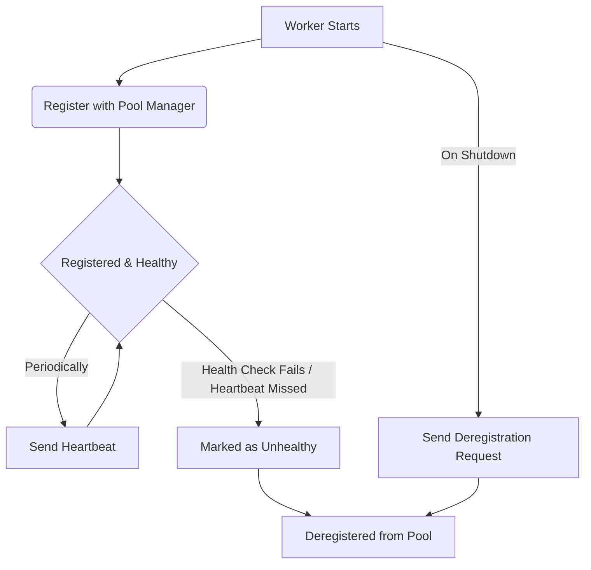

#### Explanation
Worker pool management relies on two key mechanisms:
1.  **Registration:** When a worker process starts, its first action is to register itself with a central "Pool Manager" or "Service Registry." This registration includes its unique ID, its network address, and its capabilities (e.g., "I can process `video` tasks").
2.  **Health Checking:** The system must be able to distinguish healthy, running workers from dead or stuck ones. There are two main approaches:
    *   **Active Health Checks:** The Pool Manager periodically pings a health check endpoint on each registered worker (e.g., `GET /health`). If the worker doesn't respond correctly, it's removed.
    *   **Passive Health Checks (Heartbeating):** Each worker is responsible for periodically sending a small "I'm still alive" message (a heartbeat) to the Pool Manager. If the manager doesn't receive a heartbeat from a worker within a certain timeout, it assumes the worker is dead and removes it. Heartbeating is generally more scalable as it puts the onus on the workers.

#### Insights and Tips/Tricks
- **Use Leases for Self-Healing:** A powerful pattern for registration is to use a "lease." When a worker registers, it's granted a lease for a short time (e.g., 60 seconds). It must renew this lease by heartbeating before it expires. If the worker crashes, it can't renew the lease. The lease expires, and the system *automatically* deregisters the worker. This is self-healing and avoids the need for a separate cleanup process.
- **A Health Check Should Check Dependencies:** A good `/health` endpoint shouldn't just return `{"status": "ok"}`. It should perform a quick, non-intrusive check of its own critical dependencies. For example, it might check that it can still connect to the database. This provides a much more accurate picture of health.
- **Don't Couple Workers to the Pool Manager:** The Pool Manager should be a simple, highly available service (or just a database table). Workers should be able to function (i.e., pull tasks from the queue) even if they can't send a heartbeat for a short time.

#### Questions and Answers
- **Q: What's the difference between a heartbeat and an active health check?**
  **A:** The direction of communication. With **heartbeating**, the worker *pushes* its status to the manager. With **active health checks**, the manager *pulls* the status from the worker. Heartbeating is often preferred in large-scale systems because it scales better; the manager doesn't need to know about every worker, it just processes incoming heartbeats.
- **Q: Should I build my own service registry?**
  **A:** Probably not. This is a solved problem. For most use cases, using a simple database table is sufficient. For complex microservice environments, dedicated tools like Consul, Zookeeper, or etcd are the industry standard.

#### Implementation (Python / PostgreSQL)
**1. PostgreSQL Schema for the Worker Pool:**
A simple table can act as our service registry.
```sql
-- workers.sql
CREATE TABLE workers (
    worker_id VARCHAR(100) PRIMARY KEY,
    -- Store capabilities as a flexible JSON object
    capabilities JSONB,
    registered_at TIMESTAMPTZ NOT NULL DEFAULT NOW(),
    last_heartbeat_at TIMESTAMPTZ NOT NULL DEFAULT NOW()
);
```

**2. Python Worker with Registration and Heartbeating:**
```python
# worker_pool_logic.py
import psycopg2
import time
import threading
import os
import json

WORKER_ID = f"worker-{os.getpid()}"
WORKER_CAPABILITIES = {"can_process": ["send_email", "generate_thumbnail"]}
HEARTBEAT_INTERVAL_S = 15

def register_worker(conn):
    """Registers this worker in the database. Uses UPSERT for idempotency."""
    print(f"[{WORKER_ID}] Registering with capabilities: {WORKER_CAPABILITIES}")
    with conn.cursor() as cur:
        cur.execute(
            """
            INSERT INTO workers (worker_id, capabilities, last_heartbeat_at)
            VALUES (%s, %s, NOW())
            ON CONFLICT (worker_id) DO UPDATE SET
                capabilities = EXCLUDED.capabilities,
                last_heartbeat_at = NOW();
            """,
            (WORKER_ID, json.dumps(WORKER_CAPABILITIES))
        )
    conn.commit()

def send_heartbeat(conn):
    """Updates the last_heartbeat_at timestamp for this worker."""
    with conn.cursor() as cur:
        cur.execute(
            "UPDATE workers SET last_heartbeat_at = NOW() WHERE worker_id = %s;",
            (WORKER_ID,)
        )
    conn.commit()
    print(f"[{WORKER_ID}] Heartbeat sent.")

def heartbeat_thread(conn):
    """A background thread that sends heartbeats periodically."""
    while True:
        time.sleep(HEARTBEAT_INTERVAL_S)
        try:
            send_heartbeat(conn)
        except psycopg2.InterfaceError:
            # Handle case where main connection is closed
            print("Heartbeat thread exiting.")
            break
        except Exception as e:
            print(f"Failed to send heartbeat: {e}")

# --- In the main worker file ---
# conn = psycopg2.connect(...)
# register_worker(conn)
#
# # Start the heartbeat in a separate thread
# hb_thread = threading.Thread(target=heartbeat_thread, args=(conn,), daemon=True)
# hb_thread.start()
#
# # ... main worker loop ...
```
**3. Janitor Process to Clean Up Stale Workers:**
This would be a separate script run by a scheduler.
```python
# janitor.py
def cleanup_stale_workers(conn):
    """Removes workers that haven't sent a heartbeat recently."""
    # Consider a worker stale if its last heartbeat was > 3 intervals ago
    stale_threshold_seconds = HEARTBEAT_INTERVAL_S * 3
    with conn.cursor() as cur:
        cur.execute(
            """
            DELETE FROM workers
            WHERE last_heartbeat_at < NOW() - INTERVAL '%s seconds';
            """,
            (stale_threshold_seconds,)
        )
        deleted_count = cur.rowcount
    conn.commit()
    if deleted_count > 0:
        print(f"Cleaned up {deleted_count} stale workers.")
```

#### Related Patterns
- **Auto-scaling Patterns:** The auto-scaler needs to query the worker pool to know the current number of active workers before making a scaling decision.
- **Graceful Shutdown:** A well-behaved worker will explicitly deregister itself from the pool as part of its shutdown sequence.
- **Load Balancing:** A push-based assignment strategy relies entirely on the worker pool registry to find available workers.

---

### 2. Auto-scaling Patterns

#### Introduction
Auto-scaling is the process of automatically adjusting the number of computational resources—in our case, workers—in response to the system's current workload. It is one of the most powerful features of cloud-native systems. A well-implemented auto-scaling strategy allows a system to handle sudden bursts of traffic gracefully while also minimizing costs by scaling down during quiet periods. It's the key to building a system that is both cost-effective and highly available.

#### Analogy
Think of a supermarket's checkout lanes.
- **Workload:** The number of customers with full carts waiting to pay.
- **Workers:** The cashiers.
- **Auto-scaler:** The store manager.
- **Scale-Up:** When the manager sees that every lane has a long line (high queue depth), they call for more cashiers to open up new lanes.
- **Scale-Down:** Late at night, when there are very few customers, the manager sends some cashiers home to save on labor costs, keeping just one or two lanes open.
- **Cooldown:** After opening a new lane, the manager waits a few minutes to see the lines shrink before deciding to open another one. This prevents them from overreacting to a temporary rush.

#### Use Cases
- **Handling Diurnal (Daily) Traffic Patterns:** Many services are busy during the day and quiet at night. Auto-scaling can automatically add workers in the morning and remove them in the evening.
- **Responding to Spikes:** A marketing email blast can cause a sudden, massive influx of `process_signup` tasks. Auto-scaling can rapidly provision new workers to handle the load and then scale back down once the spike subsides.
- **Cost Optimization:** Ensuring you are not paying for idle worker VMs or containers when there are no tasks in the queue.
- **Maintaining Performance SLOs:** If your goal is to keep task wait time below 60 seconds, you can configure your auto-scaler to add workers whenever that threshold is breached.

#### Mermaid Diagrams
**The Auto-scaling Feedback Loop:**
```mermaid
graph TD
    A[Metrics Collector] -- Queue Depth, Worker CPU --> B{Scaling Decision Engine};
    B -- Is queue_depth > 100? --> C{Scale Up};
    B -- Is queue_depth < 10 AND cpu < 30%? --> D{Scale Down};
    B -- Otherwise --> E[Maintain Current Size];

    C --> F[Call Cloud Provider API<br>e.g., `set_desired_capacity(N+1)`];
    D --> G[Call Cloud Provider API<br>e.g., `set_desired_capacity(N-1)`];
    
    F --> H[New Worker Starts];
    G --> I[Worker is Terminated Gracefully];

    H --> A;
    I -- reduces load on --> A;
```

#### Explanation
An auto-scaler is a control loop that typically runs as a separate process. Its logic is as follows:
1.  **Collect Metrics:** The scaler periodically queries its data sources for key scaling metrics. The most common and effective metric for a task system is **queue depth**. Worker CPU/memory utilization is also useful.
2.  **Evaluate Rules:** It compares these metrics against configured thresholds. For example:
    - **Scale-Up Rule:** `IF queue_depth > 1000 FOR 5_minutes THEN scale_up()`.
    - **Scale-Down Rule:** `IF queue_depth == 0 AND avg_worker_cpu < 20% FOR 10_minutes THEN scale_down()`.
3.  **Execute Action:** If a rule is met, the scaler makes an API call to the underlying infrastructure (e.g., AWS Auto Scaling Groups, Kubernetes Horizontal Pod Autoscaler) to change the desired number of worker instances.
4.  **Cooldown:** After a scaling action, the scaler enters a "cooldown" period where it will not make another scaling decision. This gives the system time to stabilize and for the new workers to start affecting the metrics, preventing rapid, unnecessary fluctuations (known as "thrashing").

#### Insights and Tips/Tricks
- **Scale Up Aggressively, Scale Down Cautiously:** It's generally better to over-provision slightly to handle a spike than to under-provision and have users experience long delays. This means having a sensitive scale-up rule (e.g., trigger on a 2-minute threshold) and a conservative scale-down rule (e.g., trigger only after 15 minutes of low load).
- **Use Multiple Metrics:** Relying only on queue depth can be misleading. A queue depth of 1000 might be fine if the tasks are very fast, but terrible if they are slow. A better rule combines queue depth with task wait time: `IF p99_queue_latency_seconds > 60 THEN scale_up()`.
- **Predictive Scaling:** Advanced systems can use historical data to predict future load. If you know you always have a spike at 9 AM on Monday, you can configure predictive scaling to start adding workers at 8:55 AM, *before* the spike even begins.

#### Questions and Answers
- **Q: What is "thrashing" and how do I prevent it?**
  **A:** Thrashing is when the auto-scaler rapidly scales up and down in an unstable loop. For example, it scales up, the queue drains, so it immediately scales down, the queue builds up, so it immediately scales up again. Cooldown periods are the primary way to prevent this. After any scaling action, the scaler should ignore new signals for a set period (e.g., 5-10 minutes).
- **Q: Should I scale based on CPU utilization or queue depth?**
  **A:** For a task processing system, **queue depth** (or queue latency) is almost always the better primary metric. The goal of the system is to process the queue. Worker CPU is a secondary, supporting metric. It's possible for workers to have low CPU but for the queue to be growing because the tasks are I/O-bound, not CPU-bound. Scaling on queue depth correctly handles this scenario.

#### Implementation (Python / PostgreSQL)
This is a simplified implementation of the *decision logic* for an auto-scaler. In a real system, the `change_worker_count` function would make an API call to AWS, GCP, or Kubernetes.

**1. PostgreSQL Schema:**
We will use the `tasks` and `workers` tables defined previously.

**2. Python Auto-scaler Logic:**
```python
# auto_scaler.py
import psycopg2
import time

# --- Scaling Configuration ---
MIN_WORKERS = 2
MAX_WORKERS = 50
SCALE_UP_QUEUE_DEPTH_THRESHOLD = 100
SCALE_DOWN_QUEUE_DEPTH_THRESHOLD = 10
# How many tasks we expect one worker to handle.
# This helps calculate a target size.
TARGET_TASKS_PER_WORKER = 25

def get_current_state(conn) -> (int, int):
    """Gets the current queue depth and worker count."""
    with conn.cursor() as cur:
        cur.execute("SELECT COUNT(*) FROM tasks WHERE status = 'pending';")
        queue_depth = cur.fetchone()[0]
        
        cur.execute("SELECT COUNT(*) FROM workers;")
        worker_count = cur.fetchone()[0]
        
    return queue_depth, worker_count

def change_worker_count(new_count: int):
    """Placeholder for calling a real cloud API."""
    print(f"--- SCALING ACTION: Setting desired worker count to {new_count} ---")
    # e.g., boto3_client.set_desired_capacity(GroupName='my-worker-asg', DesiredCapacity=new_count)

def main():
    """Main auto-scaler decision loop."""
    conn = psycopg2.connect(...)
    print("Auto-scaler started.")
    
    while True:
        queue_depth, worker_count = get_current_state(conn)
        print(f"Current state: {worker_count} workers, {queue_depth} tasks in queue.")
        
        target_count = worker_count
        
        if queue_depth > SCALE_UP_QUEUE_DEPTH_THRESHOLD:
            # Scale up based on how many workers we need to clear the queue
            required_workers = (queue_depth // TARGET_TASKS_PER_WORKER) + 1
            target_count = max(worker_count, required_workers)
            print(f"High queue depth detected. Required workers: {required_workers}")
        
        elif queue_depth < SCALE_DOWN_QUEUE_DEPTH_THRESHOLD:
            # Scale down, but only one step at a time
            target_count = worker_count - 1
            print("Low queue depth detected. Proposing scale down.")

        # Clamp the target to our min/max bounds
        target_count = max(MIN_WORKERS, min(MAX_WORKERS, target_count))
        
        if target_count != worker_count:
            change_worker_count(target_count)
            # Enter cooldown period
            print("Entering 5 minute cooldown period after scaling action.")
            time.sleep(300)
        else:
            print("No scaling action needed.")
            time.sleep(60) # Check again in 1 minute

if __name__ == "__main__":
    main()
```

#### Related Patterns
- **Metrics & Monitoring:** Auto-scaling is a direct consumer of the metrics produced by your monitoring system.
- **Graceful Shutdown:** This is a critical prerequisite for auto-scaling. When the scaler decides to terminate a worker, the graceful shutdown mechanism ensures that in-flight work is not lost.
- **Worker Pool Management:** The scaler needs to know the current number of workers, which it gets from the pool manager.

---

### 3. Graceful Shutdown Patterns

#### Introduction
A graceful shutdown is the process of terminating a worker in a clean, orderly fashion, ensuring that it finishes any work it is currently doing and does not leave the system in an inconsistent state. It is a critical pattern for achieving zero-downtime deployments and for enabling safe auto-scaling. The opposite, a forced shutdown (or "kill"), can abruptly terminate a task mid-execution, potentially leading to data corruption or lost work.

#### Analogy
It's the difference between a pilot landing a plane and a pilot jumping out with a parachute.
- **Graceful Shutdown:** The pilot follows a checklist: they stop ascending (stop accepting new tasks), follow the landing path, touch down smoothly, and taxi to the gate (finish the current task). All passengers (data) are safe.
- **Forced Shutdown (SIGKILL):** The engines cut out mid-flight. The plane crashes. This is a last resort used only when the system is completely unresponsive.

#### Use Cases
- **Deployments:** When deploying a new version of the worker code, the orchestrator (e.g., Kubernetes) will first start new workers and then gracefully shut down the old ones.
- **Auto-scaling:** When the auto-scaler decides to scale down, it must gracefully terminate an idle worker.
- **Scheduled Maintenance:** When taking a server offline for maintenance, you must first gracefully shut down the workers running on it.

#### Mermaid Diagrams
**The Graceful Shutdown Sequence:**
```sequenceDiagram
    participant O as Orchestrator (e.g., K8s)
    participant W as Worker Process
    participant Q as Task Queue
    
    O->>W: 1. Send SIGTERM signal
    
    W->>W: 2. Catch signal, set `shutting_down = true`
    Note right of W: Worker's main loop will no longer poll the queue.
    
    W->>W: 3. Wait for current task to complete
    Note right of W: The task `process_video(123)` is still running...
    
    W->>Q: 4. Acknowledge completed task
    
    W->>O: 5. Exit process with code 0 (success)
    
    alt Timeout
        O->>W: 1. Send SIGTERM signal
        Note over W: Worker waits for a long task...
        O->>O: Wait for shutdown deadline (e.g., 30s)
        O->>W: 6. Send SIGKILL signal (force-kill)
    end
```

#### Explanation
The graceful shutdown process is initiated when the worker process receives a termination signal from the operating system, most commonly `SIGTERM`. A well-behaved worker will:
1.  **Trap the Signal:** The code will have a signal handler that catches `SIGTERM`.
2.  **Enter "Draining" Mode:** The handler will set a global flag, e.g., `is_shutting_down = True`.
3.  **Stop Accepting New Work:** The worker's main loop, which polls the queue for tasks, must check this flag. If `is_shutting_down` is true, it will stop polling.
4.  **Finish In-flight Work:** If the worker was in the middle of processing a task when the signal arrived, it will be allowed to complete it.
5.  **Exit:** Once the in-flight task is complete and the polling loop has stopped, the process can safely exit.

A crucial part of this pattern is a **shutdown timeout**. The orchestrator that sent the `SIGTERM` signal will only wait for a certain amount of time (e.g., 30 seconds). If the worker process has not exited by then, the orchestrator will send a `SIGKILL` signal, which cannot be caught and will terminate the process immediately.

#### Insights and Tips/Tricks
- **Shutdown Timeout > Task Timeout:** Your graceful shutdown timeout must be longer than the maximum expected duration of any single task. If your tasks can take up to 5 minutes, your shutdown timeout should be at least 5-6 minutes.
- **Idempotency is Your Safety Net:** Even with graceful shutdown, things can go wrong (e.g., the server loses power). Idempotent task design is the ultimate safety net that ensures that even if a task is killed and retried, it won't cause data corruption.
- **Liveness vs. Readiness Probes:** In Kubernetes, this pattern is implemented using readiness probes. When a worker receives `SIGTERM`, it should immediately start failing its readiness probe. This tells Kubernetes to stop sending it new requests (or in our case, it signals to the worker to stop polling), but the liveness probe can continue to pass as long as the process is still running its final task.

#### Questions and Answers
- **Q: What's the difference between `SIGTERM` and `SIGKILL`?**
  **A:** `SIGTERM` is a polite request: "Please terminate yourself cleanly." The process can catch this signal and perform cleanup actions. `SIGKILL` is a direct order from the kernel: "You will be terminated now." The process cannot catch or ignore `SIGKILL`. Graceful shutdown is the process of handling `SIGTERM`.
- **Q: What happens if the task being processed gets stuck during a graceful shutdown?**
  **A:** The worker process will not exit. Eventually, the orchestrator's shutdown timeout will expire, and it will send a `SIGKILL` to the worker. The stuck task will be "orphaned" in the `processing` state in the database. This is why you also need a separate "janitor" process to find and requeue tasks that have been stuck in the `processing` state for too long.

#### Implementation (Python / PostgreSQL)
**1. PostgreSQL Schema:**
No changes are needed in the database. This is a worker-side logic pattern.

**2. Python Worker with Signal Handling:**
```python
# graceful_worker.py
import psycopg2
import time
import signal
import os

# A global flag to signal shutdown
SHUTTING_DOWN = False

class GracefulKiller:
    """Catches SIGTERM and SIGINT and sets the SHUTTING_DOWN flag."""
    def __init__(self):
        signal.signal(signal.SIGINT, self.exit_gracefully)
        signal.signal(signal.SIGTERM, self.exit_gracefully)

    def exit_gracefully(self, signum, frame):
        global SHUTTING_DOWN
        print(f"--- Received shutdown signal {signum}. Entering draining mode. ---")
        SHUTTING_DOWN = True

def process_task(task: dict):
    """Placeholder for a long-running task."""
    print(f"Starting task {task['id']}... will take 5 seconds.")
    # In a real task, you would need to handle shutdown signals during long I/O waits.
    time.sleep(5)
    print(f"Finished task {task['id']}.")

def main_loop(conn):
    """The main worker loop that checks the shutdown flag."""
    worker_id = f"worker-{os.getpid()}"
    active_task = None
    
    while not SHUTTING_DOWN:
        print("Polling for a new task...")
        # In a real app, you would use claim_next_task here
        active_task = {'id': 1} # Fake a task
        
        if active_task:
            print("Found a task. Processing...")
            process_task(active_task)
            active_task = None
        else:
            time.sleep(2) # Wait before polling again
            
    print("Polling loop has stopped. Worker is draining.")
    # At this point, the loop has exited. If a task was running, it has finished.
    # The process will now exit naturally.

if __name__ == "__main__":
    # Initialize the signal handler
    killer = GracefulKiller()
    
    conn = None # psycopg2.connect(...)
    print(f"Worker started with PID {os.getpid()}. Press Ctrl+C to shut down gracefully.")
    
    main_loop(conn)
    
    print("Worker has shut down gracefully.")
```

#### Related Patterns
- **Auto-scaling:** Graceful shutdown is the mechanism that makes scale-down operations safe.
- **Task Lifecycle Management:** A janitor process to clean up "orphaned" tasks (from workers that failed to shut down gracefully) is a necessary part of a complete lifecycle.

---

## Advanced Patterns & Edge Cases

### 1. Task Dependencies & Workflows (DAGs)

#### Introduction
Many business processes are not single, independent tasks but rather a collection of tasks with dependencies, forming a workflow. For example, to generate a user report, you must first fetch data, then process it, and finally render it as a PDF. The "render" task cannot start until the "process" task is complete. This pattern uses a Directed Acyclic Graph (DAG) to model these workflows, allowing a system to execute complex, multi-step processes reliably and efficiently by running independent tasks in parallel while respecting the defined order of execution.

#### Analogy
Think of cooking a meal from a recipe.
- **The Workflow (DAG):** The entire recipe.
- **The Tasks:** The individual steps in the recipe (e.g., "chop vegetables," "preheat oven," "sauté onions," "roast chicken").
- **Dependencies:** You must "chop vegetables" before you can "sauté onions." You must "preheat oven" before you can "roast chicken."
- **Parallel Execution:** You can "chop vegetables" *at the same time* as you "preheat oven" because they don't depend on each other. A smart cook (a workflow engine) does these things in parallel to save time.

#### Use Cases
- **ETL (Extract, Transform, Load) Pipelines:** A common use case where data is extracted from multiple sources, cleaned and transformed, and then loaded into a data warehouse. Each step is a task, and many can run in parallel.
- **Machine Learning Pipelines:** A workflow to train a model might involve fetching data, preprocessing it, training multiple model variants in parallel, evaluating them, and deploying the best one.
- **User Onboarding:** A sequence of tasks to set up a new user: create user record, provision resources, send welcome email, schedule a follow-up check-in.
- **Complex Financial Transactions:** A "trade settlement" workflow that involves multiple validation, clearing, and notification steps.

#### Mermaid Diagrams
**A Sample ETL Workflow as a DAG:**
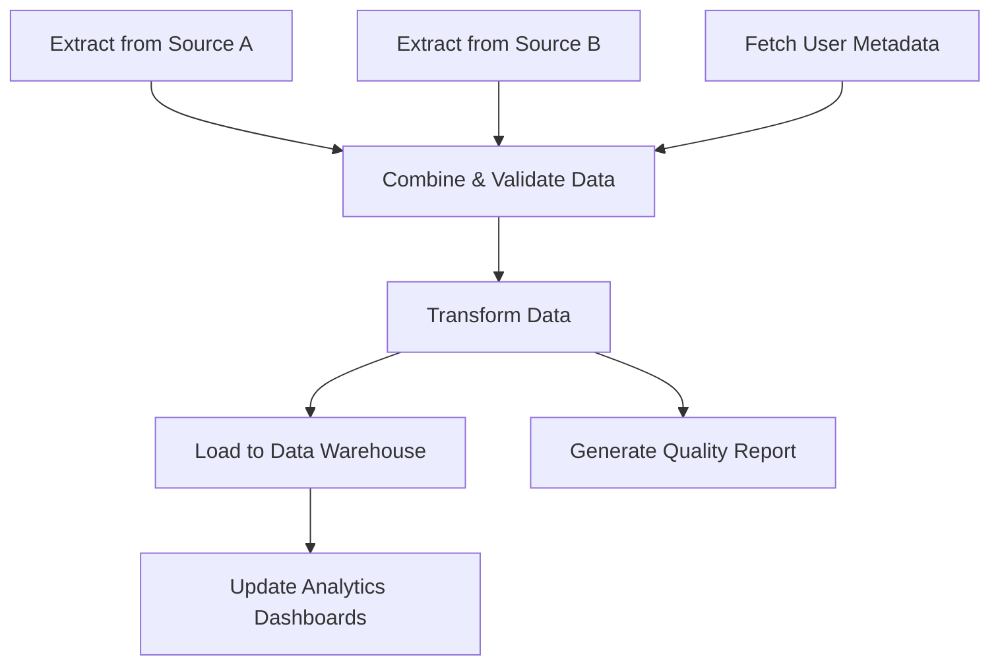

#### Explanation
A DAG-based workflow system has two main parts:
1.  **Workflow Definition:** A way to define the tasks and their dependencies. This is often done in code (as in Apache Airflow or Temporal) or via a visual editor. A workflow is a collection of tasks, where each task points to its "upstream" dependencies. The system must validate that this graph has no cycles (it's "acyclic"), otherwise it would result in an infinite loop.
2.  **Workflow Engine (Orchestrator):** This is a service that manages the execution of a workflow instance (a "run"). Its job is to:
    *   Look at the DAG and find all tasks with no dependencies (the "root" tasks).
    *   Enqueue these tasks to be executed by workers.
    *   As tasks complete, it updates the state of the workflow run.
    *   It then re-evaluates the DAG to find new tasks whose dependencies have now been met.
    *   It enqueues these newly "unlocked" tasks.
    *   This continues until all tasks in the DAG are completed or one has failed.

#### Insights and Tips/Tricks
- **Separate the Orchestrator from the Worker:** The workflow engine's job is to manage the *state* of the DAG. The worker's job is to execute the *logic* of a single task. They should be separate services. The orchestrator enqueues tasks, and the workers pick them up, just like in a simple task queue system.
- **Pass Data Between Tasks:** Tasks in a workflow often need to pass results to their downstream dependencies. A common pattern is for a task to return a small piece of data (like a file path or an ID) to the orchestrator, which then injects this data into the payload of the next task. Avoid passing large amounts of data through the orchestrator; instead, pass a *reference* to the data (e.g., a path to a file in S3).
- **Make Tasks Internally Idempotent:** A workflow engine might need to retry a failed workflow from a certain point. If a task fails, the engine will re-run it. It's crucial that the tasks themselves are idempotent so that re-running them doesn't cause duplicate effects.

#### Questions and Answers
- **Q: How is this different from just chaining tasks together manually?**
  **A:** Manually chaining (e.g., task A, on completion, enqueues task B) is brittle. It's hard to visualize, hard to manage failures, and doesn't support parallel execution. A DAG-based system centralizes the workflow logic, provides visibility, handles retries and failures gracefully, and automatically optimizes for parallelism.
- **Q: What happens if a task in the middle of a big DAG fails?**
  **A:** This is configurable. The default behavior is often to fail the entire workflow run immediately and stop scheduling new tasks. Most engines also support a "retry" policy for the failed task. Some advanced engines even allow you to define "on-failure" branches in your DAG (e.g., if `Transform Data` fails, run the `Send Alert to Data Team` task).

#### Implementation (Python / PostgreSQL)
A full workflow engine is a complex piece of software. This implementation will focus on the core data model and the "tick" function of a simplified orchestrator.

**1. PostgreSQL Schema for Workflows:**
We need tables to store the workflow definitions and the state of each run.
```sql
-- workflow_schema.sql

-- Stores the static definition of a workflow (the DAG)
CREATE TABLE workflows (
    id UUID PRIMARY KEY,
    name VARCHAR(255) UNIQUE NOT NULL,
    definition JSONB NOT NULL -- Stores the list of tasks and their dependencies
);

-- Stores the state of each individual execution of a workflow
CREATE TABLE workflow_runs (
    id UUID PRIMARY KEY,
    workflow_id UUID REFERENCES workflows(id),
    status VARCHAR(50) NOT NULL, -- e.g., 'running', 'completed', 'failed'
    created_at TIMESTAMPTZ NOT NULL DEFAULT NOW(),
    completed_at TIMESTAMPTZ
);

-- Stores the state of each task within a specific workflow run
CREATE TABLE workflow_run_tasks (
    id UUID PRIMARY KEY,
    workflow_run_id UUID REFERENCES workflow_runs(id),
    task_name VARCHAR(255) NOT NULL,
    status VARCHAR(50) NOT NULL, -- 'pending', 'running', 'completed', 'failed'
    result JSONB,
    -- This links back to the main tasks table
    task_queue_id UUID REFERENCES tasks(id)
);
```

**2. Python Orchestrator Logic:**
This simplified orchestrator has a "tick" function that would be run periodically.
```python
# orchestrator.py
import psycopg2
import psycopg2.extras

def get_completed_run_tasks(conn, workflow_run_id: str) -> set:
    """Gets the names of all tasks that have completed successfully for a run."""
    with conn.cursor() as cur:
        cur.execute(
            "SELECT task_name FROM workflow_run_tasks WHERE workflow_run_id = %s AND status = 'completed';",
            (workflow_run_id,)
        )
        return {row[0] for row in cur.fetchall()}

def get_workflow_definition(conn, workflow_id: str) -> dict:
    """Fetches the DAG definition from the database."""
    with conn.cursor(cursor_factory=psycopg2.extras.DictCursor) as cur:
        cur.execute("SELECT definition FROM workflows WHERE id = %s;", (workflow_id,))
        return cur.fetchone()['definition']

def orchestrator_tick(conn, workflow_run_id: str):
    """
    The core logic of the orchestrator.
    Finds and schedules the next runnable tasks for a given workflow run.
    """
    run_info = # ... get workflow_run info ...
    workflow_id = run_info['workflow_id']
    
    definition = get_workflow_definition(conn, workflow_id)
    completed_tasks = get_completed_run_tasks(conn, workflow_run_id)
    
    # Get the set of all tasks already scheduled or completed
    processed_tasks = # ... query workflow_run_tasks for all non-pending tasks ...
    
    for task in definition['tasks']:
        task_name = task['name']
        dependencies = set(task['dependencies'])
        
        # A task is runnable if:
        # 1. All its dependencies are in the 'completed_tasks' set.
        # 2. It has not already been processed (scheduled, completed, or failed).
        if dependencies.issubset(completed_tasks) and task_name not in processed_tasks:
            print(f"Orchestrator: Task '{task_name}' is ready to run. Enqueuing.")
            
            # 1. Enqueue the task in the main 'tasks' table
            task_queue_id = enqueue_task(conn, task['type'], task['payload'])
            
            # 2. Record that this task is now part of the workflow run
            # ... INSERT into workflow_run_tasks with status 'running' ...
            
    # ... Check if all tasks are completed and update workflow_run status ...
```

#### Related Patterns
- **Task Lifecycle Management:** The orchestrator manages the lifecycle of many tasks as a single unit.
- **Event Sourcing for Task State:** Complex workflows are a great fit for event sourcing. Each task completion is an event, and the state of the workflow is derived by replaying these events.
- **The Saga Pattern:** A Saga is a specific type of workflow designed to handle distributed transactions. While a DAG can model a Saga, the Saga pattern focuses on the concept of compensating actions for rollback.

---

### 2. The Saga Pattern for Long-Running Transactions

#### Introduction
In a distributed architecture, you cannot use traditional ACID database transactions that span multiple services. A "distributed transaction"—an operation that must either fully succeed or fully fail across several independent services—requires a different approach. The Saga pattern is a failure management pattern that provides a way to maintain data consistency across microservices without using distributed locks. It models a long-running transaction as a sequence of smaller, local transactions, where each step has a corresponding "compensating action" to undo it if a later step fails.

#### Analogy
Imagine booking a vacation package online, which involves three separate services: flights, hotels, and car rentals.
1.  **The Saga Begins:** You click "Book Trip."
2.  **Step 1: Book Flight.** The system successfully books your flight. This is the first local transaction.
3.  **Step 2: Book Hotel.** The system tries to book your hotel, but it's sold out. This step fails.
4.  **Compensation:** The Saga must now roll back. It executes the compensating action for Step 1, which is **"Cancel Flight."** The system is now back in a consistent state (no flight, no hotel), and the user is notified that the booking failed.

The entire process (Book Flight -> Book Hotel -> Book Car) is the Saga. The compensating action (Cancel Flight) is what makes it transactional.

#### Use Cases
- **E-commerce Order Processing:** An order might involve charging a payment, updating inventory, and scheduling a shipment. If the inventory update fails, the payment must be refunded.
- **Travel Booking Systems:** As in the analogy, coordinating flights, hotels, and car rentals.
- **User Registration Workflows:** Creating a user in an auth service, creating a billing profile in a payment service, and provisioning resources in a third service.
- **Any business process that spans multiple microservices and requires "all or nothing" semantics.**

#### Mermaid Diagrams
**The Saga Execution and Compensation Flow:**
This diagram shows a successful path and a failure path with compensation.
```sequenceDiagram
    participant C as Client
    participant O as Order Service (Orchestrator)
    participant P as Payment Service
    participant I as Inventory Service

    C->>O: Place Order
    O->>P: 1. Process Payment
    P-->>O: Payment OK
    O->>I: 2. Reserve Inventory
    I-->>O: Inventory Reserved
    O-->>C: Order Confirmed (Saga Success)

    alt Inventory Fails
        O->>I: 2. Reserve Inventory
        I-->>O: FAILED (Out of Stock)
        Note over O: Saga failed. Must compensate.
        O->>P: 1a. Refund Payment (Compensating Action)
        P-->>O: Refund OK
        O-->>C: Order Failed (Saga Rolled Back)
    end
```

#### Explanation
There are two main ways to coordinate a Saga:
1.  **Choreography:** Services communicate by publishing and listening to events. For example, the Order Service publishes an `OrderCreated` event. The Payment Service listens for this, processes the payment, and publishes a `PaymentProcessed` event. The Inventory Service listens for that, and so on. This is decentralized and simple for a few steps, but it can become very hard to track and debug as the number of services grows ("Where am I in the process? Who is responsible for the next step?").
2.  **Orchestration:** A central component, the "Saga Orchestrator," is responsible for managing the entire process. It calls each service directly and waits for a reply. It keeps track of the state of the Saga and, if a step fails, it is responsible for calling the compensating actions for all previously completed steps in reverse order. This is more complex to build initially but is generally the recommended approach for non-trivial Sagas as it provides a single place to manage, monitor, and debug the workflow.

#### Insights and Tips/Tricks
- **Compensating Actions Must Be Idempotent:** Just like any other task, a compensating action (`refundPayment`) could fail and be retried. It must be safe to run multiple times. For example, a `refund` action should check if the payment has *already* been refunded before issuing another refund.
- **Design for Failure:** A compensating action itself can fail. This is a critical situation. The action should be retried. If it continues to fail, it must trigger a high-priority alert for manual intervention. This is a "Saga in a crisis" and represents a potential for data inconsistency.
- **Sagas Relax Atomicity:** A Saga relaxes the "Atomicity" and "Isolation" of ACID transactions. For a brief period, the system is in an inconsistent state (e.g., the flight is booked, but the hotel is not). Your design must account for this. For example, another service querying the system during the Saga might see the booked flight.

#### Questions and Answers
- **Q: What's the difference between a Saga and a DAG?**
  **A:** A Saga is a *type* of workflow (DAG) specifically designed to handle distributed transactions by including the concept of compensation. All Sagas can be modeled as DAGs, but not all DAGs are Sagas. A simple ETL pipeline is a DAG, but it's not a Saga because it typically doesn't have compensating actions to "un-load" data if a downstream step fails.
- **Q: When should I choose Choreography vs. Orchestration?**
  **A:** Use **Choreography** for very simple Sagas involving only 2-3 steps where you want to avoid a central point of control. Use **Orchestration** for anything more complex. The benefits of centralized state management, error handling, and visibility provided by an orchestrator almost always outweigh the complexity of building it for Sagas with more than a few steps.

#### Implementation (Python / PostgreSQL)
This implementation shows a simplified Saga orchestrator that uses a state machine stored in a database table.

**1. PostgreSQL Schema for Saga State:**
```sql
-- saga_state.sql
CREATE TABLE sagas (
    saga_id UUID PRIMARY KEY,
    saga_name VARCHAR(255) NOT NULL,
    current_step VARCHAR(255) NOT NULL,
    status VARCHAR(50) NOT NULL, -- 'running', 'compensating', 'completed', 'failed'
    -- Store the context needed for all steps and compensations
    payload JSONB NOT NULL,
    created_at TIMESTAMPTZ NOT NULL DEFAULT NOW()
);
```

**2. Python Saga Orchestrator and Step Definitions:**
```python
# saga_orchestrator.py
import psycopg2
import json

# --- Step Definitions ---
# In a real system, these would be tasks enqueued to workers.
def book_flight(payload): print("Booking flight..."); return {"flight_id": "FL123"}
def cancel_flight(payload): print("Canceling flight...")
def book_hotel(payload): print("Booking hotel..."); raise ValueError("Hotel sold out!")
def cancel_hotel(payload): print("Canceling hotel...")

# --- Saga Definition ---
SAGA_DEFINITION = {
    "book_trip": {
        "steps": ["book_flight", "book_hotel"],
        "compensations": {
            "book_flight": "cancel_flight",
            "book_hotel": "cancel_hotel"
        }
    }
}
STEP_FUNCTIONS = { "book_flight": book_flight, "cancel_flight": cancel_flight, "book_hotel": book_hotel }

# --- Simplified Orchestrator ---
def execute_saga_step(conn, saga_id: str):
    """Executes the next step of a saga or compensates on failure."""
    saga_state = # ... fetch saga from DB ...
    saga_name = saga_state['saga_name']
    current_step_index = SAGA_DEFINITION[saga_name]['steps'].index(saga_state['current_step'])
    
    try:
        # Execute the current step's function
        step_function = STEP_FUNCTIONS[saga_state['current_step']]
        result = step_function(saga_state['payload'])
        
        # Update payload with the result of the step
        # ... update saga payload in DB ...
        
        # Move to the next step or complete the saga
        if current_step_index + 1 < len(SAGA_DEFINITION[saga_name]['steps']):
            next_step = SAGA_DEFINITION[saga_name]['steps'][current_step_index + 1]
            # ... update saga in DB to set current_step = next_step ...
        else:
            # ... update saga in DB to set status = 'completed' ...
            print("Saga completed successfully!")
            
    except Exception as e:
        print(f"Step '{saga_state['current_step']}' failed: {e}. Starting compensation.")
        # ... update saga in DB to set status = 'compensating' ...
        compensate(conn, saga_state)

def compensate(conn, saga_state):
    """Runs the compensation chain for a failed saga."""
    # ... logic to find all completed steps and run their compensation functions in reverse ...
```

#### Related Patterns
- **Task Dependencies & Workflows (DAGs):** A Saga is a specialized form of a DAG.
- **Circuit Breaker:** You should wrap the calls within each Saga step (e.g., the call to the Payment Service) with a circuit breaker to handle transient service outages gracefully.
- **Idempotency:** Both the main actions and the compensating actions in a Saga must be idempotent.

---

### 3. Event Sourcing for Task State

#### Introduction
Instead of storing only the *current* state of a task (e.g., status=`completed`), Event Sourcing is an architectural pattern where we capture every state change as an immutable "Event" in a sequential log. The current state of a task is derived by replaying these events from the beginning. This provides a complete, auditable history of everything that happened to a task, which is invaluable for debugging complex workflows, performing historical analysis, and recovering from certain types of errors.

#### Analogy
Think of a version control system like Git.
- **Traditional State Storage:** This is like only having the final version of a document. You know what it looks like now, but you have no idea how it got there.
- **Event Sourcing:** This is like having the full `git log`. You can see every single commit (event) ever made: "Initial commit," "Added introduction," "Fixed typo in paragraph three." You can check out the document at any point in history to see what it looked like, and the current version is simply the result of applying all commits in order.

#### Use Cases
- **High-Stakes Auditing:** In finance or healthcare, having an immutable log of every action taken on a transaction or patient record is often a compliance requirement.
- **Complex Debugging:** When a task ends in a weird state, you can replay its event history step-by-step to understand exactly how it got there.
- **Temporal Queries:** Answering questions like, "What was the status of this task last Tuesday at 5 PM?"
- **Alternative Projections:** The event log can be used to generate multiple different "read models." One model could be the current task status for workers, while another could be a detailed performance report for analysts, all derived from the same source of truth.

#### Mermaid Diagrams
**CQRS (Command Query Responsibility Segregation) with Event Sourcing:**
This diagram shows how writes (Commands) and reads (Queries) are separated, with the Event Store at the center.
```mermaid
graph TD
    subgraph "Write Side (Commands)"
        A[API Request] --> B{Command Handler}
        B --> C[Task Aggregate]
        C -->|Generates Events| D((Event Store))
    end
    
    subgraph "Read Side (Queries)"
        D --> E[Event Processor]
        E --> F[Update Read Model 1<br>(e.g., Task Status View)]
        E --> G[Update Read Model 2<br>(e.g., Analytics View)]
        H[API Query] --> F
        I[Analytics Query] --> G
    end
```

#### Explanation
Event Sourcing is often paired with CQRS (Command Query Responsibility Segregation).
1.  **Commands:** A command is a request to change the state of the system (e.g., `StartTaskCommand`). It is an instruction.
2.  **Aggregate:** The command is sent to an "Aggregate," which is a business object that represents the task. The aggregate contains the core logic, validates the command against its current state, and if valid, produces one or more events.
3.  **Events:** An event is a statement of fact that something *has happened* in the past (e.g., `TaskStartedEvent`). It is immutable.
4.  **Event Store:** The generated events are saved to the Event Store, which is an append-only log. This is the single source of truth.
5.  **Projections / Read Models:** Separate processes listen to the stream of events from the Event Store and build "projections" or "read models"—denormalized views of the data optimized for fast queries. Our standard `tasks` table with a `status` column would become a read model in this architecture.

#### Insights and Tips/Tricks
- **Events Should Be "Dumb":** Events should only contain the data about what happened, not the logic. `TaskStarted` contains the `worker_id` and `timestamp`, not the code to update a database.
- **Use Snapshotting for Performance:** Replaying thousands of events to load an aggregate's state can be slow. "Snapshotting" is a performance optimization where you periodically save the full state of an aggregate. To load it, you load the latest snapshot and then only replay the events that have occurred since that snapshot.
- **Event Schema Versioning is Crucial:** Over time, the structure of your events will change. You need a strategy for this, such as storing a `version` number with each event and having "upcaster" functions that can transform an old event version into a new one on the fly.
- **Eventual Consistency:** Since read models are updated asynchronously after an event is saved, the read side of the system is eventually consistent. This is a major architectural trade-off that you must be comfortable with.

#### Questions and Answers
- **Q: Isn't this massive overkill for a simple task queue?**
  **A:** Absolutely. Event Sourcing introduces significant complexity. It should only be used when the benefits—full auditability, historical replay, flexible read models—are a primary business requirement. For most standard background job systems, a simple stateful model is better.
- **Q: Where do I store the events?**
  **A:** A dedicated event store database like EventStoreDB is ideal. However, you can also effectively model an event store in a standard database like PostgreSQL using a table with an append-only append-only access pattern and a global sequence number. Apache Kafka is also commonly used as an event store.

#### Implementation (Python)
This implementation shows the core Python classes for an Event Sourced task aggregate, focusing on the in-memory logic rather than the database persistence layer.

**1. Define the Events and Commands:**
```python
# events.py
from dataclasses import dataclass, field
from datetime import datetime
import uuid

# --- Commands (Intentions) ---
@dataclass
class CreateTask:
    task_id: uuid.UUID
    task_type: str
    payload: dict

@dataclass
class StartTask:
    task_id: uuid.UUID
    worker_id: str

# --- Events (Facts) ---
@dataclass
class BaseEvent:
    event_id: uuid.UUID = field(default_factory=uuid.uuid4)
    timestamp: datetime = field(default_factory=datetime.utcnow)

@dataclass
class TaskCreated(BaseEvent):
    task_id: uuid.UUID
    task_type: str
    payload: dict

@dataclass
class TaskStarted(BaseEvent):
    task_id: uuid.UUID
    worker_id: str
    started_at: datetime
```

**2. The Task Aggregate:**
```python
# aggregate.py
from typing import List

class TaskAggregate:
    def __init__(self, task_id):
        self.task_id = task_id
        self.version = 0
        self._uncommitted_events: List[BaseEvent] = []
        
        # State fields
        self.status = "new"
        self.task_type = None

    def _apply(self, event: BaseEvent):
        """Applies an event to change the aggregate's state."""
        if isinstance(event, TaskCreated):
            self.status = "pending"
            self.task_type = event.task_type
        elif isinstance(event, TaskStarted):
            self.status = "processing"
        # ... other event types ...

    def _add_event(self, event: BaseEvent):
        """Applies the event and adds it to the uncommitted list."""
        self._apply(event)
        self._uncommitted_events.append(event)
    
    @classmethod
    def from_history(cls, task_id: uuid.UUID, events: List[BaseEvent]):
        """Re-creates an aggregate's state from its event history."""
        agg = cls(task_id)
        for event in events:
            agg._apply(event)
            agg.version += 1
        return agg

    # --- Public Command Handlers ---
    def create_task(self, command: CreateTask):
        if self.status != "new":
            raise ValueError("Task already exists.")
        
        self._add_event(TaskCreated(
            task_id=command.task_id,
            task_type=command.task_type,
            payload=command.payload
        ))

    def start_task(self, command: StartTask):
        if self.status != "pending":
            raise ValueError(f"Cannot start a task in state '{self.status}'")
            
        self._add_event(TaskStarted(
            task_id=command.task_id,
            worker_id=command.worker_id,
            started_at=datetime.utcnow()
        ))

    def get_uncommitted_events(self) -> List[BaseEvent]:
        return self._uncommitted_events

    def clear_uncommitted_events(self):
        self._uncommitted_events = []
```

#### Related Patterns
- **Saga Pattern:** Sagas can be implemented using event sourcing, where the orchestrator is driven by the events produced by each service.
- **CQRS:** As explained, this pattern is almost always implemented alongside Event Sourcing to manage the separation of write and read logic.

---

## Implementation Examples

### 1. Using PostgreSQL as a High-Reliability Task Queue

#### Introduction
While dedicated message brokers like RabbitMQ or Kafka offer advanced routing and streaming capabilities, using a familiar, robust, and transactional database like PostgreSQL as a task queue is an incredibly powerful and practical pattern. It leverages the database's ACID guarantees, particularly atomicity and durability, to ensure that tasks are never lost, even during worker crashes. This approach simplifies the tech stack, reduces operational overhead, and is often the perfect choice for systems that require high reliability over extreme throughput.

#### Analogy
Think of building a bookshelf.
- **Dedicated Broker (RabbitMQ, Kafka):** This is like buying a specialized, pre-fabricated bookshelf kit from IKEA. It's designed for one purpose, comes with specific instructions, and is very efficient at being a bookshelf. However, you can't use the parts to build a table.
- **PostgreSQL as a Queue:** This is like going to a lumberyard. You get high-quality, versatile raw materials (planks of wood, screws). You can build a fantastic, sturdy bookshelf with them, but you need to know the right techniques (like using the `FOR UPDATE SKIP LOCKED` joinery). The advantage is that you can also use the same materials and skills to build a table, a chair, or anything else you need, all from the same workshop.

#### Use Cases
- **Systems already using PostgreSQL:** If your application is already heavily reliant on Postgres, adding a `tasks` table is operationally much simpler than introducing and managing a whole new service like RabbitMQ.
- **Tasks requiring transactional integrity with application data:** If a task needs to update several tables in the same database, you can enqueue the task *within the same transaction* as the initial data change, guaranteeing that the task will only be created if the data is successfully saved.
- **Environments where simplicity and reliability are paramount:** For startups or smaller teams, reducing the number of moving parts in the infrastructure is a huge win.
- **Scheduled or delayed jobs:** PostgreSQL's excellent support for `TIMESTAMPTZ` makes implementing scheduled tasks (e.g., `scheduled_at` column) trivial and accurate.

#### Mermaid Diagrams
**The Atomic Task Claiming Mechanism:**
This diagram visualizes how multiple workers can safely claim tasks from the same table without blocking each other.
```mermaid
sequenceDiagram
    participant W1 as Worker 1
    participant W2 as Worker 2
    participant DB as PostgreSQL DB
    
    W1->>DB: BEGIN; SELECT ... FOR UPDATE SKIP LOCKED LIMIT 1;
    DB-->>W1: Locks Task A and returns it
    
    loop Concurrent Attempt
        W2->>DB: BEGIN; SELECT ... FOR UPDATE SKIP LOCKED LIMIT 1;
        Note right of DB: Task A is locked by W1's transaction. `SKIP LOCKED` tells W2 to ignore it.
        DB-->>W2: Locks Task B and returns it
    end
    
    W1->>DB: UPDATE tasks SET status='processing' WHERE id=A; COMMIT;
    W2->>DB: UPDATE tasks SET status='processing' WHERE id=B; COMMIT;
```

#### Explanation
The magic behind using PostgreSQL as a queue lies in a few key features:
1.  **The `tasks` Table:** A standard table stores the tasks, their payloads, status, priority, and other metadata. This acts as our queue.
2.  **Transactional `UPDATE`:** The process of claiming a task is wrapped in a transaction.
3.  **`SELECT ... FOR UPDATE`:** This clause locks the row(s) returned by the `SELECT` statement. No other transaction can read or write to these rows until the current transaction commits or rolls back.
4.  **`SKIP LOCKED`:** This is the crucial performance enhancement. When a worker tries to select a task, `SKIP LOCKED` tells PostgreSQL: "If you find a row that matches my criteria but it's already locked by another worker, just ignore it and move on to the next one." Without this, Worker 2 would have to wait for Worker 1 to finish its transaction, effectively serializing all your workers. With `SKIP LOCKED`, they can work in parallel, each grabbing a different, available task.

The combination of these features allows for a fully atomic and highly concurrent "claim" operation, which is the heart of a reliable database-backed queue.

#### Insights and Tips/Tricks
- **Index Everything:** The performance of your queue depends almost entirely on its indexes. The `WHERE` clause of your `SELECT ... FOR UPDATE` query must be backed by a high-quality index. A partial index (e.g., `WHERE status = 'pending'`) is extremely effective.
- **Connection Pooling is Mandatory:** Do not open a new database connection for every poll. Each worker must use a persistent connection from a well-configured connection pool (like HikariCP or `psycopg2`'s pooling).
- **Vacuuming is Your Friend:** The `tasks` table will have a very high rate of updates and deletes (churn). This can lead to table bloat. Ensure your PostgreSQL instance has an aggressive autovacuum configuration for the `tasks` table to reclaim space and keep performance high.
- **Partition the `tasks` Table:** For extremely high-volume systems, you can partition the `tasks` table, for example, by `status`. Completed and failed tasks can be moved to a separate partition (or an archive table) to keep the active `pending` partition small and fast.

#### Questions and Answers
- **Q: Won't this put a lot of load on my primary database?**
  **A:** It can, which is a primary trade-off. If your task queue will be handling tens of thousands of tasks per second, it will likely impact your main application's database performance. In that scenario, a dedicated broker is a better choice. However, for workloads up to a few thousand tasks per minute, a well-indexed and well-managed Postgres queue is often perfectly fine.
- **Q: How does this compare to using Redis?**
  **A:** **Redis** is much faster for enqueuing and dequeuing but offers weaker durability guarantees. A standard Redis setup can lose data if the server crashes. It's great for high-volume, low-importance tasks. **PostgreSQL** is slower but provides full transactional durability. A task that is committed to a Postgres queue is guaranteed to be safe, even if the server loses power. Choose Postgres when reliability and data safety are the absolute top priorities.

#### Implementation (Python / PostgreSQL)
This section provides a complete, self-contained implementation of a robust task queue system using only Python and PostgreSQL.

**1. The Complete `tasks` Table Schema:**
```sql
-- full_task_queue.sql
CREATE TABLE tasks (
    id UUID PRIMARY KEY,
    task_type VARCHAR(100) NOT NULL,
    payload JSONB,
    status VARCHAR(20) NOT NULL DEFAULT 'pending',
    priority INTEGER NOT NULL DEFAULT 0,
    retry_count INTEGER NOT NULL DEFAULT 0,
    max_retries INTEGER NOT NULL DEFAULT 3,
    last_error TEXT,
    created_at TIMESTAMPTZ NOT NULL DEFAULT NOW(),
    scheduled_at TIMESTAMPTZ NOT NULL DEFAULT NOW(),
    processing_started_at TIMESTAMPTZ,
    worker_id VARCHAR(100)
);

-- The most important index for performance!
CREATE INDEX idx_claim_tasks ON tasks (priority DESC, scheduled_at ASC)
WHERE status = 'pending';

-- Other useful indexes for monitoring and debugging
CREATE INDEX idx_tasks_status ON tasks (status);
CREATE INDEX idx_tasks_task_type ON tasks (task_type);
```

**2. Python Task Management Module:**
This module contains all the functions needed to interact with the task queue.
```python
# task_queue.py
import psycopg2
import psycopg2.extras
import json
import uuid

class TaskQueue:
    def __init__(self, dsn: str):
        self.conn = psycopg2.connect(dsn)

    def enqueue(self, task_type: str, payload: dict, priority: int = 0) -> uuid.UUID:
        """Enqueues a new task."""
        with self.conn.cursor() as cur:
            cur.execute(
                "INSERT INTO tasks (id, task_type, payload, priority) VALUES (%s, %s, %s, %s) RETURNING id;",
                (str(uuid.uuid4()), task_type, json.dumps(payload), priority)
            )
            task_id = cur.fetchone()[0]
        self.conn.commit()
        return task_id

    def claim_task(self, worker_id: str) -> dict | None:
        """Atomically claims the next available task."""
        with self.conn.cursor(cursor_factory=psycopg2.extras.DictCursor) as cur:
            cur.execute(
                """
                UPDATE tasks
                SET status = 'processing', worker_id = %s, processing_started_at = NOW()
                WHERE id = (
                    SELECT id FROM tasks
                    WHERE status = 'pending' AND scheduled_at <= NOW()
                    ORDER BY priority DESC, scheduled_at ASC
                    FOR UPDATE SKIP LOCKED LIMIT 1
                ) RETURNING *;
                """,
                (worker_id,)
            )
            task = cur.fetchone()
        self.conn.commit()
        return dict(task) if task else None

    def complete_task(self, task_id: uuid.UUID, result: dict):
        """Marks a task as completed and archives it."""
        # In a real system, you might move this to an archive table.
        # Here, we'll just delete it for simplicity.
        with self.conn.cursor() as cur:
            cur.execute("DELETE FROM tasks WHERE id = %s;", (task_id,))
        self.conn.commit()
        print(f"Task {task_id} completed.")

    def fail_task(self, task_id: uuid.UUID, error_message: str):
        """Marks a task as permanently failed."""
        with self.conn.cursor() as cur:
            cur.execute(
                "UPDATE tasks SET status = 'failed', last_error = %s WHERE id = %s;",
                (error_message, task_id)
            )
        self.conn.commit()
        print(f"Task {task_id} failed.")
```

#### Related Patterns
- **Task Lifecycle Management:** This implementation is a concrete realization of the lifecycle pattern, using the `status` column to track the state.
- **Priority-Based Task Scheduling:** The `ORDER BY priority DESC` clause in the claim query directly implements this pattern.
- **Advanced Retry & Resilience:** The `retry_count`, `max_retries`, `last_error`, and `scheduled_at` columns provide the necessary primitives to build robust retry logic on top of this queue.

---

### 2. Using Redis Streams as a High-Throughput Task Queue

#### Introduction
While PostgreSQL offers supreme reliability, some systems prioritize raw speed and low latency above all else. Redis, an in-memory data structure store, is built for this. Specifically, Redis Streams provide a powerful, persistent, and scalable messaging system that can be used as a highly efficient task queue. It offers features like consumer groups for load balancing and message acknowledgments for reliability, making it a compelling alternative to heavier brokers.

#### Analogy
Think of a high-speed pneumatic tube system in a large office building.
- **PostgreSQL Queue:** This is like inter-office mail. It's reliable, tracked, and guaranteed to arrive, but it only runs a few times a day.
- **Redis Streams:** This is the pneumatic tube. You put a message (task) in a canister (payload), send it into the tube (stream), and it arrives at the destination desk (consumer) almost instantly. A team of people (consumer group) can share a single destination tube, with each person grabbing the next available canister.

#### Use Cases
- **Real-time event processing:** Processing user activity logs, analytics pings, or IoT sensor data where high volume and low latency are critical.
- **Notification systems:** Fanning out push notifications or chat messages to users.
- **Caching and pre-computation:** Tasks to warm up caches or pre-compute expensive results in near real-time.
- **Systems where a small amount of data loss during a catastrophic server failure is an acceptable trade-off for a 10x gain in performance.**

#### Mermaid Diagrams
**Redis Streams Consumer Group Workflow:**
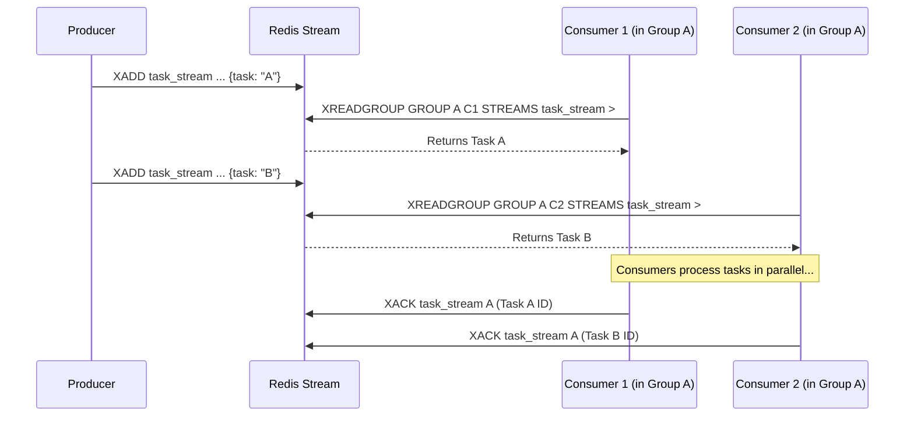

#### Explanation
Using Redis Streams as a task queue revolves around a few key commands:
1.  **`XADD`:** The producer adds a new task to the end of a stream. This is the equivalent of enqueuing a task.
2.  **Consumer Groups:** You create a "consumer group" for your stream. This allows multiple worker processes to consume from the same stream in a load-balanced fashion. Redis ensures that each message is delivered to only *one* consumer within the group.
3.  **`XREADGROUP`:** This is the "claim task" command for workers. A worker asks for the next message from the stream for its consumer group. Redis delivers the message and adds it to a "Pending Entries List" (PEL) for that consumer.
4.  **`XACK`:** After a worker successfully processes a task, it uses `XACK` to tell Redis that the message is done. Redis then removes it from the PEL.
5.  **Failure Handling:** If a worker crashes without calling `XACK`, the task remains in the PEL. A separate monitoring process can periodically scan the PEL for old entries (using `XPENDING`) and "claim" them for reprocessing by another worker (using `XCLAIM`).

#### Insights and Tips/Tricks
- **Handle the Pending Entries List (PEL):** The biggest operational challenge with Redis Streams is managing the PEL. You *must* have a process to handle "stuck" messages from crashed consumers. Without it, failed tasks will remain in the PEL forever and be lost.
- **Use Multiple Streams for Priority:** Redis Streams doesn't have a built-in priority system like a sorted set. The standard pattern is to create separate streams for each priority level (e.g., `tasks:p0`, `tasks:p1`) and have workers poll the high-priority streams first using the `BLOCK` argument in `XREADGROUP`.
- **Set a Max Length on Streams:** To prevent a stream from consuming all of Redis's memory, you can use the `MAXLEN` argument in `XADD` to cap its size, automatically evicting old entries. This is useful for tasks where old data is no longer relevant.

#### Questions and Answers
- **Q: What are the durability guarantees of Redis Streams?**
  **A:** By default, Redis is an in-memory store. If the server process restarts, you lose all data. You can enable persistence (AOF or RDB) to write data to disk. With AOF (Append Only File) set to sync `everysec`, you risk losing up to one second of tasks in a crash. This is a weaker guarantee than PostgreSQL's transactional commit but is often sufficient.
- **Q: How does `XREADGROUP` compare to PostgreSQL's `SKIP LOCKED`?**
  **A:** They achieve the same goal: distributing work to multiple consumers without contention. `XREADGROUP` is a purpose-built command for this, managed entirely by Redis. `SKIP LOCKED` is a more general-purpose database feature that we are cleverly using to build a queue. For this specific task, `XREADGROUP` is often more performant as it's optimized for this exact use case.

#### Implementation (Python)
This implementation uses the `redis-py` library to create a producer and a consumer for a Redis Streams-based task queue.

```python
# redis_queue.py
import redis
import json
import uuid
import os
import time

STREAM_KEY = "task_stream"
CONSUMER_GROUP = "worker_group"

class RedisTaskProducer:
    def __init__(self, redis_client):
        self.r = redis_client

    def enqueue(self, task_type: str, payload: dict):
        task_id = str(uuid.uuid4())
        task_body = {
            "task_id": task_id,
            "task_type": task_type,
            "payload": json.dumps(payload)
        }
        self.r.xadd(STREAM_KEY, task_body)
        print(f"Enqueued task {task_id}")
        return task_id

class RedisTaskConsumer:
    def __init__(self, redis_client):
        self.r = redis_client
        self.worker_id = f"worker-{os.getpid()}"
        
        # Ensure consumer group exists
        try:
            self.r.xgroup_create(STREAM_KEY, CONSUMER_GROUP, id='$', mkstream=True)
            print("Created consumer group.")
        except redis.exceptions.ResponseError as e:
            if "BUSYGROUP" not in str(e):
                raise
            print("Consumer group already exists.")

    def run(self):
        print(f"[{self.worker_id}] Starting to consume tasks...")
        while True:
            # Read one new message, block for up to 2 seconds if none are available
            response = self.r.xreadgroup(
                CONSUMER_GROUP,
                self.worker_id,
                {STREAM_KEY: '>'},
                count=1,
                block=2000 
            )
            
            if not response:
                continue

            stream, messages = response[0]
            message_id, task_data = messages[0]
            
            task_data = {k.decode(): v.decode() for k, v in task_data.items()}
            print(f"[{self.worker_id}] Claimed task {task_data['task_id']}")
            
            try:
                # --- Simulate Processing ---
                print(f"Processing task of type {task_data['task_type']}...")
                time.sleep(2)
                
                # Acknowledge successful processing
                self.r.xack(STREAM_KEY, CONSUMER_GROUP, message_id)
                print(f"[{self.worker_id}] Task {task_data['task_id']} completed and acknowledged.")
            except Exception as e:
                print(f"ERROR processing task {task_data['task_id']}: {e}")
                # In a real system, you'd add this to a DLQ or rely on XCLAIM
                # For now, we'll just acknowledge to remove it from the PEL
                self.r.xack(STREAM_KEY, CONSUMER_GROUP, message_id)

if __name__ == '__main__':
    r = redis.Redis(host='localhost', port=6379)
    # To run this, start one or more consumer scripts in separate terminals
    consumer = RedisTaskConsumer(r)
    consumer.run() 
    # And run a producer script to add tasks
    # producer = RedisTaskProducer(r)
    # producer.enqueue("send_email", {"to": "test@example.com"})
```

#### Related Patterns
- **Worker Assignment Strategies:** Consumer Groups are a perfect implementation of the pull-based assignment model.
- **Dead Letter Queue Patterns:** The combination of `XPENDING` and `XCLAIM` is the idiomatic Redis Streams way to implement a DLQ for tasks that time out.

---

### 3. Using Apache Kafka for Scalable Task Processing

#### Introduction
Apache Kafka is not just a message queue; it's a distributed streaming platform. While it can be used for simple task queuing, its true power lies in handling massive volumes of data in a partitioned, replicated, and highly scalable manner. Using Kafka as a task queue is ideal for systems that are part of a larger event-driven architecture, where tasks are often generated as a result of other event streams, and the results of tasks might generate new events.

#### Analogy
Think of a massive, multi-lane highway system for data.
- **PostgreSQL/Redis:** These are like city streets. They are effective for getting around town (a single application).
- **Apache Kafka:** This is the interstate highway system. It's designed to connect multiple cities (microservices) and handle a huge volume of traffic (data). Each lane on the highway is a "partition," allowing many cars (tasks) to travel in parallel. The highway has on-ramps and off-ramps (producers and consumers) everywhere.

#### Use Cases
- **Data-intensive processing pipelines:** When a task involves processing a large event from another Kafka topic (e.g., a 1MB JSON event).
- **Event-driven microservices:** When a task is one step in a longer chain of asynchronous service-to-service communication.
- **Systems requiring strict ordering within a subset of tasks:** Kafka guarantees order *within a partition*. You can use this to ensure all tasks related to a specific user (`user_id`) are processed in the order they were created by sending them all to the same partition.
- **Fan-out to multiple worker types:** The same `task_created` topic can be consumed by multiple, different consumer groups (e.g., a standard worker pool, an auditing service, and an analytics engine), each processing the task for its own purpose.

#### Mermaid Diagrams
**Kafka Partition-based Parallelism:**
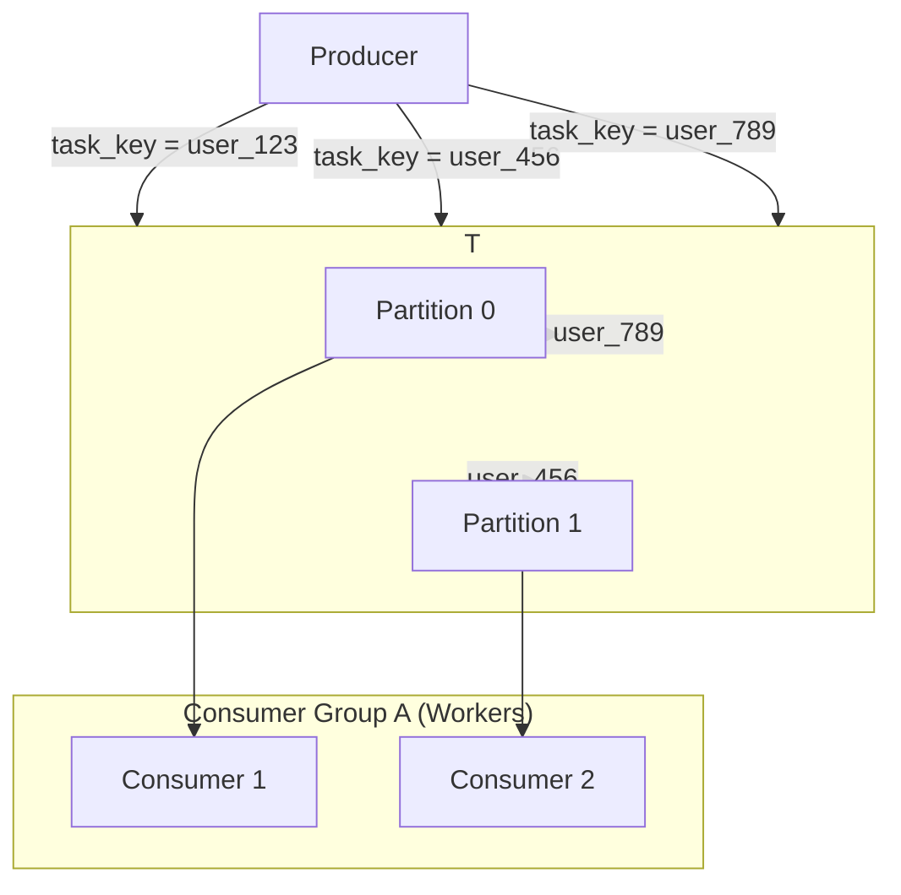

#### Explanation
Using Kafka as a task queue relies on its core concepts:
1.  **Topics:** A topic is a named stream of records. You would have a `tasks` topic.
2.  **Producers:** Applications that write (enqueue) task records to the topic.
3.  **Partitions:** A topic is split into multiple partitions. These are the unit of parallelism. Kafka distributes records across partitions based on a key. If you produce a task with `key='user-123'`, it will always go to the same partition.
4.  **Consumers and Consumer Groups:** Workers are consumers. By placing them in the same `group.id`, Kafka automatically balances the partitions across the available consumers. If you have 4 partitions and 2 consumers, each consumer will be assigned 2 partitions. If you add 2 more consumers, Kafka will rebalance so each consumer gets 1 partition. This is how Kafka achieves horizontal scaling.
5.  **Offsets and Commits:** Kafka tracks the position of each consumer group in each partition using an "offset." After a worker processes a task, it "commits the offset," telling Kafka it has successfully handled everything up to that point. This is how acknowledgments and at-least-once processing guarantees are handled.

#### Insights and Tips/Tricks
- **Choose Your Partition Key Wisely:** The partition key determines parallelism and ordering. A good key distributes data evenly. A common choice is a `user_id` or `session_id`. If you don't provide a key, Kafka uses round-robin, which is great for distribution but provides no ordering guarantees.
- **Manage Consumer Lag:** "Consumer lag" is the difference between the latest message in a partition and the offset of the consumer. It's the most critical metric to monitor. High lag means your workers are not keeping up with the workload.
- **Manual Commits for Reliability:** For task processing, you should almost always disable `enable.auto.commit` in the consumer and manually commit offsets *after* you have successfully processed the task. This changes the default "at-most-once" delivery to a more reliable "at-least-once."
- **Kafka is Complex:** Kafka has a steep learning curve and significant operational overhead (managing Zookeeper/KRaft, brokers, topics, etc.). Only choose it if your system's scale and architectural needs justify this complexity.

#### Questions and Answers
- **Q: How do I handle retries and DLQs in Kafka?**
  **A:** This is more complex than in other systems. A common pattern is to have a dedicated "retry topic" (`tasks-retry`) and a "dead-letter topic" (`tasks-dlq`). When a task fails, the consumer produces it to the retry topic. A separate consumer for the retry topic consumes messages, waits for an appropriate backoff period, and then produces them back to the main topic. If retries are exhausted, it's sent to the DLQ topic.
- **Q: Can I do priority queuing with Kafka?**
  **A:** Not easily. Like Redis Streams, the idiomatic way to handle priority is to create separate topics for each priority level (e.g., `tasks-high-priority`, `tasks-low-priority`) and have your workers consume from them accordingly.

#### Implementation (Python)
This implementation uses the `kafka-python` library. It demonstrates a producer that uses a partition key and a consumer that manually commits offsets.

```python
# kafka_queue.py
from kafka import KafkaProducer, KafkaConsumer
from kafka.admin import KafkaAdminClient, NewTopic
import json
import time

TOPIC_NAME = 'tasks_topic'
BOOTSTRAP_SERVERS = ['localhost:9092']

# Ensure topic exists (for demonstration purposes)
try:
    admin_client = KafkaAdminClient(bootstrap_servers=BOOTSTRAP_SERVERS)
    topic_list = [NewTopic(name=TOPIC_NAME, num_partitions=4, replication_factor=1)]
    admin_client.create_topics(new_topics=topic_list, validate_only=False)
    print(f"Topic '{TOPIC_NAME}' created or already exists.")
except Exception:
    print(f"Could not create topic '{TOPIC_NAME}'. Assuming it exists.")


class KafkaTaskProducer:
    def __init__(self):
        self.producer = KafkaProducer(
            bootstrap_servers=BOOTSTRAP_SERVERS,
            value_serializer=lambda v: json.dumps(v).encode('utf-8')
        )

    def enqueue(self, task_type: str, payload: dict, key: str):
        """Enqueues a task, using the key for partitioning."""
        message = {"task_type": task_type, "payload": payload}
        # The key is converted to bytes for the partitioner
        self.producer.send(TOPIC_NAME, value=message, key=key.encode('utf-8'))
        self.producer.flush()
        print(f"Enqueued task with key '{key}'")


class KafkaTaskConsumer:
    def __init__(self):
        self.consumer = KafkaConsumer(
            TOPIC_NAME,
            bootstrap_servers=BOOTSTRAP_SERVERS,
            group_id='worker_group',
            # Disable auto-commit to manually control when offsets are saved
            enable_auto_commit=False,
            value_deserializer=lambda m: json.loads(m.decode('utf-8'))
        )

    def run(self):
        print("Kafka consumer started...")
        for message in self.consumer:
            print(f"Consumed task: key={message.key.decode()}, value={message.value}")
            
            try:
                # --- Simulate processing ---
                print("Processing task...")
                time.sleep(1)
                
                # Manually commit the offset after successful processing
                self.consumer.commit()
                print("Task processed successfully, offset committed.")
            except Exception as e:
                print(f"ERROR processing task: {e}")
                # For failed tasks, we do NOT commit the offset.
                # When the consumer restarts or rebalances, it will receive this message again.
                # A real system would need a DLQ/retry topic here.
                # For simplicity, we'll just stop.
                break
```

#### Related Patterns
- **Event Sourcing for Task State:** Kafka is a natural fit for an Event Store, making this a powerful combination.
- **Saga Pattern:** Kafka is often used for choreographed Sagas, where services communicate via events on Kafka topics.
- **Task Dependencies & Workflows (DAGs):** A workflow orchestrator can enqueue tasks to Kafka topics, and workers can report their completion by producing events to a `task_results` topic.

---

## Production Considerations

### 1. Monitoring & Alerting in Production

#### Introduction
In a development environment, it's acceptable for tasks to fail silently. In production, it's a disaster. Production-grade monitoring and alerting is the set of patterns and tools that provide deep visibility into the health of your task system and proactively notify you of problems, often before they impact users. It is not an optional add-on; it is a fundamental requirement for building and operating a reliable system. It transforms the system from a black box into a glass box.

#### Analogy
Imagine you are the captain of a large container ship.
- **The System:** The ship and its engine.
- **Monitoring:** The entire bridge of the ship. It's filled with gauges for engine temperature and speed (metrics), a radar screen showing nearby ships (traffic), and a GPS showing your location and route (progress). This is your dashboard.
- **Alerting:** The loud alarm that goes off if the engine temperature exceeds a critical limit or the radar detects a collision course. This is your PagerDuty alert.

Without the bridge, you are sailing blind. You wouldn't know you're off course until you hit an iceberg. With the bridge, you can see the iceberg on the radar miles away and steer to avoid it.

#### Use Cases
- **Proactive Issue Detection:** An alert on "High Task Failure Rate" can notify you of a bug from a new deployment before a single customer complains.
- **Performance Debugging:** A dashboard showing a sudden spike in task latency correlated with a spike in database CPU can immediately tell you where to look for a performance bottleneck.
- **SLO/SLA Compliance:** Continuously measuring metrics like p99 task latency allows you to know if you are meeting your performance promises to your users.
- **Informed Scaling:** The metrics collected here are the direct input to your auto-scaling policies.

#### Mermaid Diagrams
**The Observability Stack:**
This shows the relationship between the key components of a modern monitoring stack.
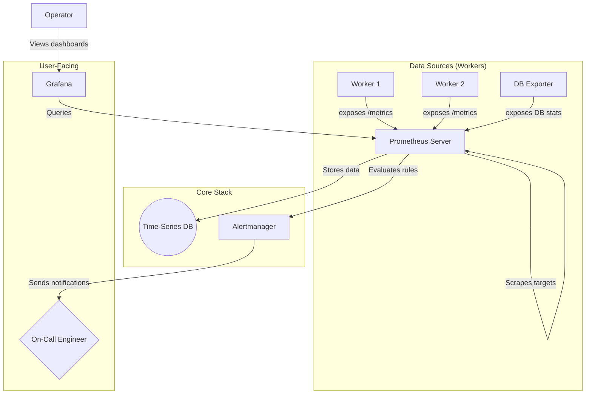

#### Explanation
A production monitoring system is built on three pillars:
1.  **Metrics:** Numerical, time-stamped data representing the state of the system. Workers are "instrumented" with client libraries (e.g., `prometheus-client`) to track key metrics (counters, gauges, histograms) and expose them on an HTTP endpoint.
2.  **Time-Series Database (TSDB):** A specialized database, like Prometheus, designed to efficiently store and query huge volumes of metrics data. It "scrapes" the metrics endpoints on a regular schedule.
3.  **Visualization and Alerting:**
    *   **Grafana:** A tool that queries the TSDB to create rich, interactive dashboards, allowing operators to visualize trends and correlate data.
    *   **Alertmanager:** A component of Prometheus that evaluates alerting rules (e.g., `queue_depth > 1000`). If a rule's condition is met for a sustained period, it de-duplicates, groups, and routes alerts to the correct notification channel (e.g., PagerDuty, Slack).

The key is to focus on the **Four Golden Signals**: Latency, Traffic, Errors, and Saturation.

#### Insights and Tips/Tricks
- **Your Dashboard is a Diagnostic Tool:** Design your dashboards top-down. The top should show the most critical, high-level system health indicators (the golden signals). As you scroll down, the graphs should become more detailed, allowing you to drill into specific task types or workers.
- **Make Alerts Actionable:** Every alert that fires should include a link to the relevant Grafana dashboard and a "playbook" that gives the on-call engineer initial steps for diagnosis. An alert that just says "CPU is high" is not helpful.
- **Log Correlation:** A killer feature of modern observability platforms is log correlation. When viewing a spike in errors on a Grafana dashboard, you should be able to click on the graph and be taken directly to the logs from that exact time period, filtered for the relevant task type.
- **Monitor the Exporter:** Don't forget to monitor your monitoring! Set up an alert to detect if Prometheus is unable to scrape one of your worker's `/metrics` endpoints.

#### Questions and Answers
- **Q: This sounds complicated. What's a simple first step?**
  **A:** Start by tracking just two metrics: a counter for `tasks_processed_total{status="success|failure"}` and a gauge for `tasks_pending_gauge`. Even with just these two, you can calculate throughput, failure rate, and queue depth. This will give you 80% of the value for 20% of the effort.
- **Q: Should I use a managed service (like Datadog) or self-host Prometheus/Grafana?**
  **A:** For most teams, a managed service like Datadog, New Relic, or Grafana Cloud is the better choice. They handle the complexity of scaling and managing the monitoring infrastructure, allowing you to focus on instrumenting your application and building useful dashboards. Self-hosting Prometheus is powerful but comes with significant operational overhead.

#### Implementation (Python / Prometheus)
This implementation shows how to define Prometheus alert rules and how to write a custom exporter for database metrics.

**1. Prometheus Alerting Rules (YAML):**
This file would be loaded by your Prometheus server.
```yaml
# alert_rules.yml
groups:
  - name: task_queue_alerts
    rules:
      - alert: HighQueueDepth
        # Fire if the queue depth has been over 500 for 5 minutes
        expr: tasks_pending_gauge > 500
        for: 5m
        labels:
          severity: warning
        annotations:
          summary: "Task queue depth is high ({{ $value }})"
          description: "The task queue has been over 500 for 5 minutes. The system may be falling behind."
          playbook_url: "http://internal-wiki/runbooks/high-queue-depth"

      - alert: HighTaskFailureRate
        # Fire if the 10-minute failure rate is over 5%
        expr: |
          sum(rate(tasks_processed_total{status="failure"}[10m]))
          /
          sum(rate(tasks_processed_total[10m])) > 0.05
        for: 2m
        labels:
          severity: critical
        annotations:
          summary: "Task failure rate is high ({{ $value | humanizePercentage }})"
          description: "More than 5% of all tasks are failing. A recent deployment may be buggy."
          dashboard_url: "http://grafana/dashboards/task-queue-health"
```

**2. Custom Python Exporter for PostgreSQL Metrics:**
This script connects to the database, runs a query, and exposes the result in the Prometheus text format.
```python
# db_metrics_exporter.py
from prometheus_client import start_http_server, Gauge
import psycopg2
import time

# Define a Gauge metric for queue depth, with a label for task_type
QUEUE_DEPTH = Gauge('tasks_pending_gauge', 'Number of pending tasks in the queue', ['task_type'])

def collect_db_metrics(dsn: str):
    """Connects to the DB and updates the Prometheus gauges."""
    print("Collecting DB metrics...")
    try:
        conn = psycopg2.connect(dsn)
        with conn.cursor() as cur:
            cur.execute(
                "SELECT task_type, COUNT(*) FROM tasks WHERE status = 'pending' GROUP BY task_type;"
            )
            # Set the gauge value for each task type
            for row in cur.fetchall():
                task_type, depth = row
                QUEUE_DEPTH.labels(task_type=task_type).set(depth)
        conn.close()
    except Exception as e:
        print(f"Error collecting DB metrics: {e}")

if __name__ == '__main__':
    DB_DSN = "dbname=tasks_db user=user password=pass host=localhost"
    
    # Start an HTTP server on port 8001
    start_http_server(8001)
    print("DB Metrics Exporter started on port 8001.")
    
    # Loop forever, collecting metrics every 30 seconds
    while True:
        collect_db_metrics(DB_DSN)
        time.sleep(30)
```

#### Related Patterns
- **Auto-scaling:** The metrics defined and collected here are the direct inputs for auto-scaling policies.
- **Dead Letter Queue:** The number of items in the DLQ is one of the most critical metrics to monitor and alert on.
- **All other patterns:** The health and performance of every pattern (retries, circuit breakers, workflows) should be made visible through metrics. Observability is what ties all the other patterns together in a manageable way.

---

### 2. Performance Optimization & Tuning

#### Introduction
Performance in a distributed task system is not just about raw speed; it's about efficiency, resource utilization, and cost-effectiveness. As a system scales, small inefficiencies can multiply into major bottlenecks and expensive cloud bills. Performance Optimization is the continuous process of measuring, identifying, and eliminating these bottlenecks across the entire stack, from the database and network to the worker code itself.

#### Analogy
Think of optimizing a factory assembly line.
- **The System:** The assembly line.
- **Initial State:** Each worker walks to a central parts bin, gets one part, walks back, assembles it, and repeats. This is slow and involves a lot of wasted movement.
- **Optimization:**
  - **Batching:** A runner brings a whole box of parts to each worker's station, reducing travel time.
  - **Connection Pooling:** Instead of getting a new screwdriver from the tool crib for every screw, each worker keeps a dedicated screwdriver at their station.
  - **Code Profiling:** The manager notices one worker is much slower. They observe their technique and find an inefficient movement, then train them to do it faster.

#### Use Cases
- **Reducing Database Load:** Lowering the number of queries per task to allow the database to serve more workers and the main application.
- **Improving Task Throughput:** Increasing the number of tasks a single worker can process per second.
- **Lowering Cloud Costs:** Achieving the same throughput with fewer, smaller workers, thus reducing compute and networking costs.
- **Decreasing Task Latency:** Making individual tasks run faster to improve the end-user experience for time-sensitive jobs.

#### Mermaid Diagrams
**Identifying and Addressing Bottlenecks:**
```mermaid
graph TD
    subgraph "Potential Bottlenecks"
        A[Network I/O]
        B[Database Contention]
        C[Worker CPU/Memory]
    end

    subgraph "Optimization Techniques"
        D[Batching & Caching]
        E[Connection Pooling & Indexing]
        F[Code Profiling & Algorithm Choice]
    end

    D --> A
    E --> B
    F --> C
```

#### Explanation
Optimization efforts should be guided by metrics and focused on three primary areas:
1.  **Database/Queue Interaction:** This is often the biggest bottleneck.
    *   **Connection Pooling:** Reusing database connections is mandatory. Establishing a connection is very expensive.
    *   **Batching:** Instead of fetching or updating one task at a time, process them in batches. Claiming 10 tasks in one query is far more efficient than running 10 separate queries.
    *   **Indexing:** Ensure all query patterns, especially the task claiming query, are fully supported by high-quality database indexes.
2.  **Network Communication:**
    *   **Payload Size:** Keep task payloads as small as possible. Instead of sending a 10MB file in the payload, upload the file to S3 and put the S3 URL in the payload.
    *   **Serialization:** Choose an efficient serialization format. `MessagePack` or `Protocol Buffers` are significantly faster and smaller than JSON, though less human-readable.
3.  **Worker-Side Code:**
    *   **Profiling:** Use a profiler (like Python's `cProfile`) to find "hot spots"—the specific lines of code where your worker is spending most of its time.
    *   **Caching:** If tasks repeatedly need the same piece of expensive-to-fetch data (e.g., user permissions), cache it in the worker's memory.

#### Insights and Tips/Tricks
- **Measure First:** Do not optimize without data. Use the metrics and monitoring from the previous pattern to identify your actual bottleneck. Optimizing CPU-bound code when your system is I/O-bound is a waste of time.
- **The Best Optimization is Doing Nothing:** Before making a task faster, ask if it needs to be run at all. Caching results of common, deterministic tasks can provide a massive performance boost.
- **Beware of Premature Optimization:** Focus first on a clean, correct, and simple implementation. Only apply these optimization patterns once you have a working system and metrics that prove a bottleneck exists.

#### Questions and Answers
- **Q: When is batching a bad idea?**
  **A:** Batching is less effective for long-running, heterogeneous tasks. If you claim a batch of 10 tasks where 9 take 1 second and one takes 10 minutes, those 9 completed tasks are stuck waiting for the slow one before the worker can acknowledge the batch, increasing their effective latency. Batching works best for a high volume of similar, fast-running tasks.
- **Q: How much faster is MessagePack than JSON?**
  **A:** The performance gain depends on the data structure, but it's common to see a 2-5x improvement in both serialization/deserialization speed and a 20-50% reduction in payload size.

#### Implementation (Python / SQL)
**1. SQL Function for Bulk Task Insertion:**
This is far more efficient than calling `INSERT` in a loop from the application.
```sql
-- bulk_insert.sql
CREATE OR REPLACE FUNCTION bulk_insert_tasks(tasks_to_insert JSONB)
RETURNS INTEGER AS $$
DECLARE
    task_record JSONB;
    inserted_count INTEGER := 0;
BEGIN
    FOR task_record IN SELECT * FROM jsonb_array_elements(tasks_to_insert)
    LOOP
        INSERT INTO tasks (id, task_type, payload, priority)
        VALUES (
            gen_random_uuid(),
            task_record->>'task_type',
            task_record->'payload',
            (task_record->>'priority')::INTEGER
        );
        inserted_count := inserted_count + 1;
    END LOOP;
    RETURN inserted_count;
END;
$$ LANGUAGE plpgsql;
```

**2. Python Worker Using Batch Claiming:**
Modify the `claim_task` function to fetch multiple tasks.
```python
# batch_worker.py
def claim_task_batch(conn, worker_id: str, batch_size: int = 10) -> list:
    """Atomically claims a batch of available tasks."""
    with conn.cursor(cursor_factory=psycopg2.extras.DictCursor) as cur:
        cur.execute(
            """
            WITH claimed_ids AS (
                SELECT id FROM tasks
                WHERE status = 'pending' AND scheduled_at <= NOW()
                ORDER BY priority DESC, scheduled_at ASC
                FOR UPDATE SKIP LOCKED LIMIT %s
            )
            UPDATE tasks
            SET status = 'processing', worker_id = %s, processing_started_at = NOW()
            WHERE id IN (SELECT id FROM claimed_ids)
            RETURNING *;
            """,
            (batch_size, worker_id)
        )
        tasks = cur.fetchall()
    conn.commit()
    return [dict(task) for task in tasks]

# --- Worker Loop ---
# while True:
#     task_batch = claim_task_batch(conn, worker_id, 10)
#     if not task_batch:
#         time.sleep(5)
#         continue
#
#     for task in task_batch:
#         process_task(task)
#         # Acknowledge each task individually or the whole batch at the end
```

#### Related Patterns
- **Metrics & Monitoring Patterns:** Provides the essential data needed to identify performance bottlenecks and measure the impact of optimizations.
- **Auto-scaling Patterns:** A more performant system can achieve the same results with fewer workers, directly impacting scaling decisions and cost.

---

### 3. Security for Task Systems

#### Introduction
Task processing systems are a prime target for attackers. They are often highly privileged, with access to databases, internal services, and sensitive data. A compromised worker could become a backdoor into your entire infrastructure. Security for task systems is the practice of applying security principles at every layer—from who can enqueue a task, to what a worker is allowed to do, to how the task data itself is protected.

#### Analogy
Think of a secure vault at a bank.
- **Authentication:** Only authorized bank employees with a specific keycard (worker credentials) can enter the vault room.
- **Authorization:** Inside the vault, an employee's keycard might only open safe deposit box #123 (access to a specific task type or data), not all of them. This is the principle of least privilege.
- **Data Protection:** The cash inside the deposit box is bundled in tamper-evident sealed bags (payload encryption). Even if someone gets into the box, they can't read or alter the contents without it being obvious.
- **Auditing:** Security cameras record everyone who enters and leaves the vault (audit logs).

#### Use Cases
- **Protecting Personally Identifiable Information (PII):** Ensuring that a task processing a user's data does not leak that data into logs or to unauthorized services.
- **Preventing Unauthorized Actions:** Stopping a low-privilege service from enqueuing a high-privilege task, like `delete_all_user_accounts`.
- **Securing Credentials:** Making sure that database passwords and API keys used by workers are not exposed in logs, task payloads, or source code.
- **Intrusion Detection:** Using audit logs to detect if a worker process starts behaving abnormally, such as trying to access data it shouldn't.

#### Mermaid Diagrams
**Layers of Security in a Task System:**
```mermaid
graph TD
    A[User/Service] -- 1. Authenticated Enqueue --> B{API Gateway}
    B -- 2. Authorization Check --> C[Task Queue]
    
    subgraph C
        direction LR
        D[Encrypted Payload]
    end

    E[Worker] -- 3. Authenticates --> F{Secrets Manager}
    F -- Returns DB credentials --> E
    E --> C
    E -- 4. Claims Encrypted Task --> D
    E -- Decrypts & Processes --> G[Database]
    
    H[Audit Log]
    B --> H
    E --> H
```

#### Explanation
Security must be applied at multiple layers:
1.  **Transport Security:** All communication between services (API to queue, worker to queue, worker to database) must use TLS to prevent eavesdropping.
2.  **Authentication:** Every actor needs to prove who they are.
    *   **Producers:** Services enqueuing tasks should authenticate to the queueing endpoint, perhaps with an API key or a JWT.
    *   **Workers:** Workers should authenticate to the queue and other backend services. They should retrieve their credentials from a secure secrets manager (like HashiCorp Vault or AWS Secrets Manager) on startup, not have them hardcoded.
3.  **Authorization (Principle of Least Privilege):**
    *   Producers should only be allowed to enqueue specific task types.
    *   Workers should have a narrowly scoped role. A worker that processes images shouldn't have credentials to access the billing database.
4.  **Data Protection:**
    *   **Payload Encryption:** For tasks with highly sensitive data, the payload should be encrypted *before* it's enqueued. The worker decrypts it just before processing. This provides "at-rest" encryption within the queue itself. The encryption key should be managed by a secrets manager.

#### Insights and Tips/Tricks
- **NEVER put secrets in a task payload:** A task payload should contain *what* to do (`user_id: 123`), not *how* to do it (the database password). The worker should already have the credentials it needs.
- **Log Sanitization:** Be extremely careful about what you log. A single `log.info(f"Processing task: {task_payload}")` can leak sensitive user data into your logs, which are often less secure than your primary database. Sanitize logs to remove PII.
- **Use short-lived credentials:** Instead of static passwords, have workers request temporary, short-lived credentials from a secrets manager. This dramatically reduces the risk if a credential is ever exposed.

#### Questions and Answers
- **Q: If I'm using a managed queue service like SQS, is it secure by default?**
  **A:** It provides a secure *foundation*, but you are still responsible for securing your usage of it. AWS provides the tools (IAM roles, KMS for encryption), but you must configure them correctly. You are responsible for the authorization logic (who can send to the queue) and the security of the worker that pulls from it.
- **Q: Doesn't encrypting the payload hurt performance?**
  **A:** Yes, there is a small performance overhead from encryption and decryption. However, for tasks involving sensitive data, the security benefit almost always outweighs the performance cost. Modern CPUs have hardware acceleration for cryptographic operations (AES-NI), which makes this overhead minimal for most workloads.

#### Implementation (Python)
This implementation shows a simple Python class for encrypting and decrypting task payloads using the `cryptography` library.

```python
# payload_security.py
import os
import json
from cryptography.fernet import Fernet

class TaskPayloadEncryptor:
    def __init__(self, key: bytes):
        if not key:
            raise ValueError("A valid encryption key must be provided.")
        self.cipher_suite = Fernet(key)

    def encrypt(self, payload: dict) -> bytes:
        """Encrypts a dictionary payload and returns bytes."""
        json_payload = json.dumps(payload).encode('utf-8')
        return self.cipher_suite.encrypt(json_payload)

    def decrypt(self, encrypted_payload: bytes) -> dict:
        """Decrypts a payload and returns a dictionary."""
        decrypted_json = self.cipher_suite.decrypt(encrypted_payload)
        return json.loads(decrypted_json.decode('utf-8'))

# --- Example Usage ---
if __name__ == '__main__':
    # In a real application, this key would be securely loaded from a secrets manager.
    # NEVER hardcode keys. Fernet.generate_key() can create a new one.
    ENCRYPTION_KEY = os.environ.get('TASK_ENCRYPTION_KEY')
    if not ENCRYPTION_KEY:
        print("TASK_ENCRYPTION_KEY environment variable not set. Exiting.")
        exit(1)
        
    encryptor = TaskPayloadEncryptor(ENCRYPTION_KEY.encode())

    original_payload = {
        "user_id": 123,
        "credit_card_last4": "4242",
        "action": "process_payment"
    }

    # In the producer:
    encrypted = encryptor.encrypt(original_payload)
    print(f"Original: {original_payload}")
    print(f"Encrypted (to be stored in queue): {encrypted}")
    
    # In the worker, after fetching from queue:
    decrypted = encryptor.decrypt(encrypted)
    print(f"Decrypted: {decrypted}")
    
    assert original_payload == decrypted
```

#### Related Patterns
- **Worker Pool Management:** The worker registration process can be secured to ensure only authorized worker images can join the pool.
- **Metrics & Monitoring:** Security events, such as failed authentication attempts or authorization denials, should be a critical part of your monitoring and alerting.

---

### 4. Disaster Recovery & Backup Strategies

#### Introduction
Disaster Recovery (DR) is the practice of planning for and recovering from a catastrophic failure that takes your entire primary system offline. This isn't about a single worker crashing; it's about losing an entire database, a data center, or a cloud provider's region. A robust DR plan ensures business continuity by defining how to fail over to a secondary system and how to restore data from backups, minimizing both data loss and downtime.

#### Analogy
Think of it as the fire safety plan for your house.
- **The Disaster:** Your house burns down.
- **Backup (Data):** You have photos and important documents stored in a fireproof safe and also backed up to a cloud service. This is your data backup.
- **Failover Site (Infrastructure):** You have an insurance policy that will pay for you to stay in a hotel while your house is rebuilt. This is your failover infrastructure.
- **Recovery Time Objective (RTO):** How long does it take to check into the hotel? An hour? A day? This is your RTO.
- **Recovery Point Objective (RPO):** The photos in the cloud were synced up until 10 minutes before the fire. You lost the last 10 minutes of photos. This is your RPO.

#### Use Cases
- **Surviving a Cloud Region Outage:** An AWS, GCP, or Azure region becomes completely unavailable due to a natural disaster or a major technical failure.
- **Recovering from Data Corruption:** A bug in a deployment silently corrupts a large amount of data in your primary database, and you need to restore to a known-good state from yesterday.
- **Recovering from a Ransomware Attack:** Your primary database is encrypted by an attacker, and your only option is to restore from a secure, isolated backup.

#### Mermaid Diagrams
**Multi-Region Failover Architecture:**
```mermaid
graph TD
    subgraph "Region A (Primary)"
        P[Primary DB] --Replicates--> R
        W1[Worker Pool A] --> P
    end

    subgraph "Region B (Replica)"
        R[Replica DB]
        W2[Worker Pool B (Standby)]
    end

    subgraph "Control Plane"
        H{Health Checker} --Monitors--> P
        DNS[Route 53 / Cloud DNS]
    end

    H --On Failure--> T(Trigger Failover)
    T -->|1. Promote Replica| R
    T -->|2. Redirect Traffic| DNS
    DNS --> W2
    W2 --> R
```

#### Explanation
A DR strategy consists of two main components:
1.  **Backups:** Regularly taking a complete copy of your critical data (your `tasks` table and any related application data) and storing it in a separate, secure location (preferably a different geographic region). This is your defense against data corruption or deletion. Key metrics are:
    *   **Recovery Point Objective (RPO):** How much data can you afford to lose? If you back up every 24 hours, your RPO is 24 hours.
2.  **Failover Infrastructure:** Having a pre-configured "hot" or "warm" standby environment in a different region. This is your defense against infrastructure failure. Key metrics are:
    *   **Recovery Time Objective (RTO):** How quickly must you be back online? A hot standby (with live, replicating infrastructure) can have an RTO of minutes, while restoring from a backup might take hours.

For a task queue, this means having a replica of your queueing database in a different region and a standby pool of workers ready to be activated.

#### Insights and Tips/Tricks
- **Test Your DR Plan:** A backup you've never tried to restore from is not a backup. A failover plan you've never tested will not work. You must regularly schedule DR drills where you practice failing over to the secondary region and restoring from backups.
- **Isolate Your Backups:** Backups should be stored in a separate account or location with different credentials. This protects them from being deleted or encrypted if your primary account is compromised.
- **Automate Everything:** Both the backup process and the failover process should be fully automated with scripts. In a real disaster, you don't want to be trying to remember commands from a runbook under extreme pressure.

#### Questions and Answers
- **Q: What is the difference between High Availability (HA) and Disaster Recovery (DR)?**
  **A:** **HA** is about surviving small, common failures *within* a single region (e.g., a server crashing, a disk failing). It's typically an automatic, fast process. **DR** is about surviving large, rare failures that take out an *entire* region. It's often a more manual, slower process with a goal of business survival.
- **Q: Does my task queue need a multi-region DR plan?**
  **A:** It depends on the RTO/RPO of the applications that rely on it. If your main application has a multi-region DR plan, your task queue system *must* have one too. Otherwise, you'll successfully fail over your stateless application servers, but they'll have no backend task processor to talk to, and the system will still be down.

#### Implementation (Bash / YAML)
**1. Automated PostgreSQL Backup Script:**
This script uses `pg_dump` to create a compressed backup and upload it to a cloud storage bucket.
```bash
#!/bin/bash
# backup_tasks_db.sh

set -e
set -o pipefail

DB_HOST="your-db-host.region.rds.amazonaws.com"
DB_USER="backup_user"
DB_NAME="tasks_db"
S3_BUCKET="s3://my-company-db-backups-region-b"

TIMESTAMP=$(date +"%Y-%m-%dT%H:%M:%S")
FILENAME="tasks_db_backup_${TIMESTAMP}.sql.gz"
BACKUP_PATH="/tmp/${FILENAME}"

echo "Starting backup of database '${DB_NAME}'..."

# Set the password from an environment variable to avoid it in logs/scripts
export PGPASSWORD=$DB_BACKUP_PASSWORD

# Dump the database, compress it with gzip, and save to a temporary file
pg_dump -h "$DB_HOST" -U "$DB_USER" -d "$DB_NAME" --clean | gzip -9 > "$BACKUP_PATH"

echo "Backup created at ${BACKUP_PATH}"

# Upload the backup to S3
aws s3 cp "$BACKUP_PATH" "${S3_BUCKET}/${FILENAME}"

# Clean up the local file
rm "$BACKUP_PATH"

echo "Backup successfully uploaded to ${S3_BUCKET}"
```

**2. Docker Compose for a Simple HA Setup:**
This shows how to define a primary database with a streaming replica. This is a form of High Availability that is a prerequisite for a fast DR failover.
```yaml
# docker-compose-ha.yml
version: '3.8'

services:
  primary-db:
    image: postgres:14
    container_name: primary_db
    environment:
      - POSTGRES_USER=user
      - POSTGRES_PASSWORD=pass
      - POSTGRES_DB=tasks
      - PGDATA=/var/lib/postgresql/data/pgdata
    volumes:
      - primary_data:/var/lib/postgresql/data/pgdata
    command: >
      -c wal_level=replica
      -c max_wal_senders=10
      -c hot_standby=on

  replica-db:
    image: postgres:14
    container_name: replica_db
    ports:
      - "5433:5432" # Expose replica on a different host port
    depends_on:
      - primary-db
    environment:
      - POSTGRES_USER=user
      - POSTGRES_PASSWORD=pass
      - PGDATA=/var/lib/postgresql/data/pgdata
    volumes:
      - replica_data:/var/lib/postgresql/data/pgdata
    command: >
      bash -c "until pg_basebackup --pgdata=/var/lib/postgresql/data/pgdata -R --slot=replication_slot --host=primary-db --port=5432 -U user; do sleep 1; done && postgres"

volumes:
  primary_data:
  replica_data:
```

#### Related Patterns
- **Monitoring & Alerting:** Your monitoring system is responsible for detecting the disaster and triggering the alert that initiates the DR plan.
- **All other patterns:** In a DR scenario, your entire system—workers, queues, orchestrators—needs to be brought up in the failover region. Your infrastructure-as-code and deployment automation are critical for making this possible.

---

## References

### Academic Papers
- **"Reliable Task Scheduling in Distributed Systems"** - MIT Computer Science
- **"Circuit Breaker Pattern in Microservices Architecture"** - Microsoft Research
- **"Consensus Algorithms for Distributed Task Queues"** - Stanford Distributed Systems
- **"Event Sourcing and CQRS Patterns"** - Martin Fowler, ThoughtWorks

### Industry Best Practices
- **Google Cloud Tasks**: https://cloud.google.com/tasks/docs/queue-yaml
- **Amazon SQS Design Principles**: https://docs.aws.amazon.com/sqs/latest/dg/sqs-best-practices.html
- **Apache Kafka Patterns**: https://kafka.apache.org/documentation/#uses
- **Redis Streams Documentation**: https://redis.io/topics/streams-intro

### Open Source References
- **Celery (Python)**: https://github.com/celery/celery - Distributed task queue
- **Sidekiq (Ruby)**: https://github.com/mperham/sidekiq - Background job processor
- **Bull (Node.js)**: https://github.com/OptimalBits/bull - Redis-based queue
- **Apache Airflow**: https://github.com/apache/airflow - Workflow orchestration
- **Temporal**: https://github.com/temporalio/temporal - Workflow engine

### Technology Documentation
- **PostgreSQL**: https://www.postgresql.org/docs/current/
- **Redis**: https://redis.io/documentation
- **Apache Kafka**: https://kafka.apache.org/documentation/
- **RabbitMQ**: https://www.rabbitmq.com/documentation.html
- **Docker**: https://docs.docker.com/
- **Kubernetes**: https://kubernetes.io/docs/

### Monitoring & Observability
- **Prometheus**: https://prometheus.io/docs/
- **Grafana**: https://grafana.com/docs/
- **Jaeger**: https://www.jaegertracing.io/docs/
- **OpenTelemetry**: https://opentelemetry.io/docs/

---

**Document Version**: 3.0
**Last Updated**: 2025-01-27
**Authors**: Distributed Systems Engineering Team
**License**: MIT License

---

*This document represents a comprehensive compilation of distributed task execution patterns derived from production systems handling millions of tasks daily. The patterns are technology-agnostic and have been validated across multiple platforms and architectures.*